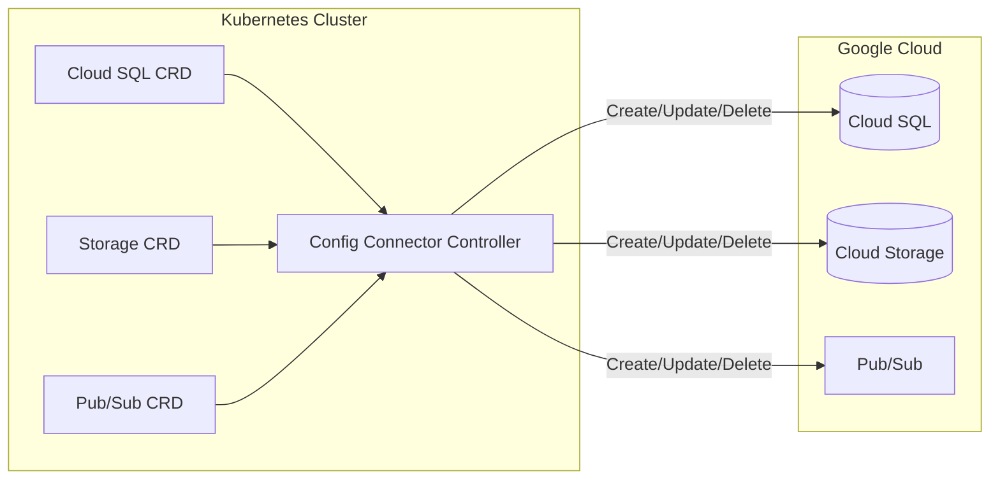
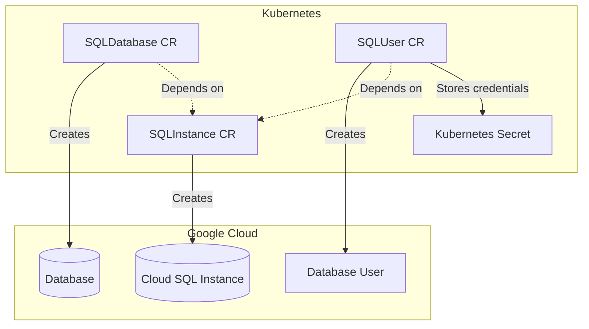
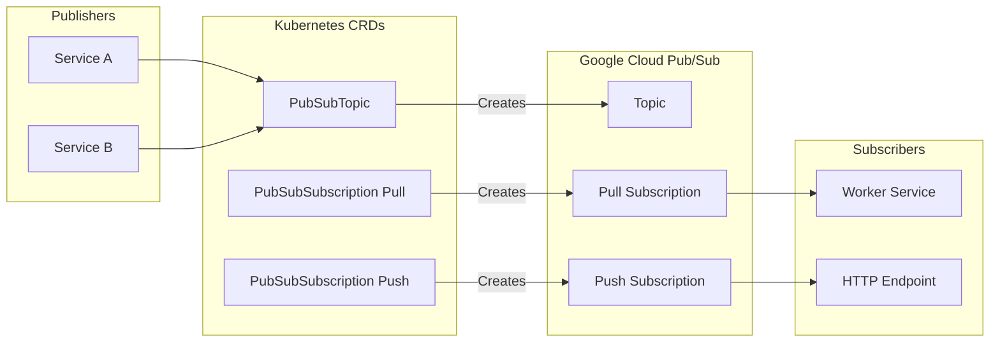

# How to Create GKE Config Connector

Author: [nawazdhandala](https://github.com/nawazdhandala)

Tags: GKE, Config Connector, Kubernetes, GCP

Description: Learn how to manage Google Cloud resources like Cloud SQL, Cloud Storage, and Pub/Sub directly from Kubernetes using GKE Config Connector.

---

GKE Config Connector lets you manage Google Cloud resources using Kubernetes manifests. Instead of switching between `kubectl` and `gcloud`, you describe everything in YAML and let Kubernetes handle the provisioning. Your infrastructure becomes part of your GitOps workflow.

## What Is Config Connector?

Config Connector is a Kubernetes addon that maps Google Cloud resources to Kubernetes Custom Resource Definitions (CRDs). When you create a Config Connector resource in your cluster, it provisions the corresponding resource in Google Cloud. When you delete it, the cloud resource gets cleaned up.



### Why Use Config Connector?

1. **Single source of truth** - All infrastructure lives in Git alongside your application manifests
2. **Kubernetes-native** - Use familiar tools like kubectl, Helm, and ArgoCD
3. **Declarative** - Describe what you want, not how to get there
4. **Automatic drift detection** - Config Connector continuously reconciles actual state with desired state
5. **RBAC integration** - Use Kubernetes RBAC to control who can create cloud resources

## Installing Config Connector

### Prerequisites

- GKE cluster (Standard or Autopilot)
- Workload Identity enabled on the cluster
- Google Cloud project with billing enabled

### Option 1: Enable During Cluster Creation

```bash
gcloud container clusters create my-cluster \
  --region us-central1 \
  --workload-pool=PROJECT_ID.svc.id.goog \
  --addons=ConfigConnector
```

### Option 2: Enable on Existing Cluster

```bash
# Enable Workload Identity if not already enabled
gcloud container clusters update my-cluster \
  --region us-central1 \
  --workload-pool=PROJECT_ID.svc.id.goog

# Enable Config Connector addon
gcloud container clusters update my-cluster \
  --region us-central1 \
  --update-addons=ConfigConnector=ENABLED
```

### Option 3: Install Manually with Operator

```bash
# Download and apply the Config Connector operator
gsutil cp gs://configconnector-operator/latest/release-bundle.tar.gz release-bundle.tar.gz
tar zxvf release-bundle.tar.gz
kubectl apply -f operator-system/configconnector-operator.yaml
```

## Setting Up Identity and Permissions

Config Connector needs a Google Cloud service account to create resources. You'll link this to a Kubernetes service account using Workload Identity.

### Create the Service Account

```bash
# Set variables
export PROJECT_ID=your-project-id
export SA_NAME=config-connector-sa

# Create service account
gcloud iam service-accounts create $SA_NAME \
  --display-name="Config Connector Service Account"

# Grant permissions (adjust based on what resources you need to manage)
gcloud projects add-iam-policy-binding $PROJECT_ID \
  --member="serviceAccount:$SA_NAME@$PROJECT_ID.iam.gserviceaccount.com" \
  --role="roles/editor"

# For production, use more restrictive roles:
# - roles/cloudsql.admin for Cloud SQL
# - roles/storage.admin for Cloud Storage
# - roles/pubsub.admin for Pub/Sub
```

### Configure Workload Identity Binding

```bash
# Allow the Kubernetes service account to impersonate the GCP service account
gcloud iam service-accounts add-iam-policy-binding \
  $SA_NAME@$PROJECT_ID.iam.gserviceaccount.com \
  --member="serviceAccount:$PROJECT_ID.svc.id.goog[cnrm-system/cnrm-controller-manager]" \
  --role="roles/iam.workloadIdentityUser"
```

### Create ConfigConnectorContext

Apply this to configure Config Connector for your namespace:

```yaml
apiVersion: core.cnrm.cloud.google.com/v1beta1
kind: ConfigConnectorContext
metadata:
  name: configconnectorcontext.core.cnrm.cloud.google.com
  namespace: default
spec:
  googleServiceAccount: "config-connector-sa@PROJECT_ID.iam.gserviceaccount.com"
```

For cluster-wide configuration:

```yaml
apiVersion: core.cnrm.cloud.google.com/v1beta1
kind: ConfigConnector
metadata:
  name: configconnector.core.cnrm.cloud.google.com
spec:
  mode: cluster
  googleServiceAccount: "config-connector-sa@PROJECT_ID.iam.gserviceaccount.com"
```

## Managing Cloud SQL from Kubernetes

Cloud SQL is one of the most common resources to manage with Config Connector. Here's how to create a PostgreSQL instance with a database and user.

### Resource Management Flow



### Create a Cloud SQL Instance

```yaml
apiVersion: sql.cnrm.cloud.google.com/v1beta1
kind: SQLInstance
metadata:
  name: my-postgres-instance
  namespace: default
spec:
  databaseVersion: POSTGRES_15
  region: us-central1
  settings:
    tier: db-f1-micro
    diskSize: 10
    diskType: PD_SSD
    availabilityType: ZONAL
    backupConfiguration:
      enabled: true
      startTime: "02:00"
      pointInTimeRecoveryEnabled: true
    ipConfiguration:
      ipv4Enabled: true
      requireSsl: true
      authorizedNetworks:
        - name: office
          value: "203.0.113.0/24"
    maintenanceWindow:
      day: 7
      hour: 3
    databaseFlags:
      - name: max_connections
        value: "100"
      - name: log_checkpoints
        value: "on"
```

### Create a Database

```yaml
apiVersion: sql.cnrm.cloud.google.com/v1beta1
kind: SQLDatabase
metadata:
  name: myapp-database
  namespace: default
spec:
  instanceRef:
    name: my-postgres-instance
  charset: UTF8
  collation: en_US.UTF8
```

### Create a Database User

```yaml
apiVersion: sql.cnrm.cloud.google.com/v1beta1
kind: SQLUser
metadata:
  name: myapp-user
  namespace: default
spec:
  instanceRef:
    name: my-postgres-instance
  host: "%"
  password:
    valueFrom:
      secretKeyRef:
        name: sql-user-password
        key: password
```

Create the secret for the password:

```bash
kubectl create secret generic sql-user-password \
  --from-literal=password=$(openssl rand -base64 24)
```

### Complete Cloud SQL Setup

Here's a complete example with all resources:

```yaml
---
apiVersion: v1
kind: Secret
metadata:
  name: sql-credentials
  namespace: default
type: Opaque
stringData:
  password: "your-secure-password-here"

---
apiVersion: sql.cnrm.cloud.google.com/v1beta1
kind: SQLInstance
metadata:
  name: production-db
  namespace: default
  annotations:
    cnrm.cloud.google.com/deletion-policy: "abandon"
spec:
  databaseVersion: POSTGRES_15
  region: us-central1
  settings:
    tier: db-custom-2-7680
    diskSize: 50
    diskType: PD_SSD
    availabilityType: REGIONAL
    backupConfiguration:
      enabled: true
      startTime: "03:00"
      pointInTimeRecoveryEnabled: true
      transactionLogRetentionDays: 7
      backupRetentionSettings:
        retainedBackups: 7
    ipConfiguration:
      ipv4Enabled: false
      privateNetworkRef:
        name: my-vpc-network

---
apiVersion: sql.cnrm.cloud.google.com/v1beta1
kind: SQLDatabase
metadata:
  name: app-database
  namespace: default
spec:
  instanceRef:
    name: production-db

---
apiVersion: sql.cnrm.cloud.google.com/v1beta1
kind: SQLUser
metadata:
  name: app-user
  namespace: default
spec:
  instanceRef:
    name: production-db
  password:
    valueFrom:
      secretKeyRef:
        name: sql-credentials
        key: password
```

## Managing Cloud Storage from Kubernetes

Config Connector makes it easy to create and configure Cloud Storage buckets with proper access controls.

### Create a Storage Bucket

```yaml
apiVersion: storage.cnrm.cloud.google.com/v1beta1
kind: StorageBucket
metadata:
  name: my-app-assets
  namespace: default
  annotations:
    cnrm.cloud.google.com/force-destroy: "false"
spec:
  location: US
  storageClass: STANDARD
  uniformBucketLevelAccess: true
  versioning:
    enabled: true
  lifecycle:
    rule:
      - action:
          type: Delete
        condition:
          age: 365
          isLive: false
      - action:
          type: SetStorageClass
          storageClass: NEARLINE
        condition:
          age: 30
          matchesStorageClass:
            - STANDARD
  cors:
    - origin:
        - "https://myapp.example.com"
      method:
        - GET
        - HEAD
      responseHeader:
        - Content-Type
      maxAgeSeconds: 3600
```

### Grant Access with IAM

```yaml
apiVersion: storage.cnrm.cloud.google.com/v1beta1
kind: StorageBucketAccessControl
metadata:
  name: my-app-assets-reader
  namespace: default
spec:
  bucketRef:
    name: my-app-assets
  entity: user-reader@example.com
  role: READER
```

Or use IAM policies for more complex scenarios:

```yaml
apiVersion: iam.cnrm.cloud.google.com/v1beta1
kind: IAMPolicyMember
metadata:
  name: bucket-viewer
  namespace: default
spec:
  member: serviceAccount:my-app@PROJECT_ID.iam.gserviceaccount.com
  role: roles/storage.objectViewer
  resourceRef:
    apiVersion: storage.cnrm.cloud.google.com/v1beta1
    kind: StorageBucket
    name: my-app-assets
```

### Create Bucket for Application Logs

```yaml
apiVersion: storage.cnrm.cloud.google.com/v1beta1
kind: StorageBucket
metadata:
  name: app-logs-bucket
  namespace: default
spec:
  location: US
  storageClass: STANDARD
  uniformBucketLevelAccess: true
  retentionPolicy:
    retentionPeriod: 2592000  # 30 days in seconds
  lifecycle:
    rule:
      - action:
          type: Delete
        condition:
          age: 90
      - action:
          type: SetStorageClass
          storageClass: COLDLINE
        condition:
          age: 30
```

## Managing Pub/Sub from Kubernetes

Pub/Sub is perfect for event-driven architectures. Config Connector lets you manage topics, subscriptions, and schemas.

### Pub/Sub Resource Flow



### Create a Pub/Sub Topic

```yaml
apiVersion: pubsub.cnrm.cloud.google.com/v1beta1
kind: PubSubTopic
metadata:
  name: order-events
  namespace: default
spec:
  messageRetentionDuration: "86400s"  # 24 hours
  messageStoragePolicy:
    allowedPersistenceRegions:
      - us-central1
      - us-east1
```

### Create a Push Subscription

```yaml
apiVersion: pubsub.cnrm.cloud.google.com/v1beta1
kind: PubSubSubscription
metadata:
  name: order-processor
  namespace: default
spec:
  topicRef:
    name: order-events
  ackDeadlineSeconds: 60
  messageRetentionDuration: "604800s"  # 7 days
  retainAckedMessages: false
  pushConfig:
    pushEndpoint: "https://order-processor.myapp.example.com/webhook"
    attributes:
      x-goog-version: v1
    oidcToken:
      serviceAccountEmail: "pubsub-invoker@PROJECT_ID.iam.gserviceaccount.com"
  retryPolicy:
    minimumBackoff: "10s"
    maximumBackoff: "600s"
```

### Create a Pull Subscription with Dead Letter

```yaml
---
apiVersion: pubsub.cnrm.cloud.google.com/v1beta1
kind: PubSubTopic
metadata:
  name: order-events-dlq
  namespace: default

---
apiVersion: pubsub.cnrm.cloud.google.com/v1beta1
kind: PubSubSubscription
metadata:
  name: order-processor-pull
  namespace: default
spec:
  topicRef:
    name: order-events
  ackDeadlineSeconds: 30
  messageRetentionDuration: "604800s"
  expirationPolicy:
    ttl: ""  # Never expires
  deadLetterPolicy:
    deadLetterTopicRef:
      name: order-events-dlq
    maxDeliveryAttempts: 5
  retryPolicy:
    minimumBackoff: "10s"
    maximumBackoff: "600s"
```

### Complete Event-Driven Architecture

```yaml
---
# Main topic for order events
apiVersion: pubsub.cnrm.cloud.google.com/v1beta1
kind: PubSubTopic
metadata:
  name: orders
  namespace: default
spec:
  messageRetentionDuration: "86400s"

---
# Dead letter topic
apiVersion: pubsub.cnrm.cloud.google.com/v1beta1
kind: PubSubTopic
metadata:
  name: orders-dlq
  namespace: default

---
# Subscription for payment processing
apiVersion: pubsub.cnrm.cloud.google.com/v1beta1
kind: PubSubSubscription
metadata:
  name: orders-payment-processor
  namespace: default
spec:
  topicRef:
    name: orders
  filter: 'attributes.type = "payment"'
  ackDeadlineSeconds: 60
  deadLetterPolicy:
    deadLetterTopicRef:
      name: orders-dlq
    maxDeliveryAttempts: 5

---
# Subscription for inventory updates
apiVersion: pubsub.cnrm.cloud.google.com/v1beta1
kind: PubSubSubscription
metadata:
  name: orders-inventory-updater
  namespace: default
spec:
  topicRef:
    name: orders
  filter: 'attributes.type = "inventory"'
  ackDeadlineSeconds: 30
  deadLetterPolicy:
    deadLetterTopicRef:
      name: orders-dlq
    maxDeliveryAttempts: 3

---
# Subscription for analytics (receives all messages)
apiVersion: pubsub.cnrm.cloud.google.com/v1beta1
kind: PubSubSubscription
metadata:
  name: orders-analytics
  namespace: default
spec:
  topicRef:
    name: orders
  ackDeadlineSeconds: 120
  messageRetentionDuration: "604800s"
  retainAckedMessages: true
```

## Managing Multiple Resource Types Together

Real applications need multiple cloud resources working together. Here's an example of a complete backend infrastructure.

```yaml
---
# VPC Network
apiVersion: compute.cnrm.cloud.google.com/v1beta1
kind: ComputeNetwork
metadata:
  name: app-network
  namespace: default
spec:
  autoCreateSubnetworks: false

---
# Subnetwork
apiVersion: compute.cnrm.cloud.google.com/v1beta1
kind: ComputeSubnetwork
metadata:
  name: app-subnet
  namespace: default
spec:
  region: us-central1
  networkRef:
    name: app-network
  ipCidrRange: "10.0.0.0/24"
  privateIpGoogleAccess: true

---
# Service Account for the application
apiVersion: iam.cnrm.cloud.google.com/v1beta1
kind: IAMServiceAccount
metadata:
  name: myapp-sa
  namespace: default
spec:
  displayName: "My Application Service Account"

---
# Cloud SQL Instance
apiVersion: sql.cnrm.cloud.google.com/v1beta1
kind: SQLInstance
metadata:
  name: myapp-db
  namespace: default
spec:
  databaseVersion: POSTGRES_15
  region: us-central1
  settings:
    tier: db-custom-2-7680
    ipConfiguration:
      ipv4Enabled: false
      privateNetworkRef:
        name: app-network

---
# Storage Bucket for uploads
apiVersion: storage.cnrm.cloud.google.com/v1beta1
kind: StorageBucket
metadata:
  name: myapp-uploads
  namespace: default
spec:
  location: US
  uniformBucketLevelAccess: true

---
# Grant storage access to service account
apiVersion: iam.cnrm.cloud.google.com/v1beta1
kind: IAMPolicyMember
metadata:
  name: myapp-storage-access
  namespace: default
spec:
  member: serviceAccount:myapp-sa@PROJECT_ID.iam.gserviceaccount.com
  role: roles/storage.objectAdmin
  resourceRef:
    apiVersion: storage.cnrm.cloud.google.com/v1beta1
    kind: StorageBucket
    name: myapp-uploads

---
# Pub/Sub topic for events
apiVersion: pubsub.cnrm.cloud.google.com/v1beta1
kind: PubSubTopic
metadata:
  name: myapp-events
  namespace: default
```

## Handling Existing Resources

Sometimes you need to manage resources that already exist in Google Cloud. Config Connector supports adopting existing resources.

### Adopt an Existing Resource

Add the `cnrm.cloud.google.com/project-id` annotation and match the resource name:

```yaml
apiVersion: storage.cnrm.cloud.google.com/v1beta1
kind: StorageBucket
metadata:
  name: existing-bucket-name
  namespace: default
  annotations:
    cnrm.cloud.google.com/project-id: "your-project-id"
spec:
  location: US
```

Config Connector will detect the existing bucket and start managing it.

### Abandon Resources on Delete

If you want to keep cloud resources when you delete the Kubernetes resource:

```yaml
apiVersion: sql.cnrm.cloud.google.com/v1beta1
kind: SQLInstance
metadata:
  name: production-db
  annotations:
    cnrm.cloud.google.com/deletion-policy: "abandon"
spec:
  # ...
```

## Checking Resource Status

Config Connector updates the status of each resource with information from Google Cloud.

### View Resource Status

```bash
# Check if resource is ready
kubectl get sqlinstance my-postgres-instance -o yaml

# Look at the status section
kubectl get sqlinstance my-postgres-instance -o jsonpath='{.status.conditions}'

# Get all Config Connector resources
kubectl get gcp
```

### Common Status Conditions

| Condition | Meaning |
|-----------|---------|
| Ready=True | Resource exists and is configured correctly |
| Ready=False, Reason=UpdateFailed | Config Connector could not apply changes |
| Ready=False, Reason=DependencyNotReady | A referenced resource is not ready |

### Debugging Issues

```bash
# View Config Connector controller logs
kubectl logs -n cnrm-system -l cnrm.cloud.google.com/component=cnrm-controller-manager

# Check events for a resource
kubectl describe sqlinstance my-postgres-instance
```

## Best Practices

### 1. Use Namespaces for Environments

```yaml
# Create namespace with project annotation
apiVersion: v1
kind: Namespace
metadata:
  name: production
  annotations:
    cnrm.cloud.google.com/project-id: "prod-project-id"
```

### 2. Set Deletion Policies for Critical Resources

Always protect production databases:

```yaml
metadata:
  annotations:
    cnrm.cloud.google.com/deletion-policy: "abandon"
```

### 3. Use Resource References

Link resources together using refs instead of hardcoding names:

```yaml
spec:
  instanceRef:
    name: my-instance
  # Not: instance: projects/proj/instances/my-instance
```

### 4. Enable State Into Spec

Get the current state of existing resources:

```yaml
metadata:
  annotations:
    cnrm.cloud.google.com/state-into-spec: "merge"
```

### 5. Organize with Labels

```yaml
metadata:
  labels:
    app: myapp
    environment: production
    team: backend
```

## Troubleshooting

### Resource Stuck in Updating

```bash
# Check controller logs
kubectl logs -n cnrm-system deployment/cnrm-controller-manager -c manager

# Force reconciliation
kubectl annotate sqlinstance my-instance cnrm.cloud.google.com/force-reconcile=$(date +%s) --overwrite
```

### Permission Denied Errors

```bash
# Verify service account has correct permissions
gcloud projects get-iam-policy PROJECT_ID \
  --flatten="bindings[].members" \
  --filter="bindings.members:config-connector-sa@"
```

### Resource Not Creating

Check that:
1. The Config Connector controller is running
2. The namespace has a ConfigConnectorContext
3. The service account has the required permissions
4. All referenced resources exist and are ready

---

Config Connector brings your Google Cloud infrastructure into the Kubernetes ecosystem. Start with a few simple resources, build confidence with the workflow, and gradually expand to manage your entire cloud infrastructure through Git. The declarative approach and automatic reconciliation make it a solid foundation for GitOps on GCP.
