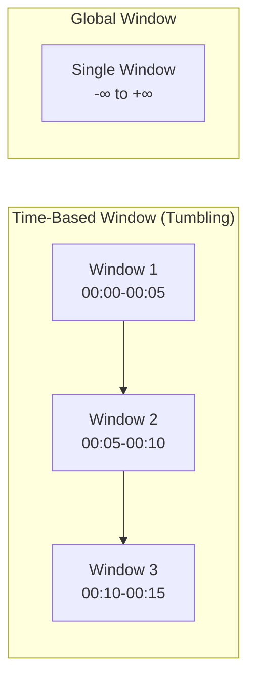
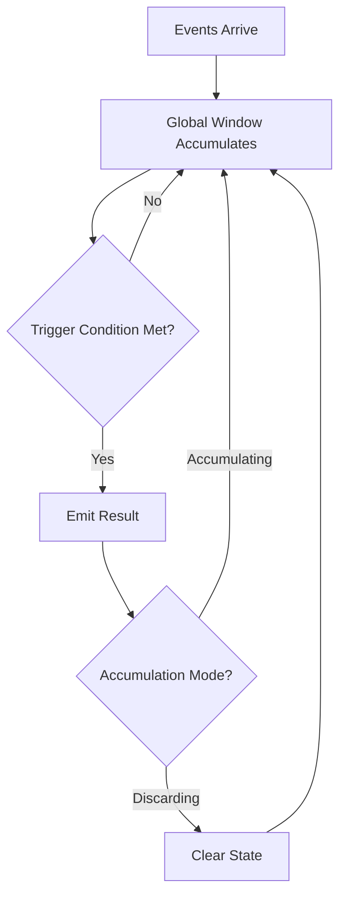
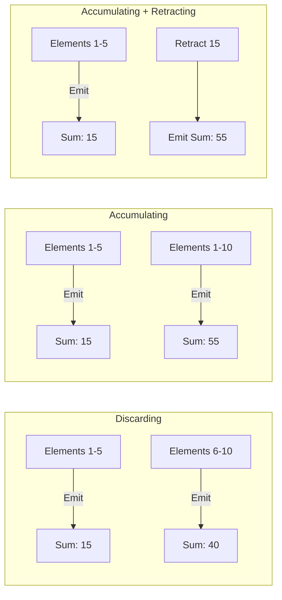
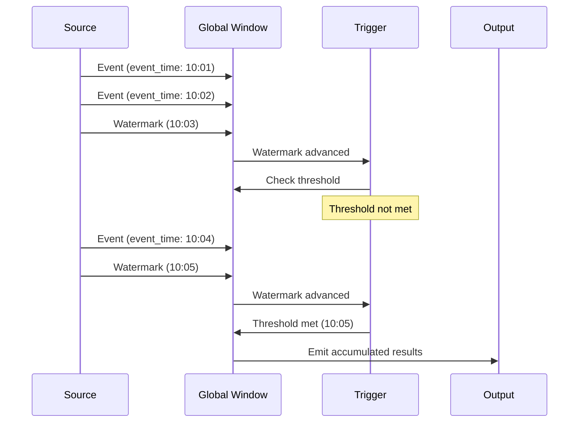

# How to Create Global Windows in Stream Processing

Author: [nawazdhandala](https://github.com/nawazdhandala)

Tags: Stream Processing, Windowing, Analytics, Data

Description: A practical guide to implementing global windows for unbounded data streams with trigger-based emission, custom triggers, and accumulation modes.

---

Most windowing strategies slice time into fixed chunks: tumbling windows, sliding windows, session windows. But what if you need a window that never closes? What if you want to accumulate all events from the beginning of time and emit results based on custom conditions rather than clock boundaries?

That's where **global windows** come in.

Global windows are the simplest window type conceptually but the most flexible operationally. They assign every element to the same single window that spans from negative infinity to positive infinity. The catch? Without a trigger, a global window would never emit results (since it never "closes"). This makes trigger configuration essential.

This post walks through global window concepts, when to use them, how to implement triggers and accumulation modes, and practical patterns you can apply in Apache Beam, Flink, and custom stream processors.

---

## Table of Contents

1. What is a Global Window?
2. When to Use Global Windows
3. The Trigger Problem
4. Trigger Types and Strategies
5. Accumulation Modes
6. Implementation Examples
7. Global Windows with Watermarks
8. Common Patterns
9. Pitfalls and Solutions
10. Summary

---

## 1. What is a Global Window?

A global window assigns all elements to a single, never-ending window. Unlike tumbling or sliding windows that partition data by time intervals, a global window treats the entire stream as one continuous aggregation.



Key characteristics:

| Property | Time-Based Windows | Global Windows |
|----------|-------------------|----------------|
| Window boundaries | Clock-driven | None (infinite) |
| When to emit | Window close | Trigger fires |
| State lifetime | Until window closes | Potentially forever |
| Use case | Time aggregations | Event-driven aggregations |

---

## 2. When to Use Global Windows

Global windows shine when your aggregation logic does not align with time boundaries:

**Session-like behavior without gaps:** You want to group events by a business key and emit when certain conditions are met, not when time passes.

**Count-based aggregations:** Emit after every N elements regardless of when they arrive.

**External signal triggers:** Emit when an external system says "now" (e.g., a control message, a flag in the data).

**Accumulating totals:** Running totals that emit periodically but never reset (leaderboards, cumulative metrics).

**Watermark-driven emissions:** Emit when the watermark passes a certain event-time threshold.

Real-world examples:
- Gaming leaderboards: accumulate scores forever, emit top 10 every minute
- Fraud detection: accumulate user transactions, emit alert when anomaly score exceeds threshold
- Batch-within-stream: collect records until a "flush" signal arrives
- IoT aggregation: accumulate sensor readings until a calibration event

---

## 3. The Trigger Problem

Without triggers, global windows are useless. Since the window never closes, you must explicitly tell the system when to emit results.



The trigger answers: "When should we produce output?"

Common trigger conditions:
- **Element count:** After every N elements
- **Processing time:** Every N seconds/minutes of wall-clock time
- **Event time:** When watermark passes a threshold
- **Custom predicate:** When a specific condition in the data is true
- **Combination:** Any or all of the above

---

## 4. Trigger Types and Strategies

### Count Trigger

Fires after a fixed number of elements arrive.

```python
# Pseudocode
trigger = AfterCount(100)  # Emit after every 100 elements
```

Use case: Micro-batching, chunked processing.

### Processing Time Trigger

Fires based on wall-clock time.

```python
trigger = AfterProcessingTime(duration=timedelta(seconds=30))
```

Use case: Periodic snapshots, heartbeat emissions.

### Event Time Trigger

Fires when the watermark advances past a threshold.

```python
trigger = AfterWatermark()
```

Use case: Waiting for "late" data to arrive before emitting.

### Data-Driven Trigger

Fires when a condition in the data is met.

```python
trigger = AfterPredicate(lambda record: record.type == "FLUSH")
```

Use case: External control signals, end-of-batch markers.

### Composite Triggers

Combine triggers with AND/OR logic or sequences.

```python
# Fire after 100 elements OR 30 seconds, whichever comes first
trigger = AfterFirst(
    AfterCount(100),
    AfterProcessingTime(timedelta(seconds=30))
)

# Fire after watermark, then repeatedly every minute
trigger = AfterWatermark().withLateFirings(
    AfterProcessingTime(timedelta(minutes=1))
)
```

---

## 5. Accumulation Modes

When a trigger fires, what happens to the accumulated state?

### Discarding Mode

After each trigger firing, clear the state. Each emission contains only elements since the last firing.

```
Elements: [1, 2, 3, 4, 5, 6, 7, 8, 9, 10]
Trigger: AfterCount(5)
Emissions: [1,2,3,4,5], [6,7,8,9,10]
```

### Accumulating Mode

Keep the state after firing. Each emission contains all elements since the window started.

```
Elements: [1, 2, 3, 4, 5, 6, 7, 8, 9, 10]
Trigger: AfterCount(5)
Emissions: [1,2,3,4,5], [1,2,3,4,5,6,7,8,9,10]
```

### Accumulating and Retracting Mode

Emit the accumulated result AND a retraction of the previous result. Downstream consumers use retractions to update their state correctly.

```
Trigger fires at count 5:
  Emit: SUM=15
Trigger fires at count 10:
  Retract: SUM=15
  Emit: SUM=55
```



Choose based on downstream needs:
- **Discarding:** Downstream aggregates incremental updates
- **Accumulating:** Downstream replaces previous value entirely
- **Retracting:** Downstream maintains derived aggregations

---

## 6. Implementation Examples

### Apache Beam (Python)

```python
import apache_beam as beam
from apache_beam import window
from apache_beam.transforms.trigger import AfterCount, AfterProcessingTime
from apache_beam.transforms.trigger import AccumulationMode, Repeatedly

# Global window with count trigger, discarding mode
with beam.Pipeline() as p:
    (p
     | beam.io.ReadFromPubSub(topic='events')
     | beam.WindowInto(
         window.GlobalWindows(),
         trigger=Repeatedly(AfterCount(100)),
         accumulation_mode=AccumulationMode.DISCARDING
       )
     | beam.CombineGlobally(sum).without_defaults()
     | beam.io.WriteToBigQuery('dataset.table')
    )
```

```python
# Global window with composite trigger: emit every 100 elements or 60 seconds
from apache_beam.transforms.trigger import AfterFirst, AfterProcessingTime

trigger = Repeatedly(
    AfterFirst(
        AfterCount(100),
        AfterProcessingTime(60)
    )
)

events | beam.WindowInto(
    window.GlobalWindows(),
    trigger=trigger,
    accumulation_mode=AccumulationMode.ACCUMULATING
)
```

### Apache Flink (Java)

```java
DataStream<Event> events = env.addSource(kafkaSource);

// Global window with count trigger
events
    .keyBy(event -> event.getUserId())
    .window(GlobalWindows.create())
    .trigger(CountTrigger.of(100))
    .reduce((a, b) -> a.merge(b))
    .addSink(sink);
```

```java
// Custom trigger: fire on special "FLUSH" events
public class FlushSignalTrigger extends Trigger<Event, GlobalWindow> {
    @Override
    public TriggerResult onElement(Event event, long timestamp,
            GlobalWindow window, TriggerContext ctx) {
        if (event.getType().equals("FLUSH")) {
            return TriggerResult.FIRE_AND_PURGE;
        }
        return TriggerResult.CONTINUE;
    }

    @Override
    public TriggerResult onProcessingTime(long time,
            GlobalWindow window, TriggerContext ctx) {
        return TriggerResult.CONTINUE;
    }

    @Override
    public TriggerResult onEventTime(long time,
            GlobalWindow window, TriggerContext ctx) {
        return TriggerResult.CONTINUE;
    }

    @Override
    public void clear(GlobalWindow window, TriggerContext ctx) {}
}

// Usage
events
    .keyBy(Event::getUserId)
    .window(GlobalWindows.create())
    .trigger(new FlushSignalTrigger())
    .process(new AggregationFunction());
```

### Custom Implementation (TypeScript)

```typescript
interface TriggerContext<T> {
  elementCount: number;
  lastFiringTime: number;
  elements: T[];
}

type TriggerPredicate<T> = (ctx: TriggerContext<T>, element: T) => boolean;

class GlobalWindowAggregator<T, R> {
  private state: T[] = [];
  private lastFiringTime = Date.now();
  private trigger: TriggerPredicate<T>;
  private aggregator: (elements: T[]) => R;
  private accumulationMode: 'discarding' | 'accumulating';
  private onEmit: (result: R) => void;

  constructor(config: {
    trigger: TriggerPredicate<T>;
    aggregator: (elements: T[]) => R;
    accumulationMode: 'discarding' | 'accumulating';
    onEmit: (result: R) => void;
  }) {
    this.trigger = config.trigger;
    this.aggregator = config.aggregator;
    this.accumulationMode = config.accumulationMode;
    this.onEmit = config.onEmit;
  }

  add(element: T): void {
    this.state.push(element);

    const ctx: TriggerContext<T> = {
      elementCount: this.state.length,
      lastFiringTime: this.lastFiringTime,
      elements: this.state,
    };

    if (this.trigger(ctx, element)) {
      this.fire();
    }
  }

  private fire(): void {
    const result = this.aggregator(this.state);
    this.onEmit(result);
    this.lastFiringTime = Date.now();

    if (this.accumulationMode === 'discarding') {
      this.state = [];
    }
  }
}

// Usage: count trigger with discarding mode
const aggregator = new GlobalWindowAggregator<number, number>({
  trigger: (ctx) => ctx.elementCount >= 100,
  aggregator: (elements) => elements.reduce((a, b) => a + b, 0),
  accumulationMode: 'discarding',
  onEmit: (sum) => console.log('Batch sum:', sum),
});

// Feed events
for (let i = 1; i <= 250; i++) {
  aggregator.add(i);
}
```

---

## 7. Global Windows with Watermarks

Watermarks track event-time progress. In global windows, watermarks help answer: "Have I seen all data up to time T?"



Use watermark triggers when you want to emit based on event-time completeness rather than processing-time intervals.

```python
# Beam: Emit when watermark passes, then handle late data
from apache_beam.transforms.trigger import AfterWatermark, AfterProcessingTime

trigger = AfterWatermark(
    early=AfterProcessingTime(30),   # Speculative results every 30s
    late=AfterCount(1)               # Emit each late element immediately
)
```

---

## 8. Common Patterns

### Pattern 1: Micro-Batching

Collect streaming events into fixed-size batches for efficient downstream writes.

```python
# Emit batches of 1000 events or every 10 seconds
trigger = Repeatedly(AfterFirst(AfterCount(1000), AfterProcessingTime(10)))
accumulation = AccumulationMode.DISCARDING
```

### Pattern 2: Running Totals with Periodic Snapshots

Maintain cumulative state, emit snapshots periodically.

```python
# Running total, snapshot every minute
trigger = Repeatedly(AfterProcessingTime(60))
accumulation = AccumulationMode.ACCUMULATING
```

### Pattern 3: Signal-Driven Flush

Wait for an external "commit" signal before emitting.

```java
// Custom trigger fires on COMMIT events
public TriggerResult onElement(Event e, ...) {
    if (e.isCommit()) return TriggerResult.FIRE_AND_PURGE;
    return TriggerResult.CONTINUE;
}
```

### Pattern 4: Hybrid Time and Count

Balance latency and throughput.

```python
# Low latency: emit after 50 elements
# Guaranteed progress: emit after 5 seconds even if count not reached
trigger = Repeatedly(AfterFirst(AfterCount(50), AfterProcessingTime(5)))
```

---

## 9. Pitfalls and Solutions

| Problem | Cause | Solution |
|---------|-------|----------|
| State grows unbounded | Accumulating mode without cleanup | Use discarding mode or implement periodic state compaction |
| No output ever | Missing or misconfigured trigger | Always define explicit triggers for global windows |
| Duplicate processing | Accumulating mode misunderstood | Use retractions or switch to discarding mode |
| Late data ignored | No late trigger configured | Add late firing trigger after watermark |
| Memory exhaustion | Too many keys with global windows | Add per-key state limits or time-based eviction |

### State Management Best Practices

Global windows can accumulate state forever. Protect your system:

1. **Set state TTL:** Configure automatic state expiration for inactive keys
2. **Use incremental aggregations:** Store aggregated values, not raw events
3. **Implement checkpointing:** Regular snapshots for recovery
4. **Monitor state size:** Alert when state exceeds thresholds

```java
// Flink: Configure state TTL
StateTtlConfig ttlConfig = StateTtlConfig
    .newBuilder(Time.hours(24))
    .setUpdateType(StateTtlConfig.UpdateType.OnReadAndWrite)
    .cleanupFullSnapshot()
    .build();

ValueStateDescriptor<Long> descriptor = new ValueStateDescriptor<>("count", Long.class);
descriptor.enableTimeToLive(ttlConfig);
```

---

## 10. Summary

| Concept | Key Point |
|---------|-----------|
| Global Window | Single window spanning all time; requires explicit triggers |
| Triggers | Define when to emit: count, time, watermark, data-driven, or composite |
| Accumulation Modes | Discarding (incremental), Accumulating (full), Retracting (with corrections) |
| Use Cases | Count-based batching, running totals, signal-driven flushes, custom aggregations |
| State Management | Critical for global windows; implement TTL, limits, and monitoring |

Global windows give you maximum flexibility at the cost of requiring careful trigger and state configuration. They decouple windowing logic from time boundaries, letting you define emission semantics that match your business requirements exactly.

Start simple: pick a count or time trigger with discarding mode. Add complexity (composite triggers, accumulating mode, retractions) only when your use case demands it.

---

**Related Reading:**

- [What are Traces and Spans in OpenTelemetry](https://oneuptime.com/blog/post/2025-08-27-traces-and-spans-in-opentelemetry/view)
- [How to Reduce Noise in OpenTelemetry](https://oneuptime.com/blog/post/2025-08-25-how-to-reduce-noise-in-opentelemetry/view)
- [Three Pillars of Observability: Logs, Metrics, Traces](https://oneuptime.com/blog/post/2025-08-20-three-pillars-of-observability-logs-metrics-traces/view)
