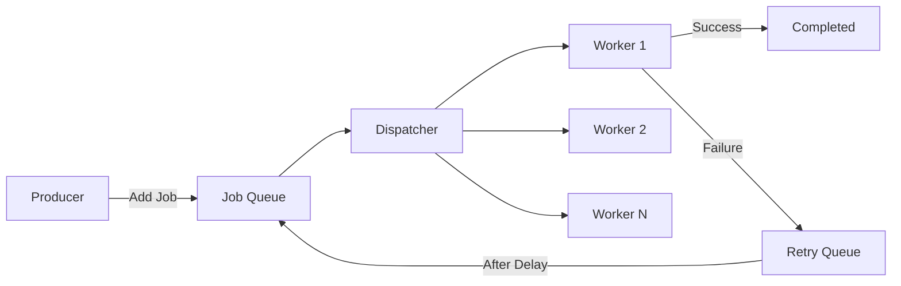

# How to Implement Background Job Processing in Go

Author: [nawazdhandala](https://www.github.com/nawazdhandala)

Tags: Go, Background Jobs, Worker Pool, Concurrency, Job Queue

Description: Build background job processing systems in Go with worker pools, job queues, retry logic, and graceful shutdown handling.

---

Go is particularly well-suited for background job processing thanks to its lightweight goroutines and built-in concurrency primitives. Unlike other languages where you often need external libraries like Celery or Sidekiq, Go lets you build robust job processing systems using just the standard library.

In this guide, we will build a production-ready background job processor from scratch, covering worker pools, job queues, retry logic, and graceful shutdown handling.

## Architecture Overview

Before diving into code, let us look at the overall architecture of our job processing system.



The system consists of producers that submit jobs, a dispatcher that coordinates work distribution, and a pool of workers that process jobs concurrently.

## Basic Job Structure

First, let us define what a job looks like in our system.

```go
package jobs

import (
    "context"
    "time"
)

// Job represents a unit of work to be processed
type Job struct {
    ID        string                 // Unique identifier for the job
    Type      string                 // Job type for routing to correct handler
    Payload   map[string]interface{} // Data needed to process the job
    Priority  int                    // Higher priority jobs run first
    Attempts  int                    // Number of times this job has been tried
    MaxRetry  int                    // Maximum retry attempts
    CreatedAt time.Time              // When the job was created
    Error     string                 // Last error message if failed
}

// Handler is a function that processes a job
type Handler func(ctx context.Context, job *Job) error
```

## Building the Worker Pool

The worker pool manages a fixed number of goroutines that pull jobs from a queue and process them.

```go
package jobs

import (
    "context"
    "fmt"
    "log"
    "sync"
    "time"
)

// WorkerPool manages a pool of workers that process jobs
type WorkerPool struct {
    numWorkers int
    jobQueue   chan *Job
    handlers   map[string]Handler
    wg         sync.WaitGroup
    ctx        context.Context
    cancel     context.CancelFunc
    mu         sync.RWMutex
}

// NewWorkerPool creates a new worker pool with the specified number of workers
func NewWorkerPool(numWorkers, queueSize int) *WorkerPool {
    ctx, cancel := context.WithCancel(context.Background())

    return &WorkerPool{
        numWorkers: numWorkers,
        jobQueue:   make(chan *Job, queueSize),
        handlers:   make(map[string]Handler),
        ctx:        ctx,
        cancel:     cancel,
    }
}

// RegisterHandler registers a handler function for a specific job type
func (wp *WorkerPool) RegisterHandler(jobType string, handler Handler) {
    wp.mu.Lock()
    defer wp.mu.Unlock()
    wp.handlers[jobType] = handler
}

// Start launches all workers in the pool
func (wp *WorkerPool) Start() {
    for i := 0; i < wp.numWorkers; i++ {
        wp.wg.Add(1)
        go wp.worker(i)
    }
    log.Printf("Started %d workers", wp.numWorkers)
}

// worker is the main loop for each worker goroutine
func (wp *WorkerPool) worker(id int) {
    defer wp.wg.Done()

    for {
        select {
        case <-wp.ctx.Done():
            log.Printf("Worker %d shutting down", id)
            return
        case job := <-wp.jobQueue:
            wp.processJob(id, job)
        }
    }
}

// processJob handles a single job with error recovery
func (wp *WorkerPool) processJob(workerID int, job *Job) {
    wp.mu.RLock()
    handler, exists := wp.handlers[job.Type]
    wp.mu.RUnlock()

    if !exists {
        log.Printf("Worker %d: no handler for job type %s", workerID, job.Type)
        return
    }

    // Create a context with timeout for the job
    ctx, cancel := context.WithTimeout(wp.ctx, 30*time.Second)
    defer cancel()

    log.Printf("Worker %d: processing job %s (type: %s, attempt: %d)",
        workerID, job.ID, job.Type, job.Attempts+1)

    // Execute the handler with panic recovery
    err := wp.safeExecute(ctx, handler, job)

    if err != nil {
        job.Error = err.Error()
        job.Attempts++

        if job.Attempts < job.MaxRetry {
            // Schedule retry with exponential backoff
            go wp.scheduleRetry(job)
        } else {
            log.Printf("Worker %d: job %s failed permanently: %v",
                workerID, job.ID, err)
        }
    } else {
        log.Printf("Worker %d: job %s completed successfully", workerID, job.ID)
    }
}

// safeExecute runs the handler with panic recovery
func (wp *WorkerPool) safeExecute(ctx context.Context, handler Handler, job *Job) (err error) {
    defer func() {
        if r := recover(); r != nil {
            err = fmt.Errorf("panic recovered: %v", r)
        }
    }()
    return handler(ctx, job)
}
```

## Adding Jobs to the Queue

Now let us add methods to submit jobs and handle retries.

```go
// Submit adds a job to the queue for processing
func (wp *WorkerPool) Submit(job *Job) error {
    if job.ID == "" {
        job.ID = generateID()
    }
    if job.MaxRetry == 0 {
        job.MaxRetry = 3 // Default retry count
    }
    job.CreatedAt = time.Now()

    select {
    case wp.jobQueue <- job:
        return nil
    default:
        return fmt.Errorf("job queue is full")
    }
}

// scheduleRetry requeues a failed job after a delay
func (wp *WorkerPool) scheduleRetry(job *Job) {
    // Exponential backoff: 1s, 2s, 4s, 8s...
    delay := time.Duration(1<<job.Attempts) * time.Second

    log.Printf("Scheduling retry for job %s in %v", job.ID, delay)

    select {
    case <-time.After(delay):
        select {
        case wp.jobQueue <- job:
            log.Printf("Job %s requeued for retry", job.ID)
        case <-wp.ctx.Done():
            return
        }
    case <-wp.ctx.Done():
        return
    }
}

// generateID creates a simple unique identifier
func generateID() string {
    return fmt.Sprintf("%d", time.Now().UnixNano())
}
```

## Graceful Shutdown

Graceful shutdown is critical for production systems. We need to stop accepting new jobs and wait for in-progress jobs to complete.

```go
// Shutdown gracefully stops the worker pool
func (wp *WorkerPool) Shutdown(timeout time.Duration) error {
    log.Println("Initiating graceful shutdown...")

    // Signal all workers to stop
    wp.cancel()

    // Wait for workers to finish with timeout
    done := make(chan struct{})
    go func() {
        wp.wg.Wait()
        close(done)
    }()

    select {
    case <-done:
        log.Println("All workers stopped gracefully")
        return nil
    case <-time.After(timeout):
        return fmt.Errorf("shutdown timed out after %v", timeout)
    }
}
```

## Complete Example with Signal Handling

Here is how to wire everything together in a complete application.

```go
package main

import (
    "context"
    "fmt"
    "log"
    "math/rand"
    "os"
    "os/signal"
    "syscall"
    "time"
)

func main() {
    // Create a worker pool with 5 workers and queue size of 100
    pool := NewWorkerPool(5, 100)

    // Register job handlers
    pool.RegisterHandler("email", handleEmailJob)
    pool.RegisterHandler("report", handleReportJob)
    pool.RegisterHandler("notification", handleNotificationJob)

    // Start the workers
    pool.Start()

    // Submit some sample jobs
    go submitSampleJobs(pool)

    // Wait for shutdown signal
    sigChan := make(chan os.Signal, 1)
    signal.Notify(sigChan, syscall.SIGINT, syscall.SIGTERM)

    sig := <-sigChan
    log.Printf("Received signal: %v", sig)

    // Graceful shutdown with 30 second timeout
    if err := pool.Shutdown(30 * time.Second); err != nil {
        log.Printf("Shutdown error: %v", err)
        os.Exit(1)
    }
}

// handleEmailJob processes email sending jobs
func handleEmailJob(ctx context.Context, job *Job) error {
    to := job.Payload["to"].(string)
    subject := job.Payload["subject"].(string)

    // Simulate email sending
    select {
    case <-time.After(100 * time.Millisecond):
        log.Printf("Email sent to %s: %s", to, subject)
        return nil
    case <-ctx.Done():
        return ctx.Err()
    }
}

// handleReportJob generates reports
func handleReportJob(ctx context.Context, job *Job) error {
    reportType := job.Payload["type"].(string)

    // Simulate report generation with potential failure
    if rand.Float32() < 0.3 {
        return fmt.Errorf("report generation failed: temporary error")
    }

    select {
    case <-time.After(500 * time.Millisecond):
        log.Printf("Report generated: %s", reportType)
        return nil
    case <-ctx.Done():
        return ctx.Err()
    }
}

// handleNotificationJob sends push notifications
func handleNotificationJob(ctx context.Context, job *Job) error {
    userID := job.Payload["user_id"].(string)
    message := job.Payload["message"].(string)

    select {
    case <-time.After(50 * time.Millisecond):
        log.Printf("Notification sent to user %s: %s", userID, message)
        return nil
    case <-ctx.Done():
        return ctx.Err()
    }
}

func submitSampleJobs(pool *WorkerPool) {
    // Submit various jobs
    jobs := []*Job{
        {
            Type:     "email",
            Payload:  map[string]interface{}{"to": "user@example.com", "subject": "Welcome!"},
            Priority: 1,
        },
        {
            Type:     "report",
            Payload:  map[string]interface{}{"type": "monthly-sales"},
            Priority: 2,
        },
        {
            Type:     "notification",
            Payload:  map[string]interface{}{"user_id": "123", "message": "New message"},
            Priority: 1,
        },
    }

    for _, job := range jobs {
        if err := pool.Submit(job); err != nil {
            log.Printf("Failed to submit job: %v", err)
        }
    }
}
```

## Adding Priority Queue Support

For production systems, you often need priority-based job processing. Here is how to implement a priority queue using a heap.

```go
package jobs

import (
    "container/heap"
    "sync"
)

// PriorityQueue implements a thread-safe priority queue for jobs
type PriorityQueue struct {
    items []*Job
    mu    sync.Mutex
}

// Len returns the number of items in the queue
func (pq *PriorityQueue) Len() int { return len(pq.items) }

// Less determines priority ordering (lower number = higher priority)
func (pq *PriorityQueue) Less(i, j int) bool {
    return pq.items[i].Priority < pq.items[j].Priority
}

// Swap exchanges two items in the queue
func (pq *PriorityQueue) Swap(i, j int) {
    pq.items[i], pq.items[j] = pq.items[j], pq.items[i]
}

// Push adds an item to the queue
func (pq *PriorityQueue) Push(x interface{}) {
    pq.items = append(pq.items, x.(*Job))
}

// Pop removes and returns the highest priority item
func (pq *PriorityQueue) Pop() interface{} {
    old := pq.items
    n := len(old)
    item := old[n-1]
    pq.items = old[0 : n-1]
    return item
}

// Enqueue adds a job with thread safety
func (pq *PriorityQueue) Enqueue(job *Job) {
    pq.mu.Lock()
    defer pq.mu.Unlock()
    heap.Push(pq, job)
}

// Dequeue removes and returns the highest priority job
func (pq *PriorityQueue) Dequeue() *Job {
    pq.mu.Lock()
    defer pq.mu.Unlock()
    if pq.Len() == 0 {
        return nil
    }
    return heap.Pop(pq).(*Job)
}
```

## Monitoring and Metrics

In production, you need visibility into your job processing system. Here is a simple metrics collector.

```go
package jobs

import (
    "sync/atomic"
    "time"
)

// Metrics tracks job processing statistics
type Metrics struct {
    JobsProcessed  uint64
    JobsFailed     uint64
    JobsRetried    uint64
    TotalDuration  int64 // in nanoseconds
}

// Global metrics instance
var metrics = &Metrics{}

// RecordSuccess records a successful job completion
func RecordSuccess(duration time.Duration) {
    atomic.AddUint64(&metrics.JobsProcessed, 1)
    atomic.AddInt64(&metrics.TotalDuration, int64(duration))
}

// RecordFailure records a job failure
func RecordFailure() {
    atomic.AddUint64(&metrics.JobsFailed, 1)
}

// RecordRetry records a job retry
func RecordRetry() {
    atomic.AddUint64(&metrics.JobsRetried, 1)
}

// GetMetrics returns current metrics snapshot
func GetMetrics() map[string]interface{} {
    processed := atomic.LoadUint64(&metrics.JobsProcessed)
    failed := atomic.LoadUint64(&metrics.JobsFailed)
    duration := atomic.LoadInt64(&metrics.TotalDuration)

    var avgDuration float64
    if processed > 0 {
        avgDuration = float64(duration) / float64(processed) / float64(time.Millisecond)
    }

    return map[string]interface{}{
        "jobs_processed":    processed,
        "jobs_failed":       failed,
        "jobs_retried":      atomic.LoadUint64(&metrics.JobsRetried),
        "avg_duration_ms":   avgDuration,
    }
}
```

## Best Practices

When building background job systems in Go, keep these guidelines in mind:

**Use buffered channels wisely.** A buffer that is too small causes producers to block, while a buffer that is too large wastes memory. Start with a reasonable size and tune based on your workload.

**Always implement timeouts.** Jobs should not run forever. Use context with timeout to prevent runaway jobs from consuming resources indefinitely.

**Handle panics in workers.** A panic in one goroutine should not crash your entire application. Wrap job execution in a recover block.

**Log job lifecycle events.** Track when jobs start, complete, fail, and retry. This information is invaluable for debugging production issues.

**Monitor queue depth.** If your queue keeps growing, you either need more workers or your jobs are taking too long.

## Summary

| Component | Purpose |
|-----------|---------|
| Job struct | Defines work units with metadata |
| Worker pool | Manages concurrent job processing |
| Job queue | Buffers jobs between producers and workers |
| Retry logic | Handles transient failures with backoff |
| Graceful shutdown | Ensures clean termination |
| Priority queue | Processes important jobs first |
| Metrics | Provides operational visibility |

Go's concurrency primitives make it straightforward to build efficient background job processing systems. The patterns shown here scale well from simple use cases to high-throughput production workloads. Start with the basic worker pool and add features like priority queues and metrics as your needs grow.
