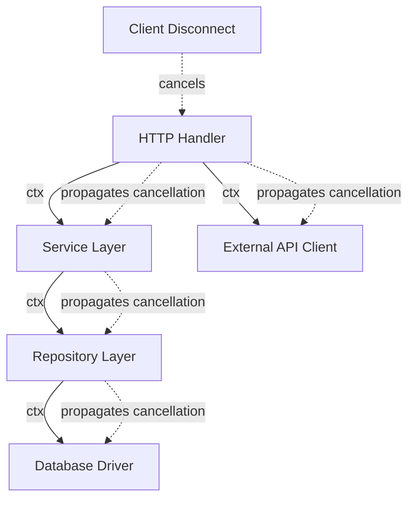

# How to Use Context for Request Cancellation in Go

Author: [nawazdhandala](https://www.github.com/nawazdhandala)

Tags: Go, Context, Concurrency, HTTP, Request Handling

Description: A practical guide to using Go's context package for request cancellation, timeouts, and passing request-scoped values in HTTP servers and concurrent operations.

---

Go's `context` package is one of those things that seems simple on the surface but becomes essential once you start building production services. If you have ever wondered why your HTTP handlers should respect context cancellation, or how to properly propagate timeouts through your application, this guide will walk you through the practical patterns you need to know.

## Why Context Matters for Request Handling

When a client disconnects from your server mid-request, what happens to all the work your server was doing? Without proper context handling, your goroutines keep running, database queries continue executing, and external API calls wait for timeouts. This wastes resources and can lead to cascading failures under load.

The `context` package provides a standardized way to carry deadlines, cancellation signals, and request-scoped values across API boundaries and between processes.

## The Basics: Creating and Using Contexts

Let's start with the fundamental context types you will work with.

```go
package main

import (
    "context"
    "fmt"
    "time"
)

func main() {
    // Background returns a non-nil, empty Context
    // It is never canceled and has no deadline
    ctx := context.Background()

    // WithCancel returns a copy of parent with a cancel function
    // Calling cancel releases resources associated with the context
    ctxWithCancel, cancel := context.WithCancel(ctx)
    defer cancel() // Always defer cancel to prevent context leaks

    // WithTimeout returns a copy that will be canceled after the duration
    ctxWithTimeout, cancelTimeout := context.WithTimeout(ctx, 5*time.Second)
    defer cancelTimeout()

    // WithDeadline is similar but uses an absolute time
    deadline := time.Now().Add(10 * time.Second)
    ctxWithDeadline, cancelDeadline := context.WithDeadline(ctx, deadline)
    defer cancelDeadline()

    fmt.Println("Contexts created:", ctxWithCancel, ctxWithTimeout, ctxWithDeadline)
}
```

## HTTP Server Context Cancellation

The real power of context shows up in HTTP handlers. Go's `http.Request` comes with a context that gets canceled when the client disconnects.

Here's a practical example showing how to handle this properly.

```go
package main

import (
    "context"
    "encoding/json"
    "log"
    "net/http"
    "time"
)

// simulateSlowDatabaseQuery represents any slow operation
// that should respect context cancellation
func simulateSlowDatabaseQuery(ctx context.Context, userID string) (map[string]string, error) {
    // Create a channel to signal when our "work" is done
    resultCh := make(chan map[string]string, 1)

    go func() {
        // Simulate database latency
        time.Sleep(2 * time.Second)
        resultCh <- map[string]string{
            "id":    userID,
            "name":  "John Doe",
            "email": "john@example.com",
        }
    }()

    // Wait for either the result or context cancellation
    select {
    case result := <-resultCh:
        return result, nil
    case <-ctx.Done():
        // Context was canceled - client disconnected or timeout hit
        return nil, ctx.Err()
    }
}

func userHandler(w http.ResponseWriter, r *http.Request) {
    // Get the request context - this is automatically canceled
    // when the client disconnects
    ctx := r.Context()

    userID := r.URL.Query().Get("id")
    if userID == "" {
        http.Error(w, "missing user id", http.StatusBadRequest)
        return
    }

    log.Printf("starting request for user %s", userID)

    // Pass context to downstream operations
    user, err := simulateSlowDatabaseQuery(ctx, userID)
    if err != nil {
        if err == context.Canceled {
            log.Printf("request canceled for user %s", userID)
            return // Client disconnected, no point in writing response
        }
        if err == context.DeadlineExceeded {
            http.Error(w, "request timeout", http.StatusGatewayTimeout)
            return
        }
        http.Error(w, err.Error(), http.StatusInternalServerError)
        return
    }

    log.Printf("completed request for user %s", userID)
    w.Header().Set("Content-Type", "application/json")
    json.NewEncoder(w).Encode(user)
}

func main() {
    http.HandleFunc("/user", userHandler)
    log.Println("Server starting on :8080")
    log.Fatal(http.ListenAndServe(":8080", nil))
}
```

## Adding Request Timeouts

You often want to enforce timeouts that are shorter than the default connection timeout. Here's how to wrap contexts with timeouts.

```go
package main

import (
    "context"
    "encoding/json"
    "log"
    "net/http"
    "time"
)

// TimeoutMiddleware wraps handlers with a timeout
func TimeoutMiddleware(timeout time.Duration, next http.HandlerFunc) http.HandlerFunc {
    return func(w http.ResponseWriter, r *http.Request) {
        // Create a new context with timeout, derived from request context
        ctx, cancel := context.WithTimeout(r.Context(), timeout)
        defer cancel()

        // Create a new request with the timeout context
        r = r.WithContext(ctx)

        // Call the next handler
        next(w, r)
    }
}

func slowHandler(w http.ResponseWriter, r *http.Request) {
    ctx := r.Context()

    // Check context before starting expensive work
    select {
    case <-ctx.Done():
        http.Error(w, "timeout before processing", http.StatusGatewayTimeout)
        return
    default:
        // Context still valid, proceed
    }

    // Simulate work that checks context periodically
    for i := 0; i < 10; i++ {
        select {
        case <-ctx.Done():
            log.Printf("work canceled at iteration %d: %v", i, ctx.Err())
            http.Error(w, "request timeout during processing", http.StatusGatewayTimeout)
            return
        case <-time.After(500 * time.Millisecond):
            log.Printf("completed iteration %d", i)
        }
    }

    json.NewEncoder(w).Encode(map[string]string{"status": "complete"})
}

func main() {
    // Apply 3-second timeout to the slow handler
    http.HandleFunc("/slow", TimeoutMiddleware(3*time.Second, slowHandler))
    log.Fatal(http.ListenAndServe(":8080", nil))
}
```

## Propagating Context Through Service Layers

In real applications, you will have multiple layers that all need to respect the same context. Here's a pattern showing proper context propagation.



```go
package main

import (
    "context"
    "database/sql"
    "errors"
    "log"
    "time"
)

// UserService handles business logic
type UserService struct {
    repo *UserRepository
}

// GetUser fetches a user, respecting context cancellation
func (s *UserService) GetUser(ctx context.Context, id string) (*User, error) {
    // Add service-level timeout on top of request context
    ctx, cancel := context.WithTimeout(ctx, 5*time.Second)
    defer cancel()

    // Check if context is already done before doing work
    if ctx.Err() != nil {
        return nil, ctx.Err()
    }

    return s.repo.FindByID(ctx, id)
}

// UserRepository handles database operations
type UserRepository struct {
    db *sql.DB
}

type User struct {
    ID    string
    Name  string
    Email string
}

// FindByID queries the database with context
func (r *UserRepository) FindByID(ctx context.Context, id string) (*User, error) {
    // sql.DB methods accept context and will cancel queries
    // when the context is done
    row := r.db.QueryRowContext(ctx,
        "SELECT id, name, email FROM users WHERE id = $1", id)

    var user User
    err := row.Scan(&user.ID, &user.Name, &user.Email)
    if err != nil {
        if errors.Is(err, context.Canceled) {
            log.Printf("query canceled for user %s", id)
        }
        return nil, err
    }

    return &user, nil
}
```

## Passing Request-Scoped Values

Context can also carry request-scoped values like request IDs, user authentication, and tracing information. Use this sparingly and only for data that crosses API boundaries.

```go
package main

import (
    "context"
    "log"
    "net/http"

    "github.com/google/uuid"
)

// Define custom types for context keys to avoid collisions
type contextKey string

const (
    requestIDKey contextKey = "requestID"
    userIDKey    contextKey = "userID"
)

// RequestIDMiddleware adds a unique request ID to the context
func RequestIDMiddleware(next http.Handler) http.Handler {
    return http.HandlerFunc(func(w http.ResponseWriter, r *http.Request) {
        // Check for existing request ID in header
        requestID := r.Header.Get("X-Request-ID")
        if requestID == "" {
            requestID = uuid.New().String()
        }

        // Add request ID to context
        ctx := context.WithValue(r.Context(), requestIDKey, requestID)

        // Add request ID to response header for tracing
        w.Header().Set("X-Request-ID", requestID)

        // Continue with enriched context
        next.ServeHTTP(w, r.WithContext(ctx))
    })
}

// GetRequestID extracts the request ID from context
func GetRequestID(ctx context.Context) string {
    if id, ok := ctx.Value(requestIDKey).(string); ok {
        return id
    }
    return "unknown"
}

// LogWithContext logs with the request ID included
func LogWithContext(ctx context.Context, message string) {
    log.Printf("[%s] %s", GetRequestID(ctx), message)
}

func apiHandler(w http.ResponseWriter, r *http.Request) {
    ctx := r.Context()

    // All logs now include the request ID automatically
    LogWithContext(ctx, "handling API request")

    // Pass context to downstream services
    // They can also use GetRequestID(ctx) for their logging

    LogWithContext(ctx, "request completed")
    w.Write([]byte("OK"))
}
```

## Common Mistakes to Avoid

There are a few pitfalls that trip up developers when working with context.

**Never store contexts in structs.** Contexts are meant to flow through your program, not be stored.

```go
// Bad - storing context in a struct
type BadService struct {
    ctx context.Context // Don't do this
}

// Good - pass context as the first parameter
func (s *GoodService) DoWork(ctx context.Context) error {
    // Use ctx here
    return nil
}
```

**Always call cancel functions.** Even if the context has already expired, calling cancel releases resources.

```go
// Always defer the cancel function
ctx, cancel := context.WithTimeout(parentCtx, 5*time.Second)
defer cancel() // This should always be called
```

**Check context before expensive operations.** Do not start work that will be wasted.

```go
func processItems(ctx context.Context, items []Item) error {
    for _, item := range items {
        // Check before each expensive operation
        if ctx.Err() != nil {
            return ctx.Err()
        }
        process(item)
    }
    return nil
}
```

## Wrapping Up

Context handling is fundamental to building robust Go services. The key takeaways are:

1. Always pass context as the first parameter to functions that do I/O or may take time
2. Derive child contexts from parent contexts to form a cancellation tree
3. Check `ctx.Done()` or `ctx.Err()` before and during expensive operations
4. Use `context.WithTimeout` or `context.WithDeadline` to enforce time limits
5. Always defer cancel functions to prevent resource leaks
6. Use `context.WithValue` sparingly, only for request-scoped data that crosses API boundaries

By respecting context cancellation throughout your codebase, you build services that handle client disconnects gracefully, respond to timeouts appropriately, and make efficient use of server resources. Your future self (and your ops team) will thank you when that service handles traffic spikes without breaking a sweat.
