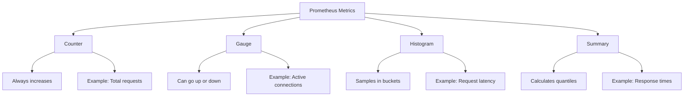

# How to Build a Prometheus Client in Go

Author: [nawazdhandala](https://www.github.com/nawazdhandala)

Tags: Go, Prometheus, Metrics, Monitoring, Observability

Description: Build a Prometheus client in Go with counters, gauges, histograms, and summaries for exposing application metrics with custom labels.

---

If you're running services in production, you need metrics. Without them, you're flying blind when something goes wrong. Prometheus has become the standard for metrics collection in cloud-native environments, and Go has excellent support for it through the official client library.

In this guide, we'll build a complete Prometheus client in Go that exposes counters, gauges, histograms, and summaries. By the end, you'll have a working metrics endpoint that Prometheus can scrape.

## Setting Up the Project

First, create a new Go project and install the Prometheus client library.

```bash
# Initialize a new Go module
mkdir prometheus-client && cd prometheus-client
go mod init prometheus-client

# Install the Prometheus client library
go get github.com/prometheus/client_golang/prometheus
go get github.com/prometheus/client_golang/prometheus/promhttp
```

## Understanding Metric Types

Before writing code, let's understand what each metric type does:



- **Counter**: A value that only goes up (requests served, errors encountered)
- **Gauge**: A value that can go up or down (current temperature, active users)
- **Histogram**: Samples observations and counts them in configurable buckets
- **Summary**: Similar to histogram but calculates quantiles on the client side

## Building the Metrics Package

Let's create a reusable metrics package. This keeps your metrics organized and easy to manage across your application.

```go
// metrics/metrics.go
package metrics

import (
    "github.com/prometheus/client_golang/prometheus"
    "github.com/prometheus/client_golang/prometheus/promauto"
)

// RequestCounter tracks the total number of HTTP requests
// Labels allow us to slice data by method, endpoint, and status code
var RequestCounter = promauto.NewCounterVec(
    prometheus.CounterOpts{
        Name: "app_http_requests_total",
        Help: "Total number of HTTP requests processed",
    },
    []string{"method", "endpoint", "status"},
)

// ActiveConnections tracks current active connections
// This is a gauge because connections come and go
var ActiveConnections = promauto.NewGauge(
    prometheus.GaugeOpts{
        Name: "app_active_connections",
        Help: "Number of currently active connections",
    },
)

// RequestDuration measures how long requests take
// Histogram buckets are in seconds - adjust based on your expected latencies
var RequestDuration = promauto.NewHistogramVec(
    prometheus.HistogramOpts{
        Name:    "app_request_duration_seconds",
        Help:    "Request duration in seconds",
        Buckets: []float64{0.001, 0.005, 0.01, 0.025, 0.05, 0.1, 0.25, 0.5, 1, 2.5, 5},
    },
    []string{"method", "endpoint"},
)

// ResponseSize tracks the size of HTTP responses
// Summary gives us quantiles without predefined buckets
var ResponseSize = promauto.NewSummaryVec(
    prometheus.SummaryOpts{
        Name:       "app_response_size_bytes",
        Help:       "Response size in bytes",
        Objectives: map[float64]float64{0.5: 0.05, 0.9: 0.01, 0.99: 0.001},
    },
    []string{"endpoint"},
)
```

The `promauto` package automatically registers metrics with the default registry. The `Objectives` map in the summary defines which quantiles to calculate and their acceptable error margins.

## Creating the HTTP Server

Now let's wire everything together with an HTTP server that uses these metrics.

```go
// main.go
package main

import (
    "fmt"
    "math/rand"
    "net/http"
    "time"

    "prometheus-client/metrics"

    "github.com/prometheus/client_golang/prometheus/promhttp"
)

// instrumentHandler wraps an HTTP handler to record metrics
func instrumentHandler(endpoint string, handler http.HandlerFunc) http.HandlerFunc {
    return func(w http.ResponseWriter, r *http.Request) {
        // Track active connections
        metrics.ActiveConnections.Inc()
        defer metrics.ActiveConnections.Dec()

        // Start timing the request
        start := time.Now()

        // Create a response writer wrapper to capture status code
        wrapped := &responseWriter{ResponseWriter: w, statusCode: 200}

        // Call the actual handler
        handler(wrapped, r)

        // Record metrics after request completes
        duration := time.Since(start).Seconds()
        status := fmt.Sprintf("%d", wrapped.statusCode)

        metrics.RequestCounter.WithLabelValues(r.Method, endpoint, status).Inc()
        metrics.RequestDuration.WithLabelValues(r.Method, endpoint).Observe(duration)
        metrics.ResponseSize.WithLabelValues(endpoint).Observe(float64(wrapped.bytesWritten))
    }
}

// responseWriter wraps http.ResponseWriter to capture response details
type responseWriter struct {
    http.ResponseWriter
    statusCode   int
    bytesWritten int
}

// WriteHeader captures the status code
func (rw *responseWriter) WriteHeader(code int) {
    rw.statusCode = code
    rw.ResponseWriter.WriteHeader(code)
}

// Write captures the number of bytes written
func (rw *responseWriter) Write(b []byte) (int, error) {
    n, err := rw.ResponseWriter.Write(b)
    rw.bytesWritten += n
    return n, err
}

func main() {
    // Example endpoint that simulates variable latency
    http.HandleFunc("/api/users", instrumentHandler("/api/users", func(w http.ResponseWriter, r *http.Request) {
        // Simulate some work with random latency
        time.Sleep(time.Duration(rand.Intn(100)) * time.Millisecond)
        w.Write([]byte(`{"users": ["alice", "bob", "charlie"]}`))
    }))

    // Example endpoint that sometimes fails
    http.HandleFunc("/api/orders", instrumentHandler("/api/orders", func(w http.ResponseWriter, r *http.Request) {
        // Simulate occasional errors (10% failure rate)
        if rand.Float32() < 0.1 {
            w.WriteHeader(http.StatusInternalServerError)
            w.Write([]byte(`{"error": "internal server error"}`))
            return
        }
        time.Sleep(time.Duration(rand.Intn(50)) * time.Millisecond)
        w.Write([]byte(`{"orders": []}`))
    }))

    // Expose the metrics endpoint for Prometheus to scrape
    http.Handle("/metrics", promhttp.Handler())

    fmt.Println("Server starting on :8080")
    fmt.Println("Metrics available at http://localhost:8080/metrics")
    http.ListenAndServe(":8080", nil)
}
```

## Custom Collectors for Dynamic Metrics

Sometimes you need metrics that aren't easily captured with the standard types. Custom collectors let you gather metrics at scrape time.

```go
// collectors/database.go
package collectors

import (
    "github.com/prometheus/client_golang/prometheus"
)

// DatabaseCollector gathers database connection pool metrics
type DatabaseCollector struct {
    // These describe what metrics we'll expose
    poolSize     *prometheus.Desc
    idleConns    *prometheus.Desc
    waitDuration *prometheus.Desc

    // This would be your actual database pool
    // db *sql.DB
}

// NewDatabaseCollector creates a new collector
func NewDatabaseCollector() *DatabaseCollector {
    return &DatabaseCollector{
        poolSize: prometheus.NewDesc(
            "app_db_pool_size",
            "Total size of the connection pool",
            nil, nil,
        ),
        idleConns: prometheus.NewDesc(
            "app_db_idle_connections",
            "Number of idle connections in the pool",
            nil, nil,
        ),
        waitDuration: prometheus.NewDesc(
            "app_db_wait_duration_seconds",
            "Time spent waiting for a connection",
            nil, nil,
        ),
    }
}

// Describe sends metric descriptions to the channel
func (c *DatabaseCollector) Describe(ch chan<- *prometheus.Desc) {
    ch <- c.poolSize
    ch <- c.idleConns
    ch <- c.waitDuration
}

// Collect gathers current values and sends them to the channel
func (c *DatabaseCollector) Collect(ch chan<- prometheus.Metric) {
    // In a real application, you'd query your database pool here
    // stats := c.db.Stats()

    // For demonstration, using placeholder values
    ch <- prometheus.MustNewConstMetric(c.poolSize, prometheus.GaugeValue, 10)
    ch <- prometheus.MustNewConstMetric(c.idleConns, prometheus.GaugeValue, 5)
    ch <- prometheus.MustNewConstMetric(c.waitDuration, prometheus.GaugeValue, 0.002)
}
```

Register the custom collector in your main function:

```go
// Add this to main.go
import "prometheus-client/collectors"

func init() {
    // Register the custom collector
    prometheus.MustRegister(collectors.NewDatabaseCollector())
}
```

## Testing Your Metrics

Run the server and generate some traffic to see metrics in action.

```bash
# Start the server
go run main.go

# In another terminal, generate some requests
for i in {1..100}; do
    curl -s http://localhost:8080/api/users > /dev/null
    curl -s http://localhost:8080/api/orders > /dev/null
done

# Check the metrics endpoint
curl http://localhost:8080/metrics | grep app_
```

You should see output like this:

```text
# HELP app_http_requests_total Total number of HTTP requests processed
# TYPE app_http_requests_total counter
app_http_requests_total{endpoint="/api/orders",method="GET",status="200"} 89
app_http_requests_total{endpoint="/api/orders",method="GET",status="500"} 11
app_http_requests_total{endpoint="/api/users",method="GET",status="200"} 100

# HELP app_request_duration_seconds Request duration in seconds
# TYPE app_request_duration_seconds histogram
app_request_duration_seconds_bucket{endpoint="/api/users",method="GET",le="0.05"} 52
app_request_duration_seconds_bucket{endpoint="/api/users",method="GET",le="0.1"} 100
```

## Best Practices

When building production metrics, keep these guidelines in mind:

1. **Use meaningful names**: Follow the convention `app_component_unit_type`. For example, `app_http_requests_total` or `app_cache_hits_total`.

2. **Keep cardinality in check**: Every unique combination of label values creates a new time series. Avoid labels with high cardinality like user IDs or request IDs.

3. **Choose appropriate buckets**: For histograms, set buckets based on your expected value distribution. If most requests complete in under 100ms, having buckets at 1s, 2s, 5s wastes resources.

4. **Document your metrics**: Always provide a helpful description in the `Help` field. Future you will thank present you.

5. **Use consistent labels**: If you use `method` as a label in one metric, use the same name everywhere rather than switching between `method`, `http_method`, and `request_method`.

## Wrapping Up

You now have a solid foundation for instrumenting Go applications with Prometheus. The combination of counters for totals, gauges for current state, histograms for latency distributions, and custom collectors for complex metrics covers most monitoring needs.

The key is starting simple. Add a few important metrics first, see how they perform in production, and gradually expand coverage based on what questions you find yourself asking. Metrics are only useful if they help you understand and debug your system.
