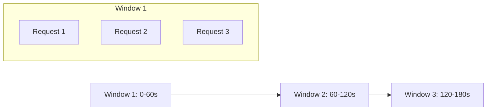
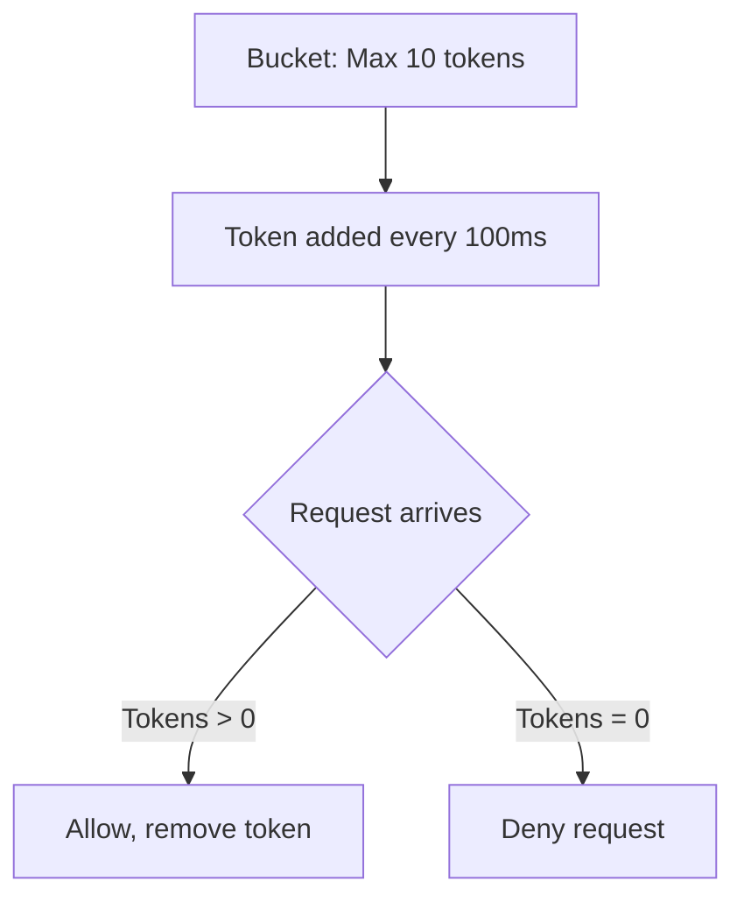

# How to Build a Rate Limiter with Redis in Go

Author: [nawazdhandala](https://www.github.com/nawazdhandala)

Tags: Go, Redis, Rate Limiting, API, Distributed Systems

Description: Build a distributed rate limiter in Go using Redis with sliding window, token bucket, and leaky bucket algorithms for API protection.

---

> Rate limiting protects your APIs from abuse, prevents resource exhaustion, and ensures fair usage across clients. When running multiple server instances, you need a distributed solution. Redis provides the atomic operations and speed required for effective rate limiting at scale.

This guide walks through building production-ready rate limiters in Go using Redis. We will cover three popular algorithms: fixed window, sliding window, and token bucket.

---

## Why Redis for Rate Limiting?

Redis is ideal for rate limiting because:

- **Atomic operations** - INCR and Lua scripts prevent race conditions
- **Sub-millisecond latency** - adds minimal overhead to requests
- **TTL support** - automatic key expiration handles cleanup
- **Distributed** - works across multiple application instances

---

## Getting Started

### Installation

```bash
go get github.com/redis/go-redis/v9
```

### Redis Connection Setup

Create a reusable Redis client with connection pooling:

```go
// redis.go
package ratelimit

import (
    "context"
    "os"
    "time"

    "github.com/redis/go-redis/v9"
)

// NewRedisClient creates a configured Redis client with connection pooling
func NewRedisClient() *redis.Client {
    redisURL := os.Getenv("REDIS_URL")
    if redisURL == "" {
        redisURL = "localhost:6379"
    }

    return redis.NewClient(&redis.Options{
        Addr:         redisURL,
        Password:     os.Getenv("REDIS_PASSWORD"),
        DB:           0,
        PoolSize:     100,              // Connection pool size
        MinIdleConns: 10,               // Keep minimum idle connections
        DialTimeout:  5 * time.Second,  // Connection timeout
        ReadTimeout:  3 * time.Second,  // Read timeout
        WriteTimeout: 3 * time.Second,  // Write timeout
    })
}
```

---

## Fixed Window Rate Limiter

The simplest approach counts requests in fixed time windows. Each window resets completely when the time period ends.



### Implementation

```go
// fixed_window.go
package ratelimit

import (
    "context"
    "fmt"
    "time"

    "github.com/redis/go-redis/v9"
)

// FixedWindowLimiter implements fixed window rate limiting
type FixedWindowLimiter struct {
    client   *redis.Client
    limit    int64         // Maximum requests per window
    window   time.Duration // Window duration
    prefix   string        // Key prefix for namespacing
}

// NewFixedWindowLimiter creates a new fixed window rate limiter
func NewFixedWindowLimiter(client *redis.Client, limit int64, window time.Duration) *FixedWindowLimiter {
    return &FixedWindowLimiter{
        client: client,
        limit:  limit,
        window: window,
        prefix: "ratelimit:fixed:",
    }
}

// Allow checks if a request should be allowed for the given key
func (l *FixedWindowLimiter) Allow(ctx context.Context, key string) (bool, error) {
    // Create key with current window timestamp
    windowStart := time.Now().Truncate(l.window).Unix()
    redisKey := fmt.Sprintf("%s%s:%d", l.prefix, key, windowStart)

    // Increment counter atomically
    count, err := l.client.Incr(ctx, redisKey).Result()
    if err != nil {
        return false, fmt.Errorf("failed to increment counter: %w", err)
    }

    // Set expiration on first request in window
    if count == 1 {
        l.client.Expire(ctx, redisKey, l.window)
    }

    return count <= l.limit, nil
}

// GetRemaining returns the number of requests remaining in current window
func (l *FixedWindowLimiter) GetRemaining(ctx context.Context, key string) (int64, error) {
    windowStart := time.Now().Truncate(l.window).Unix()
    redisKey := fmt.Sprintf("%s%s:%d", l.prefix, key, windowStart)

    count, err := l.client.Get(ctx, redisKey).Int64()
    if err == redis.Nil {
        return l.limit, nil // No requests yet
    }
    if err != nil {
        return 0, err
    }

    remaining := l.limit - count
    if remaining < 0 {
        remaining = 0
    }
    return remaining, nil
}
```

### Usage Example

```go
func main() {
    client := NewRedisClient()
    defer client.Close()

    // Allow 100 requests per minute
    limiter := NewFixedWindowLimiter(client, 100, time.Minute)

    ctx := context.Background()
    userID := "user:123"

    allowed, err := limiter.Allow(ctx, userID)
    if err != nil {
        log.Fatalf("Rate limit check failed: %v", err)
    }

    if !allowed {
        // Return 429 Too Many Requests
        log.Println("Rate limit exceeded")
        return
    }

    // Process the request
    log.Println("Request allowed")
}
```

---

## Sliding Window Rate Limiter

Fixed windows have a burst problem at window boundaries. A user could make 100 requests at 0:59 and another 100 at 1:01, getting 200 requests in 2 seconds. Sliding windows solve this by considering the previous window proportionally.

```go
// sliding_window.go
package ratelimit

import (
    "context"
    "fmt"
    "time"

    "github.com/redis/go-redis/v9"
)

// SlidingWindowLimiter implements sliding window rate limiting
type SlidingWindowLimiter struct {
    client *redis.Client
    limit  int64
    window time.Duration
    prefix string
}

// Lua script for atomic sliding window calculation
// This runs entirely on Redis, preventing race conditions
var slidingWindowScript = redis.NewScript(`
    local current_key = KEYS[1]
    local previous_key = KEYS[2]
    local limit = tonumber(ARGV[1])
    local window = tonumber(ARGV[2])
    local now = tonumber(ARGV[3])
    local window_start = tonumber(ARGV[4])

    -- Get counts from both windows
    local current_count = tonumber(redis.call('GET', current_key) or '0')
    local previous_count = tonumber(redis.call('GET', previous_key) or '0')

    -- Calculate weight of previous window (how much of it overlaps)
    local elapsed = now - window_start
    local weight = (window - elapsed) / window

    -- Weighted count combines both windows
    local weighted_count = previous_count * weight + current_count

    if weighted_count >= limit then
        return {0, weighted_count}  -- Denied
    end

    -- Increment current window
    redis.call('INCR', current_key)
    redis.call('EXPIRE', current_key, window * 2)  -- Keep for overlap calculation

    return {1, weighted_count + 1}  -- Allowed
`)

func NewSlidingWindowLimiter(client *redis.Client, limit int64, window time.Duration) *SlidingWindowLimiter {
    return &SlidingWindowLimiter{
        client: client,
        limit:  limit,
        window: window,
        prefix: "ratelimit:sliding:",
    }
}

func (l *SlidingWindowLimiter) Allow(ctx context.Context, key string) (bool, error) {
    now := time.Now()
    windowSeconds := int64(l.window.Seconds())
    windowStart := now.Truncate(l.window).Unix()

    // Keys for current and previous windows
    currentKey := fmt.Sprintf("%s%s:%d", l.prefix, key, windowStart)
    previousKey := fmt.Sprintf("%s%s:%d", l.prefix, key, windowStart-windowSeconds)

    // Execute Lua script atomically
    result, err := slidingWindowScript.Run(ctx, l.client,
        []string{currentKey, previousKey},
        l.limit,
        windowSeconds,
        now.Unix(),
        windowStart,
    ).Slice()

    if err != nil {
        return false, fmt.Errorf("sliding window script failed: %w", err)
    }

    allowed := result[0].(int64) == 1
    return allowed, nil
}
```

---

## Token Bucket Rate Limiter

Token bucket allows for controlled bursting. Tokens accumulate over time up to a maximum, and each request consumes one token. This smooths out traffic while allowing short bursts.



### Implementation

```go
// token_bucket.go
package ratelimit

import (
    "context"
    "fmt"
    "time"

    "github.com/redis/go-redis/v9"
)

// TokenBucketLimiter implements token bucket rate limiting
type TokenBucketLimiter struct {
    client     *redis.Client
    capacity   int64         // Maximum tokens in bucket
    refillRate float64       // Tokens added per second
    prefix     string
}

// Lua script for atomic token bucket operation
// Calculates tokens based on time elapsed since last request
var tokenBucketScript = redis.NewScript(`
    local key = KEYS[1]
    local capacity = tonumber(ARGV[1])
    local refill_rate = tonumber(ARGV[2])
    local now = tonumber(ARGV[3])
    local requested = tonumber(ARGV[4])

    -- Get current bucket state
    local bucket = redis.call('HMGET', key, 'tokens', 'last_update')
    local tokens = tonumber(bucket[1])
    local last_update = tonumber(bucket[2])

    -- Initialize bucket if it does not exist
    if tokens == nil then
        tokens = capacity
        last_update = now
    end

    -- Calculate tokens to add based on elapsed time
    local elapsed = now - last_update
    local new_tokens = elapsed * refill_rate
    tokens = math.min(capacity, tokens + new_tokens)

    -- Check if we have enough tokens
    if tokens < requested then
        -- Update timestamp even on denial to prevent token accumulation
        redis.call('HMSET', key, 'tokens', tokens, 'last_update', now)
        redis.call('EXPIRE', key, math.ceil(capacity / refill_rate) * 2)
        return {0, tokens}  -- Denied
    end

    -- Consume tokens
    tokens = tokens - requested
    redis.call('HMSET', key, 'tokens', tokens, 'last_update', now)
    redis.call('EXPIRE', key, math.ceil(capacity / refill_rate) * 2)

    return {1, tokens}  -- Allowed
`)

func NewTokenBucketLimiter(client *redis.Client, capacity int64, refillRate float64) *TokenBucketLimiter {
    return &TokenBucketLimiter{
        client:     client,
        capacity:   capacity,
        refillRate: refillRate,
        prefix:     "ratelimit:bucket:",
    }
}

func (l *TokenBucketLimiter) Allow(ctx context.Context, key string) (bool, float64, error) {
    redisKey := fmt.Sprintf("%s%s", l.prefix, key)

    // Get current time as float for precision
    now := float64(time.Now().UnixNano()) / 1e9

    result, err := tokenBucketScript.Run(ctx, l.client,
        []string{redisKey},
        l.capacity,
        l.refillRate,
        now,
        1,  // Request 1 token
    ).Slice()

    if err != nil {
        return false, 0, fmt.Errorf("token bucket script failed: %w", err)
    }

    allowed := result[0].(int64) == 1
    remaining, _ := result[1].(float64)

    return allowed, remaining, nil
}
```

---

## HTTP Middleware Integration

Wrap the rate limiter in HTTP middleware for easy integration with your API:

```go
// middleware.go
package ratelimit

import (
    "net/http"
    "strconv"
)

// RateLimiter interface allows swapping implementations
type RateLimiter interface {
    Allow(ctx context.Context, key string) (bool, error)
    GetRemaining(ctx context.Context, key string) (int64, error)
}

// Middleware creates HTTP middleware for rate limiting
func Middleware(limiter RateLimiter, keyFunc func(r *http.Request) string) func(http.Handler) http.Handler {
    return func(next http.Handler) http.Handler {
        return http.HandlerFunc(func(w http.ResponseWriter, r *http.Request) {
            ctx := r.Context()
            key := keyFunc(r)

            allowed, err := limiter.Allow(ctx, key)
            if err != nil {
                // Log error but allow request on rate limiter failure
                // You may want different behavior in production
                next.ServeHTTP(w, r)
                return
            }

            // Add rate limit headers
            remaining, _ := limiter.GetRemaining(ctx, key)
            w.Header().Set("X-RateLimit-Remaining", strconv.FormatInt(remaining, 10))

            if !allowed {
                w.Header().Set("Retry-After", "60")
                http.Error(w, "Rate limit exceeded", http.StatusTooManyRequests)
                return
            }

            next.ServeHTTP(w, r)
        })
    }
}

// IPKeyFunc extracts client IP for rate limiting
func IPKeyFunc(r *http.Request) string {
    // Check X-Forwarded-For for clients behind proxy
    if xff := r.Header.Get("X-Forwarded-For"); xff != "" {
        return "ip:" + xff
    }
    return "ip:" + r.RemoteAddr
}

// UserKeyFunc extracts user ID from context for authenticated routes
func UserKeyFunc(r *http.Request) string {
    if userID := r.Context().Value("user_id"); userID != nil {
        return "user:" + userID.(string)
    }
    return IPKeyFunc(r)  // Fallback to IP
}
```

### Using the Middleware

```go
func main() {
    client := NewRedisClient()
    defer client.Close()

    // 100 requests per minute per IP
    limiter := NewSlidingWindowLimiter(client, 100, time.Minute)

    mux := http.NewServeMux()
    mux.HandleFunc("/api/data", handleData)

    // Apply rate limiting middleware
    handler := Middleware(limiter, IPKeyFunc)(mux)

    log.Println("Server starting on :8080")
    http.ListenAndServe(":8080", handler)
}
```

---

## Choosing the Right Algorithm

| Algorithm | Best For | Trade-offs |
|-----------|----------|------------|
| Fixed Window | Simple APIs, low traffic | Burst at boundaries |
| Sliding Window | Most APIs, balanced approach | Slightly more complex |
| Token Bucket | APIs needing controlled bursts | Memory per key |

---

## Production Tips

1. **Set appropriate timeouts** - Redis operations should not block requests indefinitely
2. **Fail open** - If Redis is unavailable, consider allowing requests rather than blocking all traffic
3. **Use key prefixes** - Namespace your keys to avoid collisions with other Redis usage
4. **Monitor Redis memory** - Rate limit keys can accumulate; ensure TTLs are set correctly
5. **Consider client identification** - IP-based limiting can be bypassed; combine with API keys for authenticated endpoints

---

## Conclusion

Building a distributed rate limiter with Redis and Go is straightforward once you understand the core algorithms. Start with fixed window for simplicity, move to sliding window for smoother limiting, and use token bucket when you need burst control.

The Lua scripts ensure atomicity across distributed instances, while Go's simplicity keeps the implementation clean and maintainable.

---

*Need to monitor your API rate limits? [OneUptime](https://oneuptime.com) provides real-time API monitoring with alerting when rate limits spike.*
