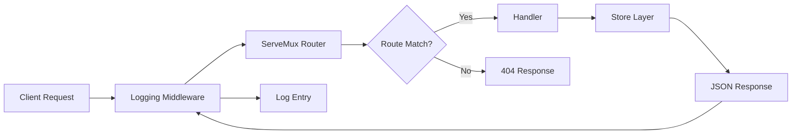

# How to Build RESTful APIs with Standard Library in Go

Author: [nawazdhandala](https://www.github.com/nawazdhandala)

Tags: Go, REST API, HTTP, Web Development, Standard Library

Description: Build production-ready RESTful APIs using only Go's standard library, covering routing, JSON handling, error responses, and project structure.

---

Go's standard library is surprisingly powerful for building web services. While frameworks like Gin and Echo are popular, you can build robust RESTful APIs using nothing but the `net/http` package. This approach gives you fewer dependencies, better understanding of HTTP fundamentals, and code that will work for years without breaking changes.

In this guide, we will build a complete REST API for managing books. You will learn routing patterns, JSON handling, middleware, and error responses - all with the standard library.

## Project Structure

Before diving into code, let's establish a clean project layout:

```
bookapi/
├── main.go
├── handlers/
│   └── books.go
├── models/
│   └── book.go
├── middleware/
│   └── logging.go
└── store/
    └── memory.go
```

This separation keeps handlers, data models, and storage logic independent. You can swap the in-memory store for PostgreSQL later without touching handlers.

## Defining the Data Model

Start with a simple book model that includes JSON struct tags for serialization.

```go
// models/book.go
package models

import "time"

// Book represents a book in our library system.
// JSON tags control how fields appear in API responses.
type Book struct {
    ID        string    `json:"id"`
    Title     string    `json:"title"`
    Author    string    `json:"author"`
    ISBN      string    `json:"isbn"`
    Published time.Time `json:"published"`
    CreatedAt time.Time `json:"created_at"`
}

// BookRequest is used for creating and updating books.
// We exclude ID and CreatedAt since those are server-generated.
type BookRequest struct {
    Title     string `json:"title"`
    Author    string `json:"author"`
    ISBN      string `json:"isbn"`
    Published string `json:"published"` // Accept as string, parse to time.Time
}
```

## Building the In-Memory Store

For demonstration purposes, we will use an in-memory store with a mutex for thread safety.

```go
// store/memory.go
package store

import (
    "errors"
    "sync"

    "bookapi/models"
)

var (
    ErrNotFound = errors.New("book not found")
)

// MemoryStore provides thread-safe in-memory storage for books.
type MemoryStore struct {
    mu    sync.RWMutex
    books map[string]models.Book
}

// NewMemoryStore creates an initialized store ready for use.
func NewMemoryStore() *MemoryStore {
    return &MemoryStore{
        books: make(map[string]models.Book),
    }
}

// List returns all books in the store.
func (s *MemoryStore) List() []models.Book {
    s.mu.RLock()
    defer s.mu.RUnlock()

    result := make([]models.Book, 0, len(s.books))
    for _, book := range s.books {
        result = append(result, book)
    }
    return result
}

// Get retrieves a single book by ID.
func (s *MemoryStore) Get(id string) (models.Book, error) {
    s.mu.RLock()
    defer s.mu.RUnlock()

    book, exists := s.books[id]
    if !exists {
        return models.Book{}, ErrNotFound
    }
    return book, nil
}

// Create adds a new book to the store.
func (s *MemoryStore) Create(book models.Book) {
    s.mu.Lock()
    defer s.mu.Unlock()
    s.books[book.ID] = book
}

// Update modifies an existing book.
func (s *MemoryStore) Update(book models.Book) error {
    s.mu.Lock()
    defer s.mu.Unlock()

    if _, exists := s.books[book.ID]; !exists {
        return ErrNotFound
    }
    s.books[book.ID] = book
    return nil
}

// Delete removes a book from the store.
func (s *MemoryStore) Delete(id string) error {
    s.mu.Lock()
    defer s.mu.Unlock()

    if _, exists := s.books[id]; !exists {
        return ErrNotFound
    }
    delete(s.books, id)
    return nil
}
```

## HTTP Handlers with Manual Routing

The standard library does not have a built-in router with path parameters, but Go 1.22 introduced pattern matching in `http.ServeMux`. Here is how to handle CRUD operations.

```go
// handlers/books.go
package handlers

import (
    "encoding/json"
    "net/http"
    "time"

    "bookapi/models"
    "bookapi/store"

    "github.com/google/uuid"
)

// BookHandler manages HTTP requests for book resources.
type BookHandler struct {
    store *store.MemoryStore
}

// NewBookHandler creates a handler with the given store.
func NewBookHandler(s *store.MemoryStore) *BookHandler {
    return &BookHandler{store: s}
}

// writeJSON sends a JSON response with the given status code.
func writeJSON(w http.ResponseWriter, status int, data interface{}) {
    w.Header().Set("Content-Type", "application/json")
    w.WriteHeader(status)
    json.NewEncoder(w).Encode(data)
}

// writeError sends an error response in a consistent format.
func writeError(w http.ResponseWriter, status int, message string) {
    writeJSON(w, status, map[string]string{"error": message})
}

// List handles GET /books - returns all books.
func (h *BookHandler) List(w http.ResponseWriter, r *http.Request) {
    books := h.store.List()
    writeJSON(w, http.StatusOK, books)
}

// Get handles GET /books/{id} - returns a single book.
func (h *BookHandler) Get(w http.ResponseWriter, r *http.Request) {
    // Go 1.22+ provides PathValue for extracting route parameters
    id := r.PathValue("id")

    book, err := h.store.Get(id)
    if err == store.ErrNotFound {
        writeError(w, http.StatusNotFound, "book not found")
        return
    }

    writeJSON(w, http.StatusOK, book)
}

// Create handles POST /books - adds a new book.
func (h *BookHandler) Create(w http.ResponseWriter, r *http.Request) {
    var req models.BookRequest

    // Decode request body into struct
    if err := json.NewDecoder(r.Body).Decode(&req); err != nil {
        writeError(w, http.StatusBadRequest, "invalid JSON")
        return
    }

    // Basic validation
    if req.Title == "" || req.Author == "" {
        writeError(w, http.StatusBadRequest, "title and author are required")
        return
    }

    // Parse the published date
    published, err := time.Parse("2006-01-02", req.Published)
    if err != nil {
        writeError(w, http.StatusBadRequest, "invalid date format, use YYYY-MM-DD")
        return
    }

    book := models.Book{
        ID:        uuid.New().String(),
        Title:     req.Title,
        Author:    req.Author,
        ISBN:      req.ISBN,
        Published: published,
        CreatedAt: time.Now(),
    }

    h.store.Create(book)
    writeJSON(w, http.StatusCreated, book)
}

// Update handles PUT /books/{id} - modifies an existing book.
func (h *BookHandler) Update(w http.ResponseWriter, r *http.Request) {
    id := r.PathValue("id")

    existing, err := h.store.Get(id)
    if err == store.ErrNotFound {
        writeError(w, http.StatusNotFound, "book not found")
        return
    }

    var req models.BookRequest
    if err := json.NewDecoder(r.Body).Decode(&req); err != nil {
        writeError(w, http.StatusBadRequest, "invalid JSON")
        return
    }

    // Update fields if provided
    if req.Title != "" {
        existing.Title = req.Title
    }
    if req.Author != "" {
        existing.Author = req.Author
    }
    if req.ISBN != "" {
        existing.ISBN = req.ISBN
    }
    if req.Published != "" {
        published, err := time.Parse("2006-01-02", req.Published)
        if err != nil {
            writeError(w, http.StatusBadRequest, "invalid date format")
            return
        }
        existing.Published = published
    }

    h.store.Update(existing)
    writeJSON(w, http.StatusOK, existing)
}

// Delete handles DELETE /books/{id} - removes a book.
func (h *BookHandler) Delete(w http.ResponseWriter, r *http.Request) {
    id := r.PathValue("id")

    if err := h.store.Delete(id); err == store.ErrNotFound {
        writeError(w, http.StatusNotFound, "book not found")
        return
    }

    w.WriteHeader(http.StatusNoContent)
}
```

## Adding Logging Middleware

Middleware in the standard library is just a function that wraps an `http.Handler`. Here is a simple request logger.

```go
// middleware/logging.go
package middleware

import (
    "log"
    "net/http"
    "time"
)

// responseWriter wraps http.ResponseWriter to capture the status code.
type responseWriter struct {
    http.ResponseWriter
    status int
}

func (rw *responseWriter) WriteHeader(code int) {
    rw.status = code
    rw.ResponseWriter.WriteHeader(code)
}

// Logging logs each request with method, path, status, and duration.
func Logging(next http.Handler) http.Handler {
    return http.HandlerFunc(func(w http.ResponseWriter, r *http.Request) {
        start := time.Now()

        // Wrap the response writer to capture status
        wrapped := &responseWriter{ResponseWriter: w, status: http.StatusOK}

        next.ServeHTTP(wrapped, r)

        log.Printf(
            "%s %s %d %v",
            r.Method,
            r.URL.Path,
            wrapped.status,
            time.Since(start),
        )
    })
}
```

## Wiring Everything Together

The main file sets up routes using the new Go 1.22 pattern syntax.

```go
// main.go
package main

import (
    "log"
    "net/http"

    "bookapi/handlers"
    "bookapi/middleware"
    "bookapi/store"
)

func main() {
    // Initialize storage and handlers
    bookStore := store.NewMemoryStore()
    bookHandler := handlers.NewBookHandler(bookStore)

    // Create a new ServeMux with pattern matching (Go 1.22+)
    mux := http.NewServeMux()

    // Register routes with HTTP method prefixes
    mux.HandleFunc("GET /books", bookHandler.List)
    mux.HandleFunc("GET /books/{id}", bookHandler.Get)
    mux.HandleFunc("POST /books", bookHandler.Create)
    mux.HandleFunc("PUT /books/{id}", bookHandler.Update)
    mux.HandleFunc("DELETE /books/{id}", bookHandler.Delete)

    // Health check endpoint
    mux.HandleFunc("GET /health", func(w http.ResponseWriter, r *http.Request) {
        w.WriteHeader(http.StatusOK)
        w.Write([]byte("OK"))
    })

    // Apply middleware
    handler := middleware.Logging(mux)

    // Start the server
    addr := ":8080"
    log.Printf("Server starting on %s", addr)
    if err := http.ListenAndServe(addr, handler); err != nil {
        log.Fatal(err)
    }
}
```

## Request Flow Architecture

Here is how requests flow through the application:



## Testing the API

Once your server is running, you can test it with curl commands:

```bash
# Create a book
curl -X POST http://localhost:8080/books \
  -H "Content-Type: application/json" \
  -d '{"title":"The Go Programming Language","author":"Alan Donovan","isbn":"978-0134190440","published":"2015-11-05"}'

# List all books
curl http://localhost:8080/books

# Get a specific book (replace {id} with actual ID)
curl http://localhost:8080/books/{id}

# Update a book
curl -X PUT http://localhost:8080/books/{id} \
  -H "Content-Type: application/json" \
  -d '{"title":"Updated Title"}'

# Delete a book
curl -X DELETE http://localhost:8080/books/{id}
```

## Production Considerations

Before deploying this API, consider these improvements:

1. **Graceful Shutdown**: Handle SIGTERM to finish in-flight requests before exiting.
2. **Request Timeouts**: Use `http.Server` with `ReadTimeout` and `WriteTimeout` configured.
3. **Input Validation**: Add length limits and sanitization for all user input.
4. **CORS Headers**: Add middleware for cross-origin requests if needed.
5. **Rate Limiting**: Protect against abuse with token bucket or sliding window algorithms.

## Conclusion

Building REST APIs with Go's standard library is straightforward and keeps your dependency tree minimal. The new routing patterns in Go 1.22 eliminate much of the boilerplate that previously drove developers toward external routers. For most CRUD applications, this approach provides everything you need while maintaining full control over your HTTP handling.

Start with this foundation, add a real database, and you will have a production-ready API that compiles to a single binary and runs anywhere.
