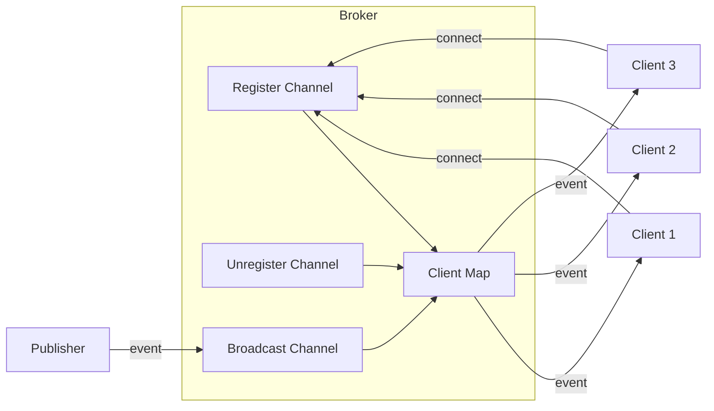

# How to Implement Server-Side Events in Go

Author: [nawazdhandala](https://www.github.com/nawazdhandala)

Tags: Go, SSE, Server-Side Events, Real-time, HTTP

Description: Build server-side events (SSE) in Go for real-time updates with proper connection handling, reconnection, and event broadcasting.

---

Server-Side Events (SSE) offer a straightforward way to push data from your server to web clients. Unlike WebSockets, SSE works over standard HTTP and provides built-in reconnection handling. If you need one-way real-time communication, such as live dashboards, notifications, or activity feeds, SSE is often the right choice.

This guide walks through implementing SSE in Go from the ground up, covering the protocol basics, connection management, and production-ready patterns.

## Understanding the SSE Protocol

SSE uses a simple text-based format over HTTP. The server responds with `Content-Type: text/event-stream` and sends events as plain text. Each event consists of field-value pairs followed by a blank line.

Here is the basic event format:

```
event: message
id: 1
data: Hello, world!

```

The fields you can use are:
- `data:` - The payload (required). Multiple data lines are concatenated with newlines.
- `event:` - Event type for client-side routing (optional).
- `id:` - Event identifier for reconnection (optional).
- `retry:` - Reconnection interval in milliseconds (optional).

## Building a Basic SSE Handler

Let us start with a minimal SSE handler in Go. The key requirements are setting the correct headers and flushing data immediately.

```go
package main

import (
    "fmt"
    "log"
    "net/http"
    "time"
)

// sseHandler sends a timestamp every second to connected clients
func sseHandler(w http.ResponseWriter, r *http.Request) {
    // Required headers for SSE
    w.Header().Set("Content-Type", "text/event-stream")
    w.Header().Set("Cache-Control", "no-cache")
    w.Header().Set("Connection", "keep-alive")

    // Allow cross-origin requests if needed
    w.Header().Set("Access-Control-Allow-Origin", "*")

    // Get the Flusher interface to send data immediately
    flusher, ok := w.(http.Flusher)
    if !ok {
        http.Error(w, "SSE not supported", http.StatusInternalServerError)
        return
    }

    log.Printf("Client connected: %s", r.RemoteAddr)

    // Send events until client disconnects
    ticker := time.NewTicker(time.Second)
    defer ticker.Stop()

    for {
        select {
        case <-r.Context().Done():
            // Client closed the connection
            log.Printf("Client disconnected: %s", r.RemoteAddr)
            return
        case t := <-ticker.C:
            // Format and send the SSE event
            fmt.Fprintf(w, "data: %s\n\n", t.Format(time.RFC3339))
            flusher.Flush()
        }
    }
}

func main() {
    http.HandleFunc("/events", sseHandler)

    log.Println("Server starting on :8080")
    log.Fatal(http.ListenAndServe(":8080", nil))
}
```

The `http.Flusher` interface is critical here. Go's HTTP server buffers responses by default. Calling `Flush()` after each event ensures the data reaches the client immediately.

## Sending Structured Events

Real applications typically send JSON payloads with typed events. Here is a reusable helper for sending structured SSE events.

```go
package main

import (
    "encoding/json"
    "fmt"
    "net/http"
)

// SSEEvent represents a single server-sent event
type SSEEvent struct {
    Event string      // Event type (optional)
    ID    string      // Event ID for reconnection (optional)
    Retry int         // Retry interval in ms (optional)
    Data  interface{} // Payload to JSON encode
}

// SendSSE writes an event to the response and flushes it
func SendSSE(w http.ResponseWriter, event SSEEvent) error {
    // Write optional event type
    if event.Event != "" {
        if _, err := fmt.Fprintf(w, "event: %s\n", event.Event); err != nil {
            return err
        }
    }

    // Write optional event ID
    if event.ID != "" {
        if _, err := fmt.Fprintf(w, "id: %s\n", event.ID); err != nil {
            return err
        }
    }

    // Write optional retry interval
    if event.Retry > 0 {
        if _, err := fmt.Fprintf(w, "retry: %d\n", event.Retry); err != nil {
            return err
        }
    }

    // Encode and write data
    data, err := json.Marshal(event.Data)
    if err != nil {
        return err
    }

    if _, err := fmt.Fprintf(w, "data: %s\n\n", data); err != nil {
        return err
    }

    // Flush to send immediately
    if f, ok := w.(http.Flusher); ok {
        f.Flush()
    }

    return nil
}
```

## Broadcasting to Multiple Clients

Most SSE implementations need to send events to many connected clients. A broker pattern handles this elegantly by managing client registrations and broadcasting messages.



Here is a thread-safe broker implementation.

```go
package main

import (
    "encoding/json"
    "fmt"
    "log"
    "net/http"
    "sync"
)

// EventBroker manages SSE client connections and broadcasts
type EventBroker struct {
    // Map of client channels
    clients map[chan []byte]struct{}

    // Channels for client management
    register   chan chan []byte
    unregister chan chan []byte
    broadcast  chan []byte

    // Mutex for safe client map access
    mu sync.RWMutex
}

// NewEventBroker creates and starts a new broker
func NewEventBroker() *EventBroker {
    b := &EventBroker{
        clients:    make(map[chan []byte]struct{}),
        register:   make(chan chan []byte),
        unregister: make(chan chan []byte),
        broadcast:  make(chan []byte, 100),
    }
    go b.run()
    return b
}

// run processes broker events in a single goroutine
func (b *EventBroker) run() {
    for {
        select {
        case client := <-b.register:
            b.mu.Lock()
            b.clients[client] = struct{}{}
            b.mu.Unlock()
            log.Printf("Client registered. Total: %d", len(b.clients))

        case client := <-b.unregister:
            b.mu.Lock()
            if _, exists := b.clients[client]; exists {
                delete(b.clients, client)
                close(client)
            }
            b.mu.Unlock()
            log.Printf("Client unregistered. Total: %d", len(b.clients))

        case msg := <-b.broadcast:
            b.mu.RLock()
            for client := range b.clients {
                // Non-blocking send to prevent slow clients from blocking
                select {
                case client <- msg:
                default:
                    // Client buffer full, skip this message
                }
            }
            b.mu.RUnlock()
        }
    }
}

// Publish sends an event to all connected clients
func (b *EventBroker) Publish(eventType string, data interface{}) error {
    payload, err := json.Marshal(data)
    if err != nil {
        return err
    }

    var msg []byte
    if eventType != "" {
        msg = []byte(fmt.Sprintf("event: %s\ndata: %s\n\n", eventType, payload))
    } else {
        msg = []byte(fmt.Sprintf("data: %s\n\n", payload))
    }

    b.broadcast <- msg
    return nil
}

// ServeHTTP handles SSE client connections
func (b *EventBroker) ServeHTTP(w http.ResponseWriter, r *http.Request) {
    // Set SSE headers
    w.Header().Set("Content-Type", "text/event-stream")
    w.Header().Set("Cache-Control", "no-cache")
    w.Header().Set("Connection", "keep-alive")
    w.Header().Set("Access-Control-Allow-Origin", "*")

    // Disable proxy buffering
    w.Header().Set("X-Accel-Buffering", "no")

    flusher, ok := w.(http.Flusher)
    if !ok {
        http.Error(w, "SSE not supported", http.StatusInternalServerError)
        return
    }

    // Create and register client channel
    clientChan := make(chan []byte, 10)
    b.register <- clientChan

    // Ensure cleanup on disconnect
    defer func() {
        b.unregister <- clientChan
    }()

    // Stream events to client
    for {
        select {
        case <-r.Context().Done():
            return
        case msg := <-clientChan:
            w.Write(msg)
            flusher.Flush()
        }
    }
}
```

## Handling Client Reconnection

When a connection drops, browsers automatically reconnect using the EventSource API. They send the last received event ID in the `Last-Event-ID` header. Your server can use this to replay missed events.

```go
// ServeHTTP with reconnection support
func (b *EventBroker) ServeHTTP(w http.ResponseWriter, r *http.Request) {
    // ... headers setup ...

    // Check for reconnecting client
    lastEventID := r.Header.Get("Last-Event-ID")
    if lastEventID != "" {
        // Replay missed events from your event store
        missedEvents, err := b.eventStore.GetEventsSince(lastEventID)
        if err == nil {
            for _, event := range missedEvents {
                w.Write(event)
                flusher.Flush()
            }
        }
    }

    // Continue with normal streaming...
}
```

## Client-Side Integration

On the browser side, the EventSource API handles connection management automatically.

```javascript
// Connect to SSE endpoint
const events = new EventSource('/events');

// Handle generic messages
events.onmessage = (e) => {
    const data = JSON.parse(e.data);
    console.log('Received:', data);
};

// Handle typed events
events.addEventListener('notification', (e) => {
    const notification = JSON.parse(e.data);
    showNotification(notification.title, notification.body);
});

// Handle connection errors
events.onerror = (e) => {
    if (events.readyState === EventSource.CLOSED) {
        console.log('Connection closed permanently');
    } else {
        console.log('Connection error, reconnecting...');
    }
};

// Close when done
// events.close();
```

## Production Considerations

**Proxy buffering** can break SSE. Nginx and other reverse proxies buffer responses by default. Disable it with the `X-Accel-Buffering: no` header or configure your proxy:

```nginx
location /events {
    proxy_pass http://backend;
    proxy_buffering off;
    proxy_cache off;
    proxy_http_version 1.1;
    proxy_set_header Connection '';
}
```

**Keep-alive messages** prevent intermediate proxies from closing idle connections. Send periodic comments (lines starting with `:`) that clients ignore:

```go
// Send heartbeat every 30 seconds
heartbeat := time.NewTicker(30 * time.Second)
defer heartbeat.Stop()

for {
    select {
    case <-heartbeat.C:
        fmt.Fprintf(w, ": heartbeat\n\n")
        flusher.Flush()
    // ... other cases
    }
}
```

**Connection limits** matter because browsers restrict concurrent connections per domain (usually 6). If your application needs multiple SSE streams, multiplex them over a single connection using event types.

**Graceful shutdown** requires draining active connections. Track connected clients and close their channels when shutting down:

```go
func (b *EventBroker) Shutdown() {
    b.mu.Lock()
    defer b.mu.Unlock()

    for client := range b.clients {
        close(client)
        delete(b.clients, client)
    }
}
```

## When to Choose SSE

SSE fits well when you need:
- Server-to-client streaming over HTTP
- Automatic reconnection with event replay
- Simple protocol without extra libraries
- Text-based data (JSON works great)

Consider WebSockets instead when you need:
- Bidirectional communication
- Binary data transfer
- Very high message frequency

SSE strikes a good balance between simplicity and functionality. The protocol is simple, Go's standard library handles it well, and browsers provide excellent built-in support. For most real-time update scenarios, SSE delivers what you need without the complexity of WebSockets.
