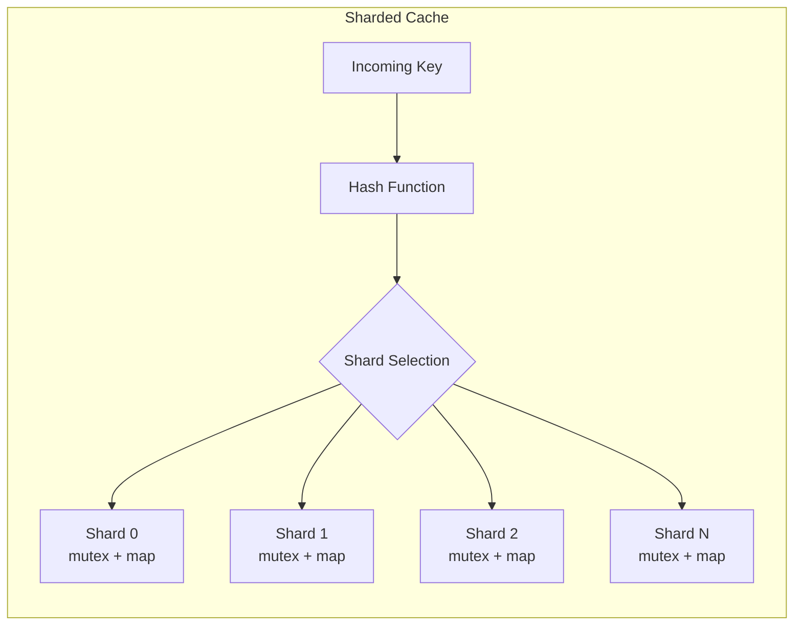

# How to Create Thread-Safe Cache in Go

Author: [nawazdhandala](https://www.github.com/nawazdhandala)

Tags: Go, Cache, Concurrency, Thread Safety, Performance

Description: Build thread-safe in-memory caches in Go using sync.Map, mutexes, and sharding strategies with TTL expiration and eviction policies.

---

> Caching is one of the most effective ways to improve application performance. But in Go, where concurrency is a first-class citizen, your cache must handle simultaneous reads and writes from multiple goroutines. Get it wrong and you will face race conditions, corrupted data, or deadlocks.

This guide walks through building thread-safe caches in Go, starting with simple approaches and progressing to production-ready implementations with TTL expiration and eviction policies.

---

## The Problem with Naive Caching

A regular Go map is not safe for concurrent use. Here is what happens when you try:

```go
// DON'T DO THIS - Race condition waiting to happen
cache := make(map[string]interface{})

go func() {
    cache["key1"] = "value1"
}()

go func() {
    _ = cache["key1"]  // Concurrent read while write may be happening
}()
```

Running this with the race detector (`go run -race`) will immediately flag the problem. Go's runtime will panic if it detects concurrent map writes.

---

## Approach 1: sync.Mutex

The simplest solution is wrapping your map with a mutex. The mutex ensures only one goroutine accesses the map at a time.

```go
package cache

import (
    "sync"
    "time"
)

// MutexCache provides thread-safe caching using a mutex.
// Best for small caches with infrequent access patterns.
type MutexCache struct {
    mu    sync.Mutex           // Guards access to the items map
    items map[string]cacheItem // Internal storage for cached values
}

// cacheItem wraps a value with its expiration time
type cacheItem struct {
    value      interface{}
    expiration time.Time
}

// NewMutexCache creates a new thread-safe cache instance
func NewMutexCache() *MutexCache {
    return &MutexCache{
        items: make(map[string]cacheItem),
    }
}

// Set stores a value with the given TTL (time to live).
// A TTL of 0 means the item never expires.
func (c *MutexCache) Set(key string, value interface{}, ttl time.Duration) {
    c.mu.Lock()         // Acquire exclusive lock
    defer c.mu.Unlock() // Release lock when function returns

    var expiration time.Time
    if ttl > 0 {
        expiration = time.Now().Add(ttl)
    }

    c.items[key] = cacheItem{
        value:      value,
        expiration: expiration,
    }
}

// Get retrieves a value from the cache.
// Returns the value and true if found and not expired.
// Returns nil and false if not found or expired.
func (c *MutexCache) Get(key string) (interface{}, bool) {
    c.mu.Lock()
    defer c.mu.Unlock()

    item, found := c.items[key]
    if !found {
        return nil, false
    }

    // Check if item has expired
    if !item.expiration.IsZero() && time.Now().After(item.expiration) {
        delete(c.items, key) // Clean up expired item
        return nil, false
    }

    return item.value, true
}

// Delete removes an item from the cache
func (c *MutexCache) Delete(key string) {
    c.mu.Lock()
    defer c.mu.Unlock()
    delete(c.items, key)
}
```

This works but has a limitation: readers block each other. Even though reading is safe when no writes occur, every operation takes the same exclusive lock.

---

## Approach 2: sync.RWMutex

For read-heavy workloads, `sync.RWMutex` allows multiple concurrent readers while still ensuring exclusive write access.

```go
package cache

import (
    "sync"
    "time"
)

// RWCache uses RWMutex for better read performance.
// Multiple goroutines can read simultaneously.
type RWCache struct {
    mu    sync.RWMutex         // RW lock allows concurrent reads
    items map[string]cacheItem
}

// NewRWCache creates a cache optimized for read-heavy workloads
func NewRWCache() *RWCache {
    return &RWCache{
        items: make(map[string]cacheItem),
    }
}

// Set acquires a write lock - blocks all readers and writers
func (c *RWCache) Set(key string, value interface{}, ttl time.Duration) {
    c.mu.Lock()         // Exclusive write lock
    defer c.mu.Unlock()

    var expiration time.Time
    if ttl > 0 {
        expiration = time.Now().Add(ttl)
    }

    c.items[key] = cacheItem{
        value:      value,
        expiration: expiration,
    }
}

// Get acquires a read lock - allows other readers, blocks writers
func (c *RWCache) Get(key string) (interface{}, bool) {
    c.mu.RLock()         // Shared read lock
    defer c.mu.RUnlock()

    item, found := c.items[key]
    if !found {
        return nil, false
    }

    // Check expiration
    if !item.expiration.IsZero() && time.Now().After(item.expiration) {
        // Note: We can't delete here with RLock
        // Expired items cleaned up by background goroutine
        return nil, false
    }

    return item.value, true
}

// Delete acquires write lock to remove an item
func (c *RWCache) Delete(key string) {
    c.mu.Lock()
    defer c.mu.Unlock()
    delete(c.items, key)
}
```

---

## Approach 3: sync.Map

Go provides `sync.Map` specifically for concurrent access. It works best when entries are written once and read many times, or when different goroutines access different keys.

```go
package cache

import (
    "sync"
    "time"
)

// SyncMapCache uses Go's built-in sync.Map for concurrency.
// Ideal when keys are mostly written once and read many times.
type SyncMapCache struct {
    items sync.Map // No explicit locking needed
}

// NewSyncMapCache creates a new sync.Map based cache
func NewSyncMapCache() *SyncMapCache {
    return &SyncMapCache{}
}

// Set stores a value - sync.Map handles locking internally
func (c *SyncMapCache) Set(key string, value interface{}, ttl time.Duration) {
    var expiration time.Time
    if ttl > 0 {
        expiration = time.Now().Add(ttl)
    }

    c.items.Store(key, cacheItem{
        value:      value,
        expiration: expiration,
    })
}

// Get retrieves a value with expiration check
func (c *SyncMapCache) Get(key string) (interface{}, bool) {
    data, found := c.items.Load(key)
    if !found {
        return nil, false
    }

    item := data.(cacheItem)

    if !item.expiration.IsZero() && time.Now().After(item.expiration) {
        c.items.Delete(key) // Safe to call concurrently
        return nil, false
    }

    return item.value, true
}

// Delete removes an item from the cache
func (c *SyncMapCache) Delete(key string) {
    c.items.Delete(key)
}

// Len returns the number of items (requires iteration)
func (c *SyncMapCache) Len() int {
    count := 0
    c.items.Range(func(_, _ interface{}) bool {
        count++
        return true
    })
    return count
}
```

The tradeoff is that `sync.Map` does not expose its length directly and iteration requires the `Range` method.

---

## Approach 4: Sharded Cache

For high-throughput scenarios, sharding distributes keys across multiple maps, each with its own lock. This reduces lock contention significantly.



```go
package cache

import (
    "hash/fnv"
    "sync"
    "time"
)

const defaultShardCount = 32 // Power of 2 for efficient modulo

// shard represents a single cache partition with its own lock
type shard struct {
    mu    sync.RWMutex
    items map[string]cacheItem
}

// ShardedCache distributes keys across multiple shards.
// This reduces lock contention for high-throughput workloads.
type ShardedCache struct {
    shards    []*shard
    shardMask uint32 // Used for fast modulo operation
}

// NewShardedCache creates a cache with the specified number of shards.
// shardCount should be a power of 2 for optimal performance.
func NewShardedCache(shardCount int) *ShardedCache {
    if shardCount <= 0 {
        shardCount = defaultShardCount
    }

    // Ensure shard count is a power of 2
    shardCount = nextPowerOf2(shardCount)

    shards := make([]*shard, shardCount)
    for i := range shards {
        shards[i] = &shard{
            items: make(map[string]cacheItem),
        }
    }

    return &ShardedCache{
        shards:    shards,
        shardMask: uint32(shardCount - 1), // For fast bitwise AND
    }
}

// getShard returns the shard for a given key using FNV hash
func (c *ShardedCache) getShard(key string) *shard {
    hash := fnv.New32a()
    hash.Write([]byte(key))
    // Bitwise AND with mask is faster than modulo
    return c.shards[hash.Sum32()&c.shardMask]
}

// Set stores a value in the appropriate shard
func (c *ShardedCache) Set(key string, value interface{}, ttl time.Duration) {
    shard := c.getShard(key)
    shard.mu.Lock()
    defer shard.mu.Unlock()

    var expiration time.Time
    if ttl > 0 {
        expiration = time.Now().Add(ttl)
    }

    shard.items[key] = cacheItem{
        value:      value,
        expiration: expiration,
    }
}

// Get retrieves a value from the appropriate shard
func (c *ShardedCache) Get(key string) (interface{}, bool) {
    shard := c.getShard(key)
    shard.mu.RLock()
    defer shard.mu.RUnlock()

    item, found := shard.items[key]
    if !found {
        return nil, false
    }

    if !item.expiration.IsZero() && time.Now().After(item.expiration) {
        return nil, false
    }

    return item.value, true
}

// Delete removes an item from the appropriate shard
func (c *ShardedCache) Delete(key string) {
    shard := c.getShard(key)
    shard.mu.Lock()
    defer shard.mu.Unlock()
    delete(shard.items, key)
}

// nextPowerOf2 rounds up to the nearest power of 2
func nextPowerOf2(n int) int {
    n--
    n |= n >> 1
    n |= n >> 2
    n |= n >> 4
    n |= n >> 8
    n |= n >> 16
    n++
    return n
}
```

---

## Adding TTL Expiration with Background Cleanup

Expired items should not consume memory forever. A background goroutine can periodically clean them up.

```go
package cache

import (
    "context"
    "sync"
    "time"
)

// TTLCache extends ShardedCache with automatic expiration cleanup
type TTLCache struct {
    *ShardedCache
    cleanupInterval time.Duration
    stopCleanup     context.CancelFunc
}

// NewTTLCache creates a sharded cache with background cleanup
func NewTTLCache(shardCount int, cleanupInterval time.Duration) *TTLCache {
    ctx, cancel := context.WithCancel(context.Background())

    cache := &TTLCache{
        ShardedCache:    NewShardedCache(shardCount),
        cleanupInterval: cleanupInterval,
        stopCleanup:     cancel,
    }

    // Start background cleanup goroutine
    go cache.cleanupLoop(ctx)

    return cache
}

// cleanupLoop runs periodically to remove expired items
func (c *TTLCache) cleanupLoop(ctx context.Context) {
    ticker := time.NewTicker(c.cleanupInterval)
    defer ticker.Stop()

    for {
        select {
        case <-ctx.Done():
            return // Stop cleanup when cache is closed
        case <-ticker.C:
            c.deleteExpired()
        }
    }
}

// deleteExpired removes all expired items from all shards
func (c *TTLCache) deleteExpired() {
    now := time.Now()

    for _, shard := range c.shards {
        shard.mu.Lock()
        for key, item := range shard.items {
            if !item.expiration.IsZero() && now.After(item.expiration) {
                delete(shard.items, key)
            }
        }
        shard.mu.Unlock()
    }
}

// Close stops the background cleanup goroutine
func (c *TTLCache) Close() {
    c.stopCleanup()
}
```

---

## LRU Eviction Policy

When memory is limited, you need to evict items. LRU (Least Recently Used) removes items that have not been accessed recently.

```go
package cache

import (
    "container/list"
    "sync"
)

// LRUCache implements a thread-safe LRU cache with max size
type LRUCache struct {
    mu       sync.Mutex
    maxSize  int
    items    map[string]*list.Element
    eviction *list.List // Front = most recent, Back = least recent
}

// lruItem stores the key-value pair in the eviction list
type lruItem struct {
    key   string
    value interface{}
}

// NewLRUCache creates an LRU cache with the specified max items
func NewLRUCache(maxSize int) *LRUCache {
    return &LRUCache{
        maxSize:  maxSize,
        items:    make(map[string]*list.Element),
        eviction: list.New(),
    }
}

// Set adds or updates an item, evicting LRU item if at capacity
func (c *LRUCache) Set(key string, value interface{}) {
    c.mu.Lock()
    defer c.mu.Unlock()

    // If key exists, update it and move to front
    if elem, found := c.items[key]; found {
        c.eviction.MoveToFront(elem)
        elem.Value.(*lruItem).value = value
        return
    }

    // Evict oldest item if at capacity
    if c.eviction.Len() >= c.maxSize {
        c.evictOldest()
    }

    // Add new item at front (most recently used)
    item := &lruItem{key: key, value: value}
    elem := c.eviction.PushFront(item)
    c.items[key] = elem
}

// Get retrieves a value and marks it as recently used
func (c *LRUCache) Get(key string) (interface{}, bool) {
    c.mu.Lock()
    defer c.mu.Unlock()

    elem, found := c.items[key]
    if !found {
        return nil, false
    }

    // Move to front - this item was just accessed
    c.eviction.MoveToFront(elem)
    return elem.Value.(*lruItem).value, true
}

// evictOldest removes the least recently used item
func (c *LRUCache) evictOldest() {
    oldest := c.eviction.Back()
    if oldest != nil {
        item := oldest.Value.(*lruItem)
        delete(c.items, item.key)
        c.eviction.Remove(oldest)
    }
}

// Len returns the current number of items
func (c *LRUCache) Len() int {
    c.mu.Lock()
    defer c.mu.Unlock()
    return c.eviction.Len()
}
```

---

## Choosing the Right Approach

| Approach | Best For | Tradeoffs |
|----------|----------|-----------|
| **Mutex** | Simple cases, low concurrency | Readers block each other |
| **RWMutex** | Read-heavy workloads | Write starvation possible |
| **sync.Map** | Write-once, read-many | No size limit, iteration cost |
| **Sharded** | High throughput, many keys | Memory overhead, complexity |
| **LRU** | Memory-constrained environments | Overhead per operation |

---

## Benchmarking Your Cache

Always benchmark with your actual workload patterns.

```go
package cache_test

import (
    "fmt"
    "sync"
    "testing"
    "time"
)

func BenchmarkCacheSet(b *testing.B) {
    cache := NewShardedCache(32)

    b.RunParallel(func(pb *testing.PB) {
        i := 0
        for pb.Next() {
            key := fmt.Sprintf("key-%d", i)
            cache.Set(key, i, time.Minute)
            i++
        }
    })
}

func BenchmarkCacheGet(b *testing.B) {
    cache := NewShardedCache(32)

    // Pre-populate cache
    for i := 0; i < 10000; i++ {
        cache.Set(fmt.Sprintf("key-%d", i), i, time.Minute)
    }

    b.ResetTimer()
    b.RunParallel(func(pb *testing.PB) {
        i := 0
        for pb.Next() {
            key := fmt.Sprintf("key-%d", i%10000)
            cache.Get(key)
            i++
        }
    })
}
```

Run benchmarks with: `go test -bench=. -benchmem`

---

## Conclusion

Building a thread-safe cache in Go comes down to understanding your access patterns:

- Start simple with `sync.RWMutex` for most use cases
- Use `sync.Map` when keys are written once and read frequently
- Scale to sharding when you need high throughput
- Add TTL expiration and LRU eviction for production workloads

The Go race detector (`go run -race`) is your best friend when developing concurrent code. Use it early and often.

---

*Need to monitor your Go application's cache performance? [OneUptime](https://oneuptime.com) provides comprehensive observability with metrics, traces, and logs to help you identify cache bottlenecks and optimize your application.*

**Related Reading:**
- [How to Build a Prometheus Client in Go](https://oneuptime.com/blog/post/2026-01-30-prometheus-custom-collectors/view)
- [How to Profile Go Applications](https://oneuptime.com/blog/post/2025-09-09-basics-of-profiling/view)
