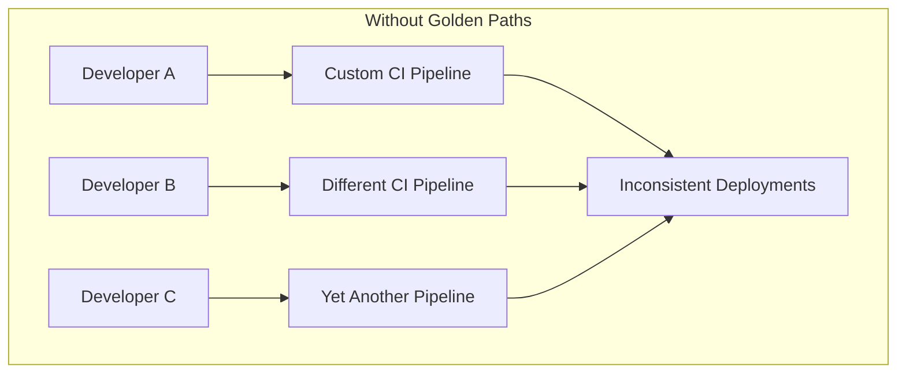
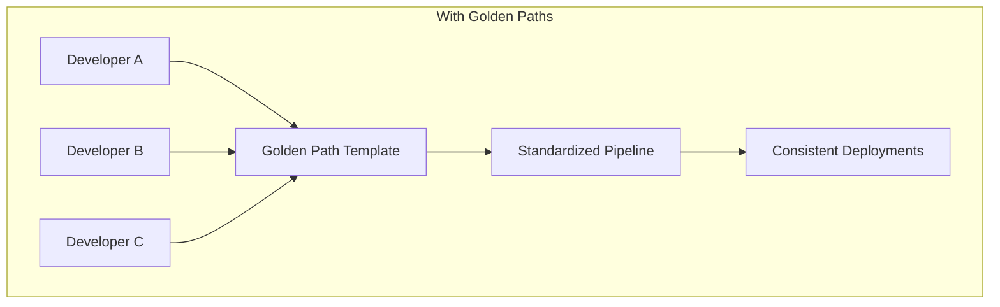
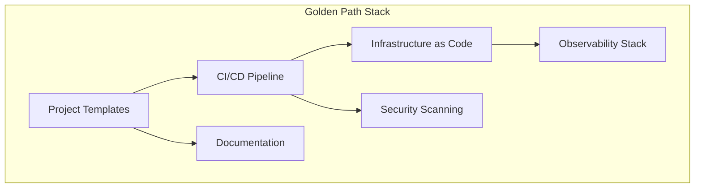
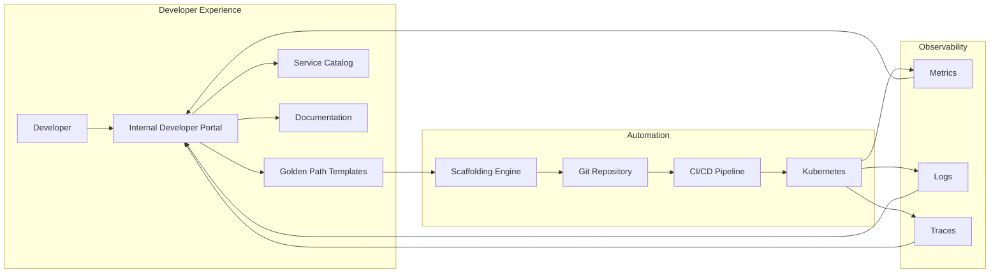
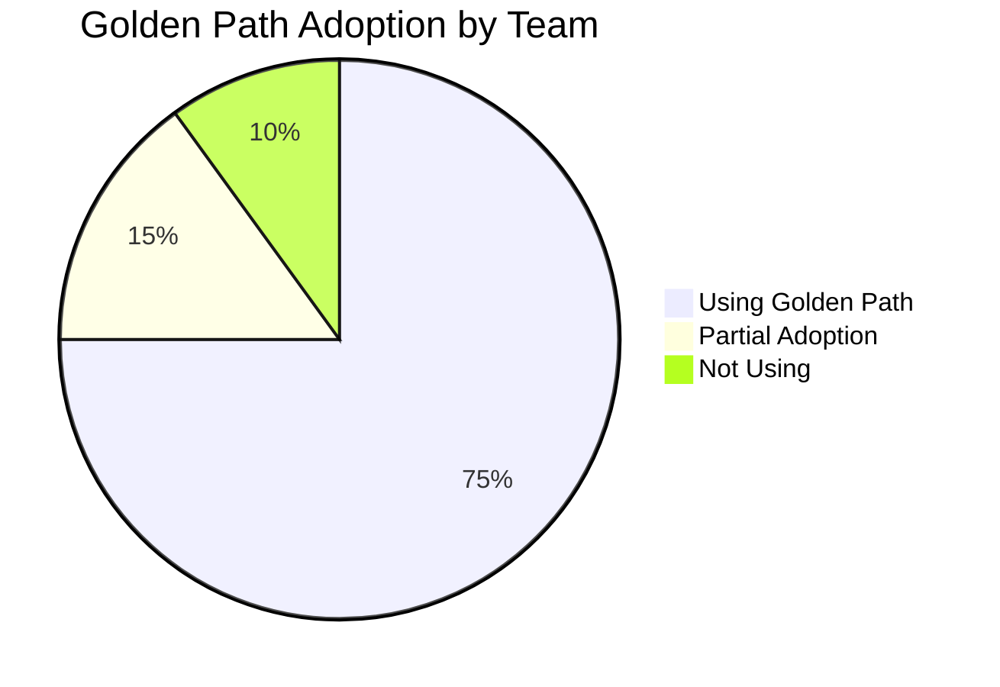

# How to Implement Golden Paths

Author: [nawazdhandala](https://github.com/nawazdhandala)

Tags: Platform Engineering, Developer Experience, DevOps, IDP

Description: Golden Paths are opinionated, well-supported workflows that help developers ship faster while maintaining consistency across your organization.

---

Golden Paths are the backbone of modern platform engineering. They provide developers with a clear, supported way to accomplish common tasks without reinventing the wheel every time. Instead of letting every team build their own deployment pipeline or choose their own monitoring stack, you give them a paved road that just works.

## What Are Golden Paths?

Golden Paths (sometimes called "Paved Roads" or "Happy Paths") are pre-built, opinionated templates and workflows that guide developers through common software development tasks. They represent the recommended way to do something in your organization.





The key characteristics of Golden Paths:

| Characteristic | Description |
|---------------|-------------|
| **Opinionated** | They make decisions for you based on best practices |
| **Well-Supported** | Platform team actively maintains and improves them |
| **Optional** | Developers can deviate if needed, but the default path is easiest |
| **Self-Service** | No tickets required to get started |
| **Observable** | Built-in monitoring, logging, and alerting |

## Why Golden Paths Matter

Without Golden Paths, every team ends up solving the same problems differently. One team uses GitHub Actions, another uses Jenkins, and a third writes custom scripts. This creates:

- **Cognitive overhead**: Developers switching teams must learn new tools
- **Maintenance burden**: Multiple pipelines to update when security patches drop
- **Inconsistent quality**: Some teams have great observability, others have none
- **Slow onboarding**: New hires spend weeks understanding team-specific tooling

Golden Paths solve this by giving everyone a common foundation that embodies organizational best practices.

## Core Components of a Golden Path

A complete Golden Path typically includes these layers:



## Building Your First Golden Path: A Microservice Template

Let us walk through creating a Golden Path for deploying a Node.js microservice. This example uses common tools, but the principles apply to any stack.

### Step 1: Define the Project Template

Start with a Cookiecutter or Yeoman template that generates a complete project structure.

The following template structure includes everything a new microservice needs: source code scaffolding, tests, CI configuration, Kubernetes manifests, and documentation.

```
golden-path-nodejs/
├── {{cookiecutter.service_name}}/
│   ├── src/
│   │   ├── index.ts
│   │   ├── routes/
│   │   │   └── health.ts
│   │   └── middleware/
│   │       └── logging.ts
│   ├── tests/
│   │   └── health.test.ts
│   ├── .github/
│   │   └── workflows/
│   │       └── ci.yml
│   ├── k8s/
│   │   ├── base/
│   │   │   ├── deployment.yaml
│   │   │   ├── service.yaml
│   │   │   └── kustomization.yaml
│   │   └── overlays/
│   │       ├── dev/
│   │       ├── staging/
│   │       └── production/
│   ├── Dockerfile
│   ├── package.json
│   ├── tsconfig.json
│   └── README.md
└── cookiecutter.json
```

The cookiecutter.json file defines the variables that developers will provide when creating a new service.

```json
{
  "service_name": "my-service",
  "description": "A microservice that does something useful",
  "team_name": "platform",
  "port": "3000",
  "owner_email": "team@company.com"
}
```

### Step 2: Create the Dockerfile

The Dockerfile follows best practices: multi-stage build, non-root user, and health checks built in.

```dockerfile
# Build stage: compile TypeScript and install dependencies
FROM node:20-alpine AS builder

WORKDIR /app

# Copy package files first for better layer caching
COPY package*.json ./
RUN npm ci

# Copy source and build
COPY tsconfig.json ./
COPY src ./src
RUN npm run build

# Production stage: minimal image with only runtime dependencies
FROM node:20-alpine AS production

# Security: run as non-root user
RUN addgroup -g 1001 -S nodejs && \
    adduser -S nodejs -u 1001

WORKDIR /app

# Copy only production dependencies
COPY package*.json ./
RUN npm ci --only=production && npm cache clean --force

# Copy built application from builder stage
COPY --from=builder /app/dist ./dist

# Switch to non-root user
USER nodejs

# Expose the application port
EXPOSE {{cookiecutter.port}}

# Health check endpoint for container orchestration
HEALTHCHECK --interval=30s --timeout=3s --start-period=5s --retries=3 \
  CMD wget --no-verbose --tries=1 --spider http://localhost:{{cookiecutter.port}}/health || exit 1

CMD ["node", "dist/index.js"]
```

### Step 3: Build the CI/CD Pipeline

This GitHub Actions workflow handles the entire lifecycle: test, build, scan, and deploy.

```yaml
# .github/workflows/ci.yml
# Golden Path CI/CD Pipeline for Node.js Microservices
# This pipeline runs on every push and handles testing, building, and deployment

name: CI/CD Pipeline

on:
  push:
    branches: [main, develop]
  pull_request:
    branches: [main]

env:
  REGISTRY: ghcr.io
  IMAGE_NAME: ${{ github.repository }}

jobs:
  # First job: Run all tests and quality checks
  test:
    runs-on: ubuntu-latest
    steps:
      - uses: actions/checkout@v4

      - name: Setup Node.js
        uses: actions/setup-node@v4
        with:
          node-version: '20'
          cache: 'npm'

      - name: Install dependencies
        run: npm ci

      - name: Run linter
        run: npm run lint

      - name: Run tests with coverage
        run: npm run test:coverage

      - name: Upload coverage to Codecov
        uses: codecov/codecov-action@v4
        with:
          token: ${{ secrets.CODECOV_TOKEN }}

  # Second job: Build and push container image
  build:
    needs: test
    runs-on: ubuntu-latest
    permissions:
      contents: read
      packages: write

    steps:
      - uses: actions/checkout@v4

      - name: Log in to Container Registry
        uses: docker/login-action@v3
        with:
          registry: ${{ env.REGISTRY }}
          username: ${{ github.actor }}
          password: ${{ secrets.GITHUB_TOKEN }}

      - name: Extract metadata for Docker
        id: meta
        uses: docker/metadata-action@v5
        with:
          images: ${{ env.REGISTRY }}/${{ env.IMAGE_NAME }}
          tags: |
            type=sha,prefix=
            type=ref,event=branch
            type=semver,pattern={{version}}

      - name: Build and push Docker image
        uses: docker/build-push-action@v5
        with:
          context: .
          push: ${{ github.event_name != 'pull_request' }}
          tags: ${{ steps.meta.outputs.tags }}
          labels: ${{ steps.meta.outputs.labels }}

  # Third job: Security scanning
  security:
    needs: build
    runs-on: ubuntu-latest
    steps:
      - uses: actions/checkout@v4

      - name: Run Trivy vulnerability scanner
        uses: aquasecurity/trivy-action@master
        with:
          image-ref: '${{ env.REGISTRY }}/${{ env.IMAGE_NAME }}:${{ github.sha }}'
          format: 'sarif'
          output: 'trivy-results.sarif'

      - name: Upload Trivy scan results
        uses: github/codeql-action/upload-sarif@v3
        with:
          sarif_file: 'trivy-results.sarif'

  # Fourth job: Deploy to appropriate environment
  deploy:
    needs: [build, security]
    runs-on: ubuntu-latest
    if: github.ref == 'refs/heads/main'

    steps:
      - uses: actions/checkout@v4

      - name: Deploy to Kubernetes
        uses: azure/k8s-deploy@v4
        with:
          manifests: |
            k8s/overlays/production/
          images: |
            ${{ env.REGISTRY }}/${{ env.IMAGE_NAME }}:${{ github.sha }}
```

### Step 4: Configure Kubernetes Manifests

The base deployment includes everything needed for production: resource limits, health checks, and pod disruption budgets.

```yaml
# k8s/base/deployment.yaml
# Base Kubernetes deployment with production-ready defaults
apiVersion: apps/v1
kind: Deployment
metadata:
  name: {{cookiecutter.service_name}}
  labels:
    app: {{cookiecutter.service_name}}
    team: {{cookiecutter.team_name}}
spec:
  replicas: 2
  selector:
    matchLabels:
      app: {{cookiecutter.service_name}}
  template:
    metadata:
      labels:
        app: {{cookiecutter.service_name}}
        team: {{cookiecutter.team_name}}
      annotations:
        # Enable Prometheus scraping for metrics
        prometheus.io/scrape: "true"
        prometheus.io/port: "{{cookiecutter.port}}"
        prometheus.io/path: "/metrics"
    spec:
      # Security context: run as non-root
      securityContext:
        runAsNonRoot: true
        runAsUser: 1001
        fsGroup: 1001

      containers:
        - name: {{cookiecutter.service_name}}
          image: {{cookiecutter.service_name}}:latest
          ports:
            - containerPort: {{cookiecutter.port}}
              name: http

          # Resource limits prevent noisy neighbor problems
          resources:
            requests:
              memory: "128Mi"
              cpu: "100m"
            limits:
              memory: "512Mi"
              cpu: "500m"

          # Liveness probe: restart if unhealthy
          livenessProbe:
            httpGet:
              path: /health/live
              port: http
            initialDelaySeconds: 10
            periodSeconds: 10
            failureThreshold: 3

          # Readiness probe: remove from load balancer if not ready
          readinessProbe:
            httpGet:
              path: /health/ready
              port: http
            initialDelaySeconds: 5
            periodSeconds: 5
            failureThreshold: 3

          # Environment variables from ConfigMap and Secrets
          envFrom:
            - configMapRef:
                name: {{cookiecutter.service_name}}-config
            - secretRef:
                name: {{cookiecutter.service_name}}-secrets
                optional: true

          # Container security context
          securityContext:
            allowPrivilegeEscalation: false
            readOnlyRootFilesystem: true
            capabilities:
              drop:
                - ALL

      # Spread pods across nodes for high availability
      topologySpreadConstraints:
        - maxSkew: 1
          topologyKey: kubernetes.io/hostname
          whenUnsatisfiable: ScheduleAnyway
          labelSelector:
            matchLabels:
              app: {{cookiecutter.service_name}}
```

### Step 5: Add Observability from Day One

The Golden Path includes OpenTelemetry instrumentation so every service has tracing, metrics, and logging out of the box.

```typescript
// src/observability/setup.ts
// Initialize OpenTelemetry instrumentation for automatic tracing
// This must be imported before any other modules

import { NodeSDK } from '@opentelemetry/sdk-node';
import { getNodeAutoInstrumentations } from '@opentelemetry/auto-instrumentations-node';
import { OTLPTraceExporter } from '@opentelemetry/exporter-trace-otlp-http';
import { OTLPMetricExporter } from '@opentelemetry/exporter-metrics-otlp-http';
import { PeriodicExportingMetricReader } from '@opentelemetry/sdk-metrics';
import { Resource } from '@opentelemetry/resources';
import { SemanticResourceAttributes } from '@opentelemetry/semantic-conventions';

// Service identification for distributed tracing
const resource = new Resource({
  [SemanticResourceAttributes.SERVICE_NAME]: process.env.SERVICE_NAME || '{{cookiecutter.service_name}}',
  [SemanticResourceAttributes.SERVICE_VERSION]: process.env.SERVICE_VERSION || '1.0.0',
  [SemanticResourceAttributes.DEPLOYMENT_ENVIRONMENT]: process.env.NODE_ENV || 'development',
});

// Configure the OpenTelemetry SDK with automatic instrumentation
const sdk = new NodeSDK({
  resource,
  // Trace exporter sends spans to the collector
  traceExporter: new OTLPTraceExporter({
    url: process.env.OTEL_EXPORTER_OTLP_ENDPOINT || 'http://otel-collector:4318/v1/traces',
  }),
  // Metric reader periodically exports metrics
  metricReader: new PeriodicExportingMetricReader({
    exporter: new OTLPMetricExporter({
      url: process.env.OTEL_EXPORTER_OTLP_ENDPOINT || 'http://otel-collector:4318/v1/metrics',
    }),
    exportIntervalMillis: 60000, // Export every minute
  }),
  // Auto-instrumentation for common libraries
  instrumentations: [
    getNodeAutoInstrumentations({
      // Customize instrumentation as needed
      '@opentelemetry/instrumentation-http': {
        ignoreIncomingPaths: ['/health', '/health/live', '/health/ready'],
      },
      '@opentelemetry/instrumentation-fs': {
        enabled: false, // Disable file system tracing (too noisy)
      },
    }),
  ],
});

// Start the SDK and handle shutdown gracefully
sdk.start();

process.on('SIGTERM', () => {
  sdk.shutdown()
    .then(() => console.log('OpenTelemetry SDK shut down successfully'))
    .catch((error) => console.error('Error shutting down OpenTelemetry SDK', error))
    .finally(() => process.exit(0));
});

export { sdk };
```

The main application entry point imports observability first.

```typescript
// src/index.ts
// Import observability setup first to instrument all subsequent imports
import './observability/setup';

import express from 'express';
import { createLogger, transports, format } from 'winston';
import { healthRouter } from './routes/health';
import { metricsMiddleware } from './middleware/metrics';

// Structured logging with correlation IDs
const logger = createLogger({
  level: process.env.LOG_LEVEL || 'info',
  format: format.combine(
    format.timestamp(),
    format.json()
  ),
  defaultMeta: {
    service: '{{cookiecutter.service_name}}',
    version: process.env.SERVICE_VERSION || '1.0.0'
  },
  transports: [
    new transports.Console()
  ],
});

const app = express();
const port = process.env.PORT || {{cookiecutter.port}};

// Apply metrics middleware to track request duration and count
app.use(metricsMiddleware);

// Parse JSON bodies
app.use(express.json());

// Health check endpoints for Kubernetes probes
app.use('/health', healthRouter);

// Your application routes go here
app.get('/', (req, res) => {
  logger.info('Root endpoint accessed', {
    path: req.path,
    method: req.method
  });
  res.json({ message: 'Hello from {{cookiecutter.service_name}}!' });
});

// Start the server
app.listen(port, () => {
  logger.info(`Server started`, { port });
});
```

## Implementing Golden Paths with an Internal Developer Portal

An Internal Developer Portal (IDP) like Backstage makes Golden Paths discoverable and easy to use. Here is how the pieces fit together:



### Backstage Software Template Example

This template definition allows developers to create new services through the Backstage UI.

```yaml
# template.yaml
# Backstage Software Template for Node.js Microservices
apiVersion: scaffolder.backstage.io/v1beta3
kind: Template
metadata:
  name: nodejs-microservice
  title: Node.js Microservice
  description: Create a production-ready Node.js microservice with CI/CD, observability, and Kubernetes deployment
  tags:
    - nodejs
    - microservice
    - recommended
spec:
  owner: platform-team
  type: service

  # Parameters the developer will fill out in the UI
  parameters:
    - title: Service Information
      required:
        - name
        - description
        - owner
      properties:
        name:
          title: Service Name
          type: string
          description: Unique name for the service (lowercase, hyphens allowed)
          pattern: '^[a-z0-9-]+$'
          ui:autofocus: true
        description:
          title: Description
          type: string
          description: What does this service do?
        owner:
          title: Owner
          type: string
          description: Team that owns this service
          ui:field: OwnerPicker
          ui:options:
            allowedKinds:
              - Group

    - title: Technical Configuration
      properties:
        port:
          title: Port
          type: number
          default: 3000
          description: Port the service listens on
        database:
          title: Database
          type: string
          enum:
            - none
            - postgresql
            - mongodb
          default: none
          description: Database type (optional)

    - title: Repository Location
      required:
        - repoUrl
      properties:
        repoUrl:
          title: Repository Location
          type: string
          ui:field: RepoUrlPicker
          ui:options:
            allowedHosts:
              - github.com

  # Steps to execute when creating the service
  steps:
    # Generate project files from template
    - id: fetch
      name: Fetch Template
      action: fetch:template
      input:
        url: ./skeleton
        values:
          name: ${{ parameters.name }}
          description: ${{ parameters.description }}
          owner: ${{ parameters.owner }}
          port: ${{ parameters.port }}
          database: ${{ parameters.database }}

    # Create the GitHub repository
    - id: publish
      name: Publish to GitHub
      action: publish:github
      input:
        allowedHosts: ['github.com']
        description: ${{ parameters.description }}
        repoUrl: ${{ parameters.repoUrl }}
        defaultBranch: main
        protectDefaultBranch: true
        requireCodeOwnerReviews: true

    # Register in the service catalog
    - id: register
      name: Register in Catalog
      action: catalog:register
      input:
        repoContentsUrl: ${{ steps.publish.output.repoContentsUrl }}
        catalogInfoPath: '/catalog-info.yaml'

  # Output shown to the developer after creation
  output:
    links:
      - title: Repository
        url: ${{ steps.publish.output.remoteUrl }}
      - title: Open in Catalog
        icon: catalog
        entityRef: ${{ steps.register.output.entityRef }}
```

## Governance Without Gatekeeping

Golden Paths should guide, not block. Here is how to implement governance that helps rather than hinders:

### Automated Policy Checks

Use Open Policy Agent (OPA) to enforce standards automatically.

```rego
# policy/kubernetes.rego
# OPA policy to validate Kubernetes deployments against Golden Path standards

package kubernetes.admission

# Deny deployments without resource limits
deny[msg] {
    input.kind == "Deployment"
    container := input.spec.template.spec.containers[_]
    not container.resources.limits
    msg := sprintf("Container '%s' must have resource limits defined", [container.name])
}

# Deny deployments without health checks
deny[msg] {
    input.kind == "Deployment"
    container := input.spec.template.spec.containers[_]
    not container.livenessProbe
    msg := sprintf("Container '%s' must have a liveness probe", [container.name])
}

# Deny deployments without readiness checks
deny[msg] {
    input.kind == "Deployment"
    container := input.spec.template.spec.containers[_]
    not container.readinessProbe
    msg := sprintf("Container '%s' must have a readiness probe", [container.name])
}

# Warn about deployments with single replica
warn[msg] {
    input.kind == "Deployment"
    input.spec.replicas == 1
    msg := "Production deployments should have at least 2 replicas for high availability"
}

# Deny containers running as root
deny[msg] {
    input.kind == "Deployment"
    container := input.spec.template.spec.containers[_]
    not input.spec.template.spec.securityContext.runAsNonRoot
    msg := "Pods must run as non-root user"
}
```

### Compliance Dashboard

Track Golden Path adoption across your organization.



## Measuring Golden Path Success

Track these metrics to understand if your Golden Paths are working:

| Metric | Description | Target |
|--------|-------------|--------|
| **Adoption Rate** | Percentage of new services using Golden Path | > 80% |
| **Time to First Deploy** | Time from project creation to production | < 1 day |
| **Onboarding Time** | Time for new developer to ship first feature | < 1 week |
| **Deployment Frequency** | How often teams deploy | Daily or more |
| **Change Failure Rate** | Percentage of deployments causing incidents | < 5% |
| **Mean Time to Recovery** | Time to restore service after incident | < 1 hour |

## Common Pitfalls to Avoid

**Too Rigid**: If the Golden Path does not allow any customization, teams will abandon it. Build in escape hatches for legitimate edge cases.

**Not Maintained**: A Golden Path that falls behind on security patches or best practices becomes a liability. Dedicate platform engineering time to keep it current.

**Poor Documentation**: Even the best tooling fails without clear docs. Include runbooks, troubleshooting guides, and architecture decision records.

**No Feedback Loop**: Your Golden Path should evolve based on user feedback. Set up regular office hours and surveys to understand pain points.

## Getting Started

1. **Start Small**: Pick one common task (like deploying a web service) and build a Golden Path for it
2. **Get Buy-In**: Work with 2-3 early adopter teams to refine the template
3. **Document Everything**: Create getting-started guides, FAQs, and video walkthroughs
4. **Iterate**: Collect feedback and improve continuously
5. **Scale**: Once proven, expand to other use cases

Golden Paths are not about restricting developers. They are about removing friction so developers can focus on what matters: building great products. When implemented well, Golden Paths make the right way the easy way.

**Related Reading:**

- [Service Catalog with OneUptime](https://oneuptime.com/blog/post/2025-10-27-service-catalog-with-oneuptime/view)
- [The Five Stages of SRE Maturity](https://oneuptime.com/blog/post/2025-09-01-the-five-stages-of-sre-maturity/view)
- [How to Implement GitOps with ArgoCD in Kubernetes](https://oneuptime.com/blog/post/2026-01-06-kubernetes-gitops-argocd/view)
