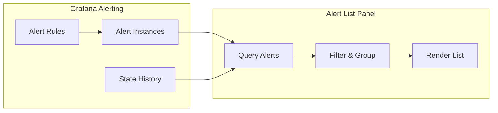
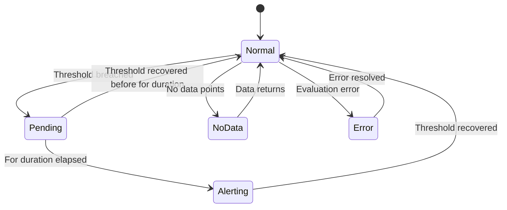
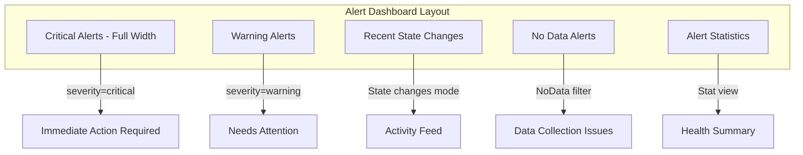
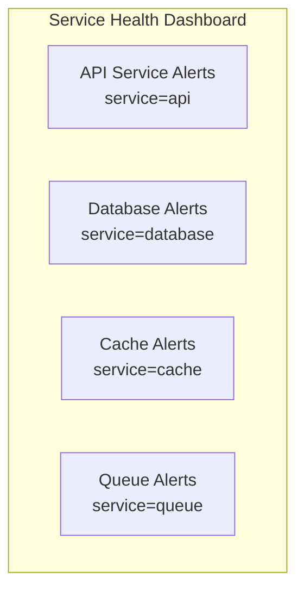

# How to Create Grafana Alert List Panel

Author: [nawazdhandala](https://github.com/nawazdhandala)

Tags: Grafana, Observability, Alerting, Dashboards

Description: Learn how to configure and customize Grafana Alert List panels to display, filter, and manage alerts directly from your dashboards.

---

You have spent hours setting up alerts in Grafana. They fire. They resolve. But every time you need to check the current alert state, you open a new tab, navigate to Alerting, filter by folder, scroll through the list. It works, but it breaks your flow.

The Alert List panel solves this by embedding a live view of your alerts directly into any dashboard. You get real-time visibility into firing alerts, recent state changes, and alert history without leaving your operational dashboard. For teams running incident response or maintaining service health dashboards, this panel is essential.

This guide covers everything from basic setup to advanced configurations including filtering, grouping, styling, and integration patterns that make your Alert List panels genuinely useful.

## What Is the Alert List Panel?

The Alert List panel is a built-in Grafana visualization that displays alerts from Grafana Alerting. Unlike metric panels that visualize time-series data, the Alert List panel queries the alerting subsystem directly and renders alert instances as a scrollable list.



Key capabilities include:

- Display alerts by state (firing, pending, normal, no data, error)
- Filter by alert name, folder, label, or data source
- Show recent state transitions
- Link directly to alert rule details
- Group alerts by label or folder

## Creating Your First Alert List Panel

Let us start with a basic Alert List panel that shows all currently firing alerts.

### Step 1: Add a New Panel

Open your dashboard in edit mode, then add a new panel. In the visualization picker, search for "Alert list" and select it.

### Step 2: Configure Basic Options

The panel options appear in the right sidebar. Start with these settings:

```yaml
Panel Options:
  Title: "Active Alerts"

Options:
  View mode: List
  Max items: 20
  Sort order: Alerting first
  Show alerts from: This dashboard
```

This configuration displays up to 20 alerts associated with the current dashboard, sorted with firing alerts at the top.

### Step 3: Choose What to Display

The Alert List panel offers two primary modes. The first mode shows current alert state, displaying the current state of alert rules. The second mode shows state changes, displaying a history of recent state transitions.

For an operational dashboard, you typically want state changes to see what fired recently and what just resolved.

## Filtering Alerts

Real dashboards require filtering. You do not want to see every alert in your Grafana instance on every dashboard.

### Filter by Folder

Organize your alert rules into folders by service or team, then filter the Alert List panel to show only relevant folders.

The following configuration shows how to filter by folder:

```yaml
Options:
  Alert name: ""
  Alert instance label: ""
  Folder: "Production Services"
  Datasource: All
```

### Filter by Alert Name

Use regex patterns to filter alerts by name. This is useful when you want to show only alerts matching a specific pattern.

This example configuration filters to show only payment-related alerts:

```yaml
Options:
  Alert name: "payment.*"
```

### Filter by Labels

Labels provide the most flexible filtering. If your alert rules include labels like `team`, `service`, or `severity`, you can filter on them.

Here is an example that filters to show only critical severity alerts for the platform team:

```yaml
Options:
  Alert instance label: "team=platform, severity=critical"
```

Multiple label filters use AND logic. The alert must match all specified labels.

## Alert States Explained

Understanding alert states helps you configure meaningful panels. Grafana Alerting uses these states:



Each state has distinct meaning:

- **Normal**: Alert condition is not met, everything is healthy
- **Pending**: Condition is met but the "for" duration has not elapsed yet
- **Alerting**: Condition is met and has been firing long enough to trigger
- **No Data**: The query returned no data points
- **Error**: The alert rule failed to evaluate (query error, datasource issue)

### Configuring State Filters

You can filter which states appear in your panel. For a "critical issues" panel, show only Alerting and Error states.

```yaml
Options:
  State filter:
    Alerting: true
    Pending: false
    Normal: false
    No Data: false
    Error: true
```

## View Modes and Display Options

### List View

List view shows alerts as individual rows with state indicators, labels, and timestamps.

```yaml
Options:
  View mode: List
  Show instances: true
```

With "Show instances" enabled, you see individual alert instances. When disabled, you see aggregated rule status.

### Stat View

Stat view shows a count of alerts in each state. This is useful for summary panels.

```yaml
Options:
  View mode: Stat
```

## Grouping Alerts

Grouping helps organize alerts logically. You can group by label values or by folder.

### Group by Label

When you have many alerts with a common label, grouping provides visual organization.

```yaml
Options:
  Group mode: Custom
  Group by: team
```

This creates collapsible sections for each unique value of the `team` label.

### Group by Folder

```yaml
Options:
  Group mode: Default
```

Default grouping uses the alert rule folder structure.

## Building an Operational Alert Dashboard

Let us build a complete alert dashboard with multiple Alert List panels serving different purposes.



### Panel 1: Critical Alerts

This panel shows all critical severity alerts that are currently firing.

```json
{
  "type": "alertlist",
  "title": "Critical Alerts",
  "options": {
    "maxItems": 50,
    "sortOrder": 1,
    "alertInstanceLabelFilter": "severity=critical",
    "stateFilter": {
      "firing": true,
      "pending": false,
      "normal": false,
      "noData": false,
      "error": true
    },
    "viewMode": "list"
  },
  "gridPos": {
    "h": 8,
    "w": 24,
    "x": 0,
    "y": 0
  }
}
```

### Panel 2: Warning Alerts

Similar configuration but filtered for warning severity.

```json
{
  "type": "alertlist",
  "title": "Warning Alerts",
  "options": {
    "maxItems": 30,
    "sortOrder": 1,
    "alertInstanceLabelFilter": "severity=warning",
    "stateFilter": {
      "firing": true,
      "pending": true,
      "normal": false,
      "noData": false,
      "error": false
    },
    "viewMode": "list"
  },
  "gridPos": {
    "h": 8,
    "w": 12,
    "x": 0,
    "y": 8
  }
}
```

### Panel 3: Recent State Changes

Show the activity feed of alert state transitions.

```json
{
  "type": "alertlist",
  "title": "Recent State Changes",
  "options": {
    "maxItems": 20,
    "sortOrder": 3,
    "showInstances": true,
    "viewMode": "list",
    "stateFilter": {
      "firing": true,
      "pending": true,
      "normal": true,
      "noData": true,
      "error": true
    }
  },
  "gridPos": {
    "h": 8,
    "w": 12,
    "x": 12,
    "y": 8
  }
}
```

### Panel 4: Alert Statistics

Use stat view to show counts by state.

```json
{
  "type": "alertlist",
  "title": "Alert Overview",
  "options": {
    "viewMode": "stat",
    "stateFilter": {
      "firing": true,
      "pending": true,
      "normal": true,
      "noData": true,
      "error": true
    }
  },
  "gridPos": {
    "h": 4,
    "w": 24,
    "x": 0,
    "y": 16
  }
}
```

## Using Dashboard Variables with Alert List

Dashboard variables make your Alert List panels dynamic. Users can filter alerts without editing the panel.

### Create a Team Variable

First, create a custom variable for team selection:

```yaml
Variable:
  Name: team
  Type: Custom
  Values: platform, payments, search, infrastructure
  Multi-value: true
  Include All option: true
```

### Reference Variable in Panel

Use the variable in your alert instance label filter:

```yaml
Options:
  Alert instance label: "team=${team}"
```

Now users can select one or more teams from the dropdown, and the Alert List panel updates dynamically.

### Service Variable from Labels

You can also create variables that query existing label values from Prometheus:

```yaml
Variable:
  Name: service
  Type: Query
  Data source: Prometheus
  Query: label_values(ALERTS, service)
```

## Styling and Appearance

### Panel Background

For critical alert panels, consider using a distinct background color. In panel options:

```yaml
Panel options:
  Transparent: false

Standard options:
  Color scheme: From thresholds (by value)
```

### Link to Alert Details

The Alert List panel automatically links alert names to their rule definitions. You can add additional links in the panel options:

```yaml
Panel links:
  - Title: "View All Alerts"
    URL: "/alerting/list"

  - Title: "Silence Alerts"
    URL: "/alerting/silences"
```

## Common Configuration Patterns

### Pattern 1: Service Health Dashboard

Each service gets its own Alert List panel filtered by service label.



### Pattern 2: On-Call Dashboard

Show alerts grouped by the on-call team responsible.

```json
{
  "type": "alertlist",
  "title": "On-Call Alerts",
  "options": {
    "groupMode": "custom",
    "groupBy": "oncall_team",
    "stateFilter": {
      "firing": true,
      "pending": true,
      "normal": false,
      "noData": false,
      "error": true
    }
  }
}
```

### Pattern 3: SLA Dashboard

Filter to show only SLA-impacting alerts.

```yaml
Options:
  Alert instance label: "sla_impact=true"
  State filter:
    Alerting: true
    Error: true
```

## Troubleshooting Alert List Panels

### Alerts Not Appearing

1. **Check folder filter**: Ensure the folder filter matches where your alerts are defined
2. **Verify label filters**: Label filters are case-sensitive and require exact matches
3. **Confirm alert state**: Normal state alerts only appear if you enable that state filter
4. **Check permissions**: The viewer must have permission to view the alert rules

### Panel Shows "No data"

This usually means no alerts match your filter criteria. To debug:

1. Remove all filters temporarily
2. Add filters back one at a time
3. Verify alert labels in the Alerting UI match your filter syntax

### Slow Panel Loading

Alert List panels query the Grafana alerting database. If loading is slow:

1. Reduce the max items setting
2. Add more specific filters
3. Check Grafana server performance

## Integrating Alert List with OneUptime

If you use OneUptime alongside Grafana, you can create a unified alerting view. OneUptime can receive alerts from Grafana via webhook and correlate them with incidents. Your Grafana Alert List panel shows real-time alert state, while OneUptime provides:

- Incident management and escalation
- On-call scheduling
- Status page updates
- Alert correlation across multiple sources

Configure Grafana contact points to send alerts to OneUptime, then view the unified picture in both systems.

## Complete Dashboard JSON

Here is a complete dashboard JSON you can import to get started:

```json
{
  "dashboard": {
    "title": "Alert Operations Center",
    "uid": "alert-ops-center",
    "tags": ["alerting", "operations"],
    "timezone": "browser",
    "panels": [
      {
        "id": 1,
        "type": "alertlist",
        "title": "Critical Alerts",
        "gridPos": {"h": 8, "w": 24, "x": 0, "y": 0},
        "options": {
          "maxItems": 50,
          "sortOrder": 1,
          "alertInstanceLabelFilter": "severity=critical",
          "stateFilter": {
            "firing": true,
            "pending": false,
            "normal": false,
            "noData": false,
            "error": true
          },
          "viewMode": "list"
        }
      },
      {
        "id": 2,
        "type": "alertlist",
        "title": "Warning Alerts",
        "gridPos": {"h": 8, "w": 12, "x": 0, "y": 8},
        "options": {
          "maxItems": 30,
          "sortOrder": 1,
          "alertInstanceLabelFilter": "severity=warning",
          "stateFilter": {
            "firing": true,
            "pending": true,
            "normal": false,
            "noData": false,
            "error": false
          },
          "viewMode": "list"
        }
      },
      {
        "id": 3,
        "type": "alertlist",
        "title": "Recent State Changes",
        "gridPos": {"h": 8, "w": 12, "x": 12, "y": 8},
        "options": {
          "maxItems": 20,
          "sortOrder": 3,
          "showInstances": true,
          "viewMode": "list"
        }
      },
      {
        "id": 4,
        "type": "alertlist",
        "title": "No Data Alerts",
        "gridPos": {"h": 6, "w": 12, "x": 0, "y": 16},
        "options": {
          "maxItems": 15,
          "sortOrder": 1,
          "stateFilter": {
            "firing": false,
            "pending": false,
            "normal": false,
            "noData": true,
            "error": false
          },
          "viewMode": "list"
        }
      },
      {
        "id": 5,
        "type": "alertlist",
        "title": "Alert Statistics",
        "gridPos": {"h": 6, "w": 12, "x": 12, "y": 16},
        "options": {
          "viewMode": "stat"
        }
      }
    ],
    "templating": {
      "list": [
        {
          "name": "team",
          "type": "custom",
          "query": "platform,payments,search,infrastructure",
          "multi": true,
          "includeAll": true
        }
      ]
    },
    "refresh": "30s",
    "schemaVersion": 38
  }
}
```

## Summary

The Grafana Alert List panel transforms your dashboards from passive metric displays into active operational centers. By embedding alert visibility directly where you monitor metrics, you eliminate context switching and accelerate incident response.

Key points to remember:

1. **Filter strategically** using folders, names, labels, and states to show relevant alerts
2. **Use grouping** to organize alerts by team, service, or severity
3. **Combine multiple panels** with different filters for comprehensive coverage
4. **Leverage dashboard variables** to make panels interactive
5. **Link to alert management** for quick access to silencing and rule editing

Start with a simple panel showing firing alerts, then iterate based on your team's workflow. The goal is instant visibility into what needs attention right now.

---

**Related Reading:**

- [Three Pillars of Observability: Logs, Metrics, and Traces](https://oneuptime.com/blog/post/2025-08-20-three-pillars-of-observability-logs-metrics-traces/view)
- [SRE Best Practices](https://oneuptime.com/blog/post/2025-11-28-sre-best-practices/view)
- [How to Create Grafana Annotations](https://oneuptime.com/blog/post/2026-01-30-grafana-annotations-advanced/view)
