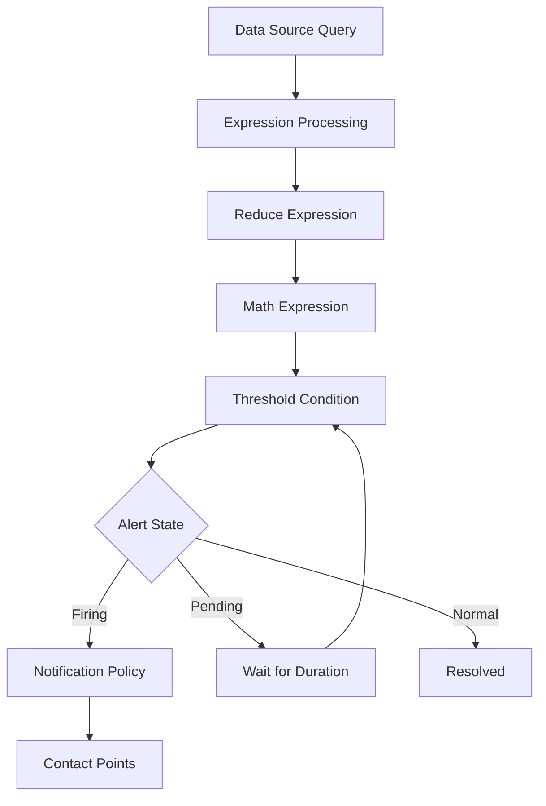
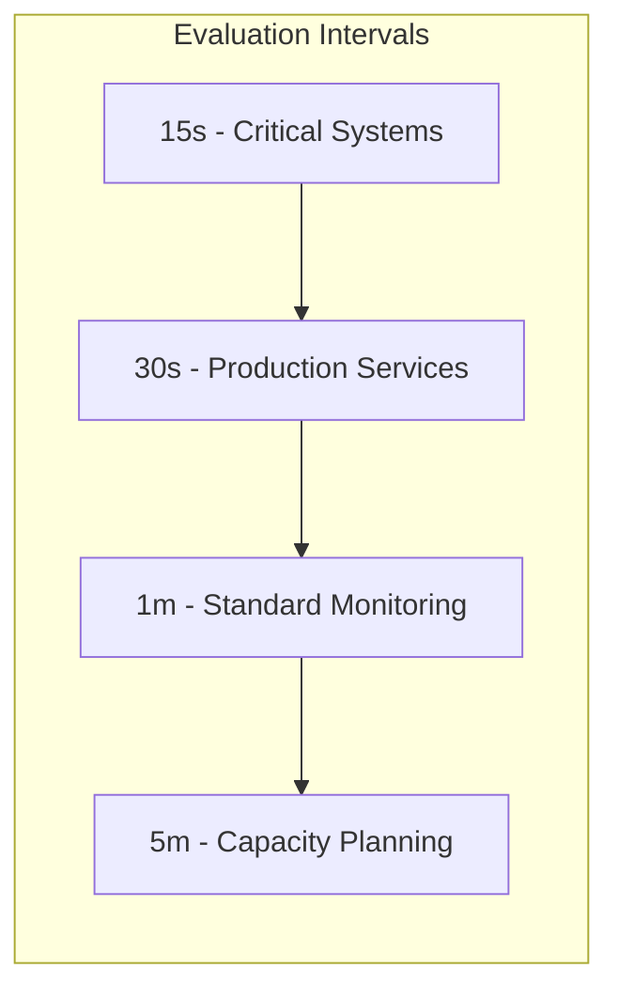
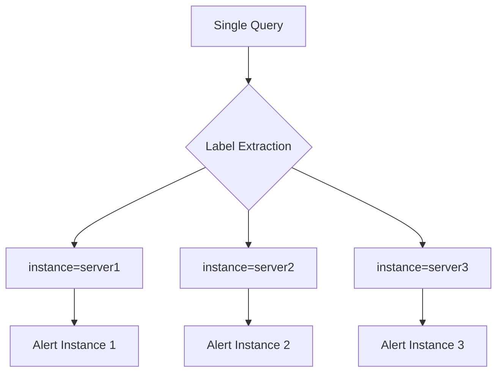
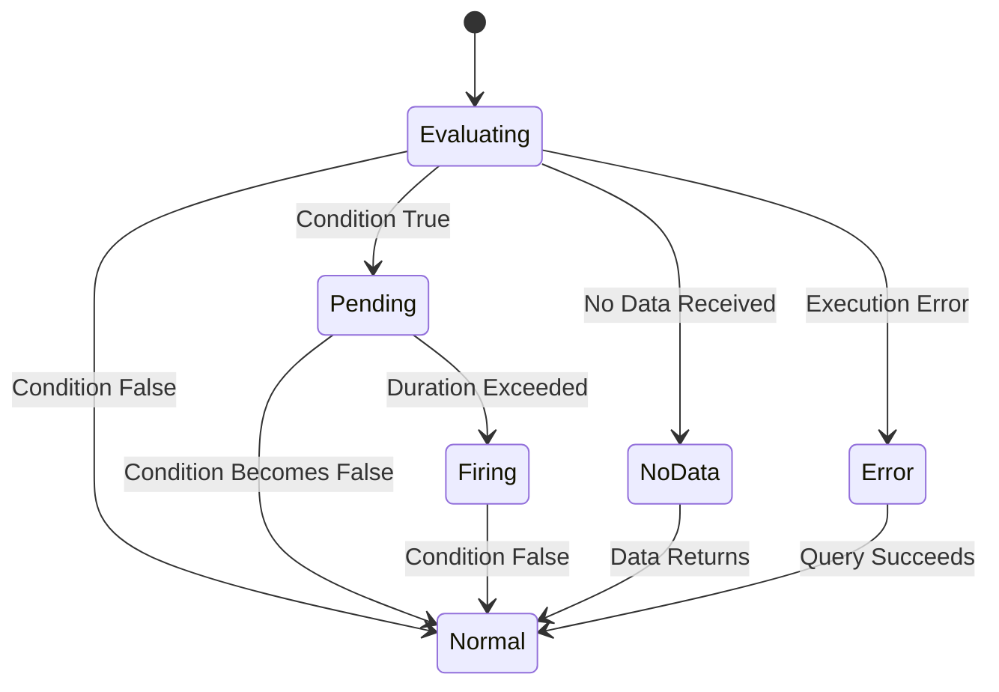
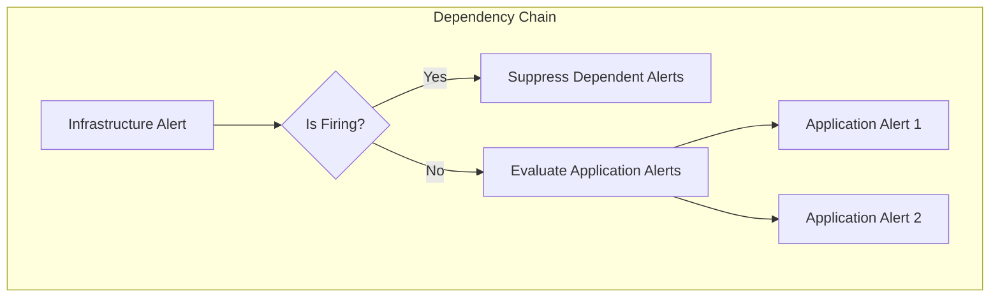
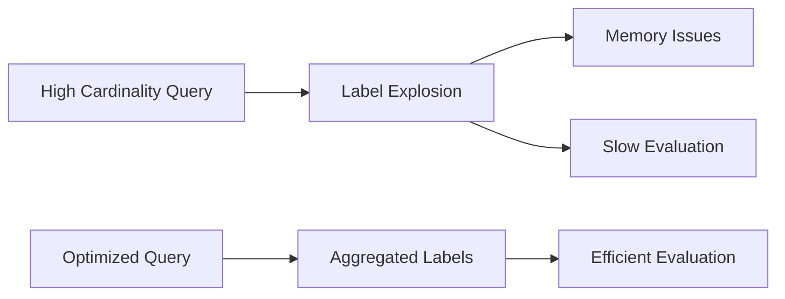

# How to Build Grafana Alert Rules Advanced

Author: [nawazdhandala](https://github.com/nawazdhandala)

Tags: Grafana, Alert Rules, Alerting, Monitoring

Description: Learn to implement advanced Grafana alert rules with multi-dimensional alerting, expressions, and no-data handling for comprehensive alerting.

---

Grafana alerting has evolved significantly, offering powerful capabilities for building sophisticated alert rules that go beyond simple threshold-based notifications. This guide explores advanced techniques for creating robust, maintainable, and highly effective alert rules in Grafana.

## Understanding the Alert Rule Architecture

Before diving into advanced configurations, it is essential to understand how Grafana alert rules are structured and processed.



The alert evaluation pipeline follows a structured flow where data is queried, processed through expressions, and evaluated against conditions before triggering notifications.

## Rule Groups and Evaluation Intervals

Rule groups are fundamental organizational units that control how alerts are evaluated together. Understanding their behavior is crucial for building efficient alerting systems.

### Configuring Rule Groups

```yaml
apiVersion: 1
groups:
  - name: infrastructure-alerts
    folder: Production
    interval: 30s
    rules:
      - uid: infra-cpu-alert
        title: High CPU Usage
        condition: C
        data:
          - refId: A
            relativeTimeRange:
              from: 300
              to: 0
            datasourceUid: prometheus
            model:
              expr: avg(rate(node_cpu_seconds_total{mode!="idle"}[5m])) by (instance) * 100
              refId: A
          - refId: B
            relativeTimeRange:
              from: 0
              to: 0
            datasourceUid: __expr__
            model:
              type: reduce
              expression: A
              reducer: mean
              refId: B
          - refId: C
            relativeTimeRange:
              from: 0
              to: 0
            datasourceUid: __expr__
            model:
              type: threshold
              expression: B
              conditions:
                - evaluator:
                    type: gt
                    params:
                      - 80
              refId: C
        for: 5m
        noDataState: NoData
        execErrState: Error
```

This configuration creates a rule group with a 30-second evaluation interval. The `for` duration ensures the condition must persist for 5 minutes before firing, reducing false positives from transient spikes.

### Evaluation Interval Best Practices



| Interval | Use Case | Trade-off |
|----------|----------|-----------|
| 15s | Critical infrastructure, payment systems | Higher resource usage |
| 30s | Production application metrics | Balanced approach |
| 1m | General service monitoring | Lower overhead |
| 5m | Capacity and trend alerts | May miss brief spikes |

## Advanced Expression Types

Grafana supports multiple expression types that can be chained together for sophisticated data processing.

### Reduce Expressions

Reduce expressions aggregate time series data into single values.

```yaml
- refId: B
  datasourceUid: __expr__
  model:
    type: reduce
    expression: A
    reducer: last
    settings:
      mode: dropNN
    refId: B
```

Available reducers include:
- `last` - Most recent value
- `mean` - Average of all values
- `min` - Minimum value
- `max` - Maximum value
- `sum` - Sum of all values
- `count` - Number of data points

The `dropNN` mode drops non-numeric values, which is essential when dealing with sparse data.

### Math Expressions

Math expressions allow complex calculations across multiple queries.

```yaml
- refId: C
  datasourceUid: __expr__
  model:
    type: math
    expression: ($A - $B) / $B * 100
    refId: C
```

This example calculates the percentage change between two metrics. Math expressions support:

- Basic arithmetic: `+`, `-`, `*`, `/`
- Comparison operators: `>`, `<`, `>=`, `<=`, `==`, `!=`
- Logical operators: `&&`, `||`
- Functions: `abs()`, `log()`, `ceil()`, `floor()`, `round()`

### Resample Expressions

When combining metrics with different scrape intervals, resample expressions ensure alignment.

```yaml
- refId: D
  datasourceUid: __expr__
  model:
    type: resample
    expression: A
    window: 1m
    downsampler: mean
    upsampler: fillna
    refId: D
```

## Multi-Dimensional Alerting

Multi-dimensional alerts generate separate alert instances for each unique label combination.



### Configuring Multi-Dimensional Alerts

```yaml
rules:
  - uid: multi-dim-memory
    title: Memory Usage by Service
    condition: C
    data:
      - refId: A
        datasourceUid: prometheus
        model:
          expr: |
            (1 - (node_memory_MemAvailable_bytes / node_memory_MemTotal_bytes)) * 100
          legendFormat: "{{instance}} - {{job}}"
          refId: A
      - refId: B
        datasourceUid: __expr__
        model:
          type: reduce
          expression: A
          reducer: last
          refId: B
      - refId: C
        datasourceUid: __expr__
        model:
          type: threshold
          expression: B
          conditions:
            - evaluator:
                type: gt
                params:
                  - 85
          refId: C
    labels:
      severity: warning
      team: infrastructure
```

Each unique combination of `instance` and `job` labels creates a separate alert instance, enabling granular notifications.

## No-Data and Error Handling

Proper handling of no-data scenarios and execution errors is critical for reliable alerting.



### No-Data State Configuration

```yaml
rules:
  - uid: service-health
    title: Service Health Check
    noDataState: Alerting
    execErrState: Alerting
    data:
      - refId: A
        datasourceUid: prometheus
        model:
          expr: up{job="critical-service"}
          refId: A
```

Available no-data states:
- `NoData` - Shows as NoData state (default)
- `Alerting` - Treats missing data as a problem
- `OK` - Considers no data as normal
- `KeepLast` - Maintains the previous state

### Implementing Keep-Alive Patterns

For critical services where missing data should trigger alerts:

```yaml
rules:
  - uid: heartbeat-check
    title: Service Heartbeat Missing
    condition: C
    data:
      - refId: A
        datasourceUid: prometheus
        model:
          expr: |
            absent(up{job="payment-service"}) or up{job="payment-service"} == 0
          refId: A
      - refId: B
        datasourceUid: __expr__
        model:
          type: reduce
          expression: A
          reducer: last
          settings:
            mode: replaceNN
            replaceWithValue: 1
          refId: B
      - refId: C
        datasourceUid: __expr__
        model:
          type: threshold
          expression: B
          conditions:
            - evaluator:
                type: gt
                params:
                  - 0
          refId: C
    noDataState: Alerting
    for: 2m
```

The `absent()` function in Prometheus returns 1 when the metric does not exist, enabling detection of completely missing services.

## Annotation Templates

Annotations provide context in alert notifications. Advanced templating makes alerts more actionable.

### Basic Annotation Configuration

```yaml
annotations:
  summary: "High CPU on {{ $labels.instance }}"
  description: |
    CPU usage has exceeded threshold on {{ $labels.instance }}.

    Current Value: {{ $values.B }}%
    Threshold: 80%
    Duration: {{ .Evaluation.Duration }}
  runbook_url: "https://wiki.example.com/runbooks/high-cpu"
```

### Advanced Template Functions

```yaml
annotations:
  summary: "{{ $labels.severity | title }} - {{ $labels.alertname }}"
  description: |
    **Alert Details**

    Instance: {{ $labels.instance }}
    Service: {{ $labels.job }}
    Value: {{ printf "%.2f" $values.B }}%

    {{ if gt $values.B 90.0 }}
    CRITICAL: Immediate attention required!
    {{ else if gt $values.B 80.0 }}
    WARNING: Monitor closely.
    {{ end }}

    Time: {{ .EvalTime.Format "2006-01-02 15:04:05" }}
```

Available template data:
- `$labels` - All labels from the query
- `$values` - Computed values from expressions
- `.EvalTime` - Evaluation timestamp
- `.Evaluation.Duration` - How long the condition has been true

### Dynamic Runbook URLs

```yaml
annotations:
  runbook_url: |
    https://wiki.example.com/runbooks/{{ $labels.alertname | lower }}?instance={{ $labels.instance | urlquery }}
```

## Complex Alert Conditions

### Compound Conditions with Boolean Logic

```yaml
rules:
  - uid: compound-alert
    title: Service Degradation
    condition: E
    data:
      - refId: A
        datasourceUid: prometheus
        model:
          expr: rate(http_requests_total{status=~"5.."}[5m])
          refId: A
      - refId: B
        datasourceUid: prometheus
        model:
          expr: rate(http_requests_total[5m])
          refId: B
      - refId: C
        datasourceUid: __expr__
        model:
          type: math
          expression: $A / $B * 100
          refId: C
      - refId: D
        datasourceUid: prometheus
        model:
          expr: histogram_quantile(0.95, rate(http_request_duration_seconds_bucket[5m]))
          refId: D
      - refId: E
        datasourceUid: __expr__
        model:
          type: math
          expression: $C > 5 || $D > 2
          refId: E
```

This alert fires when either:
- Error rate exceeds 5%, OR
- 95th percentile latency exceeds 2 seconds

### Anomaly Detection Patterns

```yaml
rules:
  - uid: anomaly-detection
    title: Traffic Anomaly Detected
    condition: D
    data:
      - refId: A
        datasourceUid: prometheus
        model:
          expr: sum(rate(http_requests_total[5m]))
          refId: A
      - refId: B
        datasourceUid: prometheus
        model:
          expr: avg_over_time(sum(rate(http_requests_total[5m]))[1h:5m])
          refId: B
      - refId: C
        datasourceUid: prometheus
        model:
          expr: stddev_over_time(sum(rate(http_requests_total[5m]))[1h:5m])
          refId: C
      - refId: D
        datasourceUid: __expr__
        model:
          type: math
          expression: abs($A - $B) > ($C * 3)
          refId: D
```

This detects when current traffic deviates more than 3 standard deviations from the hourly average.

## Alert Rule Dependencies



### Implementing Alert Dependencies with Labels

```yaml
rules:
  - uid: database-down
    title: Database Unreachable
    labels:
      severity: critical
      dependency_key: database-primary
    annotations:
      inhibits: "database-dependent"

  - uid: api-errors
    title: API Error Rate High
    labels:
      severity: warning
      depends_on: database-primary
```

Configure notification policies to use these labels for alert routing and suppression.

## Performance Optimization

### Query Optimization Tips

```yaml
# Instead of multiple queries
- expr: avg(rate(cpu_usage[5m])) by (instance)
- expr: avg(rate(memory_usage[5m])) by (instance)

# Use recording rules in Prometheus
# prometheus-rules.yml
groups:
  - name: recording-rules
    rules:
      - record: instance:cpu_usage:avg_rate5m
        expr: avg(rate(cpu_usage[5m])) by (instance)
      - record: instance:memory_usage:avg_rate5m
        expr: avg(rate(memory_usage[5m])) by (instance)

# Then reference in Grafana
- expr: instance:cpu_usage:avg_rate5m
```

### Cardinality Management



Avoid queries that produce excessive time series:

```yaml
# Avoid - Creates alert per container
- expr: container_memory_usage_bytes

# Better - Aggregate to meaningful levels
- expr: |
    sum(container_memory_usage_bytes) by (namespace, deployment)
```

## Complete Production Example

Here is a comprehensive alert rule configuration for a production environment:

```yaml
apiVersion: 1
groups:
  - name: production-services
    folder: Production
    interval: 30s
    rules:
      - uid: prod-slo-breach
        title: SLO Breach - Error Budget Exhausted
        condition: F
        data:
          - refId: A
            datasourceUid: prometheus
            model:
              expr: |
                sum(rate(http_requests_total{status=~"5..",service="api"}[30m]))
                /
                sum(rate(http_requests_total{service="api"}[30m]))
              refId: A
          - refId: B
            datasourceUid: __expr__
            model:
              type: reduce
              expression: A
              reducer: last
              refId: B
          - refId: C
            datasourceUid: prometheus
            model:
              expr: |
                1 - (
                  sum(rate(http_requests_total{status!~"5..",service="api"}[30d]))
                  /
                  sum(rate(http_requests_total{service="api"}[30d]))
                )
              refId: C
          - refId: D
            datasourceUid: __expr__
            model:
              type: reduce
              expression: C
              reducer: last
              refId: D
          - refId: E
            datasourceUid: __expr__
            model:
              type: math
              expression: ($D / 0.001) * 100
              refId: E
          - refId: F
            datasourceUid: __expr__
            model:
              type: threshold
              expression: E
              conditions:
                - evaluator:
                    type: gt
                    params:
                      - 75
              refId: F
        for: 10m
        noDataState: NoData
        execErrState: Alerting
        labels:
          severity: critical
          team: platform
          slo: availability
        annotations:
          summary: "SLO breach imminent - {{ printf \"%.1f\" $values.E }}% error budget consumed"
          description: |
            The API service error budget is being consumed rapidly.

            **Current Status:**
            - 30-minute error rate: {{ printf "%.4f" $values.B }}
            - Error budget consumed: {{ printf "%.1f" $values.E }}%

            **Action Required:**
            1. Check recent deployments
            2. Review error logs
            3. Consider rollback if recently deployed

            Dashboard: https://grafana.example.com/d/api-overview
          runbook_url: "https://wiki.example.com/runbooks/slo-breach"
```

## Summary

Building advanced Grafana alert rules requires understanding the evaluation pipeline, expression types, and proper handling of edge cases. Key takeaways include:

1. **Organize with Rule Groups** - Group related alerts with appropriate evaluation intervals
2. **Chain Expressions** - Use reduce, math, and resample expressions for sophisticated data processing
3. **Handle No-Data Gracefully** - Configure appropriate no-data states based on your use case
4. **Template Rich Annotations** - Provide actionable context with dynamic templates
5. **Optimize for Performance** - Use recording rules and manage cardinality
6. **Think Multi-Dimensionally** - Leverage labels for granular, per-instance alerting

By applying these advanced techniques, you can build a robust alerting system that catches issues early while minimizing alert fatigue.

## Further Reading

- [Grafana Alerting Documentation](https://grafana.com/docs/grafana/latest/alerting/)
- [Prometheus Recording Rules](https://prometheus.io/docs/prometheus/latest/configuration/recording_rules/)
- [SLO and Error Budget Concepts](https://sre.google/sre-book/service-level-objectives/)
