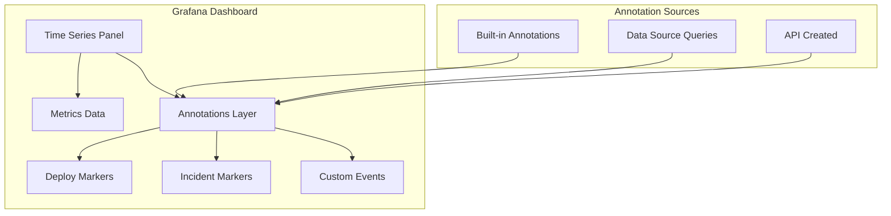
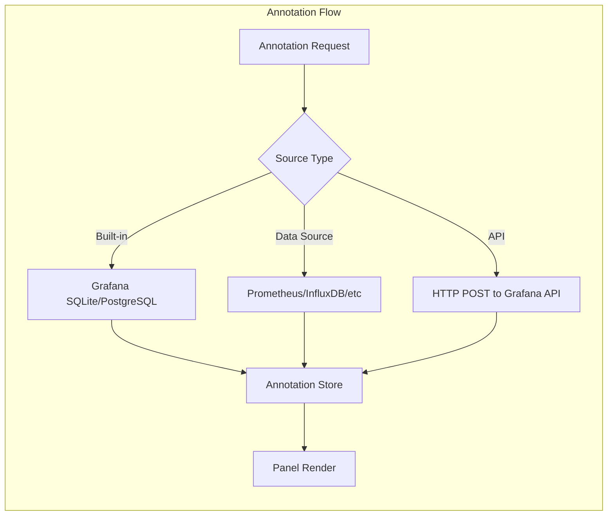
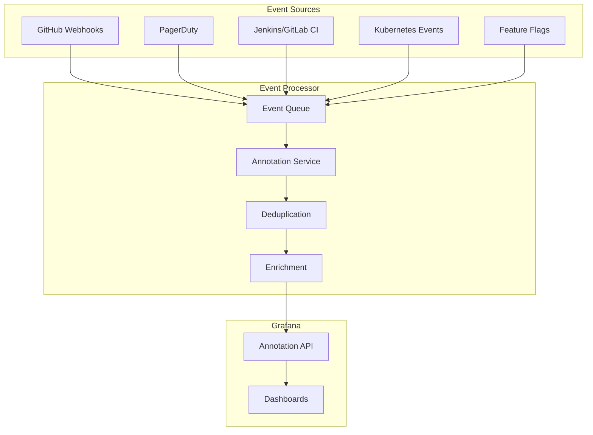
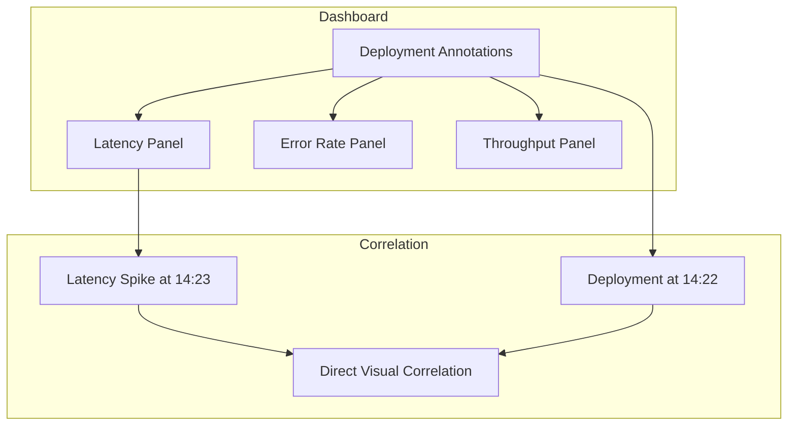
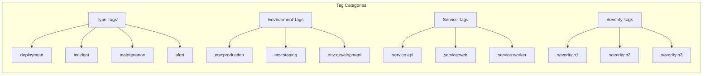

# How to Create Grafana Annotations Advanced: A Complete Guide

Author: [nawazdhandala](https://github.com/nawazdhandala)

Tags: Grafana, Annotations, Visualization, Dashboards

Description: Master advanced Grafana annotations to correlate deployments, incidents, and events with your metrics. Learn to create programmatic annotations via API, use custom data sources, and build automated annotation pipelines for superior observability.

You are staring at a latency spike on your Grafana dashboard. The graph shows a clear anomaly starting at 14:23. But what happened at 14:23? Was it a deployment? A config change? A third-party outage? Without context, you are left guessing.

This is where Grafana annotations transform from a nice-to-have into a must-have. Annotations overlay contextual markers directly on your time-series graphs, turning raw metrics into actionable stories. When done right, they answer the "what happened?" question before you even ask it.

This guide goes beyond basic manual annotations. We will cover programmatic annotation creation, custom data source queries, automated pipelines, and advanced visualization techniques that make your dashboards truly operational.

## What Are Grafana Annotations?

Annotations are vertical markers on your Grafana panels that highlight specific points or ranges in time. They can represent:

- Deployments and releases
- Incidents and alerts
- Configuration changes
- External events (marketing campaigns, third-party outages)
- Maintenance windows
- Feature flag changes



## Understanding Annotation Architecture

Before diving into advanced techniques, let us understand how Grafana handles annotations internally.



Grafana stores built-in annotations in its internal database. Data source annotations query external systems in real-time. API-created annotations can target either the internal store or be injected dynamically.

## Method 1: Programmatic Annotations via Grafana API

The Grafana HTTP API allows you to create, update, and delete annotations programmatically. This is the foundation for automated annotation pipelines.

### Basic API Annotation Creation

```bash
# Create a point-in-time annotation
curl -X POST \
  -H "Authorization: Bearer YOUR_API_KEY" \
  -H "Content-Type: application/json" \
  -d '{
    "dashboardUID": "your-dashboard-uid",
    "panelId": 1,
    "time": 1706608800000,
    "tags": ["deployment", "v2.3.1", "production"],
    "text": "Deployed version 2.3.1 to production"
  }' \
  http://localhost:3000/api/annotations
```

### Creating Range Annotations

Range annotations highlight a span of time, perfect for maintenance windows or incidents.

```bash
# Create a range annotation for a maintenance window
curl -X POST \
  -H "Authorization: Bearer YOUR_API_KEY" \
  -H "Content-Type: application/json" \
  -d '{
    "dashboardUID": "your-dashboard-uid",
    "time": 1706608800000,
    "timeEnd": 1706612400000,
    "tags": ["maintenance", "database", "planned"],
    "text": "Database maintenance: index rebuild"
  }' \
  http://localhost:3000/api/annotations
```

### Python Script for Deployment Annotations

Here is a production-ready Python script that creates annotations from your CI/CD pipeline:

```python
#!/usr/bin/env python3
"""
Grafana Annotation Creator for CI/CD Pipelines
Creates deployment annotations with rich metadata
"""

import requests
import os
import time
import json
from typing import Optional, List

class GrafanaAnnotator:
    def __init__(self, grafana_url: str, api_key: str):
        self.grafana_url = grafana_url.rstrip('/')
        self.headers = {
            'Authorization': f'Bearer {api_key}',
            'Content-Type': 'application/json'
        }

    def create_annotation(
        self,
        text: str,
        tags: List[str],
        dashboard_uid: Optional[str] = None,
        panel_id: Optional[int] = None,
        time_ms: Optional[int] = None,
        time_end_ms: Optional[int] = None
    ) -> dict:
        """
        Create a Grafana annotation.

        Args:
            text: Annotation description
            tags: List of tags for filtering
            dashboard_uid: Target dashboard (None for global)
            panel_id: Target panel (None for all panels)
            time_ms: Start time in milliseconds (None for now)
            time_end_ms: End time for range annotations

        Returns:
            API response as dictionary
        """
        payload = {
            'text': text,
            'tags': tags,
            'time': time_ms or int(time.time() * 1000)
        }

        if dashboard_uid:
            payload['dashboardUID'] = dashboard_uid
        if panel_id:
            payload['panelId'] = panel_id
        if time_end_ms:
            payload['timeEnd'] = time_end_ms

        response = requests.post(
            f'{self.grafana_url}/api/annotations',
            headers=self.headers,
            json=payload
        )
        response.raise_for_status()
        return response.json()

    def create_deployment_annotation(
        self,
        version: str,
        environment: str,
        service: str,
        commit_sha: str,
        deployed_by: str,
        dashboard_uid: Optional[str] = None
    ) -> dict:
        """Create a standardized deployment annotation."""
        text = f"""
**Deployment: {service} {version}**
- Environment: {environment}
- Commit: {commit_sha[:8]}
- Deployed by: {deployed_by}
        """.strip()

        tags = [
            'deployment',
            f'env:{environment}',
            f'service:{service}',
            f'version:{version}'
        ]

        return self.create_annotation(
            text=text,
            tags=tags,
            dashboard_uid=dashboard_uid
        )


# Example usage in CI/CD pipeline
if __name__ == '__main__':
    annotator = GrafanaAnnotator(
        grafana_url=os.environ['GRAFANA_URL'],
        api_key=os.environ['GRAFANA_API_KEY']
    )

    result = annotator.create_deployment_annotation(
        version=os.environ.get('VERSION', 'unknown'),
        environment=os.environ.get('ENVIRONMENT', 'production'),
        service=os.environ.get('SERVICE_NAME', 'api'),
        commit_sha=os.environ.get('COMMIT_SHA', 'unknown'),
        deployed_by=os.environ.get('DEPLOYED_BY', 'ci-system')
    )

    print(f"Annotation created: {result}")
```

### Node.js Implementation

```javascript
/**
 * Grafana Annotation Client
 * For creating annotations from Node.js applications
 */

const axios = require('axios');

class GrafanaAnnotationClient {
  constructor(grafanaUrl, apiKey) {
    this.client = axios.create({
      baseURL: grafanaUrl,
      headers: {
        'Authorization': `Bearer ${apiKey}`,
        'Content-Type': 'application/json'
      }
    });
  }

  /**
   * Create annotation with automatic retry
   */
  async createAnnotation(options, retries = 3) {
    const payload = {
      text: options.text,
      tags: options.tags || [],
      time: options.time || Date.now()
    };

    if (options.dashboardUID) payload.dashboardUID = options.dashboardUID;
    if (options.panelId) payload.panelId = options.panelId;
    if (options.timeEnd) payload.timeEnd = options.timeEnd;

    for (let attempt = 1; attempt <= retries; attempt++) {
      try {
        const response = await this.client.post('/api/annotations', payload);
        return response.data;
      } catch (error) {
        if (attempt === retries) throw error;
        await this.sleep(1000 * attempt); // Exponential backoff
      }
    }
  }

  /**
   * Create incident annotation with start and end times
   */
  async createIncidentAnnotation(incidentId, title, severity, startTime, endTime = null) {
    return this.createAnnotation({
      text: `**Incident #${incidentId}**: ${title}\nSeverity: ${severity}`,
      tags: ['incident', `severity:${severity}`, `incident:${incidentId}`],
      time: startTime,
      timeEnd: endTime
    });
  }

  /**
   * Batch create multiple annotations
   */
  async createBatch(annotations) {
    const results = await Promise.allSettled(
      annotations.map(ann => this.createAnnotation(ann))
    );

    return results.map((result, index) => ({
      input: annotations[index],
      status: result.status,
      value: result.status === 'fulfilled' ? result.value : null,
      error: result.status === 'rejected' ? result.reason.message : null
    }));
  }

  sleep(ms) {
    return new Promise(resolve => setTimeout(resolve, ms));
  }
}

// Usage example
async function main() {
  const client = new GrafanaAnnotationClient(
    process.env.GRAFANA_URL,
    process.env.GRAFANA_API_KEY
  );

  // Single deployment annotation
  await client.createAnnotation({
    text: 'Deployed payment-service v3.2.0',
    tags: ['deployment', 'payment-service', 'production']
  });

  // Incident with duration
  await client.createIncidentAnnotation(
    'INC-2024-0142',
    'Database connection pool exhaustion',
    'P2',
    Date.now() - 3600000, // Started 1 hour ago
    Date.now() // Resolved now
  );
}

main().catch(console.error);
```

## Method 2: Data Source Annotations

Data source annotations query your existing metrics or logs databases to generate annotations dynamically. This approach is powerful because annotations stay in sync with your data.

### Prometheus Annotations

Query Prometheus for deployment events recorded as metrics:

```yaml
# In Grafana Dashboard JSON
{
  "annotations": {
    "list": [
      {
        "name": "Deployments",
        "datasource": {
          "type": "prometheus",
          "uid": "prometheus-uid"
        },
        "enable": true,
        "expr": "changes(deployment_timestamp{environment=\"production\"}[1m]) > 0",
        "titleFormat": "Deploy: {{service}}",
        "textFormat": "Version: {{version}}, Commit: {{commit}}",
        "tagKeys": "service,environment,version",
        "useValueForTime": true
      }
    ]
  }
}
```

The Prometheus query for this approach requires recording deployment events as metrics:

```yaml
# Prometheus recording rule for deployment events
groups:
  - name: deployment_events
    rules:
      - record: deployment_timestamp
        expr: |
          timestamp(
            kube_deployment_status_observed_generation{
              namespace="production"
            }
          )
        labels:
          event_type: deployment
```

### InfluxDB Annotations

```sql
-- InfluxDB query for annotations
SELECT
  "text",
  "tags"
FROM "events"
WHERE
  $timeFilter
  AND "type" = 'deployment'
```

Configure in Grafana:

```json
{
  "annotations": {
    "list": [
      {
        "name": "Deployment Events",
        "datasource": {
          "type": "influxdb",
          "uid": "influxdb-uid"
        },
        "query": "SELECT \"text\", \"tags\" FROM \"events\" WHERE $timeFilter AND \"type\" = 'deployment'",
        "enable": true
      }
    ]
  }
}
```

### Elasticsearch/OpenSearch Annotations

```json
{
  "annotations": {
    "list": [
      {
        "name": "Application Events",
        "datasource": {
          "type": "elasticsearch",
          "uid": "elasticsearch-uid"
        },
        "query": "event_type:deployment AND environment:production",
        "timeField": "@timestamp",
        "textField": "message",
        "tagsField": "tags"
      }
    ]
  }
}
```

## Method 3: Automated Annotation Pipelines

Let us build a complete annotation pipeline that captures events from multiple sources.



### Kubernetes Event Watcher

This controller watches Kubernetes events and creates annotations:

```python
#!/usr/bin/env python3
"""
Kubernetes Event to Grafana Annotation Bridge
Watches K8s events and creates corresponding Grafana annotations
"""

from kubernetes import client, config, watch
import requests
import os
import logging
from datetime import datetime

logging.basicConfig(level=logging.INFO)
logger = logging.getLogger(__name__)

class K8sEventAnnotator:
    def __init__(self):
        # Load K8s config
        try:
            config.load_incluster_config()
        except config.ConfigException:
            config.load_kube_config()

        self.v1 = client.CoreV1Api()
        self.grafana_url = os.environ['GRAFANA_URL']
        self.grafana_api_key = os.environ['GRAFANA_API_KEY']

        # Event types to annotate
        self.watched_reasons = {
            'Scheduled': 'pod-scheduled',
            'Pulled': 'image-pulled',
            'Created': 'container-created',
            'Started': 'container-started',
            'Killing': 'pod-terminating',
            'Unhealthy': 'health-check-failed',
            'BackOff': 'crash-loop',
            'FailedScheduling': 'scheduling-failed',
            'ScalingReplicaSet': 'scaling-event'
        }

    def create_annotation(self, event):
        """Create Grafana annotation from K8s event."""
        reason = event.reason
        if reason not in self.watched_reasons:
            return

        # Build annotation text
        text = f"""
**{event.reason}**: {event.message}

- Object: {event.involved_object.kind}/{event.involved_object.name}
- Namespace: {event.involved_object.namespace}
- Count: {event.count}
        """.strip()

        tags = [
            self.watched_reasons[reason],
            f'namespace:{event.involved_object.namespace}',
            f'kind:{event.involved_object.kind.lower()}',
            'kubernetes'
        ]

        # Add severity tag
        if event.type == 'Warning':
            tags.append('severity:warning')
        else:
            tags.append('severity:normal')

        payload = {
            'text': text,
            'tags': tags,
            'time': int(event.first_timestamp.timestamp() * 1000) if event.first_timestamp else int(datetime.now().timestamp() * 1000)
        }

        try:
            response = requests.post(
                f'{self.grafana_url}/api/annotations',
                headers={
                    'Authorization': f'Bearer {self.grafana_api_key}',
                    'Content-Type': 'application/json'
                },
                json=payload
            )
            response.raise_for_status()
            logger.info(f"Created annotation for {event.reason}: {event.involved_object.name}")
        except Exception as e:
            logger.error(f"Failed to create annotation: {e}")

    def watch_events(self, namespace=None):
        """Watch Kubernetes events and create annotations."""
        w = watch.Watch()

        if namespace:
            event_stream = w.stream(
                self.v1.list_namespaced_event,
                namespace=namespace
            )
        else:
            event_stream = w.stream(self.v1.list_event_for_all_namespaces)

        logger.info(f"Watching K8s events (namespace: {namespace or 'all'})")

        for event in event_stream:
            if event['type'] == 'ADDED':
                self.create_annotation(event['object'])


if __name__ == '__main__':
    annotator = K8sEventAnnotator()
    annotator.watch_events(
        namespace=os.environ.get('WATCH_NAMESPACE')
    )
```

### GitHub Actions Integration

Create annotations automatically from GitHub deployments:

```yaml
# .github/workflows/deploy.yml
name: Deploy with Grafana Annotation

on:
  push:
    branches: [main]

jobs:
  deploy:
    runs-on: ubuntu-latest
    steps:
      - uses: actions/checkout@v4

      - name: Deploy Application
        run: |
          # Your deployment steps here
          echo "Deploying..."

      - name: Create Grafana Annotation
        if: success()
        run: |
          curl -X POST \
            -H "Authorization: Bearer ${{ secrets.GRAFANA_API_KEY }}" \
            -H "Content-Type: application/json" \
            -d '{
              "tags": ["deployment", "github-actions", "${{ github.repository }}"],
              "text": "**Deployed ${{ github.repository }}**\n\n- Commit: ${{ github.sha }}\n- Branch: ${{ github.ref_name }}\n- Actor: ${{ github.actor }}\n- Workflow: ${{ github.workflow }}"
            }' \
            "${{ secrets.GRAFANA_URL }}/api/annotations"

      - name: Create Failure Annotation
        if: failure()
        run: |
          curl -X POST \
            -H "Authorization: Bearer ${{ secrets.GRAFANA_API_KEY }}" \
            -H "Content-Type: application/json" \
            -d '{
              "tags": ["deployment-failed", "github-actions", "${{ github.repository }}"],
              "text": "**Deployment Failed: ${{ github.repository }}**\n\n- Commit: ${{ github.sha }}\n- Branch: ${{ github.ref_name }}\n- Check logs: ${{ github.server_url }}/${{ github.repository }}/actions/runs/${{ github.run_id }}"
            }' \
            "${{ secrets.GRAFANA_URL }}/api/annotations"
```

## Advanced Visualization Techniques

### Custom Annotation Styling

Grafana 10+ supports custom annotation colors and styling:

```json
{
  "annotations": {
    "list": [
      {
        "name": "Deployments",
        "iconColor": "#00FF00",
        "enable": true,
        "filter": {
          "exclude": false,
          "ids": [],
          "tags": ["deployment"]
        }
      },
      {
        "name": "Incidents",
        "iconColor": "#FF0000",
        "enable": true,
        "filter": {
          "tags": ["incident"]
        }
      },
      {
        "name": "Maintenance",
        "iconColor": "#FFA500",
        "enable": true,
        "filter": {
          "tags": ["maintenance"]
        }
      }
    ]
  }
}
```

### Annotation Queries with Variables

Use dashboard variables to filter annotations dynamically:

```json
{
  "annotations": {
    "list": [
      {
        "name": "Service Events",
        "datasource": {
          "type": "prometheus",
          "uid": "prometheus-uid"
        },
        "expr": "deployment_events{service=\"$service\", environment=\"$environment\"}",
        "enable": true
      }
    ]
  }
}
```

### Multi-Panel Annotation Correlation



## Annotation Management API

### Querying Existing Annotations

```bash
# Get annotations by tag
curl -X GET \
  -H "Authorization: Bearer YOUR_API_KEY" \
  "http://localhost:3000/api/annotations?tags=deployment&from=1706608800000&to=1706695200000"

# Get annotations for a specific dashboard
curl -X GET \
  -H "Authorization: Bearer YOUR_API_KEY" \
  "http://localhost:3000/api/annotations?dashboardUID=abc123"
```

### Updating Annotations

```bash
# Update annotation text and tags
curl -X PUT \
  -H "Authorization: Bearer YOUR_API_KEY" \
  -H "Content-Type: application/json" \
  -d '{
    "text": "Updated: Deployment completed successfully",
    "tags": ["deployment", "v2.3.1", "production", "verified"]
  }' \
  "http://localhost:3000/api/annotations/42"
```

### Deleting Annotations

```bash
# Delete a specific annotation
curl -X DELETE \
  -H "Authorization: Bearer YOUR_API_KEY" \
  "http://localhost:3000/api/annotations/42"

# Bulk delete by tag (via API script)
```

```python
def delete_annotations_by_tag(grafana_url, api_key, tag, from_ms, to_ms):
    """Delete all annotations matching a tag within a time range."""
    headers = {
        'Authorization': f'Bearer {api_key}',
        'Content-Type': 'application/json'
    }

    # Get matching annotations
    response = requests.get(
        f'{grafana_url}/api/annotations',
        headers=headers,
        params={'tags': tag, 'from': from_ms, 'to': to_ms}
    )
    annotations = response.json()

    # Delete each annotation
    deleted = 0
    for ann in annotations:
        del_response = requests.delete(
            f'{grafana_url}/api/annotations/{ann["id"]}',
            headers=headers
        )
        if del_response.status_code == 200:
            deleted += 1

    return deleted
```

## Best Practices for Annotation Management

### 1. Consistent Tagging Schema



### 2. Annotation Text Template

```markdown
**[Event Type]: [Brief Title]**

- Service: [service-name]
- Environment: [production/staging]
- Version: [version]
- Triggered by: [user/system]
- Details: [link to more info]
```

### 3. Retention Policy

Implement annotation cleanup to prevent database bloat:

```python
#!/usr/bin/env python3
"""
Grafana Annotation Cleanup Script
Run daily via cron to remove old annotations
"""

import requests
from datetime import datetime, timedelta

def cleanup_old_annotations(
    grafana_url: str,
    api_key: str,
    retention_days: int = 90,
    exclude_tags: list = None
):
    """Remove annotations older than retention period."""
    exclude_tags = exclude_tags or ['permanent', 'milestone']

    headers = {
        'Authorization': f'Bearer {api_key}',
        'Content-Type': 'application/json'
    }

    cutoff_time = datetime.now() - timedelta(days=retention_days)
    cutoff_ms = int(cutoff_time.timestamp() * 1000)

    # Get old annotations
    response = requests.get(
        f'{grafana_url}/api/annotations',
        headers=headers,
        params={'from': 0, 'to': cutoff_ms, 'limit': 1000}
    )
    annotations = response.json()

    deleted = 0
    for ann in annotations:
        # Skip if has excluded tag
        ann_tags = ann.get('tags', [])
        if any(tag in ann_tags for tag in exclude_tags):
            continue

        requests.delete(
            f'{grafana_url}/api/annotations/{ann["id"]}',
            headers=headers
        )
        deleted += 1

    return deleted
```

## Integrating with Incident Management

### PagerDuty Webhook to Grafana Annotations

```python
from flask import Flask, request
import requests
import os

app = Flask(__name__)

GRAFANA_URL = os.environ['GRAFANA_URL']
GRAFANA_API_KEY = os.environ['GRAFANA_API_KEY']

@app.route('/webhook/pagerduty', methods=['POST'])
def pagerduty_webhook():
    """Handle PagerDuty webhook and create Grafana annotation."""
    data = request.json

    for message in data.get('messages', []):
        event = message.get('event', {})
        incident = message.get('incident', {})

        event_type = event.get('event_type', '')

        if event_type == 'incident.triggered':
            create_incident_annotation(incident, 'triggered')
        elif event_type == 'incident.resolved':
            create_incident_annotation(incident, 'resolved')

    return {'status': 'ok'}


def create_incident_annotation(incident, status):
    """Create annotation for PagerDuty incident."""
    text = f"""
**Incident {status.upper()}: {incident.get('title', 'Unknown')}**

- ID: {incident.get('incident_number')}
- Service: {incident.get('service', {}).get('name', 'Unknown')}
- Urgency: {incident.get('urgency', 'Unknown')}
- URL: {incident.get('html_url', '')}
    """.strip()

    tags = [
        'incident',
        f'status:{status}',
        f'urgency:{incident.get("urgency", "unknown")}',
        'pagerduty'
    ]

    payload = {
        'text': text,
        'tags': tags
    }

    requests.post(
        f'{GRAFANA_URL}/api/annotations',
        headers={
            'Authorization': f'Bearer {GRAFANA_API_KEY}',
            'Content-Type': 'application/json'
        },
        json=payload
    )


if __name__ == '__main__':
    app.run(host='0.0.0.0', port=5000)
```

## Dashboard JSON Configuration

Here is a complete dashboard configuration with advanced annotations:

```json
{
  "dashboard": {
    "title": "Service Overview with Annotations",
    "uid": "service-overview",
    "annotations": {
      "list": [
        {
          "name": "Deployments",
          "datasource": {
            "type": "grafana",
            "uid": "-- Grafana --"
          },
          "enable": true,
          "iconColor": "#00FF00",
          "filter": {
            "exclude": false,
            "tags": ["deployment"]
          }
        },
        {
          "name": "Incidents",
          "datasource": {
            "type": "grafana",
            "uid": "-- Grafana --"
          },
          "enable": true,
          "iconColor": "#FF0000",
          "filter": {
            "exclude": false,
            "tags": ["incident"]
          }
        },
        {
          "name": "Alerts Fired",
          "datasource": {
            "type": "prometheus",
            "uid": "prometheus"
          },
          "enable": true,
          "iconColor": "#FFA500",
          "expr": "ALERTS{alertstate=\"firing\"}",
          "step": "60s",
          "titleFormat": "Alert: {{alertname}}",
          "textFormat": "{{alertname}} is firing on {{instance}}"
        },
        {
          "name": "Feature Flags",
          "datasource": {
            "type": "grafana",
            "uid": "-- Grafana --"
          },
          "enable": true,
          "iconColor": "#9400D3",
          "filter": {
            "tags": ["feature-flag"]
          }
        }
      ]
    },
    "panels": [
      {
        "title": "Request Latency",
        "type": "timeseries",
        "gridPos": {"h": 8, "w": 12, "x": 0, "y": 0},
        "targets": [
          {
            "expr": "histogram_quantile(0.99, rate(http_request_duration_seconds_bucket[5m]))",
            "legendFormat": "p99 latency"
          }
        ]
      },
      {
        "title": "Error Rate",
        "type": "timeseries",
        "gridPos": {"h": 8, "w": 12, "x": 12, "y": 0},
        "targets": [
          {
            "expr": "rate(http_requests_total{status=~\"5..\"}[5m]) / rate(http_requests_total[5m])",
            "legendFormat": "Error rate"
          }
        ]
      }
    ]
  }
}
```

## Troubleshooting Common Issues

### Annotations Not Appearing

1. **Check time range**: Annotations only show within the selected time range
2. **Verify permissions**: API key needs annotation write permissions
3. **Check dashboard UID**: Ensure you are targeting the correct dashboard
4. **Inspect browser console**: Look for failed API requests

### Duplicate Annotations

Implement deduplication in your annotation pipeline:

```python
import hashlib

def get_annotation_hash(text, tags, time_ms):
    """Generate unique hash for annotation deduplication."""
    content = f"{text}:{sorted(tags)}:{time_ms // 60000}"  # 1-minute window
    return hashlib.md5(content.encode()).hexdigest()

def create_annotation_if_unique(grafana_client, annotation_data):
    """Only create if no duplicate exists."""
    ann_hash = get_annotation_hash(
        annotation_data['text'],
        annotation_data['tags'],
        annotation_data['time']
    )

    # Check recent annotations for duplicate
    recent = grafana_client.get_annotations(
        from_ms=annotation_data['time'] - 60000,
        to_ms=annotation_data['time'] + 60000,
        tags=annotation_data['tags']
    )

    for existing in recent:
        existing_hash = get_annotation_hash(
            existing['text'],
            existing['tags'],
            existing['time']
        )
        if existing_hash == ann_hash:
            return None  # Duplicate found

    return grafana_client.create_annotation(annotation_data)
```

### Performance with Many Annotations

- Use tag filtering to load only relevant annotations
- Implement pagination for annotation queries
- Set up retention policies to remove old annotations
- Consider using data source annotations for high-volume events

## Connecting to OneUptime

If you are using OneUptime for observability, you can sync incidents and deployments as Grafana annotations. OneUptime's webhook capabilities allow you to trigger annotation creation whenever:

- An incident is created or resolved
- A scheduled maintenance window begins or ends
- An alert threshold is breached
- A deployment is tracked

This creates a unified view where your Grafana dashboards show the same events visible in your OneUptime incident timeline.

## Summary

Advanced Grafana annotations transform your dashboards from passive metric displays into active operational tools. Key takeaways:

1. **Automate annotation creation** through CI/CD pipelines and event processors
2. **Use consistent tagging schemas** for easy filtering and correlation
3. **Leverage data source annotations** to query events from your existing infrastructure
4. **Implement retention policies** to keep your annotation database performant
5. **Integrate with incident management** tools for automatic event correlation

With these techniques, the next time a latency spike appears at 14:23, you will immediately see the deployment that happened at 14:22. No more guessing. No more context switching. Just clear, correlated observability data.

---

**Related Reading:**

- [Three Pillars of Observability: Logs, Metrics, and Traces](https://oneuptime.com/blog/post/three-pillars-of-observability-logs-metrics-traces/view)
- [SRE Best Practices](https://oneuptime.com/blog/post/sre-best-practices/view)
- [Monitoring vs Observability](https://oneuptime.com/blog/post/monitoring-vs-observability-sre/view)
