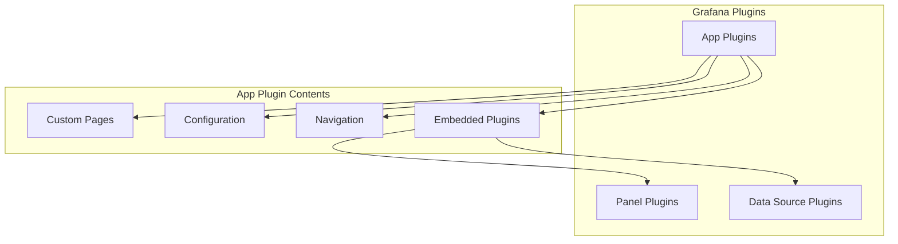
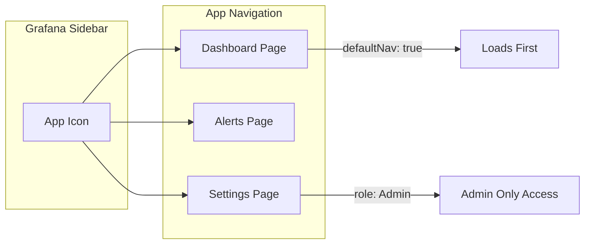
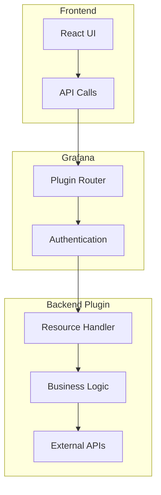
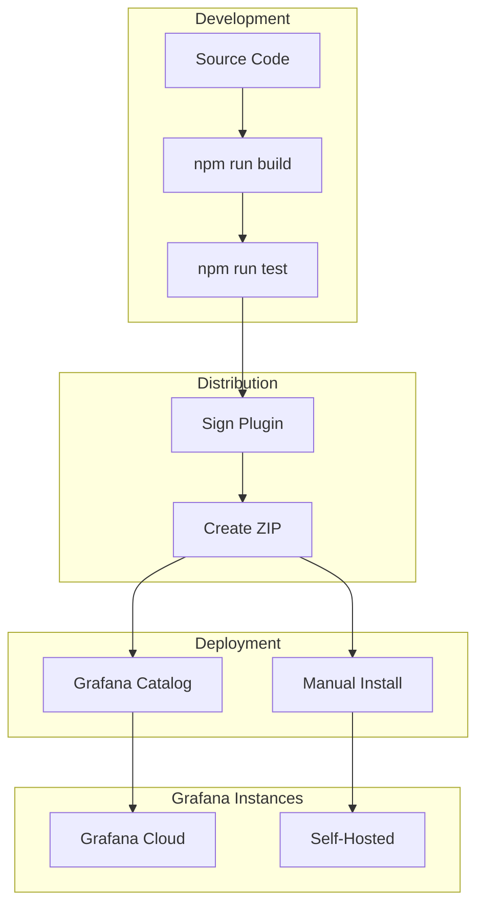

# How to Build Grafana App Plugins

Author: [nawazdhandala](https://github.com/nawazdhandala)

Tags: Grafana, Monitoring, Plugins, TypeScript

Description: A comprehensive guide to building Grafana app plugins from scratch, covering project setup, configuration pages, custom routing, and deployment to production.

---

Grafana app plugins let you bundle multiple features into a cohesive experience. Unlike panel or data source plugins that serve a single purpose, app plugins can include custom pages, navigation, configuration screens, and even embed other plugin types. This makes them ideal for building complete solutions within Grafana.

## Understanding Grafana Plugin Types

Before diving into app plugins, let's understand where they fit in the Grafana plugin ecosystem.



| Plugin Type | Purpose | Example Use Cases |
|-------------|---------|-------------------|
| Panel | Visualize data | Charts, tables, maps |
| Data Source | Connect to backends | Prometheus, PostgreSQL |
| App | Bundle complete solutions | Kubernetes monitoring, incident management |

## Setting Up Your Development Environment

### Prerequisites

You need Node.js 18+, Go 1.21+ (for backend plugins), and Docker for testing. Install the Grafana plugin toolkit to scaffold your project.

```bash
# Install the create-plugin tool globally
npm install -g @grafana/create-plugin

# Verify the installation
npx @grafana/create-plugin --version
```

### Scaffold the App Plugin

The create-plugin tool generates a complete project structure with all the boilerplate handled for you.

```bash
# Create a new app plugin with backend support
npx @grafana/create-plugin@latest

# When prompted, select:
# - Plugin type: app
# - Plugin name: my-monitoring-app
# - Organization: your-org
# - Include backend: yes (if you need server-side logic)
```

After scaffolding, your project structure looks like this:

```
my-monitoring-app/
├── src/
│   ├── components/        # React components
│   ├── pages/            # Page components
│   ├── plugin.json       # Plugin metadata
│   ├── module.ts         # Plugin entry point
│   └── types.ts          # TypeScript definitions
├── pkg/                  # Go backend code (if included)
├── provisioning/         # Grafana provisioning files
├── docker-compose.yaml   # Local development setup
└── package.json
```

### Install Dependencies and Start Development

The scaffolded project includes everything needed to start building immediately.

```bash
# Navigate to your plugin directory
cd my-monitoring-app

# Install frontend dependencies
npm install

# Start the development server with hot reload
npm run dev
```

In a separate terminal, start Grafana with your plugin mounted:

```bash
# Start Grafana with Docker Compose
docker-compose up -d

# View logs to verify plugin loaded
docker-compose logs -f grafana
```

## Configuring Your App Plugin

### The plugin.json File

The plugin.json file defines your plugin's identity, capabilities, and navigation structure. This is the heart of your plugin configuration.

```json
{
  "$schema": "https://raw.githubusercontent.com/grafana/grafana/main/docs/sources/developers/plugins/plugin.schema.json",
  "type": "app",
  "name": "My Monitoring App",
  "id": "your-org-my-monitoring-app",
  "info": {
    "keywords": ["monitoring", "observability", "alerts"],
    "description": "A comprehensive monitoring solution for your infrastructure",
    "author": {
      "name": "Your Organization",
      "url": "https://example.com"
    },
    "logos": {
      "small": "img/logo.svg",
      "large": "img/logo.svg"
    },
    "version": "1.0.0",
    "updated": "2026-01-30"
  },
  "includes": [
    {
      "type": "page",
      "name": "Dashboard",
      "path": "/a/your-org-my-monitoring-app/dashboard",
      "role": "Viewer",
      "addToNav": true,
      "defaultNav": true
    },
    {
      "type": "page",
      "name": "Alerts",
      "path": "/a/your-org-my-monitoring-app/alerts",
      "role": "Viewer",
      "addToNav": true
    },
    {
      "type": "page",
      "name": "Settings",
      "path": "/a/your-org-my-monitoring-app/settings",
      "role": "Admin",
      "addToNav": true
    }
  ],
  "dependencies": {
    "grafanaDependency": ">=10.0.0",
    "plugins": []
  }
}
```

### Understanding Navigation Configuration

The includes array defines what pages appear in Grafana's navigation. Each entry can specify access roles and navigation placement.



## Building the Plugin Entry Point

### The Module File

The module.ts file is where you register your plugin with Grafana. This connects your React components to Grafana's plugin system.

```typescript
// src/module.ts
import { AppPlugin } from '@grafana/data';
import { App } from './components/App';
import { AppConfig } from './components/AppConfig';

// Export the plugin instance
// Grafana calls this to initialize your plugin
export const plugin = new AppPlugin<{}>()
  // Set the root component that renders your app
  .setRootPage(App)
  // Set the configuration component shown in plugin settings
  .addConfigPage({
    title: 'Configuration',
    icon: 'cog',
    body: AppConfig,
    id: 'configuration',
  });
```

### The Root App Component

The App component serves as the container for all your plugin's pages. It handles routing and provides context to child components.

```typescript
// src/components/App.tsx
import React from 'react';
import { Route, Routes } from 'react-router-dom';
import { AppRootProps } from '@grafana/data';
import { PluginPage } from '@grafana/runtime';
import { Dashboard } from '../pages/Dashboard';
import { Alerts } from '../pages/Alerts';
import { Settings } from '../pages/Settings';

// AppRootProps provides access to plugin metadata and Grafana services
export function App(props: AppRootProps) {
  return (
    <Routes>
      {/* Each route corresponds to a path in plugin.json includes */}
      <Route
        path="dashboard"
        element={
          <PluginPage>
            <Dashboard />
          </PluginPage>
        }
      />
      <Route
        path="alerts"
        element={
          <PluginPage>
            <Alerts />
          </PluginPage>
        }
      />
      <Route
        path="settings"
        element={
          <PluginPage>
            <Settings />
          </PluginPage>
        }
      />
      {/* Default route redirects to dashboard */}
      <Route
        path="*"
        element={
          <PluginPage>
            <Dashboard />
          </PluginPage>
        }
      />
    </Routes>
  );
}
```

## Creating Plugin Pages

### Building the Dashboard Page

Let's create a practical dashboard page that displays monitoring data. This example shows how to use Grafana's UI components and fetch data.

```typescript
// src/pages/Dashboard.tsx
import React, { useState, useEffect } from 'react';
import { css } from '@emotion/css';
import {
  Card,
  Icon,
  LoadingPlaceholder,
  Alert,
  useStyles2,
} from '@grafana/ui';
import { GrafanaTheme2 } from '@grafana/data';
import { getBackendSrv } from '@grafana/runtime';

// Define the shape of your monitoring data
interface ServiceStatus {
  name: string;
  status: 'healthy' | 'degraded' | 'down';
  latency: number;
  uptime: number;
}

// Styles using Grafana's theme system for consistent look and feel
const getStyles = (theme: GrafanaTheme2) => ({
  container: css`
    padding: ${theme.spacing(2)};
  `,
  grid: css`
    display: grid;
    grid-template-columns: repeat(auto-fill, minmax(300px, 1fr));
    gap: ${theme.spacing(2)};
  `,
  card: css`
    padding: ${theme.spacing(2)};
  `,
  statusIndicator: css`
    display: flex;
    align-items: center;
    gap: ${theme.spacing(1)};
  `,
  healthy: css`
    color: ${theme.colors.success.text};
  `,
  degraded: css`
    color: ${theme.colors.warning.text};
  `,
  down: css`
    color: ${theme.colors.error.text};
  `,
  metric: css`
    margin-top: ${theme.spacing(1)};
    font-size: ${theme.typography.bodySmall.fontSize};
    color: ${theme.colors.text.secondary};
  `,
});

export function Dashboard() {
  const styles = useStyles2(getStyles);
  const [services, setServices] = useState<ServiceStatus[]>([]);
  const [loading, setLoading] = useState(true);
  const [error, setError] = useState<string | null>(null);

  // Fetch service status data on component mount
  useEffect(() => {
    async function fetchServices() {
      try {
        // Use Grafana's backend service for API calls
        // This handles authentication automatically
        const response = await getBackendSrv().get(
          '/api/plugins/your-org-my-monitoring-app/resources/services'
        );
        setServices(response.services);
      } catch (err) {
        setError('Failed to fetch service status');
        console.error('Error fetching services:', err);
      } finally {
        setLoading(false);
      }
    }

    fetchServices();
    // Refresh every 30 seconds
    const interval = setInterval(fetchServices, 30000);
    return () => clearInterval(interval);
  }, []);

  if (loading) {
    return <LoadingPlaceholder text="Loading services..." />;
  }

  if (error) {
    return <Alert severity="error" title="Error">{error}</Alert>;
  }

  // Helper function to get the appropriate icon for status
  const getStatusIcon = (status: ServiceStatus['status']) => {
    switch (status) {
      case 'healthy':
        return <Icon name="check-circle" className={styles.healthy} />;
      case 'degraded':
        return <Icon name="exclamation-triangle" className={styles.degraded} />;
      case 'down':
        return <Icon name="times-circle" className={styles.down} />;
    }
  };

  return (
    <div className={styles.container}>
      <h2>Service Status</h2>
      <div className={styles.grid}>
        {services.map((service) => (
          <Card key={service.name} className={styles.card}>
            <Card.Heading>
              <div className={styles.statusIndicator}>
                {getStatusIcon(service.status)}
                {service.name}
              </div>
            </Card.Heading>
            <Card.Description>
              <div className={styles.metric}>
                Latency: {service.latency}ms
              </div>
              <div className={styles.metric}>
                Uptime: {service.uptime.toFixed(2)}%
              </div>
            </Card.Description>
          </Card>
        ))}
      </div>
    </div>
  );
}
```

### Building the Configuration Page

The configuration page allows users to set up your plugin. This integrates with Grafana's plugin settings system.

```typescript
// src/components/AppConfig.tsx
import React, { useState, useEffect } from 'react';
import { css } from '@emotion/css';
import {
  Button,
  Field,
  Input,
  SecretInput,
  Switch,
  FieldSet,
  Alert,
  useStyles2,
} from '@grafana/ui';
import { PluginConfigPageProps, AppPluginMeta, GrafanaTheme2 } from '@grafana/data';
import { getBackendSrv } from '@grafana/runtime';

// Define the structure of your plugin's settings
interface PluginSettings {
  apiEndpoint?: string;
  refreshInterval?: number;
  enableNotifications?: boolean;
}

// Secure settings are stored encrypted and never sent to the frontend
interface SecureSettings {
  apiKey?: string;
}

const getStyles = (theme: GrafanaTheme2) => ({
  container: css`
    max-width: 600px;
  `,
  marginTop: css`
    margin-top: ${theme.spacing(3)};
  `,
});

// Props include the plugin metadata and query parameters
type Props = PluginConfigPageProps<AppPluginMeta<PluginSettings>>;

export function AppConfig({ plugin }: Props) {
  const styles = useStyles2(getStyles);

  // Initialize state from existing plugin settings
  const [settings, setSettings] = useState<PluginSettings>(
    plugin.meta.jsonData || {}
  );
  const [apiKey, setApiKey] = useState('');
  const [apiKeyConfigured, setApiKeyConfigured] = useState(
    plugin.meta.secureJsonFields?.apiKey || false
  );
  const [saving, setSaving] = useState(false);
  const [saveError, setSaveError] = useState<string | null>(null);
  const [saveSuccess, setSaveSuccess] = useState(false);

  // Update settings state helper
  const updateSetting = <K extends keyof PluginSettings>(
    key: K,
    value: PluginSettings[K]
  ) => {
    setSettings((prev) => ({ ...prev, [key]: value }));
  };

  // Save configuration to Grafana
  const handleSave = async () => {
    setSaving(true);
    setSaveError(null);
    setSaveSuccess(false);

    try {
      // Build the update payload
      const payload: any = {
        enabled: true,
        pinned: true,
        jsonData: settings,
      };

      // Only include secureJsonData if a new API key was entered
      if (apiKey) {
        payload.secureJsonData = { apiKey };
      }

      // Update plugin settings through Grafana's API
      await getBackendSrv().post(
        `/api/plugins/${plugin.meta.id}/settings`,
        payload
      );

      setSaveSuccess(true);
      if (apiKey) {
        setApiKeyConfigured(true);
        setApiKey('');
      }
    } catch (err) {
      setSaveError('Failed to save settings. Please try again.');
      console.error('Save error:', err);
    } finally {
      setSaving(false);
    }
  };

  // Reset the API key to enter a new one
  const handleResetApiKey = () => {
    setApiKeyConfigured(false);
    setApiKey('');
  };

  return (
    <div className={styles.container}>
      {saveSuccess && (
        <Alert severity="success" title="Settings saved successfully" />
      )}
      {saveError && <Alert severity="error" title="Error">{saveError}</Alert>}

      <FieldSet label="API Configuration">
        <Field
          label="API Endpoint"
          description="The base URL for your monitoring API"
        >
          <Input
            value={settings.apiEndpoint || ''}
            onChange={(e) => updateSetting('apiEndpoint', e.currentTarget.value)}
            placeholder="https://api.example.com"
            width={40}
          />
        </Field>

        <Field
          label="API Key"
          description="Your API key for authentication (stored securely)"
        >
          <SecretInput
            isConfigured={apiKeyConfigured}
            value={apiKey}
            onChange={(e) => setApiKey(e.currentTarget.value)}
            onReset={handleResetApiKey}
            placeholder="Enter your API key"
            width={40}
          />
        </Field>
      </FieldSet>

      <FieldSet label="General Settings" className={styles.marginTop}>
        <Field
          label="Refresh Interval"
          description="How often to refresh data (in seconds)"
        >
          <Input
            type="number"
            value={settings.refreshInterval || 30}
            onChange={(e) =>
              updateSetting('refreshInterval', parseInt(e.currentTarget.value, 10))
            }
            min={5}
            max={300}
            width={20}
          />
        </Field>

        <Field
          label="Enable Notifications"
          description="Show browser notifications for alerts"
        >
          <Switch
            value={settings.enableNotifications || false}
            onChange={(e) =>
              updateSetting('enableNotifications', e.currentTarget.checked)
            }
          />
        </Field>
      </FieldSet>

      <div className={styles.marginTop}>
        <Button onClick={handleSave} disabled={saving}>
          {saving ? 'Saving...' : 'Save Settings'}
        </Button>
      </div>
    </div>
  );
}
```

## Adding a Backend Component

App plugins can include a Go backend for server-side logic, secure API calls, and data processing. This is essential when you need to store secrets or make authenticated requests.

### Backend Plugin Structure



### Implementing the Backend

The backend handles resource requests and can access secure settings that the frontend cannot see.

```go
// pkg/plugin/app.go
package plugin

import (
    "context"
    "encoding/json"
    "net/http"

    "github.com/grafana/grafana-plugin-sdk-go/backend"
    "github.com/grafana/grafana-plugin-sdk-go/backend/instancemgmt"
    "github.com/grafana/grafana-plugin-sdk-go/backend/log"
    "github.com/grafana/grafana-plugin-sdk-go/backend/resource/httpadapter"
)

// Make sure App implements required interfaces
var (
    _ backend.CallResourceHandler   = (*App)(nil)
    _ instancemgmt.InstanceDisposer = (*App)(nil)
)

// App is the main plugin instance
type App struct {
    backend.CallResourceHandler
    httpClient *http.Client
    settings   *Settings
}

// Settings holds the plugin configuration
type Settings struct {
    APIEndpoint string `json:"apiEndpoint"`
    APIKey      string `json:"-"` // Loaded from secure settings
}

// NewApp creates a new plugin instance
// Called by Grafana when the plugin is loaded
func NewApp(ctx context.Context, settings backend.AppInstanceSettings) (instancemgmt.Instance, error) {
    log.DefaultLogger.Info("Creating new app instance")

    // Parse JSON settings
    var pluginSettings Settings
    if settings.JSONData != nil {
        if err := json.Unmarshal(settings.JSONData, &pluginSettings); err != nil {
            return nil, err
        }
    }

    // Load secure settings (API key)
    if apiKey, ok := settings.DecryptedSecureJSONData["apiKey"]; ok {
        pluginSettings.APIKey = apiKey
    }

    app := &App{
        httpClient: &http.Client{},
        settings:   &pluginSettings,
    }

    // Set up HTTP router for resource calls
    mux := http.NewServeMux()
    mux.HandleFunc("/services", app.handleGetServices)
    mux.HandleFunc("/alerts", app.handleGetAlerts)
    app.CallResourceHandler = httpadapter.New(mux)

    return app, nil
}

// Dispose cleans up resources when the plugin is unloaded
func (a *App) Dispose() {
    log.DefaultLogger.Info("Disposing app instance")
}

// ServiceStatus represents a monitored service
type ServiceStatus struct {
    Name    string  `json:"name"`
    Status  string  `json:"status"`
    Latency int     `json:"latency"`
    Uptime  float64 `json:"uptime"`
}

// handleGetServices returns the status of monitored services
func (a *App) handleGetServices(w http.ResponseWriter, r *http.Request) {
    if r.Method != http.MethodGet {
        http.Error(w, "Method not allowed", http.StatusMethodNotAllowed)
        return
    }

    // In a real plugin, you would fetch this from your monitoring backend
    // using a.settings.APIEndpoint and a.settings.APIKey
    services := []ServiceStatus{
        {Name: "API Gateway", Status: "healthy", Latency: 45, Uptime: 99.99},
        {Name: "Database", Status: "healthy", Latency: 12, Uptime: 99.95},
        {Name: "Cache", Status: "degraded", Latency: 89, Uptime: 98.50},
        {Name: "Message Queue", Status: "healthy", Latency: 23, Uptime: 99.90},
    }

    response := map[string]interface{}{
        "services": services,
    }

    w.Header().Set("Content-Type", "application/json")
    json.NewEncoder(w).Encode(response)
}

// Alert represents a monitoring alert
type Alert struct {
    ID       string `json:"id"`
    Severity string `json:"severity"`
    Message  string `json:"message"`
    Time     string `json:"time"`
}

// handleGetAlerts returns active alerts
func (a *App) handleGetAlerts(w http.ResponseWriter, r *http.Request) {
    if r.Method != http.MethodGet {
        http.Error(w, "Method not allowed", http.StatusMethodNotAllowed)
        return
    }

    alerts := []Alert{
        {ID: "1", Severity: "warning", Message: "Cache latency elevated", Time: "2026-01-30T10:30:00Z"},
        {ID: "2", Severity: "info", Message: "Scheduled maintenance in 2 hours", Time: "2026-01-30T10:00:00Z"},
    }

    response := map[string]interface{}{
        "alerts": alerts,
    }

    w.Header().Set("Content-Type", "application/json")
    json.NewEncoder(w).Encode(response)
}
```

### The Main Entry Point

The main.go file registers your plugin with Grafana's plugin system.

```go
// pkg/main.go
package main

import (
    "os"

    "github.com/grafana/grafana-plugin-sdk-go/backend/app"
    "github.com/grafana/grafana-plugin-sdk-go/backend/log"

    "github.com/your-org/my-monitoring-app/pkg/plugin"
)

func main() {
    // Start listening for requests from Grafana
    if err := app.Manage("your-org-my-monitoring-app", plugin.NewApp, app.ManageOpts{}); err != nil {
        log.DefaultLogger.Error("Failed to start plugin", "error", err.Error())
        os.Exit(1)
    }
}
```

## Testing Your Plugin

### Running Unit Tests

Write tests for your components to ensure they work correctly.

```typescript
// src/pages/Dashboard.test.tsx
import React from 'react';
import { render, screen, waitFor } from '@testing-library/react';
import { Dashboard } from './Dashboard';

// Mock Grafana's backend service
jest.mock('@grafana/runtime', () => ({
  getBackendSrv: () => ({
    get: jest.fn().mockResolvedValue({
      services: [
        { name: 'Test Service', status: 'healthy', latency: 50, uptime: 99.9 },
      ],
    }),
  }),
}));

describe('Dashboard', () => {
  it('renders service status cards', async () => {
    render(<Dashboard />);

    // Wait for data to load
    await waitFor(() => {
      expect(screen.getByText('Test Service')).toBeInTheDocument();
    });

    // Verify metrics are displayed
    expect(screen.getByText(/Latency: 50ms/)).toBeInTheDocument();
    expect(screen.getByText(/Uptime: 99.90%/)).toBeInTheDocument();
  });

  it('shows loading state initially', () => {
    render(<Dashboard />);
    expect(screen.getByText('Loading services...')).toBeInTheDocument();
  });
});
```

Run the tests with npm:

```bash
# Run all tests
npm run test

# Run tests in watch mode during development
npm run test -- --watch

# Generate coverage report
npm run test -- --coverage
```

### End-to-End Testing with Playwright

For comprehensive testing, use Playwright to test your plugin in a real Grafana environment.

```typescript
// e2e/dashboard.spec.ts
import { test, expect } from '@playwright/test';

test.describe('Monitoring App', () => {
  test.beforeEach(async ({ page }) => {
    // Log in to Grafana
    await page.goto('/login');
    await page.fill('input[name="user"]', 'admin');
    await page.fill('input[name="password"]', 'admin');
    await page.click('button[type="submit"]');
  });

  test('displays dashboard with service cards', async ({ page }) => {
    // Navigate to the plugin
    await page.goto('/a/your-org-my-monitoring-app/dashboard');

    // Wait for services to load
    await expect(page.locator('text=Service Status')).toBeVisible();

    // Verify service cards are rendered
    await expect(page.locator('[data-testid="service-card"]')).toHaveCount(4);
  });

  test('configuration page saves settings', async ({ page }) => {
    await page.goto('/plugins/your-org-my-monitoring-app');
    await page.click('text=Configuration');

    // Fill in settings
    await page.fill('input[placeholder="https://api.example.com"]', 'https://api.test.com');
    await page.click('button:has-text("Save Settings")');

    // Verify success message
    await expect(page.locator('text=Settings saved successfully')).toBeVisible();
  });
});
```

## Building and Distributing Your Plugin

### Building for Production

Create optimized builds for distribution.

```bash
# Build frontend
npm run build

# Build backend (if applicable)
mage -v build:linux
mage -v build:darwin
mage -v build:windows

# Create distribution archive
npm run sign  # Signs the plugin for Grafana Cloud
```

### Plugin Signing

Grafana requires plugins to be signed for production use. You have two options:

| Signing Type | Use Case | Distribution |
|--------------|----------|--------------|
| Private | Internal use only | Self-hosted Grafana |
| Community | Public distribution | Grafana Plugin Catalog |

For private signing, generate a key and sign locally:

```bash
# Generate a private key
export GRAFANA_API_KEY="your-grafana-cloud-api-key"

# Sign the plugin
npx @grafana/sign-plugin@latest --rootUrls https://your-grafana.com
```

### Deployment Architecture



### Installing Your Plugin

For self-hosted Grafana, copy the built plugin to the plugins directory:

```bash
# Copy plugin to Grafana plugins directory
cp -r dist/ /var/lib/grafana/plugins/your-org-my-monitoring-app

# Restart Grafana to load the plugin
sudo systemctl restart grafana-server

# Or with Docker
docker restart grafana
```

## Best Practices

### Performance Optimization

Keep your plugin responsive by following these guidelines.

```typescript
// Use React.memo for expensive components
const ServiceCard = React.memo(({ service }: { service: ServiceStatus }) => {
  // Component only re-renders when service prop changes
  return (
    <Card>
      <Card.Heading>{service.name}</Card.Heading>
    </Card>
  );
});

// Debounce user input to reduce API calls
import { useMemo } from 'react';
import { debounce } from 'lodash';

function SearchComponent() {
  const debouncedSearch = useMemo(
    () => debounce((query: string) => {
      // Perform search
    }, 300),
    []
  );

  return <Input onChange={(e) => debouncedSearch(e.currentTarget.value)} />;
}
```

### Error Handling

Implement robust error handling throughout your plugin.

```typescript
// Create a reusable error boundary
import { Component, ErrorInfo, ReactNode } from 'react';
import { Alert } from '@grafana/ui';

interface Props {
  children: ReactNode;
  fallback?: ReactNode;
}

interface State {
  hasError: boolean;
  error: Error | null;
}

export class PluginErrorBoundary extends Component<Props, State> {
  state: State = { hasError: false, error: null };

  static getDerivedStateFromError(error: Error): State {
    return { hasError: true, error };
  }

  componentDidCatch(error: Error, errorInfo: ErrorInfo) {
    console.error('Plugin error:', error, errorInfo);
  }

  render() {
    if (this.state.hasError) {
      return (
        this.props.fallback || (
          <Alert severity="error" title="Something went wrong">
            {this.state.error?.message}
          </Alert>
        )
      );
    }
    return this.props.children;
  }
}
```

### Security Considerations

1. Never expose API keys in frontend code
2. Use Grafana's secure settings for sensitive data
3. Validate all user input on the backend
4. Implement proper CORS headers for backend endpoints
5. Use Grafana's authentication context for authorization

---

Building Grafana app plugins opens up possibilities for creating integrated monitoring solutions. Start with a simple configuration page and dashboard, then expand with custom routes, backend logic, and advanced features as your requirements grow. The combination of React for the frontend and Go for the backend gives you the flexibility to build performant, secure plugins that integrate seamlessly with the Grafana ecosystem.
