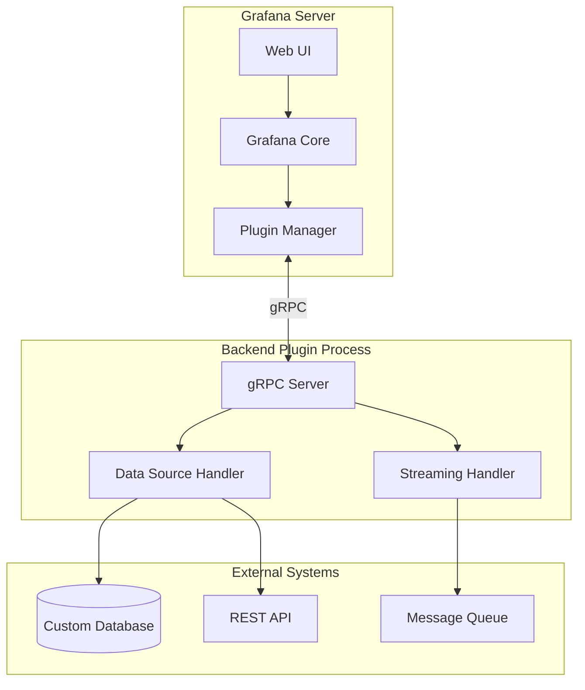
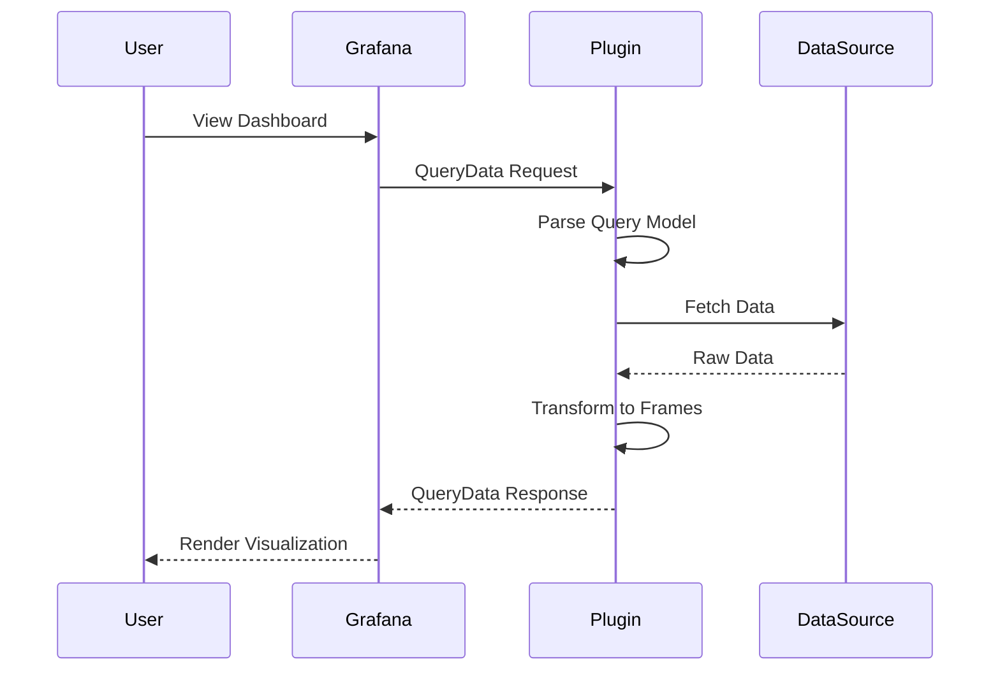
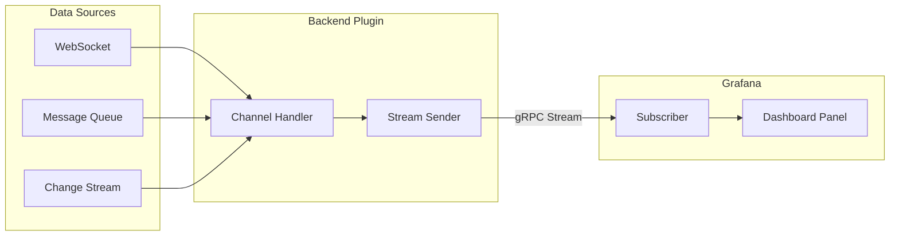
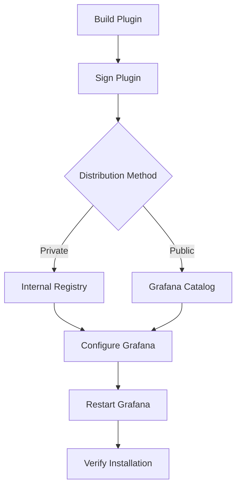

# How to Implement Grafana Backend Plugins

Author: [nawazdhandala](https://github.com/nawazdhandala)

Tags: Grafana, Backend Plugins, Data Sources, Go

Description: Learn to implement Grafana backend plugins with Go SDK, query handling, and streaming for custom data source integration.

---

Grafana's extensibility through plugins makes it one of the most versatile observability platforms available. While frontend plugins handle visualization, backend plugins enable you to connect Grafana to virtually any data source - from proprietary databases to custom APIs. In this guide, we will walk through implementing a complete Grafana backend plugin for a custom data source.

## Understanding Grafana Backend Plugins

Backend plugins run as separate processes that Grafana communicates with via gRPC. This architecture provides several benefits:

- **Language flexibility**: Write plugins in Go (officially supported) or other languages
- **Security isolation**: Plugins run in their own process space
- **Resource management**: Independent memory and CPU allocation
- **Alerting support**: Backend plugins can support Grafana alerting



## Prerequisites

Before starting, ensure you have:

- Go 1.21 or later installed
- Node.js 18+ (for frontend components)
- Grafana 10.0 or later
- The Grafana plugin tools CLI

Install the Grafana create-plugin tool:

```bash
npx @grafana/create-plugin@latest
```

## Project Structure

A typical backend plugin follows this structure:

```
my-datasource-plugin/
├── pkg/
│   ├── main.go              # Plugin entry point
│   ├── plugin/
│   │   ├── datasource.go    # Data source implementation
│   │   ├── query.go         # Query handling logic
│   │   └── streaming.go     # Streaming support
├── src/
│   ├── module.ts            # Frontend module
│   ├── datasource.ts        # Frontend data source
│   └── components/
│       └── ConfigEditor.tsx # Configuration UI
├── go.mod
├── go.sum
├── package.json
└── plugin.json              # Plugin metadata
```

## Step 1: Initialize the Plugin

Create a new backend data source plugin:

```bash
npx @grafana/create-plugin@latest
```

Select "datasource" as the plugin type and enable backend support when prompted.

## Step 2: Configure Plugin Metadata

The `plugin.json` file defines your plugin's capabilities:

```json
{
  "type": "datasource",
  "name": "My Custom Data Source",
  "id": "myorg-custom-datasource",
  "backend": true,
  "executable": "gpx_custom_datasource",
  "alerting": true,
  "streaming": true,
  "info": {
    "description": "Custom data source for proprietary systems",
    "author": {
      "name": "Your Organization"
    },
    "version": "1.0.0"
  },
  "dependencies": {
    "grafanaDependency": ">=10.0.0",
    "plugins": []
  }
}
```

## Step 3: Implement the Data Source Handler

The core of your backend plugin is the data source handler. Create `pkg/plugin/datasource.go`:

```go
package plugin

import (
    "context"
    "encoding/json"
    "fmt"
    "time"

    "github.com/grafana/grafana-plugin-sdk-go/backend"
    "github.com/grafana/grafana-plugin-sdk-go/backend/instancemgmt"
    "github.com/grafana/grafana-plugin-sdk-go/data"
)

// Make sure Datasource implements required interfaces
var (
    _ backend.QueryDataHandler      = (*Datasource)(nil)
    _ backend.CheckHealthHandler    = (*Datasource)(nil)
    _ instancemgmt.InstanceDisposer = (*Datasource)(nil)
)

// Datasource is the main plugin struct
type Datasource struct {
    settings backend.DataSourceInstanceSettings
    client   *CustomAPIClient
}

// DatasourceSettings contains the parsed settings
type DatasourceSettings struct {
    Endpoint string `json:"endpoint"`
    APIKey   string `json:"apiKey"`
    Timeout  int    `json:"timeout"`
}

// NewDatasource creates a new datasource instance
func NewDatasource(ctx context.Context, settings backend.DataSourceInstanceSettings) (instancemgmt.Instance, error) {
    var dsSettings DatasourceSettings

    if err := json.Unmarshal(settings.JSONData, &dsSettings); err != nil {
        return nil, fmt.Errorf("failed to parse settings: %w", err)
    }

    // Retrieve secure settings (like API keys)
    if apiKey, exists := settings.DecryptedSecureJSONData["apiKey"]; exists {
        dsSettings.APIKey = apiKey
    }

    // Initialize your custom client
    client, err := NewCustomAPIClient(dsSettings.Endpoint, dsSettings.APIKey, dsSettings.Timeout)
    if err != nil {
        return nil, fmt.Errorf("failed to create client: %w", err)
    }

    return &Datasource{
        settings: settings,
        client:   client,
    }, nil
}

// Dispose cleans up resources when the instance is disposed
func (d *Datasource) Dispose() {
    if d.client != nil {
        d.client.Close()
    }
}

// CheckHealth validates the data source configuration
func (d *Datasource) CheckHealth(ctx context.Context, req *backend.CheckHealthRequest) (*backend.CheckHealthResult, error) {
    status := backend.HealthStatusOk
    message := "Data source is working"

    // Test the connection
    if err := d.client.Ping(ctx); err != nil {
        status = backend.HealthStatusError
        message = fmt.Sprintf("Connection failed: %s", err.Error())
    }

    return &backend.CheckHealthResult{
        Status:  status,
        Message: message,
    }, nil
}
```

## Step 4: Implement Query Handling

The query handler processes requests from Grafana dashboards. Here is the query flow:



Add the query handler to your datasource:

```go
// QueryModel represents the query structure from the frontend
type QueryModel struct {
    QueryText   string `json:"queryText"`
    MetricName  string `json:"metricName"`
    Aggregation string `json:"aggregation"`
    Interval    string `json:"interval"`
}

// QueryData handles multiple queries from Grafana
func (d *Datasource) QueryData(ctx context.Context, req *backend.QueryDataRequest) (*backend.QueryDataResponse, error) {
    response := backend.NewQueryDataResponse()

    // Process each query in parallel for better performance
    for _, query := range req.Queries {
        res := d.processQuery(ctx, req.PluginContext, query)
        response.Responses[query.RefID] = res
    }

    return response, nil
}

// processQuery handles a single query
func (d *Datasource) processQuery(ctx context.Context, pCtx backend.PluginContext, query backend.DataQuery) backend.DataResponse {
    var response backend.DataResponse

    // Parse the query model
    var qm QueryModel
    if err := json.Unmarshal(query.JSON, &qm); err != nil {
        return backend.ErrDataResponse(backend.StatusBadRequest, fmt.Sprintf("failed to parse query: %v", err))
    }

    // Calculate time range
    from := query.TimeRange.From
    to := query.TimeRange.To

    // Fetch data from your custom source
    results, err := d.client.Query(ctx, QueryParams{
        Query:       qm.QueryText,
        MetricName:  qm.MetricName,
        Aggregation: qm.Aggregation,
        From:        from,
        To:          to,
        Interval:    query.Interval,
    })
    if err != nil {
        return backend.ErrDataResponse(backend.StatusInternal, fmt.Sprintf("query failed: %v", err))
    }

    // Create the data frame
    frame := data.NewFrame(qm.MetricName)

    // Add time field
    timeField := data.NewField("time", nil, results.Timestamps)
    frame.Fields = append(frame.Fields, timeField)

    // Add value field with labels
    valueField := data.NewField("value", results.Labels, results.Values)
    valueField.Config = &data.FieldConfig{
        DisplayName: qm.MetricName,
        Unit:        results.Unit,
    }
    frame.Fields = append(frame.Fields, valueField)

    // Set frame metadata
    frame.Meta = &data.FrameMeta{
        Type: data.FrameTypeTimeSeriesMulti,
    }

    response.Frames = append(response.Frames, frame)
    return response
}
```

## Step 5: Add Streaming Support

Streaming enables real-time data updates without polling. This is essential for live dashboards:



Implement the streaming handler in `pkg/plugin/streaming.go`:

```go
package plugin

import (
    "context"
    "encoding/json"
    "fmt"
    "time"

    "github.com/grafana/grafana-plugin-sdk-go/backend"
    "github.com/grafana/grafana-plugin-sdk-go/data"
)

// Ensure Datasource implements StreamHandler
var _ backend.StreamHandler = (*Datasource)(nil)

// SubscribeStream handles new stream subscriptions
func (d *Datasource) SubscribeStream(ctx context.Context, req *backend.SubscribeStreamRequest) (*backend.SubscribeStreamResponse, error) {
    // Parse the channel path to determine what data to stream
    // Channel format: "ds/<datasource-uid>/<channel-path>"

    status := backend.SubscribeStreamStatusOK

    // Validate the subscription request
    if req.Path == "" {
        status = backend.SubscribeStreamStatusNotFound
    }

    return &backend.SubscribeStreamResponse{
        Status: status,
    }, nil
}

// PublishStream handles data published to a stream (optional)
func (d *Datasource) PublishStream(ctx context.Context, req *backend.PublishStreamRequest) (*backend.PublishStreamResponse, error) {
    // Handle incoming data if your plugin accepts published data
    return &backend.PublishStreamResponse{
        Status: backend.PublishStreamStatusOK,
    }, nil
}

// RunStream starts streaming data to subscribers
func (d *Datasource) RunStream(ctx context.Context, req *backend.RunStreamRequest, sender *backend.StreamSender) error {
    // Parse stream configuration from the path
    streamConfig, err := parseStreamPath(req.Path)
    if err != nil {
        return fmt.Errorf("invalid stream path: %w", err)
    }

    // Create a ticker for periodic updates or connect to a real-time source
    ticker := time.NewTicker(time.Duration(streamConfig.IntervalMs) * time.Millisecond)
    defer ticker.Stop()

    for {
        select {
        case <-ctx.Done():
            return ctx.Err()
        case <-ticker.C:
            // Fetch latest data point
            point, err := d.client.GetLatestDataPoint(ctx, streamConfig.MetricName)
            if err != nil {
                // Log error but continue streaming
                continue
            }

            // Create a frame for the streaming data
            frame := data.NewFrame(streamConfig.MetricName,
                data.NewField("time", nil, []time.Time{point.Timestamp}),
                data.NewField("value", nil, []float64{point.Value}),
            )

            // Send the frame to subscribers
            if err := sender.SendFrame(frame, data.IncludeAll); err != nil {
                return fmt.Errorf("failed to send frame: %w", err)
            }
        }
    }
}

// StreamConfig holds streaming configuration
type StreamConfig struct {
    MetricName string
    IntervalMs int
}

func parseStreamPath(path string) (*StreamConfig, error) {
    // Parse path like "metrics/cpu-usage/1000"
    // This is a simplified example
    return &StreamConfig{
        MetricName: "cpu-usage",
        IntervalMs: 1000,
    }, nil
}
```

## Step 6: Create the Plugin Entry Point

The main entry point initializes and runs your plugin:

```go
package main

import (
    "os"

    "github.com/grafana/grafana-plugin-sdk-go/backend/datasource"
    "github.com/grafana/grafana-plugin-sdk-go/backend/log"

    "github.com/yourorg/custom-datasource/pkg/plugin"
)

func main() {
    // Configure logging
    log.DefaultLogger.Info("Starting custom datasource backend plugin")

    // Create the plugin instance manager
    if err := datasource.Manage("myorg-custom-datasource", plugin.NewDatasource, datasource.ManageOpts{}); err != nil {
        log.DefaultLogger.Error("Failed to start plugin", "error", err)
        os.Exit(1)
    }
}
```

## Step 7: Implement the Custom API Client

Create a reusable client for your data source in `pkg/plugin/client.go`:

```go
package plugin

import (
    "context"
    "encoding/json"
    "fmt"
    "net/http"
    "time"
)

// CustomAPIClient handles communication with your data source
type CustomAPIClient struct {
    endpoint   string
    apiKey     string
    httpClient *http.Client
}

// QueryParams defines the parameters for a query
type QueryParams struct {
    Query       string
    MetricName  string
    Aggregation string
    From        time.Time
    To          time.Time
    Interval    time.Duration
}

// QueryResult holds the query results
type QueryResult struct {
    Timestamps []time.Time
    Values     []float64
    Labels     map[string]string
    Unit       string
}

// DataPoint represents a single data point
type DataPoint struct {
    Timestamp time.Time
    Value     float64
}

// NewCustomAPIClient creates a new API client
func NewCustomAPIClient(endpoint, apiKey string, timeout int) (*CustomAPIClient, error) {
    if endpoint == "" {
        return nil, fmt.Errorf("endpoint is required")
    }

    return &CustomAPIClient{
        endpoint: endpoint,
        apiKey:   apiKey,
        httpClient: &http.Client{
            Timeout: time.Duration(timeout) * time.Second,
        },
    }, nil
}

// Ping tests the connection to the data source
func (c *CustomAPIClient) Ping(ctx context.Context) error {
    req, err := http.NewRequestWithContext(ctx, "GET", c.endpoint+"/health", nil)
    if err != nil {
        return err
    }

    c.setHeaders(req)

    resp, err := c.httpClient.Do(req)
    if err != nil {
        return err
    }
    defer resp.Body.Close()

    if resp.StatusCode != http.StatusOK {
        return fmt.Errorf("health check failed with status: %d", resp.StatusCode)
    }

    return nil
}

// Query executes a query against the data source
func (c *CustomAPIClient) Query(ctx context.Context, params QueryParams) (*QueryResult, error) {
    // Build query URL with parameters
    url := fmt.Sprintf("%s/query?metric=%s&from=%d&to=%d",
        c.endpoint,
        params.MetricName,
        params.From.UnixMilli(),
        params.To.UnixMilli(),
    )

    req, err := http.NewRequestWithContext(ctx, "GET", url, nil)
    if err != nil {
        return nil, err
    }

    c.setHeaders(req)

    resp, err := c.httpClient.Do(req)
    if err != nil {
        return nil, err
    }
    defer resp.Body.Close()

    if resp.StatusCode != http.StatusOK {
        return nil, fmt.Errorf("query failed with status: %d", resp.StatusCode)
    }

    var result QueryResult
    if err := json.NewDecoder(resp.Body).Decode(&result); err != nil {
        return nil, fmt.Errorf("failed to decode response: %w", err)
    }

    return &result, nil
}

// GetLatestDataPoint retrieves the most recent data point
func (c *CustomAPIClient) GetLatestDataPoint(ctx context.Context, metricName string) (*DataPoint, error) {
    url := fmt.Sprintf("%s/latest?metric=%s", c.endpoint, metricName)

    req, err := http.NewRequestWithContext(ctx, "GET", url, nil)
    if err != nil {
        return nil, err
    }

    c.setHeaders(req)

    resp, err := c.httpClient.Do(req)
    if err != nil {
        return nil, err
    }
    defer resp.Body.Close()

    var point DataPoint
    if err := json.NewDecoder(resp.Body).Decode(&point); err != nil {
        return nil, err
    }

    return &point, nil
}

func (c *CustomAPIClient) setHeaders(req *http.Request) {
    req.Header.Set("Authorization", "Bearer "+c.apiKey)
    req.Header.Set("Content-Type", "application/json")
}

// Close cleans up any resources
func (c *CustomAPIClient) Close() {
    c.httpClient.CloseIdleConnections()
}
```

## Step 8: Build and Package the Plugin

Create a Makefile for building your plugin:

```makefile
PLUGIN_ID=myorg-custom-datasource
DIST_DIR=dist

.PHONY: build
build: build-backend build-frontend

.PHONY: build-backend
build-backend:
	mage -v build:linux
	mage -v build:darwin
	mage -v build:windows

.PHONY: build-frontend
build-frontend:
	npm install
	npm run build

.PHONY: package
package: build
	mkdir -p $(DIST_DIR)
	cp -r dist/* $(DIST_DIR)/
	cp plugin.json $(DIST_DIR)/
	cd $(DIST_DIR) && zip -r ../$(PLUGIN_ID).zip .

.PHONY: clean
clean:
	rm -rf $(DIST_DIR)
	rm -f $(PLUGIN_ID).zip
```

Create the `magefile.go` for cross-platform building:

```go
//go:build mage
// +build mage

package main

import (
    "github.com/grafana/grafana-plugin-sdk-go/build"
)

// Default configures the default target
var Default = build.BuildAll
```

## Step 9: Deploy the Plugin

### Local Development

For development, configure Grafana to load plugins from your development directory:

```ini
# grafana.ini or custom.ini
[paths]
plugins = /path/to/your/plugins

[plugins]
allow_loading_unsigned_plugins = myorg-custom-datasource
```

### Production Deployment

For production deployment, follow this process:



Sign your plugin for production use:

```bash
# Install the Grafana plugin signing tool
npx @grafana/sign-plugin@latest

# Sign the plugin (requires Grafana Cloud account)
npx @grafana/sign-plugin@latest --rootUrls https://your-grafana-instance.com
```

### Docker Deployment

Create a Dockerfile for containerized deployment:

```dockerfile
FROM grafana/grafana:10.2.0

# Copy the plugin
COPY dist/ /var/lib/grafana/plugins/myorg-custom-datasource/

# Set environment variables
ENV GF_PLUGINS_ALLOW_LOADING_UNSIGNED_PLUGINS=myorg-custom-datasource
```

## Testing Your Plugin

### Unit Testing

Create comprehensive tests for your data source:

```go
package plugin_test

import (
    "context"
    "testing"
    "time"

    "github.com/grafana/grafana-plugin-sdk-go/backend"
    "github.com/stretchr/testify/assert"
    "github.com/stretchr/testify/require"

    "github.com/yourorg/custom-datasource/pkg/plugin"
)

func TestQueryData(t *testing.T) {
    // Create test settings
    settings := backend.DataSourceInstanceSettings{
        JSONData: []byte(`{"endpoint": "http://localhost:8080", "timeout": 30}`),
    }

    // Create the datasource instance
    ds, err := plugin.NewDatasource(context.Background(), settings)
    require.NoError(t, err)

    datasource := ds.(*plugin.Datasource)

    // Create test query
    query := backend.DataQuery{
        RefID:     "A",
        TimeRange: backend.TimeRange{
            From: time.Now().Add(-1 * time.Hour),
            To:   time.Now(),
        },
        JSON: []byte(`{"metricName": "cpu_usage", "aggregation": "avg"}`),
    }

    req := &backend.QueryDataRequest{
        Queries: []backend.DataQuery{query},
    }

    // Execute query
    resp, err := datasource.QueryData(context.Background(), req)
    require.NoError(t, err)

    // Validate response
    assert.Contains(t, resp.Responses, "A")
    assert.Nil(t, resp.Responses["A"].Error)
    assert.NotEmpty(t, resp.Responses["A"].Frames)
}

func TestCheckHealth(t *testing.T) {
    settings := backend.DataSourceInstanceSettings{
        JSONData: []byte(`{"endpoint": "http://localhost:8080", "timeout": 30}`),
    }

    ds, err := plugin.NewDatasource(context.Background(), settings)
    require.NoError(t, err)

    datasource := ds.(*plugin.Datasource)

    result, err := datasource.CheckHealth(context.Background(), &backend.CheckHealthRequest{})
    require.NoError(t, err)

    assert.Equal(t, backend.HealthStatusOk, result.Status)
}
```

### Integration Testing

Use Grafana's plugin testing utilities:

```bash
# Run the plugin in development mode
npm run dev

# In another terminal, run Grafana with your plugin
docker run -d \
  -p 3000:3000 \
  -v $(pwd)/dist:/var/lib/grafana/plugins/myorg-custom-datasource \
  -e GF_PLUGINS_ALLOW_LOADING_UNSIGNED_PLUGINS=myorg-custom-datasource \
  grafana/grafana:10.2.0
```

## Best Practices

### Error Handling

Always provide meaningful error messages:

```go
func (d *Datasource) QueryData(ctx context.Context, req *backend.QueryDataRequest) (*backend.QueryDataResponse, error) {
    response := backend.NewQueryDataResponse()

    for _, query := range req.Queries {
        res := backend.DataResponse{}

        // Validate query before processing
        if err := validateQuery(query); err != nil {
            res = backend.ErrDataResponse(
                backend.StatusBadRequest,
                fmt.Sprintf("Invalid query for %s: %v", query.RefID, err),
            )
            response.Responses[query.RefID] = res
            continue
        }

        // Process the query with proper error handling
        frames, err := d.executeQuery(ctx, query)
        if err != nil {
            res = backend.ErrDataResponse(
                backend.StatusInternal,
                fmt.Sprintf("Query execution failed: %v", err),
            )
        } else {
            res.Frames = frames
        }

        response.Responses[query.RefID] = res
    }

    return response, nil
}
```

### Resource Management

Implement proper resource cleanup:

```go
type Datasource struct {
    settings   backend.DataSourceInstanceSettings
    client     *CustomAPIClient
    cancelFunc context.CancelFunc
}

func NewDatasource(ctx context.Context, settings backend.DataSourceInstanceSettings) (instancemgmt.Instance, error) {
    ctx, cancel := context.WithCancel(ctx)

    // ... initialization code ...

    return &Datasource{
        settings:   settings,
        client:     client,
        cancelFunc: cancel,
    }, nil
}

func (d *Datasource) Dispose() {
    // Cancel any ongoing operations
    if d.cancelFunc != nil {
        d.cancelFunc()
    }

    // Close the client connection
    if d.client != nil {
        d.client.Close()
    }
}
```

### Logging

Use structured logging for debugging:

```go
import "github.com/grafana/grafana-plugin-sdk-go/backend/log"

func (d *Datasource) QueryData(ctx context.Context, req *backend.QueryDataRequest) (*backend.QueryDataResponse, error) {
    logger := log.DefaultLogger.With(
        "datasource", d.settings.Name,
        "queryCount", len(req.Queries),
    )

    logger.Info("Processing queries")

    for _, query := range req.Queries {
        logger.Debug("Executing query",
            "refID", query.RefID,
            "from", query.TimeRange.From,
            "to", query.TimeRange.To,
        )

        // ... query processing ...
    }

    return response, nil
}
```

## Conclusion

Building a Grafana backend plugin opens up endless possibilities for integrating custom data sources into your observability stack. By following the patterns outlined in this guide, you can create robust, production-ready plugins that support:

- Custom authentication and connection handling
- Complex query processing with proper error handling
- Real-time streaming for live dashboards
- Grafana alerting integration

The Grafana plugin SDK provides a solid foundation, but remember to implement proper resource management, comprehensive testing, and structured logging for production deployments.

## Additional Resources

- [Grafana Plugin SDK Documentation](https://grafana.com/docs/grafana/latest/developers/plugins/)
- [Plugin SDK Go Reference](https://pkg.go.dev/github.com/grafana/grafana-plugin-sdk-go)
- [Example Plugins Repository](https://github.com/grafana/grafana-plugin-examples)
- [Plugin Tools CLI](https://grafana.com/docs/grafana/latest/developers/plugins/create-a-plugin/)
