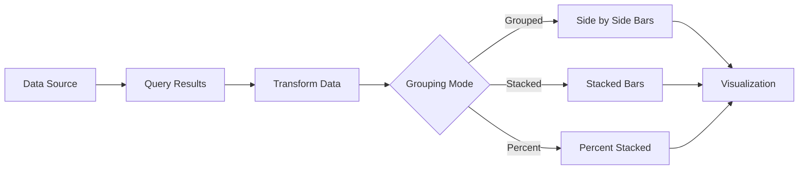
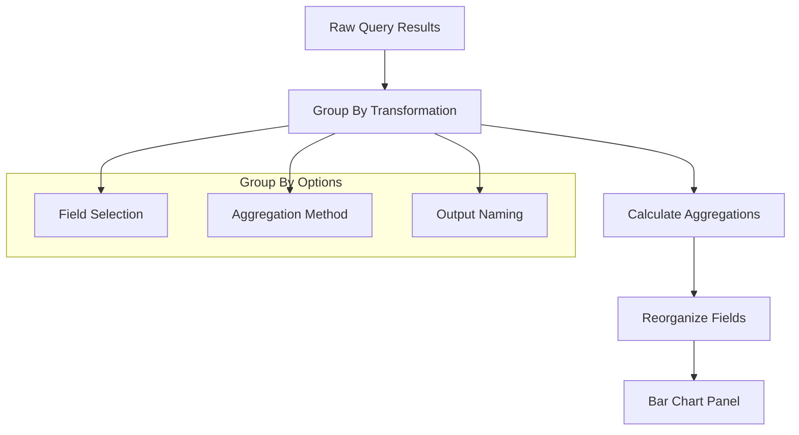
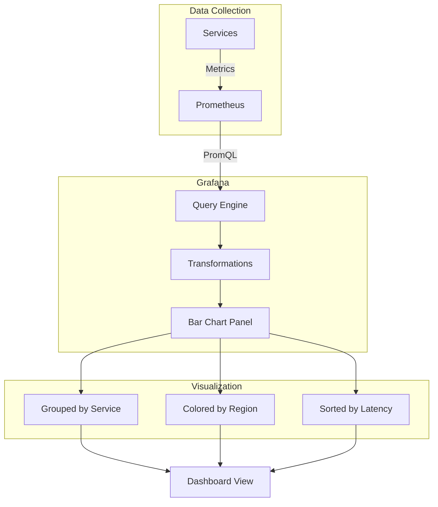

# How to Implement Grafana Bar Chart Grouping

Author: [nawazdhandala](https://github.com/nawazdhandala)

Tags: Grafana, Observability, Dashboards, Charts

Description: Learn how to group and visualize data effectively using bar charts in Grafana with practical examples and configuration tips.

Bar charts are one of the most powerful visualization tools in Grafana for comparing categorical data across multiple dimensions. Whether you are tracking service latency by region, error counts by endpoint, or resource usage by team, grouping your bar charts properly can transform raw metrics into actionable insights.

This guide walks you through implementing bar chart grouping in Grafana, from basic setups to advanced configurations.

## Understanding Bar Chart Grouping in Grafana

Bar chart grouping allows you to display multiple series side by side or stacked, making it easy to compare values across categories. Grafana supports several grouping modes:

- **Grouped (Side by Side):** Bars for each series appear next to each other within the same category
- **Stacked:** Bars are stacked on top of each other, showing both individual and total values
- **Percent Stacked:** Similar to stacked, but normalized to show percentage contributions

Here is a visual representation of how data flows through the grouping process:



## Setting Up Your Data Source Query

The foundation of effective bar chart grouping starts with your query. Your query should return data with clear categorical labels that Grafana can use for grouping.

Here is an example PromQL query that returns HTTP request counts grouped by service and status code:

```promql
sum by (service, status_code) (
  rate(http_requests_total[5m])
)
```

For SQL-based data sources like PostgreSQL or MySQL, structure your query to return the grouping fields:

```sql
SELECT
  service_name,
  region,
  SUM(request_count) as total_requests
FROM api_metrics
WHERE time >= NOW() - INTERVAL '1 hour'
GROUP BY service_name, region
ORDER BY service_name, region
```

## Configuring the Bar Chart Panel

Once your query returns properly structured data, configure the bar chart panel to display grouped data effectively.

### Step 1: Add a New Panel

In your Grafana dashboard, click "Add panel" and select "Bar chart" from the visualization options.

### Step 2: Configure Panel Options

Navigate to the panel options on the right sidebar. Here are the key settings for grouping:

The following JSON shows the panel configuration for a grouped bar chart:

```json
{
  "fieldConfig": {
    "defaults": {
      "color": {
        "mode": "palette-classic"
      },
      "custom": {
        "axisLabel": "",
        "axisPlacement": "auto",
        "barAlignment": 0,
        "drawStyle": "bars",
        "fillOpacity": 80,
        "gradientMode": "none",
        "stacking": {
          "mode": "none",
          "group": "A"
        }
      }
    }
  },
  "options": {
    "barWidth": 0.8,
    "groupWidth": 0.7,
    "orientation": "horizontal",
    "showValue": "auto",
    "stacking": "none",
    "xTickLabelRotation": 0
  }
}
```

## Grouping Modes Explained

Let us explore each grouping mode with practical examples.

### Grouped (Side by Side) Mode

This mode places bars for different series adjacent to each other within the same category. It is ideal for direct comparison between series.

Set the stacking mode to "none" in your panel configuration:

```json
{
  "options": {
    "stacking": "none",
    "groupWidth": 0.7,
    "barWidth": 0.9
  }
}
```

Use cases for grouped mode:
- Comparing response times across different services
- Showing A/B test results side by side
- Displaying resource usage by team

### Stacked Mode

Stacked bars show cumulative values, making it easy to see both individual contributions and totals.

Configure stacking in your panel settings:

```json
{
  "options": {
    "stacking": "normal",
    "groupWidth": 0.7,
    "barWidth": 0.9
  }
}
```

Use cases for stacked mode:
- Total traffic breakdown by source
- Error budget consumption by service
- Resource allocation across projects

### Percent Stacked Mode

Percent stacking normalizes all bars to 100%, showing proportional contributions regardless of absolute values.

Enable percent stacking with:

```json
{
  "options": {
    "stacking": "percent",
    "groupWidth": 0.7,
    "barWidth": 0.9
  }
}
```

Use cases for percent stacked mode:
- Market share visualization
- Error type distribution
- Traffic source percentages

## Using Transformations for Advanced Grouping

Grafana transformations allow you to reshape your data before visualization. This is particularly useful when your data source returns data in a format that does not match your grouping requirements.

### Group By Transformation

The Group By transformation aggregates data based on specified fields.

Here is the flow of how transformations process your data:



Configure the Group By transformation in your panel:

1. Open the Transform tab in your panel editor
2. Add a "Group by" transformation
3. Select the field to group by (e.g., "service")
4. Choose the aggregation method (sum, average, count, etc.)

### Organize Fields Transformation

After grouping, you may want to reorder or rename fields for clarity.

```json
{
  "transformations": [
    {
      "id": "groupBy",
      "options": {
        "fields": {
          "service": {
            "aggregations": [],
            "operation": "groupby"
          },
          "value": {
            "aggregations": ["sum"],
            "operation": "aggregate"
          }
        }
      }
    },
    {
      "id": "organize",
      "options": {
        "renameByName": {
          "service": "Service Name",
          "value (sum)": "Total Requests"
        }
      }
    }
  ]
}
```

## Real-World Example: Service Latency Dashboard

Let us build a complete example showing service latency grouped by region and service tier.

### The Query

This Prometheus query retrieves p95 latency for HTTP requests:

```promql
histogram_quantile(0.95,
  sum by (service, region, le) (
    rate(http_request_duration_seconds_bucket[5m])
  )
)
```

### Panel Configuration

Configure the bar chart to display this data effectively:

```json
{
  "title": "P95 Latency by Service and Region",
  "type": "barchart",
  "datasource": {
    "type": "prometheus",
    "uid": "prometheus-datasource"
  },
  "targets": [
    {
      "expr": "histogram_quantile(0.95, sum by (service, region, le) (rate(http_request_duration_seconds_bucket[5m])))",
      "legendFormat": "{{service}} - {{region}}"
    }
  ],
  "fieldConfig": {
    "defaults": {
      "unit": "s",
      "decimals": 2,
      "color": {
        "mode": "palette-classic"
      }
    }
  },
  "options": {
    "orientation": "horizontal",
    "stacking": "none",
    "groupWidth": 0.7,
    "barWidth": 0.85,
    "showValue": "always",
    "legend": {
      "displayMode": "list",
      "placement": "bottom"
    }
  }
}
```

### Dashboard Architecture

Here is how the components work together:



## Best Practices for Bar Chart Grouping

Follow these guidelines to create effective grouped bar charts:

**Limit the Number of Groups:** Keep your charts readable by limiting to 5-7 groups. Too many groups make comparison difficult.

**Use Consistent Colors:** Assign consistent colors to the same categories across multiple charts. This helps users quickly identify patterns.

**Choose the Right Orientation:** Use horizontal bars when category labels are long. Vertical bars work better for time-based comparisons.

**Add Value Labels Thoughtfully:** Show values directly on bars only when precision matters and there is enough space.

**Sort Meaningfully:** Sort bars by value (descending) for impact, or alphabetically for easy lookup.

## Handling Common Issues

### Issue: Bars Are Too Thin or Overlap

Adjust the groupWidth and barWidth options:

```json
{
  "options": {
    "groupWidth": 0.8,
    "barWidth": 0.95
  }
}
```

### Issue: Labels Are Cut Off

Increase the minimum width for the panel or rotate labels:

```json
{
  "options": {
    "xTickLabelRotation": -45,
    "xTickLabelMaxLength": 20
  }
}
```

### Issue: Too Many Series Clutter the Chart

Use transformations to filter or aggregate data before visualization:

```json
{
  "transformations": [
    {
      "id": "filterByValue",
      "options": {
        "filters": [
          {
            "fieldName": "Value",
            "config": {
              "id": "greater",
              "options": {
                "value": 100
              }
            }
          }
        ]
      }
    }
  ]
}
```

## Integrating with Alerting

Bar charts can be combined with Grafana alerting to trigger notifications when grouped values exceed thresholds.

Create an alert rule that monitors the maximum value across all groups:

```yaml
apiVersion: 1
groups:
  - name: service-latency-alerts
    rules:
      - alert: HighServiceLatency
        expr: |
          max by (service) (
            histogram_quantile(0.95,
              sum by (service, le) (
                rate(http_request_duration_seconds_bucket[5m])
              )
            )
          ) > 0.5
        for: 5m
        labels:
          severity: warning
        annotations:
          summary: "High latency detected for {{ $labels.service }}"
          description: "P95 latency is {{ $value }}s, exceeding 500ms threshold"
```

## Conclusion

Grafana bar chart grouping is a powerful feature for comparing categorical data across multiple dimensions. By understanding the different grouping modes, leveraging transformations, and following best practices, you can create dashboards that turn complex metrics into clear, actionable insights.

Start with simple grouped charts and progressively add complexity as your monitoring needs evolve. Remember that the goal is not just to display data, but to enable quick decision-making during incidents and planning sessions.

For more observability best practices, explore how OneUptime integrates with Grafana to provide unified monitoring, alerting, and incident management in a single platform.

---

**Related Reading:**

- [The Three Pillars of Observability: Logs, Metrics, and Traces](https://oneuptime.com/blog/post/2025-08-20-three-pillars-of-observability-logs-metrics-traces/view)
- [SRE Metrics to Track](https://oneuptime.com/blog/post/2025-11-28-sre-metrics-to-track/view)
- [Monitoring vs Observability in SRE](https://oneuptime.com/blog/post/2025-11-28-monitoring-vs-observability-sre/view)
