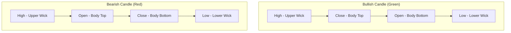
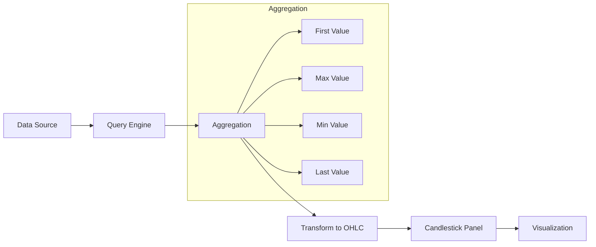
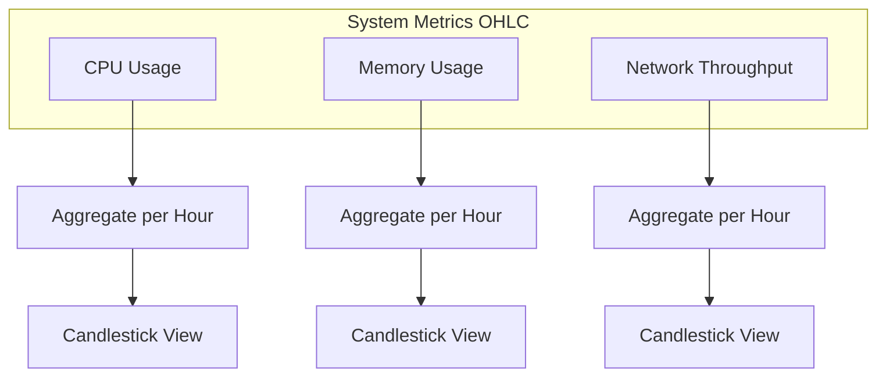

# How to Create Grafana Candlestick Charts

Author: [nawazdhandala](https://github.com/nawazdhandala)

Tags: Grafana, Observability, Dashboard, Finance

Description: Learn how to build candlestick charts in Grafana for visualizing price movements, system metrics volatility, and time-series data with OHLC patterns.

---

Candlestick charts originated in 18th century Japan for tracking rice prices. Today they are essential for visualizing any data where you need to see open, high, low, and close values over time. Grafana's candlestick panel makes it straightforward to create these visualizations for financial data, system metrics, or any OHLC pattern.

## What Is a Candlestick Chart?

A candlestick chart displays four data points for each time period:

- **Open** - The starting value
- **High** - The maximum value
- **Low** - The minimum value
- **Close** - The ending value

The following diagram shows the anatomy of a single candlestick.


```mermaid
flowchart TB
    subgraph Bullish["Bullish Candle (Green)"]
        BH[High - Upper Wick]
        BC[Close - Body Top]
        BO[Open - Body Bottom]
        BL[Low - Lower Wick]
        BH --> BC --> BO --> BL
    end

    subgraph Bearish["Bearish Candle (Red)"]
        RH[High - Upper Wick]
        RO[Open - Body Top]
        RC[Close - Body Bottom]
        RL[Low - Lower Wick]
        RH --> RO --> RC --> RL
    end
```

When the close is higher than the open, the candle is bullish (typically green). When the close is lower than the open, the candle is bearish (typically red).

## Prerequisites

Before creating candlestick charts, ensure you have:

- Grafana 8.3 or later (candlestick panel included by default)
- A data source with OHLC data or metrics that can be aggregated into OHLC format
- Basic familiarity with Grafana dashboards

## Setting Up the Candlestick Panel

### Step 1: Add a New Panel

Open your Grafana dashboard and click "Add panel" then "Add a new panel". In the visualization picker on the right sidebar, search for "Candlestick" and select it.

### Step 2: Configure Your Data Source

The candlestick panel requires data in a specific format. Your query must return fields that Grafana can map to open, high, low, and close values.

Here is an example query for InfluxDB that aggregates metrics into OHLC format.

```sql
SELECT
  first("value") AS "open",
  max("value") AS "high",
  min("value") AS "low",
  last("value") AS "close"
FROM "cpu_usage"
WHERE $timeFilter
GROUP BY time($__interval)
```

For Prometheus, you can use recording rules or range-vector functions to achieve similar results.

```promql
# Using range-vector functions to get OHLC-like data
# first_over_time requires Prometheus' promql-experimental-functions feature flag.

# Open - first value in interval
first_over_time(cpu_usage[5m])

# High - maximum value
max_over_time(cpu_usage[5m])

# Low - minimum value
min_over_time(cpu_usage[5m])

# Close - last value in interval
last_over_time(cpu_usage[5m])
```

### Step 3: Map Fields to OHLC

In the panel options, expand the "Candlestick" section. You will see options to map your data fields.

| Option | Description |
|--------|-------------|
| Open | Field containing opening values |
| High | Field containing high values |
| Low | Field containing low values |
| Close | Field containing closing values |
| Volume | Field containing volume values |

If your fields are named conventionally (open, high, low, close), Grafana will auto-detect them.

## Data Flow for Candlestick Visualization

The following diagram illustrates how data flows from your source to the candlestick chart.


```mermaid
flowchart LR
    DS[Data Source] --> Q[Query Engine]
    Q --> A[Aggregation]
    A --> T[Transform to OHLC]
    T --> P[Candlestick Panel]
    P --> V[Visualization]

    subgraph Aggregation
        A --> Open[First Value]
        A --> High[Max Value]
        A --> Low[Min Value]
        A --> Close[Last Value]
    end
```

## Practical Example: Stock Price Dashboard

Let us create a complete candlestick chart for stock price data.

### Sample Data Structure

Your data source should provide data similar to this structure.

```json
{
  "timestamp": "2026-01-30T09:00:00Z",
  "symbol": "AAPL",
  "open": 185.50,
  "high": 187.25,
  "low": 184.75,
  "close": 186.80,
  "volume": 1250000
}
```

### PostgreSQL with TimescaleDB Query Example

This query fetches stock data from a PostgreSQL database with TimescaleDB enabled and formats it for the candlestick panel.

```sql
SELECT
  time_bucket('1 hour', timestamp) AS time,
  first(price, timestamp) AS open,
  max(price) AS high,
  min(price) AS low,
  last(price, timestamp) AS close,
  sum(volume) AS volume
FROM stock_trades
WHERE
  symbol = 'AAPL'
  AND $__timeFilter(timestamp)
GROUP BY time_bucket('1 hour', timestamp)
ORDER BY time
```

### MySQL Query Example

For MySQL databases, use the following approach.

```sql
SELECT
  $__timeGroupAlias(timestamp, '1h'),
  CAST(SUBSTRING_INDEX(GROUP_CONCAT(price ORDER BY timestamp), ',', 1) AS DECIMAL(18,6)) AS open,
  MAX(price) AS high,
  MIN(price) AS low,
  CAST(SUBSTRING_INDEX(GROUP_CONCAT(price ORDER BY timestamp DESC), ',', 1) AS DECIMAL(18,6)) AS close
FROM stock_trades
WHERE
  symbol = 'AAPL'
  AND $__timeFilter(timestamp)
GROUP BY time
ORDER BY time
```

## Configuring Panel Options

### Colors

Customize the appearance of bullish and bearish candles in the panel options.

```text
Up color: #73BF69 (green)
Down color: #F2495C (red)
```

### Candle Style Options

Grafana supports multiple candlestick styles.

| Style | Description |
|-------|-------------|
| Candles | Traditional filled rectangles with wicks |
| OHLC Bars | OHLC bars without filled bodies |

### Include Volume

To add volume bars beneath your candlesticks, set the candlestick mode to "Both". Ensure your query returns a volume field.

## Using Transformations

Grafana transformations can help reshape data for candlestick charts.

### Group By

When your data comes in separate series, use the "Group by" transformation.

1. Select "Group by" transformation
2. Group by time field
3. Calculate first (open), max (high), min (low), last (close)

### Rename Fields

Use "Organize fields" to rename columns to match OHLC conventions.

```text
price_first -> open
price_max -> high
price_min -> low
price_last -> close
```

## Advanced Configuration with JSON

For complex setups, you can directly edit the panel JSON. This is useful for programmatic dashboard generation.

```json
{
  "type": "candlestick",
  "title": "Stock Price - AAPL",
  "options": {
    "mode": "candles+volume",
    "candleStyle": "candles",
    "colorStrategy": "open-close",
    "colors": {
      "up": "#73BF69",
      "down": "#F2495C"
    },
    "fields": {
      "open": "open",
      "high": "high",
      "low": "low",
      "close": "close",
      "volume": "volume"
    }
  }
}
```

## Use Cases Beyond Finance

Candlestick charts are valuable for more than stock prices.

### System Metrics Volatility

Track CPU or memory usage volatility over time intervals.


```mermaid
flowchart TB
    subgraph Metrics["System Metrics OHLC"]
        CPU[CPU Usage]
        MEM[Memory Usage]
        NET[Network Throughput]
    end

    CPU --> Agg1[Aggregate per Hour]
    MEM --> Agg2[Aggregate per Hour]
    NET --> Agg3[Aggregate per Hour]

    Agg1 --> CS1[Candlestick View]
    Agg2 --> CS2[Candlestick View]
    Agg3 --> CS3[Candlestick View]
```

This query aggregates node CPU metrics for candlestick visualization.

```promql
# For Prometheus - create OHLC from CPU metrics
# Use recording rules for efficiency
# first_over_time requires Prometheus' promql-experimental-functions feature flag.

# rule: instance:cpu_idle_percent
100 * avg by (instance) (rate(node_cpu_seconds_total{mode="idle"}[5m]))

# rule: cpu_ohlc_open
first_over_time(instance:cpu_idle_percent[1h])

# rule: cpu_ohlc_high
max_over_time(instance:cpu_idle_percent[1h])

# rule: cpu_ohlc_low
min_over_time(instance:cpu_idle_percent[1h])

# rule: cpu_ohlc_close
last_over_time(instance:cpu_idle_percent[1h])
```

### API Response Times

Visualize the range of response times for your services.

```sql
SELECT
  time_bucket('15 minutes', timestamp) AS time,
  percentile_cont(0.05) WITHIN GROUP (ORDER BY response_time) AS open,
  max(response_time) AS high,
  min(response_time) AS low,
  percentile_cont(0.95) WITHIN GROUP (ORDER BY response_time) AS close
FROM api_requests
WHERE endpoint = '/api/v1/users'
GROUP BY time_bucket('15 minutes', timestamp)
ORDER BY time
```

Resource Pricing

Track cloud resource pricing fluctuations.

```sql
WITH daily_prices AS (
  SELECT
    date_trunc('day', timestamp) AS time,
    spot_price,
    row_number() OVER (PARTITION BY date_trunc('day', timestamp) ORDER BY timestamp) AS open_rank,
    row_number() OVER (PARTITION BY date_trunc('day', timestamp) ORDER BY timestamp DESC) AS close_rank
  FROM aws_spot_prices
  WHERE instance_type = 'm5.large'
)
SELECT
  time,
  max(spot_price) FILTER (WHERE open_rank = 1) AS open,
  max(spot_price) AS high,
  min(spot_price) AS low,
  max(spot_price) FILTER (WHERE close_rank = 1) AS close
FROM daily_prices
GROUP BY time
ORDER BY time
```

## Alerting on Candlestick Patterns

While Grafana does not natively detect candlestick patterns, you can create alerts based on the underlying data.

### Alert on Large Price Swings

Create an alert when the high-low range exceeds a threshold.

```promql
(max_over_time(stock_price[1h]) - min_over_time(stock_price[1h]))
  /
avg_over_time(stock_price[1h]) > 0.05
```

This fires when volatility exceeds 5% of the average price.

## Dashboard Template

Here is a complete dashboard JSON snippet for a candlestick panel.

```json
{
  "panels": [
    {
      "id": 1,
      "type": "candlestick",
      "title": "Price Action",
      "gridPos": {
        "h": 12,
        "w": 24,
        "x": 0,
        "y": 0
      },
      "targets": [
        {
          "refId": "A",
          "rawSql": "SELECT time, open, high, low, close, volume FROM ohlc_data WHERE $__timeFilter(time)"
        }
      ],
      "fieldConfig": {
        "defaults": {
          "custom": {
            "drawStyle": "line"
          }
        },
        "overrides": []
      },
      "options": {
        "mode": "candles+volume",
        "candleStyle": "candles",
        "colorStrategy": "open-close",
        "colors": {
          "up": "#73BF69",
          "down": "#F2495C"
        },
        "fields": {
          "open": "open",
          "high": "high",
          "low": "low",
          "close": "close",
          "volume": "volume"
        }
      }
    }
  ]
}
```

## Troubleshooting

### No Data Displayed

Check that your query returns the required fields. Enable query inspector to see raw data.

```text
Panel menu > Inspect > Query > Refresh
```

### Candles Appear as Lines

This happens when open and close values are identical. Ensure your time intervals contain enough data points.

### Wrong Colors

Verify your color strategy setting. The "Since Open" strategy compares open and close values. The "Since Prior Close" strategy compares the current value to the previous close.

### Time Gaps

Missing candles indicate no data for that period. Consider using fill options.

```sql
-- PostgreSQL with time_bucket_gapfill
SELECT
  time_bucket_gapfill('1 hour', timestamp) AS time,
  locf(first(price, timestamp)) AS open,
  locf(max(price)) AS high,
  locf(min(price)) AS low,
  locf(last(price, timestamp)) AS close
FROM stock_trades
WHERE $__timeFilter(timestamp)
GROUP BY time_bucket_gapfill('1 hour', timestamp)
ORDER BY time
```

## Integration with OneUptime

OneUptime provides comprehensive observability that complements Grafana visualizations. You can export metrics from OneUptime to Grafana data sources and create candlestick charts for:

- Response time volatility tracking
- Error rate fluctuations
- Resource utilization patterns
- SLO compliance ranges

Connect OneUptime metrics to Grafana using the Prometheus remote write endpoint or the built-in Grafana integration.

---

Candlestick charts add a powerful dimension to your observability dashboards. They reveal patterns in volatility and ranges that line charts miss. Start with financial data where the format is natural, then explore applying OHLC visualization to your system metrics for new insights into performance patterns.

**Related Reading:**

- [Three Pillars of Observability: Logs, Metrics, and Traces](https://oneuptime.com/blog/post/2025-08-20-three-pillars-of-observability-logs-metrics-traces/view)
- [SRE Metrics to Track](https://oneuptime.com/blog/post/2025-11-28-sre-metrics-to-track/view)
- [Monitoring vs Observability](https://oneuptime.com/blog/post/2025-11-28-monitoring-vs-observability-sre/view)
