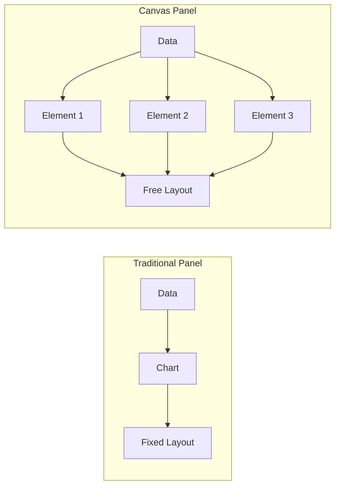
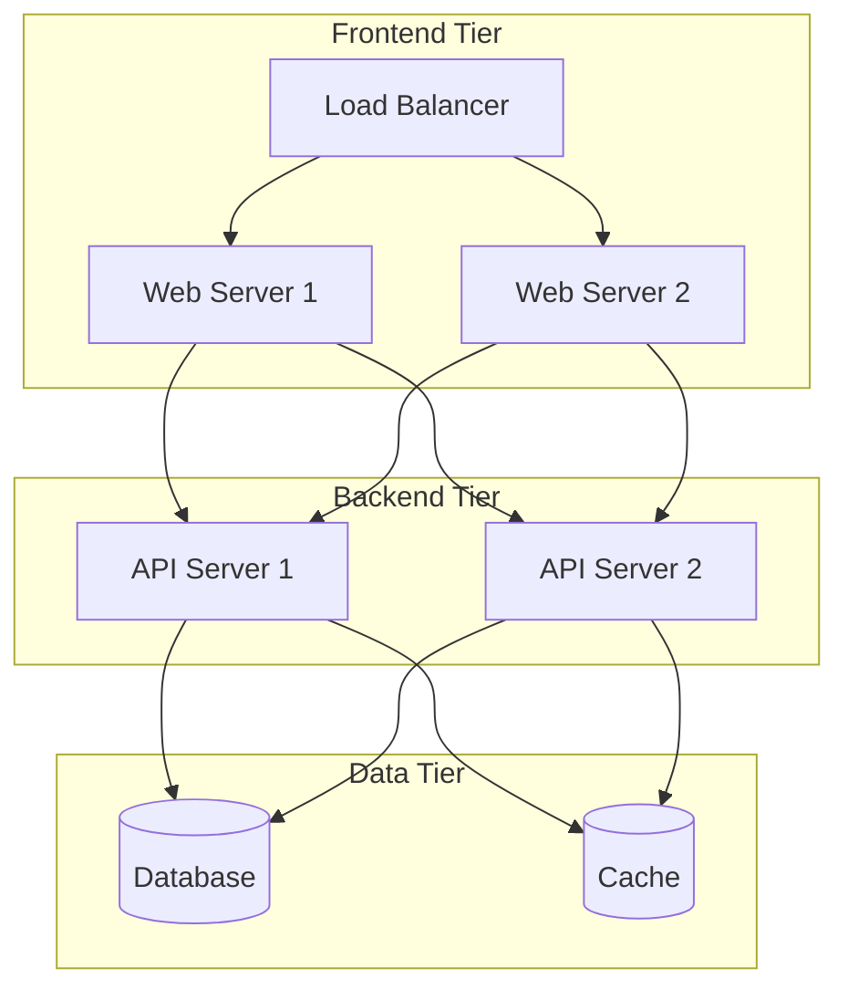
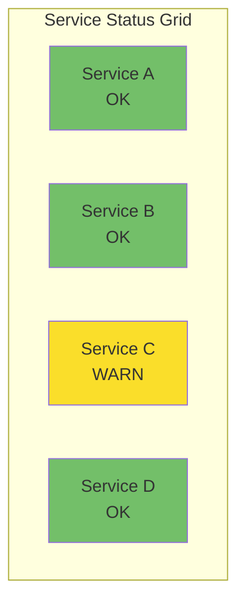
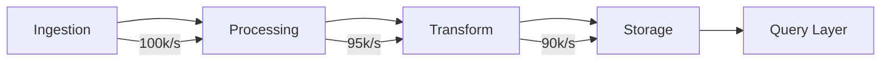
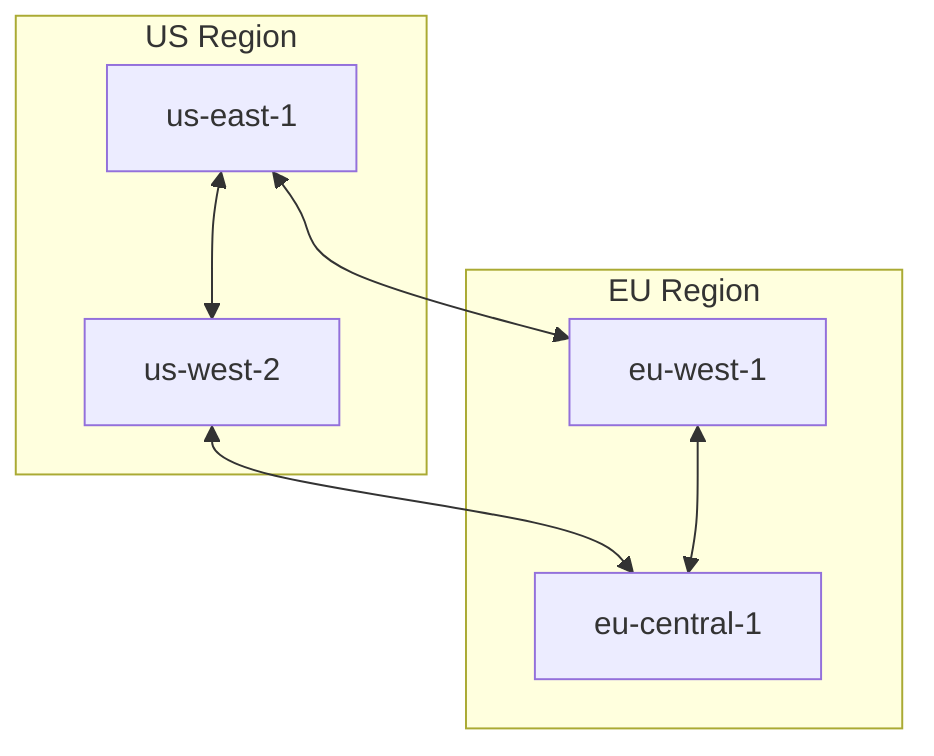

# How to Create Grafana Canvas Panels

Author: [nawazdhandala](https://github.com/nawazdhandala)

Tags: Grafana, Observability, Dashboards, Canvas

Description: Learn how to build interactive, custom visualizations with Grafana Canvas panels to create dynamic infrastructure diagrams and real-time system overviews.

---

Grafana dashboards are powerful, but sometimes standard charts and graphs are not enough. When you need to visualize your infrastructure as an interactive diagram, show the flow of data through your systems, or create custom visual representations of your architecture, Canvas panels are the answer.

Canvas panels let you place elements freely on a canvas, bind them to data sources, and create dynamic visualizations that update in real time. Think of it as combining the flexibility of a drawing tool with the power of Grafana's data connectivity.

This guide walks you through everything you need to know to create effective Canvas panels.

---

## What are Canvas Panels?

Canvas panels are a visualization type in Grafana that allow you to:

- Place elements freely anywhere on the panel
- Create custom shapes, icons, and connections
- Bind element properties (color, size, text) to query results
- Build interactive infrastructure diagrams
- Design custom status boards and system overviews

Unlike traditional panels that automatically lay out data, Canvas gives you complete control over positioning and appearance.



---

## When to Use Canvas Panels

Canvas panels excel in specific scenarios:

| Use Case | Why Canvas Works |
|----------|------------------|
| Infrastructure diagrams | Show servers, databases, and connections visually |
| Network topology | Display network flow and device status |
| Floor plans | Monitor IoT devices by physical location |
| Custom dashboards | Create branded or unique visual layouts |
| Status boards | Build NOC-style overview displays |

Avoid Canvas when simple time series charts or tables would communicate the information more effectively.

---

## Creating Your First Canvas Panel

### Step 1: Add a Canvas Panel

In your Grafana dashboard, click Add panel and select Canvas from the visualization options.

You will see an empty canvas with a toolbar at the top.

### Step 2: Add Basic Elements

The Canvas panel supports several element types:

- **Rectangle** - Basic shapes for backgrounds or containers
- **Text** - Labels and dynamic text values
- **Icon** - Grafana's icon library for visual indicators
- **Server** - Pre-built server representation
- **Button** - Interactive elements for links or actions
- **Metric Value** - Display query results directly

To add an element, click the element type in the toolbar, then click on the canvas where you want to place it.

### Step 3: Configure Element Properties

Select any element to see its properties in the right sidebar.

Common properties include:

- **Position** - X, Y coordinates and size
- **Background** - Color and opacity
- **Border** - Style, width, and color
- **Text** - Content, font size, and alignment

---

## Connecting Data to Canvas Elements

The real power of Canvas panels comes from binding element properties to your data queries.

### Setting Up a Data Source

First, add a query to your panel. For this example, we will query Prometheus for CPU usage.

Create a query that returns the metrics you want to visualize.

```promql
avg(rate(node_cpu_seconds_total{mode!="idle"}[5m])) by (instance) * 100
```

### Binding Data to Elements

With your query configured, you can bind element properties to the results.

Select an element and find the data binding options in the properties panel.

The binding configuration looks like this.

```yaml
# Element: Server Icon
properties:
  color:
    field: Value
    thresholds:
      - value: 0
        color: green
      - value: 70
        color: yellow
      - value: 90
        color: red
  text:
    field: instance
```

This configuration changes the server icon color based on CPU usage thresholds.

---

## Building an Infrastructure Diagram

Let us create a practical example: a three-tier application architecture diagram.

### Architecture Overview



### Step-by-Step Implementation

**1. Create the background structure**

Add rectangles to represent each tier. Position them vertically to show the flow from frontend to data layer.

**2. Add server icons for each component**

Place server icons within each tier rectangle. Use the icon library to select appropriate icons (web server, database, cache).

**3. Add connection lines**

Use the line element to draw connections between components. Lines can be straight or have anchor points for routing.

**4. Configure queries for each component**

Add queries for each server's metrics.

```promql
# Web server health
up{job="web-servers"}

# API server response time
histogram_quantile(0.95, rate(http_request_duration_seconds_bucket{job="api"}[5m]))

# Database connections
pg_stat_activity_count{datname="production"}

# Cache hit rate
redis_keyspace_hits_total / (redis_keyspace_hits_total + redis_keyspace_misses_total)
```

**5. Bind data to visual properties**

For each server icon, bind the color property to the corresponding query with appropriate thresholds.

---

## Advanced Canvas Techniques

### Dynamic Text Values

Display live metric values directly on your canvas.

Add a Metric Value element and configure it.

```yaml
element: metric-value
query: A  # Reference your query
field: Value
unit: percent
decimals: 1
textSize: 24
```

### Conditional Visibility

Show or hide elements based on data conditions. This is useful for displaying warning icons only when issues occur.

In the element properties, configure the visibility condition.

```yaml
visibility:
  condition: field
  field: Value
  operator: greaterThan
  value: 90
```

### Using Variables

Canvas elements can reference dashboard variables for dynamic behavior.

```yaml
text: "Server: ${server}"
link: "/d/server-detail?var-host=${server}"
```

### Animation and Transitions

Canvas supports basic animations for state changes. Configure transition duration for smooth color changes.

```yaml
transition:
  duration: 500ms
  property: background-color
```

---

## Canvas Panel JSON Structure

Understanding the JSON structure helps when you need to programmatically create or modify Canvas panels.

Here is a simplified example of a Canvas panel configuration.

```json
{
  "type": "canvas",
  "title": "Infrastructure Overview",
  "options": {
    "root": {
      "elements": [
        {
          "type": "rectangle",
          "name": "frontend-tier",
          "config": {
            "backgroundColor": {
              "fixed": "#2a2a2a"
            }
          },
          "placement": {
            "top": 10,
            "left": 10,
            "width": 300,
            "height": 150
          }
        },
        {
          "type": "icon",
          "name": "web-server-1",
          "config": {
            "path": "img/icons/unicons/server.svg",
            "fill": {
              "field": "Value",
              "fixed": "#73BF69"
            }
          },
          "placement": {
            "top": 50,
            "left": 50,
            "width": 48,
            "height": 48
          }
        },
        {
          "type": "metric-value",
          "name": "cpu-value",
          "config": {
            "text": {
              "field": "Value"
            },
            "unit": "percent"
          },
          "placement": {
            "top": 100,
            "left": 50,
            "width": 80,
            "height": 30
          }
        }
      ],
      "connections": [
        {
          "source": "web-server-1",
          "target": "api-server-1",
          "color": "#888888",
          "size": 2
        }
      ]
    }
  }
}
```

---

## Performance Considerations

Canvas panels can impact dashboard performance if not designed carefully.

### Best Practices for Performance

**Limit element count** - Keep elements under 50 per panel for smooth rendering.

**Optimize queries** - Use efficient queries with appropriate time ranges and aggregations.

**Reduce refresh rate** - Canvas panels do not need sub-second refresh rates for most use cases.

**Use efficient data binding** - Bind only necessary properties to data.

| Elements | Recommended Refresh |
|----------|-------------------|
| Under 20 | 10 seconds |
| 20-50 | 30 seconds |
| Over 50 | 1 minute or more |

---

## Common Patterns and Templates

### Status Grid

Create a grid of status indicators for multiple services.



### Data Flow Diagram

Visualize data moving through your pipeline with animated connections.



### Geographic Layout

Map elements to physical or logical locations.



---

## Troubleshooting Canvas Panels

### Elements Not Updating

- Verify your query returns data (check Query Inspector)
- Confirm data binding references the correct field name
- Check that thresholds are configured properly

### Layout Issues

- Use the alignment tools in the toolbar
- Enable snap-to-grid for consistent spacing
- Check element z-index if elements overlap unexpectedly

### Performance Problems

- Reduce element count
- Increase refresh interval
- Simplify queries (avoid regex where possible)

---

## Canvas vs Other Visualizations

| Feature | Canvas | Diagram | Stat | Graph |
|---------|--------|---------|------|-------|
| Free positioning | Yes | No | No | No |
| Custom shapes | Yes | Limited | No | No |
| Data binding | Yes | Yes | Yes | Yes |
| Connections | Yes | Yes | No | No |
| Time series | Limited | No | No | Yes |
| Ease of use | Medium | Easy | Easy | Easy |

Choose Canvas when you need custom layouts and visual representations. Use standard panels when automatic data visualization is sufficient.

---

## Integrating with OneUptime

Canvas panels work excellently with OneUptime's observability data. Query your metrics, logs, and traces to build comprehensive infrastructure views.

Example integration for monitoring service health.

```promql
# Query OneUptime metrics
up{job="oneuptime-monitors"}

# Service response times
oneuptime_monitor_response_time_seconds{monitor_type="http"}

# Incident status
oneuptime_incident_status{severity="critical"}
```

Bind these queries to Canvas elements to create a unified view of your infrastructure health alongside your existing monitoring setup.

---

## Summary

Canvas panels unlock custom visualization capabilities in Grafana that go beyond traditional charts and graphs.

Key takeaways:

- Use Canvas for infrastructure diagrams, status boards, and custom layouts
- Bind element properties to queries for dynamic, real-time visualizations
- Keep element counts reasonable for good performance
- Combine Canvas with standard panels for comprehensive dashboards

Start simple with a few elements, then gradually add complexity as you become familiar with the Canvas workflow.

---

**Related Reading:**

- [Logs, Metrics and Traces: The Three Pillars of Observability](https://oneuptime.com/blog/post/2025-08-20-three-pillars-of-observability-logs-metrics-traces/view)
- [SRE Metrics to Track](https://oneuptime.com/blog/post/2025-11-28-sre-metrics-to-track/view)
- [Monitoring vs Observability](https://oneuptime.com/blog/post/2025-11-28-monitoring-vs-observability-sre/view)
