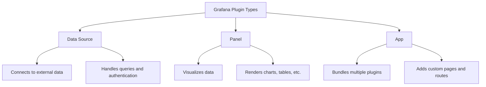

# How to Build Grafana Custom Plugins

Author: [nawazdhandala](https://www.github.com/nawazdhandala)

Tags: Grafana, Plugins, Visualization, React, Observability

Description: Develop custom Grafana plugins including data sources, panels, and apps using the plugin SDK and React for tailored visualizations.

---

Grafana ships with a solid collection of built-in plugins, but sometimes your monitoring needs require something more specialized. Whether you need to connect to a proprietary data source, build a unique visualization, or create an integrated application experience, building a custom plugin gives you full control.

This guide walks through the three main plugin types and shows you how to build each one from scratch.

## Plugin Types Overview

Grafana supports three distinct plugin types, each serving a different purpose:



| Type | Purpose | Use Case |
|------|---------|----------|
| Data Source | Connect to external APIs and databases | Custom metrics backend, internal APIs |
| Panel | Visualize data in custom ways | Specialized charts, business-specific displays |
| App | Bundle plugins with custom UI pages | Complete monitoring solutions |

## Setting Up Your Development Environment

Before building any plugin, you need the Grafana plugin tools installed.

```bash
# Install the Grafana create-plugin CLI globally
npm install -g @grafana/create-plugin

# Create a new plugin project
npx @grafana/create-plugin@latest

# The wizard will ask for:
# - Plugin type (datasource, panel, or app)
# - Plugin name and organization
# - Whether to include backend components
```

You also need a running Grafana instance for testing. The easiest approach is Docker:

```bash
# Run Grafana with your plugin directory mounted
docker run -d \
  -p 3000:3000 \
  -v "$(pwd)/dist:/var/lib/grafana/plugins/my-plugin" \
  -e "GF_PLUGINS_ALLOW_LOADING_UNSIGNED_PLUGINS=myorg-myplugin-datasource" \
  grafana/grafana:latest
```

## Building a Data Source Plugin

Data source plugins let Grafana query external systems. Here is the core structure for a simple HTTP-based data source.

### Plugin Configuration (plugin.json)

This metadata file tells Grafana about your plugin capabilities:

```json
{
  "$schema": "https://raw.githubusercontent.com/grafana/grafana/main/docs/sources/developers/plugins/plugin.schema.json",
  "type": "datasource",
  "name": "My Custom API",
  "id": "myorg-customapi-datasource",
  "metrics": true,
  "annotations": true,
  "info": {
    "description": "Connect to My Custom API",
    "author": {
      "name": "My Organization"
    },
    "version": "1.0.0"
  },
  "dependencies": {
    "grafanaDependency": ">=10.0.0"
  }
}
```

### Data Source Class (datasource.ts)

The data source class handles all communication with your external API:

```typescript
// src/datasource.ts

import {
  DataSourceInstanceSettings,
  CoreApp,
  DataQueryRequest,
  DataQueryResponse,
  DataSourceApi,
  MutableDataFrame,
  FieldType,
} from '@grafana/data';
import { getBackendSrv, getTemplateSrv } from '@grafana/runtime';
import { MyQuery, MyDataSourceOptions } from './types';

/**
 * MyDataSource handles queries to the custom API.
 * It extends DataSourceApi which provides the standard interface
 * that Grafana expects from all data sources.
 */
export class MyDataSource extends DataSourceApi<MyQuery, MyDataSourceOptions> {
  baseUrl: string;

  constructor(instanceSettings: DataSourceInstanceSettings<MyDataSourceOptions>) {
    super(instanceSettings);
    // Store the configured URL for API calls
    this.baseUrl = instanceSettings.url || '';
  }

  /**
   * query() is called when Grafana needs data for a panel.
   * It receives the query configuration and time range,
   * and must return a DataQueryResponse with DataFrames.
   */
  async query(options: DataQueryRequest<MyQuery>): Promise<DataQueryResponse> {
    // Process each query target in parallel
    const promises = options.targets.map(async (target) => {
      // Replace Grafana variables in the query (like $__interval)
      const query = getTemplateSrv().replace(target.queryText, options.scopedVars);

      // Fetch data from the external API
      const response = await this.doRequest(query, options.range);

      // Transform the response into a Grafana DataFrame
      return this.transformResponse(response, target.refId);
    });

    const data = await Promise.all(promises);
    return { data };
  }

  /**
   * Makes the actual HTTP request to the backend API.
   * Uses Grafana's backendSrv which handles auth and proxying.
   */
  private async doRequest(query: string, range: any): Promise<any> {
    const response = await getBackendSrv().fetch({
      method: 'GET',
      url: `${this.baseUrl}/api/metrics`,
      params: {
        query: query,
        from: range.from.valueOf(),
        to: range.to.valueOf(),
      },
    }).toPromise();

    return response?.data;
  }

  /**
   * Transforms raw API response into Grafana's DataFrame format.
   * DataFrames are the standard data structure used throughout Grafana.
   */
  private transformResponse(response: any, refId: string): MutableDataFrame {
    const frame = new MutableDataFrame({
      refId: refId,
      fields: [
        // Time field for the X axis
        { name: 'time', type: FieldType.time },
        // Value field for the Y axis
        { name: 'value', type: FieldType.number },
      ],
    });

    // Add each data point to the frame
    if (response?.datapoints) {
      for (const point of response.datapoints) {
        frame.appendRow([point.timestamp, point.value]);
      }
    }

    return frame;
  }

  /**
   * testDatasource() is called when users click "Save & Test"
   * in the data source configuration. Use it to verify connectivity.
   */
  async testDatasource(): Promise<any> {
    try {
      await getBackendSrv().fetch({
        method: 'GET',
        url: `${this.baseUrl}/api/health`,
      }).toPromise();

      return {
        status: 'success',
        message: 'Connection successful',
      };
    } catch (error: any) {
      return {
        status: 'error',
        message: `Connection failed: ${error.message}`,
      };
    }
  }

  /**
   * Provides default query values for new panels.
   */
  getDefaultQuery(app: CoreApp): Partial<MyQuery> {
    return {
      queryText: 'SELECT value FROM metrics',
    };
  }
}
```

### Configuration Editor (ConfigEditor.tsx)

The config editor lets users enter connection settings:

```typescript
// src/components/ConfigEditor.tsx

import React, { ChangeEvent } from 'react';
import { InlineField, Input, SecretInput } from '@grafana/ui';
import { DataSourcePluginOptionsEditorProps } from '@grafana/data';
import { MyDataSourceOptions, MySecureJsonData } from '../types';

// Props type comes from Grafana's plugin system
type Props = DataSourcePluginOptionsEditorProps<MyDataSourceOptions, MySecureJsonData>;

/**
 * ConfigEditor renders the data source configuration form.
 * Users see this when adding or editing the data source.
 */
export function ConfigEditor(props: Props) {
  const { onOptionsChange, options } = props;
  const { jsonData, secureJsonFields, secureJsonData } = options;

  // Handler for regular text fields
  const onURLChange = (event: ChangeEvent<HTMLInputElement>) => {
    onOptionsChange({
      ...options,
      url: event.target.value,
    });
  };

  // Handler for custom JSON data fields
  const onAPIKeyChange = (event: ChangeEvent<HTMLInputElement>) => {
    onOptionsChange({
      ...options,
      secureJsonData: {
        ...secureJsonData,
        apiKey: event.target.value,
      },
    });
  };

  // Handler for resetting secure fields
  const onResetAPIKey = () => {
    onOptionsChange({
      ...options,
      secureJsonFields: {
        ...secureJsonFields,
        apiKey: false,
      },
      secureJsonData: {
        ...secureJsonData,
        apiKey: '',
      },
    });
  };

  return (
    <>
      {/* API URL configuration */}
      <InlineField label="API URL" labelWidth={14} tooltip="Base URL of your API">
        <Input
          value={options.url || ''}
          onChange={onURLChange}
          placeholder="https://api.example.com"
          width={40}
        />
      </InlineField>

      {/* API Key - uses SecretInput to hide the value after saving */}
      <InlineField label="API Key" labelWidth={14} tooltip="Authentication key">
        <SecretInput
          isConfigured={secureJsonFields?.apiKey}
          value={secureJsonData?.apiKey || ''}
          onChange={onAPIKeyChange}
          onReset={onResetAPIKey}
          width={40}
        />
      </InlineField>
    </>
  );
}
```

## Building a Panel Plugin

Panel plugins render visualizations. Here is a streamlined example of a custom gauge panel.

### Panel Component (SimplePanel.tsx)

```typescript
// src/SimplePanel.tsx

import React, { useMemo } from 'react';
import { PanelProps, getFieldDisplayValues } from '@grafana/data';
import { useTheme2 } from '@grafana/ui';
import { css } from '@emotion/css';
import { PanelOptions } from './types';

type Props = PanelProps<PanelOptions>;

/**
 * GaugePanel renders a circular gauge visualization.
 * It receives data from the configured data source
 * and options from the panel editor.
 */
export const SimplePanel: React.FC<Props> = ({
  options,
  data,
  width,
  height,
  fieldConfig,
  replaceVariables,
}) => {
  const theme = useTheme2();

  // Extract display values from the data frame
  // This handles field overrides, thresholds, and unit formatting
  const displayValues = useMemo(() => {
    return getFieldDisplayValues({
      fieldConfig,
      data: data.series,
      theme,
      replaceVariables,
      reduceOptions: {
        calcs: ['lastNotNull'],
      },
    });
  }, [data, fieldConfig, theme, replaceVariables]);

  // Get the first value for display
  const displayValue = displayValues[0]?.display;
  const value = displayValue?.numeric ?? 0;
  const text = displayValue?.text ?? 'N/A';
  const color = displayValue?.color ?? theme.colors.primary.main;

  // Calculate gauge arc based on min/max from field config
  const min = fieldConfig.defaults.min ?? 0;
  const max = fieldConfig.defaults.max ?? 100;
  const percentage = Math.min(Math.max((value - min) / (max - min), 0), 1);
  const angle = percentage * 180;

  // SVG dimensions for the gauge
  const size = Math.min(width, height);
  const strokeWidth = size * 0.1;
  const radius = (size - strokeWidth) / 2;
  const centerX = width / 2;
  const centerY = height / 2 + radius * 0.2;

  // Calculate arc path for the filled portion
  const describeArc = (endAngle: number) => {
    const startAngle = 180;
    const start = polarToCartesian(centerX, centerY, radius, startAngle);
    const end = polarToCartesian(centerX, centerY, radius, startAngle + endAngle);
    const largeArcFlag = endAngle > 180 ? 1 : 0;
    return `M ${start.x} ${start.y} A ${radius} ${radius} 0 ${largeArcFlag} 1 ${end.x} ${end.y}`;
  };

  return (
    <div
      className={css`
        display: flex;
        flex-direction: column;
        align-items: center;
        justify-content: center;
        width: 100%;
        height: 100%;
      `}
    >
      <svg width={width} height={height}>
        {/* Background arc - shows the full gauge range */}
        <path
          d={describeArc(180)}
          fill="none"
          stroke={theme.colors.background.secondary}
          strokeWidth={strokeWidth}
          strokeLinecap="round"
        />
        {/* Filled arc - shows the current value */}
        <path
          d={describeArc(angle)}
          fill="none"
          stroke={color}
          strokeWidth={strokeWidth}
          strokeLinecap="round"
        />
        {/* Value text in the center */}
        <text
          x={centerX}
          y={centerY}
          textAnchor="middle"
          fontSize={size * 0.15}
          fill={theme.colors.text.primary}
        >
          {text}
        </text>
        {/* Optional title below the value */}
        {options.showTitle && (
          <text
            x={centerX}
            y={centerY + size * 0.12}
            textAnchor="middle"
            fontSize={size * 0.08}
            fill={theme.colors.text.secondary}
          >
            {options.title}
          </text>
        )}
      </svg>
    </div>
  );
};

// Helper function to convert polar coordinates to cartesian
function polarToCartesian(cx: number, cy: number, r: number, angle: number) {
  const rad = (angle - 90) * (Math.PI / 180);
  return {
    x: cx + r * Math.cos(rad),
    y: cy + r * Math.sin(rad),
  };
}
```

## Building an App Plugin

App plugins bundle multiple components with custom pages. Here is the basic structure.

### App Configuration (plugin.json)

```json
{
  "type": "app",
  "name": "My Monitoring Suite",
  "id": "myorg-monitoring-app",
  "info": {
    "description": "Complete monitoring solution",
    "version": "1.0.0"
  },
  "includes": [
    {
      "type": "page",
      "name": "Overview",
      "path": "/a/myorg-monitoring-app/overview",
      "role": "Viewer",
      "addToNav": true,
      "defaultNav": true
    },
    {
      "type": "page",
      "name": "Configuration",
      "path": "/a/myorg-monitoring-app/config",
      "role": "Admin",
      "addToNav": true
    },
    {
      "type": "datasource",
      "name": "My Custom API"
    }
  ]
}
```

### App Routes (module.tsx)

```typescript
// src/module.tsx

import { AppPlugin, AppRootProps } from '@grafana/data';
import { Routes, Route } from 'react-router-dom';
import { OverviewPage } from './pages/Overview';
import { ConfigPage } from './pages/Config';
import { AppConfig } from './components/AppConfig';

/**
 * AppRoot serves as the router for all app pages.
 * It uses React Router to handle navigation between views.
 */
function AppRoot(props: AppRootProps) {
  return (
    <Routes>
      {/* Default overview page */}
      <Route path="overview" element={<OverviewPage />} />
      {/* Admin configuration page */}
      <Route path="config" element={<ConfigPage />} />
      {/* Fallback to overview */}
      <Route path="*" element={<OverviewPage />} />
    </Routes>
  );
}

// Register the app plugin with its configuration component
export const plugin = new AppPlugin<{}>()
  .setRootPage(AppRoot)
  .addConfigPage({
    title: 'Configuration',
    icon: 'cog',
    body: AppConfig,
    id: 'configuration',
  });
```

## Building and Testing

Once your plugin code is ready, build and test it:

```bash
# Development build with hot reload
npm run dev

# Production build
npm run build

# Run tests
npm run test

# Lint your code
npm run lint
```

For local testing, ensure your Grafana instance allows unsigned plugins:

```ini
# In grafana.ini or via environment variable
[plugins]
allow_loading_unsigned_plugins = myorg-myplugin-datasource
```

## Publishing Your Plugin

When your plugin is ready for distribution, sign it using Grafana's signing service:

```bash
# Install the signing tool
npm install -g @grafana/sign-plugin

# Sign your plugin (requires Grafana Cloud account)
npx @grafana/sign-plugin@latest --rootUrls https://your-grafana-instance.com
```

Submit to the Grafana plugin catalog by creating a pull request to the grafana-plugin-repository on GitHub with your plugin metadata.

## Summary

Building Grafana plugins opens up extensive customization possibilities. Data source plugins connect to any API or database. Panel plugins create unique visualizations. App plugins combine everything into cohesive monitoring solutions.

The key patterns across all plugin types include using Grafana's data structures (DataFrames), leveraging the @grafana/ui component library for consistent styling, and properly handling configuration through the standardized editor interfaces.

For monitoring your plugins in production and tracking the health of your Grafana infrastructure, consider using [OneUptime](https://oneuptime.com) to get comprehensive observability across your entire monitoring stack.
