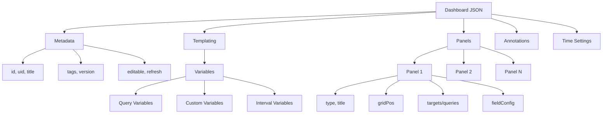
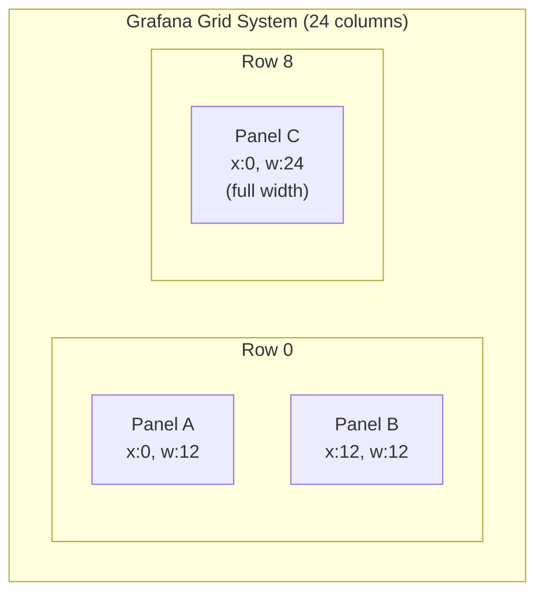
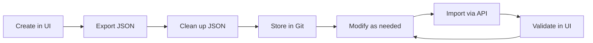

# How to Create Grafana Dashboard JSON Model

Author: [nawazdhandala](https://github.com/nawazdhandala)

Tags: Grafana, Observability, Dashboards, JSON

Description: Learn how to create, customize, and manage Grafana dashboards using the JSON model for version control, automation, and reproducibility.

---

Grafana dashboards are powerful visualization tools for monitoring and observability. While the UI makes it easy to click your way to a dashboard, the real power lies in understanding the underlying JSON model. Once you grasp the JSON structure, you can version control dashboards, automate deployments, share configurations across teams, and build dashboards programmatically.

This guide walks you through the Grafana dashboard JSON model from the ground up, with practical examples you can use today.

---

## Why Learn the JSON Model?

Before diving in, here's why understanding the JSON model matters:

- **Version Control**: Store dashboards in Git alongside your infrastructure code
- **Automation**: Generate dashboards programmatically for new services
- **Reproducibility**: Deploy identical dashboards across environments (dev, staging, prod)
- **Templating**: Create dashboard templates that teams can customize
- **Migration**: Move dashboards between Grafana instances reliably
- **Debugging**: Troubleshoot dashboard issues by inspecting the raw configuration

---

## Dashboard JSON Structure Overview

Every Grafana dashboard is defined by a JSON document with a specific structure. Here's how the main components relate to each other:



---

## The Minimal Dashboard

Let's start with the simplest possible dashboard JSON. This creates an empty dashboard with just a title:

```json
{
  "id": null,
  "uid": null,
  "title": "My First Dashboard",
  "tags": [],
  "timezone": "browser",
  "schemaVersion": 39,
  "version": 0,
  "panels": []
}
```

Key fields explained:

| Field | Purpose |
|-------|---------|
| `id` | Numeric ID assigned by Grafana (set to `null` for new dashboards) |
| `uid` | Unique string identifier (set to `null` to auto-generate, or provide your own) |
| `title` | Dashboard name displayed in the UI |
| `tags` | Array of strings for organization and filtering |
| `timezone` | Time zone for the dashboard (`browser`, `utc`, or specific zone) |
| `schemaVersion` | JSON schema version (use latest, currently 39) |
| `version` | Dashboard revision number (Grafana increments this on save) |
| `panels` | Array of panel definitions |

---

## Adding Your First Panel

Panels are where data visualization happens. Each panel has a type (graph, gauge, table, etc.), position, and one or more queries. Here's a time series panel that displays CPU usage:

```json
{
  "id": null,
  "uid": null,
  "title": "Server Metrics Dashboard",
  "tags": ["infrastructure", "cpu"],
  "timezone": "browser",
  "schemaVersion": 39,
  "version": 0,
  "panels": [
    {
      "id": 1,
      "type": "timeseries",
      "title": "CPU Usage",
      "gridPos": {
        "x": 0,
        "y": 0,
        "w": 12,
        "h": 8
      },
      "datasource": {
        "type": "prometheus",
        "uid": "prometheus"
      },
      "targets": [
        {
          "refId": "A",
          "expr": "100 - (avg(rate(node_cpu_seconds_total{mode=\"idle\"}[5m])) * 100)",
          "legendFormat": "CPU Usage %"
        }
      ],
      "fieldConfig": {
        "defaults": {
          "unit": "percent",
          "min": 0,
          "max": 100,
          "thresholds": {
            "mode": "absolute",
            "steps": [
              { "value": null, "color": "green" },
              { "value": 70, "color": "yellow" },
              { "value": 90, "color": "red" }
            ]
          }
        },
        "overrides": []
      },
      "options": {
        "legend": {
          "displayMode": "list",
          "placement": "bottom"
        },
        "tooltip": {
          "mode": "single"
        }
      }
    }
  ]
}
```

### Understanding Panel Positioning

The `gridPos` object controls where and how large the panel appears. Grafana uses a 24-column grid system:



- `x`: Horizontal position (0-23)
- `y`: Vertical position (row number, each row is 1 unit tall)
- `w`: Width in columns (1-24)
- `h`: Height in rows (typically 6-10 for graphs)

---

## Panel Types Reference

Grafana supports many panel types. Here are the most common ones with their `type` values:

| Panel Type | `type` Value | Best For |
|------------|--------------|----------|
| Time Series | `timeseries` | Metrics over time |
| Stat | `stat` | Single value with optional sparkline |
| Gauge | `gauge` | Current value against thresholds |
| Bar Gauge | `bargauge` | Horizontal/vertical bar comparisons |
| Table | `table` | Tabular data display |
| Pie Chart | `piechart` | Distribution visualization |
| Heatmap | `heatmap` | Density over time |
| Logs | `logs` | Log stream display |
| Alert List | `alertlist` | Active alerts summary |
| Text | `text` | Markdown documentation |

---

## Adding Variables for Dynamic Dashboards

Variables make dashboards interactive and reusable. Users can select values from dropdowns to filter data. Here's how to add a variable that lets users select a server:

```json
{
  "id": null,
  "uid": null,
  "title": "Server Metrics Dashboard",
  "tags": ["infrastructure"],
  "timezone": "browser",
  "schemaVersion": 39,
  "version": 0,
  "templating": {
    "list": [
      {
        "name": "server",
        "type": "query",
        "datasource": {
          "type": "prometheus",
          "uid": "prometheus"
        },
        "query": "label_values(node_cpu_seconds_total, instance)",
        "refresh": 2,
        "includeAll": true,
        "allValue": ".*",
        "multi": true,
        "current": {},
        "options": [],
        "label": "Server"
      },
      {
        "name": "interval",
        "type": "interval",
        "query": "1m,5m,15m,30m,1h",
        "current": {
          "text": "5m",
          "value": "5m"
        },
        "label": "Interval"
      }
    ]
  },
  "panels": [
    {
      "id": 1,
      "type": "timeseries",
      "title": "CPU Usage - $server",
      "gridPos": { "x": 0, "y": 0, "w": 24, "h": 8 },
      "datasource": {
        "type": "prometheus",
        "uid": "prometheus"
      },
      "targets": [
        {
          "refId": "A",
          "expr": "100 - (avg(rate(node_cpu_seconds_total{mode=\"idle\", instance=~\"$server\"}[$interval])) by (instance) * 100)",
          "legendFormat": "{{instance}}"
        }
      ],
      "fieldConfig": {
        "defaults": {
          "unit": "percent"
        },
        "overrides": []
      }
    }
  ]
}
```

### Variable Types

| Type | `type` Value | Purpose |
|------|--------------|---------|
| Query | `query` | Values from data source query |
| Custom | `custom` | Static list of options |
| Interval | `interval` | Time interval selection |
| Data source | `datasource` | Select between data sources |
| Text box | `textbox` | Free-form text input |
| Constant | `constant` | Hidden fixed value |

---

## Building a Complete Production Dashboard

Here's a comprehensive example that combines multiple panels, variables, and annotations to create a production-ready service monitoring dashboard:

```json
{
  "id": null,
  "uid": "service-health-dashboard",
  "title": "Service Health Dashboard",
  "description": "Monitor service health, latency, and error rates",
  "tags": ["production", "sre", "services"],
  "timezone": "browser",
  "schemaVersion": 39,
  "version": 0,
  "editable": true,
  "refresh": "30s",
  "time": {
    "from": "now-1h",
    "to": "now"
  },
  "timepicker": {
    "refresh_intervals": ["5s", "10s", "30s", "1m", "5m"],
    "time_options": ["5m", "15m", "1h", "6h", "12h", "24h", "7d"]
  },
  "templating": {
    "list": [
      {
        "name": "service",
        "type": "query",
        "datasource": { "type": "prometheus", "uid": "prometheus" },
        "query": "label_values(http_requests_total, service)",
        "refresh": 2,
        "includeAll": false,
        "multi": false,
        "label": "Service"
      },
      {
        "name": "environment",
        "type": "custom",
        "query": "production,staging,development",
        "current": { "text": "production", "value": "production" },
        "label": "Environment"
      }
    ]
  },
  "annotations": {
    "list": [
      {
        "name": "Deployments",
        "datasource": { "type": "prometheus", "uid": "prometheus" },
        "enable": true,
        "iconColor": "blue",
        "expr": "changes(deployment_timestamp{service=\"$service\"}[1m]) > 0"
      }
    ]
  },
  "panels": [
    {
      "id": 1,
      "type": "row",
      "title": "Overview",
      "gridPos": { "x": 0, "y": 0, "w": 24, "h": 1 },
      "collapsed": false
    },
    {
      "id": 2,
      "type": "stat",
      "title": "Request Rate",
      "gridPos": { "x": 0, "y": 1, "w": 6, "h": 4 },
      "datasource": { "type": "prometheus", "uid": "prometheus" },
      "targets": [
        {
          "refId": "A",
          "expr": "sum(rate(http_requests_total{service=\"$service\", environment=\"$environment\"}[5m]))",
          "legendFormat": "req/s"
        }
      ],
      "fieldConfig": {
        "defaults": {
          "unit": "reqps",
          "color": { "mode": "thresholds" },
          "thresholds": {
            "mode": "absolute",
            "steps": [
              { "value": null, "color": "blue" }
            ]
          }
        },
        "overrides": []
      },
      "options": {
        "reduceOptions": {
          "calcs": ["lastNotNull"]
        },
        "colorMode": "value",
        "graphMode": "area"
      }
    },
    {
      "id": 3,
      "type": "stat",
      "title": "Error Rate",
      "gridPos": { "x": 6, "y": 1, "w": 6, "h": 4 },
      "datasource": { "type": "prometheus", "uid": "prometheus" },
      "targets": [
        {
          "refId": "A",
          "expr": "sum(rate(http_requests_total{service=\"$service\", environment=\"$environment\", status=~\"5..\"}[5m])) / sum(rate(http_requests_total{service=\"$service\", environment=\"$environment\"}[5m])) * 100",
          "legendFormat": "errors"
        }
      ],
      "fieldConfig": {
        "defaults": {
          "unit": "percent",
          "decimals": 2,
          "thresholds": {
            "mode": "absolute",
            "steps": [
              { "value": null, "color": "green" },
              { "value": 1, "color": "yellow" },
              { "value": 5, "color": "red" }
            ]
          }
        },
        "overrides": []
      },
      "options": {
        "reduceOptions": {
          "calcs": ["lastNotNull"]
        },
        "colorMode": "value",
        "graphMode": "area"
      }
    },
    {
      "id": 4,
      "type": "gauge",
      "title": "P99 Latency",
      "gridPos": { "x": 12, "y": 1, "w": 6, "h": 4 },
      "datasource": { "type": "prometheus", "uid": "prometheus" },
      "targets": [
        {
          "refId": "A",
          "expr": "histogram_quantile(0.99, sum(rate(http_request_duration_seconds_bucket{service=\"$service\", environment=\"$environment\"}[5m])) by (le))",
          "legendFormat": "p99"
        }
      ],
      "fieldConfig": {
        "defaults": {
          "unit": "s",
          "min": 0,
          "max": 2,
          "thresholds": {
            "mode": "absolute",
            "steps": [
              { "value": null, "color": "green" },
              { "value": 0.5, "color": "yellow" },
              { "value": 1, "color": "red" }
            ]
          }
        },
        "overrides": []
      }
    },
    {
      "id": 5,
      "type": "stat",
      "title": "Uptime",
      "gridPos": { "x": 18, "y": 1, "w": 6, "h": 4 },
      "datasource": { "type": "prometheus", "uid": "prometheus" },
      "targets": [
        {
          "refId": "A",
          "expr": "avg_over_time(up{service=\"$service\", environment=\"$environment\"}[24h]) * 100",
          "legendFormat": "uptime"
        }
      ],
      "fieldConfig": {
        "defaults": {
          "unit": "percent",
          "decimals": 2,
          "thresholds": {
            "mode": "absolute",
            "steps": [
              { "value": null, "color": "red" },
              { "value": 99, "color": "yellow" },
              { "value": 99.9, "color": "green" }
            ]
          }
        },
        "overrides": []
      }
    },
    {
      "id": 6,
      "type": "row",
      "title": "Detailed Metrics",
      "gridPos": { "x": 0, "y": 5, "w": 24, "h": 1 },
      "collapsed": false
    },
    {
      "id": 7,
      "type": "timeseries",
      "title": "Request Rate by Status Code",
      "gridPos": { "x": 0, "y": 6, "w": 12, "h": 8 },
      "datasource": { "type": "prometheus", "uid": "prometheus" },
      "targets": [
        {
          "refId": "A",
          "expr": "sum(rate(http_requests_total{service=\"$service\", environment=\"$environment\"}[5m])) by (status)",
          "legendFormat": "{{status}}"
        }
      ],
      "fieldConfig": {
        "defaults": {
          "unit": "reqps",
          "custom": {
            "drawStyle": "line",
            "lineWidth": 2,
            "fillOpacity": 10,
            "gradientMode": "none",
            "spanNulls": false,
            "showPoints": "auto",
            "pointSize": 5
          }
        },
        "overrides": [
          {
            "matcher": { "id": "byRegexp", "options": "5.." },
            "properties": [
              { "id": "color", "value": { "fixedColor": "red", "mode": "fixed" } }
            ]
          },
          {
            "matcher": { "id": "byRegexp", "options": "4.." },
            "properties": [
              { "id": "color", "value": { "fixedColor": "yellow", "mode": "fixed" } }
            ]
          },
          {
            "matcher": { "id": "byRegexp", "options": "2.." },
            "properties": [
              { "id": "color", "value": { "fixedColor": "green", "mode": "fixed" } }
            ]
          }
        ]
      },
      "options": {
        "legend": { "displayMode": "table", "placement": "right" },
        "tooltip": { "mode": "multi" }
      }
    },
    {
      "id": 8,
      "type": "timeseries",
      "title": "Latency Percentiles",
      "gridPos": { "x": 12, "y": 6, "w": 12, "h": 8 },
      "datasource": { "type": "prometheus", "uid": "prometheus" },
      "targets": [
        {
          "refId": "A",
          "expr": "histogram_quantile(0.50, sum(rate(http_request_duration_seconds_bucket{service=\"$service\", environment=\"$environment\"}[5m])) by (le))",
          "legendFormat": "p50"
        },
        {
          "refId": "B",
          "expr": "histogram_quantile(0.90, sum(rate(http_request_duration_seconds_bucket{service=\"$service\", environment=\"$environment\"}[5m])) by (le))",
          "legendFormat": "p90"
        },
        {
          "refId": "C",
          "expr": "histogram_quantile(0.99, sum(rate(http_request_duration_seconds_bucket{service=\"$service\", environment=\"$environment\"}[5m])) by (le))",
          "legendFormat": "p99"
        }
      ],
      "fieldConfig": {
        "defaults": {
          "unit": "s",
          "custom": {
            "drawStyle": "line",
            "lineWidth": 2,
            "fillOpacity": 0
          }
        },
        "overrides": []
      },
      "options": {
        "legend": { "displayMode": "list", "placement": "bottom" },
        "tooltip": { "mode": "multi" }
      }
    }
  ]
}
```

---

## Workflow: Export, Modify, Import

Here's the typical workflow for managing dashboards as code:



### Exporting a Dashboard

To export an existing dashboard:

1. Open the dashboard in Grafana
2. Click the gear icon (Dashboard settings)
3. Click "JSON Model" in the left sidebar
4. Copy the JSON or click "Save to file"

### Cleaning Up Exported JSON

When you export a dashboard, Grafana includes some fields you should remove or reset for version control:

```json
{
  "id": null,
  "uid": "your-unique-id",
  "version": 0,
  "iteration": null
}
```

Remove or reset these fields:
- `id` - Set to `null` (Grafana assigns on import)
- `version` - Set to `0` (Grafana manages this)
- `iteration` - Remove entirely

### Importing via the API

Use the Grafana HTTP API to import dashboards programmatically. This curl command imports a dashboard JSON file:

```bash
curl -X POST \
  -H "Authorization: Bearer YOUR_API_KEY" \
  -H "Content-Type: application/json" \
  -d '{
    "dashboard": '"$(cat dashboard.json)"',
    "overwrite": true,
    "message": "Updated via CI/CD pipeline"
  }' \
  "https://your-grafana-instance/api/dashboards/db"
```

---

## Dashboard Provisioning

For production environments, use Grafana's provisioning feature to automatically load dashboards from files. Create a provisioning config at `/etc/grafana/provisioning/dashboards/default.yaml`:

```yaml
apiVersion: 1

providers:
  - name: 'default'
    orgId: 1
    folder: 'Provisioned'
    folderUid: 'provisioned'
    type: file
    disableDeletion: false
    updateIntervalSeconds: 30
    allowUiUpdates: true
    options:
      path: /var/lib/grafana/dashboards
```

Then place your dashboard JSON files in `/var/lib/grafana/dashboards/`. Grafana will automatically load and update them.

---

## Common Patterns and Tips

### Consistent Panel IDs

Always use sequential, unique panel IDs within a dashboard. If you duplicate panels, update the IDs to avoid conflicts:

```json
{
  "panels": [
    { "id": 1, "title": "Panel A" },
    { "id": 2, "title": "Panel B" },
    { "id": 3, "title": "Panel C" }
  ]
}
```

### Using Rows for Organization

Row panels help organize dashboards into collapsible sections:

```json
{
  "id": 10,
  "type": "row",
  "title": "Database Metrics",
  "gridPos": { "x": 0, "y": 14, "w": 24, "h": 1 },
  "collapsed": true,
  "panels": [
    {
      "id": 11,
      "type": "timeseries",
      "title": "Query Duration",
      "gridPos": { "x": 0, "y": 15, "w": 12, "h": 8 }
    }
  ]
}
```

### Threshold Configuration

Color-coded thresholds provide instant visual feedback. Configure them in `fieldConfig.defaults.thresholds`:

```json
{
  "thresholds": {
    "mode": "absolute",
    "steps": [
      { "value": null, "color": "green" },
      { "value": 50, "color": "yellow" },
      { "value": 80, "color": "orange" },
      { "value": 95, "color": "red" }
    ]
  }
}
```

The `value: null` step sets the base color. Each subsequent step applies when the value exceeds the threshold.

---

## Debugging Tips

When your dashboard JSON does not work as expected:

1. **Validate JSON syntax** - Use a JSON linter to catch syntax errors
2. **Check schemaVersion** - Ensure it matches your Grafana version
3. **Verify datasource UIDs** - UIDs must match existing data sources
4. **Inspect browser console** - Grafana logs detailed errors there
5. **Compare with working dashboard** - Export a working dashboard and diff

---

## Final Thoughts

The Grafana dashboard JSON model is your key to treating dashboards as code. Start by exporting existing dashboards, study their structure, and gradually build familiarity with the schema. Once comfortable, you can:

- Template dashboards for new services automatically
- Version control all your monitoring configurations
- Deploy consistent dashboards across environments
- Build dashboards programmatically from service metadata

The investment in learning the JSON model pays dividends in maintainability, consistency, and automation capabilities.

---

**Related Reading:**

- [Logs, Metrics and Traces: Turning Three Noisy Streams into One Story](https://oneuptime.com/blog/post/2025-08-20-three-pillars-of-observability-logs-metrics-traces/view)
- [What is OpenTelemetry Collector and Why Use One](https://oneuptime.com/blog/post/2025-09-18-what-is-opentelemetry-collector-and-why-use-one/view)
- [SRE Metrics to Track](https://oneuptime.com/blog/post/2025-11-28-sre-metrics-to-track/view)
