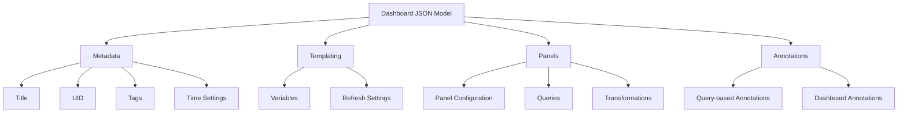
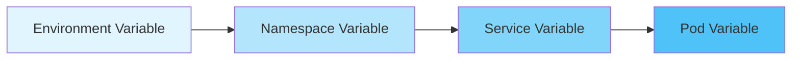
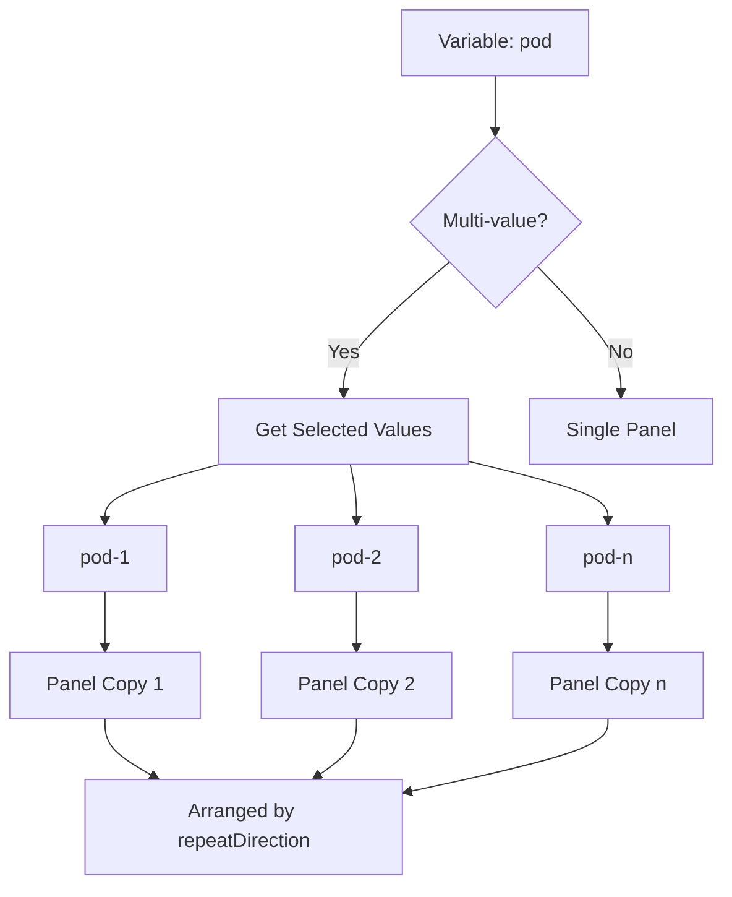
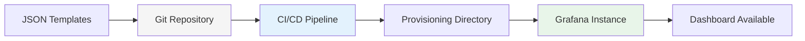

# How to Build Grafana Dashboard Templates

Author: [nawazdhandala](https://github.com/nawazdhandala)

Tags: Grafana, Dashboard Templates, Reusability, JSON

Description: Learn to implement Grafana dashboard templates with JSON model, variables, and templating for reusable and maintainable dashboards.

---

Building dashboards in Grafana can become repetitive when you need similar visualizations across multiple environments, teams, or services. Dashboard templates solve this problem by creating reusable, parameterized dashboards that adapt to different contexts. In this guide, we will explore how to build effective Grafana dashboard templates using the JSON model, variables, repeat panels, and template functions.

## Understanding Grafana Dashboard Architecture

Before diving into templates, let us understand how Grafana dashboards are structured internally.



Every Grafana dashboard is stored as a JSON document. This JSON model contains all the configuration needed to render the dashboard, making it perfect for version control and templating.

## The JSON Model Foundation

The JSON model is the backbone of any Grafana dashboard. Here is the basic structure:

```json
{
  "id": null,
  "uid": "template-dashboard-001",
  "title": "Service Metrics - ${service_name}",
  "tags": ["template", "metrics"],
  "timezone": "browser",
  "schemaVersion": 39,
  "version": 1,
  "refresh": "30s",
  "time": {
    "from": "now-6h",
    "to": "now"
  },
  "templating": {
    "list": []
  },
  "panels": [],
  "annotations": {
    "list": []
  }
}
```

Key fields to understand:

- **uid**: A unique identifier for the dashboard. Keep this consistent across deployments for linking purposes.
- **schemaVersion**: Grafana's internal version for the dashboard format. Use the latest version your Grafana installation supports.
- **templating**: Where all your variables are defined.
- **panels**: Array containing all visualization panels.

## Working with Variables

Variables are the core feature that makes dashboards reusable. They allow users to dynamically change what data is displayed without editing the dashboard.

### Query Variable

Query variables populate their options from a data source query:

```json
{
  "templating": {
    "list": [
      {
        "name": "environment",
        "type": "query",
        "datasource": {
          "type": "prometheus",
          "uid": "${DS_PROMETHEUS}"
        },
        "query": "label_values(up, environment)",
        "refresh": 2,
        "includeAll": true,
        "multi": true,
        "current": {
          "text": "All",
          "value": "$__all"
        },
        "sort": 1
      }
    ]
  }
}
```

The `refresh` values are:
- `0`: Never refresh
- `1`: On dashboard load
- `2`: On time range change

### Custom Variable

For predefined options, use custom variables:

```json
{
  "name": "log_level",
  "type": "custom",
  "query": "debug,info,warning,error,critical",
  "current": {
    "text": "error",
    "value": "error"
  },
  "options": [
    {"text": "debug", "value": "debug", "selected": false},
    {"text": "info", "value": "info", "selected": false},
    {"text": "warning", "value": "warning", "selected": false},
    {"text": "error", "value": "error", "selected": true},
    {"text": "critical", "value": "critical", "selected": false}
  ]
}
```

### Interval Variable

Interval variables are useful for controlling aggregation windows:

```json
{
  "name": "interval",
  "type": "interval",
  "query": "1m,5m,15m,30m,1h,6h,12h,1d",
  "auto": true,
  "auto_min": "10s",
  "auto_count": 50,
  "current": {
    "text": "auto",
    "value": "$__auto_interval_interval"
  }
}
```

### Data Source Variable

Allow users to switch between data sources dynamically:

```json
{
  "name": "datasource",
  "type": "datasource",
  "query": "prometheus",
  "regex": "/.*prometheus.*/i",
  "current": {},
  "hide": 0
}
```

## Variable Dependencies and Chaining

Variables can depend on each other, creating cascading filters:



Here is how to implement chained variables:

```json
{
  "templating": {
    "list": [
      {
        "name": "environment",
        "type": "query",
        "query": "label_values(kube_namespace_labels, environment)"
      },
      {
        "name": "namespace",
        "type": "query",
        "query": "label_values(kube_namespace_labels{environment=\"$environment\"}, namespace)"
      },
      {
        "name": "service",
        "type": "query",
        "query": "label_values(kube_pod_labels{namespace=\"$namespace\"}, app)"
      }
    ]
  }
}
```

## Building Reusable Panel Templates

Panels are where your data visualizations live. Creating reusable panel configurations is essential for template efficiency.

### Basic Panel Structure

```json
{
  "id": 1,
  "type": "timeseries",
  "title": "Request Rate - ${service}",
  "gridPos": {
    "x": 0,
    "y": 0,
    "w": 12,
    "h": 8
  },
  "datasource": {
    "type": "prometheus",
    "uid": "${datasource}"
  },
  "targets": [
    {
      "expr": "rate(http_requests_total{service=\"$service\", environment=\"$environment\"}[5m])",
      "legendFormat": "{{method}} - {{status_code}}",
      "refId": "A"
    }
  ],
  "fieldConfig": {
    "defaults": {
      "color": {
        "mode": "palette-classic"
      },
      "custom": {
        "lineWidth": 2,
        "fillOpacity": 10,
        "showPoints": "never"
      },
      "unit": "reqps"
    }
  },
  "options": {
    "legend": {
      "displayMode": "table",
      "placement": "bottom"
    },
    "tooltip": {
      "mode": "multi"
    }
  }
}
```

### Repeat Panels

Repeat panels automatically create copies based on a variable. This is powerful for showing the same metric across multiple instances:

```json
{
  "id": 2,
  "type": "stat",
  "title": "CPU Usage - $pod",
  "repeat": "pod",
  "repeatDirection": "h",
  "maxPerRow": 4,
  "gridPos": {
    "x": 0,
    "y": 0,
    "w": 6,
    "h": 4
  },
  "targets": [
    {
      "expr": "avg(rate(container_cpu_usage_seconds_total{pod=\"$pod\"}[5m])) * 100",
      "refId": "A"
    }
  ],
  "fieldConfig": {
    "defaults": {
      "unit": "percent",
      "thresholds": {
        "mode": "absolute",
        "steps": [
          {"color": "green", "value": null},
          {"color": "yellow", "value": 70},
          {"color": "red", "value": 90}
        ]
      }
    }
  }
}
```

The repeat flow works like this:



### Repeat Rows

For more complex layouts, you can repeat entire rows:

```json
{
  "panels": [
    {
      "id": 10,
      "type": "row",
      "title": "Metrics for $service",
      "repeat": "service",
      "collapsed": false,
      "gridPos": {
        "x": 0,
        "y": 0,
        "w": 24,
        "h": 1
      },
      "panels": []
    },
    {
      "id": 11,
      "type": "timeseries",
      "title": "Request Rate",
      "gridPos": {
        "x": 0,
        "y": 1,
        "w": 12,
        "h": 8
      }
    },
    {
      "id": 12,
      "type": "timeseries",
      "title": "Error Rate",
      "gridPos": {
        "x": 12,
        "y": 1,
        "w": 12,
        "h": 8
      }
    }
  ]
}
```

## Template Functions and Advanced Formatting

Grafana provides several built-in functions for variable formatting.

### Variable Format Options

When referencing variables in queries, you can specify formats:

| Syntax | Description | Example Output |
|--------|-------------|----------------|
| `$variable` | Default format | `value` |
| `${variable}` | Explicit syntax | `value` |
| `${variable:csv}` | Comma-separated | `value1,value2` |
| `${variable:pipe}` | Pipe-separated | `value1\|value2` |
| `${variable:regex}` | Regex format | `(value1\|value2)` |
| `${variable:glob}` | Glob format | `{value1,value2}` |
| `${variable:json}` | JSON array | `["value1","value2"]` |
| `${variable:queryparam}` | URL query param | `var=value1&var=value2` |

### Practical Examples

For Prometheus queries with multiple values:

```promql
# Using regex format for label matching
http_requests_total{service=~"${service:regex}"}

# Using pipe format
http_requests_total{service=~"${service:pipe}"}
```

For InfluxDB:

```sql
SELECT mean("value") FROM "measurement"
WHERE "host" =~ /^${host:regex}$/
AND $timeFilter
GROUP BY time($interval)
```

## Complete Template Example

Here is a complete, production-ready dashboard template for monitoring a microservice:

```json
{
  "id": null,
  "uid": "microservice-template-v1",
  "title": "Microservice Dashboard - ${service}",
  "tags": ["template", "microservice", "sre"],
  "timezone": "browser",
  "schemaVersion": 39,
  "version": 1,
  "refresh": "30s",
  "time": {
    "from": "now-1h",
    "to": "now"
  },
  "templating": {
    "list": [
      {
        "name": "datasource",
        "type": "datasource",
        "query": "prometheus",
        "current": {},
        "hide": 0
      },
      {
        "name": "environment",
        "type": "query",
        "datasource": {"uid": "${datasource}"},
        "query": "label_values(up, environment)",
        "refresh": 2,
        "sort": 1
      },
      {
        "name": "service",
        "type": "query",
        "datasource": {"uid": "${datasource}"},
        "query": "label_values(http_requests_total{environment=\"$environment\"}, service)",
        "refresh": 2,
        "sort": 1
      },
      {
        "name": "instance",
        "type": "query",
        "datasource": {"uid": "${datasource}"},
        "query": "label_values(http_requests_total{service=\"$service\"}, instance)",
        "refresh": 2,
        "multi": true,
        "includeAll": true
      }
    ]
  },
  "panels": [
    {
      "id": 1,
      "type": "row",
      "title": "Overview",
      "gridPos": {"x": 0, "y": 0, "w": 24, "h": 1}
    },
    {
      "id": 2,
      "type": "stat",
      "title": "Request Rate",
      "gridPos": {"x": 0, "y": 1, "w": 6, "h": 4},
      "datasource": {"uid": "${datasource}"},
      "targets": [
        {
          "expr": "sum(rate(http_requests_total{service=\"$service\", environment=\"$environment\"}[5m]))",
          "refId": "A"
        }
      ],
      "fieldConfig": {
        "defaults": {
          "unit": "reqps",
          "color": {"mode": "thresholds"},
          "thresholds": {
            "steps": [
              {"color": "green", "value": null}
            ]
          }
        }
      }
    },
    {
      "id": 3,
      "type": "stat",
      "title": "Error Rate",
      "gridPos": {"x": 6, "y": 1, "w": 6, "h": 4},
      "datasource": {"uid": "${datasource}"},
      "targets": [
        {
          "expr": "sum(rate(http_requests_total{service=\"$service\", environment=\"$environment\", status_code=~\"5..\"}[5m])) / sum(rate(http_requests_total{service=\"$service\", environment=\"$environment\"}[5m])) * 100",
          "refId": "A"
        }
      ],
      "fieldConfig": {
        "defaults": {
          "unit": "percent",
          "color": {"mode": "thresholds"},
          "thresholds": {
            "steps": [
              {"color": "green", "value": null},
              {"color": "yellow", "value": 1},
              {"color": "red", "value": 5}
            ]
          }
        }
      }
    },
    {
      "id": 4,
      "type": "stat",
      "title": "P99 Latency",
      "gridPos": {"x": 12, "y": 1, "w": 6, "h": 4},
      "datasource": {"uid": "${datasource}"},
      "targets": [
        {
          "expr": "histogram_quantile(0.99, sum(rate(http_request_duration_seconds_bucket{service=\"$service\", environment=\"$environment\"}[5m])) by (le))",
          "refId": "A"
        }
      ],
      "fieldConfig": {
        "defaults": {
          "unit": "s",
          "color": {"mode": "thresholds"},
          "thresholds": {
            "steps": [
              {"color": "green", "value": null},
              {"color": "yellow", "value": 0.5},
              {"color": "red", "value": 1}
            ]
          }
        }
      }
    },
    {
      "id": 5,
      "type": "stat",
      "title": "Active Instances",
      "gridPos": {"x": 18, "y": 1, "w": 6, "h": 4},
      "datasource": {"uid": "${datasource}"},
      "targets": [
        {
          "expr": "count(up{service=\"$service\", environment=\"$environment\"} == 1)",
          "refId": "A"
        }
      ],
      "fieldConfig": {
        "defaults": {
          "color": {"mode": "thresholds"},
          "thresholds": {
            "steps": [
              {"color": "red", "value": null},
              {"color": "green", "value": 1}
            ]
          }
        }
      }
    },
    {
      "id": 6,
      "type": "row",
      "title": "Request Metrics",
      "gridPos": {"x": 0, "y": 5, "w": 24, "h": 1}
    },
    {
      "id": 7,
      "type": "timeseries",
      "title": "Request Rate by Status Code",
      "gridPos": {"x": 0, "y": 6, "w": 12, "h": 8},
      "datasource": {"uid": "${datasource}"},
      "targets": [
        {
          "expr": "sum by (status_code) (rate(http_requests_total{service=\"$service\", environment=\"$environment\", instance=~\"${instance:regex}\"}[5m]))",
          "legendFormat": "{{status_code}}",
          "refId": "A"
        }
      ],
      "fieldConfig": {
        "defaults": {
          "unit": "reqps",
          "custom": {
            "lineWidth": 2,
            "fillOpacity": 10
          }
        }
      }
    },
    {
      "id": 8,
      "type": "timeseries",
      "title": "Latency Distribution",
      "gridPos": {"x": 12, "y": 6, "w": 12, "h": 8},
      "datasource": {"uid": "${datasource}"},
      "targets": [
        {
          "expr": "histogram_quantile(0.50, sum(rate(http_request_duration_seconds_bucket{service=\"$service\", environment=\"$environment\"}[5m])) by (le))",
          "legendFormat": "p50",
          "refId": "A"
        },
        {
          "expr": "histogram_quantile(0.90, sum(rate(http_request_duration_seconds_bucket{service=\"$service\", environment=\"$environment\"}[5m])) by (le))",
          "legendFormat": "p90",
          "refId": "B"
        },
        {
          "expr": "histogram_quantile(0.99, sum(rate(http_request_duration_seconds_bucket{service=\"$service\", environment=\"$environment\"}[5m])) by (le))",
          "legendFormat": "p99",
          "refId": "C"
        }
      ],
      "fieldConfig": {
        "defaults": {
          "unit": "s",
          "custom": {
            "lineWidth": 2,
            "fillOpacity": 0
          }
        }
      }
    },
    {
      "id": 9,
      "type": "row",
      "title": "Instance Metrics - $instance",
      "repeat": "instance",
      "gridPos": {"x": 0, "y": 14, "w": 24, "h": 1}
    },
    {
      "id": 10,
      "type": "timeseries",
      "title": "CPU Usage",
      "gridPos": {"x": 0, "y": 15, "w": 8, "h": 6},
      "datasource": {"uid": "${datasource}"},
      "targets": [
        {
          "expr": "rate(process_cpu_seconds_total{instance=\"$instance\"}[5m]) * 100",
          "legendFormat": "CPU %",
          "refId": "A"
        }
      ],
      "fieldConfig": {
        "defaults": {
          "unit": "percent",
          "min": 0,
          "max": 100
        }
      }
    },
    {
      "id": 11,
      "type": "timeseries",
      "title": "Memory Usage",
      "gridPos": {"x": 8, "y": 15, "w": 8, "h": 6},
      "datasource": {"uid": "${datasource}"},
      "targets": [
        {
          "expr": "process_resident_memory_bytes{instance=\"$instance\"}",
          "legendFormat": "RSS",
          "refId": "A"
        }
      ],
      "fieldConfig": {
        "defaults": {
          "unit": "bytes"
        }
      }
    },
    {
      "id": 12,
      "type": "timeseries",
      "title": "Open File Descriptors",
      "gridPos": {"x": 16, "y": 15, "w": 8, "h": 6},
      "datasource": {"uid": "${datasource}"},
      "targets": [
        {
          "expr": "process_open_fds{instance=\"$instance\"}",
          "legendFormat": "Open FDs",
          "refId": "A"
        }
      ]
    }
  ],
  "annotations": {
    "list": [
      {
        "name": "Deployments",
        "datasource": {"uid": "${datasource}"},
        "enable": true,
        "expr": "changes(kube_deployment_status_observed_generation{deployment=\"$service\"}[2m]) > 0",
        "iconColor": "blue",
        "titleFormat": "Deployment",
        "textFormat": "Service $service was deployed"
      }
    ]
  }
}
```

## Provisioning Templates

To deploy templates automatically, use Grafana's provisioning feature. Create a YAML file in your provisioning directory:

```yaml
# /etc/grafana/provisioning/dashboards/default.yaml
apiVersion: 1

providers:
  - name: 'default'
    orgId: 1
    folder: 'Templates'
    folderUid: 'templates'
    type: file
    disableDeletion: false
    updateIntervalSeconds: 30
    allowUiUpdates: true
    options:
      path: /var/lib/grafana/dashboards
```

The provisioning workflow looks like this:



## Best Practices for Template Design

### 1. Use Consistent Naming

Establish naming conventions for variables and panels:

```json
{
  "templating": {
    "list": [
      {"name": "ds_prometheus", "type": "datasource"},
      {"name": "env", "type": "query"},
      {"name": "svc", "type": "query"},
      {"name": "interval", "type": "interval"}
    ]
  }
}
```

### 2. Implement Sensible Defaults

Always provide default values for variables:

```json
{
  "name": "environment",
  "current": {
    "text": "production",
    "value": "production"
  }
}
```

### 3. Add Documentation

Use the dashboard description and panel descriptions:

```json
{
  "description": "This dashboard monitors microservice health metrics. Select environment and service from the dropdowns above.",
  "panels": [
    {
      "description": "Shows the rate of incoming HTTP requests per second, broken down by status code.",
      "title": "Request Rate"
    }
  ]
}
```

### 4. Version Your Templates

Include version information in the UID or tags:

```json
{
  "uid": "microservice-template-v2",
  "tags": ["template", "v2.0.0"]
}
```

## Exporting and Sharing Templates

To export a dashboard as a template:

1. Open the dashboard in Grafana
2. Click the share icon
3. Select "Export"
4. Toggle "Export for sharing externally"
5. Save the JSON

When exporting for sharing, Grafana replaces data source UIDs with variables, making the template portable:

```json
{
  "datasource": {
    "type": "prometheus",
    "uid": "${DS_PROMETHEUS}"
  },
  "__inputs": [
    {
      "name": "DS_PROMETHEUS",
      "label": "Prometheus",
      "description": "",
      "type": "datasource",
      "pluginId": "prometheus",
      "pluginName": "Prometheus"
    }
  ]
}
```

## Conclusion

Grafana dashboard templates provide a powerful way to standardize monitoring across your organization. By leveraging the JSON model, variables, repeat panels, and template functions, you can create dashboards that are both flexible and maintainable.

Key takeaways:

- The JSON model is the foundation - understand its structure
- Variables enable dynamic filtering and multi-tenancy
- Repeat panels and rows reduce duplication
- Template functions provide formatting flexibility
- Provisioning enables GitOps workflows for dashboard management

Start with simple templates and gradually add complexity as your needs grow. With well-designed templates, you can ensure consistent monitoring practices while reducing the effort required to create and maintain dashboards.
