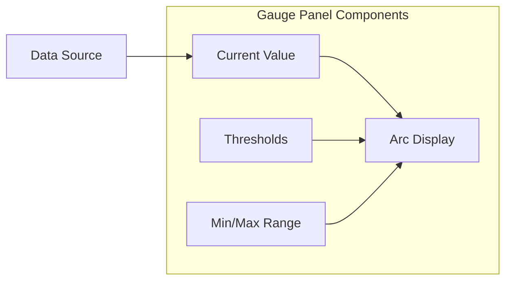
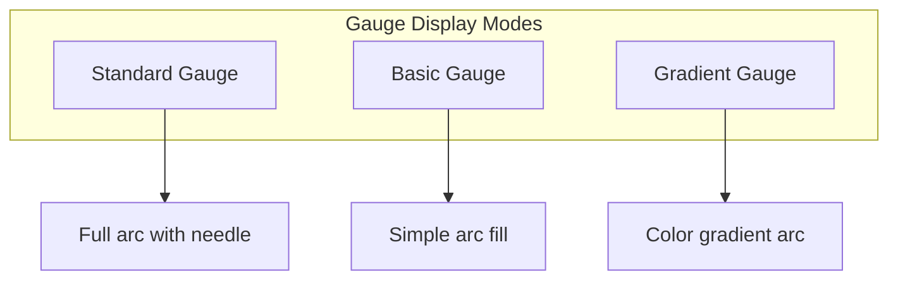
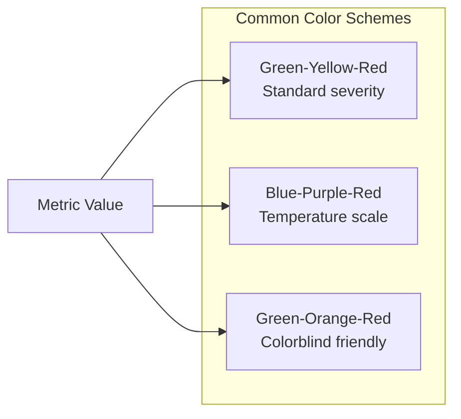
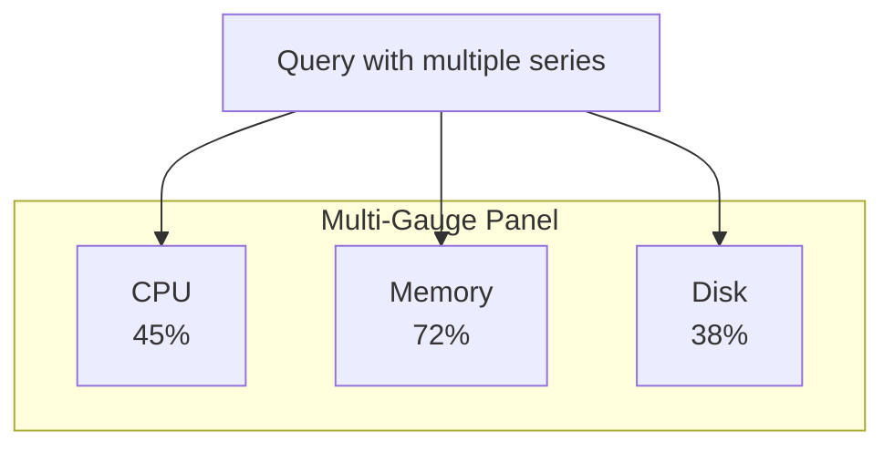
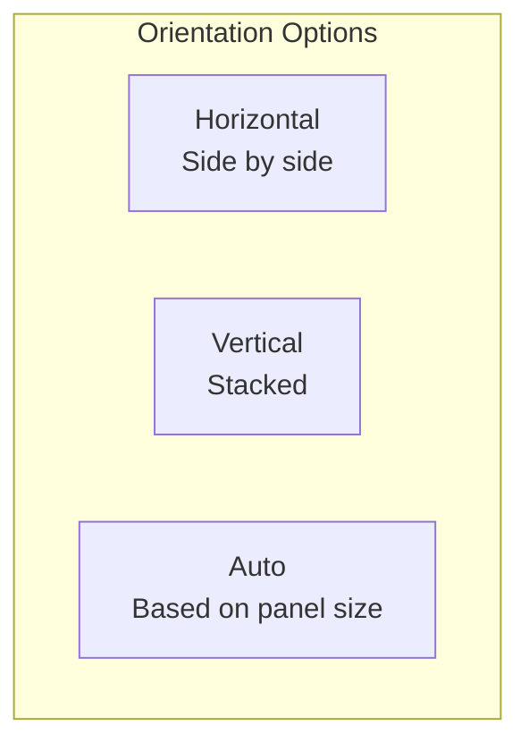

# How to Create Grafana Gauge Configurations

Author: [nawazdhandala](https://github.com/nawazdhandala)

Tags: Grafana, Observability, Dashboards, Gauges

Description: A comprehensive guide to configuring Grafana gauge panels for effective metric visualization with thresholds, colors, and real-time data binding.

---

Gauges are one of the most intuitive ways to display single-value metrics in Grafana. When you need to show CPU usage, memory consumption, disk space, or any metric that has a clear minimum and maximum range, gauge panels communicate status at a glance.

This guide covers everything from basic gauge setup to advanced configurations that make your dashboards more informative and actionable.

---

## What are Gauge Panels?

Gauge panels display a single numeric value within a defined range. They visually represent how close a metric is to its limits, making them ideal for capacity monitoring and threshold-based alerting.



Gauges answer the question: "How is this metric performing relative to acceptable limits?"

---

## When to Use Gauge Panels

Gauge panels work best in specific scenarios:

| Use Case | Why Gauges Work |
|----------|-----------------|
| Resource utilization | CPU, memory, disk show percentage of capacity |
| SLA compliance | Display uptime percentage against targets |
| Queue depth | Show buffer fill level relative to max |
| Temperature monitoring | Visualize readings against safe ranges |
| Budget consumption | Track spend against allocated limits |

Avoid gauges when you need to show trends over time or compare multiple values. Use time series or bar charts for those cases.

---

## Creating Your First Gauge Panel

### Step 1: Add a Gauge Panel

In your Grafana dashboard, click Add panel and select Gauge from the visualization dropdown. You will see a circular gauge with default settings.

### Step 2: Configure the Data Source

Add a query that returns a single value. Prometheus queries that aggregate to a single number work well.

This query returns the average CPU usage across all instances:

```promql
avg(100 - (avg by (instance) (rate(node_cpu_seconds_total{mode="idle"}[5m])) * 100))
```

### Step 3: Set the Value Range

Configure the minimum and maximum values in the panel options. For percentage metrics, set Min to 0 and Max to 100.

```yaml
# Panel Options
min: 0
max: 100
unit: percent
```

---

## Understanding Gauge Display Modes

Grafana offers several gauge display modes. Each serves different visualization needs.



### Standard Gauge

Shows the full arc with a needle pointer. Best for dashboard displays where visual impact matters.

### Basic Gauge

Displays a simpler filled arc. Uses less visual space and works well in dense dashboards.

### Gradient Gauge

Colors the arc with a gradient based on thresholds. Provides immediate visual feedback on metric health.

---

## Configuring Thresholds

Thresholds are the most important gauge configuration. They define when a metric transitions from healthy to warning to critical.

### Basic Threshold Setup

Set thresholds in the panel options. Colors change as the value crosses threshold boundaries.

```yaml
thresholds:
  mode: absolute
  steps:
    - value: null
      color: green
    - value: 70
      color: yellow
    - value: 90
      color: red
```

This configuration shows:
- Green when value is 0-69
- Yellow when value is 70-89
- Red when value is 90 or above

### Percentage Mode Thresholds

For metrics where thresholds should be relative to the range, use percentage mode.

```yaml
thresholds:
  mode: percentage
  steps:
    - value: null
      color: green
    - value: 70
      color: yellow
    - value: 90
      color: red
```

Percentage mode calculates thresholds based on the min/max range, not absolute values.

---

## Threshold Color Schemes



### Choosing Colors

Select colors that convey meaning clearly:

| Color | Typical Meaning |
|-------|-----------------|
| Green (#73BF69) | Healthy, normal operation |
| Yellow (#FADE2A) | Warning, attention needed |
| Orange (#FF9830) | Elevated concern |
| Red (#F2495C) | Critical, immediate action |
| Blue (#5794F2) | Informational |

### Custom Color Configuration

Define custom colors using hex codes for brand consistency.

```json
{
  "thresholds": {
    "mode": "absolute",
    "steps": [
      { "value": null, "color": "#37872D" },
      { "value": 60, "color": "#E0B400" },
      { "value": 80, "color": "#C4162A" }
    ]
  }
}
```

---

## Gauge Panel JSON Configuration

Understanding the JSON structure enables programmatic dashboard creation and version control.

Here is a complete gauge panel configuration:

```json
{
  "type": "gauge",
  "title": "CPU Usage",
  "datasource": {
    "type": "prometheus",
    "uid": "prometheus"
  },
  "targets": [
    {
      "expr": "avg(100 - (avg by (instance) (rate(node_cpu_seconds_total{mode=\"idle\"}[5m])) * 100))",
      "refId": "A"
    }
  ],
  "fieldConfig": {
    "defaults": {
      "unit": "percent",
      "min": 0,
      "max": 100,
      "thresholds": {
        "mode": "absolute",
        "steps": [
          { "value": null, "color": "green" },
          { "value": 70, "color": "yellow" },
          { "value": 90, "color": "red" }
        ]
      }
    }
  },
  "options": {
    "reduceOptions": {
      "calcs": ["lastNotNull"],
      "fields": "",
      "values": false
    },
    "orientation": "auto",
    "showThresholdLabels": false,
    "showThresholdMarkers": true
  }
}
```

---

## Advanced Gauge Options

### Show Threshold Markers

Enable threshold markers to display visual indicators on the gauge arc where thresholds occur.

```yaml
options:
  showThresholdMarkers: true
  showThresholdLabels: false
```

### Show Threshold Labels

Display the actual threshold values on the gauge for precise reference.

```yaml
options:
  showThresholdMarkers: true
  showThresholdLabels: true
```

### Text Size Configuration

Control the size of the value display.

```yaml
options:
  text:
    titleSize: 12
    valueSize: 32
```

---

## Value Mappings

Value mappings transform raw numbers into meaningful text or different values.

### Text Mappings

Convert numeric values to descriptive text.

```json
{
  "mappings": [
    {
      "type": "range",
      "options": {
        "from": 0,
        "to": 30,
        "result": { "text": "Low", "color": "green" }
      }
    },
    {
      "type": "range",
      "options": {
        "from": 30,
        "to": 70,
        "result": { "text": "Medium", "color": "yellow" }
      }
    },
    {
      "type": "range",
      "options": {
        "from": 70,
        "to": 100,
        "result": { "text": "High", "color": "red" }
      }
    }
  ]
}
```

### Special Value Mappings

Handle null, NaN, or specific values.

```json
{
  "mappings": [
    {
      "type": "special",
      "options": {
        "match": "null",
        "result": { "text": "No Data", "color": "gray" }
      }
    }
  ]
}
```

---

## Multiple Gauges in a Panel

Display multiple related metrics in a single gauge panel using field overrides.



### Query for Multiple Series

Return multiple metrics in a single query.

```promql
# CPU usage by instance
avg by (instance) (100 - (rate(node_cpu_seconds_total{mode="idle"}[5m]) * 100))
```

### Configure Field Overrides

Apply different settings to each series.

```json
{
  "overrides": [
    {
      "matcher": { "id": "byName", "options": "server-1" },
      "properties": [
        { "id": "displayName", "value": "Production" },
        { "id": "color", "value": { "mode": "fixed", "fixedColor": "blue" } }
      ]
    },
    {
      "matcher": { "id": "byName", "options": "server-2" },
      "properties": [
        { "id": "displayName", "value": "Staging" },
        { "id": "color", "value": { "mode": "fixed", "fixedColor": "purple" } }
      ]
    }
  ]
}
```

---

## Common Gauge Patterns

### SLA Uptime Gauge

Track service availability against SLA targets.

```promql
# Calculate uptime percentage
(1 - (sum(increase(probe_success_total{result="failure"}[30d])) / sum(increase(probe_success_total[30d])))) * 100
```

Configure with SLA thresholds:

```yaml
min: 99
max: 100
thresholds:
  steps:
    - value: null
      color: red
    - value: 99.9
      color: yellow
    - value: 99.95
      color: green
```

### Queue Depth Gauge

Monitor message queue fill level.

```promql
# RabbitMQ queue depth
rabbitmq_queue_messages{queue="orders"}
```

```yaml
min: 0
max: 10000
thresholds:
  steps:
    - value: null
      color: green
    - value: 5000
      color: yellow
    - value: 8000
      color: red
```

### Response Time Gauge

Display API response latency.

```promql
# P95 response time in milliseconds
histogram_quantile(0.95, rate(http_request_duration_seconds_bucket[5m])) * 1000
```

```yaml
min: 0
max: 2000
unit: ms
thresholds:
  steps:
    - value: null
      color: green
    - value: 500
      color: yellow
    - value: 1000
      color: red
```

---

## Gauge Layout Options

### Orientation

Control how gauges display in the panel.



Configure orientation in panel options:

```yaml
options:
  orientation: auto  # auto, horizontal, vertical
```

### Sizing

Control gauge size relative to the panel.

```yaml
options:
  reduceOptions:
    calcs: ["lastNotNull"]
  orientation: auto
```

---

## Calculation Options

Gauges can apply calculations to incoming data.

### Available Calculations

| Calculation | Description |
|-------------|-------------|
| Last | Most recent value |
| Last (not null) | Most recent non-null value |
| First | First value in range |
| Min | Minimum value |
| Max | Maximum value |
| Mean | Average value |
| Sum | Total of all values |
| Count | Number of values |

### Configuration

Select the appropriate calculation for your use case.

```yaml
reduceOptions:
  calcs:
    - lastNotNull
  fields: ""
  values: false
```

For dashboards showing current state, use lastNotNull. For summary views, consider mean or max.

---

## Performance Considerations

### Query Efficiency

Optimize queries for single-value results.

Good: Pre-aggregated single value
```promql
avg(rate(http_requests_total[5m]))
```

Avoid: Returning many series then reducing in Grafana
```promql
rate(http_requests_total[5m])  # Returns many series
```

### Refresh Rate

Gauges displaying real-time metrics can use faster refresh rates. For slowly-changing metrics, reduce refresh to minimize load.

| Metric Type | Recommended Refresh |
|-------------|-------------------|
| Real-time (CPU, memory) | 10-30 seconds |
| Aggregated (hourly stats) | 1-5 minutes |
| SLA metrics | 5-15 minutes |

---

## Troubleshooting Gauge Panels

### Gauge Shows "No Data"

- Verify query returns data in Query Inspector
- Check time range includes recent data
- Ensure calculation returns a value (try different calc)

### Colors Not Changing

- Verify threshold values match your data range
- Check threshold mode (absolute vs percentage)
- Confirm min/max values are set correctly

### Value Displays as Wrong Unit

- Set unit explicitly in field config
- Check for unit transformation in query

### Gauge Arc Not Filling Correctly

- Verify min and max values bracket your data
- Check that value is within the configured range

---

## Gauge Panel vs Stat Panel

Both display single values, but serve different purposes.

| Feature | Gauge | Stat |
|---------|-------|------|
| Visual representation | Arc/needle | Number only |
| Range context | Shows position in range | No range display |
| Space efficiency | Requires more space | Compact |
| At-a-glance status | Excellent | Good |
| Trend sparkline | No | Optional |

Use gauges when range context matters. Use stat panels for compact numeric displays.

---

## Integrating with OneUptime

Gauge panels work well with OneUptime observability data. Monitor your infrastructure health with visual gauges.

Example queries for OneUptime metrics:

```promql
# Monitor response time
avg(oneuptime_monitor_response_time_seconds{monitor_type="http"}) * 1000

# Service availability
avg(up{job="oneuptime-monitors"}) * 100

# Active incidents
count(oneuptime_incident_status{state="active"})
```

Configure gauges to display these metrics with appropriate thresholds for your SLAs.

---

## Complete Example: Server Health Dashboard

Here is a complete gauge configuration for a server health monitoring dashboard.

```json
{
  "panels": [
    {
      "type": "gauge",
      "title": "CPU Usage",
      "gridPos": { "x": 0, "y": 0, "w": 8, "h": 8 },
      "targets": [
        {
          "expr": "avg(100 - (rate(node_cpu_seconds_total{mode=\"idle\",instance=~\"$instance\"}[5m]) * 100))",
          "refId": "A"
        }
      ],
      "fieldConfig": {
        "defaults": {
          "unit": "percent",
          "min": 0,
          "max": 100,
          "thresholds": {
            "mode": "absolute",
            "steps": [
              { "value": null, "color": "green" },
              { "value": 70, "color": "yellow" },
              { "value": 90, "color": "red" }
            ]
          }
        }
      },
      "options": {
        "showThresholdMarkers": true,
        "showThresholdLabels": false
      }
    },
    {
      "type": "gauge",
      "title": "Memory Usage",
      "gridPos": { "x": 8, "y": 0, "w": 8, "h": 8 },
      "targets": [
        {
          "expr": "(1 - (node_memory_MemAvailable_bytes{instance=~\"$instance\"} / node_memory_MemTotal_bytes{instance=~\"$instance\"})) * 100",
          "refId": "A"
        }
      ],
      "fieldConfig": {
        "defaults": {
          "unit": "percent",
          "min": 0,
          "max": 100,
          "thresholds": {
            "mode": "absolute",
            "steps": [
              { "value": null, "color": "green" },
              { "value": 80, "color": "yellow" },
              { "value": 95, "color": "red" }
            ]
          }
        }
      }
    },
    {
      "type": "gauge",
      "title": "Disk Usage",
      "gridPos": { "x": 16, "y": 0, "w": 8, "h": 8 },
      "targets": [
        {
          "expr": "(1 - (node_filesystem_avail_bytes{mountpoint=\"/\",instance=~\"$instance\"} / node_filesystem_size_bytes{mountpoint=\"/\",instance=~\"$instance\"})) * 100",
          "refId": "A"
        }
      ],
      "fieldConfig": {
        "defaults": {
          "unit": "percent",
          "min": 0,
          "max": 100,
          "thresholds": {
            "mode": "absolute",
            "steps": [
              { "value": null, "color": "green" },
              { "value": 75, "color": "yellow" },
              { "value": 90, "color": "red" }
            ]
          }
        }
      }
    }
  ]
}
```

---

## Summary

Grafana gauge panels provide an intuitive way to display single-value metrics with visual context.

Key takeaways:

- Use gauges for metrics with clear min/max ranges
- Configure thresholds that match your operational requirements
- Choose colors that convey status clearly
- Optimize queries to return single values efficiently
- Combine gauges with other panel types for comprehensive dashboards

Start with basic threshold configurations, then add value mappings and field overrides as your monitoring needs evolve.

---

**Related Reading:**

- [Logs, Metrics and Traces: The Three Pillars of Observability](https://oneuptime.com/blog/post/2025-08-20-three-pillars-of-observability-logs-metrics-traces/view)
- [SRE Metrics to Track](https://oneuptime.com/blog/post/2025-11-28-sre-metrics-to-track/view)
- [How to Create Grafana Canvas Panels](https://oneuptime.com/blog/post/2026-01-30-grafana-canvas-panels/view)
