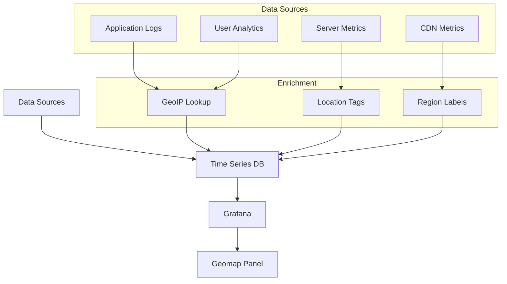
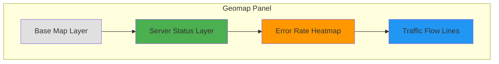
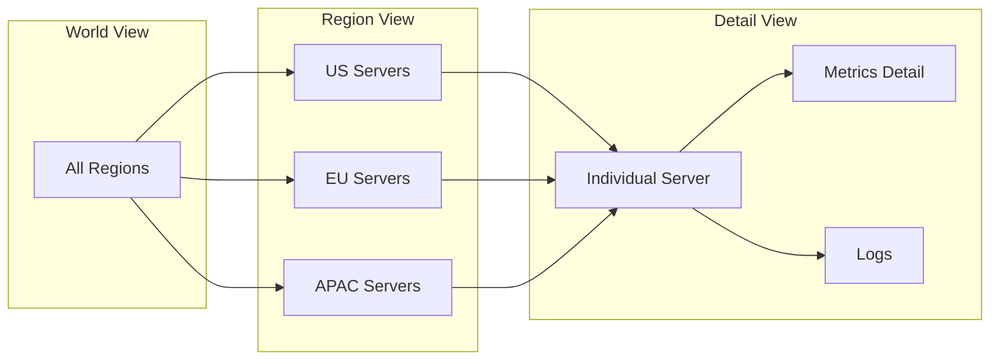

# How to Implement Grafana Geomap Visualizations

Author: [nawazdhandala](https://github.com/nawazdhandala)

Tags: Grafana, Observability, Dashboards, Geomap

Description: A comprehensive guide to building geographic visualizations in Grafana for monitoring distributed infrastructure, user traffic, and regional performance metrics.

Your servers are scattered across continents. Your users span time zones. Your CDN serves requests from dozens of edge locations. Yet your monitoring dashboard shows... a flat table of numbers.

Geographic context matters. When latency spikes in Frankfurt, you want to see it on a map. When error rates climb in Asia-Pacific, the visual should be immediate. Grafana's Geomap panel transforms abstract metrics into spatial intelligence.

This guide walks you through implementing Geomap visualizations, from basic setup to advanced configurations that make geographic monitoring actually useful.

## What is Grafana Geomap?

Geomap is Grafana's native panel for geographic visualizations. It plots data points on an interactive world map, supporting multiple base layers (OpenStreetMap, CARTO, custom tiles) and visualization styles (markers, heatmaps, route lines).

Use cases where Geomap shines:

- **Infrastructure distribution**: Visualize server locations, health status, and resource utilization
- **User traffic analysis**: Map request origins, latency by region, error hotspots
- **CDN performance**: Monitor edge node performance across geographic zones
- **Incident response**: Quickly identify regional outages or degraded service

## Architecture Overview

The following diagram illustrates how geographic data flows through your observability stack into Grafana Geomap.



The key insight: geographic data must be captured at ingestion time. You cannot retroactively add latitude/longitude to metrics that were stored without location context.

## Prerequisites

Before implementing Geomap visualizations, ensure you have:

- Grafana 9.0 or later (Geomap is the default geo panel from v9+)
- A data source with geographic fields (latitude, longitude) or location identifiers (country codes, city names)
- Metrics or logs tagged with location information

## Step 1: Prepare Your Data with Geographic Context

Your metrics need location data. There are three common approaches.

### Option A: Explicit Coordinates in Metrics

If you control the metric emission, include latitude and longitude as labels. The following Prometheus metric format includes geographic coordinates directly.

```promql
server_cpu_usage{instance="web-01",region="eu-west-1",lat="53.3498",lon="-6.2603"} 0.75
server_cpu_usage{instance="web-02",region="us-east-1",lat="37.7749",lon="-122.4194"} 0.42
server_cpu_usage{instance="web-03",region="ap-southeast-1",lat="1.3521",lon="103.8198"} 0.63
```

### Option B: GeoIP Enrichment at Ingestion

For user traffic data, enrich logs with GeoIP at the collector level. This OpenTelemetry Collector configuration uses the GeoIP processor to add location fields.

```yaml
processors:
  geoip:
    context: resource
    providers:
      maxmind:
        database_path: /etc/otel/GeoLite2-City.mmdb

pipeline:
  logs:
    receivers: [otlp]
    processors: [geoip, batch]
    exporters: [loki]
```

### Option C: Lookup Tables in Grafana

For static infrastructure, maintain a lookup table. Grafana can join metrics with CSV data containing coordinates. Create a CSV file with your location mappings.

```csv
region,lat,lon,datacenter
us-east-1,37.7749,-122.4194,Virginia
eu-west-1,53.3498,-6.2603,Dublin
ap-southeast-1,1.3521,103.8198,Singapore
```

## Step 2: Create Your First Geomap Panel

Open your Grafana dashboard and add a new panel. Select "Geomap" as the visualization type.

### Basic Query Setup

For Prometheus data with embedded coordinates, your query extracts the geographic labels. This query retrieves the latest CPU usage per server with location data.

```promql
max by (instance, region, lat, lon) (server_cpu_usage)
```

### Configure Data Layers

In the panel options, configure the data layer to map your fields.

Under the "Data layer" section, set the following field mappings to connect your query results to geographic coordinates.

| Setting | Value |
|---------|-------|
| Layer type | Markers |
| Location mode | Coords |
| Latitude field | lat |
| Longitude field | lon |

### Style the Markers

Configure marker appearance based on metric values. The following settings create dynamic marker sizing.

| Setting | Value |
|---------|-------|
| Size | Field: Value |
| Min size | 5 |
| Max size | 30 |
| Color | By value thresholds |

Set thresholds for color coding. These thresholds provide visual severity indicators.

```
0.0 - 0.5: Green (healthy)
0.5 - 0.8: Yellow (warning)
0.8 - 1.0: Red (critical)
```

## Step 3: Advanced Geomap Configurations

### Multiple Data Layers

Geomap supports stacking multiple layers. This is powerful for showing different metric types on the same map.

The following diagram shows how layers combine to create a comprehensive geographic view.



To add multiple layers, click "Add layer" in the panel configuration. Each layer can have its own data source and styling.

### Heatmap Layer for Density Visualization

For high-volume data like user requests, heatmaps show density patterns better than markers. Configure a heatmap layer with these settings.

| Setting | Value |
|---------|-------|
| Layer type | Heatmap |
| Weight field | request_count |
| Radius | 30 |
| Blur | 15 |
| Opacity | 0.6 |

### Route Layer for Network Paths

Visualize traffic flows or network paths between locations. The route layer connects points with lines.

Your data needs source and destination coordinates. This query format supports route visualization.

```promql
# Query returning: source_lat, source_lon, dest_lat, dest_lon, traffic_volume
network_traffic_flow{source_region!="", dest_region!=""}
```

## Step 4: Integrate with Alerting

Geographic context enhances incident response. Configure alerts that include location data.

### Alerting Query with Location

This alerting rule fires when regional error rates exceed thresholds. The alert includes geographic context for faster triage.

```yaml
groups:
  - name: regional-alerts
    rules:
      - alert: HighRegionalErrorRate
        expr: |
          sum by (region, lat, lon) (
            rate(http_requests_total{status=~"5.."}[5m])
          ) / sum by (region, lat, lon) (
            rate(http_requests_total[5m])
          ) > 0.05
        for: 2m
        labels:
          severity: critical
        annotations:
          summary: "High error rate in {{ $labels.region }}"
          location: "{{ $labels.lat }}, {{ $labels.lon }}"
```

### Link Alerts to Geomap Dashboard

In your alert notification template, include a link to the Geomap dashboard with the relevant time range.

```
Dashboard: https://grafana.example.com/d/geo-overview?from={{ $startsAt }}&to={{ $endsAt }}&var-region={{ $labels.region }}
```

## Step 5: Performance Optimization

Geographic visualizations can be resource-intensive. Apply these optimizations.

### Query Efficiency

Aggregate before visualization. The following query pattern reduces data points while preserving geographic distribution.

```promql
# Inefficient: Returns every data point
server_latency_seconds{region!=""}

# Efficient: Aggregated per region
avg by (region, lat, lon) (
  avg_over_time(server_latency_seconds[5m])
)
```

### Caching Strategy

For relatively static geographic data (server locations rarely change), increase query caching. In your datasource configuration, set appropriate cache durations.

```yaml
# Grafana datasource provisioning
datasources:
  - name: Prometheus
    type: prometheus
    url: http://prometheus:9090
    jsonData:
      timeInterval: "15s"
      queryTimeout: "60s"
      httpMethod: "POST"
```

### Limit Data Points

In the panel query options, set a reasonable "Max data points" value. For Geomap, 500-1000 points is typically sufficient for clear visualization without performance degradation.

## Common Patterns and Examples

### Pattern 1: Global Infrastructure Health

This dashboard shows server health across all regions with drill-down capability.



### Pattern 2: User Experience by Geography

Map request latency to show user experience across regions. This query calculates p95 latency per geographic zone.

```promql
histogram_quantile(0.95,
  sum by (region, lat, lon, le) (
    rate(http_request_duration_seconds_bucket[5m])
  )
)
```

### Pattern 3: CDN Edge Performance

Compare edge node performance with origin servers. Use multiple layers: markers for edge nodes, connecting lines showing traffic flow, heatmap for request volume.

## Troubleshooting Common Issues

### Issue: Markers Not Appearing

**Symptoms**: Query returns data but map shows no markers.

**Solutions**:
1. Verify latitude/longitude fields are numeric, not strings
2. Check field mapping in layer configuration matches your data fields exactly
3. Ensure coordinates are valid (latitude: -90 to 90, longitude: -180 to 180)

### Issue: All Markers Clustered at One Point

**Symptoms**: Every marker appears at the same location.

**Solutions**:
1. Check if your query is aggregating away the location fields
2. Verify the `group by` clause includes `lat` and `lon`
3. Ensure default values are not overriding actual coordinates

### Issue: Map Tiles Not Loading

**Symptoms**: Markers visible but map background is blank or shows errors.

**Solutions**:
1. Check network connectivity to tile servers (OpenStreetMap, CARTO)
2. If using custom tiles, verify the tile server URL is accessible
3. For air-gapped environments, configure a local tile server or use Grafana's offline map option

## Integration with OneUptime

OneUptime's observability platform complements Grafana Geomap visualizations by providing:

- **OpenTelemetry native ingestion**: Your OTel-instrumented services already emit location-enriched telemetry that OneUptime stores efficiently
- **Unified incident management**: When Geomap alerts fire, OneUptime correlates them with traces and logs from the affected region
- **Status page integration**: Reflect regional incidents on your public status page automatically
- **SLO tracking by region**: Define and monitor SLOs per geographic zone

The combination of Grafana's visualization capabilities and OneUptime's unified platform gives you both the "where" (Geomap) and the "why" (correlated observability data).

## Summary

Grafana Geomap transforms abstract metrics into spatial understanding. The key steps:

1. **Enrich data at ingestion** with geographic context (coordinates or location identifiers)
2. **Configure field mappings** to connect your data to map layers
3. **Layer strategically** using markers for discrete points, heatmaps for density, routes for flows
4. **Integrate with alerting** to add geographic context to incident response
5. **Optimize queries** to keep visualizations responsive

Geographic monitoring is not about pretty maps. It is about reducing time-to-insight when your distributed system misbehaves. When the 3 AM alert fires and you can immediately see that Singapore is red while everywhere else is green, you have already saved minutes of investigation.

Start simple: one layer, one metric, one map. Then expand as your understanding of geographic patterns grows.

---

**Related Resources:**

- [Three Pillars of Observability: Logs, Metrics & Traces](https://oneuptime.com/blog/post/2025-08-20-three-pillars-of-observability-logs-metrics-traces/view)
- [SRE Metrics to Track](https://oneuptime.com/blog/post/2025-11-28-sre-metrics-to-track/view)
- [Monitoring vs Observability](https://oneuptime.com/blog/post/2025-11-28-monitoring-vs-observability-sre/view)
