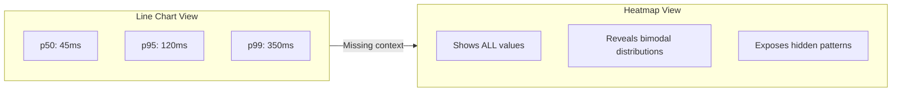
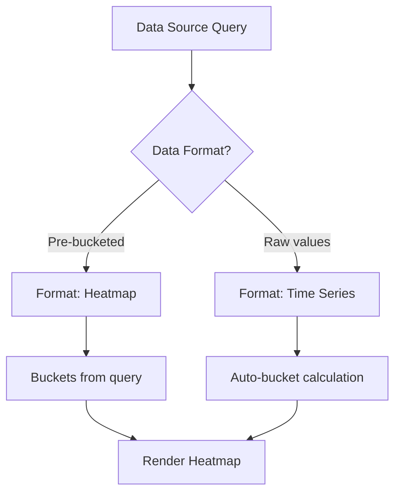
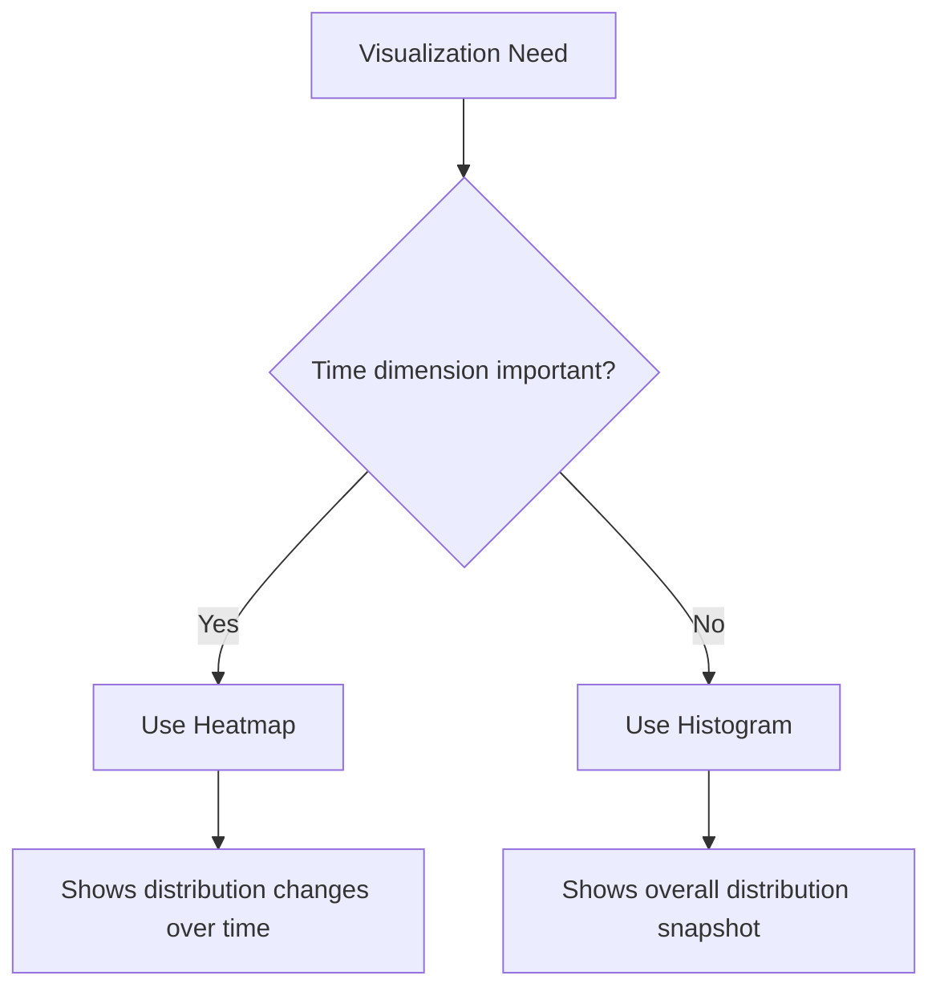

# How to Build Grafana Heatmap Configurations

Author: [nawazdhandala](https://github.com/nawazdhandala)

Tags: Grafana, Observability, Dashboards, Heatmaps

Description: A practical guide to building effective Grafana heatmaps for visualizing time-series data distributions, latency patterns, and system behavior.

---

Heatmaps are one of the most powerful visualization tools in Grafana for understanding data distributions over time. While line charts show you averages and percentiles, heatmaps reveal the full picture: where your data clusters, where outliers hide, and how patterns shift throughout the day.

## What Are Heatmaps and When to Use Them

A heatmap displays data in a two-dimensional grid where color intensity represents value magnitude. In Grafana, the X-axis typically represents time, the Y-axis represents value buckets, and color shows frequency or count.



### Use Heatmaps When You Need To

- Visualize latency distributions across services
- Identify bimodal or multimodal response patterns
- Spot time-based anomalies in request patterns
- Understand resource utilization density
- Detect gradual performance degradation

### Avoid Heatmaps For

- Simple count or rate metrics
- Metrics with very low cardinality
- Real-time alerting displays
- Mobile or small screen dashboards

## Understanding Heatmap Data Sources

Grafana heatmaps work with two main data formats: pre-bucketed histograms and raw time-series data.

### Pre-Bucketed Histograms (Prometheus)

Prometheus histogram metrics come pre-bucketed, which is ideal for heatmaps. The histogram_quantile function works with these buckets.

This query retrieves HTTP request duration histogram buckets over the past hour with 1-minute resolution.

```promql
sum(rate(http_request_duration_seconds_bucket[5m])) by (le)
```

### Raw Time-Series Data

When your data source provides raw values, Grafana can bucket them automatically. This is common with InfluxDB, Elasticsearch, or custom data sources.

## Building Your First Heatmap

### Step 1: Create a New Panel

Start by adding a new panel to your dashboard and select the Heatmap visualization type from the panel options.

### Step 2: Configure the Data Source Query

For Prometheus histogram data, use the following query structure to get request duration distribution.

```promql
sum(increase(http_request_duration_seconds_bucket{service="api-gateway"}[1m])) by (le)
```

### Step 3: Set the Data Format

In the panel options, configure how Grafana should interpret your data.



For Prometheus histograms, set the format to "Heatmap" and ensure "Calculate from data" is disabled since the data is already bucketed.

### Step 4: Configure Display Options

The following JSON shows a basic heatmap panel configuration that you can import into Grafana.

```json
{
  "type": "heatmap",
  "title": "Request Latency Distribution",
  "datasource": "Prometheus",
  "targets": [
    {
      "expr": "sum(increase(http_request_duration_seconds_bucket{service=\"api-gateway\"}[1m])) by (le)",
      "format": "heatmap",
      "legendFormat": "{{le}}"
    }
  ],
  "options": {
    "calculate": false,
    "yAxis": {
      "unit": "s",
      "decimals": 2
    },
    "cellGap": 1,
    "color": {
      "mode": "scheme",
      "scheme": "Spectral",
      "steps": 64
    },
    "showValue": "never",
    "tooltip": {
      "show": true,
      "yHistogram": true
    }
  }
}
```

## Color Schemes and What They Communicate

Color choice significantly impacts how viewers interpret heatmap data. Different schemes serve different purposes.

### Sequential Schemes (Low to High)

Use sequential schemes when you want to emphasize magnitude. Blues, Greens, and Oranges work well for showing "more is concerning."

```json
{
  "color": {
    "mode": "scheme",
    "scheme": "Blues",
    "steps": 128
  }
}
```

### Diverging Schemes (Deviation from Center)

Use diverging schemes like Spectral or RdYlGn when you have a meaningful center point and want to show deviation in both directions.

### Custom Thresholds

Define explicit color thresholds when you have SLO-based boundaries.

```json
{
  "color": {
    "mode": "thresholds",
    "thresholds": [
      {"value": 0, "color": "green"},
      {"value": 50, "color": "yellow"},
      {"value": 100, "color": "orange"},
      {"value": 200, "color": "red"}
    ]
  }
}
```

## Advanced Heatmap Patterns

### Pattern 1: Multi-Service Latency Comparison

Compare latency distributions across multiple services using a repeating panel with template variables.

This query template allows you to create repeated heatmaps for each service by using Grafana's repeat feature with a multi-value variable.

```promql
sum(increase(http_request_duration_seconds_bucket{service="$service"}[1m])) by (le)
```

Configure the panel repeat settings to generate one heatmap per service.

```json
{
  "repeat": "service",
  "repeatDirection": "h",
  "maxPerRow": 3
}
```

### Pattern 2: Error Rate by Response Time Buckets

Visualize how errors correlate with response times by creating a heatmap of error counts across latency buckets.

```promql
sum(increase(http_request_duration_seconds_bucket{status=~"5.."}[1m])) by (le)
```

### Pattern 3: Queue Depth Over Time

For message queue monitoring, heatmaps can show how queue depth fluctuates throughout the day.

```promql
histogram_quantile(0.5,
  sum(rate(kafka_consumer_lag_bucket[5m])) by (le, topic)
)
```

### Pattern 4: Custom Bucket Boundaries

When auto-bucketing does not match your needs, define explicit Y-axis buckets for better granularity in critical ranges.

```json
{
  "yAxis": {
    "unit": "ms",
    "min": 0,
    "max": 1000
  },
  "options": {
    "calculate": true,
    "calculation": {
      "xBuckets": {
        "mode": "count",
        "value": "50"
      },
      "yBuckets": {
        "mode": "count",
        "value": "25"
      }
    }
  }
}
```

## Heatmap Configuration for Common Observability Scenarios

### HTTP Request Latency

This configuration is optimized for API latency monitoring with sub-second resolution.

```promql
# Query
sum(rate(http_request_duration_seconds_bucket{job="api-server"}[5m])) by (le)
```

```json
{
  "options": {
    "yAxis": {
      "unit": "s",
      "min": 0,
      "max": 2
    },
    "color": {
      "scheme": "Spectral",
      "reverse": true
    }
  }
}
```

### Database Query Performance

Monitor database query execution times with millisecond-level buckets.

```promql
sum(rate(db_query_duration_milliseconds_bucket{database="primary"}[5m])) by (le)
```

```json
{
  "options": {
    "yAxis": {
      "unit": "ms",
      "min": 0,
      "max": 500
    },
    "color": {
      "scheme": "YlOrRd"
    }
  }
}
```

### Memory Allocation Patterns

Track memory allocation sizes to identify unexpected large allocations.

```promql
sum(rate(memory_allocation_bytes_bucket{service="worker"}[5m])) by (le)
```

## Troubleshooting Common Heatmap Issues

### Issue: Empty or Sparse Heatmap

The heatmap appears mostly empty with only a few colored cells.

**Causes and Solutions:**

1. **Query returns no data** - Verify the query in Explore mode first
2. **Time range too narrow** - Expand the dashboard time range
3. **Bucket boundaries mismatch** - Check if your histogram le values align with display settings

This diagnostic query helps verify that your histogram has data in the expected buckets.

```promql
# Debug query to check bucket distribution
sum(http_request_duration_seconds_bucket) by (le)
```

### Issue: All Cells Same Color

Every cell appears the same color, making the heatmap unreadable.

**Causes and Solutions:**

1. **Color scale not matching data range** - Adjust min/max color thresholds
2. **Logarithmic scale needed** - Enable log scale for exponentially distributed data
3. **Too few color steps** - Increase the number of color gradient steps

```json
{
  "color": {
    "mode": "scheme",
    "scheme": "Spectral",
    "steps": 128,
    "min": 0,
    "max": 1000
  }
}
```

### Issue: Y-Axis Labels Incorrect

Bucket labels show raw values instead of human-readable units.

**Solution:** Configure the Y-axis unit explicitly in panel options.

```json
{
  "yAxis": {
    "unit": "s",
    "decimals": 3
  }
}
```

## Heatmap Performance Optimization

Large heatmaps with many data points can slow down dashboard loading. Use these techniques to optimize performance.

### Reduce Query Resolution

Instead of querying at maximum resolution, use a step interval that matches your visual needs.

```promql
# Use 1m step instead of default 15s
sum(increase(http_request_duration_seconds_bucket[1m])) by (le)
```

### Limit Time Range

Configure max data points to prevent over-fetching.

```json
{
  "maxDataPoints": 500,
  "interval": "1m"
}
```

### Use Recording Rules

For frequently accessed heatmaps, create Prometheus recording rules to pre-aggregate data.

```yaml
groups:
  - name: heatmap_aggregations
    interval: 1m
    rules:
      - record: job:http_request_duration_seconds_bucket:rate1m
        expr: sum(rate(http_request_duration_seconds_bucket[1m])) by (job, le)
```

## Complete Dashboard Example

Here is a complete dashboard JSON snippet that combines multiple heatmap panels for comprehensive latency monitoring.

```json
{
  "panels": [
    {
      "title": "API Latency Distribution",
      "type": "heatmap",
      "gridPos": {"h": 8, "w": 12, "x": 0, "y": 0},
      "targets": [
        {
          "expr": "sum(rate(http_request_duration_seconds_bucket{service=\"api\"}[5m])) by (le)",
          "format": "heatmap"
        }
      ],
      "options": {
        "calculate": false,
        "color": {"scheme": "Spectral", "reverse": true},
        "yAxis": {"unit": "s"}
      }
    },
    {
      "title": "Database Query Latency",
      "type": "heatmap",
      "gridPos": {"h": 8, "w": 12, "x": 12, "y": 0},
      "targets": [
        {
          "expr": "sum(rate(db_query_duration_seconds_bucket{database=\"primary\"}[5m])) by (le)",
          "format": "heatmap"
        }
      ],
      "options": {
        "calculate": false,
        "color": {"scheme": "YlOrRd"},
        "yAxis": {"unit": "s"}
      }
    }
  ]
}
```

## Heatmap vs Histogram Panel

Grafana offers both Heatmap and Histogram panel types. Understanding when to use each helps you choose the right visualization.



| Feature | Heatmap | Histogram |
|---------|---------|-----------|
| Time dimension | Yes, on X-axis | No, single snapshot |
| Best for | Trends in distribution | Current state analysis |
| Data volume | Higher | Lower |
| Pattern detection | Excellent | Limited |

## Integration with Alerting

While heatmaps are primarily for visualization, you can create alerts based on the underlying histogram data.

This Prometheus alerting rule fires when more than 10% of requests exceed the SLO boundary of 500ms.

```yaml
groups:
  - name: latency_alerts
    rules:
      - alert: HighLatencyRequests
        expr: |
          sum(rate(http_request_duration_seconds_bucket{le="0.5"}[5m]))
          /
          sum(rate(http_request_duration_seconds_count[5m]))
          < 0.9
        for: 5m
        labels:
          severity: warning
        annotations:
          summary: "High latency detected"
          description: "More than 10% of requests exceeding 500ms SLO"
```

## Summary

Grafana heatmaps transform histogram data into actionable insights about your system's behavior over time. Key takeaways:

- Use heatmaps for latency, distribution, and density visualizations
- Configure data format correctly based on your data source
- Choose color schemes that match your monitoring goals
- Optimize queries for dashboard performance
- Combine heatmaps with alerts for proactive monitoring

Start with simple latency heatmaps and expand to more complex patterns as you become comfortable with the visualization. The investment in learning heatmap configuration pays off when you catch that bimodal latency distribution that p95 metrics completely missed.

---

**Related Reading:**

- [Logs, Metrics & Traces: The Three Pillars of Observability](https://oneuptime.com/blog/post/2025-08-20-three-pillars-of-observability-logs-metrics-traces/view)
- [Basics of Profiling: Turning CPU and Memory Hotspots into Action](https://oneuptime.com/blog/post/2025-09-09-basics-of-profiling/view)
- [SRE Metrics to Track](https://oneuptime.com/blog/post/2025-11-28-sre-metrics-to-track/view)
