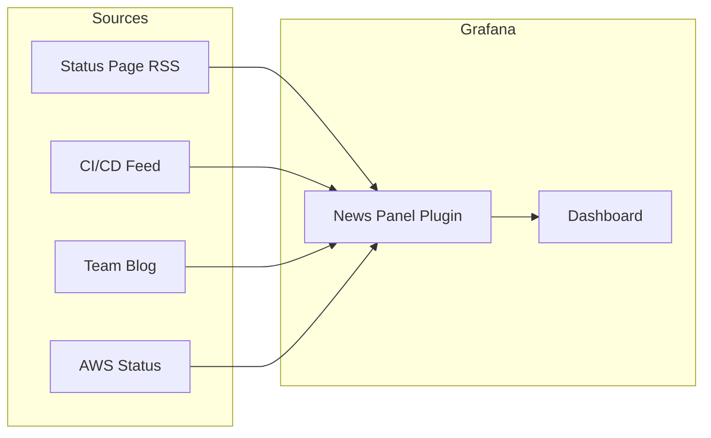
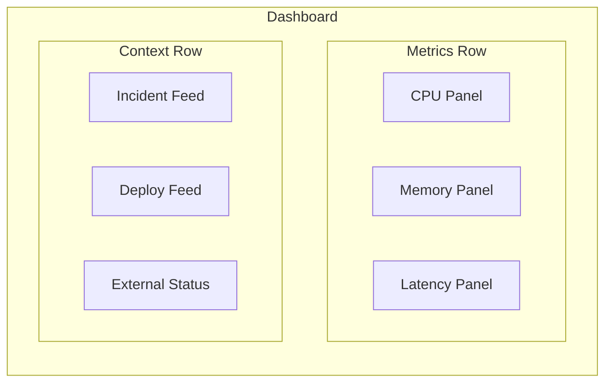
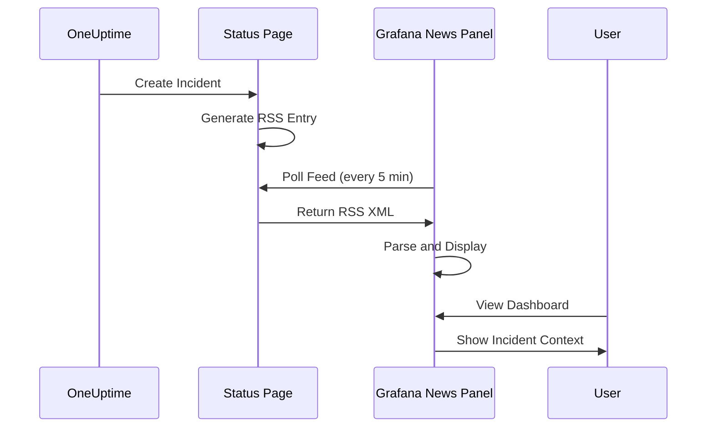
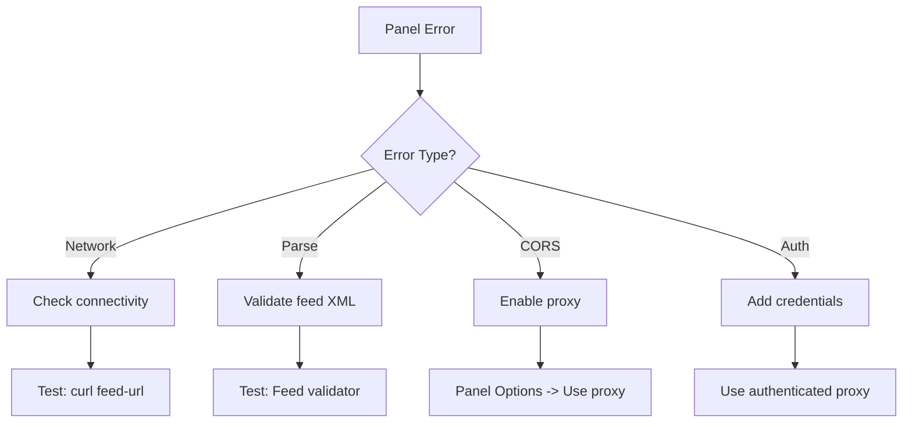

# How to Implement Grafana News Panel

Author: [nawazdhandala](https://github.com/nawazdhandala)

Tags: Grafana, Observability, Dashboards, News

Description: A complete guide to implementing and configuring Grafana's News Panel to display RSS feeds, team announcements, and incident updates directly in your observability dashboards.

Your observability dashboard shows metrics, logs, and traces. But what about context? When p99 latency spikes, your team scrambles to check Slack, email, and status pages for related announcements. What if that context lived right beside your charts?

The Grafana News Panel solves this by embedding RSS feeds, team updates, and incident notifications directly into your dashboards. This guide walks you through setup, configuration, and practical use cases to turn your dashboards into information hubs.

## What is the Grafana News Panel?

The News Panel is a Grafana visualization plugin that displays RSS/Atom feed content. It transforms static dashboards into living information centers by surfacing:

- Incident announcements from your status page
- Deployment notifications from CI/CD pipelines
- Team updates and on-call schedules
- External service status (AWS, GCP, third-party APIs)
- Security advisories and CVE alerts



## Prerequisites

Before implementing the News Panel, ensure you have:

- Grafana 8.0 or later (the News Panel is included by default)
- Dashboard edit permissions
- Access to RSS/Atom feed URLs you want to display
- Network connectivity from Grafana to feed sources

## Step 1: Add the News Panel to Your Dashboard

Open your Grafana dashboard and enter edit mode. Add a new panel and search for "News" in the visualization picker.

Navigate to your dashboard, click the "Add" button, and select "Visualization":

```
Dashboard -> Add -> Visualization -> News
```

The panel will appear empty until you configure a data source.

## Step 2: Configure a Basic RSS Feed

The News Panel requires a feed URL. For testing, use Grafana's official blog feed or your organization's status page.

In the panel editor, locate the "Feed URL" field under the panel options and enter your RSS feed URL:

```
https://grafana.com/blog/index.xml
```

After entering the URL, the panel will fetch and display the feed content. You should see article titles, publication dates, and brief excerpts.

## Step 3: Create a Custom RSS Feed for Internal Updates

For internal team announcements, you can create a simple RSS feed. Here is a Node.js example that generates an RSS feed from your incident data:

```javascript
const express = require('express');
const RSS = require('rss');
const app = express();

// Sample incident data - replace with your data source
const incidents = [
  {
    title: 'Database maintenance scheduled',
    description: 'PostgreSQL upgrade on prod-db-01',
    date: new Date('2026-01-30T10:00:00Z'),
    link: 'https://status.example.com/incidents/123'
  },
  {
    title: 'API latency resolved',
    description: 'Payment service latency issue fixed',
    date: new Date('2026-01-29T15:30:00Z'),
    link: 'https://status.example.com/incidents/122'
  }
];

app.get('/feed.xml', (req, res) => {
  const feed = new RSS({
    title: 'Team Incident Feed',
    description: 'Real-time incident and maintenance updates',
    feed_url: 'https://internal.example.com/feed.xml',
    site_url: 'https://status.example.com',
    language: 'en',
    ttl: 5 // Cache for 5 minutes
  });

  incidents.forEach(incident => {
    feed.item({
      title: incident.title,
      description: incident.description,
      url: incident.link,
      date: incident.date
    });
  });

  res.set('Content-Type', 'application/rss+xml');
  res.send(feed.xml({ indent: true }));
});

app.listen(3000, () => {
  console.log('RSS feed server running on port 3000');
});
```

Deploy this service and point your News Panel to `http://your-service:3000/feed.xml`.

## Step 4: Display Multiple Feeds

A single News Panel can only display one feed. For multiple sources, add multiple panels or aggregate feeds server-side.

Here is the recommended dashboard layout for a multi-feed setup:



To aggregate multiple feeds into one, use a feed aggregator service. Here is a Python example:

```python
import feedparser
from flask import Flask, Response
from feedgen.feed import FeedGenerator
from datetime import datetime

app = Flask(__name__)

FEED_SOURCES = [
    'https://status.aws.amazon.com/rss/all.rss',
    'https://status.example.com/feed.xml',
    'https://ci.example.com/builds.rss'
]

@app.route('/aggregated-feed.xml')
def aggregated_feed():
    fg = FeedGenerator()
    fg.title('Aggregated Status Feed')
    fg.link(href='https://example.com')
    fg.description('Combined feed from multiple sources')

    all_entries = []

    for source_url in FEED_SOURCES:
        try:
            feed = feedparser.parse(source_url)
            for entry in feed.entries[:10]:  # Limit per source
                all_entries.append({
                    'title': entry.get('title', 'No title'),
                    'link': entry.get('link', ''),
                    'description': entry.get('summary', ''),
                    'published': entry.get('published_parsed', datetime.now().timetuple())
                })
        except Exception as e:
            print(f"Error fetching {source_url}: {e}")

    # Sort by date, newest first
    all_entries.sort(key=lambda x: x['published'], reverse=True)

    for entry in all_entries[:20]:  # Total limit
        fe = fg.add_entry()
        fe.title(entry['title'])
        fe.link(href=entry['link'])
        fe.description(entry['description'])

    return Response(fg.rss_str(), mimetype='application/rss+xml')

if __name__ == '__main__':
    app.run(port=5000)
```

## Step 5: Style and Customize the Panel

The News Panel supports several customization options. Access these through the panel editor sidebar.

Key configuration options include:

| Option | Description | Recommended Value |
|--------|-------------|-------------------|
| Show images | Display feed images | Off (cleaner look) |
| Feed URL | RSS/Atom endpoint | Your feed URL |
| Use proxy | Route through Grafana backend | On (for CORS issues) |

For consistent styling across your dashboard, set a fixed height for News Panels. A height of 300-400 pixels works well for 5-7 items.

## Step 6: Integrate with OneUptime Status Page

If you use OneUptime for incident management, you can display your status page updates directly in Grafana.

OneUptime provides RSS feeds for status pages. The feed URL format is:

```
https://status.yourdomain.com/feed.xml
```

This feed includes:

- Active incidents
- Scheduled maintenance windows
- Incident updates and resolutions
- Historical incident data

Here is how the integration flows:



## Step 7: Set Up Automatic Refresh

The News Panel polls feeds at a configurable interval. Set this based on your update frequency needs.

In the panel options, configure the refresh interval:

- For incident feeds: 1-5 minutes
- For deployment notifications: 5-10 minutes
- For external status pages: 10-15 minutes

You can also set dashboard-level refresh in the dashboard settings:

```
Dashboard Settings -> General -> Auto refresh -> 5m
```

## Step 8: Handle CORS and Network Issues

When fetching external feeds, you may encounter CORS restrictions. Grafana's built-in proxy helps bypass these.

Enable the proxy option in the panel settings:

```
Panel Options -> Use proxy -> On
```

If the proxy does not resolve the issue, set up a server-side feed fetcher. Here is a minimal example using nginx:

```nginx
server {
    listen 8080;

    location /proxy/ {
        # Strip the /proxy/ prefix
        rewrite ^/proxy/(.*)$ /$1 break;

        # Proxy to external feed
        proxy_pass https://external-status.example.com;
        proxy_set_header Host external-status.example.com;

        # Add CORS headers
        add_header Access-Control-Allow-Origin *;
        add_header Access-Control-Allow-Methods GET;
    }
}
```

## Practical Use Cases

### Use Case 1: On-Call Context Dashboard

Create a dashboard that combines:

- Service health metrics (top row)
- Recent deployments feed (bottom left)
- Active incidents feed (bottom center)
- Team announcements (bottom right)

This gives on-call engineers immediate context without switching tools.

### Use Case 2: Executive Status Board

Build a high-level dashboard displaying:

- SLO compliance gauges
- News feed from status page (customer-facing incidents)
- Deployment velocity metrics
- External dependency status (AWS, payment providers)

### Use Case 3: Security Operations Center

Combine security metrics with:

- CVE advisory feeds (NVD, vendor advisories)
- Internal security incident feed
- Compliance audit notifications

## Troubleshooting Common Issues

### Feed Not Loading

Check the following:

1. Verify the feed URL is accessible from Grafana server
2. Enable proxy mode if CORS errors appear in browser console
3. Confirm the feed is valid RSS/Atom (test at https://validator.w3.org/feed/)

### Stale Content

If content appears outdated:

1. Check the feed's TTL (time-to-live) setting
2. Verify dashboard refresh interval is appropriate
3. Clear browser cache and hard refresh

### Panel Shows Error

Common causes and fixes:



## Best Practices

1. **Limit feed items**: Configure feeds to return 10-20 items maximum. Large feeds slow rendering.

2. **Use meaningful titles**: When creating custom feeds, write clear, actionable titles.

3. **Set appropriate TTL**: Match feed cache duration to update frequency.

4. **Group related panels**: Place News Panels near relevant metric panels for context.

5. **Document feed sources**: Add panel descriptions explaining what each feed shows.

6. **Monitor feed availability**: Alert if critical feeds become unreachable.

## Conclusion

The Grafana News Panel transforms dashboards from metric displays into contextual information hubs. By embedding incident feeds, deployment notifications, and external status updates, you reduce context switching and accelerate incident response.

Start with your status page feed, then expand to CI/CD notifications and external dependencies. The goal is not more dashboards but smarter ones where context lives beside the data it explains.

If you are using OneUptime for incident management, the RSS integration provides a direct pipeline from incident creation to dashboard visibility. Your on-call engineers see the full picture without leaving Grafana.

**Related Resources:**

- [OneUptime Status Page Documentation](https://oneuptime.com/docs/status-page)
- [Grafana Panel Plugin Development](https://grafana.com/docs/grafana/latest/developers/plugins/)
- [RSS 2.0 Specification](https://www.rssboard.org/rss-specification)
