# How to Create Grafana Notification Policies

Author: [nawazdhandala](https://github.com/nawazdhandala)

Tags: Grafana, Notification Policies, Alert Routing, Alerting

Description: Learn to implement Grafana notification policies with routing trees, label matching, and timing configuration for flexible alert delivery.

---

Grafana notification policies determine how alerts are routed to contact points. They form the backbone of your alerting strategy, allowing you to send the right alerts to the right people at the right time. In this guide, we will walk through creating effective notification policies from scratch.

## Understanding the Policy Tree

Notification policies in Grafana are organized as a tree structure. Every Grafana instance has a root policy that catches all alerts. Child policies can be added beneath it to handle specific alert types based on label matching.


The tree is evaluated from top to bottom. When an alert fires, Grafana walks through the policy tree looking for matching policies. The first matching policy (or multiple if configured) handles the alert.

## Creating Your First Notification Policy

Before creating notification policies, ensure you have contact points configured. Contact points define where notifications are sent (Slack, email, PagerDuty, etc.).

### Step 1: Access the Notification Policies Page

Navigate to **Alerting > Notification policies** in the Grafana sidebar. You will see the default root policy that handles all alerts.

### Step 2: Add a New Policy

Click **+ New nested policy** under the root policy. Configure the following fields:

```yaml
# Example Policy Configuration
matching_labels:
  - label: team
    operator: "="
    value: platform

contact_point: platform-team-slack

group_by:
  - alertname
  - instance

timing:
  group_wait: 30s
  group_interval: 5m
  repeat_interval: 4h
```

## Label Matchers

Label matchers are the foundation of alert routing. They determine which alerts a policy handles based on the labels attached to alert rules.

### Matcher Operators

Grafana supports several matching operators:

| Operator | Description | Example |
|----------|-------------|---------|
| `=` | Exact match | `team=platform` |
| `!=` | Not equal | `env!=development` |
| `=~` | Regex match | `service=~"api-.*"` |
| `!~` | Regex not match | `host!~"test-.*"` |

### Practical Matcher Examples

```yaml
# Match alerts from the payments team in production
matchers:
  - team = payments
  - env = production

# Match critical alerts from any database service
matchers:
  - severity = critical
  - service =~ "db-.*"

# Match all alerts except those from development
matchers:
  - env != development

# Match alerts where region is us-east or us-west
matchers:
  - region =~ "us-(east|west)"
```

### Multiple Matchers Logic

When you specify multiple matchers, they are combined with AND logic. All matchers must match for the policy to apply.


## Grouping Alerts

Grouping combines related alerts into a single notification, reducing noise and providing context. The `group_by` field specifies which labels to use for grouping.

### Common Grouping Strategies

```yaml
# Group by alert name - all alerts with the same name go together
group_by:
  - alertname

# Group by alert name and instance - separate groups per instance
group_by:
  - alertname
  - instance

# Group by service and environment
group_by:
  - service
  - env

# Special value: group all alerts together
group_by:
  - "..."
```

### Grouping Example

Consider three alerts firing:

```
Alert 1: {alertname="HighCPU", instance="server-1", env="prod"}
Alert 2: {alertname="HighCPU", instance="server-2", env="prod"}
Alert 3: {alertname="HighMemory", instance="server-1", env="prod"}
```

With `group_by: [alertname]`:
- Group 1: Alert 1, Alert 2 (both HighCPU)
- Group 2: Alert 3 (HighMemory)

With `group_by: [instance]`:
- Group 1: Alert 1, Alert 3 (both server-1)
- Group 2: Alert 2 (server-2)


## Timing Configuration

Timing settings control how quickly and how often notifications are sent.

### Timing Parameters

| Parameter | Description | Default | Recommended Range |
|-----------|-------------|---------|-------------------|
| `group_wait` | Wait time before sending first notification for a new group | 30s | 10s - 1m |
| `group_interval` | Wait time before sending updates about new alerts in the group | 5m | 1m - 15m |
| `repeat_interval` | Wait time before re-sending a notification for an unchanged alert | 4h | 1h - 24h |

### Timing Configuration Examples

```yaml
# Fast response for critical alerts
critical_policy:
  group_wait: 10s      # Send quickly
  group_interval: 1m   # Frequent updates
  repeat_interval: 1h  # Remind hourly

# Relaxed timing for informational alerts
info_policy:
  group_wait: 5m       # Batch initial alerts
  group_interval: 15m  # Less frequent updates
  repeat_interval: 24h # Daily reminder only
```

### Timing Flow Diagram

```mermaid
sequenceDiagram
    participant Alert as Alert Fires
    participant GW as Group Wait
    participant N1 as First Notification
    participant GI as Group Interval
    participant N2 as Update Notification
    participant RI as Repeat Interval
    participant N3 as Repeat Notification

    Alert->>GW: Alert 1 fires
    Note over GW: Waiting 30s...
    Alert->>GW: Alert 2 fires (same group)
    GW->>N1: Send notification (both alerts)
    Note over GI: Waiting 5m...
    Alert->>GI: Alert 3 fires (same group)
    GI->>N2: Send update (new alert)
    Note over RI: Waiting 4h...
    RI->>N3: Resend (alerts still firing)
```



## Override Patterns

Override patterns allow child policies to modify behavior inherited from parent policies.

### Continue Matching

By default, when a policy matches, Grafana stops evaluating sibling policies. Enable **Continue matching subsequent sibling nodes** to route the same alert to multiple policies.


```yaml
# Policy that continues to next sibling
critical_alerts_policy:
  matchers:
    - severity = critical
  contact_point: pagerduty-oncall
  continue: true  # Continue to next sibling policy

team_routing_policy:
  matchers:
    - team = platform
  contact_point: platform-slack
```

This configuration sends critical alerts to PagerDuty AND to the team-specific Slack channel.

### Mute Timings

Mute timings suppress notifications during specified time windows without affecting alert evaluation.

```yaml
# Define a mute timing for maintenance windows
mute_timing:
  name: weekly-maintenance
  time_intervals:
    - times:
        - start_time: "02:00"
          end_time: "04:00"
      weekdays:
        - sunday

# Apply to a policy
database_policy:
  matchers:
    - team = database
  contact_point: dba-pagerduty
  mute_time_intervals:
    - weekly-maintenance
```

### Override Example: Environment-Specific Routing

```yaml
# Root policy with default behavior
root:
  contact_point: default-email
  group_by:
    - alertname
  timing:
    group_wait: 30s
    group_interval: 5m
    repeat_interval: 4h

  # Production overrides - faster, more aggressive
  nested_policies:
    - matchers:
        - env = production
      contact_point: ops-pagerduty
      group_wait: 10s          # Override: faster
      group_interval: 1m       # Override: more frequent
      # repeat_interval inherits 4h from parent

      nested_policies:
        - matchers:
            - severity = critical
          contact_point: executive-sms
          continue: true       # Also notify ops-pagerduty

    # Staging - relaxed timing
    - matchers:
        - env = staging
      contact_point: dev-slack
      group_wait: 5m           # Override: slower
      repeat_interval: 24h     # Override: less frequent
```

## Complete Policy Tree Example

Here is a comprehensive example that brings together all the concepts:


### Policy Configuration in YAML

```yaml
apiVersion: 1
policies:
  - orgId: 1
    receiver: default-email
    group_by:
      - alertname
    group_wait: 30s
    group_interval: 5m
    repeat_interval: 4h
    routes:
      # Critical alerts - fast notification, continue to team routing
      - receiver: pagerduty-oncall
        matchers:
          - severity = critical
        group_wait: 10s
        continue: true

      # Platform team routing
      - receiver: platform-slack
        matchers:
          - team = platform
        group_by:
          - alertname
          - instance
        routes:
          # Production - escalate to PagerDuty
          - receiver: platform-pagerduty
            matchers:
              - env = production
          # Staging - less urgent
          - receiver: platform-dev-slack
            matchers:
              - env = staging
            repeat_interval: 24h

      # Database team routing with maintenance muting
      - receiver: dba-slack
        matchers:
          - team = database
        mute_time_intervals:
          - maintenance-window
        routes:
          - receiver: postgres-experts
            matchers:
              - db_type = postgres
          - receiver: mysql-experts
            matchers:
              - db_type = mysql
```

## Using the Grafana API

You can manage notification policies programmatically using the Grafana API.

### Get Current Policies

```bash
curl -X GET \
  -H "Authorization: Bearer YOUR_API_KEY" \
  -H "Content-Type: application/json" \
  "https://your-grafana.com/api/v1/provisioning/policies"
```

### Update Policies

```bash
curl -X PUT \
  -H "Authorization: Bearer YOUR_API_KEY" \
  -H "Content-Type: application/json" \
  -d @policies.json \
  "https://your-grafana.com/api/v1/provisioning/policies"
```

### Provisioning with Configuration Files

Create a file at `/etc/grafana/provisioning/alerting/notification-policies.yaml`:

```yaml
apiVersion: 1
policies:
  - orgId: 1
    receiver: default-email
    group_by:
      - alertname
    routes:
      - receiver: team-slack
        matchers:
          - team = backend
        group_by:
          - alertname
          - service
```

## Testing Your Policies

Before deploying policies to production, test them using Grafana's built-in tools.

### Test Route Matching

In the Notification policies page, click **See how your alert instances are routed** to test label combinations against your policy tree.

```yaml
# Test labels input
labels:
  alertname: HighCPU
  severity: critical
  team: platform
  env: production
  instance: server-1

# Expected result: matches platform-pagerduty policy
```

### Alert Rule for Testing

Create a test alert rule that fires immediately:

```yaml
# Test alert rule
name: Test Alert - Delete After Testing
condition: 1 == 1  # Always true
labels:
  team: platform
  env: production
  severity: warning
  test: "true"
annotations:
  summary: "Test alert for policy verification"
```

## Best Practices

1. **Start with a comprehensive root policy** - Ensure no alerts fall through the cracks by setting sensible defaults.

2. **Use descriptive label names** - Labels like `team`, `env`, `severity`, and `service` make routing intuitive.

3. **Group thoughtfully** - Over-grouping hides important alerts; under-grouping creates notification fatigue.

4. **Set appropriate timing** - Critical alerts need fast notification; informational alerts can be batched.

5. **Document your policy tree** - Keep a diagram of your routing logic for team reference.

6. **Use continue sparingly** - Multiple notifications for the same alert can cause confusion if overused.

7. **Test before deploying** - Use the route tester to verify alerts go where expected.

8. **Version control your policies** - Store provisioning files in git for audit trails and rollbacks.

## Summary

Grafana notification policies provide powerful, flexible alert routing through:

- **Policy trees** for hierarchical routing logic
- **Label matchers** for precise alert targeting
- **Grouping** to reduce notification noise
- **Timing controls** for appropriate urgency levels
- **Override patterns** for special cases and exceptions

By combining these features thoughtfully, you can build an alerting system that gets the right information to the right people at the right time - without overwhelming anyone with noise.

Start simple with a basic root policy and team-based routing, then add complexity as your needs grow. Test thoroughly before deploying changes, and keep your policy configuration in version control for easy management.
