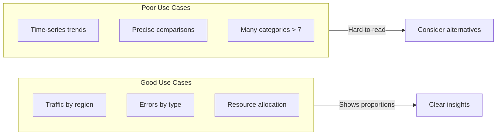
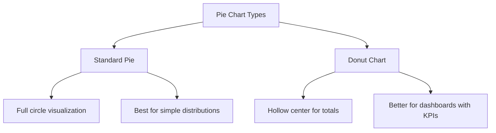
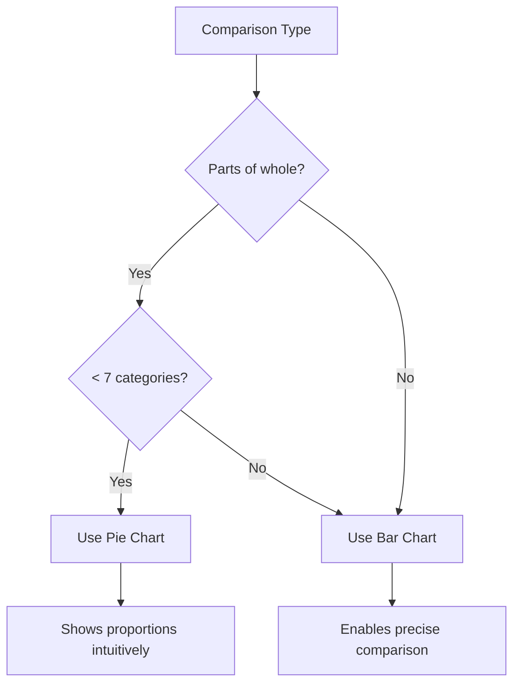

# How to Build Grafana Pie Chart Configurations

Author: [nawazdhandala](https://github.com/nawazdhandala)

Tags: Grafana, Observability, Dashboards, Visualization

Description: A complete guide to creating effective pie charts in Grafana for visualizing proportional data, resource allocation, and categorical distributions.

---

Pie charts in Grafana provide an intuitive way to visualize proportional relationships in your data. While time-series visualizations excel at showing trends, pie charts reveal how different categories contribute to a whole, making them ideal for resource allocation views, error breakdowns, and traffic distribution analysis.

## When to Use Pie Charts

Pie charts work best when you need to show parts of a whole. They answer questions like "What percentage of traffic goes to each region?" or "How are errors distributed across services?"



### Ideal Scenarios for Pie Charts

- Visualizing percentage breakdown of a metric
- Showing distribution across 3-7 categories
- Resource utilization by service or team
- Error types or status code distributions
- Geographic traffic distribution

### When to Avoid Pie Charts

- More than 7 categories (use bar chart instead)
- Comparing values across time (use line chart)
- Showing small differences between categories
- When precise value comparison is needed

## Creating Your First Pie Chart

### Step 1: Add a New Panel

Create a new panel in your Grafana dashboard and select "Pie chart" from the visualization dropdown. Grafana 9+ includes the pie chart as a core visualization type.

### Step 2: Configure Your Query

For a basic traffic distribution pie chart, start with a query that returns labeled values.

This Prometheus query aggregates total requests by service name over the last hour.

```promql
sum(increase(http_requests_total[1h])) by (service)
```

### Step 3: Set Display Options

Configure the pie chart to display labels and values in a readable format.

```json
{
  "type": "piechart",
  "title": "Traffic Distribution by Service",
  "options": {
    "pieType": "pie",
    "displayLabels": ["name", "percent"],
    "legend": {
      "displayMode": "table",
      "placement": "right",
      "values": ["value", "percent"]
    },
    "tooltip": {
      "mode": "single"
    }
  }
}
```

## Understanding Pie Chart Types

Grafana offers two main pie chart variants: standard pie and donut. Each serves different visualization needs.



### Standard Pie Chart

The standard pie chart fills the entire circle. Use this when you want maximum visual impact for each slice.

```json
{
  "options": {
    "pieType": "pie",
    "reduceOptions": {
      "calcs": ["lastNotNull"]
    }
  }
}
```

### Donut Chart

The donut chart includes a hollow center, which can display a total or summary value. This works well on dense dashboards where you want to show both distribution and aggregate metrics.

```json
{
  "options": {
    "pieType": "donut",
    "reduceOptions": {
      "calcs": ["lastNotNull"]
    }
  }
}
```

## Label Configuration Options

Labels determine what information appears on and around your pie chart. Grafana provides several display modes.

### Display Options

Configure which labels appear on the chart slices.

```json
{
  "options": {
    "displayLabels": ["name", "value", "percent"]
  }
}
```

Available label options include:

| Option | Description | Best For |
|--------|-------------|----------|
| name | Category label | Always recommended |
| value | Raw metric value | Technical dashboards |
| percent | Percentage of total | Executive dashboards |

### Label Positioning

Control where labels appear relative to the chart.

```json
{
  "options": {
    "displayLabels": ["name", "percent"],
    "legend": {
      "displayMode": "list",
      "placement": "bottom"
    }
  }
}
```

## Legend Configuration

The legend provides context for each slice. Configure it based on your dashboard layout and information density needs.

### Table Legend with Values

This configuration displays a detailed legend with both raw values and percentages in a table format.

```json
{
  "options": {
    "legend": {
      "displayMode": "table",
      "placement": "right",
      "values": ["value", "percent"],
      "calcs": ["lastNotNull"]
    }
  }
}
```

### Compact List Legend

For space-constrained dashboards, use a compact list legend.

```json
{
  "options": {
    "legend": {
      "displayMode": "list",
      "placement": "bottom",
      "values": []
    }
  }
}
```

### Hidden Legend

When labels on the chart provide sufficient context, hide the legend entirely.

```json
{
  "options": {
    "legend": {
      "displayMode": "hidden"
    }
  }
}
```

## Practical Pie Chart Patterns

### Pattern 1: Error Distribution by Type

Visualize how errors are distributed across different categories to prioritize debugging efforts.

This query groups error counts by error type for the selected time range.

```promql
sum(increase(http_requests_total{status=~"5.."}[1h])) by (status)
```

```json
{
  "type": "piechart",
  "title": "Error Distribution by Status Code",
  "targets": [
    {
      "expr": "sum(increase(http_requests_total{status=~\"5..\"}[1h])) by (status)",
      "legendFormat": "{{status}}"
    }
  ],
  "options": {
    "pieType": "pie",
    "displayLabels": ["name", "percent"],
    "legend": {
      "displayMode": "table",
      "placement": "right",
      "values": ["value", "percent"]
    }
  },
  "fieldConfig": {
    "overrides": [
      {"matcher": {"id": "byName", "options": "500"}, "properties": [{"id": "color", "value": {"fixedColor": "red", "mode": "fixed"}}]},
      {"matcher": {"id": "byName", "options": "502"}, "properties": [{"id": "color", "value": {"fixedColor": "orange", "mode": "fixed"}}]},
      {"matcher": {"id": "byName", "options": "503"}, "properties": [{"id": "color", "value": {"fixedColor": "yellow", "mode": "fixed"}}]}
    ]
  }
}
```

### Pattern 2: Resource Allocation by Team

Show how compute resources are distributed across different teams or projects.

```promql
sum(container_memory_usage_bytes) by (team) / 1024 / 1024 / 1024
```

```json
{
  "type": "piechart",
  "title": "Memory Usage by Team (GB)",
  "options": {
    "pieType": "donut",
    "displayLabels": ["name", "value"],
    "legend": {
      "displayMode": "table",
      "placement": "right",
      "values": ["value", "percent"]
    }
  },
  "fieldConfig": {
    "defaults": {
      "unit": "decgbytes",
      "decimals": 2
    }
  }
}
```

### Pattern 3: Traffic by Geographic Region

Visualize request distribution across different geographic regions for capacity planning.

```promql
sum(increase(http_requests_total[24h])) by (region)
```

```json
{
  "type": "piechart",
  "title": "Daily Traffic by Region",
  "options": {
    "pieType": "pie",
    "displayLabels": ["name", "percent"],
    "legend": {
      "displayMode": "list",
      "placement": "bottom"
    }
  }
}
```

### Pattern 4: Request Methods Distribution

Understand the mix of HTTP methods hitting your API endpoints.

```promql
sum(increase(http_requests_total{job="api-server"}[1h])) by (method)
```

```json
{
  "type": "piechart",
  "title": "Request Methods Distribution",
  "options": {
    "pieType": "pie",
    "displayLabels": ["name", "percent"]
  },
  "fieldConfig": {
    "overrides": [
      {"matcher": {"id": "byName", "options": "GET"}, "properties": [{"id": "color", "value": {"fixedColor": "green", "mode": "fixed"}}]},
      {"matcher": {"id": "byName", "options": "POST"}, "properties": [{"id": "color", "value": {"fixedColor": "blue", "mode": "fixed"}}]},
      {"matcher": {"id": "byName", "options": "PUT"}, "properties": [{"id": "color", "value": {"fixedColor": "yellow", "mode": "fixed"}}]},
      {"matcher": {"id": "byName", "options": "DELETE"}, "properties": [{"id": "color", "value": {"fixedColor": "red", "mode": "fixed"}}]}
    ]
  }
}
```

## Color Configuration

Colors help viewers quickly identify categories and can encode meaning (red for errors, green for success).

### Using Color Schemes

Grafana provides built-in color palettes that automatically assign colors to categories.

```json
{
  "fieldConfig": {
    "defaults": {
      "color": {
        "mode": "palette-classic"
      }
    }
  }
}
```

### Fixed Colors by Category

Assign specific colors to categories for consistent visualization across dashboards.

```json
{
  "fieldConfig": {
    "overrides": [
      {
        "matcher": {"id": "byName", "options": "production"},
        "properties": [
          {"id": "color", "value": {"fixedColor": "red", "mode": "fixed"}}
        ]
      },
      {
        "matcher": {"id": "byName", "options": "staging"},
        "properties": [
          {"id": "color", "value": {"fixedColor": "yellow", "mode": "fixed"}}
        ]
      },
      {
        "matcher": {"id": "byName", "options": "development"},
        "properties": [
          {"id": "color", "value": {"fixedColor": "green", "mode": "fixed"}}
        ]
      }
    ]
  }
}
```

## Value Reduction Options

When your query returns time-series data, you need to reduce it to single values for pie chart display.

### Common Reduction Calculations

| Calculation | Use Case |
|------------|----------|
| lastNotNull | Current state |
| sum | Total over period |
| mean | Average value |
| max | Peak value |

Configure the reduction calculation in your panel options.

```json
{
  "options": {
    "reduceOptions": {
      "values": false,
      "calcs": ["sum"],
      "fields": ""
    }
  }
}
```

## Handling Many Categories

When you have more than 7 categories, pie charts become difficult to read. Use these strategies to maintain clarity.

### Limit Top N Categories

Use a Prometheus query with topk to show only the most significant categories.

```promql
topk(5, sum(increase(http_requests_total[1h])) by (service))
```

### Group Small Categories as "Other"

Combine small slices into an "Other" category using recording rules or query transformations.

```yaml
# Prometheus recording rule
groups:
  - name: pie_chart_helpers
    rules:
      - record: service:requests:top5
        expr: |
          label_replace(
            topk(5, sum(increase(http_requests_total[1h])) by (service)),
            "category", "$1", "service", "(.*)"
          )
```

## Transformations for Pie Charts

Grafana transformations can reshape your data before visualization.

### Rename Fields for Better Labels

Use the "Rename by regex" transformation to create human-readable labels from metric names.

```json
{
  "transformations": [
    {
      "id": "renameByRegex",
      "options": {
        "regex": "(.*)_total",
        "renamePattern": "$1"
      }
    }
  ]
}
```

### Filter Zero Values

Remove categories with zero values to keep the chart clean.

```json
{
  "transformations": [
    {
      "id": "filterByValue",
      "options": {
        "filters": [
          {
            "fieldName": "Value",
            "config": {
              "id": "greater",
              "options": {"value": 0}
            }
          }
        ],
        "type": "include",
        "match": "any"
      }
    }
  ]
}
```

## Complete Dashboard Example

This complete panel configuration creates a production-ready pie chart for service traffic distribution.

```json
{
  "type": "piechart",
  "title": "Service Traffic Distribution",
  "description": "Shows the percentage of traffic handled by each service over the selected time range",
  "gridPos": {"h": 10, "w": 8, "x": 0, "y": 0},
  "datasource": "Prometheus",
  "targets": [
    {
      "expr": "sum(increase(http_requests_total{job=\"api-gateway\"}[$__range])) by (service)",
      "legendFormat": "{{service}}",
      "refId": "A"
    }
  ],
  "options": {
    "pieType": "donut",
    "displayLabels": ["name", "percent"],
    "tooltip": {
      "mode": "single"
    },
    "legend": {
      "displayMode": "table",
      "placement": "right",
      "values": ["value", "percent"],
      "calcs": ["sum"]
    },
    "reduceOptions": {
      "values": false,
      "calcs": ["sum"],
      "fields": ""
    }
  },
  "fieldConfig": {
    "defaults": {
      "unit": "short",
      "color": {
        "mode": "palette-classic"
      }
    }
  }
}
```

## Troubleshooting Common Issues

### Issue: Pie Chart Shows "No Data"

The chart appears empty even though the query returns data.

**Causes and Solutions:**

1. **Query returns time-series instead of instant values** - Add a reduction calculation
2. **All values are zero or null** - Check the time range and query filters
3. **Data format mismatch** - Ensure legend format extracts the correct label

Debug by checking your query in the Explore panel first.

```promql
# Debug: Check if data exists
sum(increase(http_requests_total[1h])) by (service) > 0
```

### Issue: Too Many Small Slices

The chart has many tiny slices that are hard to distinguish.

**Solution:** Limit categories using topk or aggregate small values.

```promql
# Show top 5 services plus aggregate others
topk(5, sum(increase(http_requests_total[1h])) by (service))
or
sum(increase(http_requests_total[1h])) * 0 + sum(sum(increase(http_requests_total[1h])) by (service)) - sum(topk(5, sum(increase(http_requests_total[1h])) by (service)))
```

### Issue: Percentages Do Not Add to 100%

Rounding can cause displayed percentages to sum to slightly more or less than 100%.

**Solution:** This is expected behavior with rounding. If precision is critical, display raw values instead of percentages.

```json
{
  "options": {
    "displayLabels": ["name", "value"]
  }
}
```

### Issue: Legend Values Incorrect

Legend shows unexpected values or calculations.

**Solution:** Explicitly set the calculation method in legend configuration.

```json
{
  "options": {
    "legend": {
      "calcs": ["sum"],
      "values": ["value", "percent"]
    }
  }
}
```

## Pie Charts vs Bar Charts

Understanding when to use pie charts versus bar charts helps you choose the right visualization.



| Aspect | Pie Chart | Bar Chart |
|--------|-----------|-----------|
| Best for | Proportions | Comparisons |
| Max categories | 5-7 | Unlimited |
| Precise values | Difficult | Easy |
| Part-to-whole | Excellent | Good |
| Trends over time | Not possible | Possible |

## Summary

Grafana pie charts transform categorical data into clear visual proportions. Key takeaways:

- Use pie charts for 3-7 categories showing parts of a whole
- Choose between standard pie and donut based on dashboard context
- Configure labels and legends for your audience
- Use color meaningfully to encode category types
- Apply topk or transformations when dealing with many categories
- Test your queries in Explore before building the panel

Start with simple traffic or error distribution charts, then expand to more complex scenarios as you understand how your data maps to slices. When pie charts become crowded, remember that bar charts often provide clearer comparisons.

---

**Related Reading:**

- [Logs, Metrics and Traces: The Three Pillars of Observability](https://oneuptime.com/blog/post/2025-08-20-three-pillars-of-observability-logs-metrics-traces/view)
- [SRE Metrics to Track](https://oneuptime.com/blog/post/2025-11-28-sre-metrics-to-track/view)
- [What is Site Reliability Engineering](https://oneuptime.com/blog/post/2025-11-28-what-is-site-reliability-engineering/view)
