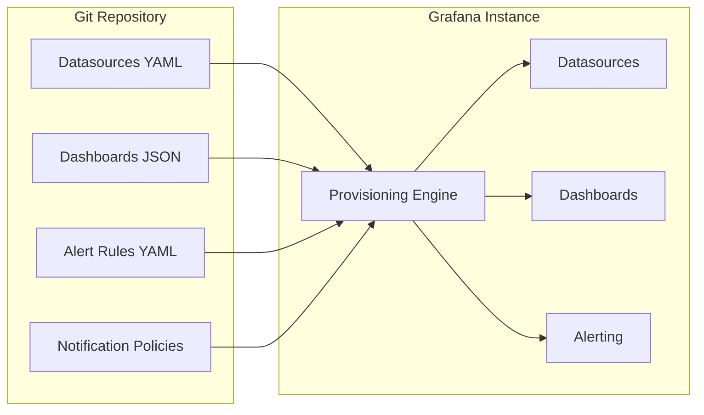
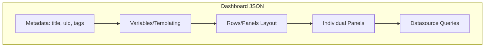
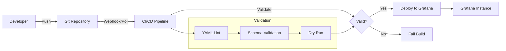

# How to Create Grafana Provisioning Automation

Author: [nawazdhandala](https://github.com/nawazdhandala)

Tags: Grafana, Provisioning, GitOps, Automation

Description: Learn to implement Grafana provisioning automation with YAML configuration, datasource and dashboard provisioning, and GitOps workflows.

---

Manual Grafana configuration does not scale. Every time you click through the UI to add a datasource or import a dashboard, you create configuration drift. Provisioning solves this by defining everything as code - datasources, dashboards, alert rules, and notification channels all live in version-controlled YAML files.

## How Provisioning Works



When Grafana starts, it reads YAML configuration files from the provisioning directory and applies them automatically. Changes to these files trigger updates without manual intervention.

## Directory Structure

Grafana expects provisioning files in a specific structure. The default location is `/etc/grafana/provisioning/`, but you can customize it via the `paths.provisioning` configuration option.

```
/etc/grafana/provisioning/
├── datasources/
│   ├── datasources.yaml
│   └── prometheus.yaml
├── dashboards/
│   ├── dashboards.yaml
│   └── default/
│       ├── node-exporter.json
│       └── kubernetes.json
├── alerting/
│   ├── alert-rules.yaml
│   └── contact-points.yaml
├── notifiers/
│   └── notifiers.yaml
└── plugins/
    └── plugins.yaml
```

Each subdirectory handles a specific configuration type. Grafana watches these directories and reloads configurations when files change.

## Provisioning Datasources

Datasources define where Grafana fetches metrics, logs, and traces. Create a YAML file in the `datasources/` directory.

### Basic Prometheus Datasource

`/etc/grafana/provisioning/datasources/prometheus.yaml`

```yaml
# API version for datasource provisioning
apiVersion: 1

# List of datasources to provision
datasources:
  - name: Prometheus
    type: prometheus
    access: proxy
    url: http://prometheus:9090
    isDefault: true
    editable: false  # Prevent UI modifications
    jsonData:
      timeInterval: "15s"
      httpMethod: POST
      manageAlerts: true
      prometheusType: Prometheus
      prometheusVersion: "2.45.0"
```

The `editable: false` setting is important for GitOps - it prevents manual changes that would create drift from your Git configuration.

### Multiple Datasources with Authentication

`/etc/grafana/provisioning/datasources/datasources.yaml`

```yaml
apiVersion: 1

# Delete datasources not defined in this file
deleteDatasources:
  - name: Old-Prometheus
    orgId: 1

datasources:
  # Prometheus for metrics
  - name: Prometheus
    type: prometheus
    access: proxy
    url: http://prometheus:9090
    isDefault: true
    editable: false
    jsonData:
      timeInterval: "15s"

  # Loki for logs
  - name: Loki
    type: loki
    access: proxy
    url: http://loki:3100
    editable: false
    jsonData:
      maxLines: 1000
      derivedFields:
        - datasourceUid: tempo
          matcherRegex: "traceID=(\\w+)"
          name: TraceID
          url: "$${__value.raw}"

  # Tempo for traces
  - name: Tempo
    uid: tempo
    type: tempo
    access: proxy
    url: http://tempo:3200
    editable: false
    jsonData:
      httpMethod: GET
      tracesToLogs:
        datasourceUid: loki
        tags: ["job", "instance"]
        mappedTags: [{ key: "service.name", value: "service" }]
        mapTagNamesEnabled: true
        spanStartTimeShift: "-1h"
        spanEndTimeShift: "1h"
        filterByTraceID: true
        filterBySpanID: false

  # InfluxDB with authentication
  - name: InfluxDB
    type: influxdb
    access: proxy
    url: http://influxdb:8086
    editable: false
    secureJsonData:
      token: ${INFLUXDB_TOKEN}  # Environment variable
    jsonData:
      version: Flux
      organization: myorg
      defaultBucket: metrics
```

### Using Environment Variables for Secrets

Grafana supports environment variable substitution in provisioning files. This keeps secrets out of Git.

```yaml
apiVersion: 1

datasources:
  - name: CloudWatch
    type: cloudwatch
    access: proxy
    editable: false
    jsonData:
      authType: keys
      defaultRegion: us-east-1
    secureJsonData:
      accessKey: ${AWS_ACCESS_KEY_ID}
      secretKey: ${AWS_SECRET_ACCESS_KEY}
```

Set the environment variables when running Grafana:

```bash
export AWS_ACCESS_KEY_ID="AKIA..."
export AWS_SECRET_ACCESS_KEY="..."
grafana-server
```

Or in Docker/Kubernetes:

```yaml
# Kubernetes Deployment
env:
  - name: AWS_ACCESS_KEY_ID
    valueFrom:
      secretKeyRef:
        name: grafana-secrets
        key: aws-access-key
  - name: AWS_SECRET_ACCESS_KEY
    valueFrom:
      secretKeyRef:
        name: grafana-secrets
        key: aws-secret-key
```

## Provisioning Dashboards

Dashboard provisioning works in two parts: a YAML file that tells Grafana where to find dashboards, and the actual dashboard JSON files.

### Dashboard Provider Configuration

`/etc/grafana/provisioning/dashboards/dashboards.yaml`

```yaml
apiVersion: 1

providers:
  # Default dashboards folder
  - name: "Default"
    orgId: 1
    folder: ""  # Root folder
    type: file
    disableDeletion: false
    updateIntervalSeconds: 30  # Check for changes every 30s
    allowUiUpdates: false      # Prevent UI modifications
    options:
      path: /etc/grafana/provisioning/dashboards/default

  # Infrastructure dashboards in a subfolder
  - name: "Infrastructure"
    orgId: 1
    folder: "Infrastructure"
    folderUid: "infrastructure"
    type: file
    disableDeletion: true      # Prevent deletion via UI
    updateIntervalSeconds: 30
    options:
      path: /etc/grafana/provisioning/dashboards/infrastructure

  # Application dashboards
  - name: "Applications"
    orgId: 1
    folder: "Applications"
    folderUid: "applications"
    type: file
    disableDeletion: true
    options:
      path: /etc/grafana/provisioning/dashboards/applications
```

### Dashboard JSON Structure



### Example Dashboard JSON

`/etc/grafana/provisioning/dashboards/default/node-metrics.json`

```json
{
  "uid": "node-metrics",
  "title": "Node Metrics",
  "tags": ["infrastructure", "nodes"],
  "timezone": "browser",
  "schemaVersion": 38,
  "version": 1,
  "refresh": "30s",
  "templating": {
    "list": [
      {
        "name": "instance",
        "type": "query",
        "datasource": {
          "type": "prometheus",
          "uid": "prometheus"
        },
        "query": "label_values(node_uname_info, instance)",
        "refresh": 2,
        "includeAll": true,
        "multi": true
      }
    ]
  },
  "panels": [
    {
      "id": 1,
      "title": "CPU Usage",
      "type": "timeseries",
      "gridPos": { "h": 8, "w": 12, "x": 0, "y": 0 },
      "datasource": {
        "type": "prometheus",
        "uid": "prometheus"
      },
      "targets": [
        {
          "expr": "100 - (avg by(instance) (rate(node_cpu_seconds_total{mode=\"idle\", instance=~\"$instance\"}[5m])) * 100)",
          "legendFormat": "{{instance}}"
        }
      ],
      "fieldConfig": {
        "defaults": {
          "unit": "percent",
          "min": 0,
          "max": 100,
          "thresholds": {
            "mode": "absolute",
            "steps": [
              { "color": "green", "value": null },
              { "color": "yellow", "value": 70 },
              { "color": "red", "value": 90 }
            ]
          }
        }
      }
    },
    {
      "id": 2,
      "title": "Memory Usage",
      "type": "gauge",
      "gridPos": { "h": 8, "w": 12, "x": 12, "y": 0 },
      "datasource": {
        "type": "prometheus",
        "uid": "prometheus"
      },
      "targets": [
        {
          "expr": "(1 - (node_memory_MemAvailable_bytes{instance=~\"$instance\"} / node_memory_MemTotal_bytes{instance=~\"$instance\"})) * 100",
          "legendFormat": "{{instance}}"
        }
      ],
      "fieldConfig": {
        "defaults": {
          "unit": "percent",
          "min": 0,
          "max": 100
        }
      }
    }
  ]
}
```

### Exporting Dashboards for Provisioning

If you have existing dashboards, export them via the Grafana API:

```bash
# Export a dashboard by UID
curl -s -H "Authorization: Bearer $GRAFANA_TOKEN" \
  "http://localhost:3000/api/dashboards/uid/node-metrics" | \
  jq '.dashboard' > node-metrics.json

# Export all dashboards
for uid in $(curl -s -H "Authorization: Bearer $GRAFANA_TOKEN" \
  "http://localhost:3000/api/search?type=dash-db" | jq -r '.[].uid'); do
  curl -s -H "Authorization: Bearer $GRAFANA_TOKEN" \
    "http://localhost:3000/api/dashboards/uid/$uid" | \
    jq '.dashboard' > "${uid}.json"
done
```

Before committing, remove fields that cause conflicts:

```bash
# Clean dashboard JSON for provisioning
jq 'del(.id, .version)' dashboard.json > cleaned-dashboard.json
```

## Provisioning Alert Rules

Grafana Alerting (Grafana 9+) uses a unified alerting system that can be fully provisioned.

### Alert Rules Configuration

`/etc/grafana/provisioning/alerting/alert-rules.yaml`

```yaml
apiVersion: 1

groups:
  - orgId: 1
    name: Infrastructure Alerts
    folder: Infrastructure
    interval: 1m
    rules:
      # High CPU Alert
      - uid: high-cpu-alert
        title: High CPU Usage
        condition: C
        data:
          - refId: A
            relativeTimeRange:
              from: 300
              to: 0
            datasourceUid: prometheus
            model:
              expr: 100 - (avg by(instance) (rate(node_cpu_seconds_total{mode="idle"}[5m])) * 100)
              instant: false
              intervalMs: 1000
              maxDataPoints: 43200
              refId: A
          - refId: B
            relativeTimeRange:
              from: 300
              to: 0
            datasourceUid: __expr__
            model:
              conditions:
                - evaluator:
                    params: []
                    type: gt
                  operator:
                    type: and
                  query:
                    params:
                      - B
                  reducer:
                    params: []
                    type: last
                  type: query
              datasource:
                type: __expr__
                uid: __expr__
              expression: A
              intervalMs: 1000
              maxDataPoints: 43200
              reducer: last
              refId: B
              type: reduce
          - refId: C
            relativeTimeRange:
              from: 300
              to: 0
            datasourceUid: __expr__
            model:
              conditions:
                - evaluator:
                    params:
                      - 80
                    type: gt
                  operator:
                    type: and
                  query:
                    params:
                      - C
                  reducer:
                    params: []
                    type: last
                  type: query
              datasource:
                type: __expr__
                uid: __expr__
              expression: B
              intervalMs: 1000
              maxDataPoints: 43200
              refId: C
              type: threshold
        noDataState: NoData
        execErrState: Error
        for: 5m
        annotations:
          summary: "High CPU usage on {{ $labels.instance }}"
          description: "CPU usage is {{ $values.B }}% on {{ $labels.instance }}"
        labels:
          severity: warning
          team: infrastructure

      # Memory Alert
      - uid: high-memory-alert
        title: High Memory Usage
        condition: C
        data:
          - refId: A
            datasourceUid: prometheus
            model:
              expr: (1 - (node_memory_MemAvailable_bytes / node_memory_MemTotal_bytes)) * 100
          - refId: B
            datasourceUid: __expr__
            model:
              expression: A
              reducer: last
              type: reduce
          - refId: C
            datasourceUid: __expr__
            model:
              expression: B
              type: threshold
              conditions:
                - evaluator:
                    params: [85]
                    type: gt
        for: 5m
        annotations:
          summary: "High memory usage on {{ $labels.instance }}"
        labels:
          severity: critical
```

### Contact Points Configuration

`/etc/grafana/provisioning/alerting/contact-points.yaml`

```yaml
apiVersion: 1

contactPoints:
  - orgId: 1
    name: slack-notifications
    receivers:
      - uid: slack-infra
        type: slack
        settings:
          recipient: "#infrastructure-alerts"
          token: ${SLACK_TOKEN}
          username: Grafana Alerts
        disableResolveMessage: false

      - uid: pagerduty-critical
        type: pagerduty
        settings:
          integrationKey: ${PAGERDUTY_KEY}
          severity: critical
          class: infrastructure
          component: monitoring

  - orgId: 1
    name: email-notifications
    receivers:
      - uid: email-ops
        type: email
        settings:
          addresses: ops@example.com;oncall@example.com
          singleEmail: true
```

### Notification Policies

`/etc/grafana/provisioning/alerting/notification-policies.yaml`

```yaml
apiVersion: 1

policies:
  - orgId: 1
    receiver: slack-notifications
    group_by:
      - grafana_folder
      - alertname
    group_wait: 30s
    group_interval: 5m
    repeat_interval: 4h
    routes:
      # Critical alerts go to PagerDuty
      - receiver: slack-notifications
        matchers:
          - severity = critical
        continue: true  # Also send to default
        routes:
          - receiver: pagerduty-critical
            matchers:
              - team = infrastructure

      # Warning alerts only to Slack
      - receiver: slack-notifications
        matchers:
          - severity = warning

      # Default catch-all
      - receiver: email-notifications
```

## GitOps Workflow



### Repository Structure for GitOps

```
grafana-config/
├── .github/
│   └── workflows/
│       └── deploy.yaml
├── base/
│   ├── datasources/
│   │   └── datasources.yaml
│   ├── dashboards/
│   │   ├── dashboards.yaml
│   │   └── default/
│   │       └── *.json
│   └── alerting/
│       ├── alert-rules.yaml
│       ├── contact-points.yaml
│       └── notification-policies.yaml
├── overlays/
│   ├── development/
│   │   └── kustomization.yaml
│   ├── staging/
│   │   └── kustomization.yaml
│   └── production/
│       └── kustomization.yaml
└── scripts/
    ├── validate.sh
    └── deploy.sh
```

### CI/CD Pipeline with GitHub Actions

`.github/workflows/deploy.yaml`

```yaml
name: Deploy Grafana Configuration

on:
  push:
    branches: [main]
    paths:
      - 'base/**'
      - 'overlays/**'
  pull_request:
    branches: [main]
    paths:
      - 'base/**'
      - 'overlays/**'

jobs:
  validate:
    runs-on: ubuntu-latest
    steps:
      - uses: actions/checkout@v4

      - name: Install yq
        run: |
          sudo wget -qO /usr/local/bin/yq \
            https://github.com/mikefarah/yq/releases/latest/download/yq_linux_amd64
          sudo chmod +x /usr/local/bin/yq

      - name: Validate YAML syntax
        run: |
          find . -name '*.yaml' -o -name '*.yml' | while read file; do
            echo "Validating $file"
            yq eval '.' "$file" > /dev/null
          done

      - name: Validate JSON syntax
        run: |
          find . -name '*.json' | while read file; do
            echo "Validating $file"
            jq '.' "$file" > /dev/null
          done

      - name: Check dashboard UIDs are unique
        run: |
          uids=$(find . -name '*.json' -exec jq -r '.uid // empty' {} \; | sort)
          duplicates=$(echo "$uids" | uniq -d)
          if [ -n "$duplicates" ]; then
            echo "Duplicate dashboard UIDs found: $duplicates"
            exit 1
          fi

  deploy-staging:
    needs: validate
    if: github.ref == 'refs/heads/main'
    runs-on: ubuntu-latest
    environment: staging
    steps:
      - uses: actions/checkout@v4

      - name: Deploy to Staging
        env:
          GRAFANA_URL: ${{ secrets.STAGING_GRAFANA_URL }}
          GRAFANA_TOKEN: ${{ secrets.STAGING_GRAFANA_TOKEN }}
        run: |
          ./scripts/deploy.sh staging

  deploy-production:
    needs: deploy-staging
    if: github.ref == 'refs/heads/main'
    runs-on: ubuntu-latest
    environment: production
    steps:
      - uses: actions/checkout@v4

      - name: Deploy to Production
        env:
          GRAFANA_URL: ${{ secrets.PROD_GRAFANA_URL }}
          GRAFANA_TOKEN: ${{ secrets.PROD_GRAFANA_TOKEN }}
        run: |
          ./scripts/deploy.sh production
```

### Deployment Script

`scripts/deploy.sh`

```bash
#!/bin/bash
set -euo pipefail

ENVIRONMENT=${1:-staging}
GRAFANA_URL=${GRAFANA_URL:-http://localhost:3000}
GRAFANA_TOKEN=${GRAFANA_TOKEN:-}

echo "Deploying to $ENVIRONMENT at $GRAFANA_URL"

# Deploy datasources
echo "Deploying datasources..."
for file in base/datasources/*.yaml; do
  if [ -f "$file" ]; then
    # Use Grafana Provisioning API or copy files
    echo "Processing $file"
  fi
done

# Deploy dashboards
echo "Deploying dashboards..."
find base/dashboards -name '*.json' | while read dashboard; do
  uid=$(jq -r '.uid' "$dashboard")
  title=$(jq -r '.title' "$dashboard")

  echo "Deploying dashboard: $title ($uid)"

  # Wrap dashboard in the expected format
  payload=$(jq -n --argjson dashboard "$(cat "$dashboard")" \
    '{dashboard: $dashboard, overwrite: true, folderUid: ""}')

  curl -s -X POST \
    -H "Authorization: Bearer $GRAFANA_TOKEN" \
    -H "Content-Type: application/json" \
    -d "$payload" \
    "$GRAFANA_URL/api/dashboards/db" | jq .
done

# Deploy alert rules
echo "Deploying alert rules..."
if [ -f "base/alerting/alert-rules.yaml" ]; then
  curl -s -X POST \
    -H "Authorization: Bearer $GRAFANA_TOKEN" \
    -H "Content-Type: application/yaml" \
    --data-binary @base/alerting/alert-rules.yaml \
    "$GRAFANA_URL/api/v1/provisioning/alert-rules"
fi

echo "Deployment complete"
```

## Kubernetes Deployment

### ConfigMap for Provisioning Files

```yaml
apiVersion: v1
kind: ConfigMap
metadata:
  name: grafana-datasources
  namespace: monitoring
data:
  datasources.yaml: |
    apiVersion: 1
    datasources:
      - name: Prometheus
        type: prometheus
        access: proxy
        url: http://prometheus-server:9090
        isDefault: true
        editable: false

---
apiVersion: v1
kind: ConfigMap
metadata:
  name: grafana-dashboards-provider
  namespace: monitoring
data:
  dashboards.yaml: |
    apiVersion: 1
    providers:
      - name: default
        folder: ''
        type: file
        disableDeletion: false
        options:
          path: /var/lib/grafana/dashboards

---
apiVersion: v1
kind: ConfigMap
metadata:
  name: grafana-dashboards
  namespace: monitoring
data:
  node-metrics.json: |
    {
      "uid": "node-metrics",
      "title": "Node Metrics",
      "panels": []
    }
```

### Grafana Deployment with Provisioning Volumes

```yaml
apiVersion: apps/v1
kind: Deployment
metadata:
  name: grafana
  namespace: monitoring
spec:
  replicas: 1
  selector:
    matchLabels:
      app: grafana
  template:
    metadata:
      labels:
        app: grafana
    spec:
      containers:
        - name: grafana
          image: grafana/grafana:10.2.0
          ports:
            - containerPort: 3000
          env:
            - name: GF_SECURITY_ADMIN_PASSWORD
              valueFrom:
                secretKeyRef:
                  name: grafana-secrets
                  key: admin-password
            - name: SLACK_TOKEN
              valueFrom:
                secretKeyRef:
                  name: grafana-secrets
                  key: slack-token
          volumeMounts:
            # Datasources provisioning
            - name: datasources
              mountPath: /etc/grafana/provisioning/datasources
              readOnly: true
            # Dashboard provider config
            - name: dashboard-provider
              mountPath: /etc/grafana/provisioning/dashboards
              readOnly: true
            # Dashboard JSON files
            - name: dashboards
              mountPath: /var/lib/grafana/dashboards
              readOnly: true
            # Alerting rules
            - name: alerting
              mountPath: /etc/grafana/provisioning/alerting
              readOnly: true
      volumes:
        - name: datasources
          configMap:
            name: grafana-datasources
        - name: dashboard-provider
          configMap:
            name: grafana-dashboards-provider
        - name: dashboards
          configMap:
            name: grafana-dashboards
        - name: alerting
          configMap:
            name: grafana-alerting
```

### Using Helm for Grafana Provisioning

The Grafana Helm chart has built-in support for provisioning:

```yaml
# values.yaml
grafana:
  adminPassword: ${GRAFANA_ADMIN_PASSWORD}

  datasources:
    datasources.yaml:
      apiVersion: 1
      datasources:
        - name: Prometheus
          type: prometheus
          url: http://prometheus-server:9090
          access: proxy
          isDefault: true

        - name: Loki
          type: loki
          url: http://loki:3100
          access: proxy

  dashboardProviders:
    dashboardproviders.yaml:
      apiVersion: 1
      providers:
        - name: default
          orgId: 1
          folder: ''
          type: file
          disableDeletion: false
          editable: false
          options:
            path: /var/lib/grafana/dashboards/default

  dashboardsConfigMaps:
    default: grafana-dashboards

  alerting:
    contactpoints.yaml:
      apiVersion: 1
      contactPoints:
        - orgId: 1
          name: slack
          receivers:
            - uid: slack
              type: slack
              settings:
                recipient: "#alerts"
                token: $SLACK_TOKEN

    rules.yaml:
      apiVersion: 1
      groups:
        - orgId: 1
          name: default
          folder: Infrastructure
          interval: 1m
          rules: []
```

Install with Helm:

```bash
helm repo add grafana https://grafana.github.io/helm-charts
helm repo update

helm upgrade --install grafana grafana/grafana \
  --namespace monitoring \
  --create-namespace \
  -f values.yaml \
  --set adminPassword="${GRAFANA_ADMIN_PASSWORD}"
```

## Best Practices

### 1. Use Consistent UIDs

Always set explicit UIDs for dashboards and datasources. This ensures updates work correctly and prevents duplicates.

```json
{
  "uid": "node-exporter-full",
  "title": "Node Exporter Full"
}
```

### 2. Disable UI Editing for Provisioned Resources

Set `editable: false` for datasources and `allowUiUpdates: false` for dashboard providers. This enforces GitOps - all changes must go through version control.

### 3. Version Your Dashboards

Include version metadata in your dashboards:

```json
{
  "uid": "my-dashboard",
  "title": "My Dashboard",
  "version": 1,
  "tags": ["v1.0.0"]
}
```

### 4. Separate Environments

Use Kustomize or Helm overlays to manage environment-specific configurations:

```yaml
# overlays/production/kustomization.yaml
apiVersion: kustomize.config.k8s.io/v1beta1
kind: Kustomization
resources:
  - ../../base
patches:
  - path: datasources-patch.yaml
```

### 5. Validate Before Deploying

Always validate YAML and JSON syntax in CI before deployment. Check for duplicate UIDs and missing required fields.

### 6. Use Environment Variables for Secrets

Never commit secrets to Git. Use environment variable substitution:

```yaml
secureJsonData:
  password: ${DB_PASSWORD}
```

---

Grafana provisioning transforms monitoring configuration into infrastructure as code. Start with datasources, then add dashboards, and finally alert rules. Once everything lives in Git, you get full audit history, peer review for changes, and consistent deployments across environments. No more configuration drift, no more manual clicks.
