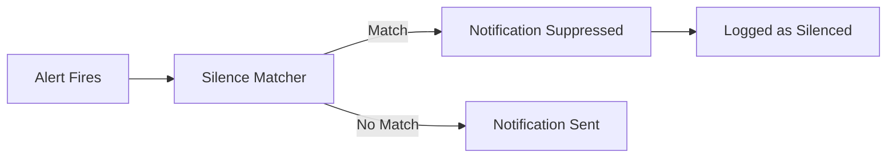
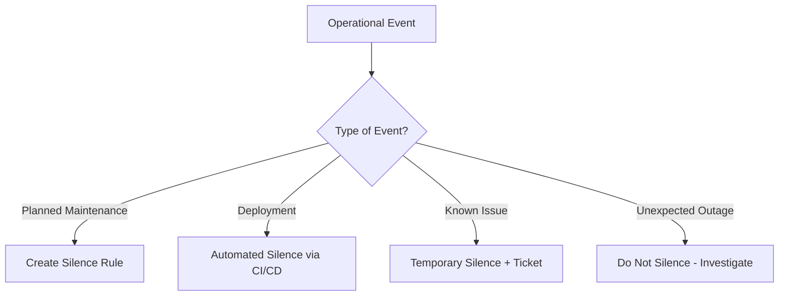
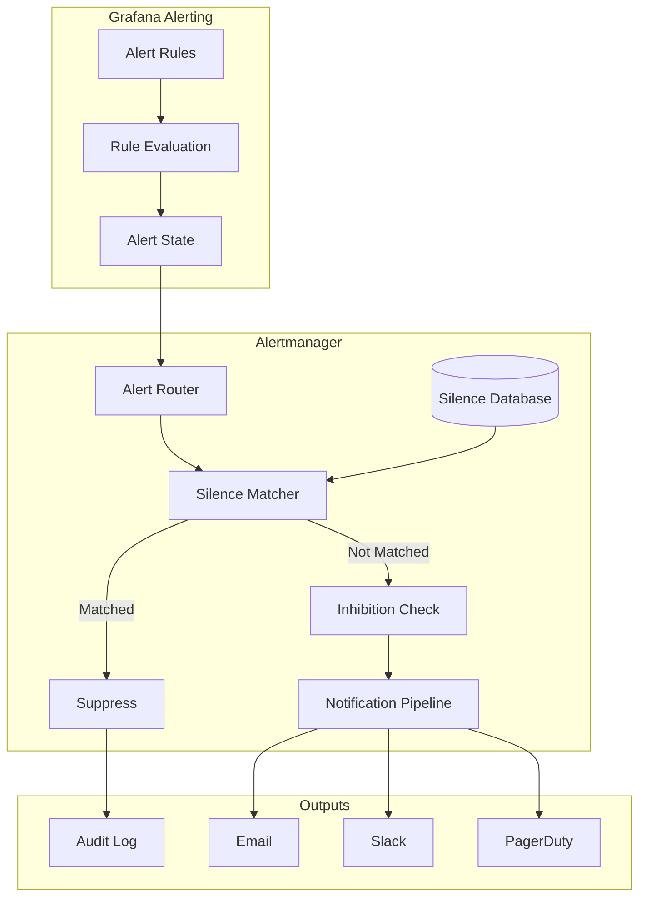
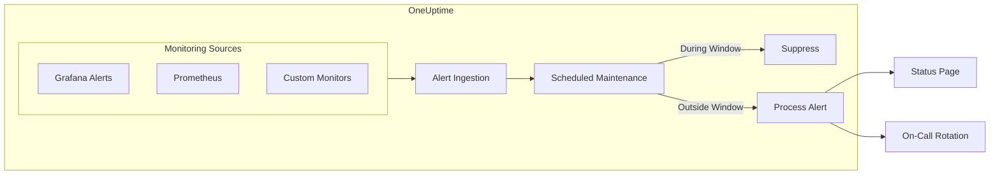

# How to Implement Grafana Silence Rules

Author: [nawazdhandala](https://github.com/nawazdhandala)

Tags: Grafana, Alerting, Silence Rules, Maintenance

Description: A comprehensive guide to implementing Grafana silence rules for managing alert noise during maintenance windows, deployments, and known issues. Learn how to create, automate, and manage silences effectively.

---

> Alert fatigue kills incident response. When alerts fire during planned maintenance or known issues, teams learn to ignore them. Grafana silence rules let you temporarily suppress alerts without losing the underlying monitoring. Use them wisely to keep your alerting system trustworthy.

Silence rules are essential for operational sanity. Here is how to implement them properly.

---

## What Are Grafana Silence Rules?

Silence rules in Grafana temporarily suppress alert notifications based on matching criteria. They do not disable the underlying alert evaluation - alerts still fire internally, but notifications are muted. This distinction is critical: your monitoring continues to work, but you avoid noise during expected disruptions.



---

## When to Use Silence Rules

Silence rules are appropriate for several scenarios:

- **Planned maintenance windows** - Server reboots, database migrations, network changes
- **Deployments** - Expected brief disruptions during rollouts
- **Known issues** - Problems already being addressed that do not need repeated alerts
- **Testing and development** - Preventing noise from non-production environments
- **Scheduled downtime** - Customer-communicated maintenance periods



---

## Creating Silence Rules via Grafana UI

### Step 1: Access the Alerting Section

Navigate to Grafana and access the alerting section:

1. Open your Grafana instance
2. Click on **Alerting** in the left sidebar
3. Select **Silences** from the submenu
4. Click **Create silence** button

### Step 2: Configure Matchers

Matchers determine which alerts the silence applies to. You can match on any alert label:

```yaml
# Example matcher configurations
# Match by alertname
alertname = HighCPUUsage

# Match by severity
severity = warning

# Match by service
service = payment-api

# Match by environment
environment = staging

# Regex matching
instance =~ "web-server-[0-9]+"
```

### Step 3: Set Duration

Specify how long the silence should last:

```yaml
# Duration options
starts: 2026-01-30T10:00:00Z
ends: 2026-01-30T12:00:00Z

# Or use relative duration
duration: 2h
```

### Step 4: Add Context

Always add meaningful comments explaining why the silence exists:

```yaml
comment: "Planned database migration - ticket OPS-1234"
createdBy: "nawazdhandala"
```

---

## Creating Silences via API

For automation and integration with CI/CD pipelines, use the Grafana Alertmanager API.

### Basic API Request

```bash
# Create a silence via API
curl -X POST "https://grafana.example.com/api/alertmanager/grafana/api/v2/silences" \
  -H "Authorization: Bearer ${GRAFANA_API_TOKEN}" \
  -H "Content-Type: application/json" \
  -d '{
    "matchers": [
      {
        "name": "alertname",
        "value": "HighCPUUsage",
        "isRegex": false,
        "isEqual": true
      },
      {
        "name": "environment",
        "value": "production",
        "isRegex": false,
        "isEqual": true
      }
    ],
    "startsAt": "2026-01-30T10:00:00Z",
    "endsAt": "2026-01-30T12:00:00Z",
    "createdBy": "deployment-pipeline",
    "comment": "Automated silence for deployment v2.5.0"
  }'
```

### Python Implementation

Create silences programmatically with Python:

```python
# grafana_silence.py
import requests
from datetime import datetime, timedelta
from typing import List, Dict, Optional
import os

class GrafanaSilenceManager:
    """Manage Grafana silence rules via API"""

    def __init__(self, grafana_url: str, api_token: str):
        self.base_url = grafana_url.rstrip('/')
        self.headers = {
            "Authorization": f"Bearer {api_token}",
            "Content-Type": "application/json"
        }
        self.alertmanager_url = f"{self.base_url}/api/alertmanager/grafana/api/v2"

    def create_silence(
        self,
        matchers: List[Dict],
        duration_minutes: int,
        comment: str,
        created_by: str
    ) -> Dict:
        """
        Create a new silence rule.

        Args:
            matchers: List of label matchers
            duration_minutes: How long the silence should last
            comment: Explanation for the silence
            created_by: Who or what created this silence

        Returns:
            API response with silence ID
        """
        now = datetime.utcnow()
        ends_at = now + timedelta(minutes=duration_minutes)

        payload = {
            "matchers": matchers,
            "startsAt": now.strftime("%Y-%m-%dT%H:%M:%SZ"),
            "endsAt": ends_at.strftime("%Y-%m-%dT%H:%M:%SZ"),
            "createdBy": created_by,
            "comment": comment
        }

        response = requests.post(
            f"{self.alertmanager_url}/silences",
            headers=self.headers,
            json=payload
        )
        response.raise_for_status()
        return response.json()

    def create_maintenance_silence(
        self,
        service: str,
        duration_minutes: int,
        ticket_id: str
    ) -> Dict:
        """
        Create a silence for planned maintenance.

        Args:
            service: Service name to silence
            duration_minutes: Maintenance window duration
            ticket_id: Reference to maintenance ticket

        Returns:
            API response with silence ID
        """
        matchers = [
            {
                "name": "service",
                "value": service,
                "isRegex": False,
                "isEqual": True
            }
        ]

        return self.create_silence(
            matchers=matchers,
            duration_minutes=duration_minutes,
            comment=f"Planned maintenance - {ticket_id}",
            created_by="maintenance-automation"
        )

    def list_silences(self, filter_query: Optional[str] = None) -> List[Dict]:
        """
        List all active and pending silences.

        Args:
            filter_query: Optional filter string

        Returns:
            List of silence objects
        """
        params = {}
        if filter_query:
            params["filter"] = filter_query

        response = requests.get(
            f"{self.alertmanager_url}/silences",
            headers=self.headers,
            params=params
        )
        response.raise_for_status()
        return response.json()

    def delete_silence(self, silence_id: str) -> bool:
        """
        Delete (expire) a silence before its scheduled end time.

        Args:
            silence_id: ID of the silence to delete

        Returns:
            True if successful
        """
        response = requests.delete(
            f"{self.alertmanager_url}/silence/{silence_id}",
            headers=self.headers
        )
        response.raise_for_status()
        return True

    def get_silence(self, silence_id: str) -> Dict:
        """
        Get details of a specific silence.

        Args:
            silence_id: ID of the silence

        Returns:
            Silence details
        """
        response = requests.get(
            f"{self.alertmanager_url}/silence/{silence_id}",
            headers=self.headers
        )
        response.raise_for_status()
        return response.json()


# Usage example
if __name__ == "__main__":
    manager = GrafanaSilenceManager(
        grafana_url=os.getenv("GRAFANA_URL", "https://grafana.example.com"),
        api_token=os.getenv("GRAFANA_API_TOKEN")
    )

    # Create a silence for payment service maintenance
    result = manager.create_maintenance_silence(
        service="payment-api",
        duration_minutes=60,
        ticket_id="OPS-1234"
    )

    print(f"Created silence: {result['silenceID']}")
```

---

## Automating Silences in CI/CD Pipelines

Integrate silence creation with your deployment pipelines to automatically suppress alerts during rollouts.

### GitHub Actions Example

```yaml
# .github/workflows/deploy.yml
name: Deploy with Silence

on:
  push:
    branches: [main]

jobs:
  deploy:
    runs-on: ubuntu-latest
    steps:
      - name: Checkout
        uses: actions/checkout@v4

      - name: Create deployment silence
        id: silence
        run: |
          # Create silence for 15 minutes during deployment
          RESPONSE=$(curl -s -X POST \
            "${{ secrets.GRAFANA_URL }}/api/alertmanager/grafana/api/v2/silences" \
            -H "Authorization: Bearer ${{ secrets.GRAFANA_API_TOKEN }}" \
            -H "Content-Type: application/json" \
            -d '{
              "matchers": [
                {
                  "name": "service",
                  "value": "${{ github.event.repository.name }}",
                  "isRegex": false,
                  "isEqual": true
                }
              ],
              "startsAt": "'$(date -u +%Y-%m-%dT%H:%M:%SZ)'",
              "endsAt": "'$(date -u -d '+15 minutes' +%Y-%m-%dT%H:%M:%SZ)'",
              "createdBy": "github-actions",
              "comment": "Deployment ${{ github.sha }}"
            }')
          echo "silence_id=$(echo $RESPONSE | jq -r '.silenceID')" >> $GITHUB_OUTPUT

      - name: Deploy application
        run: |
          # Your deployment commands here
          kubectl apply -f k8s/
          kubectl rollout status deployment/myapp

      - name: Expire silence early on success
        if: success()
        run: |
          # If deployment succeeds quickly, expire the silence
          curl -X DELETE \
            "${{ secrets.GRAFANA_URL }}/api/alertmanager/grafana/api/v2/silence/${{ steps.silence.outputs.silence_id }}" \
            -H "Authorization: Bearer ${{ secrets.GRAFANA_API_TOKEN }}"
```

### Kubernetes Job for Scheduled Maintenance

```yaml
# maintenance-silence-job.yaml
apiVersion: batch/v1
kind: CronJob
metadata:
  name: weekly-maintenance-silence
spec:
  schedule: "0 2 * * 0"  # Every Sunday at 2 AM
  jobTemplate:
    spec:
      template:
        spec:
          containers:
          - name: silence-creator
            image: curlimages/curl:latest
            env:
            - name: GRAFANA_URL
              valueFrom:
                secretKeyRef:
                  name: grafana-credentials
                  key: url
            - name: GRAFANA_TOKEN
              valueFrom:
                secretKeyRef:
                  name: grafana-credentials
                  key: token
            command:
            - /bin/sh
            - -c
            - |
              START_TIME=$(date -u +%Y-%m-%dT%H:%M:%SZ)
              END_TIME=$(date -u -d '+4 hours' +%Y-%m-%dT%H:%M:%SZ)

              curl -X POST "${GRAFANA_URL}/api/alertmanager/grafana/api/v2/silences" \
                -H "Authorization: Bearer ${GRAFANA_TOKEN}" \
                -H "Content-Type: application/json" \
                -d '{
                  "matchers": [
                    {
                      "name": "maintenance_window",
                      "value": "weekly",
                      "isRegex": false,
                      "isEqual": true
                    }
                  ],
                  "startsAt": "'"${START_TIME}"'",
                  "endsAt": "'"${END_TIME}"'",
                  "createdBy": "k8s-cronjob",
                  "comment": "Weekly maintenance window"
                }'
          restartPolicy: OnFailure
```

---

## Advanced Matcher Patterns

### Regex Matching

Use regex for flexible matching across multiple services or instances:

```python
# Silence all staging alerts
matchers = [
    {
        "name": "environment",
        "value": "staging|dev|test",
        "isRegex": True,
        "isEqual": True
    }
]

# Silence specific instance pattern
matchers = [
    {
        "name": "instance",
        "value": "web-server-[0-9]+\\.us-east-1\\.example\\.com",
        "isRegex": True,
        "isEqual": True
    }
]

# Silence all non-critical alerts during maintenance
matchers = [
    {
        "name": "severity",
        "value": "critical",
        "isRegex": False,
        "isEqual": False  # NOT equal - matches warning, info, etc.
    }
]
```

### Multi-Label Matching

Combine multiple matchers for precise targeting:

```python
# Silence CPU alerts for specific service in production only
matchers = [
    {
        "name": "alertname",
        "value": "HighCPUUsage",
        "isRegex": False,
        "isEqual": True
    },
    {
        "name": "service",
        "value": "data-processor",
        "isRegex": False,
        "isEqual": True
    },
    {
        "name": "environment",
        "value": "production",
        "isRegex": False,
        "isEqual": True
    }
]
```

---

## Silence Rule Management Best Practices

### 1. Always Include Context

Every silence should have a meaningful comment:

```python
def create_silence_with_context(
    manager: GrafanaSilenceManager,
    matchers: List[Dict],
    duration_minutes: int,
    reason: str,
    ticket_id: str,
    created_by: str
) -> Dict:
    """Create silence with required context"""

    comment = f"{reason} | Ticket: {ticket_id} | Created: {datetime.utcnow().isoformat()}"

    return manager.create_silence(
        matchers=matchers,
        duration_minutes=duration_minutes,
        comment=comment,
        created_by=created_by
    )
```

### 2. Set Appropriate Durations

Avoid overly long silences that hide real problems:

```python
# Duration guidelines
DURATION_GUIDELINES = {
    "deployment": 15,           # 15 minutes for standard deployments
    "database_migration": 60,   # 1 hour for migrations
    "server_reboot": 10,        # 10 minutes for reboots
    "network_maintenance": 120, # 2 hours for network work
    "max_allowed": 480          # Never exceed 8 hours without review
}

def validate_silence_duration(duration_minutes: int, silence_type: str) -> int:
    """Ensure silence duration is appropriate"""

    recommended = DURATION_GUIDELINES.get(silence_type, 30)
    max_allowed = DURATION_GUIDELINES["max_allowed"]

    if duration_minutes > max_allowed:
        raise ValueError(
            f"Silence duration {duration_minutes}m exceeds maximum {max_allowed}m. "
            "Create multiple shorter silences instead."
        )

    if duration_minutes > recommended * 2:
        print(f"Warning: Duration {duration_minutes}m is longer than recommended {recommended}m")

    return duration_minutes
```

### 3. Implement Silence Auditing

Track silence creation and expiration for operational awareness:

```python
# silence_audit.py
import logging
from datetime import datetime
from typing import Dict

logger = logging.getLogger(__name__)

def audit_silence_creation(silence_data: Dict, created_by: str):
    """Log silence creation for audit trail"""

    log_entry = {
        "event": "silence_created",
        "timestamp": datetime.utcnow().isoformat(),
        "silence_id": silence_data.get("silenceID"),
        "created_by": created_by,
        "matchers": silence_data.get("matchers"),
        "starts_at": silence_data.get("startsAt"),
        "ends_at": silence_data.get("endsAt"),
        "comment": silence_data.get("comment")
    }

    logger.info("Silence created", extra=log_entry)

    # Send to audit system
    send_to_audit_system(log_entry)

def audit_silence_deletion(silence_id: str, deleted_by: str, reason: str):
    """Log silence deletion for audit trail"""

    log_entry = {
        "event": "silence_deleted",
        "timestamp": datetime.utcnow().isoformat(),
        "silence_id": silence_id,
        "deleted_by": deleted_by,
        "reason": reason
    }

    logger.info("Silence deleted", extra=log_entry)
    send_to_audit_system(log_entry)
```

### 4. Implement Automatic Cleanup

Prevent silence accumulation with regular cleanup:

```python
# silence_cleanup.py
from datetime import datetime, timedelta
from typing import List

def cleanup_expired_silences(manager: GrafanaSilenceManager) -> List[str]:
    """Remove silences that have been expired for more than 7 days"""

    silences = manager.list_silences()
    cleaned = []
    cutoff = datetime.utcnow() - timedelta(days=7)

    for silence in silences:
        if silence["status"]["state"] == "expired":
            ends_at = datetime.fromisoformat(
                silence["endsAt"].replace("Z", "+00:00")
            )

            if ends_at.replace(tzinfo=None) < cutoff:
                # Note: Grafana auto-cleans, but this is for custom cleanup logic
                cleaned.append(silence["id"])
                logger.info(f"Cleaned expired silence: {silence['id']}")

    return cleaned

def alert_on_long_running_silences(
    manager: GrafanaSilenceManager,
    max_hours: int = 24
) -> List[Dict]:
    """Find silences that have been active too long"""

    silences = manager.list_silences()
    long_running = []
    now = datetime.utcnow()

    for silence in silences:
        if silence["status"]["state"] == "active":
            starts_at = datetime.fromisoformat(
                silence["startsAt"].replace("Z", "+00:00")
            )

            duration = now - starts_at.replace(tzinfo=None)

            if duration > timedelta(hours=max_hours):
                long_running.append({
                    "id": silence["id"],
                    "comment": silence["comment"],
                    "duration_hours": duration.total_seconds() / 3600,
                    "created_by": silence["createdBy"]
                })

    if long_running:
        logger.warning(
            f"Found {len(long_running)} silences active for more than {max_hours} hours",
            extra={"silences": long_running}
        )

    return long_running
```

---

## Silence Rules Architecture

Understanding how silences integrate with Grafana Alertmanager:



---

## Terraform Configuration

Manage silences as infrastructure with Terraform:

```hcl
# grafana_silences.tf
terraform {
  required_providers {
    grafana = {
      source  = "grafana/grafana"
      version = "~> 2.0"
    }
  }
}

provider "grafana" {
  url  = var.grafana_url
  auth = var.grafana_api_token
}

# Recurring maintenance window silence
resource "grafana_silence" "weekly_maintenance" {
  comment    = "Weekly maintenance window - every Sunday 2-6 AM UTC"
  created_by = "terraform"

  starts_at = "2026-01-30T02:00:00Z"
  ends_at   = "2026-01-30T06:00:00Z"

  matcher {
    name    = "maintenance_window"
    value   = "weekly"
    is_equal = true
    is_regex = false
  }
}

# Environment-specific silence for staging
resource "grafana_silence" "staging_low_priority" {
  comment    = "Suppress warning-level alerts in staging during business hours"
  created_by = "terraform"

  starts_at = "2026-01-30T09:00:00Z"
  ends_at   = "2026-01-30T17:00:00Z"

  matcher {
    name    = "environment"
    value   = "staging"
    is_equal = true
    is_regex = false
  }

  matcher {
    name    = "severity"
    value   = "warning"
    is_equal = true
    is_regex = false
  }
}

# Variables
variable "grafana_url" {
  description = "Grafana instance URL"
  type        = string
}

variable "grafana_api_token" {
  description = "Grafana API token"
  type        = string
  sensitive   = true
}
```

---

## Monitoring Your Silences

Track silence usage to prevent abuse and ensure operational awareness:

```python
# silence_metrics.py
from opentelemetry import metrics
from typing import Callable

meter = metrics.get_meter(__name__)

# Track active silences
active_silences_gauge = meter.create_observable_gauge(
    name="grafana.silences.active",
    description="Number of currently active silences",
    callbacks=[observe_active_silences]
)

# Track silence creation rate
silence_created_counter = meter.create_counter(
    name="grafana.silences.created",
    description="Number of silences created",
    unit="1"
)

# Track silence duration
silence_duration_histogram = meter.create_histogram(
    name="grafana.silences.duration",
    description="Duration of silences in minutes",
    unit="min"
)

def observe_active_silences(options) -> None:
    """Callback to observe current active silence count"""
    manager = GrafanaSilenceManager(
        grafana_url=os.getenv("GRAFANA_URL"),
        api_token=os.getenv("GRAFANA_API_TOKEN")
    )

    silences = manager.list_silences()
    active = sum(1 for s in silences if s["status"]["state"] == "active")
    pending = sum(1 for s in silences if s["status"]["state"] == "pending")

    yield metrics.Observation(active, {"state": "active"})
    yield metrics.Observation(pending, {"state": "pending"})

def record_silence_created(matchers: list, duration_minutes: int, created_by: str):
    """Record metrics when a silence is created"""

    silence_created_counter.add(1, {
        "created_by": created_by,
        "matcher_count": str(len(matchers))
    })

    silence_duration_histogram.record(duration_minutes, {
        "created_by": created_by
    })
```

---

## Common Pitfalls to Avoid

### 1. Overly Broad Matchers

```python
# BAD: Silences ALL alerts
matchers = [
    {
        "name": "alertname",
        "value": ".*",
        "isRegex": True,
        "isEqual": True
    }
]

# GOOD: Specific to the affected service and alert type
matchers = [
    {
        "name": "alertname",
        "value": "HighCPUUsage",
        "isRegex": False,
        "isEqual": True
    },
    {
        "name": "service",
        "value": "batch-processor",
        "isRegex": False,
        "isEqual": True
    }
]
```

### 2. Indefinite Silences

```python
# BAD: Very long silence that will be forgotten
def create_indefinite_silence():
    return manager.create_silence(
        matchers=matchers,
        duration_minutes=43200,  # 30 days!
        comment="Temporary fix",
        created_by="developer"
    )

# GOOD: Short silence with clear context
def create_bounded_silence():
    return manager.create_silence(
        matchers=matchers,
        duration_minutes=60,
        comment="Database migration - ticket OPS-1234 - expected 45min",
        created_by="ops-team"
    )
```

### 3. Missing Documentation

```python
# BAD: No context for why silence exists
comment = "silence"

# GOOD: Full context including ticket, expected duration, and owner
comment = "Planned PostgreSQL upgrade from 14 to 15 | Ticket: OPS-5678 | Owner: database-team | Expected: 90min"
```

---

## Integration with OneUptime

OneUptime provides built-in scheduled maintenance features that work alongside Grafana silences:



Configure your Grafana silences to complement OneUptime maintenance windows for comprehensive alert management across your monitoring stack.

---

## Summary

Implementing Grafana silence rules effectively requires:

1. **Precise matchers** - Target specific alerts, not broad categories
2. **Appropriate durations** - Keep silences as short as possible
3. **Clear documentation** - Always include ticket references and context
4. **Automation** - Integrate with CI/CD for deployment silences
5. **Auditing** - Track silence creation and usage
6. **Regular review** - Clean up stale silences and review long-running ones

Silence rules are a tool for managing expected noise, not hiding problems. Use them to maintain trust in your alerting system while avoiding alert fatigue during planned disruptions.

---

*Need comprehensive alert management beyond silences? [OneUptime](https://oneuptime.com) provides scheduled maintenance windows, on-call rotation, and status page integration to keep your team and users informed during planned and unplanned incidents.*
