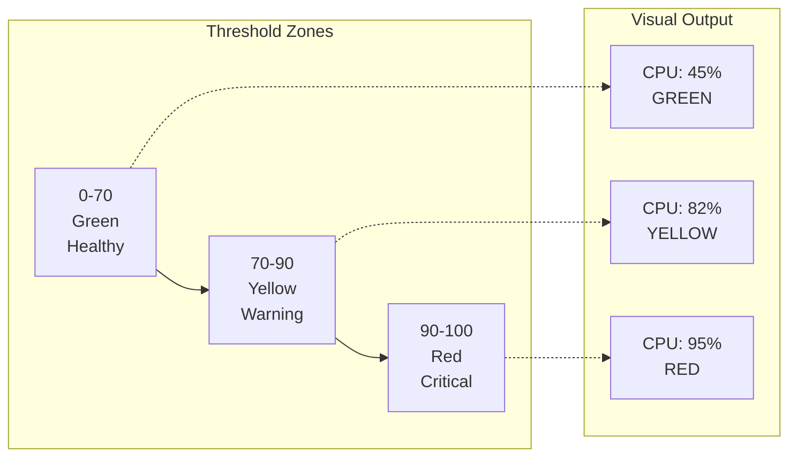
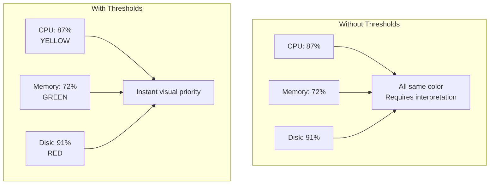
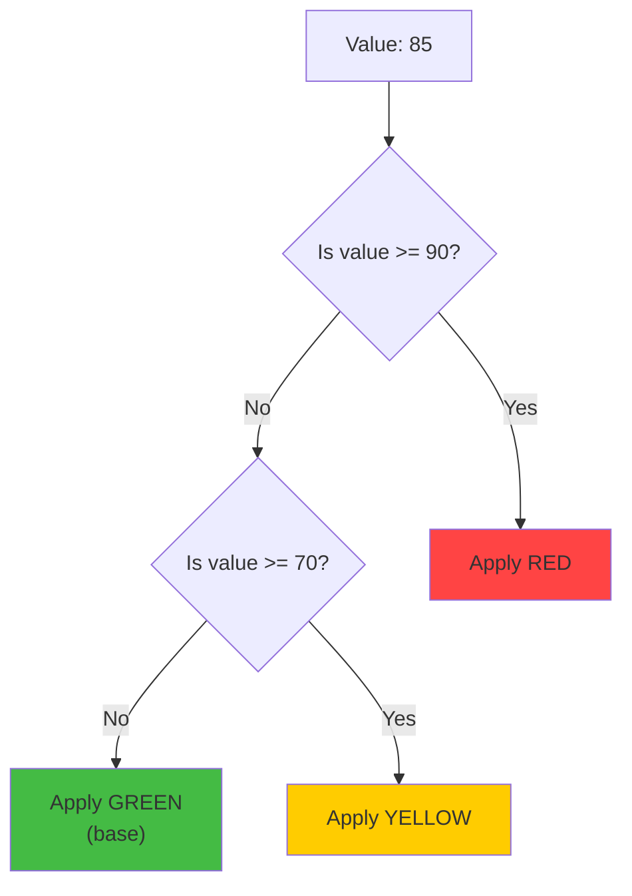
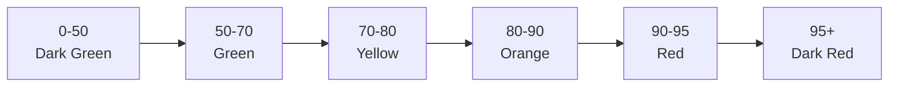
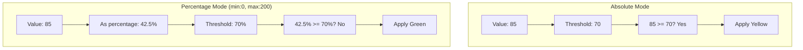
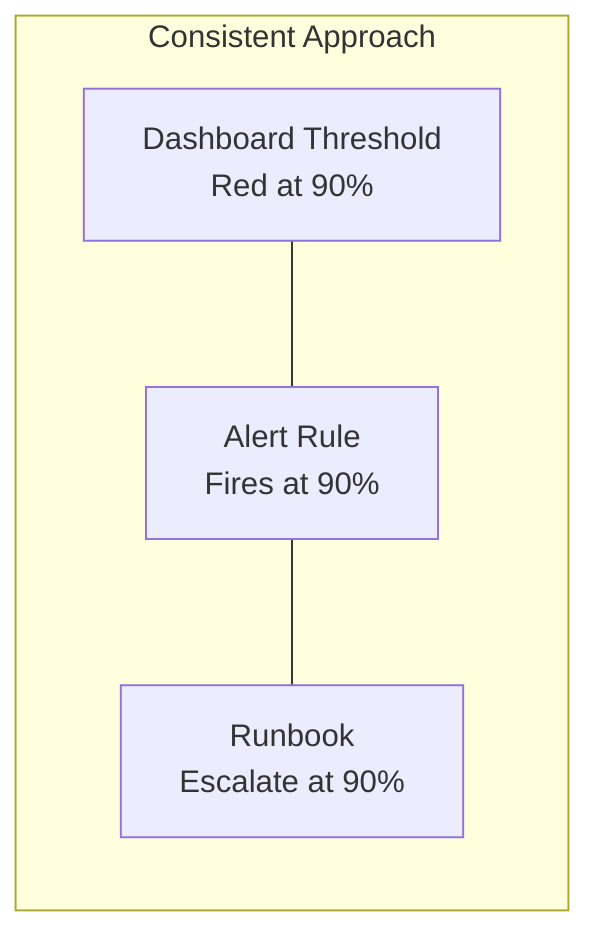

# How to Build Grafana Stat Panel Thresholds

Author: [nawazdhandala](https://github.com/nawazdhandala)

Tags: Grafana, Observability, Dashboards, Visualization

Description: Learn how to configure Grafana stat panel thresholds to create dynamic, color-coded dashboards that instantly communicate system health at a glance.

---

> Dashboards should tell you what is wrong before you have to ask. **Thresholds transform raw numbers into visual stories.**

Grafana stat panels are one of the most powerful visualization tools for displaying single-value metrics. When combined with properly configured thresholds, they become instant health indicators that communicate system status at a glance. This guide walks you through everything you need to know about building effective stat panel thresholds.

---

## Table of Contents

1. What are Stat Panel Thresholds?
2. Why Thresholds Matter for Observability
3. How Threshold Evaluation Works
4. Basic Threshold Configuration
5. Advanced Threshold Patterns
6. Value Mappings vs Thresholds
7. Threshold Modes Explained
8. Dynamic Thresholds with Variables
9. Common Threshold Patterns by Metric Type
10. Best Practices and Anti-Patterns
11. Complete Examples
12. Summary

---

## 1. What are Stat Panel Thresholds?

Thresholds in Grafana stat panels define color boundaries that change the visual appearance of your metric based on its current value. They answer the question: "Is this value good, warning-level, or critical?"

| Concept | Description |
|---------|-------------|
| Threshold | A numeric boundary that triggers a color change |
| Base Color | The default color when value is below the first threshold |
| Threshold Mode | How thresholds are evaluated (absolute or percentage) |
| Color Scheme | The gradient or discrete colors applied to values |



---

## 2. Why Thresholds Matter for Observability

Without thresholds, dashboards become walls of numbers that require mental processing. With thresholds, they become instant status boards.

**Without thresholds:**
- You see "CPU: 87%" and have to decide if that is bad
- Every metric requires context and institutional knowledge
- New team members struggle to interpret dashboards
- Incident response is slower because problems do not jump out

**With thresholds:**
- Yellow CPU panel instantly signals "pay attention"
- Red panels scream "action required now"
- Anyone can glance at a dashboard and understand health
- On-call engineers can triage faster



---

## 3. How Threshold Evaluation Works

Grafana evaluates thresholds from highest to lowest. The first threshold that the current value exceeds determines the color.

**Evaluation order example:**

Thresholds defined:
- Base (Green): 0
- Warning (Yellow): 70
- Critical (Red): 90

For a value of 85:
1. Is 85 >= 90? No, skip red
2. Is 85 >= 70? Yes, apply yellow
3. Result: Yellow



---

## 4. Basic Threshold Configuration

Here is how to configure basic thresholds in Grafana through the UI and JSON.

### UI Configuration Steps

1. Create or edit a stat panel
2. Navigate to Panel options in the right sidebar
3. Find the "Thresholds" section
4. Click "Add threshold" to add new boundaries
5. Set values and colors for each threshold

### JSON Configuration

The following JSON snippet shows how thresholds are defined in a Grafana dashboard. You can use this when provisioning dashboards or exporting configurations.

```json
{
  "fieldConfig": {
    "defaults": {
      "thresholds": {
        "mode": "absolute",
        "steps": [
          {
            "color": "green",
            "value": null
          },
          {
            "color": "yellow",
            "value": 70
          },
          {
            "color": "red",
            "value": 90
          }
        ]
      }
    }
  }
}
```

Key points about the JSON structure:
- The first step with `value: null` is the base color (applied when below all other thresholds)
- Steps are evaluated from highest value to lowest
- Colors can be named colors ("green", "red") or hex codes ("#44bb44")

### Standard Three-Tier Threshold

The most common pattern uses three tiers that map to traffic light colors.

| Threshold | Color | Meaning | Action |
|-----------|-------|---------|--------|
| Base | Green | Healthy | No action needed |
| 70 | Yellow | Warning | Investigate soon |
| 90 | Red | Critical | Immediate action |

---

## 5. Advanced Threshold Patterns

### Inverse Thresholds (Lower is Worse)

Some metrics are bad when they go down, not up. Examples include availability percentage, success rate, and remaining disk space.

```json
{
  "thresholds": {
    "mode": "absolute",
    "steps": [
      {
        "color": "red",
        "value": null
      },
      {
        "color": "yellow",
        "value": 95
      },
      {
        "color": "green",
        "value": 99
      }
    ]
  }
}
```

This configuration means:
- Below 95%: Red (critical)
- 95% to 99%: Yellow (warning)
- Above 99%: Green (healthy)

### Multi-Level Thresholds

For more granular status indication, use more than three levels.

```json
{
  "thresholds": {
    "mode": "absolute",
    "steps": [
      { "color": "dark-green", "value": null },
      { "color": "green", "value": 50 },
      { "color": "yellow", "value": 70 },
      { "color": "orange", "value": 80 },
      { "color": "red", "value": 90 },
      { "color": "dark-red", "value": 95 }
    ]
  }
}
```



---

## 6. Value Mappings vs Thresholds

Thresholds color based on numeric ranges. Value mappings transform values into text and can also apply colors. Use them together for powerful visualizations.

### When to Use Value Mappings

- Converting numeric states to text (0 = "Down", 1 = "Up")
- Handling special values (null, NaN, empty)
- Displaying human-readable status labels

### Combined Example

The following configuration uses both value mappings and thresholds for a service health check that returns 0, 1, or 2.

```json
{
  "fieldConfig": {
    "defaults": {
      "mappings": [
        {
          "type": "value",
          "options": {
            "0": { "text": "DOWN", "color": "red" },
            "1": { "text": "DEGRADED", "color": "yellow" },
            "2": { "text": "HEALTHY", "color": "green" }
          }
        }
      ],
      "thresholds": {
        "mode": "absolute",
        "steps": [
          { "color": "red", "value": null },
          { "color": "yellow", "value": 1 },
          { "color": "green", "value": 2 }
        ]
      }
    }
  }
}
```

---

## 7. Threshold Modes Explained

Grafana supports two threshold modes: absolute and percentage.

### Absolute Mode

Values are compared directly against threshold numbers. This is the default and most common mode.

```json
{
  "thresholds": {
    "mode": "absolute",
    "steps": [
      { "color": "green", "value": null },
      { "color": "red", "value": 1000 }
    ]
  }
}
```

Use absolute mode for:
- CPU percentage (0-100)
- Error counts
- Latency in milliseconds
- Any metric with a known, fixed scale

### Percentage Mode

Values are compared as percentages of the configured min/max range. Useful when the scale varies.

```json
{
  "fieldConfig": {
    "defaults": {
      "min": 0,
      "max": 100,
      "thresholds": {
        "mode": "percentage",
        "steps": [
          { "color": "green", "value": null },
          { "color": "yellow", "value": 70 },
          { "color": "red", "value": 90 }
        ]
      }
    }
  }
}
```

Use percentage mode for:
- Metrics with variable scales
- Normalized comparisons across different systems
- When you want thresholds relative to data range



---

## 8. Dynamic Thresholds with Variables

You can make thresholds dynamic using Grafana variables, but this requires using overrides or calculated thresholds in queries.

### Using Query-Based Thresholds

One approach is to calculate threshold values in your query and use special series names.

Prometheus query example that includes threshold lines:

```promql
# Main metric
avg(rate(http_requests_total{status="500"}[5m])) * 100

# Warning threshold (as separate series)
vector(5) # 5% error rate warning

# Critical threshold (as separate series)
vector(10) # 10% error rate critical
```

### Using Overrides for Different Hosts

You can apply different thresholds to different series using field overrides.

```json
{
  "overrides": [
    {
      "matcher": {
        "id": "byName",
        "options": "production-server"
      },
      "properties": [
        {
          "id": "thresholds",
          "value": {
            "mode": "absolute",
            "steps": [
              { "color": "green", "value": null },
              { "color": "red", "value": 80 }
            ]
          }
        }
      ]
    },
    {
      "matcher": {
        "id": "byName",
        "options": "staging-server"
      },
      "properties": [
        {
          "id": "thresholds",
          "value": {
            "mode": "absolute",
            "steps": [
              { "color": "green", "value": null },
              { "color": "red", "value": 95 }
            ]
          }
        }
      ]
    }
  ]
}
```

---

## 9. Common Threshold Patterns by Metric Type

### CPU Usage

Standard server CPU thresholds. Higher values indicate more load.

```json
{
  "thresholds": {
    "steps": [
      { "color": "green", "value": null },
      { "color": "yellow", "value": 70 },
      { "color": "orange", "value": 85 },
      { "color": "red", "value": 95 }
    ]
  }
}
```

### Memory Usage

Similar to CPU but often with different tolerance levels.

```json
{
  "thresholds": {
    "steps": [
      { "color": "green", "value": null },
      { "color": "yellow", "value": 75 },
      { "color": "red", "value": 90 }
    ]
  }
}
```

### Disk Usage

Disk thresholds should trigger earlier because disk exhaustion is catastrophic.

```json
{
  "thresholds": {
    "steps": [
      { "color": "green", "value": null },
      { "color": "yellow", "value": 70 },
      { "color": "orange", "value": 80 },
      { "color": "red", "value": 90 }
    ]
  }
}
```

### Latency (p99 in milliseconds)

Response time thresholds depend heavily on your SLO. This example targets a 200ms SLO.

```json
{
  "thresholds": {
    "steps": [
      { "color": "green", "value": null },
      { "color": "yellow", "value": 150 },
      { "color": "orange", "value": 200 },
      { "color": "red", "value": 500 }
    ]
  }
}
```

### Error Rate (percentage)

Error rates should have tight thresholds since even small increases matter.

```json
{
  "thresholds": {
    "steps": [
      { "color": "green", "value": null },
      { "color": "yellow", "value": 1 },
      { "color": "orange", "value": 3 },
      { "color": "red", "value": 5 }
    ]
  }
}
```

### Availability/Uptime (percentage) - Inverse

High values are good. Uses inverse coloring.

```json
{
  "thresholds": {
    "steps": [
      { "color": "red", "value": null },
      { "color": "orange", "value": 95 },
      { "color": "yellow", "value": 99 },
      { "color": "green", "value": 99.9 }
    ]
  }
}
```

### Request Queue Length

Queue depth indicates backpressure. Thresholds depend on your system capacity.

```json
{
  "thresholds": {
    "steps": [
      { "color": "green", "value": null },
      { "color": "yellow", "value": 100 },
      { "color": "orange", "value": 500 },
      { "color": "red", "value": 1000 }
    ]
  }
}
```

---

## 10. Best Practices and Anti-Patterns

### Best Practices

**1. Align thresholds with alerting rules**

Your stat panel thresholds should match your alerting thresholds. If an alert fires at 90% CPU, the panel should turn red at 90%.



**2. Use semantic colors consistently**

| Color | Meaning | Use For |
|-------|---------|---------|
| Green | Healthy | Normal operating range |
| Yellow | Warning | Needs attention soon |
| Orange | Elevated | Approaching critical |
| Red | Critical | Immediate action required |
| Blue | Info | Neutral information |

**3. Document your threshold rationale**

Add panel descriptions explaining why specific thresholds were chosen.

**4. Review and adjust thresholds quarterly**

System capacity and baselines change. Thresholds that made sense six months ago may cause alert fatigue or miss problems today.

**5. Consider time-based context**

What is normal during peak hours may be abnormal at 3 AM. Consider separate panels or conditional formatting for different time windows.

### Anti-Patterns to Avoid

**1. Too many threshold levels**

More than 4-5 levels creates confusion. Keep it simple.

```json
// BAD: Too granular
{
  "steps": [
    { "color": "dark-green", "value": null },
    { "color": "green", "value": 20 },
    { "color": "light-green", "value": 40 },
    { "color": "yellow", "value": 60 },
    { "color": "light-orange", "value": 70 },
    { "color": "orange", "value": 80 },
    { "color": "light-red", "value": 85 },
    { "color": "red", "value": 90 },
    { "color": "dark-red", "value": 95 }
  ]
}

// GOOD: Clear and actionable
{
  "steps": [
    { "color": "green", "value": null },
    { "color": "yellow", "value": 70 },
    { "color": "red", "value": 90 }
  ]
}
```

**2. Thresholds that do not align with alerts**

If your panel shows green but alerts are firing (or vice versa), users lose trust in dashboards.

**3. Using arbitrary "nice" numbers**

Thresholds at 50, 75, 100 feel clean but may not reflect actual system behavior. Base thresholds on observed data and SLOs.

**4. Forgetting inverse metrics**

Availability, success rate, and remaining capacity metrics need inverse thresholds (lower is worse).

**5. Setting and forgetting**

Thresholds need periodic review as systems evolve.

---

## 11. Complete Examples

### Example 1: Service Health Dashboard Panel

This complete stat panel configuration shows service availability with appropriate thresholds and formatting.

```json
{
  "type": "stat",
  "title": "Service Availability",
  "description": "Current service availability percentage. SLO target: 99.9%",
  "datasource": {
    "type": "prometheus",
    "uid": "prometheus"
  },
  "targets": [
    {
      "expr": "avg(up{job=\"my-service\"}) * 100",
      "refId": "A"
    }
  ],
  "fieldConfig": {
    "defaults": {
      "unit": "percent",
      "decimals": 2,
      "min": 0,
      "max": 100,
      "color": {
        "mode": "thresholds"
      },
      "thresholds": {
        "mode": "absolute",
        "steps": [
          { "color": "red", "value": null },
          { "color": "orange", "value": 95 },
          { "color": "yellow", "value": 99 },
          { "color": "green", "value": 99.9 }
        ]
      },
      "mappings": [
        {
          "type": "special",
          "options": {
            "match": "null",
            "result": {
              "text": "No Data",
              "color": "gray"
            }
          }
        }
      ]
    }
  },
  "options": {
    "reduceOptions": {
      "calcs": ["lastNotNull"],
      "fields": "",
      "values": false
    },
    "orientation": "auto",
    "textMode": "auto",
    "colorMode": "background",
    "graphMode": "none",
    "justifyMode": "auto"
  }
}
```

### Example 2: Multi-Metric Overview Row

This example shows how to configure a row of stat panels for quick system overview.

```json
{
  "panels": [
    {
      "type": "stat",
      "title": "CPU",
      "gridPos": { "x": 0, "y": 0, "w": 4, "h": 4 },
      "targets": [
        {
          "expr": "100 - (avg(rate(node_cpu_seconds_total{mode=\"idle\"}[5m])) * 100)"
        }
      ],
      "fieldConfig": {
        "defaults": {
          "unit": "percent",
          "thresholds": {
            "steps": [
              { "color": "green", "value": null },
              { "color": "yellow", "value": 70 },
              { "color": "red", "value": 90 }
            ]
          }
        }
      }
    },
    {
      "type": "stat",
      "title": "Memory",
      "gridPos": { "x": 4, "y": 0, "w": 4, "h": 4 },
      "targets": [
        {
          "expr": "(1 - (node_memory_MemAvailable_bytes / node_memory_MemTotal_bytes)) * 100"
        }
      ],
      "fieldConfig": {
        "defaults": {
          "unit": "percent",
          "thresholds": {
            "steps": [
              { "color": "green", "value": null },
              { "color": "yellow", "value": 75 },
              { "color": "red", "value": 90 }
            ]
          }
        }
      }
    },
    {
      "type": "stat",
      "title": "Disk",
      "gridPos": { "x": 8, "y": 0, "w": 4, "h": 4 },
      "targets": [
        {
          "expr": "(1 - (node_filesystem_avail_bytes{mountpoint=\"/\"} / node_filesystem_size_bytes{mountpoint=\"/\"})) * 100"
        }
      ],
      "fieldConfig": {
        "defaults": {
          "unit": "percent",
          "thresholds": {
            "steps": [
              { "color": "green", "value": null },
              { "color": "yellow", "value": 70 },
              { "color": "red", "value": 85 }
            ]
          }
        }
      }
    },
    {
      "type": "stat",
      "title": "Error Rate",
      "gridPos": { "x": 12, "y": 0, "w": 4, "h": 4 },
      "targets": [
        {
          "expr": "sum(rate(http_requests_total{status=~\"5..\"}[5m])) / sum(rate(http_requests_total[5m])) * 100"
        }
      ],
      "fieldConfig": {
        "defaults": {
          "unit": "percent",
          "decimals": 2,
          "thresholds": {
            "steps": [
              { "color": "green", "value": null },
              { "color": "yellow", "value": 1 },
              { "color": "red", "value": 5 }
            ]
          }
        }
      }
    },
    {
      "type": "stat",
      "title": "P99 Latency",
      "gridPos": { "x": 16, "y": 0, "w": 4, "h": 4 },
      "targets": [
        {
          "expr": "histogram_quantile(0.99, sum(rate(http_request_duration_seconds_bucket[5m])) by (le)) * 1000"
        }
      ],
      "fieldConfig": {
        "defaults": {
          "unit": "ms",
          "thresholds": {
            "steps": [
              { "color": "green", "value": null },
              { "color": "yellow", "value": 200 },
              { "color": "red", "value": 500 }
            ]
          }
        }
      }
    },
    {
      "type": "stat",
      "title": "Requests/sec",
      "gridPos": { "x": 20, "y": 0, "w": 4, "h": 4 },
      "targets": [
        {
          "expr": "sum(rate(http_requests_total[5m]))"
        }
      ],
      "fieldConfig": {
        "defaults": {
          "unit": "reqps",
          "thresholds": {
            "steps": [
              { "color": "blue", "value": null }
            ]
          }
        }
      }
    }
  ]
}
```

### Example 3: SLO Compliance Panel

This panel shows SLO compliance with detailed thresholds matching your error budget.

```json
{
  "type": "stat",
  "title": "SLO Compliance (30d)",
  "description": "Percentage of successful requests over the past 30 days. Target: 99.9%",
  "targets": [
    {
      "expr": "(1 - (sum(increase(http_requests_total{status=~\"5..\"}[30d])) / sum(increase(http_requests_total[30d])))) * 100"
    }
  ],
  "fieldConfig": {
    "defaults": {
      "unit": "percent",
      "decimals": 3,
      "thresholds": {
        "mode": "absolute",
        "steps": [
          { "color": "red", "value": null },
          { "color": "orange", "value": 99 },
          { "color": "yellow", "value": 99.5 },
          { "color": "#73BF69", "value": 99.9 },
          { "color": "green", "value": 99.95 }
        ]
      },
      "mappings": [
        {
          "type": "range",
          "options": {
            "from": 99.9,
            "to": 100,
            "result": {
              "index": 0,
              "text": "${__value.text} (Meeting SLO)"
            }
          }
        },
        {
          "type": "range",
          "options": {
            "from": 0,
            "to": 99.9,
            "result": {
              "index": 1,
              "text": "${__value.text} (Below SLO)"
            }
          }
        }
      ]
    }
  },
  "options": {
    "colorMode": "background",
    "graphMode": "area",
    "orientation": "horizontal"
  }
}
```

---

## 12. Summary

| Topic | Key Takeaway |
|-------|--------------|
| Purpose | Thresholds transform numbers into instant visual health indicators |
| Evaluation | Grafana checks from highest threshold down, first match wins |
| Modes | Use absolute for fixed scales, percentage for relative scales |
| Colors | Stick to semantic colors: green (good), yellow (warning), red (critical) |
| Alignment | Match thresholds with alert rules for consistency |
| Inverse Metrics | Remember that some metrics are bad when low (availability, success rate) |
| Maintenance | Review thresholds quarterly as systems and baselines change |

### Quick Reference

```json
// Standard threshold pattern
{
  "thresholds": {
    "mode": "absolute",
    "steps": [
      { "color": "green", "value": null },
      { "color": "yellow", "value": 70 },
      { "color": "red", "value": 90 }
    ]
  }
}

// Inverse threshold pattern (high is good)
{
  "thresholds": {
    "mode": "absolute",
    "steps": [
      { "color": "red", "value": null },
      { "color": "yellow", "value": 95 },
      { "color": "green", "value": 99 }
    ]
  }
}
```

---

*Looking to centralize your observability stack with built-in dashboards and alerting? [OneUptime](https://oneuptime.com) provides integrated monitoring, status pages, and incident management with full OpenTelemetry support - no Grafana configuration required.*

---

### Related Reading

- [Three Pillars of Observability: Logs, Metrics & Traces](https://oneuptime.com/blog/post/2025-08-20-three-pillars-of-observability-logs-metrics-traces/view)
- [SRE Metrics to Track](https://oneuptime.com/blog/post/2025-11-28-sre-metrics-to-track/view)
- [Monitoring vs Observability for SRE](https://oneuptime.com/blog/post/2025-11-28-monitoring-vs-observability-sre/view)
