# How to Build Grafana State Timeline Panels

Author: [nawazdhandala](https://github.com/nawazdhandala)

Tags: Grafana, Observability, Dashboards, Visualization

Description: A hands-on guide to building State Timeline panels in Grafana for visualizing service states, deployment statuses, and system health over time.

You just deployed a new release. Everything looks green. But wait, was there a brief blip at 3:47 AM? Did the payment service flicker between healthy and degraded? Your line graphs show averages, but they hide the real story: the *state transitions* that matter most during incidents.

Enter Grafana's **State Timeline panel**, a visualization designed specifically for showing discrete states over time. Unlike line charts that show continuous values, State Timeline panels excel at answering: "What state was my system in, and when did it change?"

This guide walks you through building effective State Timeline panels, from basic setup to advanced configurations that make incident response faster and status pages clearer.

## What is a State Timeline Panel?

The State Timeline panel displays categorical data as horizontal bars that change color based on state. Think of it as a Gantt chart for your system's health.

```mermaid
gantt
    title Service Health Timeline
    dateFormat  HH:mm
    axisFormat %H:%M
    section API Gateway
    Healthy           :done, 00:00, 02:30
    Degraded          :active, 02:30, 02:45
    Healthy           :done, 02:45, 06:00
    section Payment Service
    Healthy           :done, 00:00, 03:00
    Down              :crit, 03:00, 03:15
    Healthy           :done, 03:15, 06:00
    section Database
    Healthy           :done, 00:00, 06:00
```



Perfect use cases for State Timeline panels include:

- **Service availability**: Healthy, Degraded, Down
- **Deployment status**: Deploying, Running, Failed, Rolled Back
- **Feature flags**: Enabled, Disabled, Canary
- **On-call schedules**: Who was on-call during an incident
- **CI/CD pipelines**: Queued, Building, Testing, Deployed
- **Kubernetes pod states**: Running, Pending, CrashLoopBackOff

## Setting Up Your First State Timeline

Start by creating a new panel and selecting "State timeline" from the visualization dropdown. The key requirement is that your data must represent discrete states, not continuous metrics.

Here is a basic PromQL query that converts a numeric gauge into states:

```promql
# Convert response time to state categories
label_replace(
  label_replace(
    label_replace(
      up{job="api-gateway"},
      "state", "down", "up", "0"
    ),
    "state", "healthy", "up", "1"
  ),
  "state", "unknown", "up", ""
)
```

For a cleaner approach, use recording rules to pre-compute states. Add this to your Prometheus rules file:

```yaml
groups:
  - name: service_states
    interval: 15s
    rules:
      - record: service:state
        expr: |
          label_replace(
            vector(1) and on() up{job="api-gateway"} == 1,
            "state", "healthy", "", ""
          )
          or
          label_replace(
            vector(1) and on() up{job="api-gateway"} == 0,
            "state", "down", "", ""
          )
          or
          label_replace(
            vector(1) and on() absent(up{job="api-gateway"}),
            "state", "unknown", "", ""
          )
```

## Data Format Requirements

State Timeline panels work best with data in specific formats. The panel expects either:

1. **String values** representing state names directly
2. **Numeric values** that you map to states using Value Mappings

Here is an example of the ideal data structure:

```json
{
  "time": ["2026-01-30T10:00:00Z", "2026-01-30T10:05:00Z", "2026-01-30T10:10:00Z"],
  "service": ["api-gateway", "api-gateway", "api-gateway"],
  "state": ["healthy", "degraded", "healthy"]
}
```

If your data source returns numeric codes, use Grafana's Value Mappings feature to translate them.

## Configuring Value Mappings

Value mappings transform raw data into meaningful state labels with colors. Navigate to the panel options and find the "Value mappings" section.

Set up mappings for numeric status codes:

| Value | Display Text | Color |
|-------|-------------|-------|
| 0 | Down | Red |
| 1 | Healthy | Green |
| 2 | Degraded | Yellow |
| 3 | Maintenance | Blue |
| null | Unknown | Gray |

The configuration in JSON format looks like this:

```json
{
  "mappings": [
    {
      "type": "value",
      "options": {
        "0": { "text": "Down", "color": "red" }
      }
    },
    {
      "type": "value",
      "options": {
        "1": { "text": "Healthy", "color": "green" }
      }
    },
    {
      "type": "value",
      "options": {
        "2": { "text": "Degraded", "color": "yellow" }
      }
    },
    {
      "type": "range",
      "options": {
        "from": 3,
        "to": 100,
        "result": { "text": "Unknown", "color": "gray" }
      }
    }
  ]
}
```

## Building a Multi-Service Health Dashboard

Let us build a comprehensive service health timeline that shows multiple services. The architecture we are monitoring looks like this:


Create a query that pulls health status for all services. Using Prometheus:

```promql
# Service health states based on probe success rate
sum by (service) (
  label_replace(
    rate(probe_success{job="blackbox"}[5m]) > 0.95,
    "state", "healthy", "", ""
  )
)
or
sum by (service) (
  label_replace(
    rate(probe_success{job="blackbox"}[5m]) > 0.5
    and rate(probe_success{job="blackbox"}[5m]) <= 0.95,
    "state", "degraded", "", ""
  )
)
or
sum by (service) (
  label_replace(
    rate(probe_success{job="blackbox"}[5m]) <= 0.5,
    "state", "down", "", ""
  )
)
```

## Advanced: Using Transformations

Grafana transformations can reshape your data for better State Timeline display. Here is a workflow for combining multiple queries:


Apply these transformations in sequence:

1. **Merge**: Combines multiple queries into a single table
2. **Organize fields**: Rename and reorder columns
3. **Convert field type**: Ensure state column is string type
4. **Group by**: Group rows by service name

Example transformation configuration:

```json
{
  "transformations": [
    {
      "id": "merge",
      "options": {}
    },
    {
      "id": "organize",
      "options": {
        "renameByName": {
          "Value #A": "API Gateway",
          "Value #B": "Database",
          "Value #C": "Redis Cache"
        }
      }
    },
    {
      "id": "convertFieldType",
      "options": {
        "conversions": [
          { "targetField": "state", "destinationType": "string" }
        ]
      }
    }
  ]
}
```

## Configuring Panel Display Options

Fine-tune your State Timeline panel with these key settings.

**Row height and spacing**: Control how compact or spacious your timeline appears.

```
Show values: Auto (shows state name when bar is wide enough)
Align values: Center
Row height: 0.9 (leaves small gap between rows)
Line width: 0 (no border around state bars)
Fill opacity: 70
```

**Time region highlighting**: Add vertical bands to mark significant events like deployments or maintenance windows.

**Legend configuration**: For multi-service timelines, position the legend at the bottom or right side.

```
Legend mode: List
Legend placement: Bottom
Legend values: [Last, Count]
```

## Threshold-Based State Derivation

Instead of pre-computing states, you can derive them directly in Grafana using thresholds. This approach works well when your metrics are numeric.

Configure threshold steps that map values to colors:

```
Base: Gray (unknown/no data)
0-50: Red (critical)
50-90: Yellow (warning)
90-100: Green (healthy)
```

The corresponding JSON configuration:

```json
{
  "fieldConfig": {
    "defaults": {
      "thresholds": {
        "mode": "absolute",
        "steps": [
          { "value": null, "color": "gray" },
          { "value": 0, "color": "red" },
          { "value": 50, "color": "yellow" },
          { "value": 90, "color": "green" }
        ]
      }
    }
  }
}
```

## Linking State Timeline to Logs and Traces

Make your State Timeline actionable by adding data links. When someone clicks on a degraded state, take them directly to the relevant logs or traces.

Add a data link with this configuration:

```
Title: View Logs
URL: /explore?orgId=1&left={"datasource":"Loki","queries":[{"expr":"{service=\"${__field.labels.service}\"}","refId":"A"}],"range":{"from":"${__from}","to":"${__to}"}}
```

For trace integration:

```
Title: View Traces
URL: /explore?orgId=1&left={"datasource":"Tempo","queries":[{"query":"${__field.labels.service}","refId":"A"}],"range":{"from":"${__from}","to":"${__to}"}}
```

This creates a powerful drill-down workflow:


## Real-World Example: Kubernetes Deployment States

Here is a complete example for tracking Kubernetes deployment rollout states.

First, the PromQL query to extract deployment conditions:

```promql
# Deployment rollout states
max by (deployment, namespace) (
  kube_deployment_status_condition{
    condition="Available",
    status="true"
  }
) * 3
or
max by (deployment, namespace) (
  kube_deployment_status_condition{
    condition="Progressing",
    status="true"
  }
) * 2
or
max by (deployment, namespace) (
  kube_deployment_status_condition{
    condition="Available",
    status="false"
  }
) * 1
```

Set up value mappings:

| Value | State | Color |
|-------|-------|-------|
| 3 | Available | Green |
| 2 | Progressing | Blue |
| 1 | Unavailable | Red |
| 0 | Unknown | Gray |

The complete panel JSON you can import:

```json
{
  "type": "state-timeline",
  "title": "Deployment States",
  "datasource": "Prometheus",
  "targets": [
    {
      "expr": "max by (deployment) (kube_deployment_status_condition{condition=\"Available\", status=\"true\"}) * 3 or max by (deployment) (kube_deployment_status_condition{condition=\"Progressing\", status=\"true\"}) * 2 or max by (deployment) (kube_deployment_status_condition{condition=\"Available\", status=\"false\"}) * 1",
      "legendFormat": "{{deployment}}"
    }
  ],
  "fieldConfig": {
    "defaults": {
      "mappings": [
        { "type": "value", "options": { "3": { "text": "Available", "color": "green" } } },
        { "type": "value", "options": { "2": { "text": "Progressing", "color": "blue" } } },
        { "type": "value", "options": { "1": { "text": "Unavailable", "color": "red" } } },
        { "type": "value", "options": { "0": { "text": "Unknown", "color": "gray" } } }
      ]
    }
  },
  "options": {
    "showValue": "auto",
    "alignValue": "center",
    "rowHeight": 0.85,
    "mergeValues": true
  }
}
```

## Common Pitfalls and Fixes

| Problem | Symptom | Solution |
|---------|---------|----------|
| Gaps in timeline | Missing bars between states | Enable "Connect null values" or reduce scrape interval |
| Too many state changes | Flickering, hard to read | Increase evaluation window or add hysteresis |
| States not aligning | Services on different time grids | Use consistent scrape intervals across all targets |
| Colors not showing | All bars same color | Check value mappings match your actual data values |
| Legend cluttered | Too many series | Use regex to group similar services |

## Performance Tips

State Timeline panels can become slow with large time ranges and many series. Follow these guidelines:

1. **Limit time range**: Default to 24h or less for real-time dashboards
2. **Reduce series count**: Aggregate similar services when possible
3. **Use recording rules**: Pre-compute states in Prometheus rather than at query time
4. **Enable caching**: Set appropriate cache duration in your datasource

Recommended query settings:

```
Min interval: 1m (for 24h view)
Max data points: 1000
Instant: false (need time range data)
```

## Integrating with OneUptime

If you are using OneUptime for observability, you can export your telemetry data to build similar State Timeline visualizations. OneUptime's OpenTelemetry-native approach means your service health metrics flow through a standard pipeline.

The workflow looks like this:


This setup gives you the best of both worlds: OneUptime for unified incident management and status pages, plus Grafana for custom visualizations like State Timelines.

## Quick Reference

Here is a checklist for building effective State Timeline panels:

- [ ] Data returns discrete states (string or mapped numeric)
- [ ] Value mappings configured with meaningful colors
- [ ] Time range appropriate for use case (not too long)
- [ ] Row height adjusted for number of series
- [ ] Data links added for drill-down to logs/traces
- [ ] Legend positioned to not obstruct timeline
- [ ] Alert rules created for critical state transitions

## Wrapping Up

State Timeline panels fill a gap that line charts cannot: they show you exactly when your systems transitioned between states. For incident response, capacity planning, and compliance reporting, this discrete view of system health is invaluable.

Start simple with a single service health timeline. Once you see the value of knowing precisely when states changed, you will want State Timelines for deployments, feature flags, on-call rotations, and more.

The key insight is that some data is inherently categorical. Trying to force it into line charts loses information. State Timeline panels restore that clarity.

---

**Related Reading:**

- [Monitoring vs. Observability for SRE](https://oneuptime.com/blog/post/2025-11-28-monitoring-vs-observability-sre/view)
- [SRE Metrics to Track](https://oneuptime.com/blog/post/2025-11-28-sre-metrics-to-track/view)
- [Three Pillars of Observability](https://oneuptime.com/blog/post/2025-08-20-three-pillars-of-observability-logs-metrics-traces/view)
