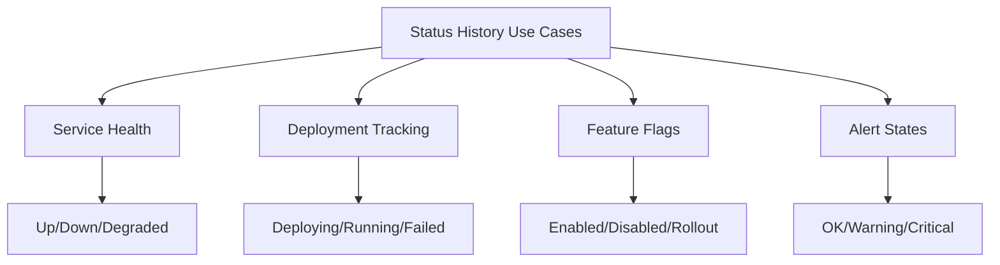
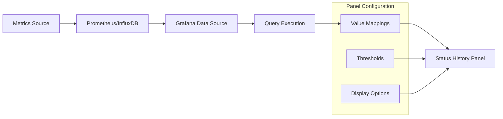
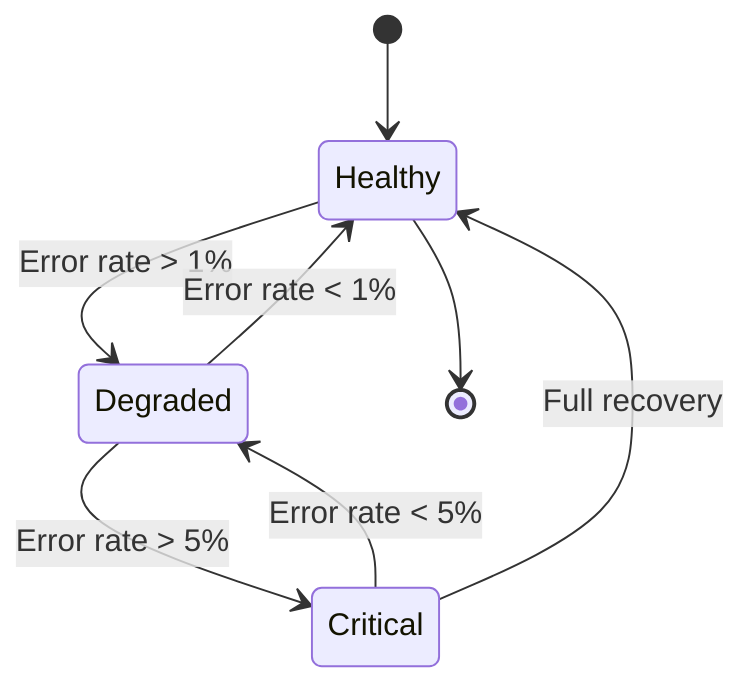

# How to Implement Grafana Status History

Author: [nawazdhandala](https://github.com/nawazdhandala)

Tags: Grafana, Observability, Dashboards, Status

Description: A complete guide to implementing Grafana Status History panels for visualizing state changes and service availability over time.

---

## What is Status History in Grafana?

Status History is a Grafana visualization panel that displays discrete state changes over time. Unlike time series graphs that show continuous numerical values, Status History shows when something changed state - making it perfect for tracking service availability, deployment status, feature flags, or any metric that transitions between known states.

Think of it as a horizontal timeline where each row represents a resource and colored blocks indicate its state at any given moment.

---

## When to Use Status History

Status History shines in scenarios where you need to answer questions like:

- When did this service go down, and for how long?
- Which pods were unhealthy during the last 24 hours?
- How often does this feature flag toggle?
- What was the deployment status across all environments?

The following diagram illustrates typical use cases for Status History panels.



---

## Prerequisites

Before implementing Status History, ensure you have:

- Grafana 8.0 or later (Status History was introduced in v8)
- A data source that returns state-based data (Prometheus, InfluxDB, PostgreSQL, etc.)
- Metrics or data that represent discrete states rather than continuous values

---

## Basic Implementation

### Step 1: Prepare Your Data

Status History requires data in a specific format. Each data point should represent a state at a given time. The value can be numeric (which you map to states) or string-based.

Here is a Prometheus query that returns pod status using kube-state-metrics.

```promql
kube_pod_status_phase{namespace="production"} == 1
```

This query returns 1 when a pod is in a specific phase, allowing you to track Running, Pending, Failed, and other states.

### Step 2: Create the Panel

In your Grafana dashboard, add a new panel and select "Status history" as the visualization type. Configure your data source query to return the state data.

Here is an example PromQL query for tracking service availability based on probe success.

```promql
probe_success{job="blackbox", instance=~".*api.*"}
```

### Step 3: Configure Value Mappings

Value mappings transform raw data into meaningful state labels. Navigate to the panel options and configure mappings under "Value mappings."

The following JSON configuration maps numeric probe results to human-readable states with appropriate colors.

```json
{
  "mappings": [
    {
      "type": "value",
      "options": {
        "0": {
          "text": "Down",
          "color": "red"
        },
        "1": {
          "text": "Up",
          "color": "green"
        }
      }
    }
  ]
}
```

---

## Advanced Configuration

### Multi-State Tracking

For services with multiple states, extend your value mappings to cover all possibilities.

This Prometheus query calculates a health score that maps to different severity levels.

```promql
ceil(
  (
    rate(http_requests_total{status=~"5.."}[5m]) /
    rate(http_requests_total[5m])
  ) * 100
)
```

The corresponding value mapping configuration handles four distinct states based on error percentage thresholds.

```json
{
  "mappings": [
    {
      "type": "range",
      "options": {
        "from": 0,
        "to": 1,
        "result": {
          "text": "Healthy",
          "color": "green"
        }
      }
    },
    {
      "type": "range",
      "options": {
        "from": 1,
        "to": 5,
        "result": {
          "text": "Degraded",
          "color": "yellow"
        }
      }
    },
    {
      "type": "range",
      "options": {
        "from": 5,
        "to": 100,
        "result": {
          "text": "Critical",
          "color": "red"
        }
      }
    }
  ]
}
```

### Combining Multiple Services

To display multiple services in a single Status History panel, use label-based queries.

This query shows the status of all services in the production namespace simultaneously.

```promql
up{job=~".*", namespace="production"}
```

Each unique label combination becomes a separate row in the Status History visualization.

---

## Data Flow Architecture

Understanding how data flows into Status History helps with troubleshooting and optimization.



---

## Complete Dashboard Example

Here is a complete Grafana dashboard JSON snippet that implements a Status History panel for monitoring multiple services.

```json
{
  "panels": [
    {
      "type": "status-history",
      "title": "Service Status History",
      "gridPos": {
        "h": 8,
        "w": 24,
        "x": 0,
        "y": 0
      },
      "targets": [
        {
          "expr": "up{job=~\"api|web|worker\"}",
          "legendFormat": "{{job}} - {{instance}}",
          "refId": "A"
        }
      ],
      "fieldConfig": {
        "defaults": {
          "mappings": [
            {
              "type": "value",
              "options": {
                "0": {
                  "text": "Down",
                  "color": "red"
                },
                "1": {
                  "text": "Up",
                  "color": "green"
                }
              }
            }
          ],
          "thresholds": {
            "mode": "absolute",
            "steps": [
              {"color": "red", "value": null},
              {"color": "green", "value": 1}
            ]
          }
        }
      },
      "options": {
        "showValue": "auto",
        "rowHeight": 0.9,
        "colWidth": 0.9
      }
    }
  ]
}
```

---

## Integration with Alerting

Status History becomes more powerful when combined with Grafana alerting. You can create alerts that fire when state changes occur.

The following alerting rule triggers when a service has been down for more than 5 minutes.

```yaml
groups:
  - name: service_status_alerts
    rules:
      - alert: ServiceDown
        expr: up{job=~"api|web|worker"} == 0
        for: 5m
        labels:
          severity: critical
        annotations:
          summary: "Service {{ $labels.job }} is down"
          description: "{{ $labels.instance }} has been down for more than 5 minutes"
```

---

## State Transition Tracking

For advanced use cases, you might want to track state transitions and calculate metrics like Mean Time Between Failures (MTBF) or Mean Time To Recovery (MTTR).



This recording rule calculates the duration of downtime events for MTTR analysis.

```promql
# Recording rule for tracking downtime duration
- record: service:downtime_duration:seconds
  expr: |
    (
      time() -
      (up == 0) * on(instance, job) group_left
      topk by(instance, job) (1,
        timestamp(up == 1)
      )
    ) * (up == 0)
```

---

## Best Practices

### Keep State Count Manageable

Limit your states to 3-5 distinct values. Too many states make the visualization difficult to interpret at a glance.

### Use Consistent Color Schemes

Adopt a standard color palette across all Status History panels.

| State | Color | Hex Code |
|-------|-------|----------|
| Healthy/Up | Green | #73BF69 |
| Warning/Degraded | Yellow | #FADE2A |
| Critical/Down | Red | #F2495C |
| Unknown/Pending | Gray | #8F8F8F |
| Maintenance | Blue | #5794F2 |

### Optimize Query Performance

Status History panels can be resource-intensive with long time ranges. Use recording rules to pre-aggregate data.

This recording rule pre-computes the service status to reduce query load.

```promql
# Recording rule for pre-aggregated status
- record: service:status:current
  expr: |
    clamp_max(
      clamp_min(
        (1 - (rate(http_requests_total{status=~"5.."}[5m]) / rate(http_requests_total[5m]))) * 100,
        0
      ),
      100
    )
```

---

## Troubleshooting Common Issues

### No Data Displayed

If your Status History panel shows "No data," verify the following.

1. Your query returns data in the selected time range
2. The data format matches what Status History expects (time series with values)
3. Value mappings cover all possible values in your data

### Gaps in the Timeline

Gaps typically indicate missing data points. Ensure your scrape interval is consistent and consider using the "Connect null values" option in panel settings.

### Performance Issues

For dashboards with many Status History panels or long time ranges, consider using the following approaches.

- Reduce the time range or use a higher resolution interval
- Implement recording rules for frequently queried metrics
- Use the $__interval variable to dynamically adjust query granularity

---

## Comparing Status History with State Timeline

Grafana offers two similar visualizations: Status History and State Timeline. Here is when to use each.

| Feature | Status History | State Timeline |
|---------|----------------|----------------|
| Best For | Multiple resources over time | Single resource deep dive |
| Row Layout | One row per series | Configurable |
| Annotations | Limited | Full support |
| Value Display | Compact | Detailed |

---

## Integrating with OneUptime

While Grafana provides excellent visualization capabilities, integrating with a comprehensive observability platform like OneUptime enhances your monitoring workflow. OneUptime can:

- Send status data to Grafana via its metrics endpoints
- Trigger alerts based on state changes detected in Grafana
- Provide a unified view of incidents, status pages, and metrics

To export OneUptime monitor status to Prometheus format for Grafana visualization, configure the OneUptime Prometheus exporter.

```yaml
# OneUptime to Prometheus integration
scrape_configs:
  - job_name: 'oneuptime'
    metrics_path: '/api/metrics'
    static_configs:
      - targets: ['oneuptime.example.com']
    bearer_token: 'your-api-token'
```

---

## Summary

Status History in Grafana transforms how you visualize and understand state changes across your infrastructure. By following the implementation steps and best practices outlined in this guide, you can build dashboards that clearly communicate service health, deployment status, and system availability.

Key takeaways:

- Status History is ideal for discrete state visualization over time
- Value mappings are essential for translating raw data into meaningful states
- Combine with alerting for proactive incident response
- Use recording rules to optimize query performance
- Maintain consistent color schemes across your organization

Start with a simple service availability panel and expand from there. The visibility you gain into state transitions will help you identify patterns, reduce MTTR, and improve overall system reliability.

---

**Related Reading:**

- [Monitoring vs Observability: What SREs Actually Need](https://oneuptime.com/blog/post/2025-11-28-monitoring-vs-observability-sre/view)
- [Logs, Metrics & Traces: The Three Pillars of Observability](https://oneuptime.com/blog/post/2025-08-20-three-pillars-of-observability-logs-metrics-traces/view)
- [SRE Metrics to Track](https://oneuptime.com/blog/post/2025-11-28-sre-metrics-to-track/view)
