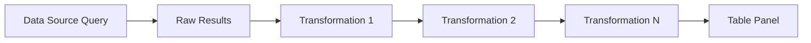
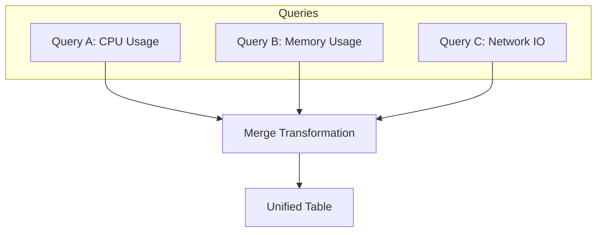
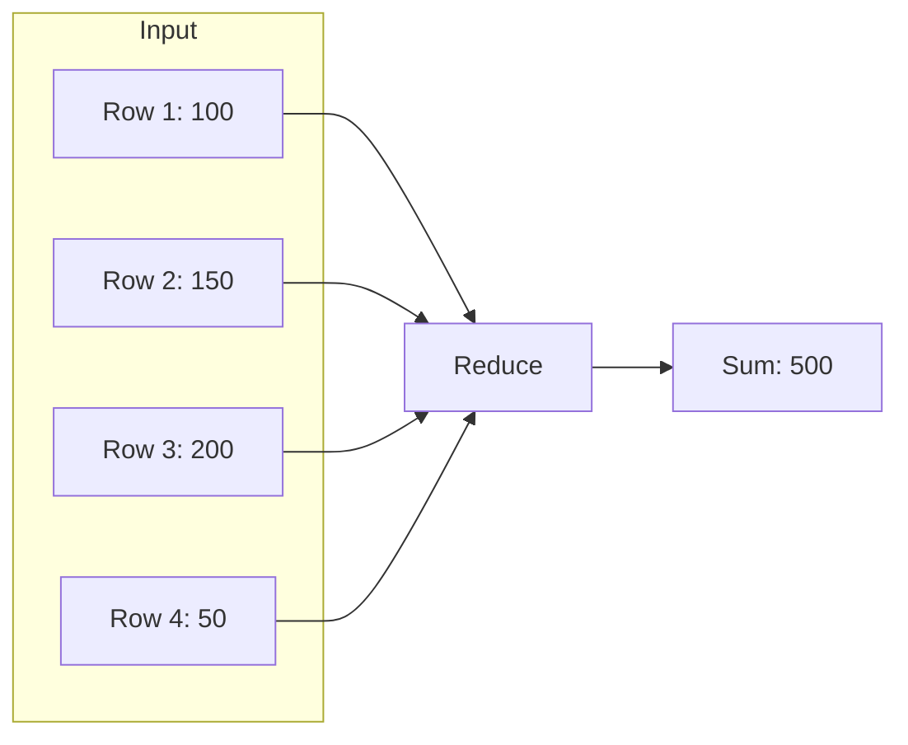
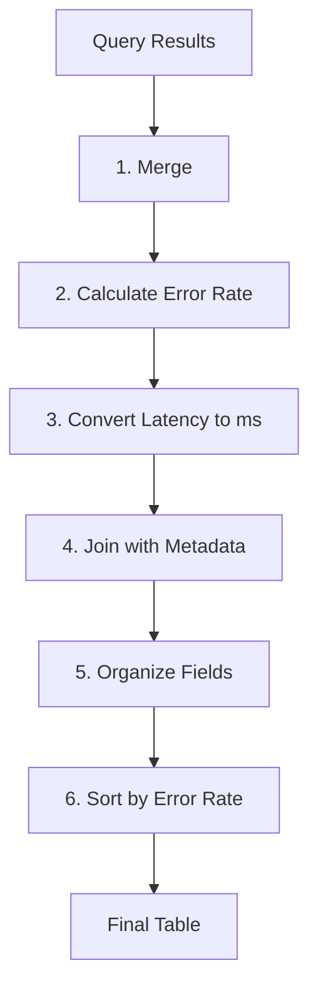

# How to Create Grafana Table Transformations

Author: [nawazdhandala](https://github.com/nawazdhandala)

Tags: Grafana, Observability, Data-Transformation, Tables

Description: A comprehensive guide to mastering Grafana table transformations for reshaping, filtering, and enriching your observability data.

Grafana tables are incredibly powerful, but raw query results rarely match what you actually need to display. Your data might have cryptic column names, irrelevant fields, or need calculations that your data source does not support natively. That is where **table transformations** come in.

Transformations let you manipulate query results directly in Grafana, without modifying your queries or backend data. You can rename columns, filter rows, join multiple queries, calculate new fields, and much more.

This guide walks you through the most useful table transformations with practical examples you can apply today.

---

## How Transformations Work

Transformations sit between your data source query and the visualization panel. They process raw query results before rendering.



Key points:
- Transformations execute in order (top to bottom)
- Each transformation receives the output of the previous one
- You can chain multiple transformations together
- Transformations apply only to that specific panel

---

## Accessing Transformations

To add transformations to any panel:

1. Edit the panel (click panel title, select Edit)
2. Click the **Transform** tab (next to Query)
3. Click **Add transformation**
4. Select from the transformation list

---

## Essential Transformations for Tables

### 1. Organize Fields

The most commonly used transformation. It lets you:
- Rename columns
- Reorder columns
- Hide unwanted columns

This transformation is helpful when your query returns technical field names like `http_requests_total` but you want to display "HTTP Requests" in your dashboard.

**Configuration:**

| Original Field | Display Name | Visible |
|---------------|--------------|---------|
| http_requests_total | HTTP Requests | Yes |
| instance | Server | Yes |
| __name__ | (hidden) | No |
| job | (hidden) | No |

**Example YAML representation of field mappings:**

```yaml
transformations:
  - id: organize
    options:
      renameByName:
        http_requests_total: "HTTP Requests"
        instance: "Server"
      excludeByName:
        __name__: true
        job: true
      indexByName:
        Server: 0
        HTTP Requests: 1
```

---

### 2. Filter by Value

Remove rows that do not match your criteria. Useful for excluding test data, filtering by status, or showing only anomalies.

The filter operates on column values and supports multiple conditions.

**Example: Show only error responses (status >= 400)**

```yaml
transformations:
  - id: filterByValue
    options:
      type: include
      match: any
      filters:
        - fieldName: status_code
          config:
            id: greaterOrEqual
            options:
              value: 400
```

**Supported filter conditions:**
- `equal` / `notEqual`
- `greater` / `greaterOrEqual`
- `lower` / `lowerOrEqual`
- `regex` (pattern matching)
- `isNull` / `isNotNull`

---

### 3. Add Field from Calculation

Create new columns based on calculations from existing data. This is powerful for computing rates, percentages, or combining fields.

**Example: Calculate error rate percentage**

If you have `total_requests` and `error_requests` columns, you can compute error rate:

```yaml
transformations:
  - id: calculateField
    options:
      mode: binary
      binary:
        left: error_requests
        operator: "/"
        right: total_requests
      alias: "Error Rate"
```

**Available calculation modes:**

| Mode | Use Case |
|------|----------|
| binary | Math between two fields (+, -, *, /) |
| unary | Operations on single field (abs, log, exp) |
| reduce | Aggregate across fields (sum, mean, min, max) |
| index | Row number or percentage position |

To convert the error rate to a percentage, chain another transformation:

```yaml
transformations:
  - id: calculateField
    options:
      mode: binary
      binary:
        left: "Error Rate"
        operator: "*"
        right: 100
      alias: "Error Rate %"
```

---

### 4. Merge Queries

When you have multiple queries in a panel, merge combines them into a single table. This is essential for correlating data from different sources or time ranges.



The merge transformation automatically aligns data by matching field values.

**Configuration:**

```yaml
transformations:
  - id: merge
    options: {}
```

After merging, use "Organize Fields" to clean up the combined result.

---

### 5. Join by Field (Outer Join)

Combine two queries based on a common field (like SQL JOIN). More precise than merge when you need control over the join logic.

**Example: Join service metrics with service metadata**

Query A returns: `service_name`, `request_count`, `error_count`
Query B returns: `service_name`, `team`, `tier`

```yaml
transformations:
  - id: joinByField
    options:
      byField: service_name
      mode: outer
```

**Result combines both:**
| service_name | request_count | error_count | team | tier |
|-------------|---------------|-------------|------|------|
| api-gateway | 45000 | 23 | Platform | P0 |
| auth-service | 12000 | 5 | Identity | P1 |

---

### 6. Group By

Aggregate rows by one or more columns. Similar to SQL GROUP BY for creating summaries.

**Example: Total requests per region**

```yaml
transformations:
  - id: groupBy
    options:
      fields:
        region:
          operation: groupby
          aggregations: []
        request_count:
          operation: aggregate
          aggregations:
            - sum
        response_time:
          operation: aggregate
          aggregations:
            - mean
```

**Available aggregations:**
- `sum`, `mean`, `min`, `max`
- `count`, `first`, `last`
- `range`, `variance`, `stdDev`

---

### 7. Sort By

Order your table rows by one or more columns.

```yaml
transformations:
  - id: sortBy
    options:
      sort:
        - field: error_count
          desc: true
```

You can add multiple sort fields for multi-level sorting (sort by region, then by error count within each region).

---

### 8. Filter by Name

Show or hide specific fields by their names. Faster than "Organize Fields" when you just need to filter columns.

**Example: Show only specific metrics**

```yaml
transformations:
  - id: filterFieldsByName
    options:
      include:
        pattern: "^(service|requests|errors|latency).*"
```

Supports regex patterns for flexible matching.

---

### 9. Reduce

Collapse all rows into a single row of aggregate values. Useful for summary panels.



**Configuration:**

```yaml
transformations:
  - id: reduce
    options:
      reducers:
        - sum
        - mean
        - max
      mode: reduceFields
      includeTimeField: false
```

---

### 10. Convert Field Type

Change column data types. Essential when your data source returns numbers as strings or timestamps in wrong formats.

```yaml
transformations:
  - id: convertFieldType
    options:
      fields:
        request_count:
          destinationType: number
        timestamp:
          destinationType: time
```

**Supported types:**
- `number`
- `string`
- `time`
- `boolean`

---

## Real-World Example: Service Health Dashboard

Let us build a practical example that combines multiple transformations to create a service health summary table.

**Goal:** Show all services with their request count, error rate, average latency, and team ownership.

**Query A (Prometheus):**
```promql
sum by (service) (rate(http_requests_total[5m]))
```

**Query B (Prometheus):**
```promql
sum by (service) (rate(http_requests_total{status=~"5.."}[5m]))
```

**Query C (Prometheus):**
```promql
histogram_quantile(0.95, sum by (service, le) (rate(http_request_duration_seconds_bucket[5m])))
```

**Query D (Labels from service catalog):**
Returns service metadata with team and tier information.

**Transformation chain:**



**Step-by-step configuration:**

```yaml
transformations:
  # Step 1: Merge all query results
  - id: merge
    options: {}

  # Step 2: Calculate error rate
  - id: calculateField
    options:
      mode: binary
      binary:
        left: "Value #B"
        operator: "/"
        right: "Value #A"
      alias: "error_rate"

  # Step 3: Convert latency to milliseconds
  - id: calculateField
    options:
      mode: binary
      binary:
        left: "Value #C"
        operator: "*"
        right: 1000
      alias: "p95_latency_ms"

  # Step 4: Join with service metadata (Query D)
  - id: joinByField
    options:
      byField: service
      mode: outer

  # Step 5: Organize and rename fields
  - id: organize
    options:
      renameByName:
        service: "Service"
        "Value #A": "Requests/sec"
        error_rate: "Error Rate"
        p95_latency_ms: "P95 Latency (ms)"
        team: "Team"
        tier: "Tier"
      excludeByName:
        "Value #B": true
        "Value #C": true
      indexByName:
        Service: 0
        Team: 1
        Tier: 2
        Requests/sec: 3
        Error Rate: 4
        P95 Latency (ms): 5

  # Step 6: Sort by error rate descending
  - id: sortBy
    options:
      sort:
        - field: "Error Rate"
          desc: true
```

**Final result:**

| Service | Team | Tier | Requests/sec | Error Rate | P95 Latency (ms) |
|---------|------|------|--------------|------------|------------------|
| payment-api | Payments | P0 | 1250 | 0.032 | 245 |
| auth-service | Identity | P0 | 8500 | 0.008 | 45 |
| notification | Comms | P2 | 450 | 0.002 | 120 |

---

## Transformation Tips and Best Practices

### Order Matters

Transformations execute sequentially. A common mistake is trying to filter on a calculated field before creating it.

**Wrong order:**
1. Filter by error_rate > 0.01
2. Calculate error_rate (field does not exist yet)

**Correct order:**
1. Calculate error_rate
2. Filter by error_rate > 0.01

### Debug with Data View

Use Grafana's **Table view** toggle to see intermediate results. Click the table icon in query options to view raw data at any transformation step.

### Performance Considerations

- Complex transformations on large datasets can slow down dashboards
- Filter early in the chain to reduce data volume
- Use data source queries for heavy filtering when possible
- Consider time range limits for high-cardinality data

### Reusable Patterns

Common transformation chains you can adapt:

**Rate calculation:**
```yaml
- id: calculateField  # numerator / denominator
- id: calculateField  # multiply by 100 for percentage
- id: organize        # rename and format
```

**Multi-query correlation:**
```yaml
- id: merge           # combine queries
- id: joinByField     # align on common key
- id: organize        # clean up duplicates
```

**Top N by metric:**
```yaml
- id: sortBy          # order by target metric
- id: limit           # keep top N rows
```

---

## When to Use Transformations vs Query-Level Logic

| Use Transformations | Use Query Logic |
|--------------------|-----------------|
| Renaming fields for display | Heavy aggregations |
| Joining data from different sources | Initial filtering on large datasets |
| UI-specific calculations | Time-series math |
| Quick prototyping | Production dashboards with strict SLAs |
| Cross-datasource operations | Single-datasource optimizations |

---

## Troubleshooting Common Issues

**Problem:** Transformation shows "No data"
- Check that previous transformation produced output
- Verify field names match exactly (case-sensitive)
- Use Table view to debug intermediate steps

**Problem:** Join produces empty or mismatched rows
- Ensure join field exists in both queries
- Check for whitespace or type mismatches in join keys
- Try outer join mode to see all rows

**Problem:** Calculations return NaN or Infinity
- Check for division by zero
- Verify numeric fields are not strings
- Add a filter to exclude null values first

**Problem:** Field names changed unexpectedly
- Prometheus and other data sources may alter field names
- Use regex in "Filter by Name" for flexible matching
- Check "Organize Fields" for hidden renames

---

## Summary

Grafana table transformations let you:

- **Reshape data** without modifying queries
- **Calculate derived metrics** like rates and percentages
- **Combine multiple data sources** into unified views
- **Clean up display** with proper names and ordering
- **Filter and sort** to highlight what matters

Start with simple transformations (Organize Fields, Sort By) and progressively add complexity. Use the transformation preview to understand how each step modifies your data.

For complex dashboards, document your transformation chains. Future you (and your teammates) will thank you.

---

## Related Reading

- [Three Pillars of Observability: Logs, Metrics & Traces](https://oneuptime.com/blog/post/2025-08-20-three-pillars-of-observability-logs-metrics-traces/view)
- [How to Reduce Noise in OpenTelemetry](https://oneuptime.com/blog/post/2025-08-25-how-to-reduce-noise-in-opentelemetry/view)
- [SRE Metrics to Track](https://oneuptime.com/blog/post/2025-11-28-sre-metrics-to-track/view)
