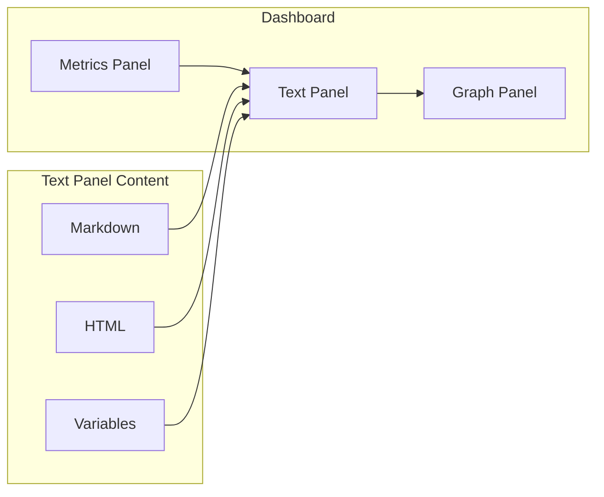
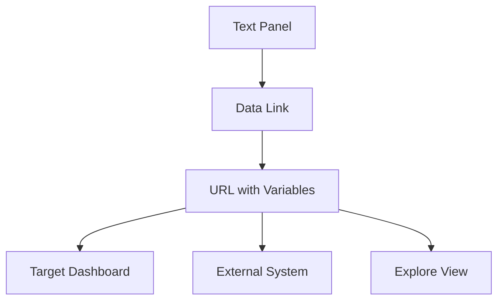
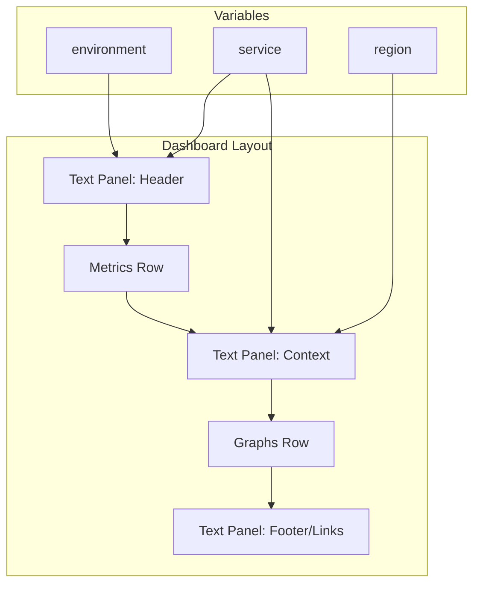

# How to Build Grafana Text Panel Templates

Author: [nawazdhandala](https://github.com/nawazdhandala)

Tags: Grafana, Observability, Dashboards, Templates

Description: Learn how to create dynamic, informative text panels in Grafana using templates, variables, and HTML/Markdown formatting.

---

Grafana dashboards are powerful, but numbers alone do not tell the whole story. Text panels let you add context, explanations, and dynamic information to your dashboards. When combined with templates and variables, they become living documentation that updates in real time.

## What Are Text Panels?

Text panels display static or dynamic content alongside your visualizations. They support Markdown, HTML, and Grafana template variables.



Common use cases:
- Dashboard headers with environment context
- Runbook links for alerts
- Dynamic status summaries
- Team contact information
- SLA/SLO definitions

## Creating Your First Text Panel

### Step 1: Add a Panel

In your Grafana dashboard, click **Add panel** and select **Text** from the visualization dropdown.

### Step 2: Choose the Mode

Grafana text panels support two modes:

| Mode | Use Case |
|------|----------|
| Markdown | Documentation, simple formatting, links |
| HTML | Complex layouts, custom styling, advanced formatting |

### Step 3: Write Your Content

Here is a basic Markdown example for a dashboard header.

```markdown
# Production Environment

**Last Updated:** ${__from:date:YYYY-MM-DD HH:mm}

| Metric | Target |
|--------|--------|
| Uptime | 99.9% |
| Response Time | < 200ms |
| Error Rate | < 0.1% |

[View Runbook](https://wiki.example.com/runbooks/production)
```

## Using Template Variables

Template variables make text panels dynamic. They pull values from dashboard variables, time ranges, and query results.

### Built-in Variables

Grafana provides several built-in variables you can use in text panels.

| Variable | Description | Example Output |
|----------|-------------|----------------|
| `${__from}` | Start time (epoch ms) | 1706601600000 |
| `${__to}` | End time (epoch ms) | 1706688000000 |
| `${__from:date}` | Start time (formatted) | 2026-01-30 |
| `${__to:date:YYYY-MM-DD}` | End time (custom format) | 2026-01-30 |
| `${__user.login}` | Current user login | admin |
| `${__dashboard}` | Dashboard name | Production Overview |
| `${__org.name}` | Organization name | MyCompany |

### Dashboard Variables

Reference your custom dashboard variables with the `$` prefix or `${variable}` syntax.

```markdown
## Environment: ${environment}

**Region:** ${region}
**Cluster:** ${cluster}

Showing metrics for **$service** in **$namespace**
```

### Variable Formatting Options

Control how multi-value variables render using format specifiers.

| Format | Syntax | Example Input | Output |
|--------|--------|---------------|--------|
| CSV | `${variable:csv}` | [a, b, c] | a,b,c |
| Pipe | `${variable:pipe}` | [a, b, c] | a\|b\|c |
| JSON | `${variable:json}` | [a, b, c] | ["a","b","c"] |
| Regex | `${variable:regex}` | [a, b, c] | (a\|b\|c) |
| Query | `${variable:queryparam}` | [a, b, c] | var=a&var=b&var=c |

## Advanced Text Panel Patterns

### Dynamic Status Header

Create a header that shows the current context and time range.

```markdown
# ${environment} Dashboard

**Time Range:** ${__from:date:YYYY-MM-DD HH:mm} to ${__to:date:YYYY-MM-DD HH:mm}

**Services:** ${service:csv}

---

Quick Links:
- [Logs](/explore?left={"datasource":"Loki"})
- [Traces](/explore?left={"datasource":"Tempo"})
- [Alerts](/alerting/list)
```

### HTML Mode for Custom Styling

When Markdown is not enough, switch to HTML mode for full control.

```html
<div style="background: linear-gradient(135deg, #667eea 0%, #764ba2 100%);
            padding: 20px;
            border-radius: 8px;
            color: white;">
  <h2 style="margin: 0;">Production Status</h2>
  <p style="margin: 10px 0 0 0; opacity: 0.9;">
    Environment: <strong>${environment}</strong> |
    Region: <strong>${region}</strong>
  </p>
</div>
```

### Conditional Content with HTML

Display different content based on variable values using CSS.

```html
<style>
  .status-prod { color: #ff5722; font-weight: bold; }
  .status-staging { color: #ff9800; }
  .status-dev { color: #4caf50; }
</style>

<div class="status-${environment}">
  Environment: ${environment}
</div>
```

### Information Cards Layout

Create a card-based layout for key information.

```html
<div style="display: flex; gap: 16px; flex-wrap: wrap;">
  <div style="flex: 1; min-width: 200px; background: #1e1e1e;
              padding: 16px; border-radius: 8px; border-left: 4px solid #3f51b5;">
    <h4 style="margin: 0 0 8px 0; color: #90caf9;">On-Call</h4>
    <p style="margin: 0; font-size: 14px;">Platform Team</p>
    <p style="margin: 4px 0 0 0; font-size: 12px; opacity: 0.7;">
      Slack: #platform-oncall
    </p>
  </div>

  <div style="flex: 1; min-width: 200px; background: #1e1e1e;
              padding: 16px; border-radius: 8px; border-left: 4px solid #4caf50;">
    <h4 style="margin: 0 0 8px 0; color: #a5d6a7;">SLO Target</h4>
    <p style="margin: 0; font-size: 14px;">99.9% Availability</p>
    <p style="margin: 4px 0 0 0; font-size: 12px; opacity: 0.7;">
      Error Budget: 43.2 min/month
    </p>
  </div>

  <div style="flex: 1; min-width: 200px; background: #1e1e1e;
              padding: 16px; border-radius: 8px; border-left: 4px solid #ff9800;">
    <h4 style="margin: 0 0 8px 0; color: #ffcc80;">Documentation</h4>
    <a href="https://wiki.example.com/runbooks"
       style="color: #64b5f6; text-decoration: none;">
      View Runbooks
    </a>
  </div>
</div>
```

## Text Panels with Query Results

While text panels cannot directly query data sources, you can combine them with other techniques.

### Using Data Links

Configure data links in your text panel to create dynamic navigation.



### Link to Filtered Views

Create links that pass the current dashboard context.

```markdown
## Quick Navigation

- [View Detailed Metrics](/d/detailed-dashboard?var-env=${environment}&var-service=${service})
- [Explore Logs](/explore?orgId=1&left={"queries":[{"expr":"{service=\"${service}\"}"}]})
- [Related Alerts](/alerting/list?search=${service})
```

## Building a Complete Dashboard Header

Here is a comprehensive example that combines multiple techniques.

```html
<div style="margin-bottom: 16px;">
  <!-- Header Section -->
  <div style="display: flex; justify-content: space-between;
              align-items: center; margin-bottom: 16px;">
    <div>
      <h1 style="margin: 0; font-size: 24px;">
        ${service} - ${environment}
      </h1>
      <p style="margin: 4px 0 0 0; opacity: 0.7; font-size: 14px;">
        Namespace: ${namespace} | Cluster: ${cluster}
      </p>
    </div>
    <div style="text-align: right; font-size: 12px; opacity: 0.7;">
      <div>Time Range: ${__from:date:MMM DD, HH:mm} - ${__to:date:MMM DD, HH:mm}</div>
      <div>Auto-refresh: ${__interval}</div>
    </div>
  </div>

  <!-- Quick Links -->
  <div style="display: flex; gap: 12px; flex-wrap: wrap;">
    <a href="/d/logs-dashboard?var-service=${service}"
       style="padding: 6px 12px; background: #2196f3; color: white;
              border-radius: 4px; text-decoration: none; font-size: 13px;">
      Logs
    </a>
    <a href="/d/traces-dashboard?var-service=${service}"
       style="padding: 6px 12px; background: #9c27b0; color: white;
              border-radius: 4px; text-decoration: none; font-size: 13px;">
      Traces
    </a>
    <a href="/alerting/list?search=${service}"
       style="padding: 6px 12px; background: #ff5722; color: white;
              border-radius: 4px; text-decoration: none; font-size: 13px;">
      Alerts
    </a>
    <a href="https://wiki.example.com/services/${service}"
       style="padding: 6px 12px; background: #607d8b; color: white;
              border-radius: 4px; text-decoration: none; font-size: 13px;">
      Documentation
    </a>
  </div>
</div>
```

## Text Panel Architecture

Here is how text panels fit into dashboard design.



## Best Practices

### 1. Keep It Concise

Text panels should provide context, not documentation. Link to external docs for details.

```markdown
## Service Overview

Quick status for **${service}** in **${environment}**.

For detailed documentation, see the [Service Wiki](https://wiki.example.com/${service}).
```

### 2. Use Consistent Styling

Create a style guide for your text panels to maintain visual consistency.

```html
<!-- Define reusable styles at the top -->
<style>
  .header { font-size: 20px; font-weight: 600; margin-bottom: 8px; }
  .subtext { font-size: 12px; opacity: 0.7; }
  .link { color: #64b5f6; text-decoration: none; }
  .link:hover { text-decoration: underline; }
</style>

<h2 class="header">${service}</h2>
<p class="subtext">Environment: ${environment}</p>
<a class="link" href="/docs/${service}">Documentation</a>
```

### 3. Make Variables Obvious

Help users understand what variables are available and how they affect the display.

```markdown
**Current Selection:**
- Environment: `${environment}`
- Service: `${service}`
- Time Range: `${__from:date}` to `${__to:date}`

*Use the dropdowns above to change the view.*
```

### 4. Test Variable Edge Cases

Handle cases where variables might be empty or have unexpected values.

```html
<div>
  Service:
  <span style="color: ${service:raw ? '#4caf50' : '#f44336'};">
    ${service:raw || 'Not Selected'}
  </span>
</div>
```

### 5. Responsive Design

Ensure text panels work at different dashboard widths.

```html
<div style="display: flex; flex-wrap: wrap; gap: 16px;">
  <div style="flex: 1; min-width: 250px;">
    <!-- Content that wraps on small screens -->
  </div>
</div>
```

## Common Patterns

### Runbook Link Panel

```markdown
## Incident Response

**On-Call Team:** Platform Engineering

| Severity | Contact |
|----------|---------|
| P1 | PagerDuty + Slack #incidents |
| P2 | Slack #platform-oncall |
| P3 | Jira ticket |

### Runbooks
- [Service Restart](/wiki/runbooks/${service}/restart)
- [Scale Up](/wiki/runbooks/${service}/scale)
- [Rollback](/wiki/runbooks/${service}/rollback)
```

### SLO Definition Panel

```markdown
## SLO Definitions

| SLI | Target | Window |
|-----|--------|--------|
| Availability | 99.9% | 30 days |
| Latency (p99) | < 200ms | 30 days |
| Error Rate | < 0.1% | 30 days |

**Error Budget Remaining:** See the Error Budget panel below.

*SLO documentation: [Link](/wiki/slo/${service})*
```

### Environment Indicator

```html
<div style="display: inline-block;
            padding: 4px 12px;
            border-radius: 4px;
            background: ${environment:raw == 'production' ? '#f44336' :
                         environment:raw == 'staging' ? '#ff9800' : '#4caf50'};
            color: white;
            font-weight: bold;
            text-transform: uppercase;">
  ${environment}
</div>
```

## Troubleshooting

### Variables Not Rendering

If you see `${variable}` instead of the value:
1. Verify the variable exists in dashboard settings
2. Check the variable name spelling
3. Ensure the panel is in the correct mode (Markdown vs HTML)

### HTML Not Displaying

Some Grafana installations restrict HTML content. Check:
1. Grafana configuration for `disable_sanitize_html`
2. Panel settings for content mode
3. Browser console for security warnings

### Styling Issues

If styles are not applying:
1. Use inline styles instead of external CSS
2. Avoid complex selectors
3. Test in both light and dark themes

---

Text panels transform dashboards from data displays into operational tools. Start with simple Markdown headers, then progressively add variables and HTML styling as your needs grow. The key is providing just enough context to make the data actionable without overwhelming the viewer.

For comprehensive observability that combines metrics, logs, and traces with customizable dashboards, explore [OneUptime](https://oneuptime.com) - the open-source alternative to Datadog and other monitoring platforms.
