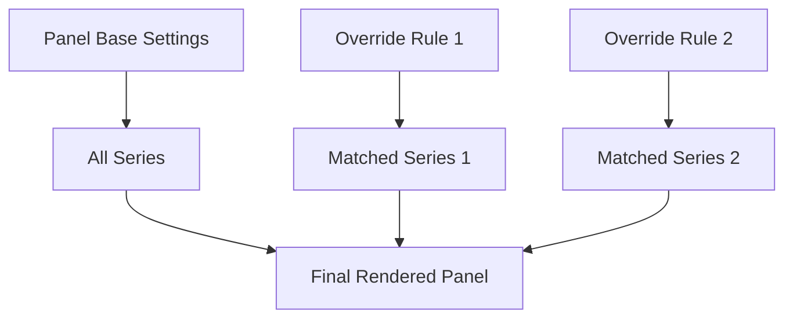
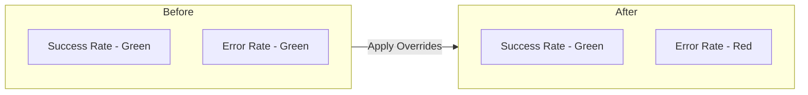
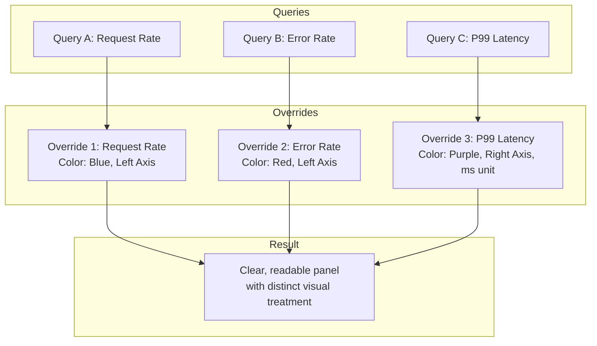
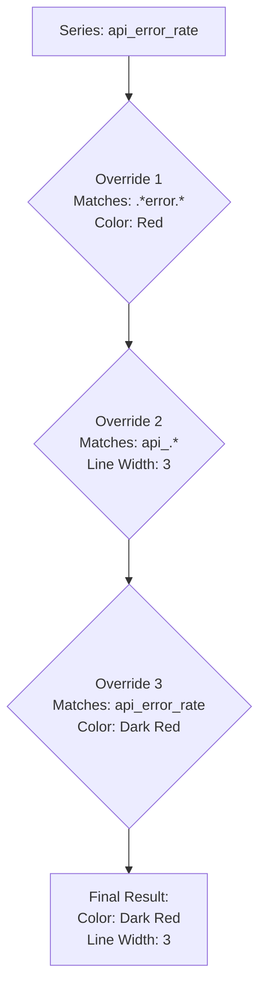

# How to Implement Grafana Time Series Overrides

Author: [nawazdhandala](https://github.com/nawazdhandala)

Tags: Grafana, Observability, Time-Series, Visualization

Description: A practical guide to using Grafana time series overrides to customize how individual metrics are displayed, styled, and transformed in your dashboards.

You have a dashboard with ten different metrics, all rendered identically. CPU usage competes for attention with error rates. Success percentages blend into latency numbers. Everything is the same shade of green. Finding the signal in that noise takes longer than it should.

Grafana time series overrides solve this problem. They let you apply custom styling, transformations, and display rules to specific series within a single panel. Instead of creating separate panels for every metric that needs special treatment, you define overrides that target exactly what you need to highlight.

This guide walks you through implementing overrides effectively, from basic styling to advanced conditional formatting.

## What Are Time Series Overrides?

Overrides are rules that modify how specific time series are rendered within a Grafana panel. They work by matching series based on field names, regex patterns, or query references, then applying custom properties to those matches.

The override system follows a layered approach: base panel settings apply to everything, then overrides selectively modify specific series.



Overrides can modify nearly any visual property: colors, line styles, axis placement, display names, thresholds, unit formatting, and more.

## Core Override Matching Strategies

Grafana provides several ways to target series for overrides. Choosing the right matcher determines how maintainable your dashboards become.

### Field Name Matching

The most straightforward approach targets series by their exact field name. This works well when you know the precise metric names.

Navigate to your panel settings, find the Overrides section, and add a new override. Select "Fields with name" as the matcher type.

```yaml
# Example override configuration (conceptual)
override:
  matcher:
    id: byName
    options: "cpu_usage_percent"
  properties:
    - id: color
      value:
        mode: fixed
        fixedColor: "orange"
    - id: custom.lineWidth
      value: 2
```

### Regex Pattern Matching

When you have multiple series following a naming convention, regex matching scales better than listing every field name individually.

Use "Fields with name matching regex" to target patterns.

```yaml
# Match all error-related metrics
override:
  matcher:
    id: byRegexp
    options: ".*error.*|.*fail.*"
  properties:
    - id: color
      value:
        mode: fixed
        fixedColor: "red"
```

### Query-Based Matching

If your panel has multiple queries (A, B, C), you can apply overrides to all series from a specific query. Select "Fields returned by query" and specify the query letter.

This approach works well when query A returns success metrics and query B returns error metrics, each needing different styling.

## Practical Override Examples

Let us walk through common scenarios where overrides make dashboards more readable.

### Differentiating Success and Error Rates

Consider a panel showing both request success rate and error rate. Without overrides, both lines might appear in similar colors, making quick visual assessment difficult.

Create two overrides targeting each metric with distinct colors that match their meaning.



In the panel editor, add these overrides:

First override for success metrics:
- Matcher: Fields with name matching regex
- Pattern: `.*success.*|.*ok.*`
- Properties: Color = green, Line width = 2

Second override for error metrics:
- Matcher: Fields with name matching regex
- Pattern: `.*error.*|.*fail.*`
- Properties: Color = red, Line width = 2

### Placing Metrics on Different Y-Axes

When displaying metrics with vastly different scales (like request count in thousands and latency in milliseconds), putting them on the same axis makes one unreadable.

Override the axis placement for one of the metrics.

```yaml
override:
  matcher:
    id: byName
    options: "request_latency_ms"
  properties:
    - id: custom.axisPlacement
      value: "right"
    - id: unit
      value: "ms"
```

The panel now shows request counts on the left axis and latency on the right, each with appropriate scaling.

### Threshold-Based Coloring

For metrics with known acceptable ranges, apply threshold overrides to change colors when values cross boundaries.

```yaml
override:
  matcher:
    id: byName
    options: "memory_usage_percent"
  properties:
    - id: thresholds
      value:
        mode: absolute
        steps:
          - color: "green"
            value: null
          - color: "yellow"
            value: 70
          - color: "red"
            value: 90
    - id: custom.thresholdsStyle
      value:
        mode: "line+area"
```

This configuration shows memory usage in green below 70%, yellow between 70-90%, and red above 90%.

## Override Property Reference

Here are the most commonly used properties you can set in overrides:

| Property | Description | Example Values |
|----------|-------------|----------------|
| color | Fixed or threshold-based coloring | `{"mode": "fixed", "fixedColor": "blue"}` |
| custom.lineWidth | Line thickness in pixels | 1, 2, 3 |
| custom.fillOpacity | Area fill transparency | 0-100 |
| custom.drawStyle | Render as line, bars, or points | "line", "bars", "points" |
| custom.axisPlacement | Y-axis side | "auto", "left", "right", "hidden" |
| displayName | Override the series name in legend | Any string |
| unit | Value formatting unit | "percent", "bytes", "ms", "short" |
| decimals | Decimal places to display | 0, 1, 2 |
| min / max | Fixed axis range | Any number |
| custom.stacking | Stack series together | `{"mode": "normal"}` |

## Building a Multi-Metric Dashboard Panel

Let us build a complete example: a panel showing API performance with request rate, error rate, and p99 latency.

Start with three queries in your panel:

Query A returns request rate per second.
Query B returns error rate per second.
Query C returns p99 latency in milliseconds.

Without overrides, all three metrics compete visually. Apply these overrides to create clarity.



Override 1 for request rate (Query A):
```yaml
override:
  matcher:
    id: byFrameRefID
    options: "A"
  properties:
    - id: color
      value:
        mode: fixed
        fixedColor: "blue"
    - id: displayName
      value: "Requests/sec"
    - id: custom.axisPlacement
      value: "left"
```

Override 2 for error rate (Query B):
```yaml
override:
  matcher:
    id: byFrameRefID
    options: "B"
  properties:
    - id: color
      value:
        mode: fixed
        fixedColor: "red"
    - id: displayName
      value: "Errors/sec"
    - id: custom.axisPlacement
      value: "left"
```

Override 3 for latency (Query C):
```yaml
override:
  matcher:
    id: byFrameRefID
    options: "C"
  properties:
    - id: color
      value:
        mode: fixed
        fixedColor: "purple"
    - id: displayName
      value: "P99 Latency"
    - id: custom.axisPlacement
      value: "right"
    - id: unit
      value: "ms"
```

The result is a single panel where each metric has its own visual identity and appropriate scaling.

## Override Ordering and Precedence

Overrides are applied in order from top to bottom. When multiple overrides match the same series, later overrides take precedence for conflicting properties.



In this example, the series matches all three overrides. It gets line width from override 2 (the only one setting it), but color comes from override 3 because it runs last and sets the same property.

Use this behavior intentionally: set broad defaults early, then add specific refinements later in the list.

## Dynamic Overrides with Variables

Grafana variables can be used within override configurations to create dynamic, reusable dashboards.

If you have a variable called `$environment`, you can create overrides that change based on selection.

```yaml
override:
  matcher:
    id: byRegexp
    options: ".*${environment}.*"
  properties:
    - id: custom.lineWidth
      value: 3
```

This pattern highlights metrics matching the currently selected environment, making it easier to focus on specific infrastructure segments.

## Common Pitfalls and Solutions

### Override Not Applying

If your override seems to have no effect, check these common causes:

1. **Field name mismatch**: The actual field name may differ from what you expect. Enable "Show field names" in the panel to see exact names.

2. **Regex escaping**: Special characters in regex patterns need proper escaping. A period matches any character unless escaped as `\.`

3. **Override order**: A later override might be resetting the property. Check the override list order.

### Too Many Overrides

When you have dozens of overrides, dashboard maintenance becomes difficult. Consider these alternatives:

- Use regex patterns to match groups of similar metrics instead of individual names
- Split into multiple panels if metrics truly need different treatment
- Create dashboard variables to reduce hardcoded values

### Performance Impact

Overrides are evaluated at render time. Complex regex patterns on panels with many series can impact dashboard load time. Keep patterns simple and specific when possible.

## Integrating with OneUptime

If you are using OneUptime for observability, you can leverage these Grafana override techniques alongside OneUptime metrics. OneUptime exports metrics in OpenTelemetry format, which Grafana can query through compatible data sources like Prometheus or the native OTLP data source.

The patterns described here work equally well whether your metrics come from OneUptime, Prometheus, InfluxDB, or other sources. The key is understanding your field names and applying overrides that make visual sense for your operations team.

Consider setting up standard override templates across your organization. When every dashboard uses red for errors and green for success metrics, incident response becomes faster because the visual language is consistent.

## Summary

Time series overrides transform cluttered Grafana panels into clear, actionable visualizations. The key principles:

- Use the right matcher for your use case: exact names for specific metrics, regex for patterns, query references for grouping
- Apply meaningful visual distinctions: color-code by metric type, separate scales onto different axes
- Order overrides intentionally: broad rules first, specific refinements last
- Keep overrides maintainable: prefer patterns over lists, use variables for dynamic behavior

Start with one or two overrides on your most-used panels. Once you see the clarity they bring, you will find yourself applying them across your dashboard fleet.

---

**Related Reading:**

- [Three Pillars of Observability: Logs, Metrics, and Traces](https://oneuptime.com/blog/post/2025-08-20-three-pillars-of-observability-logs-metrics-traces/view)
- [SRE Metrics to Track](https://oneuptime.com/blog/post/2025-11-28-sre-metrics-to-track/view)
- [Monitoring vs Observability](https://oneuptime.com/blog/post/2025-11-28-monitoring-vs-observability-sre/view)
