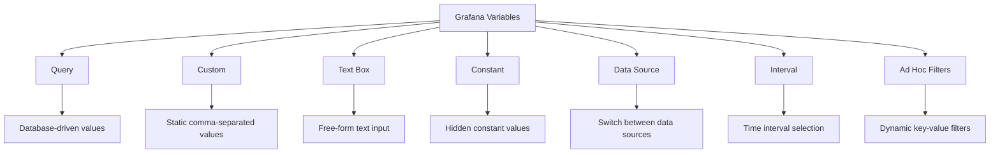
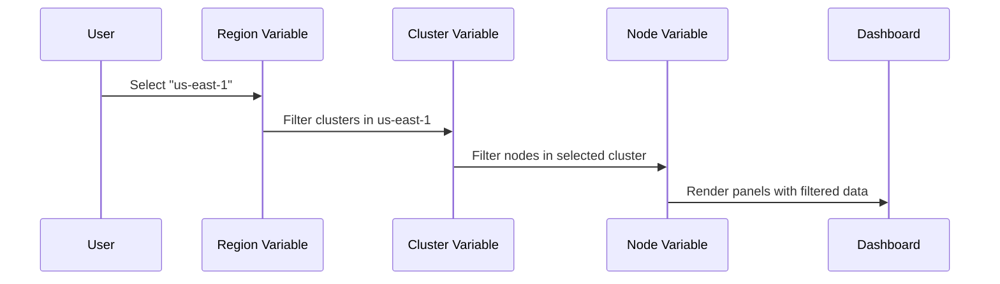
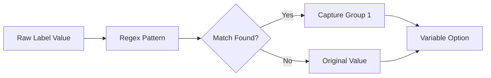
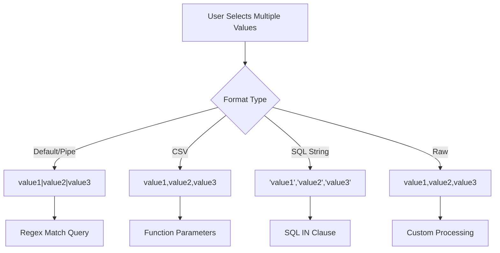
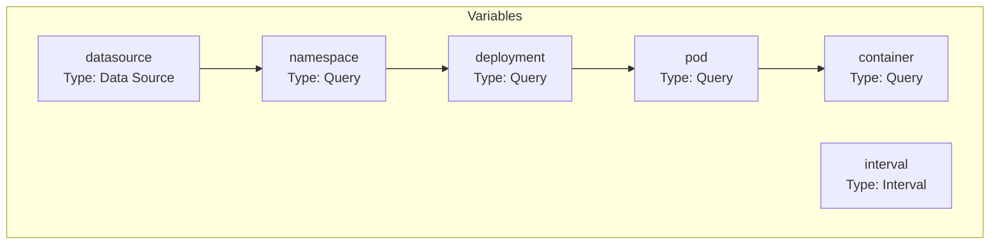
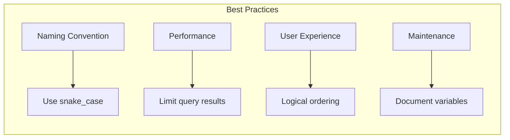

# How to Implement Grafana Variables Advanced

Author: [nawazdhandala](https://github.com/nawazdhandala)

Tags: Grafana, Variables, Dashboard, Dynamic

Description: Learn to implement advanced Grafana variables with chained queries, regex extraction, and custom variable types for dynamic dashboards.

---

Grafana dashboards become truly powerful when you leverage variables to create dynamic, reusable visualizations. This guide covers advanced variable techniques that transform static dashboards into flexible, user-driven monitoring solutions.

## Understanding Grafana Variable Types

Before diving into advanced techniques, let's understand the variable types available in Grafana:



### Query Variables

Query variables fetch values directly from your data source. Here is a Prometheus example that retrieves all available job names:

```promql
label_values(up, job)
```

For InfluxDB, you might use:

```sql
SHOW TAG VALUES FROM "cpu" WITH KEY = "host"
```

### Custom Variables

Custom variables let you define a static list of options:

```
production,staging,development
```

Or with display labels:

```
prod : production, stg : staging, dev : development
```

### Interval Variables

Interval variables are essential for time-based aggregations:

```
1m,5m,10m,30m,1h,6h,12h,1d,7d
```

## Variable Chaining - Creating Dependent Dropdowns

Variable chaining creates cascading dropdowns where one variable's selection filters another. This is crucial for large-scale monitoring.



### Step 1: Create the Parent Variable

First, create a variable for regions:

**Name:** `region`
**Type:** Query
**Query:**
```promql
label_values(node_info, region)
```

### Step 2: Create the Chained Variable

Create a cluster variable that depends on region:

**Name:** `cluster`
**Type:** Query
**Query:**
```promql
label_values(node_info{region="$region"}, cluster)
```

### Step 3: Create a Third-Level Variable

Create a node variable depending on both region and cluster:

**Name:** `node`
**Type:** Query
**Query:**
```promql
label_values(node_info{region="$region", cluster="$cluster"}, instance)
```

### Using Chained Variables in Panels

```promql
node_cpu_seconds_total{region="$region", cluster="$cluster", instance="$node"}
```

## Regex Extraction - Transforming Variable Values

Regex extraction allows you to transform raw label values into cleaner, more readable options.

### Basic Regex Extraction

If your Prometheus metrics have instances like `server-prod-web-01.example.com:9090`, extract just the server name:

**Query:**
```promql
label_values(up, instance)
```

**Regex:**
```
/^([^.]+)/
```

This extracts `server-prod-web-01` from the full instance name.

### Advanced Regex with Capture Groups

Extract specific parts using capture groups:

**Original values:** `app-payment-service-v2.3.1`, `app-user-service-v1.0.0`

**Regex to extract service name:**
```
/app-(.+)-v[\d.]+/
```

**Result:** `payment-service`, `user-service`

### Regex for Environment Detection

**Original values:** `myapp-prod-us-east-1`, `myapp-staging-eu-west-1`

**Regex:**
```
/myapp-(\w+)-/
```

**Result:** `prod`, `staging`



## Default Values and All Option Configuration

Proper default value handling ensures dashboards load correctly and provide good user experience.

### Setting Default Values

In the variable configuration:

1. **Include All option:** Enable to add an "All" selection
2. **Custom all value:** Define what "All" translates to in queries

For Prometheus, set Custom all value to:
```
.*
```

For SQL-based sources:
```
%
```

### Dashboard Load Defaults

Configure which value loads by default:

```json
{
  "current": {
    "selected": true,
    "text": "production",
    "value": "production"
  },
  "options": [],
  "query": "label_values(app_info, environment)",
  "refresh": 1,
  "includeAll": true,
  "multi": false
}
```

### URL Parameters for Defaults

Override defaults via URL:
```
https://grafana.example.com/d/abc123?var-environment=staging&var-region=us-west-2
```

## Multi-Value Variables - Selecting Multiple Options

Multi-value variables let users select multiple options simultaneously.

### Enabling Multi-Select

In variable settings:
- Enable **Multi-value**
- Enable **Include All option**

### Query Syntax for Multi-Value

When a user selects multiple values, Grafana joins them with a pipe by default:

```promql
node_cpu_seconds_total{instance=~"$node"}
```

If `$node` contains `server1` and `server2`, this expands to:
```promql
node_cpu_seconds_total{instance=~"server1|server2"}
```

### Custom Join Separators

Use advanced formatting options:

| Format | Syntax | Example Output |
|--------|--------|----------------|
| Pipe | `${variable}` | `value1\|value2` |
| Comma | `${variable:csv}` | `value1,value2` |
| SQL | `${variable:sqlstring}` | `'value1','value2'` |
| Raw | `${variable:raw}` | `value1,value2` |

### SQL Example with Multi-Value

```sql
SELECT
    time,
    value,
    host
FROM metrics
WHERE
    host IN (${host:sqlstring})
    AND $__timeFilter(time)
GROUP BY time, host
```



## Practical Implementation - Complete Dashboard Example

Let's build a complete Kubernetes monitoring dashboard with advanced variables.

### Variable Configuration



### Variable 1: Data Source

**Name:** `datasource`
**Type:** Data Source
**Query:** Prometheus

### Variable 2: Namespace

**Name:** `namespace`
**Type:** Query
**Data source:** `$datasource`
**Query:**
```promql
label_values(kube_namespace_labels, namespace)
```
**Sort:** Alphabetical (asc)

### Variable 3: Deployment

**Name:** `deployment`
**Type:** Query
**Data source:** `$datasource`
**Query:**
```promql
label_values(kube_deployment_labels{namespace="$namespace"}, deployment)
```
**Multi-value:** Enabled
**Include All:** Enabled

### Variable 4: Pod

**Name:** `pod`
**Type:** Query
**Data source:** `$datasource`
**Query:**
```promql
label_values(kube_pod_info{namespace="$namespace", created_by_name=~"$deployment.*"}, pod)
```
**Regex:** `/(.+)/`
**Multi-value:** Enabled

### Variable 5: Container

**Name:** `container`
**Type:** Query
**Data source:** `$datasource`
**Query:**
```promql
label_values(kube_pod_container_info{namespace="$namespace", pod=~"$pod"}, container)
```

### Variable 6: Interval

**Name:** `interval`
**Type:** Interval
**Values:** `1m,5m,15m,30m,1h,6h,12h,1d`
**Auto option:** Enabled

### Sample Panel Queries

**CPU Usage by Pod:**
```promql
sum(rate(container_cpu_usage_seconds_total{
    namespace="$namespace",
    pod=~"$pod",
    container=~"$container"
}[$interval])) by (pod)
```

**Memory Usage:**
```promql
sum(container_memory_working_set_bytes{
    namespace="$namespace",
    pod=~"$pod",
    container=~"$container"
}) by (pod, container)
```

## Advanced Techniques

### Global Variables

Grafana provides built-in global variables:

| Variable | Description | Example |
|----------|-------------|---------|
| `$__dashboard` | Current dashboard name | "K8s Overview" |
| `$__from` | Start time in epoch ms | 1609459200000 |
| `$__to` | End time in epoch ms | 1609545600000 |
| `$__interval` | Suggested interval | "1m" |
| `$__interval_ms` | Interval in milliseconds | 60000 |
| `$__range` | Range in seconds | 86400 |
| `$__range_s` | Range in seconds (alias) | 86400 |
| `$__range_ms` | Range in milliseconds | 86400000 |

### Conditional Display with Variables

Use variable values to conditionally show panels:

```promql
# Only show data when specific environment is selected
up{environment="$environment"} * ($environment == "production")
```

### Variable in Panel Titles

Reference variables in panel titles for dynamic naming:

```
CPU Usage - $namespace / $deployment
```

### Nested Variable References

Create complex variable dependencies:

**Variable: metric_prefix**
```
node_,container_,kube_
```

**Variable: metric_name (dependent)**
```promql
label_values({__name__=~"${metric_prefix}.*"}, __name__)
```

## Best Practices



1. **Use descriptive names** - Name variables clearly: `kubernetes_namespace` instead of `ns`

2. **Set appropriate refresh intervals** - Use "On Dashboard Load" for slow-changing data, "On Time Range Change" for time-dependent values

3. **Limit results** - Add regex filters to prevent loading thousands of options:
   ```promql
   label_values(up{job=~".*prod.*"}, instance)
   ```

4. **Order variables logically** - Place parent variables before dependent ones in the variable list

5. **Use hide options wisely** - Hide variables that are for internal use only:
   - **Label:** Show label and value
   - **Variable:** Show value only
   - **Nothing:** Hide completely

6. **Test with edge cases** - Verify behavior when no data matches or when "All" is selected

7. **Document complex regex** - Add descriptions explaining what regex patterns match

## Troubleshooting Common Issues

### Variable Shows No Values

- Check data source connectivity
- Verify the query syntax is correct for your data source
- Ensure the time range contains data
- Check for typos in label names

### Chained Variables Not Updating

- Verify variable ordering in the settings list
- Check that refresh is set correctly
- Ensure parent variable is referenced with `$` prefix

### Multi-Value Produces Invalid Queries

- Use regex match operator `=~` instead of exact match `=`
- Verify the format option matches your query syntax
- Check for special characters that need escaping

### Performance Issues

- Add filters to reduce query scope
- Use caching where available
- Consider using constant variables for static values
- Limit the "Include All" option on high-cardinality labels

## Conclusion

Advanced Grafana variables transform static dashboards into dynamic, user-driven monitoring solutions. By mastering variable chaining, regex extraction, and multi-value handling, you can create dashboards that scale across environments, teams, and use cases. Start with simple variables and progressively add complexity as your monitoring needs grow.

The techniques covered in this guide - from basic variable types to complex chained queries with regex transformations - provide the foundation for building enterprise-grade Grafana dashboards that adapt to your infrastructure's complexity.
