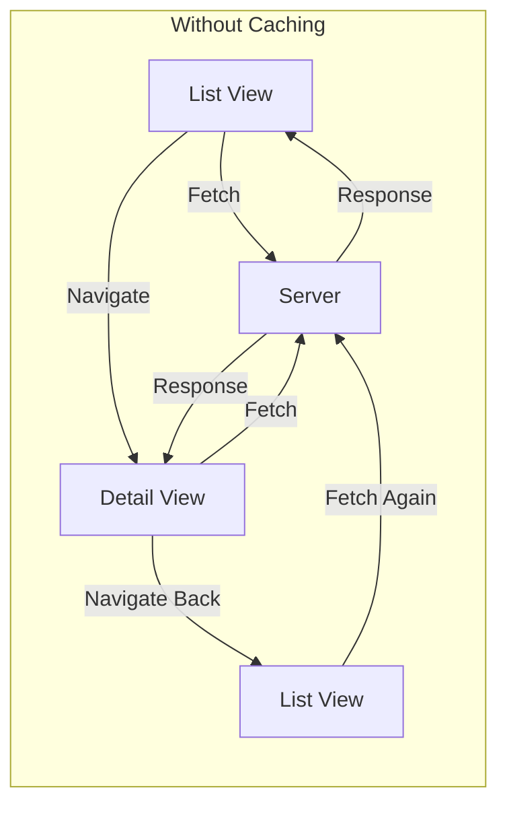
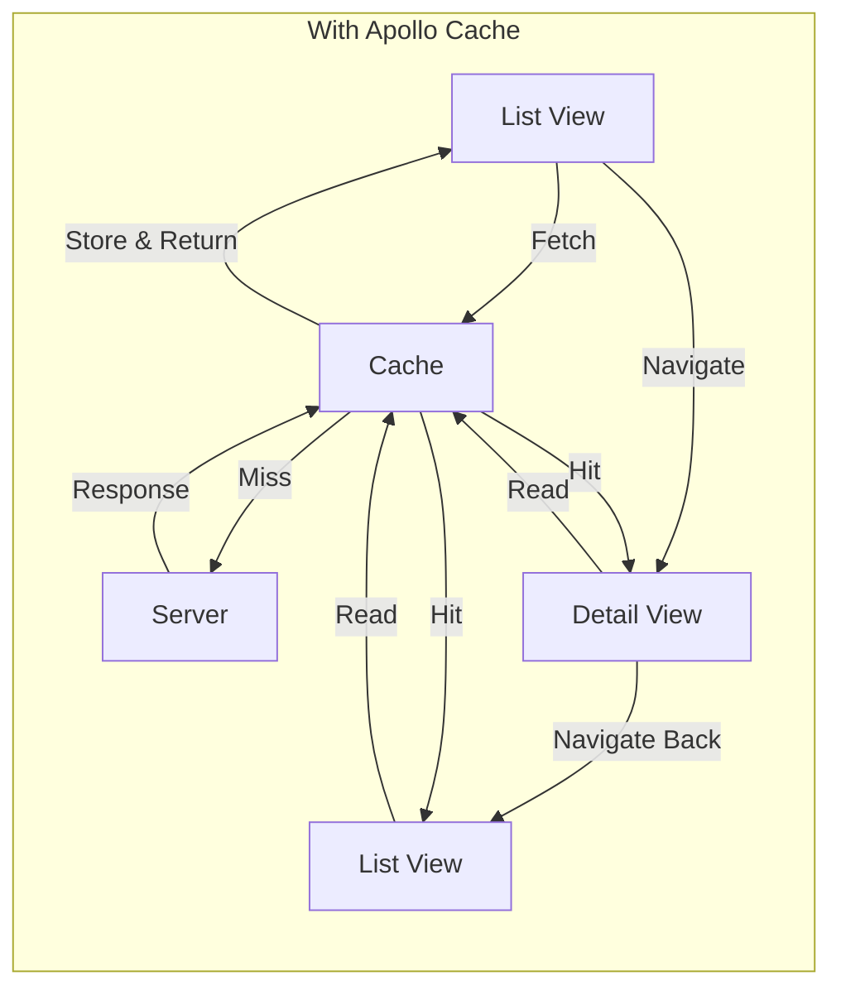
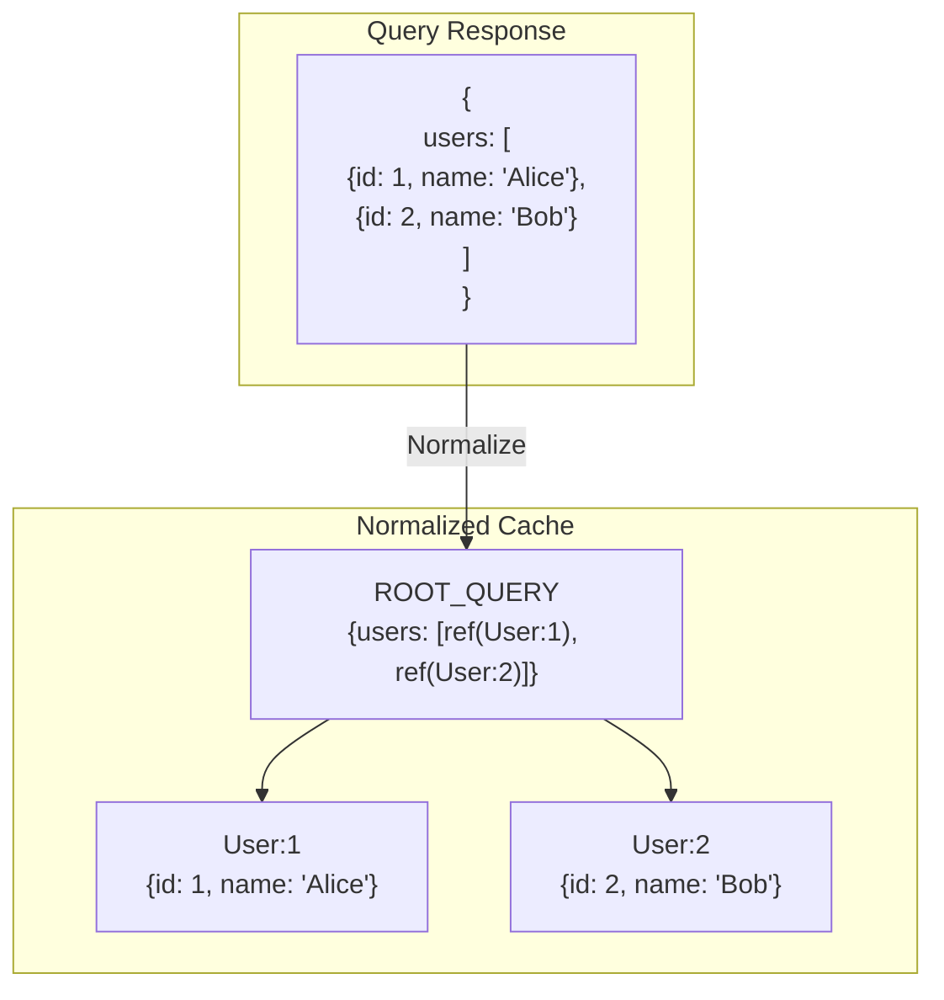

# How to Implement GraphQL Caching with Apollo Client

Author: [nawazdhandala](https://github.com/nawazdhandala)

Tags: GraphQL, Apollo Client, Caching, React, Frontend, Performance, JavaScript

Description: A practical guide to implementing client-side GraphQL caching with Apollo Client, covering normalized caching, fetch policies, cache updates, and optimistic UI patterns for production applications.

---

Client-side caching is where GraphQL truly shines. Unlike REST where you manually manage cached responses for each endpoint, GraphQL clients like Apollo automatically normalize and cache your data. This guide shows you how to leverage Apollo Client's caching system to build fast, responsive applications.

## Why Client-Side Caching Matters

When your user navigates from a list view to a detail view and back, they should not wait for the same data twice. Client-side caching solves this by storing fetched data locally and serving it instantly on subsequent requests.





With caching, your app feels instant. Users see data immediately while fresh data loads in the background.

## Setting Up Apollo Client with Caching

Start with a properly configured Apollo Client. The `InMemoryCache` is where the magic happens.

```javascript
// apollo-client.js
// This configuration sets up Apollo Client with normalized caching
// The InMemoryCache automatically normalizes data by __typename and id

import { ApolloClient, InMemoryCache, HttpLink } from '@apollo/client';

const httpLink = new HttpLink({
  uri: 'https://api.example.com/graphql',
  credentials: 'include',
});

// Configure the in-memory cache with type policies
const cache = new InMemoryCache({
  // Type policies define how each type should be cached and merged
  typePolicies: {
    // Query type handles root-level caching behavior
    Query: {
      fields: {
        // Paginated fields need special merge functions
        posts: {
          // keyArgs controls which arguments create separate cache entries
          // false means all arguments are ignored for cache identity
          keyArgs: false,
          // merge combines incoming data with existing cached data
          merge(existing = [], incoming) {
            return [...existing, ...incoming];
          },
        },
      },
    },
    // Define how User objects are identified and cached
    User: {
      // Use id field as the cache key (default behavior, but explicit is better)
      keyFields: ['id'],
      fields: {
        // Computed field that reads from other cached data
        fullName: {
          read(_, { readField }) {
            const firstName = readField('firstName');
            const lastName = readField('lastName');
            return `${firstName} ${lastName}`;
          },
        },
      },
    },
    // Posts use id as their cache key
    Post: {
      keyFields: ['id'],
    },
  },
});

export const client = new ApolloClient({
  link: httpLink,
  cache,
  // Default options for all queries
  defaultOptions: {
    watchQuery: {
      // cache-first serves cached data immediately, then fetches updates
      fetchPolicy: 'cache-first',
      // Return partial data from cache while loading
      returnPartialData: true,
    },
  },
});
```

## Understanding Normalized Caching

Apollo's biggest advantage is normalized caching. Instead of storing responses as-is, Apollo breaks them into individual objects and stores them by type and ID.



This normalization means when you update a user anywhere in your app, every query that references that user automatically gets the updated data.

```javascript
// Example: How normalization works in practice
// When you fetch a user's profile and their posts separately,
// they both reference the same cached User object

// Query 1: Get user profile
const GET_USER = gql`
  query GetUser($id: ID!) {
    user(id: $id) {
      id
      name
      email
      avatar
    }
  }
`;

// Query 2: Get posts with author
const GET_POSTS = gql`
  query GetPosts {
    posts {
      id
      title
      author {
        id
        name
        avatar
      }
    }
  }
`;

// If you update the user's avatar, both queries automatically
// show the new avatar because they reference the same User:1 object
```

## Fetch Policies Explained

Fetch policies control how Apollo balances between cache and network. Choosing the right policy is critical for user experience.

```javascript
// fetch-policies.js
// Different fetch policies for different use cases

import { useQuery } from '@apollo/client';

// 1. cache-first (default): Use cache if available, otherwise fetch
// Best for: Static data that rarely changes
function UserProfile({ userId }) {
  const { data, loading } = useQuery(GET_USER, {
    variables: { id: userId },
    fetchPolicy: 'cache-first',
  });

  // Shows cached data instantly, no loading state on revisit
  return loading ? <Spinner /> : <Profile user={data.user} />;
}

// 2. cache-and-network: Show cache immediately, then update from network
// Best for: Data that should feel instant but needs to stay fresh
function Dashboard() {
  const { data, loading, networkStatus } = useQuery(GET_DASHBOARD, {
    fetchPolicy: 'cache-and-network',
    // notifyOnNetworkStatusChange lets you detect background refetch
    notifyOnNetworkStatusChange: true,
  });

  const isRefetching = networkStatus === 4;

  return (
    <div>
      {isRefetching && <RefreshIndicator />}
      {data && <DashboardContent data={data} />}
    </div>
  );
}

// 3. network-only: Always fetch from network, but cache result
// Best for: Data that must be current (financial data, inventory)
function StockPrice({ symbol }) {
  const { data, loading } = useQuery(GET_STOCK, {
    variables: { symbol },
    fetchPolicy: 'network-only',
    // Poll every 5 seconds for real-time updates
    pollInterval: 5000,
  });

  return loading ? <Spinner /> : <Price value={data.stock.price} />;
}

// 4. no-cache: Fetch from network, don't store in cache
// Best for: Sensitive data you don't want persisted
function BankBalance() {
  const { data, loading } = useQuery(GET_BALANCE, {
    fetchPolicy: 'no-cache',
  });

  return loading ? <Spinner /> : <Balance amount={data.balance} />;
}

// 5. cache-only: Only read from cache, never fetch
// Best for: Offline mode or when you know data exists
function CachedUser({ userId }) {
  const { data } = useQuery(GET_USER, {
    variables: { id: userId },
    fetchPolicy: 'cache-only',
  });

  // Returns null if not in cache
  return data ? <UserCard user={data.user} /> : null;
}
```

## Updating the Cache After Mutations

When you create, update, or delete data, you need to keep the cache in sync. Apollo provides several strategies.

```javascript
// cache-updates.js
// Three strategies for updating cache after mutations

import { useMutation, gql } from '@apollo/client';

// Strategy 1: Automatic update (when mutation returns updated object)
// Apollo automatically updates cached objects that match by id
function EditPost({ postId }) {
  const [updatePost] = useMutation(gql`
    mutation UpdatePost($id: ID!, $title: String!) {
      updatePost(id: $id, title: $title) {
        id        # Must include id for automatic cache update
        title     # Return all fields you want updated
        updatedAt
      }
    }
  `);

  const handleSave = (title) => {
    // The returned post automatically updates Post:{postId} in cache
    updatePost({ variables: { id: postId, title } });
  };

  return <PostEditor onSave={handleSave} />;
}

// Strategy 2: Manual cache update for adding items to lists
// Use the update function when you need to modify query results
function CreatePost() {
  const [createPost] = useMutation(
    gql`
      mutation CreatePost($input: PostInput!) {
        createPost(input: $input) {
          id
          title
          content
          author {
            id
            name
          }
          createdAt
        }
      }
    `,
    {
      // update function receives cache and mutation result
      update(cache, { data: { createPost } }) {
        // Read the current posts from cache
        const existingData = cache.readQuery({ query: GET_POSTS });

        if (existingData) {
          // Write back with the new post prepended
          cache.writeQuery({
            query: GET_POSTS,
            data: {
              posts: [createPost, ...existingData.posts],
            },
          });
        }
      },
    }
  );

  return <PostForm onSubmit={(input) => createPost({ variables: { input } })} />;
}

// Strategy 3: refetchQueries for complex updates
// Use when manual updates are too complex or error-prone
function DeletePost({ postId }) {
  const [deletePost] = useMutation(
    gql`
      mutation DeletePost($id: ID!) {
        deletePost(id: $id) {
          id
        }
      }
    `,
    {
      // Refetch these queries after mutation completes
      refetchQueries: [
        { query: GET_POSTS },
        { query: GET_USER_STATS },
      ],
      // Or use function form for dynamic refetching
      // refetchQueries: (result) => [{ query: GET_POSTS }],

      // Also evict the deleted post from cache
      update(cache, { data: { deletePost } }) {
        cache.evict({ id: cache.identify(deletePost) });
        cache.gc(); // Garbage collect orphaned references
      },
    }
  );

  return <Button onClick={() => deletePost({ variables: { id: postId } })}>Delete</Button>;
}
```

## Optimistic UI Updates

Optimistic updates show the expected result immediately, before the server responds. This makes your app feel incredibly fast.

```javascript
// optimistic-updates.js
// Make your UI respond instantly to user actions

import { useMutation } from '@apollo/client';

function LikeButton({ postId, currentLikes, isLiked }) {
  const [toggleLike] = useMutation(
    gql`
      mutation ToggleLike($postId: ID!) {
        toggleLike(postId: $postId) {
          id
          likeCount
          isLikedByMe
        }
      }
    `,
    {
      // optimisticResponse provides fake data while waiting for server
      optimisticResponse: {
        toggleLike: {
          __typename: 'Post',
          id: postId,
          // Predict the new values
          likeCount: isLiked ? currentLikes - 1 : currentLikes + 1,
          isLikedByMe: !isLiked,
        },
      },
      // If the mutation fails, Apollo automatically rolls back
    }
  );

  return (
    <button onClick={() => toggleLike({ variables: { postId } })}>
      {isLiked ? 'Unlike' : 'Like'} ({currentLikes})
    </button>
  );
}

// More complex optimistic update: Adding a comment
function AddComment({ postId }) {
  const [addComment] = useMutation(
    gql`
      mutation AddComment($postId: ID!, $text: String!) {
        addComment(postId: $postId, text: $text) {
          id
          text
          author {
            id
            name
            avatar
          }
          createdAt
        }
      }
    `,
    {
      // Generate a temporary ID for the optimistic comment
      optimisticResponse: ({ text }) => ({
        addComment: {
          __typename: 'Comment',
          id: `temp-${Date.now()}`, // Temporary ID replaced by real one
          text,
          author: {
            __typename: 'User',
            id: currentUser.id,
            name: currentUser.name,
            avatar: currentUser.avatar,
          },
          createdAt: new Date().toISOString(),
        },
      }),
      // Update the cache to include the new comment
      update(cache, { data: { addComment } }) {
        cache.modify({
          id: cache.identify({ __typename: 'Post', id: postId }),
          fields: {
            comments(existingComments = []) {
              const newCommentRef = cache.writeFragment({
                data: addComment,
                fragment: gql`
                  fragment NewComment on Comment {
                    id
                    text
                    author {
                      id
                      name
                      avatar
                    }
                    createdAt
                  }
                `,
              });
              return [...existingComments, newCommentRef];
            },
            commentCount(existing = 0) {
              return existing + 1;
            },
          },
        });
      },
    }
  );

  return <CommentForm onSubmit={(text) => addComment({ variables: { postId, text } })} />;
}
```

## Pagination with Cached Data

Pagination requires special handling to merge pages correctly in the cache.

```javascript
// pagination.js
// Implement cursor-based pagination with proper cache merging

import { useQuery, gql } from '@apollo/client';

const GET_POSTS = gql`
  query GetPosts($cursor: String, $limit: Int!) {
    posts(after: $cursor, limit: $limit) {
      edges {
        node {
          id
          title
          excerpt
          author {
            id
            name
          }
        }
        cursor
      }
      pageInfo {
        hasNextPage
        endCursor
      }
    }
  }
`;

// Configure cache to merge paginated results
const cache = new InMemoryCache({
  typePolicies: {
    Query: {
      fields: {
        posts: {
          // keyArgs specifies which arguments create separate cache entries
          // Empty array means ignore all arguments for cache identity
          keyArgs: [],
          // merge function combines incoming pages with existing data
          merge(existing, incoming, { args }) {
            // If cursor is null, this is a fresh fetch (replace existing)
            if (!args?.cursor) {
              return incoming;
            }

            // Otherwise, append incoming edges to existing edges
            return {
              ...incoming,
              edges: [...(existing?.edges || []), ...incoming.edges],
            };
          },
        },
      },
    },
  },
});

function PostList() {
  const { data, loading, fetchMore } = useQuery(GET_POSTS, {
    variables: { limit: 10 },
    notifyOnNetworkStatusChange: true,
  });

  const loadMore = () => {
    if (!data?.posts.pageInfo.hasNextPage) return;

    fetchMore({
      variables: {
        cursor: data.posts.pageInfo.endCursor,
        limit: 10,
      },
      // No need for updateQuery, the merge function handles it
    });
  };

  return (
    <div>
      {data?.posts.edges.map(({ node }) => (
        <PostCard key={node.id} post={node} />
      ))}

      {data?.posts.pageInfo.hasNextPage && (
        <button onClick={loadMore} disabled={loading}>
          {loading ? 'Loading...' : 'Load More'}
        </button>
      )}
    </div>
  );
}
```

## Cache Persistence for Offline Support

Persist your cache to localStorage or IndexedDB for offline support and faster initial loads.

```javascript
// cache-persistence.js
// Persist Apollo cache across sessions for offline support

import { ApolloClient, InMemoryCache } from '@apollo/client';
import { persistCache, LocalStorageWrapper } from 'apollo3-cache-persist';

async function createClient() {
  const cache = new InMemoryCache({
    typePolicies: {
      // Your type policies here
    },
  });

  // Wait for cache to be restored from localStorage
  await persistCache({
    cache,
    storage: new LocalStorageWrapper(window.localStorage),
    // Optional: Only persist certain types
    // trigger: 'write', // Persist on every write (default: 'background')
    // maxSize: 1048576, // 1MB max storage
    // debug: true, // Enable debug logging
  });

  return new ApolloClient({
    cache,
    link: httpLink,
    // Start with cached data while fetching fresh data
    defaultOptions: {
      watchQuery: {
        fetchPolicy: 'cache-and-network',
      },
    },
  });
}

// For larger applications, use IndexedDB instead of localStorage
import { CachePersistor, LocalForageWrapper } from 'apollo3-cache-persist';
import localforage from 'localforage';

async function createClientWithIndexedDB() {
  const cache = new InMemoryCache();

  const persistor = new CachePersistor({
    cache,
    storage: new LocalForageWrapper(localforage),
    maxSize: 5242880, // 5MB
    debug: process.env.NODE_ENV === 'development',
  });

  // Restore cache from IndexedDB
  await persistor.restore();

  // Expose persistor for manual control
  const client = new ApolloClient({ cache, link: httpLink });

  // Clear persisted cache when user logs out
  client.clearAndPersist = async () => {
    await client.clearStore();
    await persistor.purge();
  };

  return client;
}
```

## Reading and Writing Cache Directly

Sometimes you need to read or modify the cache outside of queries and mutations.

```javascript
// direct-cache-access.js
// Read and write cache data directly for advanced use cases

import { useApolloClient, gql } from '@apollo/client';

function useUpdateUserStatus() {
  const client = useApolloClient();

  // Read data from cache
  const getUserFromCache = (userId) => {
    return client.readFragment({
      id: `User:${userId}`,
      fragment: gql`
        fragment UserStatus on User {
          id
          name
          isOnline
          lastSeen
        }
      `,
    });
  };

  // Write data to cache
  const setUserOnline = (userId, isOnline) => {
    client.writeFragment({
      id: `User:${userId}`,
      fragment: gql`
        fragment UserOnlineStatus on User {
          isOnline
          lastSeen
        }
      `,
      data: {
        isOnline,
        lastSeen: isOnline ? null : new Date().toISOString(),
      },
    });
  };

  // Modify specific fields without replacing entire object
  const incrementUnreadCount = (userId) => {
    client.cache.modify({
      id: `User:${userId}`,
      fields: {
        unreadMessageCount(existing = 0) {
          return existing + 1;
        },
      },
    });
  };

  return { getUserFromCache, setUserOnline, incrementUnreadCount };
}

// Example: Real-time updates from WebSocket
function useRealtimeUpdates() {
  const client = useApolloClient();

  useEffect(() => {
    const ws = new WebSocket('wss://api.example.com/ws');

    ws.onmessage = (event) => {
      const { type, payload } = JSON.parse(event.data);

      switch (type) {
        case 'USER_STATUS_CHANGED':
          // Update cache when user status changes
          client.writeFragment({
            id: `User:${payload.userId}`,
            fragment: gql`
              fragment UserStatus on User {
                isOnline
              }
            `,
            data: { isOnline: payload.isOnline },
          });
          break;

        case 'NEW_MESSAGE':
          // Add new message to cache
          client.cache.modify({
            id: `Conversation:${payload.conversationId}`,
            fields: {
              messages(existing = []) {
                const newMessageRef = client.cache.writeFragment({
                  data: payload.message,
                  fragment: gql`
                    fragment NewMessage on Message {
                      id
                      text
                      sender { id name }
                      createdAt
                    }
                  `,
                });
                return [...existing, newMessageRef];
              },
            },
          });
          break;
      }
    };

    return () => ws.close();
  }, [client]);
}
```

## Debugging Cache Issues

When things go wrong, Apollo DevTools and cache inspection help you understand what is happening.

```javascript
// debug-cache.js
// Tools and techniques for debugging Apollo cache issues

import { useApolloClient } from '@apollo/client';

function CacheDebugger() {
  const client = useApolloClient();

  // Extract entire cache for inspection
  const inspectCache = () => {
    const cacheData = client.cache.extract();
    console.log('Cache contents:', cacheData);
    return cacheData;
  };

  // Find all cached objects of a type
  const findByType = (typeName) => {
    const cache = client.cache.extract();
    return Object.entries(cache)
      .filter(([key]) => key.startsWith(`${typeName}:`))
      .map(([key, value]) => ({ key, value }));
  };

  // Check if a specific object is cached
  const isInCache = (typeName, id) => {
    const cacheId = `${typeName}:${id}`;
    const cache = client.cache.extract();
    return cacheId in cache;
  };

  // Only render in development
  if (process.env.NODE_ENV !== 'development') {
    return null;
  }

  return (
    <div className="cache-debugger">
      <button onClick={inspectCache}>Log Cache</button>
      <button onClick={() => console.log(findByType('User'))}>Find Users</button>
      <button onClick={() => client.cache.gc()}>Garbage Collect</button>
      <button onClick={() => client.resetStore()}>Reset Cache</button>
    </div>
  );
}

// Custom hook for watching cache changes
function useCacheWatch(typeName, id) {
  const client = useApolloClient();
  const [data, setData] = useState(null);

  useEffect(() => {
    const cacheId = client.cache.identify({ __typename: typeName, id });

    // Watch for changes to this cache entry
    const observable = client.watchFragment({
      id: cacheId,
      fragment: gql`
        fragment WatchedFragment on ${typeName} {
          id
        }
      `,
    });

    const subscription = observable.subscribe({
      next: (result) => {
        console.log(`Cache update for ${cacheId}:`, result);
        setData(result.data);
      },
    });

    return () => subscription.unsubscribe();
  }, [client, typeName, id]);

  return data;
}
```

## Production Cache Configuration

Here is a complete production configuration bringing together all the concepts.

```javascript
// apollo-production.js
// Production-ready Apollo Client configuration

import {
  ApolloClient,
  InMemoryCache,
  HttpLink,
  from,
  split,
} from '@apollo/client';
import { onError } from '@apollo/client/link/error';
import { RetryLink } from '@apollo/client/link/retry';
import { GraphQLWsLink } from '@apollo/client/link/subscriptions';
import { getMainDefinition } from '@apollo/client/utilities';
import { createClient as createWsClient } from 'graphql-ws';
import { persistCache, LocalStorageWrapper } from 'apollo3-cache-persist';

// Error handling link logs errors and handles auth failures
const errorLink = onError(({ graphQLErrors, networkError, operation }) => {
  if (graphQLErrors) {
    graphQLErrors.forEach(({ message, locations, path }) => {
      console.error(`GraphQL error: ${message}`, { locations, path });

      // Handle authentication errors
      if (message.includes('UNAUTHENTICATED')) {
        // Redirect to login or refresh token
        window.location.href = '/login';
      }
    });
  }

  if (networkError) {
    console.error(`Network error: ${networkError.message}`);
  }
});

// Retry link automatically retries failed requests
const retryLink = new RetryLink({
  delay: {
    initial: 300,
    max: 3000,
    jitter: true,
  },
  attempts: {
    max: 3,
    retryIf: (error) => !!error && !error.message.includes('UNAUTHENTICATED'),
  },
});

// HTTP link for queries and mutations
const httpLink = new HttpLink({
  uri: process.env.REACT_APP_GRAPHQL_URL,
  credentials: 'include',
});

// WebSocket link for subscriptions
const wsLink = new GraphQLWsLink(
  createWsClient({
    url: process.env.REACT_APP_GRAPHQL_WS_URL,
    connectionParams: () => ({
      authToken: localStorage.getItem('token'),
    }),
  })
);

// Split between WebSocket and HTTP based on operation type
const splitLink = split(
  ({ query }) => {
    const definition = getMainDefinition(query);
    return (
      definition.kind === 'OperationDefinition' &&
      definition.operation === 'subscription'
    );
  },
  wsLink,
  httpLink
);

// Configure cache with type policies for your domain
const cache = new InMemoryCache({
  typePolicies: {
    Query: {
      fields: {
        // Pagination fields
        posts: {
          keyArgs: ['filter', 'sortBy'],
          merge(existing = { edges: [] }, incoming, { args }) {
            if (!args?.cursor) return incoming;
            return {
              ...incoming,
              edges: [...existing.edges, ...incoming.edges],
            };
          },
        },
        // Field that reads from another cached query
        postById: {
          read(_, { args, toReference }) {
            return toReference({ __typename: 'Post', id: args.id });
          },
        },
      },
    },
    User: {
      keyFields: ['id'],
      fields: {
        fullName: {
          read(_, { readField }) {
            return `${readField('firstName')} ${readField('lastName')}`;
          },
        },
      },
    },
    Post: {
      keyFields: ['id'],
      fields: {
        isLikedByMe: {
          merge(_, incoming) {
            return incoming;
          },
        },
      },
    },
    Notification: {
      keyFields: ['id'],
      // Notifications with same ID always merge, keeping newest data
      merge: true,
    },
  },
});

// Initialize client with cache persistence
export async function initializeApollo() {
  // Restore cache from localStorage
  await persistCache({
    cache,
    storage: new LocalStorageWrapper(window.localStorage),
    maxSize: 2097152, // 2MB
  });

  const client = new ApolloClient({
    link: from([errorLink, retryLink, splitLink]),
    cache,
    defaultOptions: {
      watchQuery: {
        fetchPolicy: 'cache-and-network',
        returnPartialData: true,
        notifyOnNetworkStatusChange: true,
      },
      query: {
        fetchPolicy: 'cache-first',
        errorPolicy: 'all',
      },
      mutate: {
        errorPolicy: 'all',
      },
    },
    // Connect to Apollo DevTools in development
    connectToDevTools: process.env.NODE_ENV === 'development',
  });

  return client;
}
```

## Cache Strategy Cheat Sheet

| Scenario | Fetch Policy | Cache Strategy |
|----------|--------------|----------------|
| Static content | cache-first | Long TTL, CDN |
| User profile | cache-and-network | Auto-update on mutation |
| Dashboard data | cache-and-network | Poll or subscribe |
| Real-time data | network-only | WebSocket updates |
| Sensitive data | no-cache | Never persist |
| Paginated list | cache-first | Custom merge function |
| Search results | network-only | No merge (fresh each time) |

---

Client-side caching transforms your GraphQL application from a collection of loading spinners into a responsive, instant experience. Start with automatic normalization and cache-first policies, then add optimistic updates for mutations and persist your cache for offline support. Monitor your cache hit rates in development using Apollo DevTools, and adjust your fetch policies based on how your data changes. The investment in proper caching pays dividends in user satisfaction and reduced server load.
