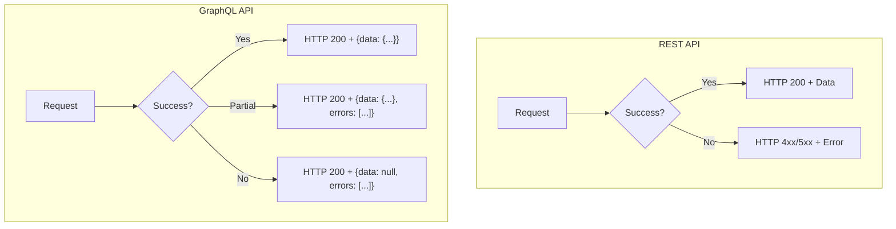
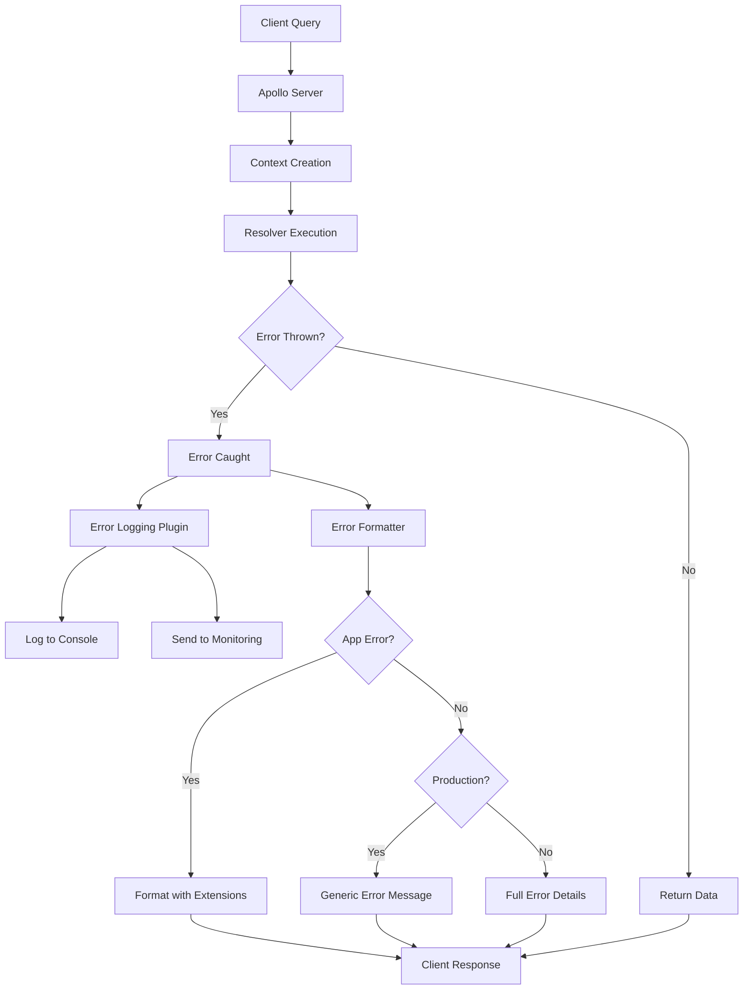
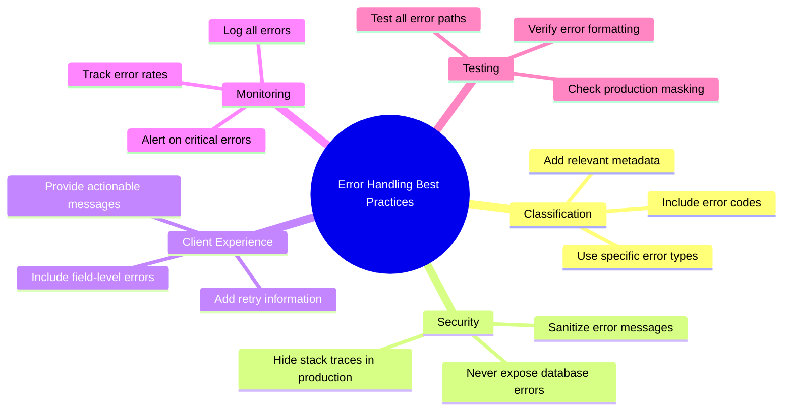

# How to Create GraphQL Error Handling

Author: [nawazdhandala](https://github.com/nawazdhandala)

Tags: GraphQL, Error Handling, API Development, Node.js, Apollo Server, TypeScript, Production

Description: Learn how to build a complete GraphQL error handling system from scratch with custom error types, error formatting, client-friendly responses, and monitoring integration for production applications.

---

Building a proper error handling system in GraphQL is different from REST APIs. Instead of relying on HTTP status codes, GraphQL uses a structured error format within the response body. This guide walks you through creating a production-ready error handling system that provides clear feedback to clients while keeping sensitive information secure.

## Why GraphQL Error Handling Matters

In REST APIs, you rely on HTTP status codes (404, 500, 401) to communicate errors. GraphQL takes a different approach: every response returns HTTP 200, and errors are included in the response body alongside any partial data that was successfully resolved.



This design allows GraphQL to return partial results when some fields succeed and others fail, which is particularly useful for complex queries spanning multiple data sources.

## Setting Up the Error Foundation

Let's start by creating a base error class that all custom errors will extend. This foundation ensures consistency across your error handling.

The base error class includes properties for error codes, HTTP status hints, and additional metadata that clients can use for error handling.

```typescript
// src/errors/base-error.ts
// Base class for all application-specific GraphQL errors

export interface ErrorExtensions {
  code: string;
  statusCode: number;
  timestamp: string;
  [key: string]: unknown;
}

export class ApplicationError extends Error {
  public readonly code: string;
  public readonly statusCode: number;
  public readonly extensions: ErrorExtensions;

  constructor(
    message: string,
    code: string,
    statusCode: number = 400,
    extensions: Record<string, unknown> = {}
  ) {
    super(message);

    // Maintains proper stack trace for where error was thrown
    Error.captureStackTrace(this, this.constructor);

    this.name = this.constructor.name;
    this.code = code;
    this.statusCode = statusCode;
    this.extensions = {
      code,
      statusCode,
      timestamp: new Date().toISOString(),
      ...extensions
    };
  }

  // Convert to a format suitable for GraphQL error response
  toGraphQLError(): Record<string, unknown> {
    return {
      message: this.message,
      extensions: this.extensions
    };
  }
}
```

## Creating Specific Error Types

With the base class in place, create specific error types for common scenarios. Each error type carries its own default message, code, and status.

These error classes make your code more readable and ensure consistent error responses across your API.

```typescript
// src/errors/index.ts
// Collection of specific error types for different scenarios

import { ApplicationError } from './base-error';

// Thrown when a user is not authenticated
export class AuthenticationError extends ApplicationError {
  constructor(message: string = 'You must be logged in to perform this action') {
    super(message, 'UNAUTHENTICATED', 401);
  }
}

// Thrown when a user lacks permission for an action
export class AuthorizationError extends ApplicationError {
  constructor(message: string = 'You do not have permission to perform this action') {
    super(message, 'FORBIDDEN', 403);
  }
}

// Thrown when a requested resource does not exist
export class NotFoundError extends ApplicationError {
  constructor(resource: string, identifier?: string | number) {
    const message = identifier
      ? `${resource} with ID "${identifier}" was not found`
      : `${resource} was not found`;

    super(message, 'NOT_FOUND', 404, {
      resource,
      identifier: identifier?.toString()
    });
  }
}

// Thrown when input validation fails
export class ValidationError extends ApplicationError {
  public readonly fieldErrors: Array<{ field: string; message: string }>;

  constructor(
    message: string = 'Validation failed',
    fieldErrors: Array<{ field: string; message: string }> = []
  ) {
    super(message, 'VALIDATION_ERROR', 400, {
      fieldErrors
    });
    this.fieldErrors = fieldErrors;
  }

  // Factory method for creating validation errors from field errors
  static fromFields(errors: Array<{ field: string; message: string }>): ValidationError {
    const message = errors.length === 1
      ? errors[0].message
      : `${errors.length} validation errors occurred`;
    return new ValidationError(message, errors);
  }
}

// Thrown when a resource already exists (duplicate)
export class ConflictError extends ApplicationError {
  constructor(message: string = 'Resource already exists') {
    super(message, 'CONFLICT', 409);
  }
}

// Thrown when rate limit is exceeded
export class RateLimitError extends ApplicationError {
  constructor(retryAfterSeconds: number = 60) {
    super(
      `Rate limit exceeded. Please retry after ${retryAfterSeconds} seconds`,
      'RATE_LIMITED',
      429,
      { retryAfter: retryAfterSeconds }
    );
  }
}

// Thrown for unexpected internal errors
export class InternalError extends ApplicationError {
  constructor(message: string = 'An unexpected error occurred') {
    super(message, 'INTERNAL_ERROR', 500);
  }
}

// Thrown when an external service fails
export class ServiceUnavailableError extends ApplicationError {
  constructor(service: string, message?: string) {
    super(
      message || `The ${service} service is currently unavailable`,
      'SERVICE_UNAVAILABLE',
      503,
      { service }
    );
  }
}

// Re-export base error
export { ApplicationError } from './base-error';
```

## Configuring the Error Formatter

Apollo Server uses a `formatError` function to transform errors before sending them to clients. This is where you control what information gets exposed.

The formatter sanitizes errors for production while providing detailed information in development mode.

```typescript
// src/config/error-formatter.ts
// Formats errors for client consumption while hiding sensitive details

import { GraphQLFormattedError } from 'graphql';
import { unwrapResolverError } from '@apollo/server/errors';
import { ApplicationError } from '../errors';

interface FormatterContext {
  isDevelopment: boolean;
}

export function createErrorFormatter(context: FormatterContext) {
  return function formatError(
    formattedError: GraphQLFormattedError,
    error: unknown
  ): GraphQLFormattedError {
    // Unwrap the error to get the original error thrown in the resolver
    const originalError = unwrapResolverError(error);

    // Handle our custom application errors
    if (originalError instanceof ApplicationError) {
      return {
        message: formattedError.message,
        path: formattedError.path,
        extensions: {
          ...originalError.extensions,
          // Include stack trace only in development
          ...(context.isDevelopment && {
            stacktrace: originalError.stack?.split('\n')
          })
        }
      };
    }

    // Handle GraphQL validation errors (syntax errors, wrong field names)
    if (formattedError.extensions?.code === 'GRAPHQL_VALIDATION_FAILED') {
      return {
        message: formattedError.message,
        path: formattedError.path,
        locations: formattedError.locations,
        extensions: {
          code: 'VALIDATION_ERROR',
          statusCode: 400,
          timestamp: new Date().toISOString()
        }
      };
    }

    // Handle GraphQL parse errors (malformed queries)
    if (formattedError.extensions?.code === 'GRAPHQL_PARSE_FAILED') {
      return {
        message: 'Invalid GraphQL query syntax',
        path: formattedError.path,
        extensions: {
          code: 'PARSE_ERROR',
          statusCode: 400,
          timestamp: new Date().toISOString(),
          ...(context.isDevelopment && {
            originalMessage: formattedError.message
          })
        }
      };
    }

    // For unknown errors in production, hide the real message
    if (!context.isDevelopment) {
      return {
        message: 'An unexpected error occurred',
        path: formattedError.path,
        extensions: {
          code: 'INTERNAL_ERROR',
          statusCode: 500,
          timestamp: new Date().toISOString()
        }
      };
    }

    // In development, return full error details
    return {
      message: formattedError.message,
      path: formattedError.path,
      locations: formattedError.locations,
      extensions: {
        code: formattedError.extensions?.code || 'INTERNAL_ERROR',
        statusCode: 500,
        timestamp: new Date().toISOString(),
        stacktrace: formattedError.extensions?.stacktrace
      }
    };
  };
}
```

## Creating the Error Handling Plugin

Apollo Server plugins let you hook into the request lifecycle. Create a plugin that logs errors and sends them to your monitoring service.

This plugin captures errors at different stages: during request parsing, validation, and execution.

```typescript
// src/plugins/error-logging-plugin.ts
// Plugin for logging and monitoring GraphQL errors

import { ApolloServerPlugin, GraphQLRequestListener } from '@apollo/server';
import { ApplicationError } from '../errors';

interface ErrorLogEntry {
  timestamp: string;
  operationName: string | null;
  errorCode: string;
  errorMessage: string;
  path: string | null;
  userId: string | null;
  requestId: string;
  variables: Record<string, unknown> | null;
}

// Fields that should never be logged
const SENSITIVE_FIELDS = ['password', 'token', 'secret', 'apiKey', 'creditCard'];

// Recursively remove sensitive fields from an object
function sanitizeVariables(
  variables: Record<string, unknown> | null
): Record<string, unknown> | null {
  if (!variables) return null;

  const sanitized: Record<string, unknown> = {};

  for (const [key, value] of Object.entries(variables)) {
    if (SENSITIVE_FIELDS.some(field => key.toLowerCase().includes(field))) {
      sanitized[key] = '[REDACTED]';
    } else if (typeof value === 'object' && value !== null) {
      sanitized[key] = sanitizeVariables(value as Record<string, unknown>);
    } else {
      sanitized[key] = value;
    }
  }

  return sanitized;
}

// Interface for external error tracking services
export interface ErrorTracker {
  captureError(error: Error, context: Record<string, unknown>): void;
  captureMessage(message: string, level: 'info' | 'warning' | 'error'): void;
}

export interface ErrorLoggingPluginOptions {
  errorTracker?: ErrorTracker;
  logger?: Pick<Console, 'error' | 'warn' | 'info'>;
}

export function createErrorLoggingPlugin<TContext extends { user?: { id: string }; requestId: string }>(
  options: ErrorLoggingPluginOptions = {}
): ApolloServerPlugin<TContext> {
  const { errorTracker, logger = console } = options;

  return {
    async requestDidStart(): Promise<GraphQLRequestListener<TContext>> {
      return {
        async didEncounterErrors({ errors, request, contextValue }) {
          for (const error of errors) {
            const originalError = error.originalError;
            const errorCode = (originalError instanceof ApplicationError)
              ? originalError.code
              : 'INTERNAL_ERROR';

            const logEntry: ErrorLogEntry = {
              timestamp: new Date().toISOString(),
              operationName: request.operationName || null,
              errorCode,
              errorMessage: error.message,
              path: error.path?.join('.') || null,
              userId: contextValue.user?.id || null,
              requestId: contextValue.requestId,
              variables: sanitizeVariables(
                request.variables as Record<string, unknown> | null
              )
            };

            // Log based on error severity
            if (errorCode === 'INTERNAL_ERROR') {
              logger.error('Critical GraphQL Error:', logEntry);

              // Send to error tracking service
              if (errorTracker && originalError) {
                errorTracker.captureError(originalError, logEntry);
              }
            } else if (errorCode === 'UNAUTHENTICATED') {
              // Log auth failures for security monitoring
              logger.warn('Authentication Error:', logEntry);
            } else {
              logger.info('GraphQL Error:', logEntry);
            }
          }
        }
      };
    }
  };
}
```

## Putting It All Together

Now let's assemble everything into a working Apollo Server configuration.

This setup includes the error formatter, logging plugin, and proper context handling for production use.

```typescript
// src/server.ts
// Main Apollo Server configuration with error handling

import { ApolloServer } from '@apollo/server';
import { expressMiddleware } from '@apollo/server/express4';
import express from 'express';
import { v4 as uuidv4 } from 'uuid';
import { typeDefs } from './schema';
import { resolvers } from './resolvers';
import { createErrorFormatter } from './config/error-formatter';
import { createErrorLoggingPlugin } from './plugins/error-logging-plugin';

// Define your context type
interface Context {
  user: { id: string; role: string } | null;
  requestId: string;
  db: Database;
}

// Create the error formatter based on environment
const isDevelopment = process.env.NODE_ENV !== 'production';
const formatError = createErrorFormatter({ isDevelopment });

// Create the error logging plugin
const errorLoggingPlugin = createErrorLoggingPlugin<Context>({
  logger: console,
  // Optionally add error tracking service
  // errorTracker: sentryTracker
});

// Initialize Apollo Server
const server = new ApolloServer<Context>({
  typeDefs,
  resolvers,
  formatError,
  plugins: [errorLoggingPlugin],
  // Include stack traces in development
  includeStacktraceInErrorResponses: isDevelopment
});

async function startServer() {
  await server.start();

  const app = express();

  app.use(express.json());

  app.use(
    '/graphql',
    expressMiddleware(server, {
      context: async ({ req }) => {
        // Generate unique request ID for tracing
        const requestId = req.headers['x-request-id'] as string || uuidv4();

        // Extract user from auth token (simplified)
        const user = await getUserFromToken(req.headers.authorization);

        return {
          user,
          requestId,
          db: getDatabase()
        };
      }
    })
  );

  const PORT = process.env.PORT || 4000;
  app.listen(PORT, () => {
    console.log(`Server running at http://localhost:${PORT}/graphql`);
  });
}

startServer();
```

## Using Errors in Resolvers

With the error infrastructure in place, using errors in your resolvers becomes straightforward and consistent.

Here is an example showing how to use the error classes in real resolver functions.

```typescript
// src/resolvers/user.ts
// User resolvers demonstrating error handling patterns

import {
  AuthenticationError,
  AuthorizationError,
  NotFoundError,
  ValidationError,
  ConflictError
} from '../errors';

export const userResolvers = {
  Query: {
    // Get current authenticated user
    me: async (_parent: unknown, _args: unknown, context: Context) => {
      if (!context.user) {
        throw new AuthenticationError();
      }

      return context.db.users.findById(context.user.id);
    },

    // Get a specific user by ID
    user: async (_parent: unknown, args: { id: string }, context: Context) => {
      if (!context.user) {
        throw new AuthenticationError();
      }

      const user = await context.db.users.findById(args.id);

      if (!user) {
        throw new NotFoundError('User', args.id);
      }

      // Check if user can view this profile
      if (user.isPrivate && user.id !== context.user.id) {
        throw new AuthorizationError('This profile is private');
      }

      return user;
    },

    // Admin-only endpoint
    allUsers: async (_parent: unknown, _args: unknown, context: Context) => {
      if (!context.user) {
        throw new AuthenticationError();
      }

      if (context.user.role !== 'ADMIN') {
        throw new AuthorizationError('Admin access required');
      }

      return context.db.users.findAll();
    }
  },

  Mutation: {
    // Create a new user with validation
    createUser: async (
      _parent: unknown,
      args: { input: CreateUserInput },
      context: Context
    ) => {
      const { input } = args;
      const errors: Array<{ field: string; message: string }> = [];

      // Validate email format
      if (!input.email) {
        errors.push({ field: 'email', message: 'Email is required' });
      } else if (!isValidEmail(input.email)) {
        errors.push({ field: 'email', message: 'Email format is invalid' });
      }

      // Validate password strength
      if (!input.password) {
        errors.push({ field: 'password', message: 'Password is required' });
      } else if (input.password.length < 8) {
        errors.push({
          field: 'password',
          message: 'Password must be at least 8 characters'
        });
      }

      // Validate name
      if (!input.name || input.name.trim().length === 0) {
        errors.push({ field: 'name', message: 'Name is required' });
      }

      // Throw if validation failed
      if (errors.length > 0) {
        throw ValidationError.fromFields(errors);
      }

      // Check for existing user
      const existingUser = await context.db.users.findByEmail(input.email);
      if (existingUser) {
        throw new ConflictError('A user with this email already exists');
      }

      // Create and return the user
      return context.db.users.create(input);
    },

    // Update user profile
    updateUser: async (
      _parent: unknown,
      args: { id: string; input: UpdateUserInput },
      context: Context
    ) => {
      if (!context.user) {
        throw new AuthenticationError();
      }

      const user = await context.db.users.findById(args.id);

      if (!user) {
        throw new NotFoundError('User', args.id);
      }

      // Users can only update their own profile unless admin
      const canUpdate =
        user.id === context.user.id ||
        context.user.role === 'ADMIN';

      if (!canUpdate) {
        throw new AuthorizationError('You can only update your own profile');
      }

      return context.db.users.update(args.id, args.input);
    }
  }
};

// Helper function for email validation
function isValidEmail(email: string): boolean {
  const emailRegex = /^[^\s@]+@[^\s@]+\.[^\s@]+$/;
  return emailRegex.test(email);
}
```

## Error Flow Architecture

This diagram shows how errors flow through your GraphQL server from the resolver to the client.



## Handling Errors in Subscriptions

Subscriptions require special error handling since they maintain persistent connections.

Errors in subscriptions should be sent through the subscription stream rather than as HTTP responses.

```typescript
// src/resolvers/subscriptions.ts
// Subscription resolvers with error handling

import { withFilter } from 'graphql-subscriptions';
import { AuthenticationError, NotFoundError } from '../errors';

export const subscriptionResolvers = {
  Subscription: {
    messageReceived: {
      // Check authentication before subscribing
      subscribe: async function* (
        _parent: unknown,
        args: { channelId: string },
        context: Context
      ) {
        if (!context.user) {
          throw new AuthenticationError('Authentication required for subscriptions');
        }

        // Verify channel exists and user has access
        const channel = await context.db.channels.findById(args.channelId);
        if (!channel) {
          throw new NotFoundError('Channel', args.channelId);
        }

        const hasAccess = await context.db.channels.userHasAccess(
          args.channelId,
          context.user.id
        );

        if (!hasAccess) {
          throw new AuthorizationError('You do not have access to this channel');
        }

        // Return the async iterator for the subscription
        const iterator = context.pubsub.asyncIterator(`MESSAGE_${args.channelId}`);

        // Wrap iterator to handle errors during iteration
        try {
          for await (const message of iterator) {
            yield { messageReceived: message };
          }
        } catch (error) {
          // Log subscription errors
          console.error('Subscription error:', error);
          throw new InternalError('Subscription connection failed');
        }
      }
    }
  }
};
```

## Client-Side Error Handling

Design your error responses to be easily consumable by clients. Here is how clients can handle your structured errors.

This example shows React components using Apollo Client with proper error handling.

```typescript
// Client-side error handling with Apollo Client (React example)

import { useQuery, useMutation, ApolloError } from '@apollo/client';
import { GET_USER, UPDATE_USER } from './queries';

// Helper to extract error details from Apollo errors
function getErrorInfo(error: ApolloError) {
  const graphQLError = error.graphQLErrors[0];

  return {
    code: graphQLError?.extensions?.code as string || 'UNKNOWN',
    message: graphQLError?.message || error.message,
    fieldErrors: graphQLError?.extensions?.fieldErrors as Array<{
      field: string;
      message: string;
    }> || []
  };
}

// Component using query with error handling
function UserProfile({ userId }: { userId: string }) {
  const { data, loading, error } = useQuery(GET_USER, {
    variables: { id: userId }
  });

  if (loading) {
    return <LoadingSpinner />;
  }

  if (error) {
    const { code, message } = getErrorInfo(error);

    switch (code) {
      case 'UNAUTHENTICATED':
        // Redirect to login
        return <RedirectToLogin />;

      case 'FORBIDDEN':
        return <AccessDenied message={message} />;

      case 'NOT_FOUND':
        return <NotFound resourceType="User" />;

      default:
        return <ErrorDisplay message={message} />;
    }
  }

  return <UserDetails user={data.user} />;
}

// Component using mutation with validation error handling
function UpdateProfileForm({ userId }: { userId: string }) {
  const [updateUser, { loading }] = useMutation(UPDATE_USER);
  const [formErrors, setFormErrors] = useState<Record<string, string>>({});
  const [globalError, setGlobalError] = useState<string | null>(null);

  async function handleSubmit(formData: FormData) {
    setFormErrors({});
    setGlobalError(null);

    try {
      const result = await updateUser({
        variables: {
          id: userId,
          input: {
            name: formData.get('name'),
            bio: formData.get('bio')
          }
        }
      });

      // Success - redirect or show message
      showSuccessToast('Profile updated successfully');
    } catch (error) {
      if (error instanceof ApolloError) {
        const { code, message, fieldErrors } = getErrorInfo(error);

        if (code === 'VALIDATION_ERROR' && fieldErrors.length > 0) {
          // Map field errors to form fields
          const errorMap: Record<string, string> = {};
          for (const fieldError of fieldErrors) {
            errorMap[fieldError.field] = fieldError.message;
          }
          setFormErrors(errorMap);
        } else {
          setGlobalError(message);
        }
      }
    }
  }

  return (
    <form onSubmit={handleSubmit}>
      {globalError && <Alert type="error">{globalError}</Alert>}

      <TextField
        name="name"
        label="Name"
        error={formErrors.name}
      />

      <TextField
        name="bio"
        label="Bio"
        error={formErrors.bio}
        multiline
      />

      <Button type="submit" loading={loading}>
        Save Changes
      </Button>
    </form>
  );
}
```

## Testing Error Handling

Write tests to verify your error handling works correctly across different scenarios.

These tests ensure your errors are formatted correctly and contain the expected information.

```typescript
// src/__tests__/error-handling.test.ts
// Tests for error handling

import { ApolloServer } from '@apollo/server';
import { typeDefs } from '../schema';
import { resolvers } from '../resolvers';
import { createErrorFormatter } from '../config/error-formatter';

describe('GraphQL Error Handling', () => {
  let server: ApolloServer;

  beforeAll(async () => {
    server = new ApolloServer({
      typeDefs,
      resolvers,
      formatError: createErrorFormatter({ isDevelopment: false })
    });

    await server.start();
  });

  afterAll(async () => {
    await server.stop();
  });

  it('returns UNAUTHENTICATED for protected queries without auth', async () => {
    const response = await server.executeOperation(
      {
        query: `query { me { id name } }`
      },
      {
        contextValue: { user: null, requestId: 'test-123', db: mockDb }
      }
    );

    expect(response.body.kind).toBe('single');

    if (response.body.kind === 'single') {
      expect(response.body.singleResult.errors).toHaveLength(1);
      expect(response.body.singleResult.errors[0].extensions?.code).toBe(
        'UNAUTHENTICATED'
      );
    }
  });

  it('returns NOT_FOUND for non-existent resources', async () => {
    mockDb.users.findById.mockResolvedValue(null);

    const response = await server.executeOperation(
      {
        query: `query GetUser($id: ID!) { user(id: $id) { id name } }`,
        variables: { id: 'non-existent-id' }
      },
      {
        contextValue: {
          user: { id: 'user-1', role: 'USER' },
          requestId: 'test-123',
          db: mockDb
        }
      }
    );

    if (response.body.kind === 'single') {
      expect(response.body.singleResult.errors[0].extensions?.code).toBe(
        'NOT_FOUND'
      );
      expect(response.body.singleResult.errors[0].message).toContain(
        'non-existent-id'
      );
    }
  });

  it('returns VALIDATION_ERROR with field details', async () => {
    const response = await server.executeOperation(
      {
        query: `mutation CreateUser($input: CreateUserInput!) {
          createUser(input: $input) { id }
        }`,
        variables: {
          input: {
            email: 'invalid-email',
            password: 'short',
            name: ''
          }
        }
      },
      {
        contextValue: {
          user: null,
          requestId: 'test-123',
          db: mockDb
        }
      }
    );

    if (response.body.kind === 'single') {
      const error = response.body.singleResult.errors[0];
      expect(error.extensions?.code).toBe('VALIDATION_ERROR');
      expect(error.extensions?.fieldErrors).toEqual(
        expect.arrayContaining([
          expect.objectContaining({ field: 'email' }),
          expect.objectContaining({ field: 'password' }),
          expect.objectContaining({ field: 'name' })
        ])
      );
    }
  });

  it('hides internal error details in production', async () => {
    // Simulate an unexpected error
    mockDb.users.findAll.mockRejectedValue(new Error('Database connection lost'));

    const response = await server.executeOperation(
      {
        query: `query { allUsers { id } }`
      },
      {
        contextValue: {
          user: { id: 'admin-1', role: 'ADMIN' },
          requestId: 'test-123',
          db: mockDb
        }
      }
    );

    if (response.body.kind === 'single') {
      const error = response.body.singleResult.errors[0];
      // Should not expose the actual error message
      expect(error.message).toBe('An unexpected error occurred');
      expect(error.extensions?.code).toBe('INTERNAL_ERROR');
      // Should not include stack trace
      expect(error.extensions?.stacktrace).toBeUndefined();
    }
  });
});
```

## Error Handling Best Practices

Follow these guidelines to build a robust error handling system.



## Key Recommendations

1. **Always use typed errors**: Create specific error classes for different scenarios rather than generic Error objects.

2. **Include error codes**: Machine-readable error codes let clients handle errors programmatically.

3. **Separate development and production**: Show detailed errors during development but sanitize them in production.

4. **Log everything, expose selectively**: Capture full error details in logs but only send safe information to clients.

5. **Think about the client**: Design error responses that are easy to parse and display to users.

6. **Test error paths**: Write tests that verify your error handling works as expected.

7. **Monitor error trends**: Track error rates and patterns to identify issues before they become critical.

## Conclusion

A well-designed error handling system is essential for production GraphQL APIs. By creating custom error types, configuring proper error formatting, and implementing comprehensive logging, you build APIs that are both developer-friendly and secure.

The patterns shown in this guide give you a solid foundation for handling errors consistently across your GraphQL server. Start with the basic error classes and formatter, then add monitoring and client-side handling as your application grows.

Remember that good error handling is not just about catching exceptions. It is about providing meaningful feedback that helps both developers and users understand what went wrong and how to fix it.
