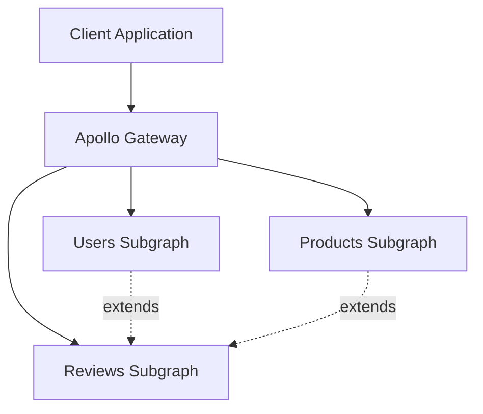
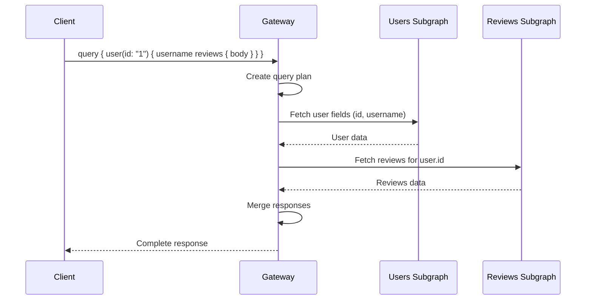

# How to Build GraphQL Federation Implementation

Author: [nawazdhandala](https://www.github.com/nawazdhandala)

Tags: GraphQL, Federation, API Gateway, Microservices, Apollo

Description: Implement GraphQL Federation with subgraphs, entity resolution, and gateway composition for unified APIs across microservices.

---

Building a unified API layer across multiple microservices can feel like herding cats. Each team owns their service, uses their own schema, and suddenly you need to stitch it all together into something that makes sense to frontend developers. GraphQL Federation solves this problem elegantly by letting each service define its own subgraph while a gateway composes them into a single, queryable API.

In this guide, we will build a complete Federation implementation from scratch, covering subgraph creation, entity resolution, and gateway composition.

## Understanding Federation Architecture

Before diving into code, let's visualize how Federation works:



The gateway receives queries from clients and intelligently routes them to the appropriate subgraphs. The magic happens when subgraphs reference entities from other subgraphs - Federation handles the data fetching and stitching automatically.

## Setting Up Your First Subgraph

Let's start with a Users subgraph. First, install the required dependencies:

```bash
npm install @apollo/subgraph @apollo/server graphql
```

Now create the Users subgraph schema and resolver.

```typescript
// users-subgraph/index.ts
import { ApolloServer } from '@apollo/server';
import { startStandaloneServer } from '@apollo/server/standalone';
import { buildSubgraphSchema } from '@apollo/subgraph';
import gql from 'graphql-tag';

// Define the schema with federation directives
// The @key directive marks User as an entity that can be referenced by other subgraphs
const typeDefs = gql`
  extend schema @link(url: "https://specs.apollo.dev/federation/v2.0", import: ["@key"])

  type Query {
    users: [User!]!
    user(id: ID!): User
  }

  type User @key(fields: "id") {
    id: ID!
    username: String!
    email: String!
    createdAt: String!
  }
`;

// Sample data - in production, this would come from your database
const users = [
  { id: '1', username: 'alice', email: 'alice@example.com', createdAt: '2024-01-15' },
  { id: '2', username: 'bob', email: 'bob@example.com', createdAt: '2024-02-20' },
];

const resolvers = {
  Query: {
    users: () => users,
    user: (_: unknown, { id }: { id: string }) => users.find(u => u.id === id),
  },
  // The __resolveReference function is crucial for federation
  // It tells Apollo how to fetch a User when another subgraph references it
  User: {
    __resolveReference: (reference: { id: string }) => {
      return users.find(u => u.id === reference.id);
    },
  },
};

// Build the subgraph schema with federation support
const server = new ApolloServer({
  schema: buildSubgraphSchema({ typeDefs, resolvers }),
});

startStandaloneServer(server, { listen: { port: 4001 } }).then(({ url }) => {
  console.log(`Users subgraph running at ${url}`);
});
```

## Creating a Subgraph That Extends Entities

The real power of Federation shows when subgraphs extend entities from other subgraphs. Let's create a Reviews subgraph that extends the User entity.

```typescript
// reviews-subgraph/index.ts
import { ApolloServer } from '@apollo/server';
import { startStandaloneServer } from '@apollo/server/standalone';
import { buildSubgraphSchema } from '@apollo/subgraph';
import gql from 'graphql-tag';

// This subgraph extends User from the users subgraph
// It adds a reviews field without owning the User entity
const typeDefs = gql`
  extend schema @link(url: "https://specs.apollo.dev/federation/v2.0", import: ["@key", "@external"])

  type Query {
    reviews: [Review!]!
    review(id: ID!): Review
  }

  # Extend the User type defined in another subgraph
  # We only need to declare the fields we reference (id) as @external
  type User @key(fields: "id") {
    id: ID! @external
    reviews: [Review!]!
  }

  type Product @key(fields: "id") {
    id: ID! @external
    reviews: [Review!]!
  }

  type Review @key(fields: "id") {
    id: ID!
    body: String!
    rating: Int!
    author: User!
    product: Product!
  }
`;

const reviews = [
  { id: '101', body: 'Great product!', rating: 5, authorId: '1', productId: 'p1' },
  { id: '102', body: 'Could be better', rating: 3, authorId: '2', productId: 'p1' },
  { id: '103', body: 'Exceeded expectations', rating: 5, authorId: '1', productId: 'p2' },
];

const resolvers = {
  Query: {
    reviews: () => reviews,
    review: (_: unknown, { id }: { id: string }) => reviews.find(r => r.id === id),
  },
  Review: {
    // Return a reference object that the gateway will resolve via the Users subgraph
    author: (review: { authorId: string }) => ({ __typename: 'User', id: review.authorId }),
    product: (review: { productId: string }) => ({ __typename: 'Product', id: review.productId }),
    __resolveReference: (reference: { id: string }) => reviews.find(r => r.id === reference.id),
  },
  // When the gateway needs to add reviews to a User, this resolver handles it
  User: {
    reviews: (user: { id: string }) => reviews.filter(r => r.authorId === user.id),
  },
  Product: {
    reviews: (product: { id: string }) => reviews.filter(r => r.productId === product.id),
  },
};

const server = new ApolloServer({
  schema: buildSubgraphSchema({ typeDefs, resolvers }),
});

startStandaloneServer(server, { listen: { port: 4002 } }).then(({ url }) => {
  console.log(`Reviews subgraph running at ${url}`);
});
```

## Composing the Gateway

The gateway pulls everything together. It fetches schemas from all subgraphs and creates a unified supergraph.

```typescript
// gateway/index.ts
import { ApolloServer } from '@apollo/server';
import { startStandaloneServer } from '@apollo/server/standalone';
import { ApolloGateway, IntrospectAndCompose } from '@apollo/gateway';

// Configure the gateway with all subgraph locations
// IntrospectAndCompose is great for development - it fetches schemas at runtime
const gateway = new ApolloGateway({
  supergraphSdl: new IntrospectAndCompose({
    subgraphs: [
      { name: 'users', url: 'http://localhost:4001/graphql' },
      { name: 'reviews', url: 'http://localhost:4002/graphql' },
      { name: 'products', url: 'http://localhost:4003/graphql' },
    ],
  }),
});

const server = new ApolloServer({ gateway });

startStandaloneServer(server, { listen: { port: 4000 } }).then(({ url }) => {
  console.log(`Gateway running at ${url}`);
});
```

## Query Planning and Execution

When a client sends a query that spans multiple subgraphs, the gateway creates an execution plan. Here is how it works:



The gateway optimizes these requests, batching where possible and parallelizing independent fetches.

## Production Considerations

For production deployments, you should use managed federation with Apollo Studio or generate a static supergraph schema using Rover CLI.

```bash
# Install Rover CLI
npm install -g @apollo/rover

# Compose your supergraph schema from subgraph schemas
rover supergraph compose --config ./supergraph-config.yaml > supergraph.graphql
```

Create a supergraph configuration file to define your subgraphs.

```yaml
# supergraph-config.yaml
federation_version: =2.0.0
subgraphs:
  users:
    routing_url: http://users-service:4001/graphql
    schema:
      file: ./users/schema.graphql
  reviews:
    routing_url: http://reviews-service:4002/graphql
    schema:
      file: ./reviews/schema.graphql
  products:
    routing_url: http://products-service:4003/graphql
    schema:
      file: ./products/schema.graphql
```

## Handling Entity Resolution at Scale

When your subgraphs handle thousands of requests, you need to optimize entity resolution. The DataLoader pattern helps batch and cache entity lookups.

```typescript
// Optimized __resolveReference with DataLoader
import DataLoader from 'dataloader';

// Create a batching loader for user lookups
const userLoader = new DataLoader(async (ids: readonly string[]) => {
  // Batch fetch all users in a single database query
  const users = await db.users.findMany({ where: { id: { in: [...ids] } } });

  // Return users in the same order as the input ids
  const userMap = new Map(users.map(u => [u.id, u]));
  return ids.map(id => userMap.get(id) || null);
});

const resolvers = {
  User: {
    __resolveReference: (reference: { id: string }) => {
      // This batches multiple reference resolutions into one DB call
      return userLoader.load(reference.id);
    },
  },
};
```

## Error Handling Across Subgraphs

Federation handles errors gracefully, but you should design your error responses consistently. Use extensions to provide additional context.

```typescript
// Consistent error handling in resolvers
import { GraphQLError } from 'graphql';

const resolvers = {
  Query: {
    user: async (_: unknown, { id }: { id: string }) => {
      const user = await userLoader.load(id);

      if (!user) {
        throw new GraphQLError('User not found', {
          extensions: {
            code: 'NOT_FOUND',
            subgraph: 'users',
            argumentName: 'id',
          },
        });
      }

      return user;
    },
  },
};
```

## Wrapping Up

GraphQL Federation transforms how teams build and maintain distributed APIs. Each team owns their subgraph independently, yet clients get a seamless, unified experience. The key takeaways are:

1. Use the `@key` directive to mark entities that can be referenced across subgraphs
2. Implement `__resolveReference` to enable entity lookups from other subgraphs
3. Extend types from other subgraphs to add fields without owning the entity
4. Use DataLoader to batch entity resolution for better performance
5. Consider managed federation or static composition for production deployments

Start small with two or three subgraphs, get comfortable with entity resolution, then expand as your architecture grows. Federation scales with your organization, letting teams move independently while maintaining a cohesive API.
