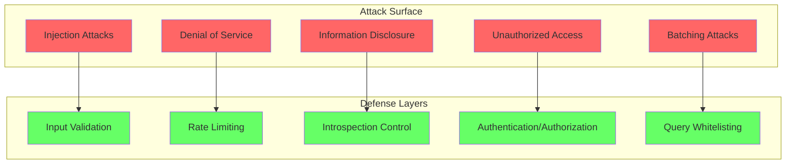
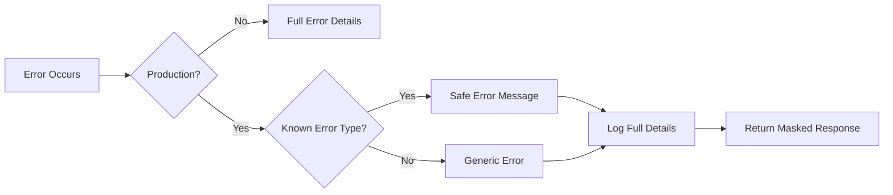
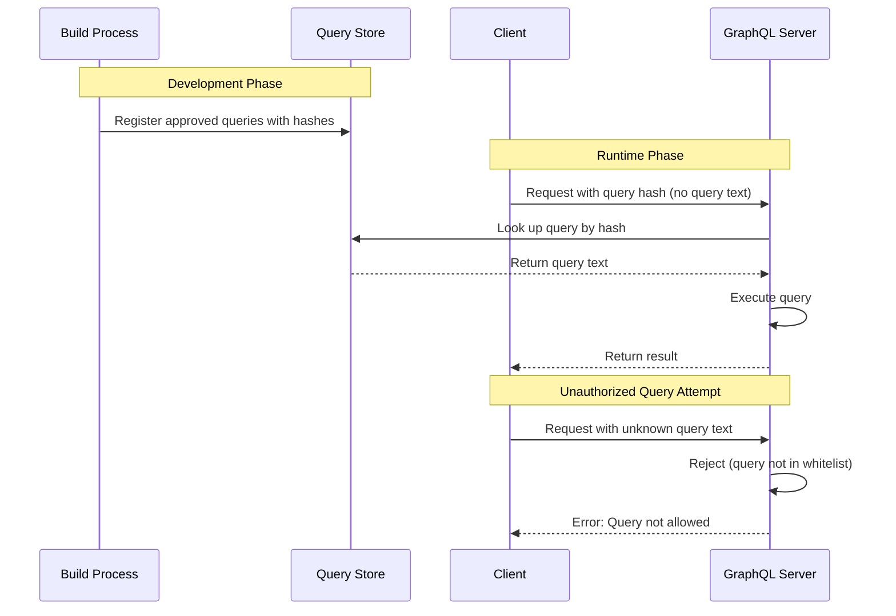
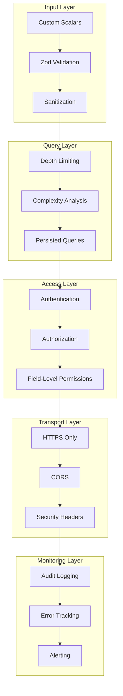

# How to Create GraphQL Security Best Practices

Author: [nawazdhandala](https://github.com/nawazdhandala)

Tags: GraphQL, Security, API Security, Authentication, Authorization, Input Validation, Node.js, TypeScript

Description: A comprehensive guide to securing GraphQL APIs covering input validation, introspection control, error handling, query whitelisting, and defense-in-depth strategies with production-ready code examples.

---

GraphQL's flexibility is both its greatest strength and its biggest security challenge. Unlike REST APIs where endpoints define what data clients can access, GraphQL lets clients construct arbitrary queries. This power requires a layered security approach that protects against injection attacks, denial of service, information disclosure, and unauthorized access.

This guide covers essential security practices you need to implement before deploying a GraphQL API to production.

## The GraphQL Security Landscape



## 1. Input Validation and Sanitization

GraphQL arguments flow directly into your resolvers and database queries. Without proper validation, attackers can inject malicious payloads.

### Schema-Level Validation with Custom Scalars

Custom scalars enforce validation at the schema level before data reaches your resolvers.

```typescript
// scalars/Email.ts
// Custom scalar that validates email format at the GraphQL layer
import { GraphQLScalarType, Kind, GraphQLError } from 'graphql';

// Email regex pattern that catches most valid emails
const EMAIL_REGEX = /^[a-zA-Z0-9._%+-]+@[a-zA-Z0-9.-]+\.[a-zA-Z]{2,}$/;

export const EmailScalar = new GraphQLScalarType({
  name: 'Email',
  description: 'A valid email address',

  // Validates and parses value from client input
  parseValue(value: unknown): string {
    if (typeof value !== 'string') {
      throw new GraphQLError('Email must be a string');
    }

    const email = value.toLowerCase().trim();

    if (!EMAIL_REGEX.test(email)) {
      throw new GraphQLError(`Invalid email format: ${value}`);
    }

    // Additional security: limit length to prevent buffer attacks
    if (email.length > 254) {
      throw new GraphQLError('Email exceeds maximum length');
    }

    return email;
  },

  // Validates value from query literals
  parseLiteral(ast): string {
    if (ast.kind !== Kind.STRING) {
      throw new GraphQLError('Email must be a string');
    }
    return this.parseValue(ast.value);
  },

  // Serializes value for response
  serialize(value: unknown): string {
    if (typeof value !== 'string') {
      throw new GraphQLError('Email must be a string');
    }
    return value.toLowerCase();
  },
});
```

```typescript
// scalars/SafeString.ts
// Scalar that sanitizes string input to prevent XSS and injection
import { GraphQLScalarType, Kind, GraphQLError } from 'graphql';
import sanitizeHtml from 'sanitize-html';

export const SafeStringScalar = new GraphQLScalarType({
  name: 'SafeString',
  description: 'A sanitized string safe for storage and display',

  parseValue(value: unknown): string {
    if (typeof value !== 'string') {
      throw new GraphQLError('SafeString must be a string');
    }

    // Remove HTML tags and dangerous content
    const sanitized = sanitizeHtml(value, {
      allowedTags: [], // No HTML allowed
      allowedAttributes: {},
    });

    // Limit string length
    if (sanitized.length > 10000) {
      throw new GraphQLError('String exceeds maximum length of 10000 characters');
    }

    return sanitized.trim();
  },

  parseLiteral(ast): string {
    if (ast.kind !== Kind.STRING) {
      throw new GraphQLError('SafeString must be a string');
    }
    return this.parseValue(ast.value);
  },

  serialize(value: unknown): string {
    return String(value);
  },
});
```

```typescript
// scalars/PositiveInt.ts
// Scalar for positive integers to prevent negative value exploits
import { GraphQLScalarType, Kind, GraphQLError } from 'graphql';

export const PositiveIntScalar = new GraphQLScalarType({
  name: 'PositiveInt',
  description: 'An integer greater than zero',

  parseValue(value: unknown): number {
    if (typeof value !== 'number' || !Number.isInteger(value)) {
      throw new GraphQLError('PositiveInt must be an integer');
    }

    if (value <= 0) {
      throw new GraphQLError('PositiveInt must be greater than zero');
    }

    // Prevent extremely large values that could cause issues
    if (value > Number.MAX_SAFE_INTEGER) {
      throw new GraphQLError('PositiveInt exceeds maximum safe integer');
    }

    return value;
  },

  parseLiteral(ast): number {
    if (ast.kind !== Kind.INT) {
      throw new GraphQLError('PositiveInt must be an integer');
    }
    return this.parseValue(parseInt(ast.value, 10));
  },

  serialize(value: unknown): number {
    return Number(value);
  },
});
```

### Using Custom Scalars in Schema

```graphql
# schema.graphql
scalar Email
scalar SafeString
scalar PositiveInt

type User {
  id: ID!
  email: Email!
  name: SafeString!
  bio: SafeString
}

input CreateUserInput {
  email: Email!
  name: SafeString!
  bio: SafeString
}

input PaginationInput {
  first: PositiveInt
  after: String
}

type Query {
  users(pagination: PaginationInput): UserConnection!
}

type Mutation {
  createUser(input: CreateUserInput!): User!
}
```

### Resolver-Level Validation with Zod

For complex validation logic, use a schema validation library in your resolvers.

```typescript
// validation/schemas.ts
// Zod schemas for comprehensive input validation
import { z } from 'zod';

// User creation schema with detailed validation rules
export const createUserSchema = z.object({
  email: z
    .string()
    .email('Invalid email format')
    .max(254, 'Email too long')
    .transform((v) => v.toLowerCase().trim()),

  name: z
    .string()
    .min(2, 'Name must be at least 2 characters')
    .max(100, 'Name must be under 100 characters')
    .regex(/^[\p{L}\s'-]+$/u, 'Name contains invalid characters'),

  password: z
    .string()
    .min(12, 'Password must be at least 12 characters')
    .regex(/[A-Z]/, 'Password must contain an uppercase letter')
    .regex(/[a-z]/, 'Password must contain a lowercase letter')
    .regex(/[0-9]/, 'Password must contain a number')
    .regex(/[^A-Za-z0-9]/, 'Password must contain a special character'),

  bio: z
    .string()
    .max(500, 'Bio must be under 500 characters')
    .optional()
    .transform((v) => v?.trim()),
});

// Search query validation to prevent injection
export const searchQuerySchema = z.object({
  query: z
    .string()
    .min(1, 'Search query cannot be empty')
    .max(200, 'Search query too long')
    // Remove characters that could be used for injection
    .transform((v) => v.replace(/[<>'"%;()&+]/g, '')),

  filters: z.object({
    category: z.enum(['all', 'users', 'posts', 'comments']).optional(),
    dateFrom: z.string().datetime().optional(),
    dateTo: z.string().datetime().optional(),
  }).optional(),
});

// Pagination validation to prevent resource exhaustion
export const paginationSchema = z.object({
  first: z.number().int().min(1).max(100).default(20),
  after: z.string().optional(),
  orderBy: z.enum(['createdAt', 'updatedAt', 'name']).default('createdAt'),
  orderDir: z.enum(['asc', 'desc']).default('desc'),
});
```

```typescript
// resolvers/user.ts
// Resolver with input validation using Zod
import { createUserSchema, paginationSchema } from '../validation/schemas';
import { GraphQLError } from 'graphql';

export const userResolvers = {
  Mutation: {
    createUser: async (_: unknown, args: { input: unknown }, context: Context) => {
      // Validate input against schema
      const result = createUserSchema.safeParse(args.input);

      if (!result.success) {
        // Format validation errors for client
        const errors = result.error.issues.map((issue) => ({
          field: issue.path.join('.'),
          message: issue.message,
        }));

        throw new GraphQLError('Validation failed', {
          extensions: {
            code: 'VALIDATION_ERROR',
            errors,
          },
        });
      }

      // Use validated and transformed data
      const { email, name, password, bio } = result.data;

      // Check for existing user
      const existing = await context.db.user.findUnique({
        where: { email },
      });

      if (existing) {
        throw new GraphQLError('Email already registered', {
          extensions: { code: 'DUPLICATE_EMAIL' },
        });
      }

      // Hash password before storing
      const hashedPassword = await hashPassword(password);

      return context.db.user.create({
        data: {
          email,
          name,
          password: hashedPassword,
          bio,
        },
      });
    },
  },

  Query: {
    users: async (_: unknown, args: { pagination?: unknown }, context: Context) => {
      // Validate pagination parameters
      const pagination = paginationSchema.parse(args.pagination || {});

      return context.db.user.findMany({
        take: pagination.first,
        skip: pagination.after ? 1 : 0,
        cursor: pagination.after ? { id: pagination.after } : undefined,
        orderBy: { [pagination.orderBy]: pagination.orderDir },
      });
    },
  },
};
```

## 2. Disable Introspection in Production

Introspection allows clients to discover your entire schema. While useful in development, it exposes your API structure to attackers in production.

```typescript
// server.ts
// Disable introspection in production environments
import { ApolloServer } from '@apollo/server';
import { ApolloServerPluginLandingPageDisabled } from '@apollo/server/plugin/disabled';

// Plugin that blocks introspection queries
function disableIntrospectionPlugin() {
  return {
    requestDidStart: async () => ({
      async didResolveOperation({ request, document }) {
        // Check if query contains introspection
        const isIntrospection = document.definitions.some((def) => {
          if (def.kind === 'OperationDefinition') {
            return def.selectionSet.selections.some((sel) => {
              if (sel.kind === 'Field') {
                return sel.name.value.startsWith('__');
              }
              return false;
            });
          }
          return false;
        });

        if (isIntrospection && process.env.NODE_ENV === 'production') {
          throw new GraphQLError('Introspection is disabled', {
            extensions: { code: 'INTROSPECTION_DISABLED' },
          });
        }
      },
    }),
  };
}

const server = new ApolloServer({
  schema,
  introspection: process.env.NODE_ENV !== 'production',
  plugins: [
    // Disable introspection in production
    ...(process.env.NODE_ENV === 'production'
      ? [disableIntrospectionPlugin(), ApolloServerPluginLandingPageDisabled()]
      : []),
  ],
});
```

## 3. Secure Error Handling

Default error messages can leak sensitive information about your system. Implement error masking for production.



```typescript
// errors/index.ts
// Custom error classes with safe messages
import { GraphQLError } from 'graphql';

// Base class for application errors that are safe to expose
export class AppError extends GraphQLError {
  constructor(
    message: string,
    code: string,
    extensions?: Record<string, unknown>
  ) {
    super(message, {
      extensions: {
        code,
        ...extensions,
      },
    });
  }
}

// Specific error types
export class NotFoundError extends AppError {
  constructor(resource: string) {
    super(`${resource} not found`, 'NOT_FOUND');
  }
}

export class UnauthorizedError extends AppError {
  constructor(message = 'You must be logged in') {
    super(message, 'UNAUTHORIZED');
  }
}

export class ForbiddenError extends AppError {
  constructor(message = 'You do not have permission') {
    super(message, 'FORBIDDEN');
  }
}

export class ValidationError extends AppError {
  constructor(errors: Array<{ field: string; message: string }>) {
    super('Validation failed', 'VALIDATION_ERROR', { errors });
  }
}

export class RateLimitError extends AppError {
  constructor(retryAfter: number) {
    super('Too many requests', 'RATE_LIMITED', { retryAfter });
  }
}
```

```typescript
// errors/formatter.ts
// Error formatter that masks sensitive information in production
import { GraphQLFormattedError, GraphQLError } from 'graphql';
import { AppError } from './index';
import { logger } from '../logger';

// List of error codes that are safe to expose to clients
const SAFE_ERROR_CODES = [
  'NOT_FOUND',
  'UNAUTHORIZED',
  'FORBIDDEN',
  'VALIDATION_ERROR',
  'RATE_LIMITED',
  'BAD_USER_INPUT',
  'QUERY_COMPLEXITY_EXCEEDED',
  'INTROSPECTION_DISABLED',
];

export function formatError(
  formattedError: GraphQLFormattedError,
  error: unknown
): GraphQLFormattedError {
  // Get the original error
  const originalError = error instanceof GraphQLError ? error.originalError : error;
  const errorCode = formattedError.extensions?.code as string;

  // Always log the full error for debugging
  logger.error('GraphQL Error', {
    message: formattedError.message,
    code: errorCode,
    path: formattedError.path,
    stack: originalError instanceof Error ? originalError.stack : undefined,
  });

  // In development, return full error details
  if (process.env.NODE_ENV !== 'production') {
    return formattedError;
  }

  // In production, only expose safe error messages
  if (SAFE_ERROR_CODES.includes(errorCode)) {
    return formattedError;
  }

  // Check if this is an AppError (safe to expose)
  if (originalError instanceof AppError) {
    return formattedError;
  }

  // Mask unexpected errors
  return {
    message: 'An unexpected error occurred',
    extensions: {
      code: 'INTERNAL_SERVER_ERROR',
      // Include request ID for support reference
      requestId: formattedError.extensions?.requestId,
    },
  };
}
```

```typescript
// server.ts
// Apply error formatter to Apollo Server
import { formatError } from './errors/formatter';
import { v4 as uuidv4 } from 'uuid';

const server = new ApolloServer({
  schema,
  formatError,
  plugins: [
    {
      // Add request ID to all requests for error tracking
      async requestDidStart() {
        return {
          async didEncounterErrors({ contextValue, errors }) {
            errors.forEach((error) => {
              error.extensions = {
                ...error.extensions,
                requestId: contextValue.requestId,
              };
            });
          },
        };
      },
    },
  ],
});

// Add request ID to context
const context = async ({ req }) => ({
  requestId: req.headers['x-request-id'] || uuidv4(),
  user: await getUserFromToken(req),
});
```

## 4. Persisted Queries for Query Whitelisting

Persisted queries allow you to register approved queries in advance and reject any unregistered queries. This prevents attackers from crafting malicious queries.



```typescript
// queries/store.ts
// Persisted query store implementation
import { createHash } from 'crypto';
import { readFileSync } from 'fs';
import { join } from 'path';

interface PersistedQuery {
  hash: string;
  query: string;
  operationName: string;
  allowedRoles?: string[];
}

class PersistedQueryStore {
  private queries: Map<string, PersistedQuery> = new Map();

  constructor() {
    this.loadQueries();
  }

  // Load persisted queries from file generated at build time
  private loadQueries(): void {
    try {
      const queriesPath = join(__dirname, '../../persisted-queries.json');
      const data = JSON.parse(readFileSync(queriesPath, 'utf8'));

      for (const query of data.queries) {
        this.queries.set(query.hash, query);
      }

      console.log(`Loaded ${this.queries.size} persisted queries`);
    } catch (error) {
      console.error('Failed to load persisted queries:', error);
    }
  }

  // Get a query by its hash
  get(hash: string): PersistedQuery | undefined {
    return this.queries.get(hash);
  }

  // Check if a query exists
  has(hash: string): boolean {
    return this.queries.has(hash);
  }

  // Generate hash for a query (used during build)
  static generateHash(query: string): string {
    return createHash('sha256').update(query).digest('hex');
  }

  // Register a new query (used during build)
  register(query: string, operationName: string, allowedRoles?: string[]): string {
    const hash = PersistedQueryStore.generateHash(query);
    this.queries.set(hash, { hash, query, operationName, allowedRoles });
    return hash;
  }
}

export const queryStore = new PersistedQueryStore();
```

```typescript
// plugins/persistedQueries.ts
// Apollo plugin for persisted query enforcement
import { GraphQLError } from 'graphql';
import { queryStore } from '../queries/store';

interface PersistedQueryExtension {
  persistedQuery?: {
    sha256Hash: string;
    version: number;
  };
}

export function persistedQueriesPlugin(options: { enforceInProduction: boolean }) {
  return {
    async requestDidStart({ request }) {
      const extensions = request.extensions as PersistedQueryExtension;
      const persistedQuery = extensions?.persistedQuery;

      // If using automatic persisted queries (APQ)
      if (persistedQuery) {
        const { sha256Hash } = persistedQuery;

        // Try to find the query by hash
        const stored = queryStore.get(sha256Hash);

        if (!stored) {
          // In development, allow query registration
          if (process.env.NODE_ENV !== 'production' && request.query) {
            // Register the new query for later extraction
            console.log('New query detected:', sha256Hash);
            return {};
          }

          throw new GraphQLError('Persisted query not found', {
            extensions: { code: 'PERSISTED_QUERY_NOT_FOUND' },
          });
        }

        // Replace request query with stored query
        request.query = stored.query;

        return {
          async didResolveOperation({ contextValue }) {
            // Check role-based access to this query
            if (stored.allowedRoles && stored.allowedRoles.length > 0) {
              const userRoles = contextValue.user?.roles || [];
              const hasAccess = stored.allowedRoles.some((role) =>
                userRoles.includes(role)
              );

              if (!hasAccess) {
                throw new GraphQLError('Not authorized for this operation', {
                  extensions: { code: 'FORBIDDEN' },
                });
              }
            }
          },
        };
      }

      // No persisted query extension
      if (options.enforceInProduction && process.env.NODE_ENV === 'production') {
        // In production, require persisted queries
        throw new GraphQLError('Only persisted queries are allowed', {
          extensions: { code: 'PERSISTED_QUERY_REQUIRED' },
        });
      }

      return {};
    },
  };
}
```

```typescript
// scripts/extract-queries.ts
// Build script to extract and hash queries from your client app
import { parse, print } from 'graphql';
import { createHash } from 'crypto';
import { glob } from 'glob';
import { readFileSync, writeFileSync } from 'fs';

interface ExtractedQuery {
  hash: string;
  query: string;
  operationName: string;
  source: string;
}

async function extractQueries(): Promise<void> {
  const queries: ExtractedQuery[] = [];

  // Find all GraphQL files in client source
  const files = await glob('src/**/*.{graphql,gql,ts,tsx}');

  for (const file of files) {
    const content = readFileSync(file, 'utf8');

    // Extract GraphQL queries from file
    const graphqlRegex = /(?:gql|graphql)`([\s\S]*?)`/g;
    let match;

    while ((match = graphqlRegex.exec(content)) !== null) {
      const queryText = match[1];

      try {
        // Parse and normalize the query
        const document = parse(queryText);
        const normalized = print(document);

        // Extract operation name
        const operationDef = document.definitions.find(
          (def) => def.kind === 'OperationDefinition'
        );
        const operationName =
          operationDef?.kind === 'OperationDefinition'
            ? operationDef.name?.value || 'anonymous'
            : 'anonymous';

        // Generate hash
        const hash = createHash('sha256').update(normalized).digest('hex');

        queries.push({
          hash,
          query: normalized,
          operationName,
          source: file,
        });
      } catch (error) {
        console.warn(`Failed to parse query in ${file}:`, error);
      }
    }
  }

  // Write persisted queries manifest
  writeFileSync(
    'persisted-queries.json',
    JSON.stringify({ queries, generatedAt: new Date().toISOString() }, null, 2)
  );

  console.log(`Extracted ${queries.length} queries`);
}

extractQueries();
```

## 5. Preventing Batching Attacks

GraphQL supports query batching, which can be exploited to bypass rate limits or amplify attacks. Control batch sizes and implement per-operation limits.

```typescript
// plugins/batchLimit.ts
// Plugin to limit batch query sizes
import { GraphQLError } from 'graphql';

export function batchLimitPlugin(maxBatchSize: number = 10) {
  return {
    async requestDidStart({ request }) {
      // Check if this is a batched request
      const isBatch = Array.isArray(request);

      if (isBatch && request.length > maxBatchSize) {
        throw new GraphQLError(
          `Batch size ${request.length} exceeds maximum of ${maxBatchSize}`,
          {
            extensions: {
              code: 'BATCH_SIZE_EXCEEDED',
              maxBatchSize,
              actualSize: request.length,
            },
          }
        );
      }

      return {};
    },
  };
}
```

```typescript
// middleware/batchControl.ts
// Express middleware for batch control before reaching Apollo
import { Request, Response, NextFunction } from 'express';

interface BatchControlOptions {
  maxBatchSize: number;
  maxOperationsPerRequest: number;
  allowAnonymousBatching: boolean;
}

export function batchControlMiddleware(options: BatchControlOptions) {
  return (req: Request, res: Response, next: NextFunction) => {
    const body = req.body;

    // Check if this is a batch request
    if (Array.isArray(body)) {
      // Reject batch requests from anonymous users if configured
      if (!options.allowAnonymousBatching && !req.user) {
        return res.status(400).json({
          errors: [
            {
              message: 'Batch requests require authentication',
              extensions: { code: 'BATCH_AUTH_REQUIRED' },
            },
          ],
        });
      }

      // Enforce batch size limit
      if (body.length > options.maxBatchSize) {
        return res.status(400).json({
          errors: [
            {
              message: `Batch size ${body.length} exceeds limit of ${options.maxBatchSize}`,
              extensions: { code: 'BATCH_SIZE_EXCEEDED' },
            },
          ],
        });
      }

      // Count total operations across all queries in batch
      let totalOperations = 0;
      for (const query of body) {
        // Rough estimate: count query and mutation keywords
        const ops = (query.query?.match(/\b(query|mutation|subscription)\b/g) || []).length;
        totalOperations += Math.max(1, ops);
      }

      if (totalOperations > options.maxOperationsPerRequest) {
        return res.status(400).json({
          errors: [
            {
              message: `Total operations ${totalOperations} exceeds limit of ${options.maxOperationsPerRequest}`,
              extensions: { code: 'OPERATIONS_LIMIT_EXCEEDED' },
            },
          ],
        });
      }
    }

    next();
  };
}
```

## 6. Field-Level Cost Analysis

Assign costs to individual fields based on their actual resource consumption.

```typescript
// cost/analyzer.ts
// Field-level cost calculation for accurate resource tracking
import { GraphQLSchema, GraphQLObjectType, GraphQLField } from 'graphql';

interface FieldCost {
  baseCost: number;
  multiplier?: string; // Argument name that multiplies cost
  maxMultiplier?: number; // Cap for multiplier
}

// Define costs for expensive fields
const fieldCosts: Record<string, FieldCost> = {
  'Query.search': { baseCost: 10, multiplier: 'first', maxMultiplier: 100 },
  'Query.analytics': { baseCost: 50 },
  'Query.export': { baseCost: 100 },
  'User.posts': { baseCost: 2, multiplier: 'first', maxMultiplier: 50 },
  'User.followers': { baseCost: 3, multiplier: 'first', maxMultiplier: 100 },
  'User.recommendations': { baseCost: 25 },
  'Post.comments': { baseCost: 1, multiplier: 'first', maxMultiplier: 100 },
  'Post.relatedPosts': { baseCost: 15 },
};

export function calculateFieldCost(
  typeName: string,
  fieldName: string,
  args: Record<string, unknown>
): number {
  const key = `${typeName}.${fieldName}`;
  const costConfig = fieldCosts[key];

  if (!costConfig) {
    return 1; // Default cost
  }

  let cost = costConfig.baseCost;

  // Apply multiplier if configured
  if (costConfig.multiplier && args[costConfig.multiplier]) {
    let multiplierValue = Number(args[costConfig.multiplier]) || 1;

    // Cap multiplier to prevent abuse
    if (costConfig.maxMultiplier) {
      multiplierValue = Math.min(multiplierValue, costConfig.maxMultiplier);
    }

    cost *= multiplierValue;
  }

  return cost;
}

// Custom complexity estimator using field costs
export function fieldCostEstimator() {
  return ({ type, field, args, childComplexity }) => {
    const fieldCost = calculateFieldCost(type.name, field.name, args);
    return fieldCost + childComplexity;
  };
}
```

## 7. CORS and Transport Security

Configure CORS and transport security to prevent unauthorized access.

```typescript
// security/cors.ts
// CORS configuration for GraphQL endpoint
import cors from 'cors';

export function configureCors() {
  const allowedOrigins = process.env.ALLOWED_ORIGINS?.split(',') || [];

  // In production, require explicit origin whitelist
  if (process.env.NODE_ENV === 'production' && allowedOrigins.length === 0) {
    throw new Error('ALLOWED_ORIGINS must be set in production');
  }

  return cors({
    origin: (origin, callback) => {
      // Allow requests with no origin (mobile apps, curl, etc.) in development
      if (!origin && process.env.NODE_ENV !== 'production') {
        return callback(null, true);
      }

      // Check if origin is in whitelist
      if (allowedOrigins.includes(origin)) {
        return callback(null, true);
      }

      callback(new Error('Not allowed by CORS'));
    },

    methods: ['POST', 'OPTIONS'],
    allowedHeaders: ['Content-Type', 'Authorization', 'X-Request-ID'],
    credentials: true,
    maxAge: 86400, // Cache preflight for 24 hours
  });
}
```

```typescript
// security/helmet.ts
// Security headers for GraphQL endpoint
import helmet from 'helmet';

export function configureHelmet() {
  return helmet({
    // Content Security Policy
    contentSecurityPolicy: {
      directives: {
        defaultSrc: ["'self'"],
        scriptSrc: ["'self'"],
        styleSrc: ["'self'", "'unsafe-inline'"],
        imgSrc: ["'self'", 'data:'],
        connectSrc: ["'self'"],
        frameSrc: ["'none'"],
        objectSrc: ["'none'"],
      },
    },

    // Prevent clickjacking
    frameguard: { action: 'deny' },

    // Hide X-Powered-By header
    hidePoweredBy: true,

    // HTTP Strict Transport Security
    hsts: {
      maxAge: 31536000,
      includeSubDomains: true,
      preload: true,
    },

    // Prevent MIME type sniffing
    noSniff: true,

    // XSS protection
    xssFilter: true,
  });
}
```

## 8. Audit Logging

Log all GraphQL operations for security monitoring and compliance.

```typescript
// logging/audit.ts
// Audit logger for GraphQL operations
import { logger } from '../logger';

interface AuditLogEntry {
  timestamp: string;
  requestId: string;
  userId?: string;
  clientIp: string;
  userAgent?: string;
  operationType: 'query' | 'mutation' | 'subscription';
  operationName?: string;
  variables?: Record<string, unknown>;
  complexity?: number;
  duration: number;
  status: 'success' | 'error';
  errorCode?: string;
}

export function auditLogPlugin() {
  return {
    async requestDidStart({ request, contextValue }) {
      const startTime = Date.now();

      return {
        async willSendResponse({ response }) {
          const entry: AuditLogEntry = {
            timestamp: new Date().toISOString(),
            requestId: contextValue.requestId,
            userId: contextValue.user?.id,
            clientIp: contextValue.clientIp,
            userAgent: contextValue.userAgent,
            operationType: getOperationType(request),
            operationName: request.operationName || undefined,
            // Redact sensitive variables
            variables: redactVariables(request.variables),
            complexity: contextValue.queryComplexity,
            duration: Date.now() - startTime,
            status: response.errors?.length ? 'error' : 'success',
            errorCode: response.errors?.[0]?.extensions?.code as string,
          };

          // Log to structured logging system
          logger.info('graphql_operation', entry);

          // For mutations, also log to audit trail
          if (entry.operationType === 'mutation') {
            await logToAuditTrail(entry);
          }
        },
      };
    },
  };
}

// Redact sensitive fields from variables
function redactVariables(
  variables?: Record<string, unknown>
): Record<string, unknown> | undefined {
  if (!variables) return undefined;

  const sensitiveFields = ['password', 'token', 'secret', 'apiKey', 'creditCard'];
  const redacted = { ...variables };

  for (const field of sensitiveFields) {
    if (field in redacted) {
      redacted[field] = '[REDACTED]';
    }
  }

  return redacted;
}

function getOperationType(request): 'query' | 'mutation' | 'subscription' {
  const query = request.query || '';
  if (query.trim().startsWith('mutation')) return 'mutation';
  if (query.trim().startsWith('subscription')) return 'subscription';
  return 'query';
}

async function logToAuditTrail(entry: AuditLogEntry): Promise<void> {
  // Store in database or send to audit service
  // Implementation depends on your audit requirements
}
```

## 9. Complete Security Setup

Putting it all together in a production-ready server configuration.

```typescript
// server.ts
// Production GraphQL server with full security configuration
import express from 'express';
import { ApolloServer } from '@apollo/server';
import { expressMiddleware } from '@apollo/server/express4';
import depthLimit from 'graphql-depth-limit';
import { createComplexityLimitRule } from 'graphql-query-complexity';

import { schema } from './schema';
import { createContext } from './context';
import { formatError } from './errors/formatter';
import { configureCors } from './security/cors';
import { configureHelmet } from './security/helmet';
import { batchControlMiddleware } from './middleware/batchControl';
import { persistedQueriesPlugin } from './plugins/persistedQueries';
import { auditLogPlugin } from './logging/audit';
import { fieldCostEstimator } from './cost/analyzer';

async function startServer() {
  const app = express();

  // Security headers
  app.use(configureHelmet());

  // CORS
  app.use('/graphql', configureCors());

  // Parse JSON with size limit
  app.use(express.json({ limit: '100kb' }));

  // Batch control
  app.use(
    '/graphql',
    batchControlMiddleware({
      maxBatchSize: 5,
      maxOperationsPerRequest: 10,
      allowAnonymousBatching: false,
    })
  );

  // Create Apollo Server
  const server = new ApolloServer({
    schema,
    formatError,
    introspection: process.env.NODE_ENV !== 'production',

    validationRules: [
      // Limit query depth to prevent deeply nested attacks
      depthLimit(10),

      // Limit query complexity
      createComplexityLimitRule(1000, {
        estimators: [fieldCostEstimator()],
        onComplete: (complexity) => {
          console.log(`Query complexity: ${complexity}`);
        },
      }),
    ],

    plugins: [
      // Persisted queries in production
      persistedQueriesPlugin({ enforceInProduction: true }),

      // Audit logging
      auditLogPlugin(),
    ],
  });

  await server.start();

  // Apply middleware
  app.use(
    '/graphql',
    expressMiddleware(server, {
      context: createContext,
    })
  );

  // Health check endpoint
  app.get('/health', (req, res) => {
    res.json({ status: 'ok' });
  });

  const PORT = process.env.PORT || 4000;
  app.listen(PORT, () => {
    console.log(`Server running on port ${PORT}`);
  });
}

startServer().catch(console.error);
```

## Security Checklist

Use this checklist to verify your GraphQL API security before deployment.



| Category | Item | Status |
|----------|------|--------|
| **Input Validation** | Custom scalars for email, URL, dates | |
| | Schema validation with Zod or similar | |
| | Input length limits | |
| | Sanitize HTML and special characters | |
| **Query Protection** | Query depth limiting (max 10) | |
| | Query complexity analysis | |
| | Field-level cost calculation | |
| | Batch size limits | |
| **Access Control** | JWT or session authentication | |
| | Role-based authorization | |
| | Field-level permissions | |
| | Resource ownership checks | |
| **Production Hardening** | Disable introspection | |
| | Enable persisted queries | |
| | Mask internal errors | |
| | Remove debug information | |
| **Transport Security** | HTTPS enforcement | |
| | Strict CORS policy | |
| | Security headers (HSTS, CSP) | |
| | Request size limits | |
| **Monitoring** | Audit logging for mutations | |
| | Error tracking with context | |
| | Rate limit monitoring | |
| | Anomaly detection alerts | |

## Conclusion

Securing a GraphQL API requires multiple layers of defense working together. Input validation catches malicious data before it reaches your business logic. Query analysis prevents resource exhaustion attacks. Authentication and authorization ensure users only access what they should. And proper error handling prevents information leakage.

The key is to implement these protections as reusable middleware and plugins that apply consistently across your entire schema. Start with the basics like input validation and depth limiting, then add more sophisticated controls like persisted queries and field-level cost analysis as your API matures.

**Related Reading:**

- [How to Handle Authentication in GraphQL APIs](https://oneuptime.com/blog/post/2026-01-24-graphql-authentication/view)
- [How to Handle Authorization in GraphQL Resolvers](https://oneuptime.com/blog/post/2026-01-24-graphql-authorization-resolvers/view)
- [How to Configure Rate Limiting for GraphQL](https://oneuptime.com/blog/post/2026-01-24-graphql-rate-limiting/view)
- [How to Fix "Query Complexity" Limit Errors](https://oneuptime.com/blog/post/2026-01-24-graphql-query-complexity-limit/view)
