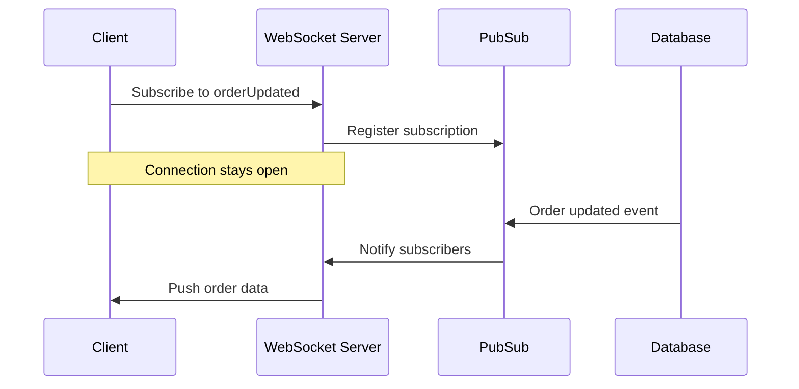
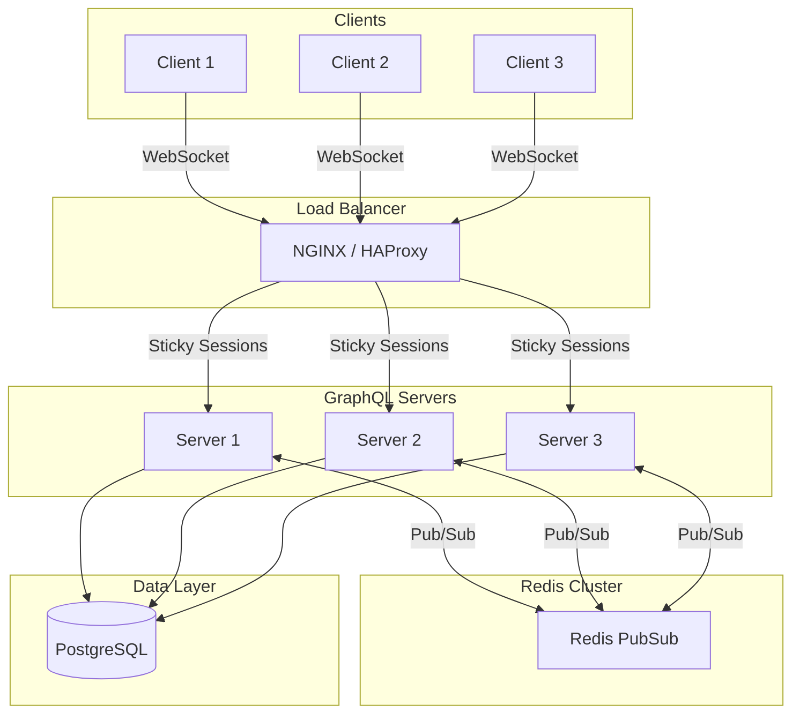

# How to Implement GraphQL Subscriptions Advanced

Author: [nawazdhandala](https://github.com/nawazdhandala)

Tags: GraphQL, Subscriptions, Real-time, WebSocket

Description: Build production-ready GraphQL subscriptions with WebSocket transport, scalable PubSub backends, filtering, authentication, and horizontal scaling patterns.

---

GraphQL subscriptions enable real-time data flow from server to client. Unlike queries and mutations that follow request-response patterns, subscriptions maintain persistent connections and push updates when data changes. This guide covers advanced patterns for building production-grade subscription systems.

## How Subscriptions Work

Subscriptions use a publish-subscribe model over WebSocket connections. When a client subscribes, the server registers their interest in specific events. When those events occur, the server pushes data to all interested clients.



## Basic Subscription Setup

Install dependencies for Apollo Server with subscriptions:

```bash
npm install @apollo/server graphql-ws ws graphql-subscriptions
```

### Schema Definition

Define subscriptions in your schema alongside queries and mutations:

```graphql
type Order {
  id: ID!
  status: OrderStatus!
  total: Float!
  items: [OrderItem!]!
  updatedAt: String!
}

enum OrderStatus {
  PENDING
  PROCESSING
  SHIPPED
  DELIVERED
  CANCELLED
}

type Subscription {
  orderUpdated(orderId: ID!): Order!
  orderStatusChanged(userId: ID!): Order!
  newOrder: Order!
}

type Query {
  order(id: ID!): Order
  orders(userId: ID!): [Order!]!
}

type Mutation {
  updateOrderStatus(orderId: ID!, status: OrderStatus!): Order!
  createOrder(input: CreateOrderInput!): Order!
}
```

### Server Setup with WebSocket Transport

Set up both HTTP and WebSocket servers:

```typescript
// server.ts
import { ApolloServer } from '@apollo/server';
import { expressMiddleware } from '@apollo/server/express4';
import { createServer } from 'http';
import express from 'express';
import { WebSocketServer } from 'ws';
import { useServer } from 'graphql-ws/lib/use/ws';
import { makeExecutableSchema } from '@graphql-tools/schema';
import { PubSub } from 'graphql-subscriptions';

const pubsub = new PubSub();

const typeDefs = `/* schema from above */`;

const resolvers = {
  Query: {
    order: (_, { id }, context) => context.dataSources.orders.getById(id),
    orders: (_, { userId }, context) => context.dataSources.orders.getByUser(userId),
  },
  Mutation: {
    updateOrderStatus: async (_, { orderId, status }, context) => {
      const order = await context.dataSources.orders.updateStatus(orderId, status);

      // Publish to subscribers
      pubsub.publish(`ORDER_UPDATED_${orderId}`, { orderUpdated: order });
      pubsub.publish(`ORDER_STATUS_${order.userId}`, { orderStatusChanged: order });

      return order;
    },
    createOrder: async (_, { input }, context) => {
      const order = await context.dataSources.orders.create(input);
      pubsub.publish('NEW_ORDER', { newOrder: order });
      return order;
    },
  },
  Subscription: {
    orderUpdated: {
      subscribe: (_, { orderId }) => pubsub.asyncIterator(`ORDER_UPDATED_${orderId}`),
    },
    orderStatusChanged: {
      subscribe: (_, { userId }) => pubsub.asyncIterator(`ORDER_STATUS_${userId}`),
    },
    newOrder: {
      subscribe: () => pubsub.asyncIterator('NEW_ORDER'),
    },
  },
};

const schema = makeExecutableSchema({ typeDefs, resolvers });

async function startServer() {
  const app = express();
  const httpServer = createServer(app);

  // WebSocket server for subscriptions
  const wsServer = new WebSocketServer({
    server: httpServer,
    path: '/graphql',
  });

  // Set up WebSocket handling with graphql-ws
  const serverCleanup = useServer(
    {
      schema,
      context: async (ctx) => {
        // Access connection params for auth
        const token = ctx.connectionParams?.authorization;
        const user = await validateToken(token);
        return { user, pubsub };
      },
      onConnect: async (ctx) => {
        console.log('Client connected');
        // Return false to reject connection
        const token = ctx.connectionParams?.authorization;
        if (!token) {
          return false; // Reject unauthenticated connections
        }
        return true;
      },
      onDisconnect: (ctx) => {
        console.log('Client disconnected');
      },
    },
    wsServer
  );

  // Apollo Server for queries and mutations
  const server = new ApolloServer({
    schema,
    plugins: [
      {
        async serverWillStart() {
          return {
            async drainServer() {
              await serverCleanup.dispose();
            },
          };
        },
      },
    ],
  });

  await server.start();

  app.use(
    '/graphql',
    express.json(),
    expressMiddleware(server, {
      context: async ({ req }) => {
        const user = await validateToken(req.headers.authorization);
        return { user };
      },
    })
  );

  httpServer.listen(4000, () => {
    console.log('Server running on http://localhost:4000/graphql');
    console.log('Subscriptions on ws://localhost:4000/graphql');
  });
}

startServer();
```

## Scalable PubSub with Redis

The in-memory `PubSub` from `graphql-subscriptions` does not scale across multiple server instances. For production, use Redis-backed PubSub:

```bash
npm install graphql-redis-subscriptions ioredis
```

```typescript
// pubsub.ts
import { RedisPubSub } from 'graphql-redis-subscriptions';
import Redis from 'ioredis';

const redisOptions = {
  host: process.env.REDIS_HOST || 'localhost',
  port: parseInt(process.env.REDIS_PORT || '6379'),
  password: process.env.REDIS_PASSWORD,
  retryStrategy: (times: number) => Math.min(times * 50, 2000),
};

// Separate clients for publishing and subscribing
// Redis requires this because a subscribed client cannot publish
const publisher = new Redis(redisOptions);
const subscriber = new Redis(redisOptions);

export const pubsub = new RedisPubSub({
  publisher,
  subscriber,
  reviver: (key, value) => {
    // Handle Date objects during JSON parsing
    if (typeof value === 'string' && /^\d{4}-\d{2}-\d{2}T/.test(value)) {
      return new Date(value);
    }
    return value;
  },
});

// Graceful shutdown
process.on('SIGTERM', async () => {
  await publisher.quit();
  await subscriber.quit();
});
```

### Architecture with Redis PubSub



## Subscription Filtering

Filter events server-side to reduce unnecessary network traffic. Only send data that matches client criteria:

```typescript
// resolvers/subscriptions.ts
import { withFilter } from 'graphql-subscriptions';
import { pubsub } from '../pubsub';

export const subscriptionResolvers = {
  Subscription: {
    // Filter by order ID
    orderUpdated: {
      subscribe: withFilter(
        () => pubsub.asyncIterator('ORDER_UPDATED'),
        (payload, variables) => {
          return payload.orderUpdated.id === variables.orderId;
        }
      ),
    },

    // Filter by user and optional status
    orderStatusChanged: {
      subscribe: withFilter(
        () => pubsub.asyncIterator('ORDER_STATUS_CHANGED'),
        (payload, variables, context) => {
          const order = payload.orderStatusChanged;

          // User can only subscribe to their own orders
          if (order.userId !== context.user.id) {
            return false;
          }

          // Optional status filter
          if (variables.status && order.status !== variables.status) {
            return false;
          }

          return true;
        }
      ),
    },

    // Complex filtering with multiple conditions
    inventoryAlert: {
      subscribe: withFilter(
        () => pubsub.asyncIterator('INVENTORY_ALERT'),
        (payload, variables, context) => {
          const alert = payload.inventoryAlert;

          // Check warehouse access
          if (!context.user.warehouses.includes(alert.warehouseId)) {
            return false;
          }

          // Filter by severity
          if (variables.minSeverity) {
            const severityLevels = { LOW: 1, MEDIUM: 2, HIGH: 3, CRITICAL: 4 };
            if (severityLevels[alert.severity] < severityLevels[variables.minSeverity]) {
              return false;
            }
          }

          // Filter by product category
          if (variables.categories?.length > 0) {
            if (!variables.categories.includes(alert.product.category)) {
              return false;
            }
          }

          return true;
        }
      ),
    },
  },
};
```

### Updated Schema for Filtering

```graphql
type Subscription {
  orderUpdated(orderId: ID!): Order!
  orderStatusChanged(status: OrderStatus): Order!
  inventoryAlert(minSeverity: AlertSeverity, categories: [String!]): InventoryAlert!
}

enum AlertSeverity {
  LOW
  MEDIUM
  HIGH
  CRITICAL
}

type InventoryAlert {
  id: ID!
  warehouseId: ID!
  product: Product!
  currentStock: Int!
  threshold: Int!
  severity: AlertSeverity!
  timestamp: String!
}
```

## Authentication and Authorization

Secure subscriptions with connection-level and operation-level authentication:

```typescript
// auth.ts
import jwt from 'jsonwebtoken';

interface User {
  id: string;
  email: string;
  roles: string[];
  permissions: string[];
}

export async function validateToken(token: string | undefined): Promise<User | null> {
  if (!token) return null;

  try {
    const cleanToken = token.replace('Bearer ', '');
    const decoded = jwt.verify(cleanToken, process.env.JWT_SECRET!) as User;
    return decoded;
  } catch (error) {
    return null;
  }
}

export function requireAuth(user: User | null): User {
  if (!user) {
    throw new Error('Authentication required');
  }
  return user;
}

export function requirePermission(user: User, permission: string): void {
  if (!user.permissions.includes(permission)) {
    throw new Error(`Permission denied: ${permission}`);
  }
}
```

### Subscription Resolver with Auth

```typescript
// resolvers/subscriptions.ts
import { withFilter } from 'graphql-subscriptions';
import { pubsub } from '../pubsub';
import { requireAuth, requirePermission } from '../auth';

export const subscriptionResolvers = {
  Subscription: {
    // User-scoped subscription
    orderStatusChanged: {
      subscribe: withFilter(
        (_, __, context) => {
          // Validate auth at subscription time
          requireAuth(context.user);
          return pubsub.asyncIterator('ORDER_STATUS_CHANGED');
        },
        (payload, variables, context) => {
          // Users can only see their own orders
          return payload.orderStatusChanged.userId === context.user.id;
        }
      ),
    },

    // Admin-only subscription
    allOrders: {
      subscribe: (_, __, context) => {
        requireAuth(context.user);
        requirePermission(context.user, 'orders:read:all');
        return pubsub.asyncIterator('ALL_ORDERS');
      },
    },

    // Role-based subscription
    systemMetrics: {
      subscribe: (_, __, context) => {
        const user = requireAuth(context.user);
        if (!user.roles.includes('admin') && !user.roles.includes('operator')) {
          throw new Error('Insufficient privileges');
        }
        return pubsub.asyncIterator('SYSTEM_METRICS');
      },
    },
  },
};
```

### WebSocket Connection Authentication

```typescript
// server.ts
import { useServer } from 'graphql-ws/lib/use/ws';

const serverCleanup = useServer(
  {
    schema,
    context: async (ctx) => {
      const token = ctx.connectionParams?.authorization as string;
      const user = await validateToken(token);

      return {
        user,
        pubsub,
        // Track connection for cleanup
        connectionId: ctx.extra?.socket?.id,
      };
    },
    onConnect: async (ctx) => {
      const token = ctx.connectionParams?.authorization as string;

      if (!token) {
        // Allow anonymous connections for public subscriptions
        console.log('Anonymous connection');
        return true;
      }

      const user = await validateToken(token);
      if (!user) {
        // Invalid token, reject connection
        return false;
      }

      // Store user info for later use
      (ctx.extra as any).user = user;
      console.log(`User ${user.id} connected`);
      return true;
    },
    onDisconnect: (ctx) => {
      const user = (ctx.extra as any)?.user;
      if (user) {
        console.log(`User ${user.id} disconnected`);
      }
    },
    onSubscribe: (ctx, msg) => {
      // Log subscription operations
      console.log(`Subscription: ${msg.payload.operationName}`);
    },
    onError: (ctx, msg, errors) => {
      console.error('Subscription error:', errors);
    },
  },
  wsServer
);
```

## Client Implementation

### React Client with Apollo

```bash
npm install @apollo/client graphql-ws
```

```typescript
// apolloClient.ts
import { ApolloClient, InMemoryCache, split, HttpLink } from '@apollo/client';
import { GraphQLWsLink } from '@apollo/client/link/subscriptions';
import { createClient } from 'graphql-ws';
import { getMainDefinition } from '@apollo/client/utilities';

const httpLink = new HttpLink({
  uri: 'http://localhost:4000/graphql',
  headers: {
    authorization: `Bearer ${localStorage.getItem('token')}`,
  },
});

const wsLink = new GraphQLWsLink(
  createClient({
    url: 'ws://localhost:4000/graphql',
    connectionParams: () => ({
      authorization: `Bearer ${localStorage.getItem('token')}`,
    }),
    // Reconnection settings
    retryAttempts: 5,
    shouldRetry: () => true,
    on: {
      connected: () => console.log('WebSocket connected'),
      closed: () => console.log('WebSocket closed'),
      error: (error) => console.error('WebSocket error:', error),
    },
  })
);

// Split traffic between HTTP and WebSocket
const splitLink = split(
  ({ query }) => {
    const definition = getMainDefinition(query);
    return (
      definition.kind === 'OperationDefinition' &&
      definition.operation === 'subscription'
    );
  },
  wsLink,
  httpLink
);

export const client = new ApolloClient({
  link: splitLink,
  cache: new InMemoryCache(),
});
```

### React Component with Subscription

```tsx
// OrderTracker.tsx
import { useSubscription, gql } from '@apollo/client';

const ORDER_STATUS_SUBSCRIPTION = gql`
  subscription OrderStatus($orderId: ID!) {
    orderUpdated(orderId: $orderId) {
      id
      status
      updatedAt
      items {
        name
        quantity
      }
    }
  }
`;

interface OrderTrackerProps {
  orderId: string;
}

export function OrderTracker({ orderId }: OrderTrackerProps) {
  const { data, loading, error } = useSubscription(ORDER_STATUS_SUBSCRIPTION, {
    variables: { orderId },
    onData: ({ data }) => {
      // Handle new data
      console.log('Order updated:', data.data?.orderUpdated);
    },
    onError: (error) => {
      console.error('Subscription error:', error);
    },
  });

  if (loading) return <div>Connecting...</div>;
  if (error) return <div>Error: {error.message}</div>;

  const order = data?.orderUpdated;
  if (!order) return <div>Waiting for updates...</div>;

  return (
    <div>
      <h2>Order #{order.id}</h2>
      <p>Status: {order.status}</p>
      <p>Last updated: {new Date(order.updatedAt).toLocaleString()}</p>
      <ul>
        {order.items.map((item, i) => (
          <li key={i}>{item.name} x {item.quantity}</li>
        ))}
      </ul>
    </div>
  );
}
```

### Vanilla JavaScript Client

```typescript
// subscriptionClient.ts
import { createClient } from 'graphql-ws';

const client = createClient({
  url: 'ws://localhost:4000/graphql',
  connectionParams: {
    authorization: `Bearer ${getToken()}`,
  },
});

// Subscribe to events
function subscribeToOrderUpdates(orderId: string, callback: (order: any) => void) {
  const unsubscribe = client.subscribe(
    {
      query: `
        subscription OrderUpdated($orderId: ID!) {
          orderUpdated(orderId: $orderId) {
            id
            status
            updatedAt
          }
        }
      `,
      variables: { orderId },
    },
    {
      next: (data) => callback(data.data?.orderUpdated),
      error: (error) => console.error('Subscription error:', error),
      complete: () => console.log('Subscription complete'),
    }
  );

  // Return cleanup function
  return unsubscribe;
}

// Usage
const cleanup = subscribeToOrderUpdates('order-123', (order) => {
  console.log('Order updated:', order);
  updateUI(order);
});

// Later, to unsubscribe
cleanup();
```

## Connection Management

Handle connection lifecycle events and implement heartbeat mechanisms:

```typescript
// connectionManager.ts
import { createClient, Client } from 'graphql-ws';

interface ConnectionState {
  isConnected: boolean;
  reconnectAttempts: number;
  lastError: Error | null;
}

class SubscriptionManager {
  private client: Client;
  private state: ConnectionState = {
    isConnected: false,
    reconnectAttempts: 0,
    lastError: null,
  };
  private activeSubscriptions: Map<string, () => void> = new Map();

  constructor(url: string, getToken: () => string) {
    this.client = createClient({
      url,
      connectionParams: () => ({
        authorization: `Bearer ${getToken()}`,
      }),
      retryAttempts: Infinity,
      retryWait: async (retries) => {
        // Exponential backoff with max 30 seconds
        const delay = Math.min(1000 * Math.pow(2, retries), 30000);
        await new Promise((resolve) => setTimeout(resolve, delay));
      },
      on: {
        connected: () => {
          this.state.isConnected = true;
          this.state.reconnectAttempts = 0;
          console.log('Connected to subscription server');
        },
        closed: () => {
          this.state.isConnected = false;
          console.log('Disconnected from subscription server');
        },
        error: (error) => {
          this.state.lastError = error;
          console.error('Connection error:', error);
        },
      },
      keepAlive: 10000, // Send ping every 10 seconds
    });
  }

  subscribe<T>(
    id: string,
    query: string,
    variables: Record<string, any>,
    handlers: {
      onData: (data: T) => void;
      onError?: (error: Error) => void;
      onComplete?: () => void;
    }
  ): void {
    // Unsubscribe if already subscribed with same ID
    this.unsubscribe(id);

    const unsubscribe = this.client.subscribe(
      { query, variables },
      {
        next: (result) => {
          if (result.data) {
            handlers.onData(result.data as T);
          }
        },
        error: (error) => {
          handlers.onError?.(error);
        },
        complete: () => {
          this.activeSubscriptions.delete(id);
          handlers.onComplete?.();
        },
      }
    );

    this.activeSubscriptions.set(id, unsubscribe);
  }

  unsubscribe(id: string): void {
    const cleanup = this.activeSubscriptions.get(id);
    if (cleanup) {
      cleanup();
      this.activeSubscriptions.delete(id);
    }
  }

  unsubscribeAll(): void {
    for (const cleanup of this.activeSubscriptions.values()) {
      cleanup();
    }
    this.activeSubscriptions.clear();
  }

  getState(): ConnectionState {
    return { ...this.state };
  }

  dispose(): void {
    this.unsubscribeAll();
    this.client.dispose();
  }
}

export const subscriptionManager = new SubscriptionManager(
  'ws://localhost:4000/graphql',
  () => localStorage.getItem('token') || ''
);
```

## Load Balancer Configuration

Configure NGINX for WebSocket support with sticky sessions:

```nginx
# nginx.conf
upstream graphql_servers {
    ip_hash;  # Sticky sessions based on client IP
    server graphql1:4000;
    server graphql2:4000;
    server graphql3:4000;
}

server {
    listen 80;
    server_name api.example.com;

    location /graphql {
        proxy_pass http://graphql_servers;

        # WebSocket support
        proxy_http_version 1.1;
        proxy_set_header Upgrade $http_upgrade;
        proxy_set_header Connection "upgrade";

        # Headers
        proxy_set_header Host $host;
        proxy_set_header X-Real-IP $remote_addr;
        proxy_set_header X-Forwarded-For $proxy_add_x_forwarded_for;
        proxy_set_header X-Forwarded-Proto $scheme;

        # Timeouts for long-lived connections
        proxy_read_timeout 86400s;
        proxy_send_timeout 86400s;

        # Buffer settings
        proxy_buffering off;
        proxy_buffer_size 64k;
        proxy_buffers 8 64k;
    }
}
```

## Error Handling and Resilience

Handle errors gracefully on both server and client:

```typescript
// errorHandler.ts
import { GraphQLError } from 'graphql';

export class SubscriptionError extends Error {
  constructor(
    message: string,
    public code: string,
    public isRetryable: boolean = false
  ) {
    super(message);
    this.name = 'SubscriptionError';
  }
}

export function handleSubscriptionError(error: unknown): never {
  if (error instanceof GraphQLError) {
    const code = error.extensions?.code as string;

    switch (code) {
      case 'UNAUTHENTICATED':
        throw new SubscriptionError(
          'Authentication required',
          'UNAUTHENTICATED',
          false
        );
      case 'FORBIDDEN':
        throw new SubscriptionError(
          'Permission denied',
          'FORBIDDEN',
          false
        );
      case 'RATE_LIMITED':
        throw new SubscriptionError(
          'Too many requests',
          'RATE_LIMITED',
          true
        );
      default:
        throw new SubscriptionError(
          error.message,
          code || 'UNKNOWN',
          true
        );
    }
  }

  throw new SubscriptionError(
    'Unknown error',
    'UNKNOWN',
    true
  );
}
```

### Rate Limiting Subscriptions

```typescript
// rateLimiter.ts
import { RateLimiterMemory } from 'rate-limiter-flexible';

const subscriptionLimiter = new RateLimiterMemory({
  points: 10, // 10 subscriptions
  duration: 60, // per minute
});

const messageLimiter = new RateLimiterMemory({
  points: 100, // 100 messages
  duration: 60, // per minute
});

export async function checkSubscriptionLimit(userId: string): Promise<void> {
  try {
    await subscriptionLimiter.consume(userId);
  } catch {
    throw new Error('Subscription rate limit exceeded');
  }
}

export async function checkMessageLimit(userId: string): Promise<void> {
  try {
    await messageLimiter.consume(userId);
  } catch {
    throw new Error('Message rate limit exceeded');
  }
}
```

## Monitoring and Observability

Track subscription metrics:

```typescript
// metrics.ts
import { Counter, Gauge, Histogram } from 'prom-client';

export const subscriptionMetrics = {
  activeConnections: new Gauge({
    name: 'graphql_subscription_connections_active',
    help: 'Number of active WebSocket connections',
  }),

  subscriptionsActive: new Gauge({
    name: 'graphql_subscriptions_active',
    help: 'Number of active subscriptions',
    labelNames: ['operation'],
  }),

  messagesPublished: new Counter({
    name: 'graphql_subscription_messages_published_total',
    help: 'Total subscription messages published',
    labelNames: ['channel'],
  }),

  messageLatency: new Histogram({
    name: 'graphql_subscription_message_latency_seconds',
    help: 'Time from publish to delivery',
    labelNames: ['operation'],
    buckets: [0.001, 0.005, 0.01, 0.05, 0.1, 0.5, 1],
  }),

  connectionDuration: new Histogram({
    name: 'graphql_subscription_connection_duration_seconds',
    help: 'Duration of WebSocket connections',
    buckets: [1, 10, 60, 300, 600, 1800, 3600],
  }),

  errors: new Counter({
    name: 'graphql_subscription_errors_total',
    help: 'Total subscription errors',
    labelNames: ['type'],
  }),
};
```

### Instrumented Server Hooks

```typescript
// server.ts
import { subscriptionMetrics } from './metrics';

const serverCleanup = useServer(
  {
    schema,
    context: async (ctx) => {
      const startTime = Date.now();
      (ctx.extra as any).startTime = startTime;
      return { user: await validateToken(ctx.connectionParams?.authorization) };
    },
    onConnect: () => {
      subscriptionMetrics.activeConnections.inc();
      return true;
    },
    onDisconnect: (ctx) => {
      subscriptionMetrics.activeConnections.dec();

      const startTime = (ctx.extra as any)?.startTime;
      if (startTime) {
        const duration = (Date.now() - startTime) / 1000;
        subscriptionMetrics.connectionDuration.observe(duration);
      }
    },
    onSubscribe: (ctx, msg) => {
      const operation = msg.payload.operationName || 'unknown';
      subscriptionMetrics.subscriptionsActive.inc({ operation });
    },
    onComplete: (ctx, msg) => {
      const operation = msg.payload.operationName || 'unknown';
      subscriptionMetrics.subscriptionsActive.dec({ operation });
    },
    onError: (ctx, msg, errors) => {
      for (const error of errors) {
        subscriptionMetrics.errors.inc({ type: error.name });
      }
    },
  },
  wsServer
);
```

## Testing Subscriptions

Write integration tests for subscriptions:

```typescript
// subscriptions.test.ts
import { createClient } from 'graphql-ws';
import WebSocket from 'ws';

describe('GraphQL Subscriptions', () => {
  let client: ReturnType<typeof createClient>;

  beforeAll(() => {
    client = createClient({
      url: 'ws://localhost:4000/graphql',
      webSocketImpl: WebSocket,
      connectionParams: {
        authorization: 'Bearer test-token',
      },
    });
  });

  afterAll(() => {
    client.dispose();
  });

  it('receives order updates', async () => {
    const orderId = 'test-order-123';
    const received: any[] = [];

    const subscription = new Promise<void>((resolve, reject) => {
      client.subscribe(
        {
          query: `
            subscription OrderUpdated($orderId: ID!) {
              orderUpdated(orderId: $orderId) {
                id
                status
              }
            }
          `,
          variables: { orderId },
        },
        {
          next: (data) => {
            received.push(data);
            if (received.length >= 2) {
              resolve();
            }
          },
          error: reject,
          complete: () => {},
        }
      );
    });

    // Trigger updates via mutations
    await updateOrder(orderId, 'PROCESSING');
    await updateOrder(orderId, 'SHIPPED');

    await subscription;

    expect(received).toHaveLength(2);
    expect(received[0].data.orderUpdated.status).toBe('PROCESSING');
    expect(received[1].data.orderUpdated.status).toBe('SHIPPED');
  });

  it('filters events correctly', async () => {
    const userId = 'user-123';
    const otherUserId = 'user-456';
    const received: any[] = [];

    const unsubscribe = client.subscribe(
      {
        query: `
          subscription OrderStatusChanged {
            orderStatusChanged {
              id
              userId
              status
            }
          }
        `,
      },
      {
        next: (data) => received.push(data),
        error: () => {},
        complete: () => {},
      }
    );

    // Create orders for different users
    await createOrder({ userId, item: 'test' });
    await createOrder({ userId: otherUserId, item: 'test' });

    await sleep(100);
    unsubscribe();

    // Should only receive events for authenticated user
    expect(received.every((r) => r.data.orderStatusChanged.userId === userId)).toBe(true);
  });
});

function sleep(ms: number): Promise<void> {
  return new Promise((resolve) => setTimeout(resolve, ms));
}
```

## Summary

| Aspect | Implementation |
|--------|----------------|
| Transport | WebSocket via graphql-ws |
| PubSub (dev) | In-memory graphql-subscriptions |
| PubSub (prod) | Redis via graphql-redis-subscriptions |
| Filtering | withFilter for server-side filtering |
| Authentication | Connection params + context validation |
| Authorization | Resolver-level permission checks |
| Scaling | Redis PubSub + sticky sessions |
| Monitoring | Prometheus metrics for connections and messages |

GraphQL subscriptions provide a standardized way to push real-time updates to clients. With Redis-backed PubSub, proper authentication, and connection management, you can build production-ready real-time features that scale horizontally across multiple server instances.
