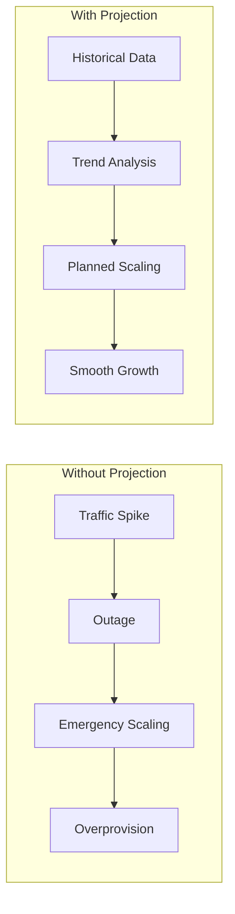
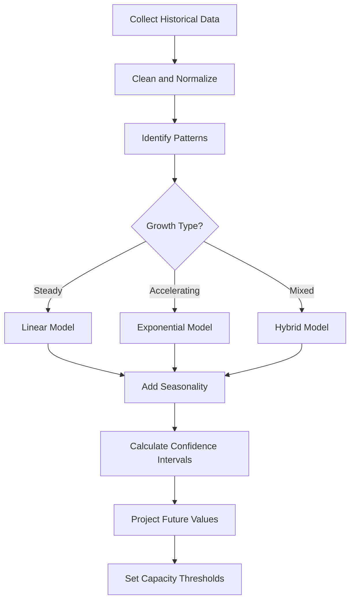
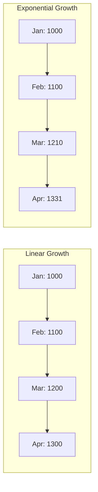
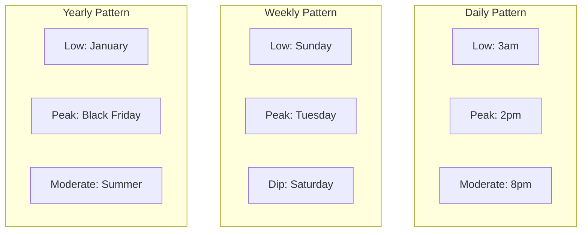
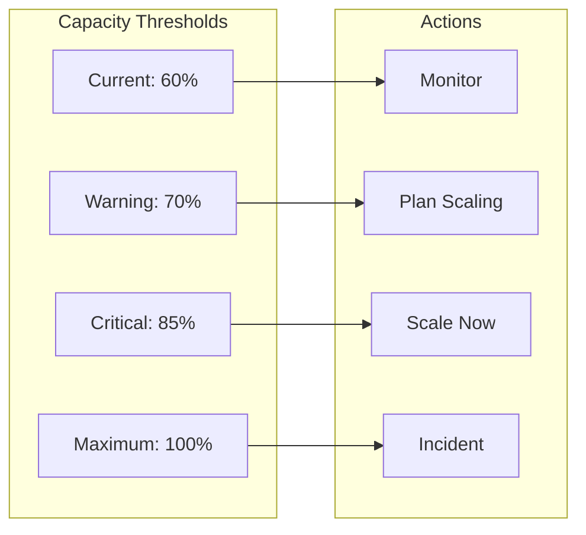
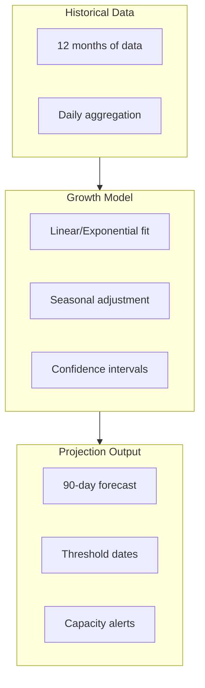

# How to Implement Growth Projection

Author: [nawazdhandala](https://github.com/nawazdhandala)

Tags: Capacity Planning, Growth, Forecasting, Infrastructure

Description: A practical guide to projecting infrastructure growth using historical data, trend analysis, and seasonality patterns.

---

Capacity planning without growth projection is guesswork. You either overprovision (wasting money) or underprovision (causing outages). Growth projection bridges the gap between "we need more servers" and "we need exactly 12 more servers by March."

This guide covers the fundamentals: collecting historical data, choosing between linear and exponential models, accounting for seasonality, and turning projections into actionable capacity decisions.

## Why Growth Projection Matters



Growth projection turns reactive firefighting into proactive planning. Instead of scrambling when your database hits 90% capacity, you know three months in advance that you need to upgrade.

## The Growth Projection Process



## Step 1: Collect Historical Data

Start with at least 12 months of historical data. More is better. You need enough data to capture seasonal patterns and distinguish trends from noise.

### Key Metrics to Track

| Metric | Why It Matters | Collection Frequency |
|--------|---------------|---------------------|
| Request volume | Primary load indicator | Hourly |
| Active users | Business growth signal | Daily |
| Database size | Storage planning | Daily |
| CPU utilization | Compute capacity | Hourly |
| Memory usage | Resource saturation | Hourly |
| Network throughput | Bandwidth planning | Hourly |
| Queue depth | Processing capacity | Hourly |

### Data Collection Example

```python
# Pull historical metrics from your monitoring system
import pandas as pd
from datetime import datetime, timedelta

def collect_metrics(metric_name: str, days: int = 365) -> pd.DataFrame:
    """
    Collect historical metric data.
    Replace with your actual monitoring API calls.
    """
    end_time = datetime.now()
    start_time = end_time - timedelta(days=days)

    # Example: Query from Prometheus/InfluxDB/your monitoring system
    # data = monitoring_client.query(
    #     metric=metric_name,
    #     start=start_time,
    #     end=end_time,
    #     interval="1h"
    # )

    # Return as DataFrame with timestamp index
    return pd.DataFrame({
        'timestamp': pd.date_range(start=start_time, end=end_time, freq='H'),
        'value': [...]  # Your metric values
    }).set_index('timestamp')
```

## Step 2: Clean and Normalize Data

Raw data contains outliers, gaps, and anomalies. Clean it before analysis.

```python
def clean_metric_data(df: pd.DataFrame) -> pd.DataFrame:
    """Clean and normalize metric data for analysis."""

    # Remove extreme outliers (beyond 3 standard deviations)
    mean = df['value'].mean()
    std = df['value'].std()
    df = df[(df['value'] > mean - 3*std) & (df['value'] < mean + 3*std)]

    # Fill small gaps with interpolation
    df = df.resample('H').mean()
    df['value'] = df['value'].interpolate(method='linear', limit=6)

    # Handle larger gaps (mark as missing, don't interpolate)
    df['value'] = df['value'].where(df['value'].notna())

    return df
```

### Aggregation for Trend Analysis

Hourly data is too noisy for trend analysis. Aggregate to daily or weekly.

```python
def aggregate_for_trends(df: pd.DataFrame, period: str = 'D') -> pd.DataFrame:
    """
    Aggregate data for trend analysis.
    period: 'D' for daily, 'W' for weekly
    """
    if period == 'D':
        # Use 95th percentile for daily peaks
        daily = df.resample('D').agg({
            'value': ['mean', 'max', lambda x: x.quantile(0.95)]
        })
        daily.columns = ['mean', 'max', 'p95']
        return daily
    elif period == 'W':
        return df.resample('W').mean()
```

## Step 3: Identify the Growth Pattern

Look at your data visually first. Plot it.

```python
import matplotlib.pyplot as plt

def plot_historical_data(df: pd.DataFrame, title: str):
    """Visualize historical data to identify patterns."""
    fig, axes = plt.subplots(2, 1, figsize=(12, 8))

    # Raw data
    axes[0].plot(df.index, df['value'])
    axes[0].set_title(f'{title} - Raw Data')
    axes[0].set_ylabel('Value')

    # Rolling average to see trend
    rolling = df['value'].rolling(window=30).mean()
    axes[1].plot(df.index, rolling)
    axes[1].set_title(f'{title} - 30-Day Rolling Average')
    axes[1].set_ylabel('Value')

    plt.tight_layout()
    return fig
```

### Recognizing Growth Types



**Linear growth**: Constant absolute increase. Adding 100 users per month.

**Exponential growth**: Constant percentage increase. Growing 10% per month.

**How to tell the difference**: Plot on a log scale. Linear growth curves upward on a log scale. Exponential growth appears as a straight line.

```python
def identify_growth_type(df: pd.DataFrame) -> str:
    """
    Determine if growth is linear or exponential.
    Returns 'linear', 'exponential', or 'mixed'.
    """
    import numpy as np
    from scipy import stats

    values = df['value'].dropna().values
    x = np.arange(len(values))

    # Fit linear model
    linear_slope, linear_intercept, linear_r, _, _ = stats.linregress(x, values)
    linear_r_squared = linear_r ** 2

    # Fit exponential model (linear regression on log values)
    log_values = np.log(values[values > 0])
    x_log = x[:len(log_values)]
    exp_slope, exp_intercept, exp_r, _, _ = stats.linregress(x_log, log_values)
    exp_r_squared = exp_r ** 2

    # Compare R-squared values
    if abs(linear_r_squared - exp_r_squared) < 0.05:
        return 'mixed'
    elif exp_r_squared > linear_r_squared:
        return 'exponential'
    else:
        return 'linear'
```

## Step 4: Build the Growth Model

### Linear Growth Model

Use when growth is steady and predictable.

```python
from scipy import stats
import numpy as np

def linear_projection(df: pd.DataFrame, days_ahead: int = 90) -> pd.DataFrame:
    """
    Project future values using linear regression.
    """
    values = df['value'].dropna().values
    x = np.arange(len(values))

    # Fit the model
    slope, intercept, r_value, p_value, std_err = stats.linregress(x, values)

    # Project future values
    future_x = np.arange(len(values), len(values) + days_ahead)
    future_values = slope * future_x + intercept

    # Calculate confidence interval (95%)
    n = len(values)
    se = std_err * np.sqrt(1 + 1/n + (future_x - x.mean())**2 / np.sum((x - x.mean())**2))
    ci_lower = future_values - 1.96 * se
    ci_upper = future_values + 1.96 * se

    # Create future date index
    last_date = df.index[-1]
    future_dates = pd.date_range(start=last_date + timedelta(days=1), periods=days_ahead, freq='D')

    return pd.DataFrame({
        'projected': future_values,
        'ci_lower': ci_lower,
        'ci_upper': ci_upper
    }, index=future_dates)
```

**Linear growth calculation example:**

| Metric | Value |
|--------|-------|
| Current daily requests | 100,000 |
| Monthly growth rate | 5,000 requests |
| Days to project | 90 |
| Projected value | 100,000 + (5,000/30 * 90) = 115,000 |

### Exponential Growth Model

Use when growth accelerates over time.

```python
def exponential_projection(df: pd.DataFrame, days_ahead: int = 90) -> pd.DataFrame:
    """
    Project future values using exponential growth model.
    """
    values = df['value'].dropna().values
    x = np.arange(len(values))

    # Fit exponential model (linear regression on log values)
    log_values = np.log(values[values > 0])
    slope, intercept, r_value, _, std_err = stats.linregress(x[:len(log_values)], log_values)

    # Daily growth rate
    daily_growth_rate = np.exp(slope) - 1

    # Project future values
    future_x = np.arange(len(values), len(values) + days_ahead)
    future_log_values = slope * future_x + intercept
    future_values = np.exp(future_log_values)

    # Confidence interval
    se = std_err * np.sqrt(1 + 1/len(log_values))
    ci_lower = np.exp(future_log_values - 1.96 * se)
    ci_upper = np.exp(future_log_values + 1.96 * se)

    last_date = df.index[-1]
    future_dates = pd.date_range(start=last_date + timedelta(days=1), periods=days_ahead, freq='D')

    return pd.DataFrame({
        'projected': future_values,
        'ci_lower': ci_lower,
        'ci_upper': ci_upper,
        'daily_growth_rate': [daily_growth_rate] * days_ahead
    }, index=future_dates)
```

**Exponential growth calculation example:**

| Metric | Value |
|--------|-------|
| Current daily requests | 100,000 |
| Monthly growth rate | 10% |
| Daily growth rate | (1.10)^(1/30) - 1 = 0.32% |
| After 90 days | 100,000 * (1.0032)^90 = 133,100 |

## Step 5: Account for Seasonality

Most systems have predictable patterns: daily cycles, weekly patterns, holiday spikes.



### Decomposing Seasonality

```python
from statsmodels.tsa.seasonal import seasonal_decompose

def decompose_seasonality(df: pd.DataFrame, period: int = 7) -> dict:
    """
    Decompose time series into trend, seasonal, and residual components.
    period: 7 for weekly, 365 for yearly
    """
    result = seasonal_decompose(df['value'].dropna(), period=period, extrapolate_trend='freq')

    return {
        'trend': result.trend,
        'seasonal': result.seasonal,
        'residual': result.resid,
        'seasonal_factors': result.seasonal[:period].values
    }
```

### Applying Seasonal Adjustments

```python
def project_with_seasonality(
    df: pd.DataFrame,
    days_ahead: int = 90,
    weekly_factors: list = None
) -> pd.DataFrame:
    """
    Project with seasonal adjustments.
    weekly_factors: list of 7 multipliers (Mon=0 through Sun=6)
    """
    # Get base projection
    base_projection = linear_projection(df, days_ahead)

    # Apply weekly seasonality
    if weekly_factors is None:
        # Default: calculate from historical data
        df['dayofweek'] = df.index.dayofweek
        weekly_factors = df.groupby('dayofweek')['value'].mean()
        weekly_factors = (weekly_factors / weekly_factors.mean()).values

    # Adjust projections by day of week
    adjusted = base_projection.copy()
    adjusted['dayofweek'] = adjusted.index.dayofweek
    adjusted['seasonal_factor'] = adjusted['dayofweek'].map(lambda x: weekly_factors[x])
    adjusted['projected'] = adjusted['projected'] * adjusted['seasonal_factor']
    adjusted['ci_lower'] = adjusted['ci_lower'] * adjusted['seasonal_factor']
    adjusted['ci_upper'] = adjusted['ci_upper'] * adjusted['seasonal_factor']

    return adjusted[['projected', 'ci_lower', 'ci_upper']]
```

**Seasonal factor example:**

| Day | Factor | Meaning |
|-----|--------|---------|
| Monday | 1.15 | 15% above average |
| Tuesday | 1.20 | 20% above average |
| Wednesday | 1.10 | 10% above average |
| Thursday | 1.05 | 5% above average |
| Friday | 0.95 | 5% below average |
| Saturday | 0.75 | 25% below average |
| Sunday | 0.80 | 20% below average |

## Step 6: Set Capacity Thresholds

Convert projections into actionable thresholds.



### Threshold Calculation

```python
def calculate_capacity_dates(
    projection: pd.DataFrame,
    current_capacity: float,
    thresholds: dict = None
) -> dict:
    """
    Calculate when capacity thresholds will be reached.

    thresholds: dict with keys 'warning', 'critical', 'maximum'
    """
    if thresholds is None:
        thresholds = {
            'warning': 0.70,    # 70% utilization
            'critical': 0.85,   # 85% utilization
            'maximum': 1.00     # 100% utilization
        }

    results = {}

    for threshold_name, threshold_pct in thresholds.items():
        threshold_value = current_capacity * threshold_pct

        # Find when projected value exceeds threshold
        exceeds = projection[projection['projected'] > threshold_value]

        if len(exceeds) > 0:
            results[threshold_name] = {
                'date': exceeds.index[0],
                'days_until': (exceeds.index[0] - projection.index[0]).days,
                'projected_value': exceeds['projected'].iloc[0],
                'threshold_value': threshold_value
            }
        else:
            results[threshold_name] = {
                'date': None,
                'days_until': None,
                'projected_value': None,
                'threshold_value': threshold_value
            }

    return results
```

**Example output:**

| Threshold | Date | Days Until | Action Required |
|-----------|------|------------|-----------------|
| Warning (70%) | March 15 | 45 | Start planning upgrade |
| Critical (85%) | April 22 | 82 | Finalize upgrade plan |
| Maximum (100%) | May 30 | 120 | Scale before this date |

## Step 7: Build the Projection Pipeline

Put it all together into a repeatable process.

```python
class GrowthProjector:
    """Complete growth projection pipeline."""

    def __init__(self, metric_name: str, current_capacity: float):
        self.metric_name = metric_name
        self.current_capacity = current_capacity
        self.historical_data = None
        self.growth_type = None
        self.projection = None

    def load_data(self, days: int = 365):
        """Step 1: Load historical data."""
        self.historical_data = collect_metrics(self.metric_name, days)
        self.historical_data = clean_metric_data(self.historical_data)
        self.historical_data = aggregate_for_trends(self.historical_data, period='D')
        return self

    def analyze_growth(self):
        """Step 2: Identify growth pattern."""
        self.growth_type = identify_growth_type(self.historical_data)
        return self

    def project(self, days_ahead: int = 90, include_seasonality: bool = True):
        """Step 3: Generate projection."""
        if self.growth_type == 'exponential':
            base = exponential_projection(self.historical_data, days_ahead)
        else:
            base = linear_projection(self.historical_data, days_ahead)

        if include_seasonality:
            self.projection = project_with_seasonality(
                self.historical_data,
                days_ahead
            )
        else:
            self.projection = base

        return self

    def get_capacity_timeline(self) -> dict:
        """Step 4: Calculate when thresholds are reached."""
        return calculate_capacity_dates(
            self.projection,
            self.current_capacity
        )

    def generate_report(self) -> str:
        """Generate human-readable capacity report."""
        timeline = self.get_capacity_timeline()

        report = f"""
Capacity Projection Report: {self.metric_name}
{'=' * 50}

Growth Pattern: {self.growth_type}
Current Capacity: {self.current_capacity:,.0f}
Current Usage: {self.historical_data['mean'].iloc[-1]:,.0f}
Current Utilization: {self.historical_data['mean'].iloc[-1] / self.current_capacity * 100:.1f}%

Projected Threshold Dates:
"""
        for threshold, data in timeline.items():
            if data['date']:
                report += f"  {threshold.upper()}: {data['date'].strftime('%Y-%m-%d')} ({data['days_until']} days)\n"
            else:
                report += f"  {threshold.upper()}: Not reached in projection window\n"

        return report
```

### Running the Pipeline

```python
# Example usage
projector = GrowthProjector(
    metric_name='api_requests_per_second',
    current_capacity=10000  # Current max RPS
)

projector.load_data(days=365)
projector.analyze_growth()
projector.project(days_ahead=180, include_seasonality=True)

print(projector.generate_report())

# Get specific dates for alerting
timeline = projector.get_capacity_timeline()
if timeline['warning']['days_until'] and timeline['warning']['days_until'] < 60:
    print(f"ACTION REQUIRED: Capacity warning in {timeline['warning']['days_until']} days")
```

## Visualization



### Projection Chart Example

```python
def plot_projection(
    historical: pd.DataFrame,
    projection: pd.DataFrame,
    current_capacity: float,
    title: str
):
    """Create projection visualization."""
    fig, ax = plt.subplots(figsize=(14, 6))

    # Historical data
    ax.plot(historical.index, historical['mean'], label='Historical', color='blue')

    # Projection
    ax.plot(projection.index, projection['projected'], label='Projected',
            color='green', linestyle='--')

    # Confidence interval
    ax.fill_between(
        projection.index,
        projection['ci_lower'],
        projection['ci_upper'],
        alpha=0.2,
        color='green',
        label='95% Confidence'
    )

    # Capacity lines
    ax.axhline(y=current_capacity * 0.70, color='yellow',
               linestyle=':', label='Warning (70%)')
    ax.axhline(y=current_capacity * 0.85, color='orange',
               linestyle=':', label='Critical (85%)')
    ax.axhline(y=current_capacity, color='red',
               linestyle=':', label='Maximum')

    ax.set_title(title)
    ax.set_xlabel('Date')
    ax.set_ylabel('Value')
    ax.legend()
    ax.grid(True, alpha=0.3)

    return fig
```

## Common Mistakes

### 1. Projecting Without Enough Data

Three months of data cannot capture yearly seasonality. You will miss Black Friday spikes if you only have summer data.

**Fix:** Collect at least 12 months. For highly seasonal businesses, 24 months is better.

### 2. Ignoring Confidence Intervals

Point projections are misleading. A projection of 150,000 requests could easily be 120,000 or 180,000.

**Fix:** Always calculate and communicate confidence intervals. Plan for the upper bound.

### 3. Assuming Linear Growth Forever

Early-stage products often see exponential growth that later flattens. Extrapolating the early curve leads to absurd predictions.

**Fix:** Regularly re-evaluate your growth model. Switch from exponential to linear when growth stabilizes.

### 4. Not Accounting for Step Changes

Product launches, marketing campaigns, and feature releases cause step changes, not smooth growth.

**Fix:** Identify planned events and model them separately. Add expected user increases from launches to your projection.

### 5. Projecting Too Far Ahead

Uncertainty compounds. A 90-day projection has useful accuracy. A 2-year projection is fiction.

**Fix:** Limit projections to 90-180 days. Re-run projections monthly with fresh data.

## Integrating with Capacity Planning

Growth projections are inputs to capacity planning decisions.

| Projection Output | Capacity Decision |
|-------------------|-------------------|
| Warning threshold in 60 days | Begin procurement process |
| Critical threshold in 30 days | Finalize scaling plan |
| Maximum in 14 days | Execute emergency scaling |
| No threshold reached | Monitor and re-project monthly |

### Automation Checklist

- [ ] Automated data collection from monitoring systems
- [ ] Weekly projection runs with email reports
- [ ] Alerts when thresholds are within 60 days
- [ ] Dashboard showing current utilization vs projections
- [ ] Integration with cloud auto-scaling policies

## Tools and Services

You can implement growth projection with:

- **Python**: pandas, statsmodels, scipy for custom analysis
- **Prometheus/Grafana**: For data collection and visualization
- **Cloud provider tools**: AWS Cost Explorer, GCP Billing reports include growth projections
- **OneUptime**: Combines monitoring, alerting, and capacity tracking in one platform

---

Growth projection turns capacity planning from reactive to proactive. Collect your data, understand your growth pattern, account for seasonality, and set clear thresholds. Run projections monthly, and you will always know when to scale before your users notice you needed to.
