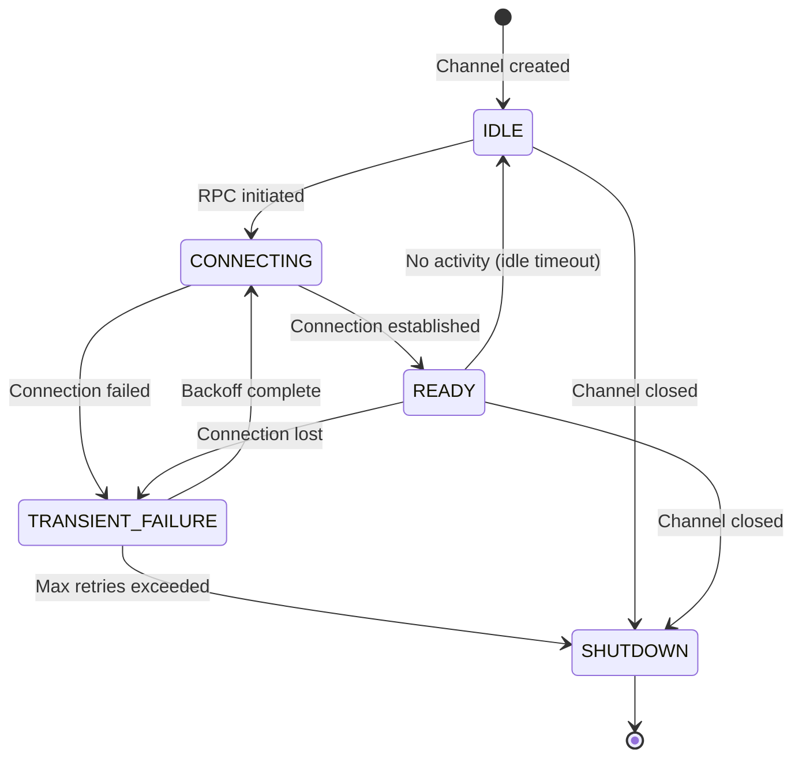
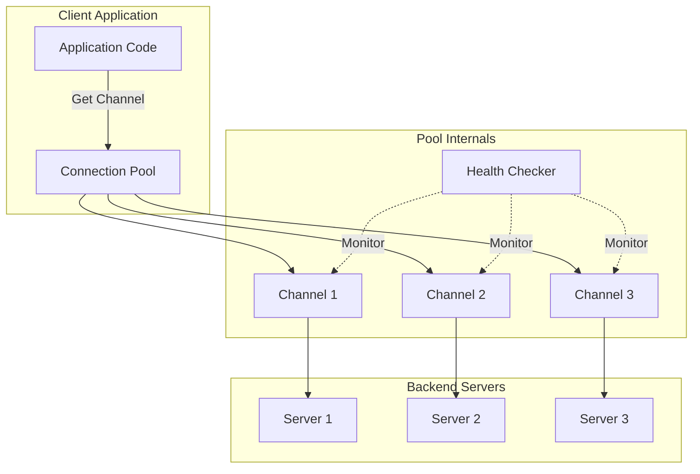
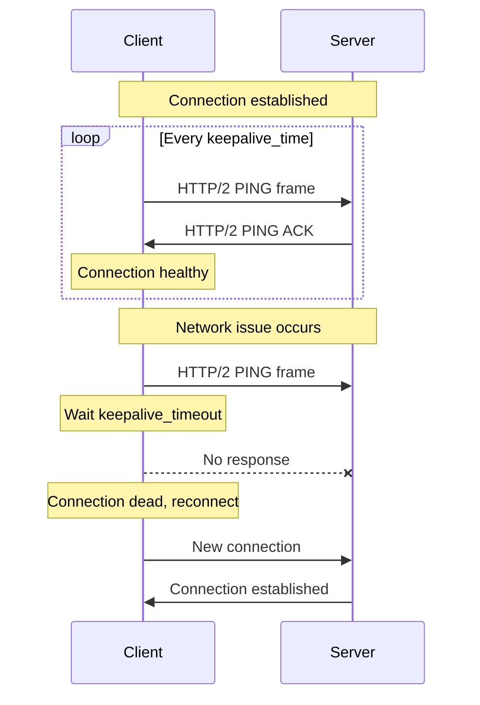
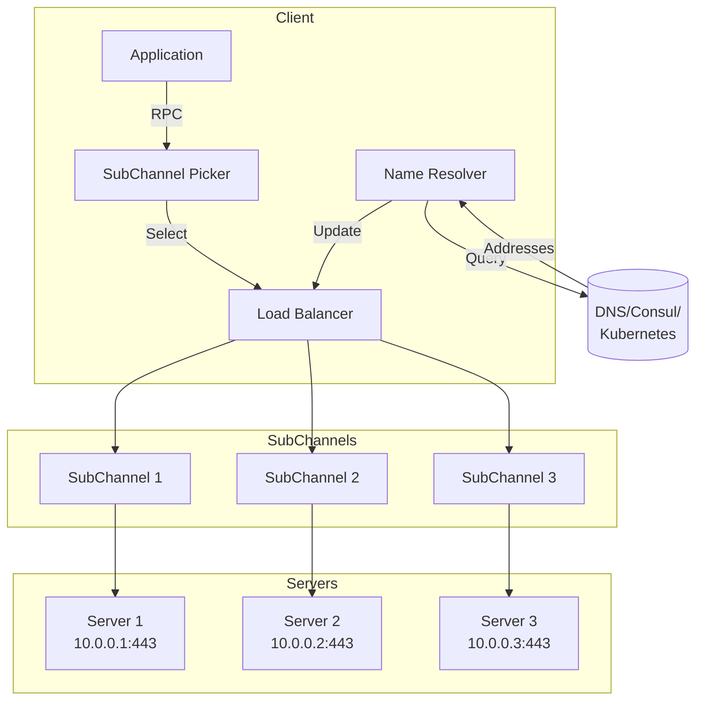

# How to Build gRPC Connection Management

Author: [nawazdhandala](https://github.com/nawazdhandala)

Tags: gRPC, Networking, Performance, Microservices

Description: Learn how to build efficient gRPC connection management with connection pooling, keepalive configuration, and load balancing for high-performance microservices.

---

gRPC is the de facto standard for microservice communication, offering high performance through HTTP/2 multiplexing, Protocol Buffers serialization, and bidirectional streaming. However, poor connection management can negate these benefits. This guide covers how to build robust gRPC connection management for production systems.

## Understanding gRPC Channels and Connections

A gRPC **channel** is a logical connection to a gRPC server. Channels manage the underlying HTTP/2 connections and handle reconnection, load balancing, and name resolution. Unlike traditional REST clients where you create a new TCP connection per request, gRPC multiplexes multiple RPCs over a single HTTP/2 connection.

### Connection Lifecycle



### Channel States Explained

| State | Description |
|-------|-------------|
| **IDLE** | No active RPCs, no connection attempts. Transitions to CONNECTING when an RPC is made. |
| **CONNECTING** | Attempting to establish a connection. TCP handshake and HTTP/2 setup in progress. |
| **READY** | Connection established. RPCs can be sent immediately. |
| **TRANSIENT_FAILURE** | Connection failed temporarily. Will retry with exponential backoff. |
| **SHUTDOWN** | Channel is closed. No more RPCs will be accepted. |

## Basic Channel Creation

### Node.js (grpc-js)

```javascript
const grpc = require('@grpc/grpc-js');
const protoLoader = require('@grpc/proto-loader');

// Load the protobuf definition
const packageDefinition = protoLoader.loadSync('service.proto', {
  keepCase: true,
  longs: String,
  enums: String,
  defaults: true,
  oneofs: true,
});

const proto = grpc.loadPackageDefinition(packageDefinition);

// Create a channel with options
// The channel is the core abstraction for connection management
const channel = new grpc.Channel(
  'api.example.com:443',
  grpc.credentials.createSsl(),
  {
    // Maximum time to wait for a connection
    'grpc.initial_reconnect_backoff_ms': 1000,
    // Maximum backoff time between reconnection attempts
    'grpc.max_reconnect_backoff_ms': 30000,
    // Enable keepalive pings (see keepalive section)
    'grpc.keepalive_time_ms': 30000,
  }
);

// Create a client using the channel
const client = new proto.MyService(
  'api.example.com:443',
  grpc.credentials.createSsl(),
  {
    'grpc.initial_reconnect_backoff_ms': 1000,
    'grpc.max_reconnect_backoff_ms': 30000,
  }
);
```

### Go

```go
package main

import (
    "context"
    "log"
    "time"

    "google.golang.org/grpc"
    "google.golang.org/grpc/credentials"
    "google.golang.org/grpc/keepalive"
)

func main() {
    // Create connection with dial options
    // grpc.Dial returns a ClientConn which manages the underlying connections
    conn, err := grpc.Dial(
        "api.example.com:443",
        // Use TLS for production
        grpc.WithTransportCredentials(credentials.NewTLS(nil)),
        // Block until connection is established (useful for startup)
        grpc.WithBlock(),
        // Set connection timeout
        grpc.WithTimeout(10*time.Second),
        // Configure keepalive (see keepalive section)
        grpc.WithKeepaliveParams(keepalive.ClientParameters{
            Time:                30 * time.Second,
            Timeout:             10 * time.Second,
            PermitWithoutStream: true,
        }),
    )
    if err != nil {
        log.Fatalf("Failed to connect: %v", err)
    }
    defer conn.Close()

    // Create a client using the connection
    client := pb.NewMyServiceClient(conn)

    // The connection is now managed by the ClientConn
    // It handles reconnection, load balancing, etc.
}
```

### Python

```python
import grpc
from concurrent import futures

# Create a channel with options
# Channels are the primary way to manage gRPC connections in Python
channel = grpc.secure_channel(
    'api.example.com:443',
    grpc.ssl_channel_credentials(),
    options=[
        # Maximum message sizes
        ('grpc.max_send_message_length', 50 * 1024 * 1024),
        ('grpc.max_receive_message_length', 50 * 1024 * 1024),
        # Keepalive settings
        ('grpc.keepalive_time_ms', 30000),
        ('grpc.keepalive_timeout_ms', 10000),
        ('grpc.keepalive_permit_without_calls', True),
        # Reconnection settings
        ('grpc.initial_reconnect_backoff_ms', 1000),
        ('grpc.max_reconnect_backoff_ms', 30000),
    ]
)

# Create a stub (client) using the channel
stub = MyServiceStub(channel)

# Always close the channel when done
# In production, typically keep channels open for the lifetime of the application
channel.close()
```

## Connection Pooling Strategies

While gRPC channels multiplex RPCs over a single HTTP/2 connection, there are scenarios where connection pooling improves performance:

1. **High throughput**: HTTP/2 flow control can become a bottleneck
2. **Multiple backends**: Load balancing across multiple server instances
3. **Connection limits**: Working around server-side connection limits

### Connection Pool Architecture



### Node.js Connection Pool

```javascript
const grpc = require('@grpc/grpc-js');

class GrpcConnectionPool {
  constructor(options) {
    // Target address for the gRPC server
    this.target = options.target;
    // Credentials (SSL or insecure for development)
    this.credentials = options.credentials || grpc.credentials.createInsecure();
    // Number of connections in the pool
    this.poolSize = options.poolSize || 5;
    // Channel options passed to each connection
    this.channelOptions = options.channelOptions || {};
    // The actual pool of channels
    this.channels = [];
    // Round-robin index for channel selection
    this.currentIndex = 0;

    this.initialize();
  }

  initialize() {
    // Create multiple channels for the pool
    // Each channel manages its own HTTP/2 connection
    for (let i = 0; i < this.poolSize; i++) {
      const channel = new grpc.Channel(
        this.target,
        this.credentials,
        {
          ...this.channelOptions,
          // Unique identifier helps with debugging
          'grpc.primary_user_agent': `pool-channel-${i}`,
        }
      );
      this.channels.push({
        channel,
        inUse: 0, // Track how many RPCs are using this channel
        lastUsed: Date.now(),
      });
    }
  }

  // Get a channel using round-robin selection
  getChannel() {
    const poolEntry = this.channels[this.currentIndex];
    poolEntry.inUse++;
    poolEntry.lastUsed = Date.now();

    // Move to next channel for next request
    this.currentIndex = (this.currentIndex + 1) % this.poolSize;

    return poolEntry.channel;
  }

  // Get a channel using least-connections selection
  // Better for uneven request durations
  getLeastLoadedChannel() {
    let minLoad = Infinity;
    let selectedEntry = this.channels[0];

    for (const entry of this.channels) {
      if (entry.inUse < minLoad) {
        minLoad = entry.inUse;
        selectedEntry = entry;
      }
    }

    selectedEntry.inUse++;
    selectedEntry.lastUsed = Date.now();
    return selectedEntry.channel;
  }

  // Release a channel after RPC completes
  releaseChannel(channel) {
    const entry = this.channels.find((e) => e.channel === channel);
    if (entry && entry.inUse > 0) {
      entry.inUse--;
    }
  }

  // Check health of all channels
  async healthCheck() {
    const results = [];
    for (const entry of this.channels) {
      const state = entry.channel.getConnectivityState(false);
      results.push({
        state: this.stateToString(state),
        inUse: entry.inUse,
        lastUsed: entry.lastUsed,
      });
    }
    return results;
  }

  stateToString(state) {
    const states = {
      0: 'IDLE',
      1: 'CONNECTING',
      2: 'READY',
      3: 'TRANSIENT_FAILURE',
      4: 'SHUTDOWN',
    };
    return states[state] || 'UNKNOWN';
  }

  // Close all channels in the pool
  async close() {
    for (const entry of this.channels) {
      entry.channel.close();
    }
    this.channels = [];
  }
}

// Usage example
const pool = new GrpcConnectionPool({
  target: 'api.example.com:443',
  credentials: grpc.credentials.createSsl(),
  poolSize: 5,
  channelOptions: {
    'grpc.keepalive_time_ms': 30000,
    'grpc.keepalive_timeout_ms': 10000,
  },
});

// Make an RPC using the pool
async function makeRequest(data) {
  const channel = pool.getLeastLoadedChannel();
  try {
    // Create client with the pooled channel
    const client = new MyServiceClient(pool.target, pool.credentials, {
      channelOverride: channel,
    });
    const response = await client.myMethod(data);
    return response;
  } finally {
    // Always release the channel
    pool.releaseChannel(channel);
  }
}
```

### Go Connection Pool

```go
package grpcpool

import (
    "context"
    "sync"
    "sync/atomic"
    "time"

    "google.golang.org/grpc"
    "google.golang.org/grpc/connectivity"
)

// Pool manages a pool of gRPC connections
type Pool struct {
    target      string
    dialOptions []grpc.DialOption
    size        int
    conns       []*poolConn
    mu          sync.RWMutex
    counter     uint64 // For round-robin selection
}

// poolConn wraps a connection with metadata
type poolConn struct {
    conn     *grpc.ClientConn
    inUse    int64
    lastUsed time.Time
}

// NewPool creates a new connection pool
func NewPool(target string, size int, opts ...grpc.DialOption) (*Pool, error) {
    p := &Pool{
        target:      target,
        dialOptions: opts,
        size:        size,
        conns:       make([]*poolConn, size),
    }

    // Initialize all connections upfront
    // This ensures connections are ready when needed
    for i := 0; i < size; i++ {
        conn, err := grpc.Dial(target, opts...)
        if err != nil {
            // Clean up already created connections
            p.Close()
            return nil, err
        }
        p.conns[i] = &poolConn{
            conn:     conn,
            inUse:    0,
            lastUsed: time.Now(),
        }
    }

    return p, nil
}

// Get returns a connection using round-robin selection
func (p *Pool) Get() *grpc.ClientConn {
    // Atomic increment for thread-safe round-robin
    idx := atomic.AddUint64(&p.counter, 1) % uint64(p.size)

    pc := p.conns[idx]
    atomic.AddInt64(&pc.inUse, 1)
    pc.lastUsed = time.Now()

    return pc.conn
}

// GetLeastLoaded returns the connection with fewest active RPCs
func (p *Pool) GetLeastLoaded() *grpc.ClientConn {
    p.mu.RLock()
    defer p.mu.RUnlock()

    var selected *poolConn
    var minLoad int64 = 1<<63 - 1 // Max int64

    for _, pc := range p.conns {
        load := atomic.LoadInt64(&pc.inUse)
        // Also check connection state
        state := pc.conn.GetState()
        if state == connectivity.Ready && load < minLoad {
            minLoad = load
            selected = pc
        }
    }

    // Fallback to first connection if none are ready
    if selected == nil {
        selected = p.conns[0]
    }

    atomic.AddInt64(&selected.inUse, 1)
    selected.lastUsed = time.Now()

    return selected.conn
}

// Put releases a connection back to the pool
func (p *Pool) Put(conn *grpc.ClientConn) {
    for _, pc := range p.conns {
        if pc.conn == conn {
            atomic.AddInt64(&pc.inUse, -1)
            return
        }
    }
}

// HealthCheck returns the state of all connections
func (p *Pool) HealthCheck() []ConnHealth {
    p.mu.RLock()
    defer p.mu.RUnlock()

    results := make([]ConnHealth, len(p.conns))
    for i, pc := range p.conns {
        results[i] = ConnHealth{
            State:    pc.conn.GetState().String(),
            InUse:    atomic.LoadInt64(&pc.inUse),
            LastUsed: pc.lastUsed,
        }
    }
    return results
}

type ConnHealth struct {
    State    string
    InUse    int64
    LastUsed time.Time
}

// Close closes all connections in the pool
func (p *Pool) Close() error {
    p.mu.Lock()
    defer p.mu.Unlock()

    var lastErr error
    for _, pc := range p.conns {
        if pc != nil && pc.conn != nil {
            if err := pc.conn.Close(); err != nil {
                lastErr = err
            }
        }
    }
    return lastErr
}

// Usage
func main() {
    pool, err := NewPool(
        "api.example.com:443",
        5, // 5 connections
        grpc.WithTransportCredentials(credentials.NewTLS(nil)),
    )
    if err != nil {
        log.Fatal(err)
    }
    defer pool.Close()

    // Get a connection
    conn := pool.GetLeastLoaded()
    defer pool.Put(conn)

    // Use the connection
    client := pb.NewMyServiceClient(conn)
    resp, err := client.MyMethod(context.Background(), &pb.Request{})
}
```

## Keepalive Configuration

Keepalive pings maintain connections and detect dead connections quickly. Without keepalives, a dead connection might not be detected until an RPC times out.

### Keepalive Flow



### Node.js Keepalive Configuration

```javascript
const grpc = require('@grpc/grpc-js');

const client = new MyServiceClient(
  'api.example.com:443',
  grpc.credentials.createSsl(),
  {
    // Time between keepalive pings (30 seconds)
    // Lower values detect failures faster but increase overhead
    'grpc.keepalive_time_ms': 30000,

    // Time to wait for ping acknowledgment (10 seconds)
    // If no response within this time, connection is considered dead
    'grpc.keepalive_timeout_ms': 10000,

    // Send pings even without active RPCs
    // Essential for detecting dead connections during idle periods
    'grpc.keepalive_permit_without_calls': 1,

    // Minimum time between pings (important for server compatibility)
    // Some servers reject connections that ping too frequently
    'grpc.http2.min_time_between_pings_ms': 10000,

    // Maximum number of pings without data before connection is closed
    'grpc.http2.max_pings_without_data': 0, // 0 = unlimited
  }
);
```

### Go Keepalive Configuration

```go
import (
    "google.golang.org/grpc"
    "google.golang.org/grpc/keepalive"
)

// Client-side keepalive configuration
clientParams := keepalive.ClientParameters{
    // Time between keepalive pings
    // After this duration of inactivity, send a ping
    Time: 30 * time.Second,

    // Time to wait for ping acknowledgment
    // Connection closed if no response within this duration
    Timeout: 10 * time.Second,

    // Send pings even without active streams
    // Important for long-lived connections with sporadic traffic
    PermitWithoutStream: true,
}

conn, err := grpc.Dial(
    "api.example.com:443",
    grpc.WithKeepaliveParams(clientParams),
    grpc.WithTransportCredentials(credentials.NewTLS(nil)),
)

// Server-side keepalive configuration
// Servers can also send pings to clients
serverParams := keepalive.ServerParameters{
    // Maximum time a connection can be idle
    MaxConnectionIdle: 5 * time.Minute,

    // Maximum connection age (force reconnection for load balancing)
    MaxConnectionAge: 30 * time.Minute,

    // Grace period after MaxConnectionAge before forceful close
    MaxConnectionAgeGrace: 10 * time.Second,

    // Time between server-initiated keepalive pings
    Time: 2 * time.Hour,

    // Time to wait for ping acknowledgment
    Timeout: 20 * time.Second,
}

// Enforcement policy for client pings
enforcementPolicy := keepalive.EnforcementPolicy{
    // Minimum time between client pings
    // Reject connections that ping more frequently
    MinTime: 10 * time.Second,

    // Allow pings without active streams
    PermitWithoutStream: true,
}

server := grpc.NewServer(
    grpc.KeepaliveParams(serverParams),
    grpc.KeepaliveEnforcementPolicy(enforcementPolicy),
)
```

### Python Keepalive Configuration

```python
import grpc

# Channel options for keepalive
options = [
    # Time between keepalive pings (milliseconds)
    ('grpc.keepalive_time_ms', 30000),

    # Time to wait for ping acknowledgment (milliseconds)
    ('grpc.keepalive_timeout_ms', 10000),

    # Send pings even without active calls
    ('grpc.keepalive_permit_without_calls', True),

    # Minimum time between pings
    ('grpc.http2.min_time_between_pings_ms', 10000),
]

channel = grpc.secure_channel(
    'api.example.com:443',
    grpc.ssl_channel_credentials(),
    options=options,
)
```

## Load Balancing and Service Discovery

gRPC supports client-side load balancing, allowing clients to distribute requests across multiple server instances without a separate load balancer.

### Load Balancing Architecture



### DNS-Based Service Discovery (Node.js)

```javascript
const grpc = require('@grpc/grpc-js');

// Use dns:/// prefix for DNS-based discovery
// gRPC will resolve the hostname and create subchannels to each address
const client = new MyServiceClient(
  'dns:///my-service.example.com:443',
  grpc.credentials.createSsl(),
  {
    // Use round-robin load balancing
    // Each RPC goes to the next server in rotation
    'grpc.service_config': JSON.stringify({
      loadBalancingConfig: [{ round_robin: {} }],
    }),

    // How often to re-resolve DNS (in milliseconds)
    // Lower values mean faster discovery of new instances
    'grpc.dns_min_time_between_resolutions_ms': 10000,
  }
);

// For Kubernetes, use headless services
// This returns all pod IPs instead of a single cluster IP
const k8sClient = new MyServiceClient(
  'dns:///my-service.my-namespace.svc.cluster.local:443',
  grpc.credentials.createSsl(),
  {
    'grpc.service_config': JSON.stringify({
      loadBalancingConfig: [{ round_robin: {} }],
    }),
  }
);
```

### DNS-Based Service Discovery (Go)

```go
import (
    "google.golang.org/grpc"
    "google.golang.org/grpc/balancer/roundrobin"
    _ "google.golang.org/grpc/resolver/dns" // Import DNS resolver
)

// Use dns:/// scheme for DNS-based discovery
conn, err := grpc.Dial(
    "dns:///my-service.example.com:443",
    grpc.WithTransportCredentials(credentials.NewTLS(nil)),
    // Enable round-robin load balancing
    grpc.WithDefaultServiceConfig(`{"loadBalancingPolicy":"round_robin"}`),
)
```

### Consul Service Discovery (Go)

```go
package main

import (
    "context"
    "fmt"
    "sync"
    "time"

    consul "github.com/hashicorp/consul/api"
    "google.golang.org/grpc/resolver"
)

// consulResolver implements the gRPC resolver.Resolver interface
type consulResolver struct {
    client      *consul.Client
    serviceName string
    cc          resolver.ClientConn
    ctx         context.Context
    cancel      context.CancelFunc
    wg          sync.WaitGroup
}

// consulResolverBuilder creates consul resolvers
type consulResolverBuilder struct {
    client *consul.Client
}

// Build creates a new resolver for the given target
func (b *consulResolverBuilder) Build(target resolver.Target, cc resolver.ClientConn, opts resolver.BuildOptions) (resolver.Resolver, error) {
    ctx, cancel := context.WithCancel(context.Background())
    r := &consulResolver{
        client:      b.client,
        serviceName: target.Endpoint(),
        cc:          cc,
        ctx:         ctx,
        cancel:      cancel,
    }

    // Start watching for changes
    r.wg.Add(1)
    go r.watch()

    return r, nil
}

func (b *consulResolverBuilder) Scheme() string {
    return "consul"
}

// watch monitors Consul for service changes
func (r *consulResolver) watch() {
    defer r.wg.Done()

    var lastIndex uint64
    for {
        select {
        case <-r.ctx.Done():
            return
        default:
        }

        // Query Consul for healthy service instances
        // BlockingQuery waits for changes, reducing polling overhead
        services, meta, err := r.client.Health().Service(
            r.serviceName,
            "", // No tag filter
            true, // Only healthy instances
            &consul.QueryOptions{
                WaitIndex: lastIndex,
                WaitTime:  30 * time.Second,
            },
        )
        if err != nil {
            time.Sleep(time.Second)
            continue
        }

        lastIndex = meta.LastIndex

        // Convert Consul services to gRPC addresses
        var addrs []resolver.Address
        for _, svc := range services {
            addr := fmt.Sprintf("%s:%d", svc.Service.Address, svc.Service.Port)
            addrs = append(addrs, resolver.Address{Addr: addr})
        }

        // Update the client connection with new addresses
        // gRPC will create/remove subchannels as needed
        r.cc.UpdateState(resolver.State{Addresses: addrs})
    }
}

func (r *consulResolver) ResolveNow(opts resolver.ResolveNowOptions) {
    // Trigger immediate resolution (optional implementation)
}

func (r *consulResolver) Close() {
    r.cancel()
    r.wg.Wait()
}

// Register the resolver
func init() {
    client, _ := consul.NewClient(consul.DefaultConfig())
    resolver.Register(&consulResolverBuilder{client: client})
}

// Usage
func main() {
    conn, err := grpc.Dial(
        "consul:///my-service",
        grpc.WithTransportCredentials(insecure.NewCredentials()),
        grpc.WithDefaultServiceConfig(`{"loadBalancingPolicy":"round_robin"}`),
    )
    if err != nil {
        log.Fatal(err)
    }
    defer conn.Close()

    client := pb.NewMyServiceClient(conn)
    // RPCs are now load balanced across all healthy Consul instances
}
```

## Connection Health Monitoring

Monitor connection health to detect issues before they affect users.

```javascript
const grpc = require('@grpc/grpc-js');

class ConnectionMonitor {
  constructor(channel, options = {}) {
    this.channel = channel;
    this.checkInterval = options.checkInterval || 5000;
    this.onStateChange = options.onStateChange || (() => {});
    this.intervalId = null;
    this.lastState = null;
  }

  start() {
    // Immediately check current state
    this.checkState();

    // Periodically check state
    this.intervalId = setInterval(() => {
      this.checkState();
    }, this.checkInterval);
  }

  checkState() {
    // false = do not try to connect if idle
    const currentState = this.channel.getConnectivityState(false);
    const stateString = this.stateToString(currentState);

    if (currentState !== this.lastState) {
      this.onStateChange({
        previous: this.stateToString(this.lastState),
        current: stateString,
        timestamp: new Date().toISOString(),
      });
      this.lastState = currentState;
    }

    // If in TRANSIENT_FAILURE, try to reconnect
    if (currentState === grpc.connectivityState.TRANSIENT_FAILURE) {
      // true = try to connect
      this.channel.getConnectivityState(true);
    }
  }

  stateToString(state) {
    const states = {
      [grpc.connectivityState.IDLE]: 'IDLE',
      [grpc.connectivityState.CONNECTING]: 'CONNECTING',
      [grpc.connectivityState.READY]: 'READY',
      [grpc.connectivityState.TRANSIENT_FAILURE]: 'TRANSIENT_FAILURE',
      [grpc.connectivityState.SHUTDOWN]: 'SHUTDOWN',
    };
    return states[state] || 'UNKNOWN';
  }

  // Wait for a specific state with timeout
  async waitForState(targetState, timeoutMs = 10000) {
    return new Promise((resolve, reject) => {
      const startTime = Date.now();

      const check = () => {
        const currentState = this.channel.getConnectivityState(true);

        if (currentState === targetState) {
          resolve(currentState);
          return;
        }

        if (Date.now() - startTime > timeoutMs) {
          reject(new Error(`Timeout waiting for state ${this.stateToString(targetState)}`));
          return;
        }

        // Wait for state change notification
        this.channel.watchConnectivityState(
          currentState,
          Date.now() + timeoutMs,
          (err) => {
            if (err) {
              reject(err);
            } else {
              check();
            }
          }
        );
      };

      check();
    });
  }

  stop() {
    if (this.intervalId) {
      clearInterval(this.intervalId);
      this.intervalId = null;
    }
  }
}

// Usage
const channel = new grpc.Channel(
  'api.example.com:443',
  grpc.credentials.createSsl()
);

const monitor = new ConnectionMonitor(channel, {
  checkInterval: 5000,
  onStateChange: (change) => {
    console.log(`Connection state changed: ${change.previous} -> ${change.current}`);

    // Alert on failures
    if (change.current === 'TRANSIENT_FAILURE') {
      console.error('Connection failed, attempting reconnection...');
    }
  },
});

monitor.start();

// Wait for connection to be ready before making RPCs
await monitor.waitForState(grpc.connectivityState.READY, 10000);
console.log('Connection ready');
```

## Retry and Hedging Policies

Configure automatic retries for transient failures.

```javascript
const grpc = require('@grpc/grpc-js');

// Service config with retry policy
const serviceConfig = {
  loadBalancingConfig: [{ round_robin: {} }],
  methodConfig: [
    {
      // Apply to all methods
      name: [{ service: 'mypackage.MyService' }],
      // Timeout for each RPC attempt
      timeout: '30s',
      // Retry policy
      retryPolicy: {
        // Maximum number of RPC attempts (including the original)
        maxAttempts: 4,
        // Initial backoff duration
        initialBackoff: '0.1s',
        // Maximum backoff duration
        maxBackoff: '10s',
        // Backoff multiplier
        backoffMultiplier: 2,
        // Status codes that trigger a retry
        // UNAVAILABLE: server is temporarily unavailable
        // RESOURCE_EXHAUSTED: rate limited (with retry-after header)
        // ABORTED: operation was aborted (usually safe to retry)
        retryableStatusCodes: ['UNAVAILABLE', 'RESOURCE_EXHAUSTED', 'ABORTED'],
      },
    },
  ],
};

const client = new MyServiceClient(
  'api.example.com:443',
  grpc.credentials.createSsl(),
  {
    'grpc.service_config': JSON.stringify(serviceConfig),
  }
);
```

### Go Retry Configuration

```go
import "google.golang.org/grpc"

// Service config with retry policy
serviceConfig := `{
    "loadBalancingPolicy": "round_robin",
    "methodConfig": [{
        "name": [{"service": "mypackage.MyService"}],
        "timeout": "30s",
        "retryPolicy": {
            "maxAttempts": 4,
            "initialBackoff": "0.1s",
            "maxBackoff": "10s",
            "backoffMultiplier": 2,
            "retryableStatusCodes": ["UNAVAILABLE", "RESOURCE_EXHAUSTED", "ABORTED"]
        }
    }]
}`

conn, err := grpc.Dial(
    "api.example.com:443",
    grpc.WithTransportCredentials(credentials.NewTLS(nil)),
    grpc.WithDefaultServiceConfig(serviceConfig),
)
```

## Graceful Shutdown

Properly close connections to avoid resource leaks and ensure in-flight RPCs complete.

```javascript
const grpc = require('@grpc/grpc-js');

class GrpcClientManager {
  constructor() {
    this.channels = new Map();
    this.isShuttingDown = false;
  }

  createClient(name, target, credentials, options = {}) {
    if (this.isShuttingDown) {
      throw new Error('Cannot create client during shutdown');
    }

    const channel = new grpc.Channel(target, credentials, options);
    this.channels.set(name, channel);
    return channel;
  }

  async shutdown(timeoutMs = 30000) {
    console.log('Starting graceful shutdown...');
    this.isShuttingDown = true;

    const shutdownPromises = [];

    for (const [name, channel] of this.channels) {
      const promise = new Promise((resolve) => {
        // Wait for channel to become idle (no active RPCs)
        const checkIdle = () => {
          const state = channel.getConnectivityState(false);

          // If already shutdown or idle, close immediately
          if (
            state === grpc.connectivityState.SHUTDOWN ||
            state === grpc.connectivityState.IDLE
          ) {
            channel.close();
            console.log(`Channel ${name} closed`);
            resolve();
            return;
          }

          // Wait for state change
          channel.watchConnectivityState(state, Date.now() + 1000, () => {
            checkIdle();
          });
        };

        checkIdle();
      });

      shutdownPromises.push(promise);
    }

    // Wait for all channels to close or timeout
    await Promise.race([
      Promise.all(shutdownPromises),
      new Promise((resolve) => setTimeout(resolve, timeoutMs)),
    ]);

    // Force close any remaining channels
    for (const [name, channel] of this.channels) {
      const state = channel.getConnectivityState(false);
      if (state !== grpc.connectivityState.SHUTDOWN) {
        console.log(`Force closing channel ${name}`);
        channel.close();
      }
    }

    this.channels.clear();
    console.log('Graceful shutdown complete');
  }
}

// Usage
const manager = new GrpcClientManager();

const channel = manager.createClient(
  'myService',
  'api.example.com:443',
  grpc.credentials.createSsl()
);

// Handle shutdown signals
process.on('SIGTERM', async () => {
  await manager.shutdown(30000);
  process.exit(0);
});

process.on('SIGINT', async () => {
  await manager.shutdown(30000);
  process.exit(0);
});
```

## Summary

| Aspect | Recommendation |
|--------|----------------|
| **Channel reuse** | Create one channel per target, reuse for all RPCs |
| **Connection pooling** | Use for high throughput or to work around HTTP/2 limits |
| **Keepalive** | Enable with 30s ping interval, 10s timeout |
| **Load balancing** | Use round_robin with DNS or service discovery |
| **Retries** | Configure automatic retries for UNAVAILABLE status |
| **Health monitoring** | Track connection state, alert on TRANSIENT_FAILURE |
| **Graceful shutdown** | Wait for in-flight RPCs before closing channels |

Proper gRPC connection management is essential for building reliable microservices. By understanding channel lifecycle, implementing connection pooling where needed, configuring keepalives, and using client-side load balancing, you can build systems that handle failures gracefully and maintain high performance under load.
