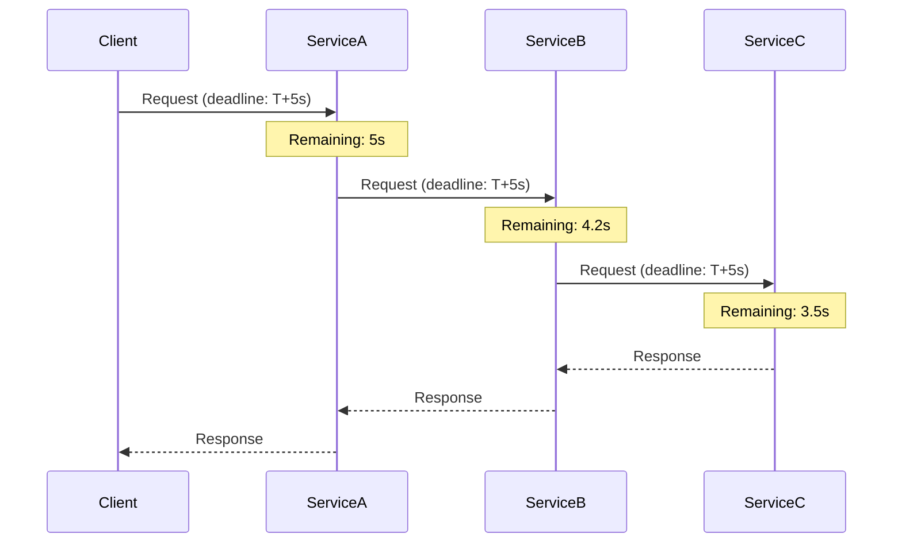
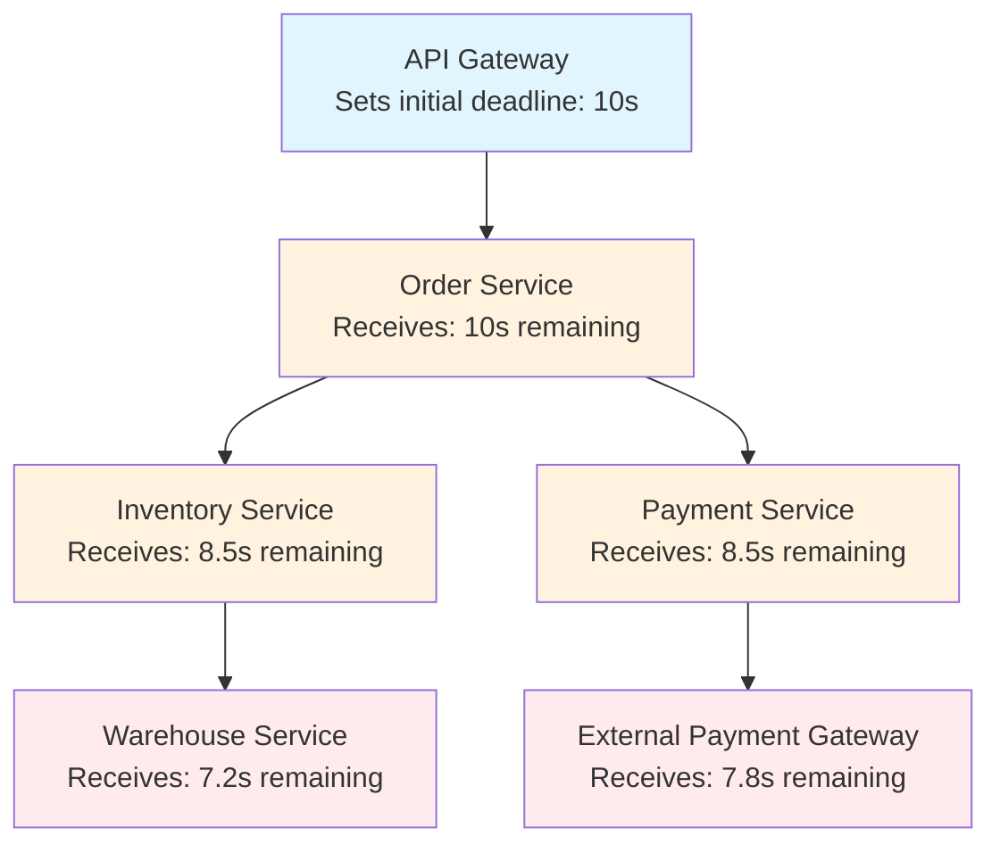
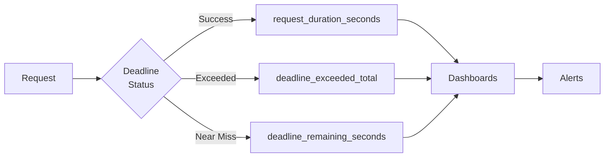

# How to Create gRPC Deadlines Best Practices

Author: [nawazdhandala](https://github.com/nawazdhandala)

Tags: gRPC, Deadlines, Timeouts, Reliability

Description: Learn how to set, propagate, and handle gRPC deadlines to build resilient distributed systems that fail fast and recover gracefully.

---

Deadlines are one of the most important reliability patterns in gRPC. Unlike traditional timeouts that only apply to a single network hop, gRPC deadlines propagate across service boundaries. This means a deadline set by the initial caller travels through your entire microservice chain, ensuring that no downstream service wastes resources on a request that has already timed out at the caller.

This guide covers practical approaches to setting deadlines, propagating them correctly, and handling DEADLINE_EXCEEDED errors in production systems.

---

## Table of Contents

1. Why Deadlines Matter
2. How gRPC Deadlines Work
3. Setting Deadlines in Go
4. Setting Deadlines in Python
5. Deadline Propagation Across Services
6. Handling DEADLINE_EXCEEDED Errors
7. Common Patterns and Anti-Patterns
8. Monitoring Deadline Behavior

---

## 1. Why Deadlines Matter

Without deadlines, a slow or unresponsive downstream service can cause cascading failures. Requests pile up, threads get exhausted, and your entire system grinds to a halt. Deadlines solve this by:

- **Preventing resource exhaustion**: Requests that take too long get cancelled automatically
- **Providing predictable latency**: Users know the maximum wait time for any operation
- **Enabling graceful degradation**: Services can return partial results or fallbacks instead of hanging indefinitely
- **Propagating timeout context**: Every service in the chain knows how much time remains

The key insight is that deadlines are absolute timestamps, not relative durations. When Service A sets a 5-second deadline and calls Service B, Service B receives the actual deadline time. If Service B then calls Service C, Service C also knows the original deadline. No service ever operates with more time than the original caller intended.

---

## 2. How gRPC Deadlines Work

gRPC transmits deadlines via the `grpc-timeout` header. The client converts an absolute deadline into a relative timeout for the wire, and the server reconstructs the absolute deadline on receipt.



Key behaviors:

| Behavior | Description |
|----------|-------------|
| Automatic propagation | The deadline context flows through interceptors without manual work |
| Cancellation signals | When a deadline expires, cancellation propagates to all in-flight calls |
| Clock synchronization | gRPC handles clock skew by using relative timeouts on the wire |
| No extension | A downstream service cannot extend a deadline set by the caller |

---

## 3. Setting Deadlines in Go

Go uses the `context` package to manage deadlines. The context carries the deadline through your entire call stack.

### Basic Deadline Setup

```go
package main

import (
    "context"
    "log"
    "time"

    "google.golang.org/grpc"
    "google.golang.org/grpc/codes"
    "google.golang.org/grpc/status"
    pb "your/proto/package"
)

func main() {
    conn, err := grpc.Dial("localhost:50051", grpc.WithInsecure())
    if err != nil {
        log.Fatalf("failed to connect: %v", err)
    }
    defer conn.Close()

    client := pb.NewYourServiceClient(conn)

    // Create context with 5-second deadline
    ctx, cancel := context.WithTimeout(context.Background(), 5*time.Second)
    defer cancel() // Always call cancel to release resources

    resp, err := client.YourMethod(ctx, &pb.YourRequest{})
    if err != nil {
        if status.Code(err) == codes.DeadlineExceeded {
            log.Println("Request timed out")
            return
        }
        log.Fatalf("RPC failed: %v", err)
    }

    log.Printf("Response: %v", resp)
}
```

### Checking Remaining Time

Before starting expensive operations, check if enough time remains:

```go
func ProcessRequest(ctx context.Context, data *pb.Data) (*pb.Result, error) {
    // Check if deadline is already exceeded
    if ctx.Err() == context.DeadlineExceeded {
        return nil, status.Error(codes.DeadlineExceeded, "deadline already passed")
    }

    // Check remaining time before expensive operation
    deadline, ok := ctx.Deadline()
    if ok {
        remaining := time.Until(deadline)
        if remaining < 100*time.Millisecond {
            return nil, status.Error(codes.DeadlineExceeded, "insufficient time remaining")
        }
        log.Printf("Remaining time: %v", remaining)
    }

    // Proceed with the operation
    return doExpensiveWork(ctx, data)
}
```

### Server-Side Deadline Handling

```go
func (s *server) ProcessOrder(ctx context.Context, req *pb.OrderRequest) (*pb.OrderResponse, error) {
    // The context already contains the client's deadline
    // Check it before starting work
    if err := ctx.Err(); err != nil {
        return nil, status.FromContextError(err).Err()
    }

    // Use the context for downstream calls - deadline propagates automatically
    inventoryResp, err := s.inventoryClient.Reserve(ctx, &pb.ReserveRequest{
        Items: req.Items,
    })
    if err != nil {
        return nil, err
    }

    // Check context again before next operation
    select {
    case <-ctx.Done():
        // Deadline exceeded or cancelled - clean up
        s.inventoryClient.Release(context.Background(), &pb.ReleaseRequest{
            ReservationId: inventoryResp.ReservationId,
        })
        return nil, status.FromContextError(ctx.Err()).Err()
    default:
        // Continue processing
    }

    return &pb.OrderResponse{OrderId: "ord_123"}, nil
}
```

---

## 4. Setting Deadlines in Python

Python gRPC uses the `timeout` parameter for client calls. On the server side, the context object provides deadline information.

### Basic Deadline Setup

```python
import grpc
import time
from your_proto import service_pb2, service_pb2_grpc

def make_request_with_deadline():
    channel = grpc.insecure_channel('localhost:50051')
    stub = service_pb2_grpc.YourServiceStub(channel)

    try:
        # Set a 5-second timeout
        response = stub.YourMethod(
            service_pb2.YourRequest(),
            timeout=5.0  # seconds
        )
        print(f"Response: {response}")
    except grpc.RpcError as e:
        if e.code() == grpc.StatusCode.DEADLINE_EXCEEDED:
            print("Request timed out")
        else:
            print(f"RPC failed: {e.code()}: {e.details()}")

if __name__ == "__main__":
    make_request_with_deadline()
```

### Checking Remaining Time on Server

```python
import grpc
import time
from concurrent import futures

class YourServiceServicer(service_pb2_grpc.YourServiceServicer):
    def ProcessOrder(self, request, context):
        # Check remaining time before expensive operations
        remaining_time = context.time_remaining()

        if remaining_time is None:
            # No deadline set by client
            remaining_time = float('inf')

        if remaining_time < 0.1:  # Less than 100ms remaining
            context.abort(
                grpc.StatusCode.DEADLINE_EXCEEDED,
                "Insufficient time to process request"
            )

        print(f"Remaining time: {remaining_time:.2f}s")

        # Perform work in stages, checking deadline between stages
        result = self._validate_order(request)

        if context.time_remaining() < 0.05:
            context.abort(
                grpc.StatusCode.DEADLINE_EXCEEDED,
                "Deadline exceeded during processing"
            )

        inventory_result = self._reserve_inventory(request, context)

        return service_pb2.OrderResponse(order_id="ord_123")

    def _validate_order(self, request):
        # Validation logic
        time.sleep(0.1)  # Simulate work
        return True

    def _reserve_inventory(self, request, context):
        # Make downstream call with propagated deadline
        # The timeout is automatically derived from remaining time
        inventory_stub = self._get_inventory_stub()

        # Calculate remaining time for downstream call
        remaining = context.time_remaining()
        if remaining and remaining > 0:
            return inventory_stub.Reserve(
                inventory_pb2.ReserveRequest(items=request.items),
                timeout=remaining - 0.01  # Small buffer
            )
        else:
            raise grpc.RpcError("No time remaining")
```

### Using AsyncIO with Deadlines

```python
import asyncio
import grpc.aio

async def make_async_request():
    async with grpc.aio.insecure_channel('localhost:50051') as channel:
        stub = service_pb2_grpc.YourServiceStub(channel)

        try:
            # Set deadline using timeout
            response = await stub.YourMethod(
                service_pb2.YourRequest(),
                timeout=5.0
            )
            print(f"Response: {response}")
        except grpc.aio.AioRpcError as e:
            if e.code() == grpc.StatusCode.DEADLINE_EXCEEDED:
                print("Request timed out")
            else:
                print(f"Error: {e.code()}: {e.details()}")

asyncio.run(make_async_request())
```

---

## 5. Deadline Propagation Across Services

When building microservices, deadlines should flow from the edge through all downstream services. This prevents a single slow service from consuming more time than the original caller allowed.

### Propagation Flow



### Go: Automatic Propagation

In Go, passing the context to downstream calls automatically propagates the deadline:

```go
func (s *orderServer) CreateOrder(ctx context.Context, req *pb.CreateOrderRequest) (*pb.CreateOrderResponse, error) {
    // ctx already contains the deadline from the caller

    // This call inherits the deadline automatically
    inventoryResp, err := s.inventoryClient.CheckAvailability(ctx, &pb.InventoryRequest{
        Sku: req.Sku,
    })
    if err != nil {
        return nil, fmt.Errorf("inventory check failed: %w", err)
    }

    // This call also inherits the same deadline
    paymentResp, err := s.paymentClient.AuthorizePayment(ctx, &pb.PaymentRequest{
        Amount: req.Amount,
    })
    if err != nil {
        return nil, fmt.Errorf("payment auth failed: %w", err)
    }

    return &pb.CreateOrderResponse{
        OrderId: "ord_123",
        Status:  "confirmed",
    }, nil
}
```

### Python: Manual Propagation

Python requires explicitly passing the remaining timeout:

```python
class OrderServiceServicer(order_pb2_grpc.OrderServiceServicer):
    def __init__(self, inventory_stub, payment_stub):
        self.inventory_stub = inventory_stub
        self.payment_stub = payment_stub

    def CreateOrder(self, request, context):
        remaining = context.time_remaining()
        if remaining is None:
            remaining = 30.0  # Default if no deadline set

        # Reserve time for local processing
        buffer = 0.05
        downstream_timeout = max(0.1, remaining - buffer)

        # Propagate deadline to inventory service
        try:
            inventory_resp = self.inventory_stub.CheckAvailability(
                inventory_pb2.InventoryRequest(sku=request.sku),
                timeout=downstream_timeout
            )
        except grpc.RpcError as e:
            if e.code() == grpc.StatusCode.DEADLINE_EXCEEDED:
                context.abort(
                    grpc.StatusCode.DEADLINE_EXCEEDED,
                    "Inventory check timed out"
                )
            raise

        # Recalculate remaining time for payment call
        remaining = context.time_remaining()
        if remaining and remaining > buffer:
            payment_resp = self.payment_stub.Authorize(
                payment_pb2.PaymentRequest(amount=request.amount),
                timeout=remaining - buffer
            )
        else:
            context.abort(
                grpc.StatusCode.DEADLINE_EXCEEDED,
                "Insufficient time for payment processing"
            )

        return order_pb2.CreateOrderResponse(
            order_id="ord_123",
            status="confirmed"
        )
```

### Setting Different Deadlines for Different Operations

Sometimes you need tighter deadlines for certain operations:

```go
func (s *server) ProcessRequest(ctx context.Context, req *pb.Request) (*pb.Response, error) {
    // Original deadline from context
    deadline, _ := ctx.Deadline()

    // Cache lookup should be fast - use a shorter deadline
    cacheCtx, cacheCancel := context.WithTimeout(ctx, 100*time.Millisecond)
    defer cacheCancel()

    cached, err := s.cacheClient.Get(cacheCtx, &pb.CacheKey{Key: req.Id})
    if err == nil {
        return &pb.Response{Data: cached.Value}, nil
    }

    // Cache miss - fall through to database with remaining time
    // Note: we still use the original ctx, which has the original deadline
    dbResp, err := s.dbClient.Query(ctx, &pb.QueryRequest{Id: req.Id})
    if err != nil {
        return nil, err
    }

    return &pb.Response{Data: dbResp.Value}, nil
}
```

---

## 6. Handling DEADLINE_EXCEEDED Errors

When a deadline is exceeded, you need to handle it gracefully. This means cleaning up resources, logging appropriately, and returning useful information to callers.

### Go Error Handling

```go
func handleGRPCError(err error) {
    if err == nil {
        return
    }

    st, ok := status.FromError(err)
    if !ok {
        log.Printf("Non-gRPC error: %v", err)
        return
    }

    switch st.Code() {
    case codes.DeadlineExceeded:
        log.Printf("Deadline exceeded: %s", st.Message())
        // Record metric for deadline exceeded
        deadlineExceededCounter.Inc()
        // Consider returning cached/stale data if appropriate

    case codes.Canceled:
        log.Printf("Request cancelled: %s", st.Message())
        // Client cancelled the request - clean up resources

    case codes.Unavailable:
        log.Printf("Service unavailable: %s", st.Message())
        // Retry with backoff or fail over to another instance

    default:
        log.Printf("RPC error [%s]: %s", st.Code(), st.Message())
    }
}
```

### Python Error Handling

```python
import grpc
from prometheus_client import Counter

deadline_exceeded_total = Counter(
    'grpc_deadline_exceeded_total',
    'Total deadline exceeded errors',
    ['service', 'method']
)

def handle_grpc_error(error, service_name, method_name):
    if not isinstance(error, grpc.RpcError):
        print(f"Non-gRPC error: {error}")
        return

    code = error.code()
    details = error.details()

    if code == grpc.StatusCode.DEADLINE_EXCEEDED:
        print(f"Deadline exceeded: {details}")
        deadline_exceeded_total.labels(
            service=service_name,
            method=method_name
        ).inc()
        # Return cached data or graceful fallback

    elif code == grpc.StatusCode.CANCELLED:
        print(f"Request cancelled: {details}")
        # Clean up any partial work

    elif code == grpc.StatusCode.UNAVAILABLE:
        print(f"Service unavailable: {details}")
        # Implement retry logic

    else:
        print(f"RPC error [{code}]: {details}")
```

### Cleanup on Deadline Exceeded

When a deadline expires mid-operation, you may need to clean up partial work:

```go
func (s *server) CreateOrder(ctx context.Context, req *pb.CreateOrderRequest) (*pb.CreateOrderResponse, error) {
    var reservationId string

    // Step 1: Reserve inventory
    inventoryResp, err := s.inventoryClient.Reserve(ctx, &pb.ReserveRequest{
        Items: req.Items,
    })
    if err != nil {
        return nil, err
    }
    reservationId = inventoryResp.ReservationId

    // Check if deadline was exceeded before payment
    if ctx.Err() == context.DeadlineExceeded {
        // Clean up the reservation using a fresh context
        cleanupCtx, cancel := context.WithTimeout(context.Background(), 5*time.Second)
        defer cancel()
        s.inventoryClient.Release(cleanupCtx, &pb.ReleaseRequest{
            ReservationId: reservationId,
        })
        return nil, status.Error(codes.DeadlineExceeded, "deadline exceeded after inventory reservation")
    }

    // Step 2: Process payment
    paymentResp, err := s.paymentClient.Charge(ctx, &pb.ChargeRequest{
        Amount: req.Amount,
    })
    if err != nil {
        // Payment failed - release inventory
        cleanupCtx, cancel := context.WithTimeout(context.Background(), 5*time.Second)
        defer cancel()
        s.inventoryClient.Release(cleanupCtx, &pb.ReleaseRequest{
            ReservationId: reservationId,
        })
        return nil, err
    }

    return &pb.CreateOrderResponse{
        OrderId:     "ord_123",
        ReservationId: reservationId,
        PaymentId:   paymentResp.PaymentId,
    }, nil
}
```

---

## 7. Common Patterns and Anti-Patterns

### Patterns to Follow

**1. Set deadlines at the edge**

The API gateway or initial entry point should set the deadline. All downstream services inherit and respect it.

```go
// API Gateway handler
func (h *handler) HandleRequest(w http.ResponseWriter, r *http.Request) {
    // Set deadline based on endpoint SLO
    deadline := time.Now().Add(h.endpointSLO)
    ctx, cancel := context.WithDeadline(r.Context(), deadline)
    defer cancel()

    resp, err := h.grpcClient.Process(ctx, &pb.Request{})
    // ...
}
```

**2. Use deadline budgets for multi-step operations**

```go
func (s *server) MultiStepOperation(ctx context.Context, req *pb.Request) (*pb.Response, error) {
    deadline, ok := ctx.Deadline()
    if !ok {
        // No deadline set - apply a default
        var cancel context.CancelFunc
        ctx, cancel = context.WithTimeout(ctx, 30*time.Second)
        defer cancel()
        deadline, _ = ctx.Deadline()
    }

    totalDuration := time.Until(deadline)

    // Budget: 20% for step 1, 60% for step 2, 20% for step 3
    step1Budget := time.Duration(float64(totalDuration) * 0.2)
    step2Budget := time.Duration(float64(totalDuration) * 0.6)
    step3Budget := time.Duration(float64(totalDuration) * 0.2)

    // Execute with budgeted timeouts
    step1Ctx, cancel1 := context.WithTimeout(ctx, step1Budget)
    defer cancel1()
    _, err := s.step1(step1Ctx, req)
    if err != nil {
        return nil, err
    }

    // Continue with remaining steps...
}
```

**3. Add jitter to prevent thundering herd**

```go
func deadlineWithJitter(base time.Duration, jitterPercent float64) time.Duration {
    jitter := time.Duration(float64(base) * jitterPercent * (rand.Float64() - 0.5) * 2)
    return base + jitter
}

// Usage
deadline := deadlineWithJitter(5*time.Second, 0.1) // 5s +/- 10%
ctx, cancel := context.WithTimeout(ctx, deadline)
```

### Anti-Patterns to Avoid

**1. Never ignore the incoming deadline**

```go
// BAD: Ignoring the client's deadline
func (s *server) Process(ctx context.Context, req *pb.Request) (*pb.Response, error) {
    // This creates a new context with a fixed timeout,
    // potentially LONGER than what the client specified
    newCtx, cancel := context.WithTimeout(context.Background(), 30*time.Second)
    defer cancel()
    return s.downstream.Call(newCtx, req) // Client's deadline is lost!
}

// GOOD: Respect the incoming deadline
func (s *server) Process(ctx context.Context, req *pb.Request) (*pb.Response, error) {
    // Deadline is preserved from ctx
    return s.downstream.Call(ctx, req)
}
```

**2. Never set deadlines that are too short**

```go
// BAD: 100ms might not be enough for a database query
ctx, cancel := context.WithTimeout(ctx, 100*time.Millisecond)

// GOOD: Set realistic deadlines based on actual P99 latencies
ctx, cancel := context.WithTimeout(ctx, 2*time.Second)
```

**3. Never forget to cancel contexts**

```go
// BAD: Resource leak
func makeCall() {
    ctx, _ := context.WithTimeout(context.Background(), 5*time.Second)
    client.Call(ctx, req) // Context resources never released
}

// GOOD: Always defer cancel
func makeCall() {
    ctx, cancel := context.WithTimeout(context.Background(), 5*time.Second)
    defer cancel()
    client.Call(ctx, req)
}
```

**4. Never use infinite timeouts in production**

```go
// BAD: No timeout means potential infinite hang
resp, err := client.Call(context.Background(), req)

// GOOD: Always set a reasonable upper bound
ctx, cancel := context.WithTimeout(context.Background(), 30*time.Second)
defer cancel()
resp, err := client.Call(ctx, req)
```

---

## 8. Monitoring Deadline Behavior

Track deadline-related metrics to understand your system's behavior and identify issues before they become outages.

### Key Metrics to Track



### Go Instrumentation

```go
import (
    "github.com/prometheus/client_golang/prometheus"
    "github.com/prometheus/client_golang/prometheus/promauto"
)

var (
    deadlineExceeded = promauto.NewCounterVec(
        prometheus.CounterOpts{
            Name: "grpc_deadline_exceeded_total",
            Help: "Total number of requests that exceeded their deadline",
        },
        []string{"service", "method"},
    )

    deadlineRemaining = promauto.NewHistogramVec(
        prometheus.HistogramOpts{
            Name:    "grpc_deadline_remaining_seconds",
            Help:    "Time remaining when request completed",
            Buckets: []float64{0.001, 0.01, 0.1, 0.5, 1, 2, 5, 10},
        },
        []string{"service", "method"},
    )

    requestDuration = promauto.NewHistogramVec(
        prometheus.HistogramOpts{
            Name:    "grpc_request_duration_seconds",
            Help:    "Request duration in seconds",
            Buckets: prometheus.DefBuckets,
        },
        []string{"service", "method", "status"},
    )
)

func (s *server) Process(ctx context.Context, req *pb.Request) (*pb.Response, error) {
    start := time.Now()

    resp, err := s.doWork(ctx, req)

    duration := time.Since(start).Seconds()
    status := "ok"

    if err != nil {
        if status.Code(err) == codes.DeadlineExceeded {
            status = "deadline_exceeded"
            deadlineExceeded.WithLabelValues("order-service", "Process").Inc()
        } else {
            status = "error"
        }
    }

    requestDuration.WithLabelValues("order-service", "Process", status).Observe(duration)

    // Track remaining deadline time
    if deadline, ok := ctx.Deadline(); ok {
        remaining := time.Until(deadline).Seconds()
        deadlineRemaining.WithLabelValues("order-service", "Process").Observe(remaining)
    }

    return resp, err
}
```

### Python Instrumentation

```python
from prometheus_client import Counter, Histogram
import time

deadline_exceeded = Counter(
    'grpc_deadline_exceeded_total',
    'Requests that exceeded deadline',
    ['service', 'method']
)

deadline_remaining = Histogram(
    'grpc_deadline_remaining_seconds',
    'Time remaining when request completed',
    ['service', 'method'],
    buckets=[0.001, 0.01, 0.1, 0.5, 1, 2, 5, 10]
)

request_duration = Histogram(
    'grpc_request_duration_seconds',
    'Request duration',
    ['service', 'method', 'status']
)

class OrderServiceServicer(order_pb2_grpc.OrderServiceServicer):
    def CreateOrder(self, request, context):
        start = time.time()
        status_label = "ok"

        try:
            result = self._do_work(request, context)

            remaining = context.time_remaining()
            if remaining:
                deadline_remaining.labels(
                    service="order-service",
                    method="CreateOrder"
                ).observe(remaining)

            return result

        except grpc.RpcError as e:
            if e.code() == grpc.StatusCode.DEADLINE_EXCEEDED:
                status_label = "deadline_exceeded"
                deadline_exceeded.labels(
                    service="order-service",
                    method="CreateOrder"
                ).inc()
            else:
                status_label = "error"
            raise

        finally:
            duration = time.time() - start
            request_duration.labels(
                service="order-service",
                method="CreateOrder",
                status=status_label
            ).observe(duration)
```

### Alerting Rules

Create alerts for deadline issues:

```yaml
groups:
  - name: grpc_deadlines
    rules:
      - alert: HighDeadlineExceededRate
        expr: |
          sum(rate(grpc_deadline_exceeded_total[5m])) by (service, method)
          /
          sum(rate(grpc_request_duration_seconds_count[5m])) by (service, method)
          > 0.01
        for: 5m
        labels:
          severity: warning
        annotations:
          summary: "High deadline exceeded rate for {{ $labels.service }}/{{ $labels.method }}"
          description: "More than 1% of requests are exceeding their deadline"

      - alert: DeadlineNearMiss
        expr: |
          histogram_quantile(0.95,
            sum(rate(grpc_deadline_remaining_seconds_bucket[5m])) by (le, service, method)
          ) < 0.1
        for: 10m
        labels:
          severity: warning
        annotations:
          summary: "Requests completing with very little deadline remaining"
          description: "P95 deadline remaining is under 100ms for {{ $labels.service }}/{{ $labels.method }}"
```

---

## Summary

| Practice | Why It Matters |
|----------|----------------|
| Set deadlines at the edge | Ensures consistent timeout behavior across all services |
| Propagate deadlines automatically | Downstream services know exactly how much time remains |
| Check remaining time before expensive ops | Avoid wasting resources on requests that will timeout |
| Handle DEADLINE_EXCEEDED gracefully | Clean up resources and provide useful error messages |
| Monitor deadline metrics | Detect issues before they cause outages |
| Use deadline budgets for multi-step flows | Ensure each step gets appropriate time allocation |

Deadlines are not just about preventing hangs. They are a contract between services about expected response times. When every service respects deadlines and propagates them correctly, your system becomes predictable under load and fails gracefully when things go wrong.

---

*Need visibility into your gRPC deadline behavior? [OneUptime](https://oneuptime.com) provides distributed tracing with automatic deadline tracking, helping you identify timeout issues before they impact users.*
