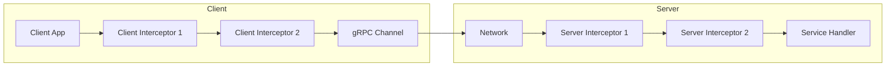
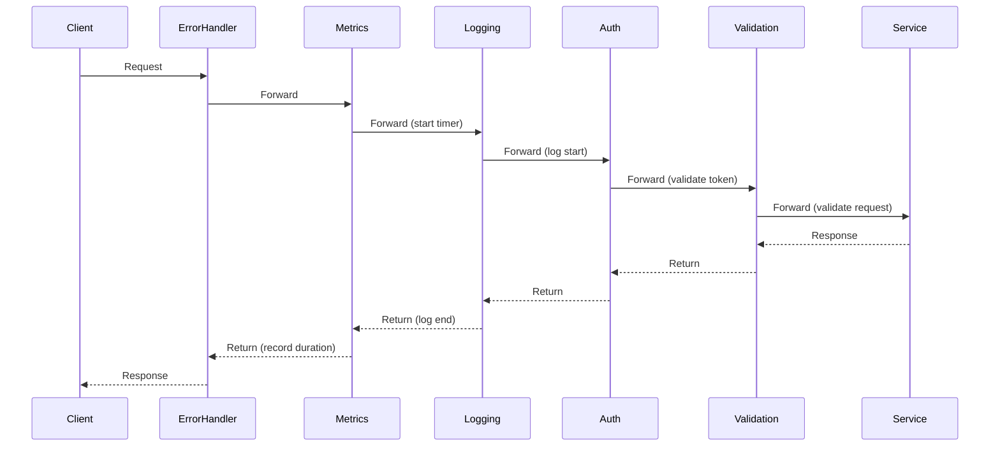
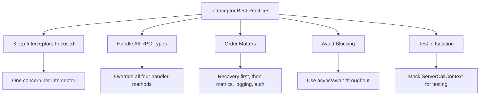

# How to Create Custom gRPC Interceptors in .NET

Author: [nawazdhandala](https://github.com/nawazdhandala)

Tags: .NET, C#, gRPC, Interceptors, Middleware, Logging, Authentication, Observability

Description: Learn how to build production-ready gRPC interceptors in .NET for logging, authentication, metrics, error handling, and request validation. This guide covers both server-side and client-side interceptors with practical examples.

---

gRPC interceptors in .NET work similarly to middleware in ASP.NET Core. They allow you to intercept incoming and outgoing calls to add cross-cutting concerns like logging, authentication, metrics collection, and error handling. Unlike HTTP middleware, gRPC interceptors are specifically designed for the gRPC protocol and provide access to gRPC-specific context like metadata and status codes.

## Understanding the Interceptor Pipeline

Before writing interceptors, it helps to understand how they fit into the request flow. Interceptors execute in a chain, where each interceptor can perform actions before and after the actual RPC handler executes.



## Project Setup

Start by creating a gRPC project or add the required packages to an existing project.

```bash
dotnet new grpc -n GrpcInterceptorDemo
cd GrpcInterceptorDemo
```

For existing projects, ensure you have the gRPC package installed.

```bash
dotnet add package Grpc.AspNetCore
```

## The Interceptor Base Class

All gRPC interceptors in .NET inherit from the `Interceptor` base class. This class provides virtual methods for each RPC type that you can override.

The following code shows the main methods available in the Interceptor class that you can override to handle different RPC patterns.

```csharp
// The Interceptor base class provides these virtual methods
public class Interceptor
{
    // Unary calls (single request, single response)
    public virtual Task<TResponse> UnaryServerHandler<TRequest, TResponse>(
        TRequest request,
        ServerCallContext context,
        UnaryServerMethod<TRequest, TResponse> continuation);

    // Server streaming (single request, stream of responses)
    public virtual Task ServerStreamingServerHandler<TRequest, TResponse>(
        TRequest request,
        IServerStreamWriter<TResponse> responseStream,
        ServerCallContext context,
        ServerStreamingServerMethod<TRequest, TResponse> continuation);

    // Client streaming (stream of requests, single response)
    public virtual Task<TResponse> ClientStreamingServerHandler<TRequest, TResponse>(
        IAsyncStreamReader<TRequest> requestStream,
        ServerCallContext context,
        ClientStreamingServerMethod<TRequest, TResponse> continuation);

    // Bidirectional streaming
    public virtual Task DuplexStreamingServerHandler<TRequest, TResponse>(
        IAsyncStreamReader<TRequest> requestStream,
        IServerStreamWriter<TResponse> responseStream,
        ServerCallContext context,
        DuplexStreamingServerMethod<TRequest, TResponse> continuation);
}
```

## Building a Logging Interceptor

Logging is the most common use case for interceptors. This interceptor logs request details, timing information, and any errors that occur.

The following interceptor captures the method name, execution time, and status code for every gRPC call. It logs at the start and end of each request, making it easy to track request flow through your system.

```csharp
// Interceptors/LoggingInterceptor.cs
using Grpc.Core;
using Grpc.Core.Interceptors;
using System.Diagnostics;

public class LoggingInterceptor : Interceptor
{
    private readonly ILogger<LoggingInterceptor> _logger;

    public LoggingInterceptor(ILogger<LoggingInterceptor> logger)
    {
        _logger = logger;
    }

    // Handle unary (single request/response) calls
    public override async Task<TResponse> UnaryServerHandler<TRequest, TResponse>(
        TRequest request,
        ServerCallContext context,
        UnaryServerMethod<TRequest, TResponse> continuation)
    {
        var method = context.Method;
        var stopwatch = Stopwatch.StartNew();

        _logger.LogInformation(
            "gRPC request started: {Method} from {Peer}",
            method,
            context.Peer);

        try
        {
            // Call the next interceptor or the actual handler
            var response = await continuation(request, context);

            stopwatch.Stop();
            _logger.LogInformation(
                "gRPC request completed: {Method} in {ElapsedMs}ms",
                method,
                stopwatch.ElapsedMilliseconds);

            return response;
        }
        catch (RpcException ex)
        {
            stopwatch.Stop();
            _logger.LogWarning(
                "gRPC request failed: {Method} with status {StatusCode} in {ElapsedMs}ms - {Detail}",
                method,
                ex.StatusCode,
                stopwatch.ElapsedMilliseconds,
                ex.Status.Detail);
            throw;
        }
        catch (Exception ex)
        {
            stopwatch.Stop();
            _logger.LogError(
                ex,
                "gRPC request error: {Method} in {ElapsedMs}ms",
                method,
                stopwatch.ElapsedMilliseconds);
            throw;
        }
    }

    // Handle server streaming calls
    public override async Task ServerStreamingServerHandler<TRequest, TResponse>(
        TRequest request,
        IServerStreamWriter<TResponse> responseStream,
        ServerCallContext context,
        ServerStreamingServerMethod<TRequest, TResponse> continuation)
    {
        var method = context.Method;
        var stopwatch = Stopwatch.StartNew();

        _logger.LogInformation("gRPC server stream started: {Method}", method);

        // Wrap the response stream to count messages
        var wrappedStream = new LoggingServerStreamWriter<TResponse>(
            responseStream,
            _logger,
            method);

        try
        {
            await continuation(request, wrappedStream, context);

            stopwatch.Stop();
            _logger.LogInformation(
                "gRPC server stream completed: {Method} sent {MessageCount} messages in {ElapsedMs}ms",
                method,
                wrappedStream.MessageCount,
                stopwatch.ElapsedMilliseconds);
        }
        catch (Exception ex)
        {
            stopwatch.Stop();
            _logger.LogError(
                ex,
                "gRPC server stream error: {Method} after {MessageCount} messages in {ElapsedMs}ms",
                method,
                wrappedStream.MessageCount,
                stopwatch.ElapsedMilliseconds);
            throw;
        }
    }
}

// Helper class to wrap and monitor the server stream writer
public class LoggingServerStreamWriter<T> : IServerStreamWriter<T>
{
    private readonly IServerStreamWriter<T> _inner;
    private readonly ILogger _logger;
    private readonly string _method;
    private int _messageCount;

    public LoggingServerStreamWriter(
        IServerStreamWriter<T> inner,
        ILogger logger,
        string method)
    {
        _inner = inner;
        _logger = logger;
        _method = method;
    }

    public int MessageCount => _messageCount;

    public WriteOptions? WriteOptions
    {
        get => _inner.WriteOptions;
        set => _inner.WriteOptions = value;
    }

    public async Task WriteAsync(T message)
    {
        await _inner.WriteAsync(message);
        Interlocked.Increment(ref _messageCount);
    }
}
```

## Building an Authentication Interceptor

Authentication interceptors validate tokens from request metadata before allowing the call to proceed. This interceptor extracts JWT tokens from the Authorization header and validates them.

The following code shows how to extract the authorization metadata, validate the JWT token, and attach user claims to the context for use in your service handlers.

```csharp
// Interceptors/AuthenticationInterceptor.cs
using Grpc.Core;
using Grpc.Core.Interceptors;
using Microsoft.IdentityModel.Tokens;
using System.IdentityModel.Tokens.Jwt;
using System.Security.Claims;
using System.Text;

public class AuthenticationInterceptor : Interceptor
{
    private readonly ILogger<AuthenticationInterceptor> _logger;
    private readonly JwtSecurityTokenHandler _tokenHandler;
    private readonly TokenValidationParameters _validationParameters;
    private readonly HashSet<string> _publicMethods;

    public AuthenticationInterceptor(
        ILogger<AuthenticationInterceptor> logger,
        IConfiguration configuration)
    {
        _logger = logger;
        _tokenHandler = new JwtSecurityTokenHandler();

        // Configure token validation
        var secretKey = configuration["Jwt:SecretKey"]
            ?? throw new ArgumentNullException("Jwt:SecretKey is required");

        _validationParameters = new TokenValidationParameters
        {
            ValidateIssuerSigningKey = true,
            IssuerSigningKey = new SymmetricSecurityKey(Encoding.UTF8.GetBytes(secretKey)),
            ValidateIssuer = true,
            ValidIssuer = configuration["Jwt:Issuer"],
            ValidateAudience = true,
            ValidAudience = configuration["Jwt:Audience"],
            ValidateLifetime = true,
            ClockSkew = TimeSpan.FromMinutes(1)
        };

        // Methods that do not require authentication
        _publicMethods = new HashSet<string>
        {
            "/auth.AuthService/Login",
            "/auth.AuthService/Register",
            "/grpc.health.v1.Health/Check"
        };
    }

    public override async Task<TResponse> UnaryServerHandler<TRequest, TResponse>(
        TRequest request,
        ServerCallContext context,
        UnaryServerMethod<TRequest, TResponse> continuation)
    {
        // Skip authentication for public methods
        if (_publicMethods.Contains(context.Method))
        {
            return await continuation(request, context);
        }

        // Validate the token and get claims
        var principal = ValidateToken(context);

        // Store the claims principal for use in handlers
        // Using the UserState property to pass data through the context
        context.UserState["ClaimsPrincipal"] = principal;

        return await continuation(request, context);
    }

    public override async Task ServerStreamingServerHandler<TRequest, TResponse>(
        TRequest request,
        IServerStreamWriter<TResponse> responseStream,
        ServerCallContext context,
        ServerStreamingServerMethod<TRequest, TResponse> continuation)
    {
        if (!_publicMethods.Contains(context.Method))
        {
            var principal = ValidateToken(context);
            context.UserState["ClaimsPrincipal"] = principal;
        }

        await continuation(request, responseStream, context);
    }

    public override async Task<TResponse> ClientStreamingServerHandler<TRequest, TResponse>(
        IAsyncStreamReader<TRequest> requestStream,
        ServerCallContext context,
        ClientStreamingServerMethod<TRequest, TResponse> continuation)
    {
        if (!_publicMethods.Contains(context.Method))
        {
            var principal = ValidateToken(context);
            context.UserState["ClaimsPrincipal"] = principal;
        }

        return await continuation(requestStream, context);
    }

    public override async Task DuplexStreamingServerHandler<TRequest, TResponse>(
        IAsyncStreamReader<TRequest> requestStream,
        IServerStreamWriter<TResponse> responseStream,
        ServerCallContext context,
        DuplexStreamingServerMethod<TRequest, TResponse> continuation)
    {
        if (!_publicMethods.Contains(context.Method))
        {
            var principal = ValidateToken(context);
            context.UserState["ClaimsPrincipal"] = principal;
        }

        await continuation(requestStream, responseStream, context);
    }

    private ClaimsPrincipal ValidateToken(ServerCallContext context)
    {
        // Extract the authorization header from metadata
        var authHeader = context.RequestHeaders.GetValue("authorization");

        if (string.IsNullOrEmpty(authHeader))
        {
            _logger.LogWarning(
                "Missing authorization header for {Method}",
                context.Method);

            throw new RpcException(new Status(
                StatusCode.Unauthenticated,
                "Authorization header is required"));
        }

        // Check for Bearer token format
        if (!authHeader.StartsWith("Bearer ", StringComparison.OrdinalIgnoreCase))
        {
            throw new RpcException(new Status(
                StatusCode.Unauthenticated,
                "Invalid authorization format. Expected: Bearer <token>"));
        }

        var token = authHeader.Substring(7);

        try
        {
            // Validate the JWT token
            var principal = _tokenHandler.ValidateToken(
                token,
                _validationParameters,
                out var validatedToken);

            _logger.LogDebug(
                "Token validated for user {UserId} on {Method}",
                principal.FindFirst(ClaimTypes.NameIdentifier)?.Value,
                context.Method);

            return principal;
        }
        catch (SecurityTokenExpiredException)
        {
            _logger.LogWarning("Expired token for {Method}", context.Method);
            throw new RpcException(new Status(
                StatusCode.Unauthenticated,
                "Token has expired"));
        }
        catch (SecurityTokenException ex)
        {
            _logger.LogWarning(
                "Invalid token for {Method}: {Error}",
                context.Method,
                ex.Message);

            throw new RpcException(new Status(
                StatusCode.Unauthenticated,
                "Invalid token"));
        }
    }
}

// Extension method to retrieve claims from context in your service handlers
public static class ServerCallContextExtensions
{
    public static ClaimsPrincipal? GetClaimsPrincipal(this ServerCallContext context)
    {
        if (context.UserState.TryGetValue("ClaimsPrincipal", out var value))
        {
            return value as ClaimsPrincipal;
        }
        return null;
    }

    public static string? GetUserId(this ServerCallContext context)
    {
        return context.GetClaimsPrincipal()?
            .FindFirst(ClaimTypes.NameIdentifier)?
            .Value;
    }
}
```

## Building a Metrics Interceptor

Metrics interceptors collect data about request counts, latencies, and error rates. This example integrates with the .NET metrics API, which can export to Prometheus, Application Insights, or other backends.

The following interceptor tracks request duration, counts requests by method and status, and monitors concurrent request count for capacity planning.

```csharp
// Interceptors/MetricsInterceptor.cs
using Grpc.Core;
using Grpc.Core.Interceptors;
using System.Diagnostics;
using System.Diagnostics.Metrics;

public class MetricsInterceptor : Interceptor
{
    private readonly Counter<long> _requestCounter;
    private readonly Histogram<double> _requestDuration;
    private readonly UpDownCounter<int> _activeRequests;

    public MetricsInterceptor(IMeterFactory meterFactory)
    {
        var meter = meterFactory.Create("GrpcServer");

        // Count total requests by method and status
        _requestCounter = meter.CreateCounter<long>(
            "grpc.server.requests.total",
            description: "Total number of gRPC requests");

        // Track request duration distribution
        _requestDuration = meter.CreateHistogram<double>(
            "grpc.server.request.duration",
            unit: "ms",
            description: "Duration of gRPC requests in milliseconds");

        // Track currently active requests
        _activeRequests = meter.CreateUpDownCounter<int>(
            "grpc.server.requests.active",
            description: "Number of currently active gRPC requests");
    }

    public override async Task<TResponse> UnaryServerHandler<TRequest, TResponse>(
        TRequest request,
        ServerCallContext context,
        UnaryServerMethod<TRequest, TResponse> continuation)
    {
        var method = ExtractMethodName(context.Method);
        var tags = new TagList { { "method", method } };

        _activeRequests.Add(1, tags);
        var stopwatch = Stopwatch.StartNew();

        try
        {
            var response = await continuation(request, context);

            stopwatch.Stop();
            RecordMetrics(tags, "OK", stopwatch.ElapsedMilliseconds);

            return response;
        }
        catch (RpcException ex)
        {
            stopwatch.Stop();
            RecordMetrics(tags, ex.StatusCode.ToString(), stopwatch.ElapsedMilliseconds);
            throw;
        }
        catch
        {
            stopwatch.Stop();
            RecordMetrics(tags, "INTERNAL", stopwatch.ElapsedMilliseconds);
            throw;
        }
        finally
        {
            _activeRequests.Add(-1, tags);
        }
    }

    public override async Task ServerStreamingServerHandler<TRequest, TResponse>(
        TRequest request,
        IServerStreamWriter<TResponse> responseStream,
        ServerCallContext context,
        ServerStreamingServerMethod<TRequest, TResponse> continuation)
    {
        var method = ExtractMethodName(context.Method);
        var tags = new TagList { { "method", method }, { "type", "server_streaming" } };

        _activeRequests.Add(1, tags);
        var stopwatch = Stopwatch.StartNew();

        try
        {
            await continuation(request, responseStream, context);

            stopwatch.Stop();
            RecordMetrics(tags, "OK", stopwatch.ElapsedMilliseconds);
        }
        catch (RpcException ex)
        {
            stopwatch.Stop();
            RecordMetrics(tags, ex.StatusCode.ToString(), stopwatch.ElapsedMilliseconds);
            throw;
        }
        finally
        {
            _activeRequests.Add(-1, tags);
        }
    }

    private void RecordMetrics(TagList tags, string statusCode, double durationMs)
    {
        tags.Add("status", statusCode);
        _requestCounter.Add(1, tags);
        _requestDuration.Record(durationMs, tags);
    }

    // Extract just the method name from the full path
    private static string ExtractMethodName(string fullMethod)
    {
        var lastSlash = fullMethod.LastIndexOf('/');
        return lastSlash >= 0 ? fullMethod.Substring(lastSlash + 1) : fullMethod;
    }
}
```

## Building an Error Handling Interceptor

Error handling interceptors catch exceptions and convert them to appropriate gRPC status codes. They also prevent internal exception details from leaking to clients in production.

The following interceptor catches all exceptions, logs them with correlation IDs, and returns sanitized error messages to clients while preserving useful error information for debugging.

```csharp
// Interceptors/ErrorHandlingInterceptor.cs
using Grpc.Core;
using Grpc.Core.Interceptors;

public class ErrorHandlingInterceptor : Interceptor
{
    private readonly ILogger<ErrorHandlingInterceptor> _logger;
    private readonly IHostEnvironment _environment;

    public ErrorHandlingInterceptor(
        ILogger<ErrorHandlingInterceptor> logger,
        IHostEnvironment environment)
    {
        _logger = logger;
        _environment = environment;
    }

    public override async Task<TResponse> UnaryServerHandler<TRequest, TResponse>(
        TRequest request,
        ServerCallContext context,
        UnaryServerMethod<TRequest, TResponse> continuation)
    {
        try
        {
            return await continuation(request, context);
        }
        catch (RpcException)
        {
            // RpcExceptions are already properly formatted, just rethrow
            throw;
        }
        catch (Exception ex)
        {
            throw HandleException(ex, context);
        }
    }

    public override async Task ServerStreamingServerHandler<TRequest, TResponse>(
        TRequest request,
        IServerStreamWriter<TResponse> responseStream,
        ServerCallContext context,
        ServerStreamingServerMethod<TRequest, TResponse> continuation)
    {
        try
        {
            await continuation(request, responseStream, context);
        }
        catch (RpcException)
        {
            throw;
        }
        catch (Exception ex)
        {
            throw HandleException(ex, context);
        }
    }

    public override async Task<TResponse> ClientStreamingServerHandler<TRequest, TResponse>(
        IAsyncStreamReader<TRequest> requestStream,
        ServerCallContext context,
        ClientStreamingServerMethod<TRequest, TResponse> continuation)
    {
        try
        {
            return await continuation(requestStream, context);
        }
        catch (RpcException)
        {
            throw;
        }
        catch (Exception ex)
        {
            throw HandleException(ex, context);
        }
    }

    public override async Task DuplexStreamingServerHandler<TRequest, TResponse>(
        IAsyncStreamReader<TRequest> requestStream,
        IServerStreamWriter<TResponse> responseStream,
        ServerCallContext context,
        DuplexStreamingServerMethod<TRequest, TResponse> continuation)
    {
        try
        {
            await continuation(requestStream, responseStream, context);
        }
        catch (RpcException)
        {
            throw;
        }
        catch (Exception ex)
        {
            throw HandleException(ex, context);
        }
    }

    private RpcException HandleException(Exception ex, ServerCallContext context)
    {
        // Generate a correlation ID for tracking
        var correlationId = Guid.NewGuid().ToString("N")[..8];

        // Log the full exception with correlation ID
        _logger.LogError(
            ex,
            "Unhandled exception in {Method}. CorrelationId: {CorrelationId}",
            context.Method,
            correlationId);

        // Map exception types to gRPC status codes
        var (statusCode, message) = ex switch
        {
            ArgumentException argEx =>
                (StatusCode.InvalidArgument, argEx.Message),

            KeyNotFoundException =>
                (StatusCode.NotFound, "The requested resource was not found"),

            UnauthorizedAccessException =>
                (StatusCode.PermissionDenied, "Access denied"),

            NotImplementedException =>
                (StatusCode.Unimplemented, "This operation is not implemented"),

            TimeoutException =>
                (StatusCode.DeadlineExceeded, "The operation timed out"),

            OperationCanceledException =>
                (StatusCode.Cancelled, "The operation was cancelled"),

            InvalidOperationException invalidOp =>
                (StatusCode.FailedPrecondition, invalidOp.Message),

            _ => (StatusCode.Internal, GetErrorMessage(correlationId))
        };

        // Add correlation ID to response metadata for client-side tracking
        context.ResponseTrailers.Add("x-correlation-id", correlationId);

        return new RpcException(new Status(statusCode, message));
    }

    private string GetErrorMessage(string correlationId)
    {
        // In development, you might want more details
        if (_environment.IsDevelopment())
        {
            return $"An internal error occurred. CorrelationId: {correlationId}";
        }

        // In production, return a generic message
        return $"An internal error occurred. Reference: {correlationId}";
    }
}
```

## Building a Request Validation Interceptor

Validation interceptors check that requests meet business rules before processing. This interceptor uses a validation service to validate incoming requests.

The following code shows how to create a validation interceptor that works with FluentValidation or any other validation library. It validates requests before they reach your service handlers.

```csharp
// Interceptors/ValidationInterceptor.cs
using FluentValidation;
using Grpc.Core;
using Grpc.Core.Interceptors;

public class ValidationInterceptor : Interceptor
{
    private readonly IServiceProvider _serviceProvider;
    private readonly ILogger<ValidationInterceptor> _logger;

    public ValidationInterceptor(
        IServiceProvider serviceProvider,
        ILogger<ValidationInterceptor> logger)
    {
        _serviceProvider = serviceProvider;
        _logger = logger;
    }

    public override async Task<TResponse> UnaryServerHandler<TRequest, TResponse>(
        TRequest request,
        ServerCallContext context,
        UnaryServerMethod<TRequest, TResponse> continuation)
    {
        // Try to find a validator for this request type
        var validator = _serviceProvider.GetService<IValidator<TRequest>>();

        if (validator != null)
        {
            var validationResult = await validator.ValidateAsync(request);

            if (!validationResult.IsValid)
            {
                _logger.LogWarning(
                    "Validation failed for {Method}: {Errors}",
                    context.Method,
                    string.Join(", ", validationResult.Errors.Select(e => e.ErrorMessage)));

                // Build detailed error message
                var errorDetails = string.Join("; ",
                    validationResult.Errors.Select(e => $"{e.PropertyName}: {e.ErrorMessage}"));

                throw new RpcException(new Status(
                    StatusCode.InvalidArgument,
                    $"Validation failed: {errorDetails}"));
            }
        }

        return await continuation(request, context);
    }
}

// Example validator for a CreateProductRequest
public class CreateProductRequestValidator : AbstractValidator<CreateProductRequest>
{
    public CreateProductRequestValidator()
    {
        RuleFor(x => x.Name)
            .NotEmpty().WithMessage("Product name is required")
            .MaximumLength(200).WithMessage("Product name cannot exceed 200 characters");

        RuleFor(x => x.Price)
            .GreaterThan(0).WithMessage("Price must be greater than zero");

        RuleFor(x => x.Category)
            .NotEmpty().WithMessage("Category is required");

        RuleFor(x => x.StockQuantity)
            .GreaterThanOrEqualTo(0).WithMessage("Stock quantity cannot be negative");
    }
}
```

## Building Client-Side Interceptors

Client interceptors are useful for adding authentication headers, logging outgoing calls, or implementing retry logic.

The following interceptor automatically attaches JWT tokens to outgoing requests and handles token refresh when tokens expire.

```csharp
// Interceptors/ClientAuthInterceptor.cs
using Grpc.Core;
using Grpc.Core.Interceptors;

public class ClientAuthInterceptor : Interceptor
{
    private readonly ITokenProvider _tokenProvider;
    private readonly ILogger<ClientAuthInterceptor> _logger;

    public ClientAuthInterceptor(
        ITokenProvider tokenProvider,
        ILogger<ClientAuthInterceptor> logger)
    {
        _tokenProvider = tokenProvider;
        _logger = logger;
    }

    public override AsyncUnaryCall<TResponse> AsyncUnaryCall<TRequest, TResponse>(
        TRequest request,
        ClientInterceptorContext<TRequest, TResponse> context,
        AsyncUnaryCallContinuation<TRequest, TResponse> continuation)
    {
        // Add authorization header to the call
        var headers = context.Options.Headers ?? new Metadata();
        var token = _tokenProvider.GetToken();

        if (!string.IsNullOrEmpty(token))
        {
            headers.Add("authorization", $"Bearer {token}");
        }

        // Create new context with updated headers
        var newOptions = context.Options.WithHeaders(headers);
        var newContext = new ClientInterceptorContext<TRequest, TResponse>(
            context.Method,
            context.Host,
            newOptions);

        _logger.LogDebug(
            "Calling {Method} with auth token",
            context.Method.FullName);

        return continuation(request, newContext);
    }

    // Handle streaming calls similarly
    public override AsyncClientStreamingCall<TRequest, TResponse> AsyncClientStreamingCall<TRequest, TResponse>(
        ClientInterceptorContext<TRequest, TResponse> context,
        AsyncClientStreamingCallContinuation<TRequest, TResponse> continuation)
    {
        var headers = context.Options.Headers ?? new Metadata();
        var token = _tokenProvider.GetToken();

        if (!string.IsNullOrEmpty(token))
        {
            headers.Add("authorization", $"Bearer {token}");
        }

        var newOptions = context.Options.WithHeaders(headers);
        var newContext = new ClientInterceptorContext<TRequest, TResponse>(
            context.Method,
            context.Host,
            newOptions);

        return continuation(newContext);
    }

    public override AsyncServerStreamingCall<TResponse> AsyncServerStreamingCall<TRequest, TResponse>(
        TRequest request,
        ClientInterceptorContext<TRequest, TResponse> context,
        AsyncServerStreamingCallContinuation<TRequest, TResponse> continuation)
    {
        var headers = context.Options.Headers ?? new Metadata();
        var token = _tokenProvider.GetToken();

        if (!string.IsNullOrEmpty(token))
        {
            headers.Add("authorization", $"Bearer {token}");
        }

        var newOptions = context.Options.WithHeaders(headers);
        var newContext = new ClientInterceptorContext<TRequest, TResponse>(
            context.Method,
            context.Host,
            newOptions);

        return continuation(request, newContext);
    }

    public override AsyncDuplexStreamingCall<TRequest, TResponse> AsyncDuplexStreamingCall<TRequest, TResponse>(
        ClientInterceptorContext<TRequest, TResponse> context,
        AsyncDuplexStreamingCallContinuation<TRequest, TResponse> continuation)
    {
        var headers = context.Options.Headers ?? new Metadata();
        var token = _tokenProvider.GetToken();

        if (!string.IsNullOrEmpty(token))
        {
            headers.Add("authorization", $"Bearer {token}");
        }

        var newOptions = context.Options.WithHeaders(headers);
        var newContext = new ClientInterceptorContext<TRequest, TResponse>(
            context.Method,
            context.Host,
            newOptions);

        return continuation(newContext);
    }
}

// Token provider interface for dependency injection
public interface ITokenProvider
{
    string? GetToken();
    Task<string> RefreshTokenAsync();
}
```

## Client-Side Logging Interceptor

This interceptor logs all outgoing gRPC calls on the client side, which helps with debugging and monitoring client behavior.

```csharp
// Interceptors/ClientLoggingInterceptor.cs
using Grpc.Core;
using Grpc.Core.Interceptors;
using System.Diagnostics;

public class ClientLoggingInterceptor : Interceptor
{
    private readonly ILogger<ClientLoggingInterceptor> _logger;

    public ClientLoggingInterceptor(ILogger<ClientLoggingInterceptor> logger)
    {
        _logger = logger;
    }

    public override AsyncUnaryCall<TResponse> AsyncUnaryCall<TRequest, TResponse>(
        TRequest request,
        ClientInterceptorContext<TRequest, TResponse> context,
        AsyncUnaryCallContinuation<TRequest, TResponse> continuation)
    {
        var method = context.Method.FullName;
        var stopwatch = Stopwatch.StartNew();

        _logger.LogInformation("gRPC client call started: {Method}", method);

        var call = continuation(request, context);

        // Wrap the response to log completion
        return new AsyncUnaryCall<TResponse>(
            HandleResponse(call.ResponseAsync, method, stopwatch),
            call.ResponseHeadersAsync,
            call.GetStatus,
            call.GetTrailers,
            call.Dispose);
    }

    private async Task<TResponse> HandleResponse<TResponse>(
        Task<TResponse> responseTask,
        string method,
        Stopwatch stopwatch)
    {
        try
        {
            var response = await responseTask;

            stopwatch.Stop();
            _logger.LogInformation(
                "gRPC client call completed: {Method} in {ElapsedMs}ms",
                method,
                stopwatch.ElapsedMilliseconds);

            return response;
        }
        catch (RpcException ex)
        {
            stopwatch.Stop();
            _logger.LogWarning(
                "gRPC client call failed: {Method} with {StatusCode} in {ElapsedMs}ms",
                method,
                ex.StatusCode,
                stopwatch.ElapsedMilliseconds);
            throw;
        }
    }
}
```

## Registering Interceptors

Once you have created your interceptors, you need to register them with the gRPC server or client. The order of registration matters because interceptors execute in order.

### Server-Side Registration

The following code shows how to register interceptors on the server. Interceptors execute in the order they are added, so put recovery and metrics first, then logging, then authentication.

```csharp
// Program.cs
var builder = WebApplication.CreateBuilder(args);

// Register interceptor dependencies
builder.Services.AddSingleton<IMeterFactory, MeterFactory>();

// Add gRPC with interceptors
builder.Services.AddGrpc(options =>
{
    // Enable detailed errors in development
    options.EnableDetailedErrors = builder.Environment.IsDevelopment();

    // Add interceptors in order of execution
    // Recovery should be first to catch panics from other interceptors
    options.Interceptors.Add<ErrorHandlingInterceptor>();

    // Metrics should be early to capture all requests
    options.Interceptors.Add<MetricsInterceptor>();

    // Logging comes next
    options.Interceptors.Add<LoggingInterceptor>();

    // Authentication after logging so failed auth attempts are logged
    options.Interceptors.Add<AuthenticationInterceptor>();

    // Validation last, only runs for authenticated requests
    options.Interceptors.Add<ValidationInterceptor>();
});

// Register FluentValidation validators
builder.Services.AddValidatorsFromAssemblyContaining<Program>();

var app = builder.Build();

app.MapGrpcService<ProductCatalogService>();
app.MapGrpcReflectionService();

app.Run();
```

### Client-Side Registration

For clients, you can register interceptors when creating the channel or when creating the client.

```csharp
// Creating a client with interceptors
var channel = GrpcChannel.ForAddress("https://localhost:5001");

// Create interceptors
var authInterceptor = new ClientAuthInterceptor(tokenProvider, logger);
var loggingInterceptor = new ClientLoggingInterceptor(logger);

// Apply interceptors to the channel
var invoker = channel.Intercept(loggingInterceptor).Intercept(authInterceptor);

// Create the client with intercepted invoker
var client = new ProductCatalog.ProductCatalogClient(invoker);
```

For dependency injection in ASP.NET Core clients, use the gRPC client factory.

```csharp
// Program.cs (Client application)
builder.Services.AddSingleton<ITokenProvider, TokenProvider>();

builder.Services
    .AddGrpcClient<ProductCatalog.ProductCatalogClient>(options =>
    {
        options.Address = new Uri("https://localhost:5001");
    })
    .AddInterceptor<ClientLoggingInterceptor>()
    .AddInterceptor<ClientAuthInterceptor>();
```

## Interceptor Execution Order

Understanding the execution order is important for correct behavior. On the server side, interceptors execute in the order they are registered for the request, and in reverse order for the response.



## Testing Interceptors

Testing interceptors in isolation helps ensure they work correctly. Here is an example of testing the authentication interceptor.

```csharp
// Tests/AuthenticationInterceptorTests.cs
using Grpc.Core;
using Grpc.Core.Testing;
using Microsoft.Extensions.Configuration;
using Microsoft.Extensions.Logging.Abstractions;
using Xunit;

public class AuthenticationInterceptorTests
{
    private readonly AuthenticationInterceptor _interceptor;

    public AuthenticationInterceptorTests()
    {
        var config = new ConfigurationBuilder()
            .AddInMemoryCollection(new Dictionary<string, string?>
            {
                ["Jwt:SecretKey"] = "your-256-bit-secret-key-here-for-testing",
                ["Jwt:Issuer"] = "test-issuer",
                ["Jwt:Audience"] = "test-audience"
            })
            .Build();

        _interceptor = new AuthenticationInterceptor(
            NullLogger<AuthenticationInterceptor>.Instance,
            config);
    }

    [Fact]
    public async Task PublicMethod_ShouldNotRequireAuth()
    {
        // Arrange
        var context = CreateMockContext("/grpc.health.v1.Health/Check");
        var handlerCalled = false;

        Task<string> Handler(string request, ServerCallContext ctx)
        {
            handlerCalled = true;
            return Task.FromResult("OK");
        }

        // Act
        var result = await _interceptor.UnaryServerHandler(
            "test",
            context,
            Handler);

        // Assert
        Assert.True(handlerCalled);
        Assert.Equal("OK", result);
    }

    [Fact]
    public async Task ProtectedMethod_WithoutToken_ShouldThrow()
    {
        // Arrange
        var context = CreateMockContext("/products.ProductService/GetProduct");

        Task<string> Handler(string request, ServerCallContext ctx)
        {
            return Task.FromResult("OK");
        }

        // Act and Assert
        var exception = await Assert.ThrowsAsync<RpcException>(() =>
            _interceptor.UnaryServerHandler("test", context, Handler));

        Assert.Equal(StatusCode.Unauthenticated, exception.StatusCode);
    }

    [Fact]
    public async Task ProtectedMethod_WithValidToken_ShouldSucceed()
    {
        // Arrange
        var token = GenerateValidToken();
        var context = CreateMockContext(
            "/products.ProductService/GetProduct",
            new Metadata { { "authorization", $"Bearer {token}" } });

        var handlerCalled = false;

        Task<string> Handler(string request, ServerCallContext ctx)
        {
            handlerCalled = true;
            // Verify claims were attached
            var userId = ctx.GetUserId();
            Assert.NotNull(userId);
            return Task.FromResult("OK");
        }

        // Act
        var result = await _interceptor.UnaryServerHandler(
            "test",
            context,
            Handler);

        // Assert
        Assert.True(handlerCalled);
    }

    private static ServerCallContext CreateMockContext(
        string method,
        Metadata? headers = null)
    {
        return TestServerCallContext.Create(
            method: method,
            host: "localhost",
            deadline: DateTime.UtcNow.AddMinutes(1),
            requestHeaders: headers ?? new Metadata(),
            cancellationToken: CancellationToken.None,
            peer: "127.0.0.1",
            authContext: null,
            contextPropagationToken: null,
            writeHeadersFunc: _ => Task.CompletedTask,
            writeOptionsGetter: () => new WriteOptions(),
            writeOptionsSetter: _ => { });
    }

    private string GenerateValidToken()
    {
        // Generate a valid JWT for testing
        // Implementation depends on your token generation logic
        return "valid-jwt-token";
    }
}
```

## Best Practices

When building gRPC interceptors, keep these guidelines in mind for maintainable and performant code.



### Key Recommendations

1. **Single Responsibility**: Each interceptor should handle one concern. Do not mix logging and authentication in the same interceptor.

2. **Handle All RPC Types**: If your interceptor applies to all calls, override all four handler methods (unary, server streaming, client streaming, and duplex streaming).

3. **Order Interceptors Correctly**: Error handling and metrics should come first, followed by logging, then authentication, and finally validation.

4. **Use Async Properly**: Always use async/await and avoid blocking calls that could affect throughput.

5. **Do Not Swallow Exceptions**: Let RpcExceptions propagate. Only catch and convert regular exceptions to RpcExceptions.

6. **Avoid Heavy Processing**: Interceptors run on every request. Keep them lightweight and defer heavy work to background services.

7. **Use Dependency Injection**: Register interceptors as services to take advantage of DI for loggers, configuration, and other dependencies.

## Summary

gRPC interceptors in .NET provide a clean way to implement cross-cutting concerns without cluttering your service code. By building focused interceptors for logging, authentication, metrics, error handling, and validation, you can create a robust pipeline that handles common requirements consistently across all your gRPC services.

The key points to remember:

- Interceptors inherit from the `Interceptor` base class and override handler methods
- Server interceptors process incoming requests; client interceptors process outgoing requests
- Registration order determines execution order
- Each interceptor should focus on a single concern
- Test interceptors independently using mock contexts

With these patterns, you can build production-ready gRPC services that are observable, secure, and maintainable.
