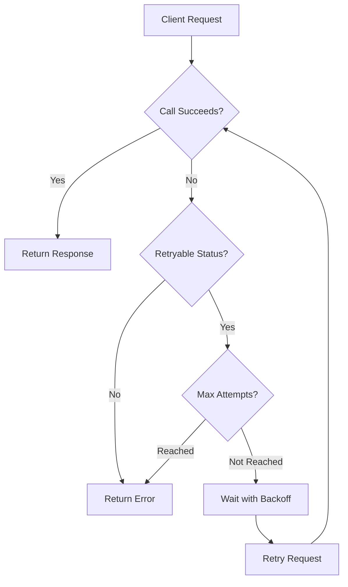
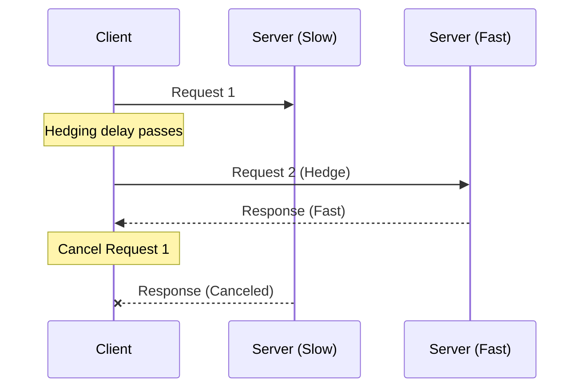

# How to Implement gRPC Retry Policies

Author: [nawazdhandala](https://www.github.com/nawazdhandala)

Tags: gRPC, Retry, Resilience, Microservices, Networking

Description: Configure gRPC retry policies with exponential backoff, hedging, and circuit breaking for resilient service-to-service communication.

---

Building reliable distributed systems means accepting that failures will happen. Network blips, service restarts, and temporary overloads are part of daily operations. gRPC provides built-in retry policies that help your services recover gracefully from transient failures without writing complex retry logic in every client.

This guide walks through configuring gRPC retry policies, from basic configuration to advanced patterns like hedging and combining retries with circuit breakers.

## How gRPC Retry Policies Work

gRPC implements retry policies at the client level through service configuration. When a call fails with a retryable status code, the client automatically retries based on your policy settings.



The key components of a retry policy include:

- **maxAttempts**: Total number of attempts including the original request
- **initialBackoff**: Starting delay before the first retry
- **maxBackoff**: Maximum delay cap for backoff
- **backoffMultiplier**: Factor to multiply backoff after each retry
- **retryableStatusCodes**: Which gRPC status codes trigger a retry

## Basic Retry Policy Configuration

The simplest way to configure retries is through the service config JSON. Here is a Go example that sets up a basic retry policy.

```go
package main

import (
    "context"
    "log"
    "time"

    "google.golang.org/grpc"
    "google.golang.org/grpc/credentials/insecure"
    pb "myapp/proto"
)

func main() {
    // Define the retry policy as a service config JSON string
    // This policy retries up to 4 times with exponential backoff
    serviceConfig := `{
        "methodConfig": [{
            "name": [{"service": "orders.OrderService"}],
            "retryPolicy": {
                "maxAttempts": 4,
                "initialBackoff": "0.1s",
                "maxBackoff": "1s",
                "backoffMultiplier": 2.0,
                "retryableStatusCodes": ["UNAVAILABLE", "RESOURCE_EXHAUSTED"]
            }
        }]
    }`

    // Create the connection with the retry policy
    conn, err := grpc.Dial(
        "localhost:50051",
        grpc.WithTransportCredentials(insecure.NewCredentials()),
        grpc.WithDefaultServiceConfig(serviceConfig),
    )
    if err != nil {
        log.Fatalf("failed to connect: %v", err)
    }
    defer conn.Close()

    client := pb.NewOrderServiceClient(conn)

    // Calls will now automatically retry on UNAVAILABLE or RESOURCE_EXHAUSTED
    ctx, cancel := context.WithTimeout(context.Background(), 10*time.Second)
    defer cancel()

    resp, err := client.GetOrder(ctx, &pb.GetOrderRequest{OrderId: "12345"})
    if err != nil {
        log.Printf("request failed after retries: %v", err)
        return
    }
    log.Printf("order: %v", resp)
}
```

## Python Client with Retry Policy

Python gRPC clients support the same service config format. Here is how to configure retries in a Python application.

```python
import grpc
import json
import orders_pb2
import orders_pb2_grpc

def create_channel_with_retry():
    """Create a gRPC channel with retry policy configured."""

    # Define retry policy for the orders service
    # Retries on UNAVAILABLE (14) and RESOURCE_EXHAUSTED (8)
    service_config = {
        "methodConfig": [{
            "name": [{"service": "orders.OrderService"}],
            "retryPolicy": {
                "maxAttempts": 4,
                "initialBackoff": "0.1s",
                "maxBackoff": "1s",
                "backoffMultiplier": 2.0,
                "retryableStatusCodes": ["UNAVAILABLE", "RESOURCE_EXHAUSTED"]
            }
        }]
    }

    # Convert to JSON string for the channel option
    service_config_json = json.dumps(service_config)

    # Create channel with retry configuration
    channel = grpc.insecure_channel(
        "localhost:50051",
        options=[("grpc.service_config", service_config_json)]
    )

    return channel


def main():
    channel = create_channel_with_retry()
    stub = orders_pb2_grpc.OrderServiceStub(channel)

    try:
        # This call will automatically retry on transient failures
        response = stub.GetOrder(
            orders_pb2.GetOrderRequest(order_id="12345"),
            timeout=10.0
        )
        print(f"Order: {response}")
    except grpc.RpcError as e:
        print(f"Request failed: {e.code()} - {e.details()}")
    finally:
        channel.close()


if __name__ == "__main__":
    main()
```

## Hedging Policies for Latency-Sensitive Services

Hedging is an alternative to retries that sends multiple requests in parallel without waiting for failures. This approach reduces tail latency by racing requests against each other.



Here is how to configure hedging in Go.

```go
package main

import (
    "google.golang.org/grpc"
    "google.golang.org/grpc/credentials/insecure"
)

func createHedgingChannel() (*grpc.ClientConn, error) {
    // Hedging policy sends up to 3 requests
    // A new hedge is sent every 500ms if no response received
    serviceConfig := `{
        "methodConfig": [{
            "name": [{"service": "search.SearchService", "method": "Search"}],
            "hedgingPolicy": {
                "maxAttempts": 3,
                "hedgingDelay": "0.5s",
                "nonFatalStatusCodes": ["UNAVAILABLE", "ABORTED"]
            }
        }]
    }`

    return grpc.Dial(
        "localhost:50051",
        grpc.WithTransportCredentials(insecure.NewCredentials()),
        grpc.WithDefaultServiceConfig(serviceConfig),
    )
}
```

Hedging works best for read-only operations where duplicate requests are safe. Avoid hedging for operations that modify state unless your server handles idempotency.

## Combining Retries with Circuit Breakers

Retry policies help with transient failures, but they can make things worse during sustained outages. Circuit breakers prevent retry storms by stopping requests when a service is clearly unhealthy.

```go
package main

import (
    "context"
    "errors"
    "sync"
    "time"

    "google.golang.org/grpc"
    "google.golang.org/grpc/codes"
    "google.golang.org/grpc/status"
)

// CircuitBreaker prevents cascading failures during outages
type CircuitBreaker struct {
    mu              sync.Mutex
    failures        int
    lastFailure     time.Time
    state           string // "closed", "open", "half-open"
    failureThreshold int
    resetTimeout    time.Duration
}

// NewCircuitBreaker creates a circuit breaker with sensible defaults
func NewCircuitBreaker() *CircuitBreaker {
    return &CircuitBreaker{
        state:            "closed",
        failureThreshold: 5,
        resetTimeout:     30 * time.Second,
    }
}

// Allow checks if requests should be permitted
func (cb *CircuitBreaker) Allow() bool {
    cb.mu.Lock()
    defer cb.mu.Unlock()

    switch cb.state {
    case "open":
        // Check if enough time passed to try again
        if time.Since(cb.lastFailure) > cb.resetTimeout {
            cb.state = "half-open"
            return true
        }
        return false
    case "half-open":
        // Allow one request through to test the service
        return true
    default:
        return true
    }
}

// RecordSuccess marks a successful request
func (cb *CircuitBreaker) RecordSuccess() {
    cb.mu.Lock()
    defer cb.mu.Unlock()
    cb.failures = 0
    cb.state = "closed"
}

// RecordFailure marks a failed request
func (cb *CircuitBreaker) RecordFailure() {
    cb.mu.Lock()
    defer cb.mu.Unlock()

    cb.failures++
    cb.lastFailure = time.Now()

    if cb.failures >= cb.failureThreshold {
        cb.state = "open"
    }
}

// CircuitBreakerInterceptor wraps gRPC calls with circuit breaker logic
func CircuitBreakerInterceptor(cb *CircuitBreaker) grpc.UnaryClientInterceptor {
    return func(
        ctx context.Context,
        method string,
        req, reply interface{},
        cc *grpc.ClientConn,
        invoker grpc.UnaryInvoker,
        opts ...grpc.CallOption,
    ) error {
        // Check if circuit breaker allows the request
        if !cb.Allow() {
            return status.Error(codes.Unavailable, "circuit breaker open")
        }

        // Make the actual call (retries happen inside invoker)
        err := invoker(ctx, method, req, reply, cc, opts...)

        // Update circuit breaker based on result
        if err != nil {
            st, ok := status.FromError(err)
            if ok && (st.Code() == codes.Unavailable || st.Code() == codes.DeadlineExceeded) {
                cb.RecordFailure()
            }
        } else {
            cb.RecordSuccess()
        }

        return err
    }
}
```

## Per-Method Retry Configuration

Different methods may need different retry strategies. Read operations can be retried aggressively, while write operations need more caution.

```go
// Configure different retry policies for different methods
serviceConfig := `{
    "methodConfig": [
        {
            "name": [{"service": "inventory.InventoryService", "method": "GetStock"}],
            "retryPolicy": {
                "maxAttempts": 5,
                "initialBackoff": "0.05s",
                "maxBackoff": "0.5s",
                "backoffMultiplier": 2.0,
                "retryableStatusCodes": ["UNAVAILABLE", "RESOURCE_EXHAUSTED", "ABORTED"]
            }
        },
        {
            "name": [{"service": "inventory.InventoryService", "method": "ReserveStock"}],
            "retryPolicy": {
                "maxAttempts": 2,
                "initialBackoff": "0.1s",
                "maxBackoff": "0.2s",
                "backoffMultiplier": 1.5,
                "retryableStatusCodes": ["UNAVAILABLE"]
            }
        }
    ]
}`
```

## Retry Budgets to Prevent Storms

Retry budgets limit the total number of retries across all requests to prevent overwhelming a struggling service.

```go
package main

import (
    "sync/atomic"
    "time"
)

// RetryBudget limits total retries to prevent storms
type RetryBudget struct {
    tokens       int64
    maxTokens    int64
    refillRate   int64  // tokens per second
    lastRefill   int64  // unix nano
}

// NewRetryBudget creates a budget that allows 10% extra requests as retries
func NewRetryBudget(requestsPerSecond int64) *RetryBudget {
    maxTokens := requestsPerSecond / 10 // 10% budget
    if maxTokens < 10 {
        maxTokens = 10 // minimum budget
    }

    return &RetryBudget{
        tokens:     maxTokens,
        maxTokens:  maxTokens,
        refillRate: maxTokens,
        lastRefill: time.Now().UnixNano(),
    }
}

// TryAcquire attempts to get a retry token
func (rb *RetryBudget) TryAcquire() bool {
    // Refill tokens based on time elapsed
    now := time.Now().UnixNano()
    last := atomic.LoadInt64(&rb.lastRefill)
    elapsed := float64(now-last) / float64(time.Second)

    if elapsed > 0.1 { // refill every 100ms
        refill := int64(elapsed * float64(rb.refillRate))
        current := atomic.LoadInt64(&rb.tokens)
        newTokens := current + refill
        if newTokens > rb.maxTokens {
            newTokens = rb.maxTokens
        }
        atomic.StoreInt64(&rb.tokens, newTokens)
        atomic.StoreInt64(&rb.lastRefill, now)
    }

    // Try to acquire a token
    for {
        current := atomic.LoadInt64(&rb.tokens)
        if current <= 0 {
            return false
        }
        if atomic.CompareAndSwapInt64(&rb.tokens, current, current-1) {
            return true
        }
    }
}
```

## Best Practices

When implementing retry policies, keep these guidelines in mind:

**Choose retryable status codes carefully.** Only retry on transient errors like UNAVAILABLE or RESOURCE_EXHAUSTED. Never retry on INVALID_ARGUMENT or PERMISSION_DENIED.

**Set appropriate timeouts.** Your overall timeout must be long enough to accommodate the maximum number of retries plus backoff delays.

**Use idempotency keys for mutations.** If you retry write operations, ensure your server can detect and deduplicate repeated requests.

**Monitor retry rates.** High retry rates indicate underlying issues. Track retry metrics in your observability platform.

**Start conservative.** Begin with lower maxAttempts and increase based on observed behavior in production.

## Conclusion

gRPC retry policies provide a powerful mechanism for handling transient failures without cluttering your application code. By combining built-in retry configuration with patterns like circuit breakers and retry budgets, you can build services that remain resilient under adverse conditions while protecting against cascading failures.

The key is finding the right balance. Too few retries and legitimate transient errors cause unnecessary failures. Too many retries and you risk overwhelming an already struggling service. Monitor your retry metrics and adjust your policies based on real-world behavior.

*Want to track retry rates and service health across your gRPC services? [OneUptime](https://oneuptime.com) provides real-time observability for distributed systems, helping you identify issues before they impact users.*
