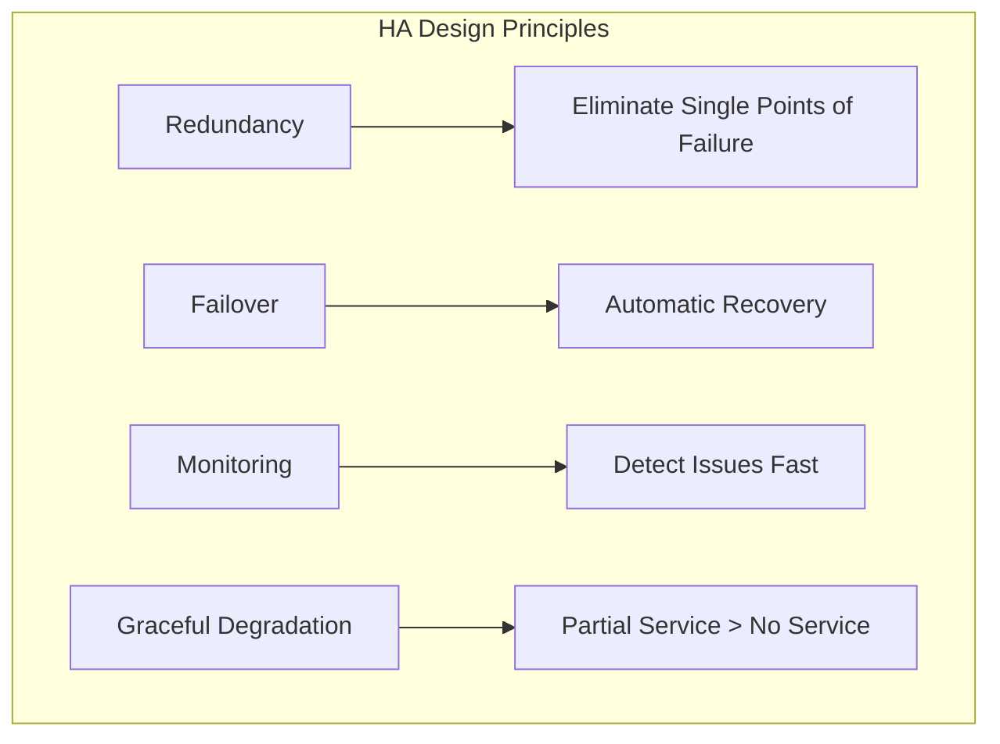
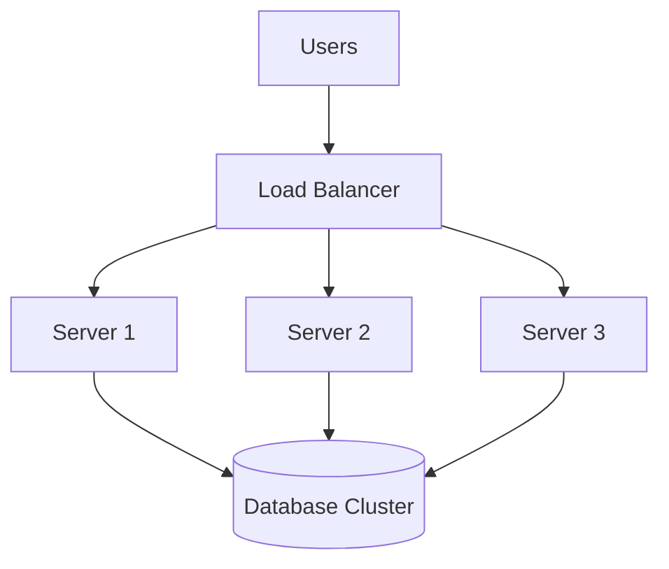
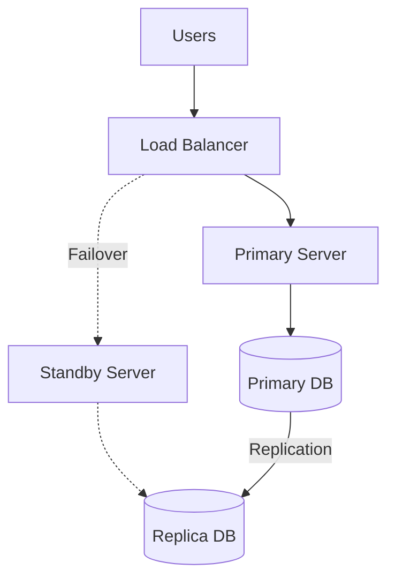
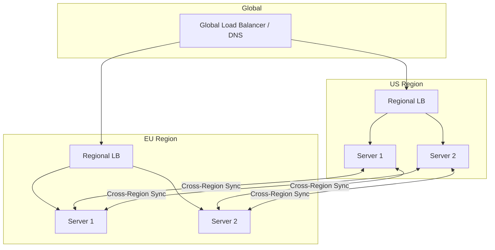
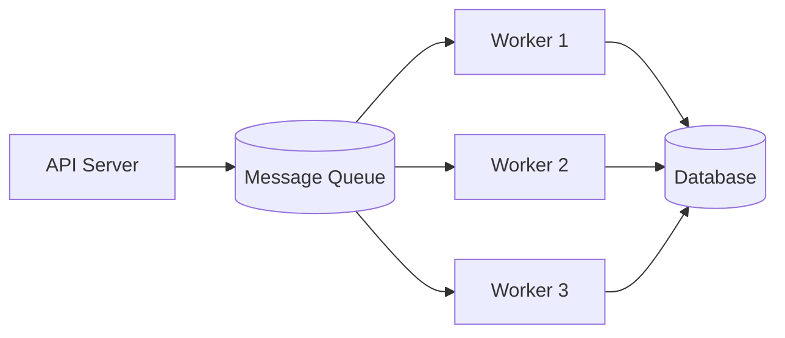
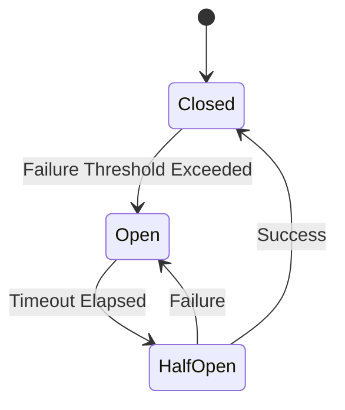

# How to Build HA Architecture Design

Author: [nawazdhandala](https://github.com/nawazdhandala)

Tags: High Availability, Architecture, DevOps, Reliability, Infrastructure, SRE

Description: A practical guide to designing high availability architectures that minimize downtime and keep your services running when failures inevitably occur.

---

High availability is not about preventing failures. It is about designing systems that continue serving users when components fail. This guide walks through the core patterns, trade-offs, and implementation details you need to build resilient architectures.

## What High Availability Actually Means

High availability (HA) measures the percentage of time a system remains operational. The industry typically expresses this as "nines":

| Availability | Downtime per Year | Downtime per Month |
|--------------|-------------------|-------------------|
| 99% (two nines) | 3.65 days | 7.3 hours |
| 99.9% (three nines) | 8.76 hours | 43.8 minutes |
| 99.99% (four nines) | 52.6 minutes | 4.38 minutes |
| 99.999% (five nines) | 5.26 minutes | 26.3 seconds |

Each additional nine requires exponentially more investment. Before you design anything, determine what availability your users actually need and what your budget allows.

## Core HA Principles



### 1. Redundancy

Every critical component needs a backup. If a single server handles all requests, that server is a single point of failure (SPOF). Redundancy means running multiple instances so that when one fails, others continue serving traffic.

### 2. Automatic Failover

Manual intervention adds minutes or hours to recovery time. Automated failover detects failures and redirects traffic without human action, reducing recovery time to seconds.

### 3. Health Monitoring

You cannot fix what you cannot see. Continuous health checks detect problems early, trigger failovers, and alert operators when manual intervention becomes necessary.

### 4. Graceful Degradation

When partial failures occur, serve reduced functionality instead of showing error pages. Users prefer slower responses or fewer features over complete outages.

## HA Architecture Patterns

### Pattern 1: Active-Active

Both instances handle traffic simultaneously. Load balancers distribute requests across all healthy nodes.



**Pros:**
- Full resource utilization
- Seamless scaling
- No wasted capacity

**Cons:**
- Requires stateless application design
- Database synchronization complexity
- Higher operational overhead

### Pattern 2: Active-Passive

One instance handles all traffic while standby instances remain idle, ready to take over during failures.



**Pros:**
- Simpler state management
- Clear failover path
- Works with stateful applications

**Cons:**
- Wasted standby capacity
- Potential data loss during failover
- Longer recovery times

### Pattern 3: Multi-Region Active-Active

For maximum resilience, deploy across geographic regions. Users connect to the nearest region, and traffic fails over across regions during outages.



## Building Blocks of HA Systems

### Load Balancers

Load balancers distribute traffic and detect unhealthy backends. Run them in pairs with virtual IP failover.

The following nginx configuration sets up upstream health checks that automatically remove failed servers from the pool.

```nginx
# nginx upstream configuration with health checks
upstream backend {
    # Round-robin with health checks
    server backend1.example.com:8080 weight=5;
    server backend2.example.com:8080 weight=5;
    server backend3.example.com:8080 backup;

    # Health check settings
    health_check interval=5s fails=3 passes=2;
}

server {
    listen 80;

    location / {
        proxy_pass http://backend;
        proxy_next_upstream error timeout http_502 http_503;
        proxy_connect_timeout 5s;
        proxy_read_timeout 60s;
    }
}
```

### Database High Availability

Databases often become the hardest component to make highly available. Choose your pattern based on consistency requirements.

**PostgreSQL with Streaming Replication**

This configuration enables synchronous replication to a standby server. The primary waits for confirmation before committing transactions.

```sql
-- On primary: Configure synchronous replication
ALTER SYSTEM SET synchronous_standby_names = 'standby1';
ALTER SYSTEM SET synchronous_commit = 'on';
SELECT pg_reload_conf();

-- Check replication status
SELECT client_addr, state, sync_state
FROM pg_stat_replication;
```

**Kubernetes StatefulSet for Database Clusters**

This StatefulSet runs a three-node PostgreSQL cluster with persistent storage and ordered pod management.

```yaml
# PostgreSQL StatefulSet with replicas
apiVersion: apps/v1
kind: StatefulSet
metadata:
  name: postgres
spec:
  serviceName: postgres
  replicas: 3
  selector:
    matchLabels:
      app: postgres
  template:
    metadata:
      labels:
        app: postgres
    spec:
      containers:
        - name: postgres
          image: postgres:16
          ports:
            - containerPort: 5432
          env:
            - name: POSTGRES_PASSWORD
              valueFrom:
                secretKeyRef:
                  name: postgres-secret
                  key: password
          volumeMounts:
            - name: data
              mountPath: /var/lib/postgresql/data
          # Liveness probe detects hung processes
          livenessProbe:
            exec:
              command: ["pg_isready", "-U", "postgres"]
            initialDelaySeconds: 30
            periodSeconds: 10
          # Readiness probe controls traffic routing
          readinessProbe:
            exec:
              command: ["pg_isready", "-U", "postgres"]
            initialDelaySeconds: 5
            periodSeconds: 5
  volumeClaimTemplates:
    - metadata:
        name: data
      spec:
        accessModes: ["ReadWriteOnce"]
        resources:
          requests:
            storage: 100Gi
```

### Message Queues for Decoupling

Message queues absorb traffic spikes and decouple components. When a downstream service fails, messages wait in the queue instead of causing cascading failures.



**RabbitMQ Cluster Configuration**

This Kubernetes deployment runs RabbitMQ with clustering and queue mirroring for high availability.

```yaml
# RabbitMQ cluster with mirrored queues
apiVersion: rabbitmq.com/v1beta1
kind: RabbitmqCluster
metadata:
  name: rabbitmq-ha
spec:
  replicas: 3
  persistence:
    storageClassName: fast-ssd
    storage: 50Gi
  rabbitmq:
    # Enable all queues to be mirrored across nodes
    additionalConfig: |
      cluster_partition_handling = pause_minority
      vm_memory_high_watermark.relative = 0.8
      disk_free_limit.absolute = 2GB
    additionalPlugins:
      - rabbitmq_management
      - rabbitmq_prometheus
  override:
    statefulSet:
      spec:
        template:
          spec:
            containers:
              - name: rabbitmq
                resources:
                  requests:
                    memory: 2Gi
                    cpu: 1000m
                  limits:
                    memory: 4Gi
                    cpu: 2000m
```

### Caching Layer

Caches reduce database load and improve response times. Use cache replication or consistent hashing to maintain availability.

**Redis Sentinel for Automatic Failover**

This configuration runs Redis with Sentinel for automatic primary election when the current primary fails.

```yaml
# Redis with Sentinel for HA
apiVersion: v1
kind: ConfigMap
metadata:
  name: redis-config
data:
  redis.conf: |
    # Enable append-only file for durability
    appendonly yes
    appendfsync everysec

    # Memory management
    maxmemory 2gb
    maxmemory-policy allkeys-lru

  sentinel.conf: |
    sentinel monitor mymaster redis-0.redis 6379 2
    sentinel down-after-milliseconds mymaster 5000
    sentinel failover-timeout mymaster 60000
    sentinel parallel-syncs mymaster 1
```

## Health Checks and Monitoring

### Application Health Endpoints

Every service needs health endpoints that load balancers and orchestrators can query.

This Express.js health check verifies database connectivity and reports detailed component status.

```javascript
// Express.js health check endpoints
const express = require('express');
const app = express();

// Simple liveness check - is the process running?
app.get('/healthz', (req, res) => {
  res.status(200).json({ status: 'ok' });
});

// Detailed readiness check - can we serve traffic?
app.get('/ready', async (req, res) => {
  const checks = {
    database: false,
    cache: false,
    queue: false
  };

  try {
    // Check database connection
    await db.query('SELECT 1');
    checks.database = true;
  } catch (err) {
    console.error('Database health check failed:', err);
  }

  try {
    // Check cache connection
    await redis.ping();
    checks.cache = true;
  } catch (err) {
    console.error('Cache health check failed:', err);
  }

  try {
    // Check message queue
    await rabbitmq.checkQueue('tasks');
    checks.queue = true;
  } catch (err) {
    console.error('Queue health check failed:', err);
  }

  const allHealthy = Object.values(checks).every(v => v);

  res.status(allHealthy ? 200 : 503).json({
    status: allHealthy ? 'ready' : 'degraded',
    checks,
    timestamp: new Date().toISOString()
  });
});

app.listen(8080);
```

### Kubernetes Probes

Configure probes correctly to prevent false positives during startup and enable fast failure detection during operation.

```yaml
# Kubernetes deployment with comprehensive probes
apiVersion: apps/v1
kind: Deployment
metadata:
  name: api-server
spec:
  replicas: 3
  strategy:
    type: RollingUpdate
    rollingUpdate:
      maxSurge: 1
      maxUnavailable: 0
  selector:
    matchLabels:
      app: api-server
  template:
    metadata:
      labels:
        app: api-server
    spec:
      containers:
        - name: api
          image: myapp:latest
          ports:
            - containerPort: 8080
          # Startup probe: Allow slow startup without killing pod
          startupProbe:
            httpGet:
              path: /healthz
              port: 8080
            failureThreshold: 30
            periodSeconds: 10
          # Liveness probe: Restart if process hangs
          livenessProbe:
            httpGet:
              path: /healthz
              port: 8080
            initialDelaySeconds: 0
            periodSeconds: 10
            timeoutSeconds: 5
            failureThreshold: 3
          # Readiness probe: Remove from service if not ready
          readinessProbe:
            httpGet:
              path: /ready
              port: 8080
            initialDelaySeconds: 0
            periodSeconds: 5
            timeoutSeconds: 3
            failureThreshold: 2
```

## Handling Failures Gracefully

### Circuit Breakers

Circuit breakers prevent cascading failures by stopping requests to failing services.



This circuit breaker implementation tracks failures and opens the circuit when the threshold is exceeded.

```javascript
// Circuit breaker implementation
class CircuitBreaker {
  constructor(options = {}) {
    this.failureThreshold = options.failureThreshold || 5;
    this.resetTimeout = options.resetTimeout || 30000;
    this.state = 'CLOSED';
    this.failures = 0;
    this.lastFailure = null;
  }

  async execute(fn) {
    if (this.state === 'OPEN') {
      // Check if we should try again
      if (Date.now() - this.lastFailure > this.resetTimeout) {
        this.state = 'HALF_OPEN';
      } else {
        throw new Error('Circuit breaker is OPEN');
      }
    }

    try {
      const result = await fn();
      this.onSuccess();
      return result;
    } catch (err) {
      this.onFailure();
      throw err;
    }
  }

  onSuccess() {
    this.failures = 0;
    this.state = 'CLOSED';
  }

  onFailure() {
    this.failures++;
    this.lastFailure = Date.now();

    if (this.failures >= this.failureThreshold) {
      this.state = 'OPEN';
      console.log('Circuit breaker opened due to failures');
    }
  }
}

// Usage
const breaker = new CircuitBreaker({ failureThreshold: 3, resetTimeout: 10000 });

async function callExternalService() {
  return breaker.execute(async () => {
    const response = await fetch('https://api.external-service.com/data');
    if (!response.ok) throw new Error('Service unavailable');
    return response.json();
  });
}
```

### Retry with Exponential Backoff

Not every failure is permanent. Implement retries with backoff to handle transient failures.

This retry function uses exponential backoff with jitter to prevent thundering herd problems.

```javascript
// Retry with exponential backoff and jitter
async function retryWithBackoff(fn, options = {}) {
  const maxRetries = options.maxRetries || 3;
  const baseDelay = options.baseDelay || 1000;
  const maxDelay = options.maxDelay || 30000;

  let lastError;

  for (let attempt = 0; attempt <= maxRetries; attempt++) {
    try {
      return await fn();
    } catch (err) {
      lastError = err;

      if (attempt === maxRetries) {
        throw err;
      }

      // Calculate delay with exponential backoff
      const exponentialDelay = baseDelay * Math.pow(2, attempt);
      // Add jitter to prevent thundering herd
      const jitter = Math.random() * 1000;
      const delay = Math.min(exponentialDelay + jitter, maxDelay);

      console.log(`Attempt ${attempt + 1} failed, retrying in ${delay}ms`);
      await new Promise(resolve => setTimeout(resolve, delay));
    }
  }

  throw lastError;
}

// Usage
const data = await retryWithBackoff(
  () => fetch('https://api.example.com/data'),
  { maxRetries: 3, baseDelay: 1000 }
);
```

### Graceful Degradation Strategies

When dependencies fail, serve cached data or reduced functionality instead of errors.

```javascript
// Graceful degradation example
async function getProductRecommendations(userId) {
  // Try real-time personalized recommendations first
  try {
    return await recommendationService.getPersonalized(userId);
  } catch (err) {
    console.warn('Personalized recommendations unavailable:', err);
  }

  // Fall back to cached recommendations
  try {
    const cached = await redis.get(`recommendations:${userId}`);
    if (cached) {
      return JSON.parse(cached);
    }
  } catch (err) {
    console.warn('Cached recommendations unavailable:', err);
  }

  // Fall back to popular items (lowest quality but always available)
  return getPopularProducts();
}
```

## Infrastructure as Code for HA

### Terraform Multi-AZ Deployment

This Terraform configuration deploys an auto-scaling group across multiple availability zones with health checks.

```hcl
# Terraform: Multi-AZ deployment with auto-scaling
resource "aws_autoscaling_group" "api" {
  name                = "api-asg"
  vpc_zone_identifier = var.private_subnet_ids  # Multiple AZs
  target_group_arns   = [aws_lb_target_group.api.arn]

  min_size         = 3
  max_size         = 10
  desired_capacity = 3

  # Health checks
  health_check_type         = "ELB"
  health_check_grace_period = 300

  # Replace unhealthy instances
  default_instance_warmup = 120

  launch_template {
    id      = aws_launch_template.api.id
    version = "$Latest"
  }

  # Spread instances across AZs
  instance_distribution {
    on_demand_base_capacity                  = 2
    on_demand_percentage_above_base_capacity = 50
    spot_allocation_strategy                 = "capacity-optimized"
  }

  tag {
    key                 = "Name"
    value               = "api-server"
    propagate_at_launch = true
  }
}

resource "aws_lb" "api" {
  name               = "api-lb"
  internal           = false
  load_balancer_type = "application"
  security_groups    = [aws_security_group.lb.id]
  subnets            = var.public_subnet_ids

  # Enable cross-zone load balancing
  enable_cross_zone_load_balancing = true

  # Enable deletion protection in production
  enable_deletion_protection = true
}

resource "aws_lb_target_group" "api" {
  name     = "api-tg"
  port     = 8080
  protocol = "HTTP"
  vpc_id   = var.vpc_id

  health_check {
    enabled             = true
    healthy_threshold   = 2
    unhealthy_threshold = 3
    timeout             = 5
    interval            = 10
    path                = "/ready"
    matcher             = "200"
  }

  # Enable stickiness if needed
  stickiness {
    type            = "lb_cookie"
    enabled         = false
    cookie_duration = 86400
  }
}
```

## Testing HA Systems

### Chaos Engineering

Intentionally inject failures to verify your system handles them correctly.

**Chaos Mesh for Kubernetes**

This Chaos Mesh experiment kills random pods to verify the system recovers automatically.

```yaml
# Chaos Mesh: Random pod failure
apiVersion: chaos-mesh.org/v1alpha1
kind: PodChaos
metadata:
  name: pod-failure-test
spec:
  action: pod-kill
  mode: one
  selector:
    namespaces:
      - production
    labelSelectors:
      app: api-server
  scheduler:
    cron: "@every 2h"
```

**Network Partition Testing**

This experiment simulates network partitions between services to test failure handling.

```yaml
# Simulate network partition
apiVersion: chaos-mesh.org/v1alpha1
kind: NetworkChaos
metadata:
  name: network-partition-test
spec:
  action: partition
  mode: all
  selector:
    namespaces:
      - production
    labelSelectors:
      app: api-server
  direction: both
  target:
    selector:
      namespaces:
        - production
      labelSelectors:
        app: database
  duration: "5m"
```

### Load Testing for Capacity Planning

Verify your system handles expected load with headroom for traffic spikes.

```yaml
# k6 load test configuration
apiVersion: k6.io/v1alpha1
kind: K6
metadata:
  name: ha-load-test
spec:
  parallelism: 4
  script:
    configMap:
      name: load-test-script
      file: test.js
---
# test.js ConfigMap content
apiVersion: v1
kind: ConfigMap
metadata:
  name: load-test-script
data:
  test.js: |
    import http from 'k6/http';
    import { check, sleep } from 'k6';

    export const options = {
      stages: [
        { duration: '5m', target: 100 },   // Ramp up
        { duration: '10m', target: 100 },  // Steady state
        { duration: '5m', target: 200 },   // Spike
        { duration: '5m', target: 0 },     // Ramp down
      ],
      thresholds: {
        http_req_duration: ['p(95)<500'],  // 95% under 500ms
        http_req_failed: ['rate<0.01'],    // Less than 1% errors
      },
    };

    export default function() {
      const res = http.get('https://api.example.com/health');
      check(res, {
        'status is 200': (r) => r.status === 200,
        'response time OK': (r) => r.timings.duration < 500,
      });
      sleep(1);
    }
```

## HA Checklist

Use this checklist when designing or auditing high availability systems:

**Infrastructure**
- [ ] No single points of failure in critical paths
- [ ] Components distributed across availability zones
- [ ] Auto-scaling configured with appropriate thresholds
- [ ] Load balancers health checks configured

**Data**
- [ ] Database replication enabled
- [ ] Backup and restore procedures tested
- [ ] Recovery Point Objective (RPO) documented
- [ ] Recovery Time Objective (RTO) documented

**Application**
- [ ] Stateless design (or externalized state)
- [ ] Health check endpoints implemented
- [ ] Circuit breakers for external dependencies
- [ ] Retry logic with exponential backoff

**Operations**
- [ ] Monitoring and alerting in place
- [ ] Runbooks for common failure scenarios
- [ ] Chaos engineering experiments scheduled
- [ ] Failover procedures documented and tested

## Common Mistakes to Avoid

1. **Testing only happy paths.** Your HA setup must handle failures. Test what happens when databases go down, networks partition, and disks fill up.

2. **Ignoring dependencies.** Your service might be highly available, but if it depends on a single-instance database, your actual availability matches the weakest link.

3. **Manual failover procedures.** If failover requires human intervention at 3 AM, expect longer outages. Automate everything possible.

4. **Skipping capacity planning.** High availability means nothing if all your instances collapse under load. Plan for peak traffic plus headroom.

5. **Forgetting about data.** Compute is easy to replicate. Data consistency across replicas is hard. Understand your consistency requirements and choose appropriate replication strategies.

---

Building highly available systems requires investment in redundancy, automation, and testing. Start with your most critical services, implement the patterns that match your requirements, and continuously test your assumptions through chaos engineering. The goal is not to prevent all failures but to build systems that recover quickly and gracefully when failures occur.

For monitoring your HA infrastructure, consider using OneUptime to track uptime, receive instant alerts, and maintain comprehensive status pages for your users.
