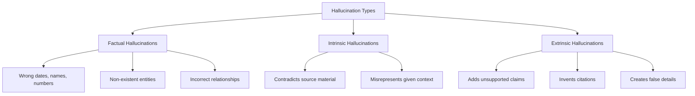
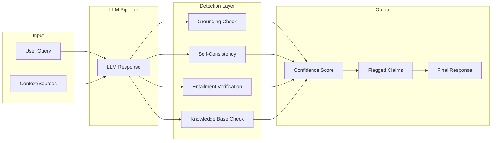

# How to Create Hallucination Detection

Author: [nawazdhandala](https://github.com/nawazdhandala)

Tags: LLM, AI Safety, Monitoring, AI

Description: Learn how to build robust hallucination detection systems for LLM applications using semantic similarity, grounding verification, and self-consistency checks to ensure AI outputs remain accurate and trustworthy.

---

Large Language Models are powerful, but they have a critical flaw: they can confidently generate information that sounds plausible but is completely wrong. These "hallucinations" can erode user trust, cause real-world harm, and undermine the reliability of your AI-powered applications.

Building hallucination detection into your LLM pipeline is not optional for production systems. This guide walks through practical techniques to identify when your model is making things up.

## Understanding Hallucination Types

Before building detection systems, you need to understand what you are detecting.



**Factual hallucinations** occur when the model states incorrect facts about the real world. **Intrinsic hallucinations** contradict the source material provided to the model. **Extrinsic hallucinations** add information that cannot be verified from the source.

## Architecture Overview

A robust hallucination detection system combines multiple verification strategies.



## Method 1: Grounding Verification

Grounding verification checks whether each claim in the response is supported by the provided context. This is essential for RAG (Retrieval-Augmented Generation) systems.

The core idea is simple: extract claims from the response and verify each one against the source documents.

```python
import openai
from dataclasses import dataclass
from typing import List, Tuple
import json

@dataclass
class GroundingResult:
    """Represents the grounding verification result for a single claim."""
    claim: str
    is_grounded: bool
    supporting_evidence: str
    confidence: float

class GroundingVerifier:
    """
    Verifies whether LLM responses are grounded in provided source material.
    Uses a secondary LLM call to check each claim against the context.
    """

    def __init__(self, model: str = "gpt-4"):
        self.model = model
        self.client = openai.OpenAI()

    def extract_claims(self, response: str) -> List[str]:
        """
        Breaks down a response into individual verifiable claims.
        Each claim should be a single factual statement.
        """
        extraction_prompt = """Extract all factual claims from the following text.
Return each claim as a separate item. Only include verifiable factual statements,
not opinions or hedged language.

Text: {response}

Return as JSON array of strings."""

        result = self.client.chat.completions.create(
            model=self.model,
            messages=[
                {"role": "system", "content": "You extract factual claims from text."},
                {"role": "user", "content": extraction_prompt.format(response=response)}
            ],
            response_format={"type": "json_object"}
        )

        claims_data = json.loads(result.choices[0].message.content)
        return claims_data.get("claims", [])

    def verify_claim(self, claim: str, context: str) -> GroundingResult:
        """
        Checks if a single claim is supported by the context.
        Returns grounding status with evidence and confidence score.
        """
        verification_prompt = """Determine if the following claim is supported by the context.

Claim: {claim}

Context: {context}

Respond in JSON with:
- "is_supported": boolean
- "evidence": the specific text from context that supports or refutes the claim (or "none found")
- "confidence": float between 0 and 1

Be strict: if the context does not explicitly support the claim, mark it as unsupported."""

        result = self.client.chat.completions.create(
            model=self.model,
            messages=[
                {"role": "system", "content": "You verify claims against source material."},
                {"role": "user", "content": verification_prompt.format(
                    claim=claim,
                    context=context
                )}
            ],
            response_format={"type": "json_object"}
        )

        verification = json.loads(result.choices[0].message.content)

        return GroundingResult(
            claim=claim,
            is_grounded=verification.get("is_supported", False),
            supporting_evidence=verification.get("evidence", ""),
            confidence=verification.get("confidence", 0.0)
        )

    def verify_response(
        self,
        response: str,
        context: str
    ) -> Tuple[float, List[GroundingResult]]:
        """
        Verifies all claims in a response against the context.
        Returns overall grounding score and individual claim results.
        """
        claims = self.extract_claims(response)

        if not claims:
            return 1.0, []

        results = [self.verify_claim(claim, context) for claim in claims]

        # Calculate overall grounding score
        grounded_count = sum(1 for r in results if r.is_grounded)
        overall_score = grounded_count / len(results)

        return overall_score, results
```

Usage example showing how to integrate grounding verification into your pipeline:

```python
# Initialize the verifier
verifier = GroundingVerifier()

# Your RAG context (retrieved documents)
context = """
OneUptime is an open-source observability platform founded in 2019.
It provides monitoring, incident management, and status pages.
The platform supports OpenTelemetry for distributed tracing.
OneUptime is licensed under the MIT license.
"""

# LLM response to verify
response = """
OneUptime is an observability platform that was founded in 2019.
It uses OpenTelemetry for tracing and is built on Apache Kafka.
The platform is open-source under the MIT license.
"""

# Verify grounding
score, results = verifier.verify_response(response, context)

print(f"Grounding Score: {score:.2%}")
for result in results:
    status = "GROUNDED" if result.is_grounded else "HALLUCINATED"
    print(f"[{status}] {result.claim}")
    if not result.is_grounded:
        print(f"  Evidence: {result.supporting_evidence}")
```

## Method 2: Self-Consistency Checking

Self-consistency leverages a simple observation: if an LLM truly "knows" something, it should give consistent answers when asked multiple times with different phrasings. Hallucinations tend to be inconsistent.

```python
import hashlib
from collections import Counter
from typing import List, Dict, Any

class SelfConsistencyChecker:
    """
    Detects hallucinations by checking if the model gives consistent
    answers across multiple response samples.
    """

    def __init__(self, model: str = "gpt-4", num_samples: int = 5):
        self.model = model
        self.num_samples = num_samples
        self.client = openai.OpenAI()

    def generate_samples(
        self,
        query: str,
        context: str = None,
        temperature: float = 0.7
    ) -> List[str]:
        """
        Generates multiple response samples for the same query.
        Higher temperature increases variation to test consistency.
        """
        messages = []
        if context:
            messages.append({
                "role": "system",
                "content": f"Answer based on this context: {context}"
            })
        messages.append({"role": "user", "content": query})

        samples = []
        for _ in range(self.num_samples):
            response = self.client.chat.completions.create(
                model=self.model,
                messages=messages,
                temperature=temperature
            )
            samples.append(response.choices[0].message.content)

        return samples

    def extract_key_facts(self, response: str) -> List[str]:
        """
        Extracts key factual claims for comparison across samples.
        Normalizes claims for consistent comparison.
        """
        extraction_prompt = """Extract the key factual claims from this response.
Return each as a short, normalized statement.

Response: {response}

Return as JSON array of strings. Normalize numbers, dates, and names."""

        result = self.client.chat.completions.create(
            model=self.model,
            messages=[
                {"role": "user", "content": extraction_prompt.format(response=response)}
            ],
            response_format={"type": "json_object"}
        )

        data = json.loads(result.choices[0].message.content)
        return data.get("claims", [])

    def calculate_consistency(self, samples: List[str]) -> Dict[str, Any]:
        """
        Analyzes consistency across response samples.
        Returns consistency scores and identifies inconsistent claims.
        """
        # Extract facts from each sample
        all_facts = [self.extract_key_facts(s) for s in samples]

        # Flatten and count occurrences
        fact_counter = Counter()
        for facts in all_facts:
            for fact in facts:
                # Normalize for comparison
                normalized = fact.lower().strip()
                fact_counter[normalized] += 1

        # Facts appearing in most samples are likely accurate
        consistent_facts = []
        inconsistent_facts = []

        threshold = self.num_samples * 0.6  # 60% agreement required

        for fact, count in fact_counter.items():
            if count >= threshold:
                consistent_facts.append({
                    "fact": fact,
                    "agreement": count / self.num_samples
                })
            else:
                inconsistent_facts.append({
                    "fact": fact,
                    "agreement": count / self.num_samples
                })

        # Calculate overall consistency score
        if not fact_counter:
            consistency_score = 1.0
        else:
            total_agreement = sum(
                min(count, threshold) for count in fact_counter.values()
            )
            max_possible = len(fact_counter) * threshold
            consistency_score = total_agreement / max_possible if max_possible > 0 else 1.0

        return {
            "consistency_score": consistency_score,
            "consistent_facts": consistent_facts,
            "inconsistent_facts": inconsistent_facts,
            "num_samples": self.num_samples
        }

    def check(self, query: str, context: str = None) -> Dict[str, Any]:
        """
        Full consistency check pipeline.
        Returns consistency analysis with flagged potential hallucinations.
        """
        samples = self.generate_samples(query, context)
        analysis = self.calculate_consistency(samples)

        # Add the samples for reference
        analysis["samples"] = samples

        # Flag if consistency is below threshold
        analysis["potential_hallucination"] = analysis["consistency_score"] < 0.7

        return analysis
```

## Method 3: Natural Language Inference (NLI)

NLI models determine whether a hypothesis is entailed by, contradicts, or is neutral to a premise. This is directly applicable to hallucination detection.

```python
from transformers import AutoModelForSequenceClassification, AutoTokenizer
import torch
from typing import List, Tuple

class NLIHallucinationDetector:
    """
    Uses Natural Language Inference to detect hallucinations.
    Checks if generated claims are entailed by the source context.
    """

    def __init__(self, model_name: str = "microsoft/deberta-v3-large-mnli"):
        self.tokenizer = AutoTokenizer.from_pretrained(model_name)
        self.model = AutoModelForSequenceClassification.from_pretrained(model_name)
        self.model.eval()

        # Label mapping for MNLI models
        self.labels = ["contradiction", "neutral", "entailment"]

    def check_entailment(
        self,
        premise: str,
        hypothesis: str
    ) -> Tuple[str, float]:
        """
        Checks if the hypothesis is entailed by the premise.
        Returns the predicted label and confidence score.
        """
        # Tokenize the premise-hypothesis pair
        inputs = self.tokenizer(
            premise,
            hypothesis,
            return_tensors="pt",
            truncation=True,
            max_length=512
        )

        with torch.no_grad():
            outputs = self.model(**inputs)
            probabilities = torch.softmax(outputs.logits, dim=1)[0]

        # Get prediction
        predicted_idx = torch.argmax(probabilities).item()
        predicted_label = self.labels[predicted_idx]
        confidence = probabilities[predicted_idx].item()

        return predicted_label, confidence

    def detect_hallucinations(
        self,
        context: str,
        claims: List[str],
        contradiction_threshold: float = 0.7
    ) -> List[dict]:
        """
        Checks multiple claims against the context.
        Flags claims that contradict or are not entailed by the context.
        """
        results = []

        for claim in claims:
            label, confidence = self.check_entailment(context, claim)

            is_hallucination = (
                label == "contradiction" and confidence > contradiction_threshold
            ) or (
                label == "neutral" and confidence > 0.8
            )

            results.append({
                "claim": claim,
                "label": label,
                "confidence": confidence,
                "is_hallucination": is_hallucination,
                "reason": self._get_reason(label, confidence)
            })

        return results

    def _get_reason(self, label: str, confidence: float) -> str:
        """Returns human-readable reason for the classification."""
        if label == "entailment":
            return "Claim is supported by the context"
        elif label == "contradiction":
            return "Claim contradicts the context"
        else:
            return "Claim cannot be verified from the context"
```

## Method 4: Semantic Similarity with Embeddings

Compare the semantic similarity between generated content and source material. Low similarity might indicate hallucinated content.

```python
import numpy as np
from typing import List
from sentence_transformers import SentenceTransformer

class SemanticSimilarityDetector:
    """
    Detects hallucinations by measuring semantic similarity
    between generated content and source documents.
    """

    def __init__(self, model_name: str = "all-MiniLM-L6-v2"):
        self.model = SentenceTransformer(model_name)

    def get_embeddings(self, texts: List[str]) -> np.ndarray:
        """Generates embeddings for a list of texts."""
        return self.model.encode(texts, normalize_embeddings=True)

    def chunk_text(self, text: str, chunk_size: int = 200) -> List[str]:
        """
        Splits text into overlapping chunks for granular comparison.
        Overlap helps catch claims that span chunk boundaries.
        """
        words = text.split()
        chunks = []
        stride = chunk_size // 2

        for i in range(0, len(words), stride):
            chunk = " ".join(words[i:i + chunk_size])
            if chunk:
                chunks.append(chunk)

        return chunks

    def calculate_grounding_score(
        self,
        response: str,
        context: str,
        threshold: float = 0.5
    ) -> dict:
        """
        Calculates how well the response is grounded in the context.
        Returns overall score and identifies potentially hallucinated segments.
        """
        # Chunk both response and context
        response_chunks = self.chunk_text(response, chunk_size=50)
        context_chunks = self.chunk_text(context, chunk_size=100)

        if not response_chunks or not context_chunks:
            return {"score": 1.0, "flagged_chunks": []}

        # Get embeddings
        response_embeddings = self.get_embeddings(response_chunks)
        context_embeddings = self.get_embeddings(context_chunks)

        # Calculate similarity matrix
        similarity_matrix = np.dot(response_embeddings, context_embeddings.T)

        # For each response chunk, find max similarity to any context chunk
        max_similarities = similarity_matrix.max(axis=1)

        # Flag low-similarity chunks
        flagged_chunks = []
        for i, (chunk, sim) in enumerate(zip(response_chunks, max_similarities)):
            if sim < threshold:
                flagged_chunks.append({
                    "chunk": chunk,
                    "similarity": float(sim),
                    "position": i
                })

        # Overall grounding score
        overall_score = float(np.mean(max_similarities))

        return {
            "score": overall_score,
            "flagged_chunks": flagged_chunks,
            "chunk_similarities": max_similarities.tolist()
        }
```

## Building a Combined Detection Pipeline

The most effective approach combines multiple detection methods.

```python
from dataclasses import dataclass
from typing import Optional, Dict, Any
from enum import Enum

class HallucinationSeverity(Enum):
    LOW = "low"
    MEDIUM = "medium"
    HIGH = "high"
    CRITICAL = "critical"

@dataclass
class DetectionResult:
    """Combined result from all detection methods."""
    overall_score: float
    severity: HallucinationSeverity
    grounding_score: float
    consistency_score: float
    nli_score: float
    semantic_score: float
    flagged_claims: list
    recommendations: list

class HallucinationDetectionPipeline:
    """
    Combines multiple hallucination detection methods into a single pipeline.
    Weights and thresholds can be tuned based on your use case.
    """

    def __init__(
        self,
        enable_grounding: bool = True,
        enable_consistency: bool = True,
        enable_nli: bool = True,
        enable_semantic: bool = True
    ):
        self.detectors = {}

        if enable_grounding:
            self.detectors["grounding"] = GroundingVerifier()
        if enable_consistency:
            self.detectors["consistency"] = SelfConsistencyChecker()
        if enable_nli:
            self.detectors["nli"] = NLIHallucinationDetector()
        if enable_semantic:
            self.detectors["semantic"] = SemanticSimilarityDetector()

        # Weights for combining scores (sum to 1.0)
        self.weights = {
            "grounding": 0.35,
            "consistency": 0.25,
            "nli": 0.25,
            "semantic": 0.15
        }

    def detect(
        self,
        response: str,
        context: str,
        query: Optional[str] = None
    ) -> DetectionResult:
        """
        Runs all enabled detection methods and combines results.
        Returns comprehensive hallucination analysis.
        """
        scores = {}
        all_flagged = []

        # Run grounding verification
        if "grounding" in self.detectors:
            score, results = self.detectors["grounding"].verify_response(
                response, context
            )
            scores["grounding"] = score
            all_flagged.extend([
                {"type": "grounding", "claim": r.claim, "evidence": r.supporting_evidence}
                for r in results if not r.is_grounded
            ])

        # Run consistency check (requires query)
        if "consistency" in self.detectors and query:
            analysis = self.detectors["consistency"].check(query, context)
            scores["consistency"] = analysis["consistency_score"]
            all_flagged.extend([
                {"type": "consistency", "claim": f["fact"], "agreement": f["agreement"]}
                for f in analysis["inconsistent_facts"]
            ])

        # Run NLI check
        if "nli" in self.detectors:
            claims = self.detectors["grounding"].extract_claims(response) \
                if "grounding" in self.detectors else [response]
            nli_results = self.detectors["nli"].detect_hallucinations(
                context, claims
            )
            # Score based on ratio of entailed claims
            entailed = sum(1 for r in nli_results if r["label"] == "entailment")
            scores["nli"] = entailed / len(nli_results) if nli_results else 1.0
            all_flagged.extend([
                {"type": "nli", "claim": r["claim"], "reason": r["reason"]}
                for r in nli_results if r["is_hallucination"]
            ])

        # Run semantic similarity
        if "semantic" in self.detectors:
            semantic_result = self.detectors["semantic"].calculate_grounding_score(
                response, context
            )
            scores["semantic"] = semantic_result["score"]
            all_flagged.extend([
                {"type": "semantic", "chunk": c["chunk"], "similarity": c["similarity"]}
                for c in semantic_result["flagged_chunks"]
            ])

        # Calculate weighted overall score
        overall_score = sum(
            scores.get(method, 1.0) * weight
            for method, weight in self.weights.items()
            if method in self.detectors
        )

        # Normalize if not all methods enabled
        active_weight = sum(
            weight for method, weight in self.weights.items()
            if method in self.detectors
        )
        overall_score = overall_score / active_weight if active_weight > 0 else 1.0

        # Determine severity
        severity = self._calculate_severity(overall_score, len(all_flagged))

        # Generate recommendations
        recommendations = self._generate_recommendations(
            scores, all_flagged, severity
        )

        return DetectionResult(
            overall_score=overall_score,
            severity=severity,
            grounding_score=scores.get("grounding", 1.0),
            consistency_score=scores.get("consistency", 1.0),
            nli_score=scores.get("nli", 1.0),
            semantic_score=scores.get("semantic", 1.0),
            flagged_claims=all_flagged,
            recommendations=recommendations
        )

    def _calculate_severity(
        self,
        score: float,
        num_flagged: int
    ) -> HallucinationSeverity:
        """Determines hallucination severity based on score and flagged claims."""
        if score >= 0.9 and num_flagged == 0:
            return HallucinationSeverity.LOW
        elif score >= 0.7 and num_flagged <= 2:
            return HallucinationSeverity.MEDIUM
        elif score >= 0.5:
            return HallucinationSeverity.HIGH
        else:
            return HallucinationSeverity.CRITICAL

    def _generate_recommendations(
        self,
        scores: dict,
        flagged: list,
        severity: HallucinationSeverity
    ) -> list:
        """Generates actionable recommendations based on detection results."""
        recommendations = []

        if scores.get("grounding", 1.0) < 0.7:
            recommendations.append(
                "Improve RAG retrieval to provide more relevant context"
            )

        if scores.get("consistency", 1.0) < 0.7:
            recommendations.append(
                "Consider using lower temperature or more specific prompts"
            )

        if severity in [HallucinationSeverity.HIGH, HallucinationSeverity.CRITICAL]:
            recommendations.append(
                "Add human review before showing this response to users"
            )
            recommendations.append(
                "Consider regenerating with stricter grounding instructions"
            )

        if len(flagged) > 3:
            recommendations.append(
                "Review and expand your knowledge base for this topic"
            )

        return recommendations
```

## Integrating with Your Monitoring Stack

Hallucination detection should be part of your observability pipeline. Here is how to integrate with OpenTelemetry for monitoring.

```python
from opentelemetry import trace, metrics
from opentelemetry.trace import Status, StatusCode

tracer = trace.get_tracer("hallucination-detector")
meter = metrics.get_meter("hallucination-detector")

# Create metrics for monitoring
hallucination_score = meter.create_histogram(
    "llm.hallucination.score",
    description="Hallucination detection score (1.0 = no hallucination)",
    unit="score"
)

hallucination_count = meter.create_counter(
    "llm.hallucination.flagged_claims",
    description="Number of flagged potential hallucinations"
)

detection_latency = meter.create_histogram(
    "llm.hallucination.detection_latency",
    description="Time to run hallucination detection",
    unit="ms"
)

class MonitoredHallucinationDetector:
    """
    Wraps hallucination detection with observability instrumentation.
    Sends metrics and traces to your monitoring backend.
    """

    def __init__(self, pipeline: HallucinationDetectionPipeline):
        self.pipeline = pipeline

    def detect(
        self,
        response: str,
        context: str,
        query: str = None,
        metadata: dict = None
    ) -> DetectionResult:
        """
        Runs detection with full observability instrumentation.
        Creates spans for tracing and records metrics.
        """
        with tracer.start_as_current_span("hallucination_detection") as span:
            import time
            start_time = time.time()

            # Add context to span
            span.set_attribute("llm.response_length", len(response))
            span.set_attribute("llm.context_length", len(context))
            if metadata:
                for key, value in metadata.items():
                    span.set_attribute(f"llm.metadata.{key}", str(value))

            try:
                result = self.pipeline.detect(response, context, query)

                # Record metrics
                latency_ms = (time.time() - start_time) * 1000
                detection_latency.record(latency_ms)
                hallucination_score.record(result.overall_score)
                hallucination_count.add(len(result.flagged_claims))

                # Add results to span
                span.set_attribute("hallucination.score", result.overall_score)
                span.set_attribute("hallucination.severity", result.severity.value)
                span.set_attribute("hallucination.flagged_count", len(result.flagged_claims))

                if result.severity in [HallucinationSeverity.HIGH, HallucinationSeverity.CRITICAL]:
                    span.set_status(Status(StatusCode.ERROR, "High hallucination risk"))
                    span.add_event("hallucination_detected", {
                        "severity": result.severity.value,
                        "flagged_claims": str(result.flagged_claims[:5])
                    })

                return result

            except Exception as e:
                span.set_status(Status(StatusCode.ERROR, str(e)))
                span.record_exception(e)
                raise
```

## Real-World Implementation Patterns

### Pattern 1: Pre-Response Filtering

Check responses before showing them to users.

```python
async def generate_safe_response(query: str, context: str) -> dict:
    """
    Generates a response and validates it before returning.
    Regenerates if hallucination risk is too high.
    """
    detector = MonitoredHallucinationDetector(
        HallucinationDetectionPipeline()
    )

    max_attempts = 3

    for attempt in range(max_attempts):
        # Generate response
        response = await generate_llm_response(query, context)

        # Check for hallucinations
        result = detector.detect(response, context, query)

        if result.severity == HallucinationSeverity.LOW:
            return {
                "response": response,
                "confidence": result.overall_score,
                "verified": True
            }

        if result.severity == HallucinationSeverity.MEDIUM:
            # Add disclaimer but still return
            return {
                "response": response,
                "confidence": result.overall_score,
                "verified": False,
                "disclaimer": "This response may contain unverified information."
            }

        # High or critical - try again with stricter prompt
        context = f"""IMPORTANT: Only use information from the provided context.
Do not add any information not explicitly stated below.

Context: {context}"""

    # All attempts failed - return safe fallback
    return {
        "response": "I cannot provide a reliable answer to this question based on the available information.",
        "confidence": 0.0,
        "verified": False,
        "fallback": True
    }
```

### Pattern 2: Async Monitoring

For high-throughput systems, run detection asynchronously.

```python
import asyncio
from concurrent.futures import ThreadPoolExecutor

class AsyncHallucinationMonitor:
    """
    Monitors LLM responses asynchronously without blocking.
    Logs issues for later review rather than blocking responses.
    """

    def __init__(self, pipeline: HallucinationDetectionPipeline):
        self.pipeline = pipeline
        self.executor = ThreadPoolExecutor(max_workers=4)
        self.alert_threshold = HallucinationSeverity.HIGH

    async def monitor(
        self,
        response: str,
        context: str,
        query: str,
        request_id: str
    ):
        """
        Runs hallucination detection in background.
        Sends alerts for high-severity issues.
        """
        loop = asyncio.get_event_loop()

        try:
            result = await loop.run_in_executor(
                self.executor,
                lambda: self.pipeline.detect(response, context, query)
            )

            # Log all results for analytics
            await self._log_result(request_id, result)

            # Alert on high severity
            if result.severity.value >= self.alert_threshold.value:
                await self._send_alert(request_id, result)

        except Exception as e:
            # Log error but do not fail the request
            await self._log_error(request_id, e)

    async def _log_result(self, request_id: str, result: DetectionResult):
        """Logs detection result for analytics and debugging."""
        log_entry = {
            "request_id": request_id,
            "timestamp": datetime.utcnow().isoformat(),
            "overall_score": result.overall_score,
            "severity": result.severity.value,
            "scores": {
                "grounding": result.grounding_score,
                "consistency": result.consistency_score,
                "nli": result.nli_score,
                "semantic": result.semantic_score
            },
            "flagged_count": len(result.flagged_claims)
        }
        # Send to your logging backend
        logger.info("hallucination_detection", extra=log_entry)

    async def _send_alert(self, request_id: str, result: DetectionResult):
        """Sends alert for high-severity hallucinations."""
        alert = {
            "type": "hallucination_detected",
            "severity": result.severity.value,
            "request_id": request_id,
            "score": result.overall_score,
            "flagged_claims": result.flagged_claims[:5],
            "recommendations": result.recommendations
        }
        # Send to alerting system (PagerDuty, Slack, etc.)
        await alerting_service.send(alert)
```

## Testing Your Detection System

Build tests to validate your hallucination detection is working correctly.

```python
import pytest

class TestHallucinationDetection:
    """Test suite for hallucination detection system."""

    @pytest.fixture
    def detector(self):
        return HallucinationDetectionPipeline()

    def test_detects_obvious_hallucination(self, detector):
        """Should detect when response contradicts context."""
        context = "The company was founded in 2020 by John Smith."
        response = "The company was founded in 1995 by Jane Doe."

        result = detector.detect(response, context)

        assert result.overall_score < 0.5
        assert result.severity in [
            HallucinationSeverity.HIGH,
            HallucinationSeverity.CRITICAL
        ]
        assert len(result.flagged_claims) > 0

    def test_accepts_grounded_response(self, detector):
        """Should accept responses that match the context."""
        context = "Python 3.12 was released in October 2023 with performance improvements."
        response = "Python 3.12 came out in October 2023 and includes performance enhancements."

        result = detector.detect(response, context)

        assert result.overall_score > 0.8
        assert result.severity == HallucinationSeverity.LOW

    def test_flags_extrinsic_hallucination(self, detector):
        """Should flag information not present in context."""
        context = "The API supports JSON and XML formats."
        response = "The API supports JSON, XML, and Protocol Buffers formats."

        result = detector.detect(response, context)

        # Should flag the Protocol Buffers claim
        assert any(
            "protocol buffers" in claim.get("claim", "").lower()
            for claim in result.flagged_claims
        )
```

## Summary

| Detection Method | Best For | Limitations |
|-----------------|----------|-------------|
| **Grounding Verification** | RAG systems with clear source docs | Requires LLM calls, adds latency |
| **Self-Consistency** | Questions with definitive answers | Multiple LLM calls needed |
| **NLI Models** | Detecting contradictions | May miss subtle hallucinations |
| **Semantic Similarity** | Fast initial screening | Less precise than other methods |
| **Combined Pipeline** | Production systems | Higher computational cost |

Hallucination detection is not a solved problem, but combining these techniques gives you practical tools to build more trustworthy AI systems. Start with grounding verification for RAG applications, add self-consistency for high-stakes queries, and use semantic similarity for fast initial screening.

The key is to match your detection strategy to your risk tolerance. A chatbot for entertainment can tolerate more hallucination than a medical information system. Tune your thresholds accordingly, monitor your metrics, and continuously improve your detection as you learn from real-world usage patterns.

---

*Building reliable AI applications requires treating hallucination detection as a first-class concern. Integrate detection into your observability pipeline, monitor trends over time, and always have a human review process for high-stakes decisions.*

**Related Reading:**

- [Introducing OneUptime MCP Server: Bringing AI-Native Observability to Your Workflow](https://oneuptime.com/blog/post/2025-07-01-oneuptime-mcp-server-ai-observability/view)
- [How to Instrument Express.js Applications with OpenTelemetry](https://oneuptime.com/blog/post/2026-01-06-nodejs-express-opentelemetry-instrumentation/view)
- [Traces and Spans in OpenTelemetry](https://oneuptime.com/blog/post/2025-08-27-traces-and-spans-in-opentelemetry/view)
