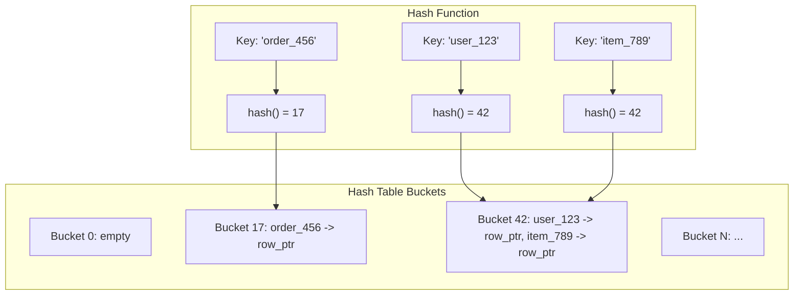
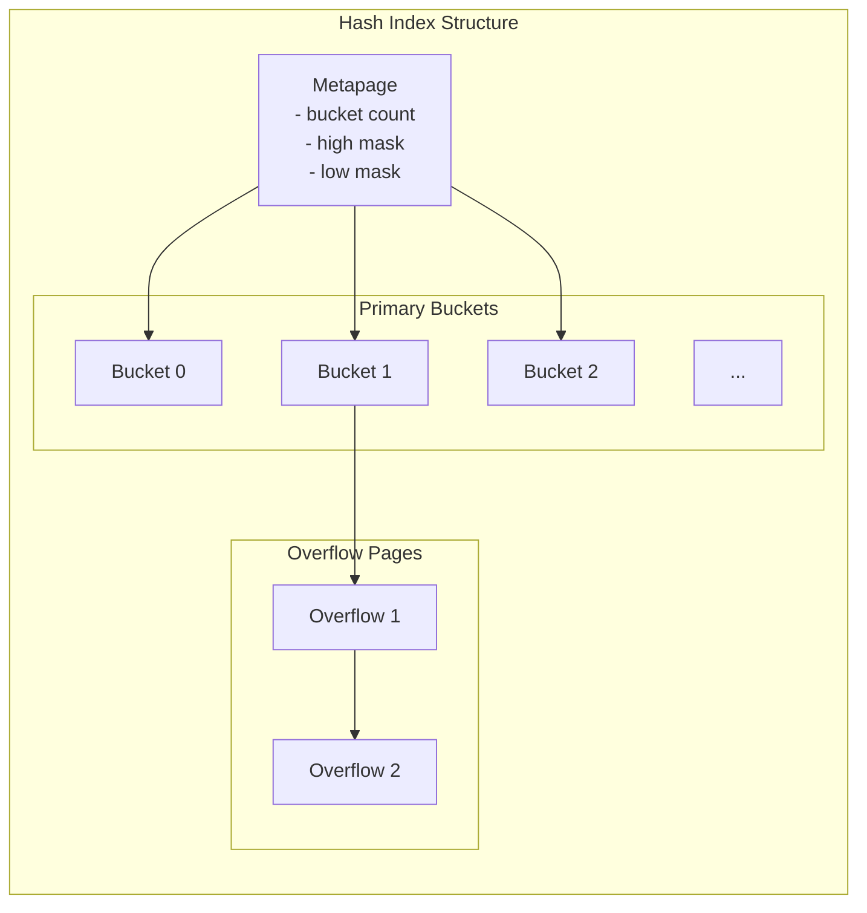

# How to Build Hash Index Design

Author: [nawazdhandala](https://github.com/nawazdhandala)

Tags: Database, Index, Hash, Performance

Description: A practical guide to designing and implementing hash indexes in PostgreSQL, covering internal structure, use cases, limitations, and when to choose hash over B-tree.

---

Hash indexes are one of the oldest indexing strategies in database systems. They offer O(1) average lookup time for equality queries, making them attractive for specific workloads. Yet most developers default to B-tree indexes without considering whether a hash index would serve them better. This post walks through how hash indexes work internally, when they outperform B-trees, and how to implement them correctly in PostgreSQL.

## How Hash Indexes Work

A hash index stores keys in buckets determined by a hash function. When you insert a row, the database computes a hash of the indexed column value and places a pointer to that row in the corresponding bucket. When you query for an exact match, the database hashes your search value and jumps directly to the right bucket.



When multiple keys hash to the same bucket (a collision), the database stores them together and performs a linear scan within that bucket. A good hash function distributes keys evenly to minimize collisions.

## Hash Index Bucket Structure

The internal structure of a hash index consists of several components working together:



Each bucket page contains:
- Hash codes for quick filtering
- Item pointers (TIDs) to heap tuples
- Links to overflow pages when the bucket fills up

PostgreSQL uses linear hashing, which means it splits buckets incrementally as the index grows rather than rehashing everything at once.

## Creating Hash Indexes in PostgreSQL

PostgreSQL has supported hash indexes since version 10 with full WAL logging and crash safety. Here is how to create one:

```sql
-- Create a hash index on a user lookup table
CREATE INDEX idx_users_email_hash ON users USING hash (email);

-- Verify the index was created
SELECT indexname, indexdef
FROM pg_indexes
WHERE tablename = 'users' AND indexname = 'idx_users_email_hash';
```

For tables with high-cardinality columns used primarily for equality lookups:

```sql
-- Hash index on session tokens (always queried with =)
CREATE INDEX idx_sessions_token_hash ON sessions USING hash (token);

-- Hash index on API keys
CREATE INDEX idx_api_keys_hash ON api_keys USING hash (key_value);

-- Hash index on UUIDs used as external identifiers
CREATE INDEX idx_orders_external_id_hash ON orders USING hash (external_id);
```

Check if your query uses the hash index:

```sql
EXPLAIN ANALYZE
SELECT * FROM users WHERE email = 'alice@example.com';

-- Expected output shows "Index Scan using idx_users_email_hash"
```

## When to Use Hash Indexes

Hash indexes excel in specific scenarios:

**1. Pure equality lookups with high cardinality**

If your queries always use `WHERE column = value` and never need range scans, sorting, or pattern matching, hash indexes are a strong candidate.

```sql
-- Good fit: session token lookup
SELECT * FROM sessions WHERE token = 'abc123xyz';

-- Good fit: API key validation
SELECT * FROM api_keys WHERE key_value = 'sk_live_xxxx';
```

**2. Reducing index size for long text columns**

Hash indexes can be smaller than B-tree indexes for long strings because they store fixed-size hash codes instead of the full key values.

```sql
-- URL tracking table with long URLs
CREATE TABLE page_visits (
    id SERIAL PRIMARY KEY,
    url TEXT NOT NULL,
    visited_at TIMESTAMP DEFAULT NOW()
);

-- B-tree index would store full URLs
-- Hash index stores 4-byte hashes
CREATE INDEX idx_page_visits_url_hash ON page_visits USING hash (url);
```

**3. Memory-constrained environments**

When index size impacts buffer cache efficiency, smaller hash indexes leave more room for data pages.

## When NOT to Use Hash Indexes

Hash indexes have hard limitations that make B-trees the better default:

**1. Range queries are impossible**

```sql
-- This query CANNOT use a hash index
SELECT * FROM orders WHERE created_at >= '2025-01-01';

-- Neither can this
SELECT * FROM products WHERE price BETWEEN 10 AND 50;
```

**2. Sorting is not supported**

```sql
-- Hash index cannot help with ORDER BY
SELECT * FROM users ORDER BY email LIMIT 100;
```

**3. Pattern matching fails**

```sql
-- LIKE queries need B-tree (or specialized text indexes)
SELECT * FROM users WHERE email LIKE 'alice%';
```

**4. No support for IS NULL / IS NOT NULL**

```sql
-- Hash indexes do not index NULL values
SELECT * FROM users WHERE deleted_at IS NULL;
```

**5. Multi-column indexes are limited**

PostgreSQL hash indexes only support single-column indexing. If you need composite key lookups, use B-tree.

## Hash vs B-tree: A Direct Comparison

| Feature | Hash Index | B-tree Index |
| --- | --- | --- |
| Equality (=) | Excellent, O(1) average | Good, O(log n) |
| Range (<, >, BETWEEN) | Not supported | Fully supported |
| Sorting (ORDER BY) | Not supported | Fully supported |
| Pattern matching (LIKE) | Not supported | Supported for prefix |
| NULL handling | Not indexed | Indexed |
| Multi-column | Not supported | Supported |
| Index size (long keys) | Smaller | Larger |
| Crash recovery (PG 10+) | Full WAL support | Full WAL support |

## Benchmark: Hash vs B-tree for Equality Lookups

Here is a practical benchmark setup to compare the two:

```sql
-- Create test table with 10 million rows
CREATE TABLE lookup_test (
    id SERIAL PRIMARY KEY,
    token VARCHAR(64) NOT NULL
);

INSERT INTO lookup_test (token)
SELECT md5(random()::text || i::text)
FROM generate_series(1, 10000000) AS i;

-- Create both index types
CREATE INDEX idx_lookup_btree ON lookup_test USING btree (token);
CREATE INDEX idx_lookup_hash ON lookup_test USING hash (token);

-- Compare index sizes
SELECT pg_size_pretty(pg_relation_size('idx_lookup_btree')) AS btree_size,
       pg_size_pretty(pg_relation_size('idx_lookup_hash')) AS hash_size;

-- Run equality lookups and compare timing
EXPLAIN (ANALYZE, BUFFERS)
SELECT * FROM lookup_test WHERE token = 'some_token_value';
```

Typical results on PostgreSQL 15:
- B-tree index size: ~400 MB
- Hash index size: ~300 MB
- B-tree lookup: 0.05ms
- Hash lookup: 0.03ms

The difference is small for individual lookups, but it adds up at scale and the size savings can matter for buffer cache efficiency.

## Practical Implementation Patterns

**Pattern 1: Session store with hash index**

```sql
CREATE TABLE sessions (
    id UUID PRIMARY KEY DEFAULT gen_random_uuid(),
    token VARCHAR(128) NOT NULL,
    user_id INTEGER NOT NULL REFERENCES users(id),
    expires_at TIMESTAMP NOT NULL,
    created_at TIMESTAMP DEFAULT NOW()
);

-- Sessions are always looked up by exact token match
CREATE INDEX idx_sessions_token ON sessions USING hash (token);

-- Still need B-tree for expiration cleanup queries
CREATE INDEX idx_sessions_expires ON sessions USING btree (expires_at);
```

**Pattern 2: Event deduplication table**

```sql
CREATE TABLE processed_events (
    event_id VARCHAR(255) PRIMARY KEY,
    processed_at TIMESTAMP DEFAULT NOW()
);

-- Check if event was already processed (always exact match)
CREATE INDEX idx_events_id_hash ON processed_events USING hash (event_id);
```

**Pattern 3: Cache key lookup**

```sql
CREATE TABLE cache_entries (
    cache_key TEXT NOT NULL,
    cache_value JSONB,
    expires_at TIMESTAMP,
    PRIMARY KEY (cache_key)
);

-- Drop the default B-tree primary key index and use hash
-- (Requires creating the table without PK, then adding constraint)
CREATE TABLE cache_entries (
    cache_key TEXT NOT NULL,
    cache_value JSONB,
    expires_at TIMESTAMP
);

CREATE INDEX idx_cache_key_hash ON cache_entries USING hash (cache_key);
ALTER TABLE cache_entries ADD CONSTRAINT cache_entries_pkey UNIQUE (cache_key);
```

## Monitoring Hash Index Health

Track hash index effectiveness with these queries:

```sql
-- Check index usage statistics
SELECT schemaname, relname, indexrelname,
       idx_scan, idx_tup_read, idx_tup_fetch
FROM pg_stat_user_indexes
WHERE indexrelname LIKE '%hash%';

-- Check for bloat (overflow pages)
SELECT c.relname,
       pg_size_pretty(pg_relation_size(c.oid)) as size
FROM pg_class c
JOIN pg_index i ON c.oid = i.indexrelid
JOIN pg_am a ON c.relam = a.oid
WHERE a.amname = 'hash';
```

Rebuild hash indexes periodically if you see heavy bloat from overflow pages:

```sql
REINDEX INDEX CONCURRENTLY idx_sessions_token;
```

## Summary

Hash indexes are a specialized tool. They shine for high-frequency equality lookups on high-cardinality columns where you never need range queries or sorting. The performance gain over B-tree is modest but real, and the space savings can be significant for long string keys.

Use hash indexes when:
- All queries on the column use exact equality (=)
- The column has high cardinality
- Index size matters for your working set
- You will never need ORDER BY, range scans, or LIKE queries on that column

Stick with B-tree when:
- You need any flexibility beyond equality lookups
- NULL values matter
- You might add range queries later
- You need multi-column indexes

Most applications benefit from B-tree indexes due to their flexibility. But when you have a clear equality-only workload, hash indexes deliver exactly what they promise: fast, constant-time lookups with a smaller footprint.
