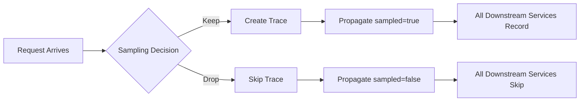
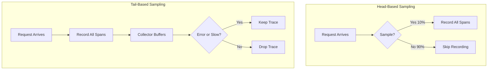
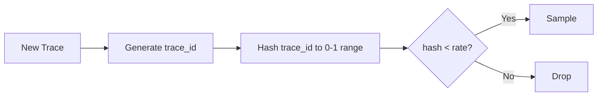
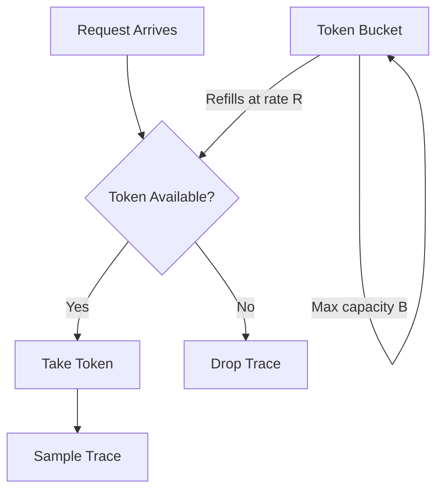
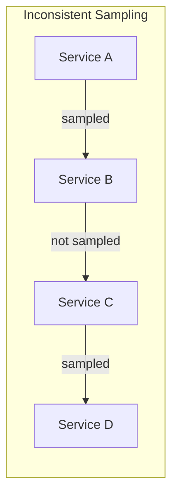
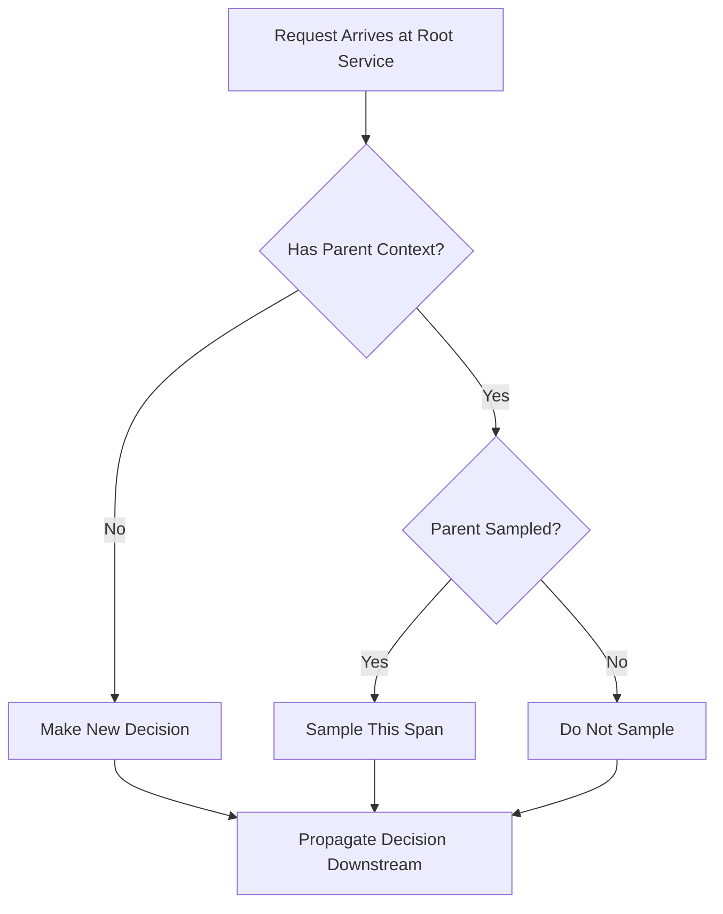
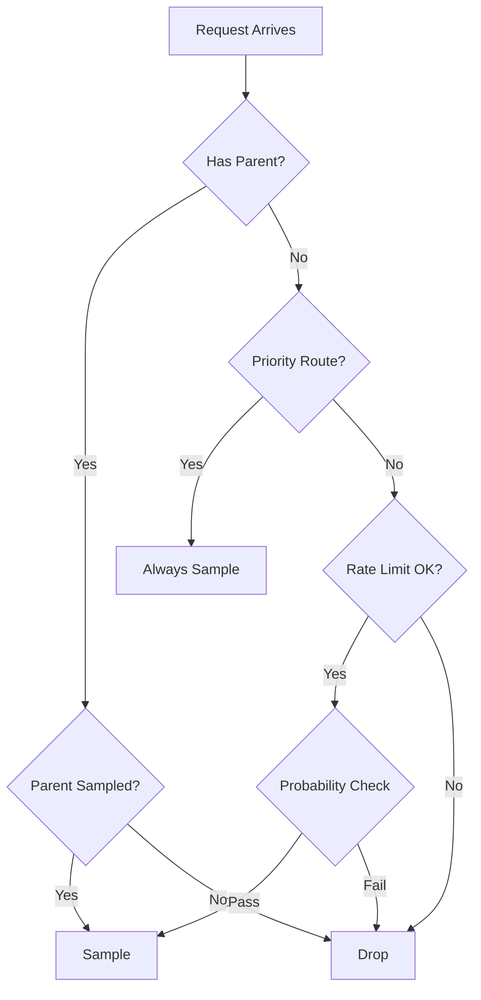
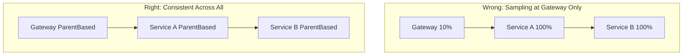
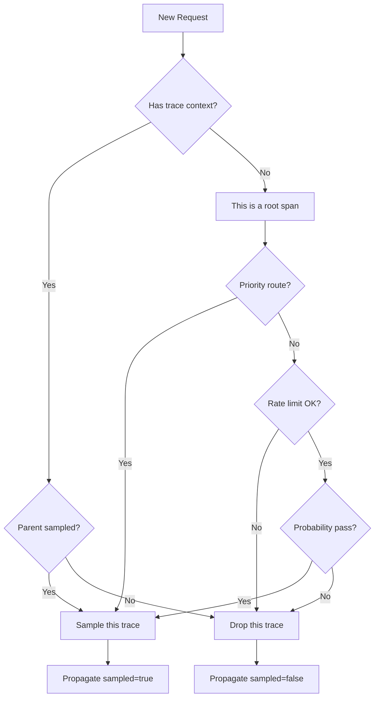

# How to Implement Head-Based Sampling

Author: [nawazdhandala](https://github.com/nawazdhandala)

Tags: Observability, Tracing, OpenTelemetry, Sampling

Description: Learn how to implement head-based sampling for making sampling decisions at trace start time.

---

Head-based sampling is the practice of making a sampling decision at the very beginning of a trace, before any spans are created. This decision propagates through all downstream services, ensuring that either the entire trace is kept or the entire trace is dropped. No partial traces. No orphaned spans.

This guide walks through why head-based sampling matters, how to implement it correctly, and how to ensure consistent sampling decisions across your distributed system.

---

## Table of Contents

1. What is Head-Based Sampling?
2. Head-Based vs Tail-Based Sampling
3. Probability-Based Sampling
4. Rate Limiting at the Head
5. Consistent Sampling Across Services
6. Implementation in Node.js/TypeScript
7. Implementation in Python
8. OpenTelemetry Collector Configuration
9. Combining Strategies
10. Testing Your Sampling Configuration
11. Common Pitfalls
12. Summary

---

## 1. What is Head-Based Sampling?

Head-based sampling makes the keep/drop decision at trace creation time, before the request flows through your system. The decision is encoded in the trace context and propagated to all downstream services.



Key characteristics:

| Property | Description |
|----------|-------------|
| Decision Point | At trace root (first span) |
| Context Propagation | Via W3C traceparent header |
| Consistency | All services honor the same decision |
| Overhead | Minimal (decision made once) |
| Information Available | Only request attributes at entry point |

The W3C traceparent header carries the sampling decision:

```
traceparent: 00-<trace-id>-<span-id>-<flags>
```

The flags byte indicates the sampling decision:
- `00` = not sampled
- `01` = sampled

---

## 2. Head-Based vs Tail-Based Sampling

Understanding when to use each approach is critical.



| Aspect | Head-Based | Tail-Based |
|--------|-----------|-----------|
| Decision timing | Before trace starts | After trace completes |
| Resource usage | Low (dropped traces cost nothing) | High (must buffer all traces) |
| Error capture | May miss errors (probabilistic) | Can keep all errors |
| Latency capture | May miss slow requests | Can keep slow requests |
| Implementation | Simple | Requires collector with state |
| Consistency | Guaranteed | Requires careful coordination |

Use head-based sampling when:
- You need predictable, low-overhead sampling
- Your traffic volume is very high
- You want consistent sampling across all services
- You can tolerate missing some errors/slow requests

Use tail-based sampling when:
- You must capture all errors
- You need to keep traces based on outcome
- You have collector infrastructure to buffer traces

Most production systems use both: head-based sampling as a baseline with tail-based sampling at the collector to rescue interesting traces.

---

## 3. Probability-Based Sampling

The most common head-based strategy. Each trace has a fixed probability of being sampled.

### How It Works



The trace ID itself determines the sampling decision. This is deterministic: the same trace ID always produces the same decision.

### Node.js/TypeScript Implementation

```typescript
// probability-sampler.ts
import {
  Sampler,
  SamplingDecision,
  SamplingResult,
  Context,
  Link,
  Attributes,
  SpanKind
} from '@opentelemetry/api';

/**
 * Probability-based sampler that uses trace ID for deterministic decisions.
 *
 * The sampling rate is a value between 0 and 1:
 * - 0.0 = sample nothing
 * - 0.1 = sample 10% of traces
 * - 1.0 = sample everything
 */
export class ProbabilitySampler implements Sampler {
  private readonly threshold: number;
  private readonly description: string;

  constructor(samplingRate: number) {
    // Clamp rate between 0 and 1
    const rate = Math.max(0, Math.min(1, samplingRate));

    // Convert rate to threshold for comparison with trace ID
    // Trace IDs are 128-bit, we use upper 64 bits for comparison
    this.threshold = rate * 0xFFFFFFFFFFFFFFFF;
    this.description = `ProbabilitySampler{rate=${rate}}`;
  }

  shouldSample(
    context: Context,
    traceId: string,
    spanName: string,
    spanKind: SpanKind,
    attributes: Attributes,
    links: Link[]
  ): SamplingResult {
    // Extract upper 64 bits of trace ID and convert to number
    const traceIdUpper = traceId.substring(0, 16);
    const traceIdValue = parseInt(traceIdUpper, 16);

    // Deterministic decision based on trace ID
    const shouldSample = traceIdValue < this.threshold;

    return {
      decision: shouldSample
        ? SamplingDecision.RECORD_AND_SAMPLED
        : SamplingDecision.NOT_RECORD,
      attributes: {},
    };
  }

  toString(): string {
    return this.description;
  }
}
```

### Using the Built-in Sampler

OpenTelemetry provides `TraceIdRatioBasedSampler` out of the box:

```typescript
// telemetry.ts
import { NodeSDK } from '@opentelemetry/sdk-node';
import { TraceIdRatioBasedSampler } from '@opentelemetry/sdk-trace-node';
import { OTLPTraceExporter } from '@opentelemetry/exporter-trace-otlp-http';
import { Resource } from '@opentelemetry/resources';
import { ATTR_SERVICE_NAME } from '@opentelemetry/semantic-conventions';

// Sample 10% of traces
const sampler = new TraceIdRatioBasedSampler(0.1);

const sdk = new NodeSDK({
  resource: new Resource({
    [ATTR_SERVICE_NAME]: 'api-gateway',
  }),
  traceExporter: new OTLPTraceExporter({
    url: process.env.OTEL_EXPORTER_OTLP_ENDPOINT || 'http://localhost:4318/v1/traces',
  }),
  sampler,
});

sdk.start();
```

### Python Implementation

```python
# probability_sampler.py
from opentelemetry.sdk.trace.sampling import Sampler, Decision, SamplingResult
from opentelemetry.trace import SpanKind, Link
from opentelemetry.context import Context
from opentelemetry.util.types import Attributes
from typing import Optional, Sequence

class ProbabilitySampler(Sampler):
    """
    Probability-based sampler using trace ID for deterministic decisions.

    Args:
        rate: Sampling rate between 0.0 and 1.0
    """

    def __init__(self, rate: float):
        # Clamp rate between 0 and 1
        self._rate = max(0.0, min(1.0, rate))
        # Threshold for 64-bit comparison
        self._threshold = int(self._rate * 0xFFFFFFFFFFFFFFFF)

    def should_sample(
        self,
        parent_context: Optional[Context],
        trace_id: int,
        name: str,
        kind: SpanKind = None,
        attributes: Attributes = None,
        links: Sequence[Link] = None,
    ) -> SamplingResult:
        # Use upper 64 bits of trace ID for decision
        trace_id_upper = trace_id >> 64

        if trace_id_upper < self._threshold:
            return SamplingResult(Decision.RECORD_AND_SAMPLED)
        return SamplingResult(Decision.DROP)

    def get_description(self) -> str:
        return f"ProbabilitySampler{{rate={self._rate}}}"
```

### Using OpenTelemetry's Built-in Sampler

```python
# telemetry.py
from opentelemetry import trace
from opentelemetry.sdk.trace import TracerProvider
from opentelemetry.sdk.trace.sampling import TraceIdRatioBased
from opentelemetry.sdk.trace.export import BatchSpanProcessor
from opentelemetry.exporter.otlp.proto.http.trace_exporter import OTLPSpanExporter
from opentelemetry.sdk.resources import Resource, SERVICE_NAME

# Sample 10% of traces
sampler = TraceIdRatioBased(0.1)

resource = Resource(attributes={
    SERVICE_NAME: "api-gateway"
})

provider = TracerProvider(resource=resource, sampler=sampler)

# Configure exporter
exporter = OTLPSpanExporter(
    endpoint="http://localhost:4318/v1/traces"
)
provider.add_span_processor(BatchSpanProcessor(exporter))

# Set the global tracer provider
trace.set_tracer_provider(provider)
```

---

## 4. Rate Limiting at the Head

Probability sampling does not protect against traffic spikes. If traffic doubles, sampled traces double. Rate limiting ensures a fixed maximum number of traces per time window.

### How Rate Limiting Works



### Token Bucket Rate Limiter

```typescript
// rate-limit-sampler.ts
import {
  Sampler,
  SamplingDecision,
  SamplingResult,
  Context,
  Link,
  Attributes,
  SpanKind
} from '@opentelemetry/api';

/**
 * Token bucket rate limiter for sampling.
 *
 * Allows burst traffic up to bucket capacity while maintaining
 * a steady-state rate limit.
 */
export class RateLimitingSampler implements Sampler {
  private tokens: number;
  private lastRefill: number;
  private readonly maxTokens: number;
  private readonly refillRate: number; // tokens per second

  /**
   * @param tracesPerSecond Maximum traces to sample per second
   * @param burstCapacity Maximum burst size (defaults to 2x rate)
   */
  constructor(tracesPerSecond: number, burstCapacity?: number) {
    this.refillRate = tracesPerSecond;
    this.maxTokens = burstCapacity ?? tracesPerSecond * 2;
    this.tokens = this.maxTokens;
    this.lastRefill = Date.now();
  }

  shouldSample(
    context: Context,
    traceId: string,
    spanName: string,
    spanKind: SpanKind,
    attributes: Attributes,
    links: Link[]
  ): SamplingResult {
    this.refillTokens();

    if (this.tokens >= 1) {
      this.tokens -= 1;
      return {
        decision: SamplingDecision.RECORD_AND_SAMPLED,
        attributes: {},
      };
    }

    return {
      decision: SamplingDecision.NOT_RECORD,
      attributes: {},
    };
  }

  private refillTokens(): void {
    const now = Date.now();
    const elapsed = (now - this.lastRefill) / 1000; // seconds

    // Add tokens based on elapsed time
    this.tokens = Math.min(
      this.maxTokens,
      this.tokens + elapsed * this.refillRate
    );

    this.lastRefill = now;
  }

  toString(): string {
    return `RateLimitingSampler{rate=${this.refillRate}/s, burst=${this.maxTokens}}`;
  }
}
```

### Python Rate Limiter

```python
# rate_limit_sampler.py
import time
from threading import Lock
from opentelemetry.sdk.trace.sampling import Sampler, Decision, SamplingResult
from opentelemetry.trace import SpanKind, Link
from opentelemetry.context import Context
from opentelemetry.util.types import Attributes
from typing import Optional, Sequence

class RateLimitingSampler(Sampler):
    """
    Token bucket rate limiter for trace sampling.

    Thread-safe implementation that allows controlled burst while
    maintaining a steady-state rate limit.

    Args:
        traces_per_second: Maximum traces to sample per second
        burst_capacity: Maximum burst size (defaults to 2x rate)
    """

    def __init__(self, traces_per_second: float, burst_capacity: float = None):
        self._refill_rate = traces_per_second
        self._max_tokens = burst_capacity or traces_per_second * 2
        self._tokens = self._max_tokens
        self._last_refill = time.monotonic()
        self._lock = Lock()

    def should_sample(
        self,
        parent_context: Optional[Context],
        trace_id: int,
        name: str,
        kind: SpanKind = None,
        attributes: Attributes = None,
        links: Sequence[Link] = None,
    ) -> SamplingResult:
        with self._lock:
            self._refill_tokens()

            if self._tokens >= 1:
                self._tokens -= 1
                return SamplingResult(Decision.RECORD_AND_SAMPLED)

            return SamplingResult(Decision.DROP)

    def _refill_tokens(self) -> None:
        now = time.monotonic()
        elapsed = now - self._last_refill

        # Add tokens based on elapsed time
        self._tokens = min(
            self._max_tokens,
            self._tokens + elapsed * self._refill_rate
        )

        self._last_refill = now

    def get_description(self) -> str:
        return f"RateLimitingSampler{{rate={self._refill_rate}/s}}"
```

### Combining Probability and Rate Limiting

```typescript
// composite-sampler.ts
import {
  Sampler,
  SamplingDecision,
  SamplingResult,
  Context,
  Link,
  Attributes,
  SpanKind
} from '@opentelemetry/api';
import { TraceIdRatioBasedSampler } from '@opentelemetry/sdk-trace-node';
import { RateLimitingSampler } from './rate-limit-sampler';

/**
 * Composite sampler that applies both probability and rate limiting.
 *
 * A trace must pass BOTH conditions to be sampled:
 * 1. Probability check (e.g., 10% of traces)
 * 2. Rate limit check (e.g., max 100 traces/second)
 */
export class CompositeSampler implements Sampler {
  private readonly probabilitySampler: TraceIdRatioBasedSampler;
  private readonly rateLimiter: RateLimitingSampler;

  constructor(samplingRate: number, maxTracesPerSecond: number) {
    this.probabilitySampler = new TraceIdRatioBasedSampler(samplingRate);
    this.rateLimiter = new RateLimitingSampler(maxTracesPerSecond);
  }

  shouldSample(
    context: Context,
    traceId: string,
    spanName: string,
    spanKind: SpanKind,
    attributes: Attributes,
    links: Link[]
  ): SamplingResult {
    // First check probability
    const probabilityResult = this.probabilitySampler.shouldSample(
      context, traceId, spanName, spanKind, attributes, links
    );

    if (probabilityResult.decision !== SamplingDecision.RECORD_AND_SAMPLED) {
      return probabilityResult;
    }

    // Then check rate limit
    return this.rateLimiter.shouldSample(
      context, traceId, spanName, spanKind, attributes, links
    );
  }

  toString(): string {
    return `CompositeSampler{probability=${this.probabilitySampler}, rateLimit=${this.rateLimiter}}`;
  }
}
```

---

## 5. Consistent Sampling Across Services

The most critical aspect of head-based sampling: all services must agree on the sampling decision for a given trace.

### The Problem



If each service makes its own decision, you get broken traces with missing spans.

### The Solution: Parent-Based Sampling



### Implementation with ParentBasedSampler

```typescript
// consistent-sampling.ts
import { NodeSDK } from '@opentelemetry/sdk-node';
import {
  ParentBasedSampler,
  TraceIdRatioBasedSampler,
  AlwaysOnSampler,
  AlwaysOffSampler
} from '@opentelemetry/sdk-trace-node';
import { OTLPTraceExporter } from '@opentelemetry/exporter-trace-otlp-http';
import { Resource } from '@opentelemetry/resources';
import { ATTR_SERVICE_NAME } from '@opentelemetry/semantic-conventions';

/**
 * ParentBasedSampler ensures consistent sampling across services:
 *
 * - root: Used when no parent exists (entry point service)
 * - remoteParentSampled: Used when remote parent was sampled
 * - remoteParentNotSampled: Used when remote parent was not sampled
 * - localParentSampled: Used when local parent was sampled
 * - localParentNotSampled: Used when local parent was not sampled
 */
const sampler = new ParentBasedSampler({
  // For root spans (no parent), sample 10%
  root: new TraceIdRatioBasedSampler(0.1),

  // If parent was sampled, always sample (maintain consistency)
  remoteParentSampled: new AlwaysOnSampler(),

  // If parent was not sampled, never sample (maintain consistency)
  remoteParentNotSampled: new AlwaysOffSampler(),

  // Same rules for local (in-process) parents
  localParentSampled: new AlwaysOnSampler(),
  localParentNotSampled: new AlwaysOffSampler(),
});

const sdk = new NodeSDK({
  resource: new Resource({
    [ATTR_SERVICE_NAME]: process.env.OTEL_SERVICE_NAME || 'my-service',
  }),
  traceExporter: new OTLPTraceExporter({
    url: process.env.OTEL_EXPORTER_OTLP_ENDPOINT,
  }),
  sampler,
});

sdk.start();

// Graceful shutdown
process.on('SIGTERM', () => {
  sdk.shutdown()
    .then(() => console.log('Tracing terminated'))
    .catch((error) => console.error('Error terminating tracing', error))
    .finally(() => process.exit(0));
});
```

### Python Parent-Based Sampling

```python
# consistent_sampling.py
from opentelemetry import trace
from opentelemetry.sdk.trace import TracerProvider
from opentelemetry.sdk.trace.sampling import (
    ParentBased,
    TraceIdRatioBased,
    ALWAYS_ON,
    ALWAYS_OFF,
)
from opentelemetry.sdk.trace.export import BatchSpanProcessor
from opentelemetry.exporter.otlp.proto.http.trace_exporter import OTLPSpanExporter
from opentelemetry.sdk.resources import Resource, SERVICE_NAME
import os

# ParentBased sampler ensures consistency across services
sampler = ParentBased(
    # Root sampler: 10% for new traces
    root=TraceIdRatioBased(0.1),
    # Honor parent decisions
    remote_parent_sampled=ALWAYS_ON,
    remote_parent_not_sampled=ALWAYS_OFF,
    local_parent_sampled=ALWAYS_ON,
    local_parent_not_sampled=ALWAYS_OFF,
)

resource = Resource(attributes={
    SERVICE_NAME: os.getenv("OTEL_SERVICE_NAME", "my-service")
})

provider = TracerProvider(resource=resource, sampler=sampler)

exporter = OTLPSpanExporter(
    endpoint=os.getenv("OTEL_EXPORTER_OTLP_ENDPOINT", "http://localhost:4318/v1/traces")
)
provider.add_span_processor(BatchSpanProcessor(exporter))

trace.set_tracer_provider(provider)
```

### Context Propagation

For consistent sampling to work, trace context must be propagated between services.

```typescript
// context-propagation.ts
import { propagation, context, trace } from '@opentelemetry/api';

/**
 * Inject trace context into outgoing HTTP headers
 */
export function injectTraceContext(headers: Record<string, string>): void {
  propagation.inject(context.active(), headers);
}

/**
 * Extract trace context from incoming HTTP headers
 */
export function extractTraceContext(headers: Record<string, string>): ReturnType<typeof context.active> {
  return propagation.extract(context.active(), headers);
}

// Example: Making an HTTP call with context propagation
async function callDownstreamService(url: string, payload: any): Promise<Response> {
  const tracer = trace.getTracer('http-client');

  return tracer.startActiveSpan('http.request', async (span) => {
    try {
      // Prepare headers with trace context
      const headers: Record<string, string> = {
        'Content-Type': 'application/json',
      };

      // Inject trace context (traceparent, tracestate)
      injectTraceContext(headers);

      const response = await fetch(url, {
        method: 'POST',
        headers,
        body: JSON.stringify(payload),
      });

      span.setAttribute('http.status_code', response.status);
      return response;
    } catch (error) {
      span.recordException(error as Error);
      throw error;
    } finally {
      span.end();
    }
  });
}
```

### Express Middleware for Context Extraction

```typescript
// express-context.ts
import { propagation, context, trace } from '@opentelemetry/api';
import { Request, Response, NextFunction } from 'express';

/**
 * Middleware to extract trace context from incoming requests.
 * This ensures the service honors the sampling decision from upstream.
 */
export function traceContextMiddleware(
  req: Request,
  res: Response,
  next: NextFunction
): void {
  // Extract context from incoming headers
  const extractedContext = propagation.extract(context.active(), req.headers);

  // Run the rest of the request within this context
  context.with(extractedContext, () => {
    // The sampler will see the parent context and honor its decision
    const tracer = trace.getTracer('express');
    const span = tracer.startSpan(`${req.method} ${req.path}`);

    // Store span in request for later use
    (req as any).span = span;

    res.on('finish', () => {
      span.setAttribute('http.status_code', res.statusCode);
      span.end();
    });

    next();
  });
}
```

---

## 6. Implementation in Node.js/TypeScript

Complete setup for a Node.js service with head-based sampling.

```typescript
// telemetry.ts
import { NodeSDK } from '@opentelemetry/sdk-node';
import { getNodeAutoInstrumentations } from '@opentelemetry/auto-instrumentations-node';
import { OTLPTraceExporter } from '@opentelemetry/exporter-trace-otlp-http';
import { Resource } from '@opentelemetry/resources';
import {
  ATTR_SERVICE_NAME,
  ATTR_SERVICE_VERSION,
  ATTR_DEPLOYMENT_ENVIRONMENT
} from '@opentelemetry/semantic-conventions';
import {
  ParentBasedSampler,
  TraceIdRatioBasedSampler
} from '@opentelemetry/sdk-trace-node';

// Configuration from environment
const config = {
  serviceName: process.env.OTEL_SERVICE_NAME || 'my-service',
  serviceVersion: process.env.OTEL_SERVICE_VERSION || '1.0.0',
  environment: process.env.OTEL_ENVIRONMENT || 'development',
  samplingRate: parseFloat(process.env.OTEL_SAMPLING_RATE || '0.1'),
  otlpEndpoint: process.env.OTEL_EXPORTER_OTLP_ENDPOINT || 'http://localhost:4318',
};

// Create parent-based sampler with probability root sampler
const sampler = new ParentBasedSampler({
  root: new TraceIdRatioBasedSampler(config.samplingRate),
});

// Initialize the SDK
const sdk = new NodeSDK({
  resource: new Resource({
    [ATTR_SERVICE_NAME]: config.serviceName,
    [ATTR_SERVICE_VERSION]: config.serviceVersion,
    [ATTR_DEPLOYMENT_ENVIRONMENT]: config.environment,
  }),
  traceExporter: new OTLPTraceExporter({
    url: `${config.otlpEndpoint}/v1/traces`,
  }),
  sampler,
  instrumentations: [
    getNodeAutoInstrumentations({
      // Disable noisy instrumentations
      '@opentelemetry/instrumentation-fs': { enabled: false },
      // Ignore health checks
      '@opentelemetry/instrumentation-http': {
        ignoreIncomingRequestHook: (req) => {
          return req.url === '/health' || req.url === '/ready';
        },
      },
    }),
  ],
});

// Start the SDK before importing application code
export async function startTelemetry(): Promise<void> {
  await sdk.start();
  console.log(`Telemetry started: ${config.serviceName} @ ${config.samplingRate * 100}% sampling`);
}

// Graceful shutdown
export async function shutdownTelemetry(): Promise<void> {
  await sdk.shutdown();
  console.log('Telemetry shut down');
}

// Handle process termination
process.on('SIGTERM', async () => {
  await shutdownTelemetry();
  process.exit(0);
});

process.on('SIGINT', async () => {
  await shutdownTelemetry();
  process.exit(0);
});
```

### Application Entry Point

```typescript
// index.ts
import { startTelemetry } from './telemetry';

// Start telemetry FIRST, before importing application code
// This ensures auto-instrumentation wraps modules correctly
async function main() {
  await startTelemetry();

  // Now import and start the application
  const { startServer } = await import('./server');
  await startServer();
}

main().catch(console.error);
```

### Express Server with Tracing

```typescript
// server.ts
import express from 'express';
import { trace, SpanStatusCode } from '@opentelemetry/api';

const app = express();
const tracer = trace.getTracer('express-server');

app.use(express.json());

// Health check (excluded from tracing)
app.get('/health', (req, res) => {
  res.json({ status: 'ok' });
});

// Business endpoint with manual spans
app.post('/orders', async (req, res) => {
  // Auto-instrumentation creates the HTTP span
  // Add custom child spans for business logic

  return tracer.startActiveSpan('process-order', async (span) => {
    try {
      span.setAttribute('order.items_count', req.body.items?.length || 0);

      // Validate order
      await tracer.startActiveSpan('validate-order', async (validateSpan) => {
        // Validation logic here
        validateSpan.end();
      });

      // Process payment
      await tracer.startActiveSpan('process-payment', async (paymentSpan) => {
        paymentSpan.setAttribute('payment.method', req.body.paymentMethod);
        // Payment logic here
        paymentSpan.end();
      });

      span.setStatus({ code: SpanStatusCode.OK });
      res.json({ orderId: 'ord_123', status: 'created' });
    } catch (error) {
      span.recordException(error as Error);
      span.setStatus({
        code: SpanStatusCode.ERROR,
        message: (error as Error).message
      });
      res.status(500).json({ error: 'Order processing failed' });
    } finally {
      span.end();
    }
  });
});

export async function startServer(): Promise<void> {
  const port = process.env.PORT || 3000;
  app.listen(port, () => {
    console.log(`Server listening on port ${port}`);
  });
}
```

---

## 7. Implementation in Python

Complete setup for a Python service.

```python
# telemetry.py
import os
import atexit
from opentelemetry import trace
from opentelemetry.sdk.trace import TracerProvider
from opentelemetry.sdk.trace.sampling import ParentBased, TraceIdRatioBased
from opentelemetry.sdk.trace.export import BatchSpanProcessor
from opentelemetry.exporter.otlp.proto.http.trace_exporter import OTLPSpanExporter
from opentelemetry.sdk.resources import Resource, SERVICE_NAME, SERVICE_VERSION
from opentelemetry.instrumentation.requests import RequestsInstrumentor
from opentelemetry.instrumentation.flask import FlaskInstrumentor

# Configuration from environment
CONFIG = {
    "service_name": os.getenv("OTEL_SERVICE_NAME", "my-service"),
    "service_version": os.getenv("OTEL_SERVICE_VERSION", "1.0.0"),
    "environment": os.getenv("OTEL_ENVIRONMENT", "development"),
    "sampling_rate": float(os.getenv("OTEL_SAMPLING_RATE", "0.1")),
    "otlp_endpoint": os.getenv("OTEL_EXPORTER_OTLP_ENDPOINT", "http://localhost:4318"),
}

# Global provider reference for shutdown
_provider = None


def start_telemetry() -> None:
    """Initialize OpenTelemetry with head-based sampling."""
    global _provider

    # Create resource with service info
    resource = Resource(attributes={
        SERVICE_NAME: CONFIG["service_name"],
        SERVICE_VERSION: CONFIG["service_version"],
        "deployment.environment": CONFIG["environment"],
    })

    # Parent-based sampler with probability root
    sampler = ParentBased(
        root=TraceIdRatioBased(CONFIG["sampling_rate"])
    )

    # Create and configure tracer provider
    _provider = TracerProvider(resource=resource, sampler=sampler)

    # Configure OTLP exporter
    exporter = OTLPSpanExporter(
        endpoint=f"{CONFIG['otlp_endpoint']}/v1/traces"
    )
    _provider.add_span_processor(BatchSpanProcessor(exporter))

    # Set as global provider
    trace.set_tracer_provider(_provider)

    # Auto-instrument common libraries
    RequestsInstrumentor().instrument()

    print(f"Telemetry started: {CONFIG['service_name']} @ {CONFIG['sampling_rate'] * 100}% sampling")

    # Register shutdown handler
    atexit.register(shutdown_telemetry)


def shutdown_telemetry() -> None:
    """Gracefully shutdown telemetry."""
    global _provider
    if _provider:
        _provider.shutdown()
        print("Telemetry shut down")


def instrument_flask(app):
    """Instrument a Flask application."""
    FlaskInstrumentor().instrument_app(
        app,
        excluded_urls="health,ready"  # Exclude health checks
    )
```

### Flask Application

```python
# app.py
from flask import Flask, request, jsonify
from opentelemetry import trace
from opentelemetry.trace import StatusCode
from telemetry import start_telemetry, instrument_flask

# Start telemetry before creating the app
start_telemetry()

app = Flask(__name__)
instrument_flask(app)

tracer = trace.get_tracer("flask-server")


@app.route("/health")
def health():
    """Health check endpoint (excluded from tracing)."""
    return jsonify({"status": "ok"})


@app.route("/orders", methods=["POST"])
def create_order():
    """Create a new order with detailed tracing."""
    with tracer.start_as_current_span("process-order") as span:
        try:
            data = request.get_json()
            span.set_attribute("order.items_count", len(data.get("items", [])))

            # Validate order
            with tracer.start_as_current_span("validate-order"):
                validate_order(data)

            # Process payment
            with tracer.start_as_current_span("process-payment") as payment_span:
                payment_span.set_attribute("payment.method", data.get("payment_method"))
                process_payment(data)

            span.set_status(StatusCode.OK)
            return jsonify({"order_id": "ord_123", "status": "created"})

        except Exception as e:
            span.record_exception(e)
            span.set_status(StatusCode.ERROR, str(e))
            return jsonify({"error": "Order processing failed"}), 500


def validate_order(data: dict) -> None:
    """Validate order data."""
    if not data.get("items"):
        raise ValueError("Order must have items")


def process_payment(data: dict) -> None:
    """Process payment for order."""
    # Payment logic here
    pass


if __name__ == "__main__":
    app.run(host="0.0.0.0", port=5000)
```

---

## 8. OpenTelemetry Collector Configuration

The Collector can apply additional head-based sampling, but remember: it cannot un-drop traces that were dropped at the SDK level.

```yaml
# otel-collector-config.yaml
receivers:
  otlp:
    protocols:
      grpc:
        endpoint: 0.0.0.0:4317
      http:
        endpoint: 0.0.0.0:4318

processors:
  # Memory protection
  memory_limiter:
    limit_mib: 512
    spike_limit_mib: 128
    check_interval: 5s

  # Batch spans for efficient export
  batch:
    send_batch_size: 512
    timeout: 5s

  # Probabilistic sampling (applies to spans that were already sampled)
  # Use this to further reduce volume if SDK sampling is too high
  probabilistic_sampler:
    sampling_percentage: 50  # Keep 50% of already-sampled traces

  # Filter out noisy spans
  filter:
    spans:
      exclude:
        match_type: regexp
        span_names:
          - "health.*"
          - "ready.*"
          - "metrics.*"

  # Add resource attributes
  resource:
    attributes:
      - key: collector.version
        value: "1.0.0"
        action: upsert

exporters:
  # Export to OneUptime
  otlphttp:
    endpoint: "https://oneuptime.com/otlp"
    headers:
      "x-oneuptime-token": "${ONEUPTIME_TOKEN}"

  # Debug logging
  logging:
    verbosity: basic

service:
  pipelines:
    traces:
      receivers: [otlp]
      processors: [memory_limiter, filter, probabilistic_sampler, batch, resource]
      exporters: [otlphttp, logging]
```

### Collector Deployment

```yaml
# kubernetes/otel-collector.yaml
apiVersion: apps/v1
kind: Deployment
metadata:
  name: otel-collector
  namespace: observability
spec:
  replicas: 2
  selector:
    matchLabels:
      app: otel-collector
  template:
    metadata:
      labels:
        app: otel-collector
    spec:
      containers:
        - name: collector
          image: otel/opentelemetry-collector-contrib:latest
          args:
            - --config=/etc/otel/config.yaml
          ports:
            - containerPort: 4317  # gRPC
            - containerPort: 4318  # HTTP
          env:
            - name: ONEUPTIME_TOKEN
              valueFrom:
                secretKeyRef:
                  name: oneuptime-credentials
                  key: token
          volumeMounts:
            - name: config
              mountPath: /etc/otel
          resources:
            requests:
              memory: "256Mi"
              cpu: "200m"
            limits:
              memory: "512Mi"
              cpu: "500m"
      volumes:
        - name: config
          configMap:
            name: otel-collector-config
---
apiVersion: v1
kind: Service
metadata:
  name: otel-collector
  namespace: observability
spec:
  selector:
    app: otel-collector
  ports:
    - name: grpc
      port: 4317
      targetPort: 4317
    - name: http
      port: 4318
      targetPort: 4318
```

---

## 9. Combining Strategies

Production systems often combine multiple sampling strategies.



### Advanced Composite Sampler

```typescript
// advanced-sampler.ts
import {
  Sampler,
  SamplingDecision,
  SamplingResult,
  Context,
  Link,
  Attributes,
  SpanKind,
  trace
} from '@opentelemetry/api';
import {
  TraceIdRatioBasedSampler,
  ParentBasedSampler,
  AlwaysOnSampler
} from '@opentelemetry/sdk-trace-node';

/**
 * Priority routes that should always be sampled
 */
const PRIORITY_ROUTES = [
  '/api/checkout',
  '/api/payment',
  '/api/auth/login',
];

/**
 * Advanced sampler combining multiple strategies:
 * 1. Always sample priority routes
 * 2. Apply rate limiting
 * 3. Apply probability sampling
 * 4. Honor parent decisions
 */
export class AdvancedSampler implements Sampler {
  private readonly probabilitySampler: TraceIdRatioBasedSampler;
  private readonly parentBasedSampler: ParentBasedSampler;
  private tokens: number;
  private lastRefill: number;
  private readonly maxTokens: number;
  private readonly refillRate: number;

  constructor(options: {
    samplingRate: number;
    maxTracesPerSecond: number;
    burstCapacity?: number;
  }) {
    this.probabilitySampler = new TraceIdRatioBasedSampler(options.samplingRate);
    this.parentBasedSampler = new ParentBasedSampler({
      root: this.probabilitySampler,
    });

    this.refillRate = options.maxTracesPerSecond;
    this.maxTokens = options.burstCapacity ?? options.maxTracesPerSecond * 2;
    this.tokens = this.maxTokens;
    this.lastRefill = Date.now();
  }

  shouldSample(
    context: Context,
    traceId: string,
    spanName: string,
    spanKind: SpanKind,
    attributes: Attributes,
    links: Link[]
  ): SamplingResult {
    // Check if we have a parent span
    const parentSpan = trace.getSpan(context);
    if (parentSpan) {
      // Honor parent decision
      return this.parentBasedSampler.shouldSample(
        context, traceId, spanName, spanKind, attributes, links
      );
    }

    // Check for priority routes (always sample)
    const httpTarget = attributes['http.target'] as string;
    if (httpTarget && PRIORITY_ROUTES.some(route => httpTarget.startsWith(route))) {
      return {
        decision: SamplingDecision.RECORD_AND_SAMPLED,
        attributes: { 'sampling.priority': 'high' },
      };
    }

    // Apply rate limiting
    this.refillTokens();
    if (this.tokens < 1) {
      return {
        decision: SamplingDecision.NOT_RECORD,
        attributes: { 'sampling.reason': 'rate_limited' },
      };
    }

    // Apply probability sampling
    const probabilityResult = this.probabilitySampler.shouldSample(
      context, traceId, spanName, spanKind, attributes, links
    );

    if (probabilityResult.decision === SamplingDecision.RECORD_AND_SAMPLED) {
      this.tokens -= 1;
    }

    return probabilityResult;
  }

  private refillTokens(): void {
    const now = Date.now();
    const elapsed = (now - this.lastRefill) / 1000;
    this.tokens = Math.min(this.maxTokens, this.tokens + elapsed * this.refillRate);
    this.lastRefill = now;
  }

  toString(): string {
    return 'AdvancedSampler';
  }
}
```

---

## 10. Testing Your Sampling Configuration

Validate that sampling works correctly before deploying.

```typescript
// test-sampling.ts
import { trace, context } from '@opentelemetry/api';
import { NodeTracerProvider } from '@opentelemetry/sdk-trace-node';
import {
  InMemorySpanExporter,
  SimpleSpanProcessor
} from '@opentelemetry/sdk-trace-base';
import {
  ParentBasedSampler,
  TraceIdRatioBasedSampler
} from '@opentelemetry/sdk-trace-node';

describe('Head-Based Sampling', () => {
  let exporter: InMemorySpanExporter;
  let provider: NodeTracerProvider;

  beforeEach(() => {
    exporter = new InMemorySpanExporter();
    provider = new NodeTracerProvider({
      sampler: new ParentBasedSampler({
        root: new TraceIdRatioBasedSampler(0.5), // 50% for easier testing
      }),
    });
    provider.addSpanProcessor(new SimpleSpanProcessor(exporter));
    provider.register();
  });

  afterEach(() => {
    exporter.reset();
    provider.shutdown();
  });

  it('should sample approximately 50% of traces', () => {
    const tracer = trace.getTracer('test');
    const totalTraces = 1000;

    for (let i = 0; i < totalTraces; i++) {
      const span = tracer.startSpan(`test-span-${i}`);
      span.end();
    }

    const sampledSpans = exporter.getFinishedSpans();
    const sampledPercentage = sampledSpans.length / totalTraces;

    // Allow 10% variance
    expect(sampledPercentage).toBeGreaterThan(0.4);
    expect(sampledPercentage).toBeLessThan(0.6);
  });

  it('should maintain consistent sampling for child spans', () => {
    const tracer = trace.getTracer('test');

    // Create parent span
    const parentSpan = tracer.startSpan('parent');
    const parentContext = trace.setSpan(context.active(), parentSpan);

    // Create child spans within parent context
    context.with(parentContext, () => {
      const child1 = tracer.startSpan('child-1');
      const child2 = tracer.startSpan('child-2');
      child1.end();
      child2.end();
    });
    parentSpan.end();

    const spans = exporter.getFinishedSpans();

    // Either all spans are sampled or none are
    if (spans.length > 0) {
      expect(spans.length).toBe(3); // parent + 2 children

      // All should have same trace ID
      const traceId = spans[0].spanContext().traceId;
      spans.forEach(span => {
        expect(span.spanContext().traceId).toBe(traceId);
      });
    }
  });

  it('should produce deterministic decisions for same trace ID', () => {
    const tracer = trace.getTracer('test');
    const results: boolean[] = [];

    // Run multiple times with same trace ID pattern
    for (let run = 0; run < 10; run++) {
      exporter.reset();

      // Generate span with deterministic trace ID
      const span = tracer.startSpan('deterministic-test');
      span.end();

      results.push(exporter.getFinishedSpans().length > 0);
    }

    // All results should be the same (either all sampled or all not sampled)
    const allSame = results.every(r => r === results[0]);
    expect(allSame).toBe(true);
  });
});
```

### Load Testing Sampling

```typescript
// load-test-sampling.ts
import { trace } from '@opentelemetry/api';

/**
 * Generate load to verify sampling rates under stress.
 */
async function loadTest(options: {
  tracesPerSecond: number;
  durationSeconds: number;
  expectedSampleRate: number;
}): Promise<void> {
  const tracer = trace.getTracer('load-test');
  const intervalMs = 1000 / options.tracesPerSecond;
  const totalTraces = options.tracesPerSecond * options.durationSeconds;

  let created = 0;
  const startTime = Date.now();

  console.log(`Starting load test: ${options.tracesPerSecond} traces/sec for ${options.durationSeconds}s`);

  const interval = setInterval(() => {
    const span = tracer.startSpan(`load-test-${created}`);
    span.setAttribute('test.iteration', created);
    span.end();
    created++;

    if (created >= totalTraces) {
      clearInterval(interval);
      const elapsed = (Date.now() - startTime) / 1000;
      console.log(`Completed: ${created} traces in ${elapsed.toFixed(2)}s`);
      console.log(`Actual rate: ${(created / elapsed).toFixed(2)} traces/sec`);
    }
  }, intervalMs);
}

// Run: npx ts-node load-test-sampling.ts
loadTest({
  tracesPerSecond: 100,
  durationSeconds: 60,
  expectedSampleRate: 0.1,
});
```

---

## 11. Common Pitfalls

### Pitfall 1: Not Using Parent-Based Sampling

```typescript
// BAD: Each service makes independent decisions
const sampler = new TraceIdRatioBasedSampler(0.1);

// GOOD: Honor parent decisions
const sampler = new ParentBasedSampler({
  root: new TraceIdRatioBasedSampler(0.1),
});
```

### Pitfall 2: Forgetting Context Propagation

```typescript
// BAD: Context not propagated
async function callService(url: string) {
  return fetch(url); // No trace context in headers!
}

// GOOD: Inject context into headers
async function callService(url: string) {
  const headers: Record<string, string> = {};
  propagation.inject(context.active(), headers);
  return fetch(url, { headers });
}
```

### Pitfall 3: Sampling at Wrong Layer



### Pitfall 4: Inconsistent Sampling Rates

```typescript
// BAD: Different rates in different services
// gateway: 10%, service-a: 20%, service-b: 5%

// GOOD: Same configuration everywhere
// All services use ParentBasedSampler with same root rate
```

### Pitfall 5: Not Testing Sampling

Always verify sampling behavior in staging before production:

1. Check that sample rate matches configuration
2. Verify parent decisions are honored
3. Confirm no orphaned spans (children without parents)
4. Test under load conditions

---

## 12. Summary

Head-based sampling is the foundation of efficient distributed tracing. Key takeaways:

| Principle | Implementation |
|-----------|---------------|
| Decide early | Make sampling decision at trace start |
| Be consistent | Use ParentBasedSampler across all services |
| Propagate context | Inject/extract W3C traceparent headers |
| Combine strategies | Probability + rate limiting for production |
| Test thoroughly | Verify rates and consistency before deploying |

### Decision Flow Summary



### Quick Reference: Environment Variables

```bash
# Service configuration
export OTEL_SERVICE_NAME="my-service"
export OTEL_SERVICE_VERSION="1.0.0"
export OTEL_ENVIRONMENT="production"

# Sampling configuration
export OTEL_SAMPLING_RATE="0.1"  # 10% sampling

# Exporter configuration
export OTEL_EXPORTER_OTLP_ENDPOINT="https://oneuptime.com/otlp"
export OTEL_EXPORTER_OTLP_HEADERS="x-oneuptime-token=your-token"
```

Head-based sampling provides predictable, low-overhead tracing. Pair it with tail-based sampling at the collector to capture errors and slow requests, and you have a complete sampling strategy that balances cost with observability coverage.

---

**Related Reading:**

- [What are Traces and Spans in OpenTelemetry: A Practical Guide](https://oneuptime.com/blog/post/2025-08-27-traces-and-spans-in-opentelemetry/view)
- [How to Reduce Noise in OpenTelemetry](https://oneuptime.com/blog/post/2025-08-25-how-to-reduce-noise-in-opentelemetry/view)
- [What is OpenTelemetry Collector and Why Use One](https://oneuptime.com/blog/post/2025-09-18-what-is-opentelemetry-collector-and-why-use-one/view)
